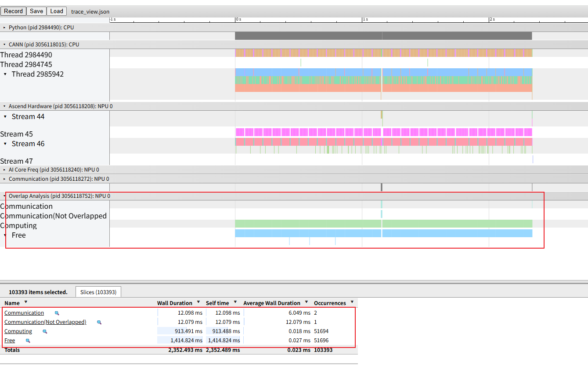
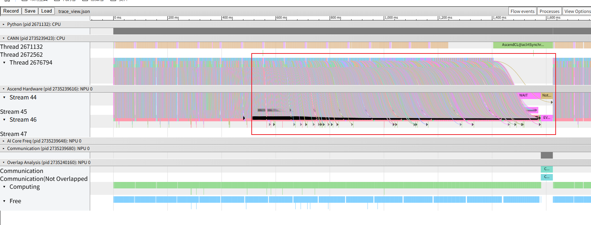
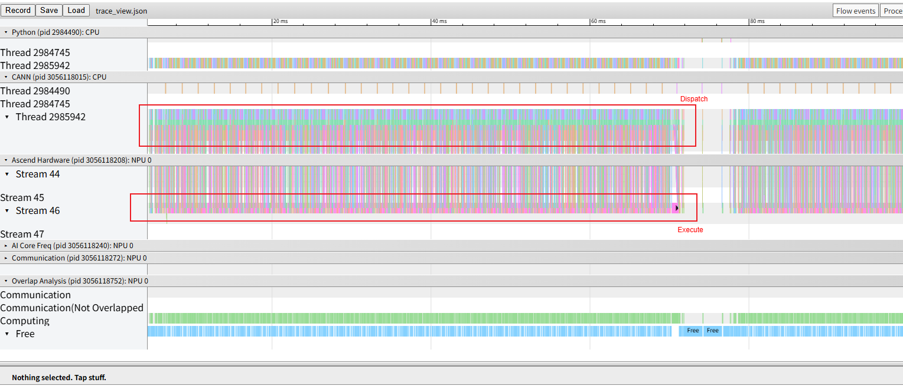
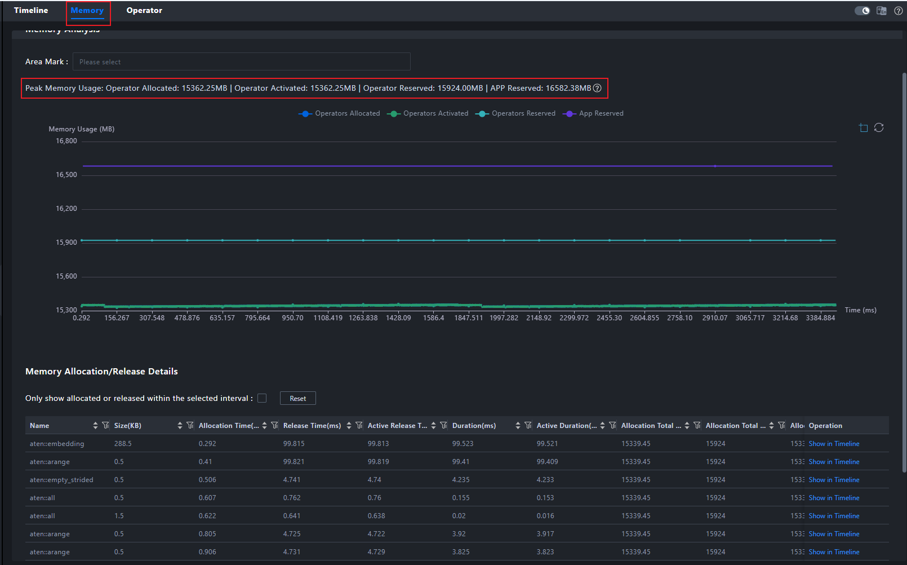

# 1. Background

During NPU workload execution, the execution time is longer than expected. Analysis of the collected profile data confirms that task dispatch is slow and overall hardware utilization is low, indicating an urgent need to identify the issue and optimize performance.

# 2. Source

Performance profiling.

# 3. Symptoms

Open `msprof.json` or `trace_view.json` in MindStudio Insight. The overall workload has a relatively high proportion of idle time and low hardware resource utilization.

# 4. Troubleshooting Process

First, the **CANN** track represents the API dispatch interface layer of the CANN software stack, while the **Ascend Hardware** track represents the actual operator execution layer. For the overall workload, a reasonable dispatch and execution pattern should consist of rapid API dispatch and sustained, high-density hardware execution. This relationship can be observed through the `host_to_device` connections provided by the Profiler. In an efficient execution timeline, the connections should be slightly inclined, indicating efficient utilization of hardware resources, as shown below.

However, the current connections are vertical, indicating that each operator starts executing immediately after being dispatched, followed by a wait for the next operator to be dispatched. This further indicates that there is significant room for improving hardware utilization, as shown below.

We also checked the overall memory usage of the workload and found that it was only 15 GB, while the NPU has 64 GB of memory. This indicates that the workload can fully support a larger batch size, thereby increasing the computation workload of individual operators. By increasing operator execution time, hardware resource utilization can be improved to achieve a more efficient dispatch pattern and avoid resource waste.

# 5. Root Cause

The root cause is insufficient utilization of hardware resources, resulting in a certain degree of resource waste. The execution timeline, `host_to_device` connections, and memory data provided by the Profiler can intuitively present the current workload bottlenecks and resource utilization. They can also guide further workload adjustments, such as increasing the batch size, to improve overall workload performance.

# 6. Methodology Summary

1. Use visualization tools to identify the dispatch and execution relationship between the host and device from the timeline perspective, and use this as a basis to determine whether low resource utilization is introduced at the dispatch layer or the execution layer.

2. Analyze resource utilization based on memory usage and other data to further determine the direction for workload adjustments.

3. Increase resource utilization by adjusting the batch size based on the goal of increasing the computation workload of individual operators, thereby improving workload performance and making full use of available resources.

# 7. Tool Improvement Suggestions

Consider adding detection of memory and dispatch bottlenecks to Advisor and providing recommendations for adjusting relevant workload parameters.
