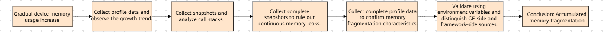
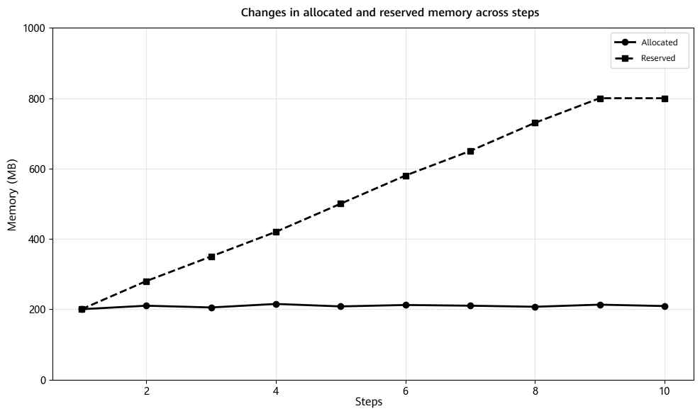
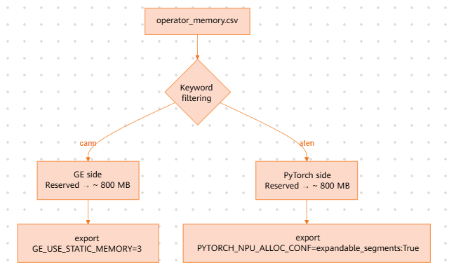
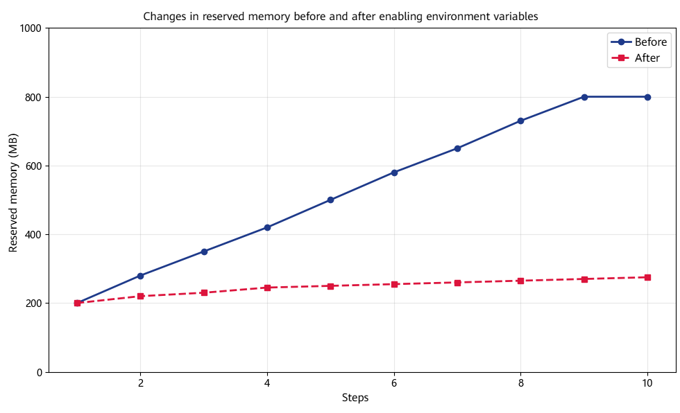
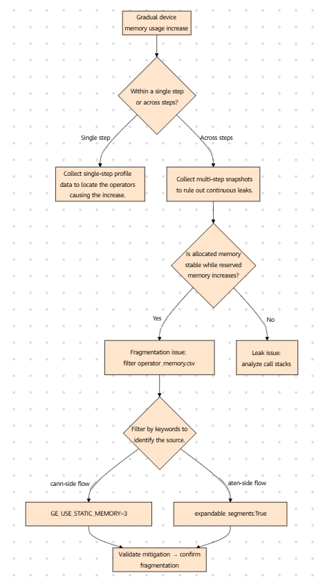

# Memory Fragmentation Analysis

## Background

In service-based inference scenarios, device memory usage does not necessarily increase sharply over a short period. Instead, it may gradually increase over an extended period. Such issues may be caused by memory leaks at the code level or by the accumulation of memory fragmentation on the framework side or the GE side.

This case summarizes the troubleshooting process for gradually increasing device memory usage based on `torch_npu.profiler` data.

<div align="center"></div>
<div align="center"><b>Figure 1</b> Overview of the troubleshooting process for gradually increasing device memory usage</div>

## Symptoms

During `qwen cosyvoice2` inference, device memory usage begins to increase gradually after several graph inference runs, increasing by more than 10 MB after each run and resulting in an OOM error after approximately 10 hours. The issue cannot be reproduced on GPUs and occurs only on NPUs.

Based on the symptoms, the issue appears to be a memory leak that occurs after long-term operation. However, according to user feedback, device memory usage continues to increase even after `empty_cache` is enabled.

## Troubleshooting Process

### 1. Collecting Profile Data Across Steps and Checking Allocated and Reserved Trends

When the initial profiling covers only a single step, it is not possible to determine whether the increase occurs within a step or accumulates across steps. Therefore, expand the profiling range to cover multiple consecutive inference steps and enable memory statistics.

**Profiling configuration**:

```python
with torch_npu.profiler.profile(
    activities=[torch_npu.profiler.ProfilerActivity.CPU, torch_npu.profiler.ProfilerActivity.NPU],
    schedule=torch_npu.profiler.schedule(wait=1, warmup=1, active=10, repeat=1),
    on_trace_ready=torch_npu.profiler.tensorboard_trace_handler(output_dir),
    profile_memory=True,
    with_stack=True,
):
    ...
```

Parameters:

- `profile_memory=True`: Enables memory data collection. After collection is complete, `operator_memory.csv` is generated under `output_dir`, recording memory metrics such as `allocated`, `reserved`, and `active` for each operator execution.
- `with_stack=True`: Records the call stack for memory allocations to facilitate tracing the source of memory allocations.
- `schedule`: Ensure that `active` covers multiple consecutive inference steps so that changes in `allocated` and `reserved` across steps can be observed.

After data collection is complete, focus on the timeline and `operator_memory.csv` to determine the trends in `allocated` and `reserved`.

Analysis of profile data across multiple steps shows:

- `allocated` remains largely unchanged.
- `reserved` continues to increase.

<div align="center"></div>
<div align="center"><b>Figure 2</b> Changes in allocated and reserved memory across multiple steps</div>

> `allocated` (memory actually used by operators) remains stable, ruling out continuous memory leaks on the operator side. `reserved` (physical memory held by the memory pool) continues to increase, indicating that the allocator is holding an increasing amount of memory but cannot release it. This is a **typical characteristic of memory fragmentation**.

### 2. Filtering `operator_memory.csv` to Distinguish GE-Side and Framework-Side Sources

After confirming that the issue is related to memory fragmentation, further identify the source of the fragmentation through `operator_memory.csv`:

- Use the `cann` keyword to filter GE-side memory. `reserved` gradually increases to approximately 800 MB.
- Use the `aten` keyword to filter PyTorch-side memory. `reserved` also gradually increases to approximately 800 MB.

<div align="center"></div>
<div align="center"><b>Figure 3</b> Filtering GE-side and framework-side sources using keywords in operator_memory.csv</div>

### 3. Validating Fragmentation Characteristics Using Environment Variables

Enable fragmentation mitigation environment variables on the GE side and the framework side separately for validation:

```bash
export GE_USE_STATIC_MEMORY=3
export PYTORCH_NPU_ALLOC_CONF=expandable_segments:True
```

The results show that the increase in device memory usage is significantly mitigated in short-sequence scenarios, indicating that the issue is mainly caused by the accumulation of fragmentation on both the GE side and the framework side rather than a traditional continuous memory leak.

<div align="center"></div>
<div align="center"><b>Figure 4</b> Comparison of reserved memory before and after enabling environment variables</div>

> After both environment variables are enabled, the increase in `reserved` is significantly suppressed, with the increase reduced from approximately 600 MB to approximately 75 MB.

## Conclusions

1. In short-sequence scenarios, the issue is mainly caused by continuous accumulation of memory fragmentation rather than a traditional code-level memory leak.
2. When `allocated` remains largely unchanged while `reserved` continues to increase, memory fragmentation should be investigated first.
3. Filtering `operator_memory.csv` allows GE-side and framework-side sources of the increase to be quickly distinguished.
4. After enabling `GE_USE_STATIC_MEMORY=3` and `PYTORCH_NPU_ALLOC_CONF=expandable_segments:True`, the increase in `reserved` memory in short-sequence scenarios can be significantly mitigated.

## Methodology Summary

<div align="center"></div>
<div align="center"><b>Figure 5</b> Decision flow for the memory fragmentation troubleshooting methodology</div>

1. First collect profile data covering multiple steps and compare the trends of `allocated` and `reserved` across steps.
2. When `allocated` remains stable while `reserved` continues to increase, investigate memory fragmentation first.
3. Filter `operator_memory.csv` using relevant keywords to distinguish GE-side and framework-side sources.
4. Use environment variables for validation to quickly determine whether the issue can be mitigated by the corresponding environment variables.

## Suggestions for Tool Improvements

- Add dedicated troubleshooting capabilities for GE-side memory fragmentation.
- Provide a more intuitive way to distinguish the causes of increases in `allocated` and `reserved`.
- Enhance automatic root-cause attribution for `operator_memory.csv`.
