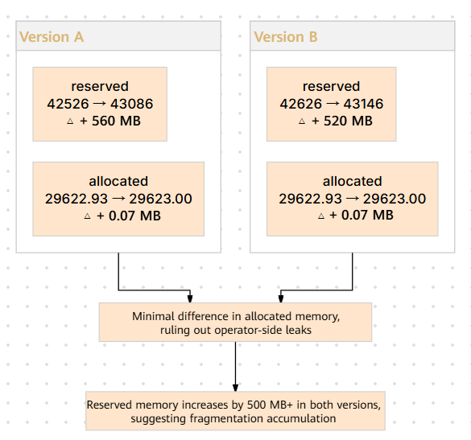
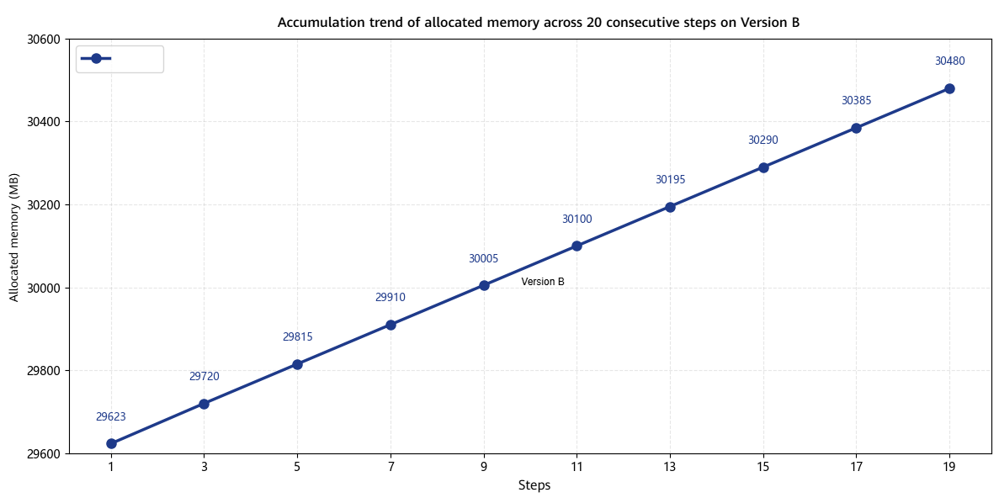
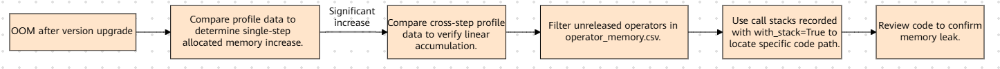

# Memory Leak Analysis

## Background

**Source**  
CANN package version upgrade (from Version A to Version B), inference scenario.

**Symptoms**  
The issue can be reproduced consistently. After Version B has been running for approximately 12 hours, an OOM occurs at the 471st step. The issue does not occur on Version A or on the GPU. It is occurs only on the NPU with Version B. It has been confirmed that virtual memory is enabled.

## Troubleshooting Process

### Step 1: Comparing Memory Profile Data for a Single Step Across the Two Versions

**Time**: 4.10 (approximately 1 day)

**Current status and analysis**: Version B encounters an OOM after 471 steps. Profile data collected during the second execution step of both versions has been obtained, and the memory behavior of a single step needs to be compared between the two versions.

**Collection configuration**

When using `torch_npu.profiler` to collect memory data, enable the following key parameters:

```python
with torch_npu.profiler.profile(
    activities=[torch_npu.profiler.ProfilerActivity.CPU, torch_npu.profiler.ProfilerActivity.NPU],
    schedule=torch_npu.profiler.schedule(wait=1, warmup=1, active=10, repeat=1),
    on_trace_ready=torch_npu.profiler.tensorboard_trace_handler(output_dir),
    profile_memory=True,
    with_stack=True,
):
    ...
```

Parameters:

- `profile_memory=True`: Enables memory data collection. After collection is complete, `memory_record.csv` is generated in `output_dir`, recording memory snapshot metrics such as `allocated` and `reserved` at the start and end of profiling. `operator_memory.csv` is also generated to record memory allocation and release details for each operator.
- `with_stack=True`: Records call stacks to facilitate tracing the source of memory that has not been released.
- `schedule`: Ensure that `active` covers the target step (for example, the second execution step in the comparison of Versions A and B in this case) so that the collection ranges are consistent between the two versions.

**Actions**: Compare the `allocated` and `reserved` memory at the start and end of profiling in the two sets of profile data.

First, examine the `memory_record.csv` files for the two versions and compare the memory states at the start and end of profiling.

| Version | Memory at Profiling Start | Memory at Profiling End | Increase in `allocated` |
| --- | --- | --- | --- |
| Version A | `allocated`: 29622.93 MB / `reserved`: 42526 MB | `allocated`: 29623.02 MB / `reserved`: 43086 MB | + 0.09 MB |
| Version B | `allocated`: 29622.93 MB / `reserved`: 42626 MB | `allocated`: 29670.15 MB / `reserved`: 47890 MB | **+ 47.22 MB** |

<div align="center"></div>
<div align="center"><b>Figure 1</b> Comparison of memory at the start and end of profiling between versions A and B</div>

Analysis conclusions:

- The `allocated` increase for a single step on Version A is only 0.09 MB, which is a normal minor fluctuation. The memory is essentially fully released after the step ends.
- The net increase in `allocated` for a single step on Version B is approximately 47 MB, indicating that some memory is not released within a single step. This is a **typical characteristic of a memory leak**.
- If approximately 47 MB is leaked per step, approximately 22 GB will accumulate after 471 steps, which is sufficient to cause an OOM.

### Step 2: Collecting Profile Data for Multiple Steps to Confirm the Cumulative Leak Trend

**Time**: 4.10 (completed in parallel with Step 1)

**Current status and analysis**: A leak of approximately 47 MB has been identified in a single step. It is necessary to confirm whether the leak accumulates linearly across steps.

**Actions**: Expand the `active` coverage of profiling, continuously collect profile data for 20 steps, and observe the cross-step trend of `allocated`.

<div align="center"></div>
<div align="center"><b>Figure 2</b> Linear accumulation trend of allocated memory across multiple steps on Version B</div>

> `allocated` increases nearly linearly with the step number, with a net increase of approximately 47 MB per step, confirming that the leak continues to accumulate rather than being an anomaly in a single step.

### Step 3: Locating the Leak Source Using Call Stacks

**Time**: 4.11 (approximately 1 day)

**Current status and analysis**: After confirming that the leak continues to accumulate, it is necessary to identify the specific operator or code path causing the leak.

**Actions**: Analyze the memory allocation and release records of each operator in `operator_memory.csv`, and use the call stacks recorded with `with_stack=True` to identify operators whose allocated memory is not released.

After filtering `operator_memory.csv`, the following was found:

- The `aten::empty` operator allocated approximately 47 MB of memory, but no corresponding release operation was recorded throughout the profiling period.
- The call stack shows that the `aten::empty` operation originated from an intermediate tensor allocation inside the `custom_attention_forward` operator.

Further code review revealed that the KV-cache implementation of `custom_attention_forward` in Version B has a reference counting issue: after the intermediate tensor is referenced internally by the cache, its reference count on the Python side is not decremented correctly. As a result, the tensor is not released by Python after the step ends and accumulates in the memory pool.

## Root Cause

The KV-cache implementation of the `custom_attention_forward` operator in Version B has a reference counting error, causing the intermediate tensor generated in each step (approximately 47 MB) to remain unreleased and continuously accumulate in device memory. After 471 steps, the accumulated memory leak reaches approximately 22 GB, triggering an OOM.

This issue is an operator bug: the KV-cache improperly manages references to intermediate tensors. This failure mode should be added to the failure mode library.

## Summary of the Troubleshooting Methodology

<div align="center"></div>
<div align="center"><b>Figure 3</b> Methodology for locating memory leaks</div>

1. For an OOM that occurs after a version upgrade, first compare the `allocated` increase for a single step between the new and old versions. If the increase is significant (>10 MB), investigate for a memory leak directly; if the increase is minor, switch to fragmentation analysis.
2. After confirming a leak in a single step, expand the profiling range to verify the accumulation trend across steps and rule out a one-time anomaly.
3. Filter operators with mismatched allocation and release records in `operator_memory.csv`. Then, use call stacks recorded with `with_stack=True` to locate the specific code path.

## Suggestions for Improving the Tools

- `operator_memory.csv` currently requires manual comparison of allocation and release records to identify operators with memory leaks. Add automatic identification and annotation of "unreleased operators."
- Enhance the profiler to automatically generate an `allocated` trend chart across steps to make cumulative memory leaks easier to identify.
- Add operator-level memory lifecycle tracking to the profiler, automatically associate allocations with releases, and directly flag abnormal memory behavior.
