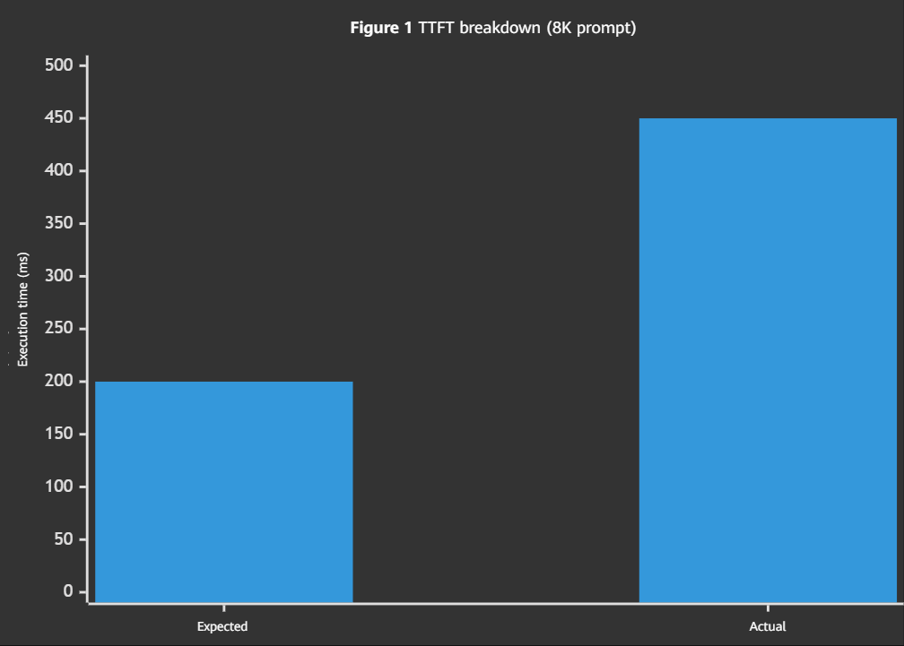
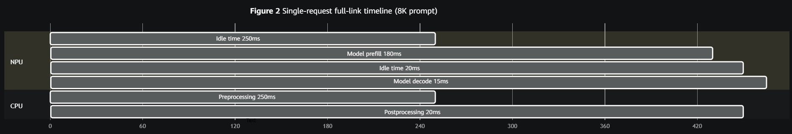
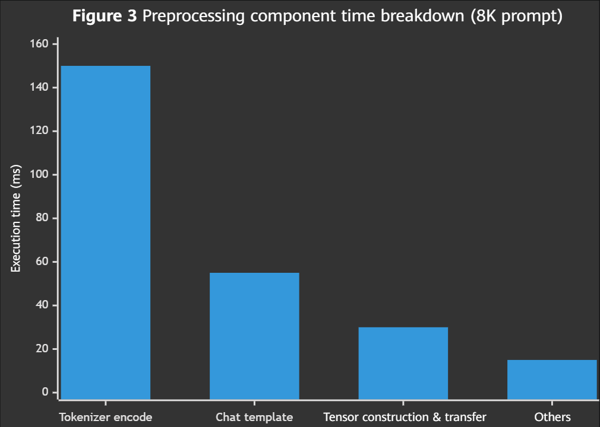
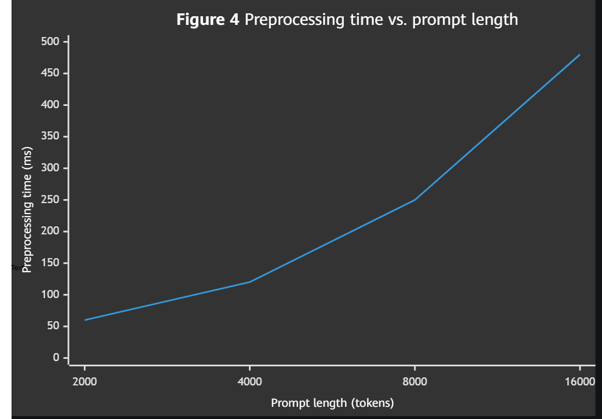

# Analysis of Excessive Preprocessing and Postprocessing Time in Model Inference

## Background

A request in a foundation-model inference service can be divided into three stages: preprocessing (Tokenizer encoding), model inference (prefill + decode), and postprocessing (Detokenizer decoding). Preprocessing and postprocessing are performed on the CPU and involve text encoding/decoding, special token processing, chat template rendering, and other operations. When the input prompt is long (>10,000 tokens) or the service is handling a multi-turn conversation, CPU time spent on preprocessing and postprocessing may exceed model inference time and become the primary bottleneck for end-to-end latency.

The user reported that a conversational model service was deployed on an A2, with a time to first token (TTFT) of approximately 450 ms. Model prefill took approximately 180 ms, suggesting that preprocessing was taking too long. Service-based profiling was required to locate the specific bottleneck.

## Symptoms

The issue can be reproduced consistently. For a single prompt containing 8,000 tokens:

- TTFT is approximately 450 ms, significantly higher than the expected ~200 ms.
- The NPU has a noticeable idle waiting period of approximately 250 ms after the request arrives, during which no computation activity occurs.
- As the prompt length increases, the proportion of idle time in TTFT also increases: approximately 60 ms of idle time for a 2,000-token prompt and approximately 250 ms for an 8,000-token prompt.
- Under concurrent requests, significant queuing occurs during preprocessing and postprocessing: preprocessing of subsequent requests must wait for postprocessing of preceding requests to complete before it can start.

> The actual TTFT is 450 ms, of which model prefill takes only 180 ms, preprocessing takes approximately 250 ms, and postprocessing takes approximately 20 ms. Preprocessing and postprocessing together account for 60% of TTFT.

## Troubleshooting Process

### 1. Collecting Global Profile Data Using `msServiceProfiler`

Use **`msServiceProfiler`** to collect comprehensive profile data from the service and obtain the distribution of time spent across all stages of the end-to-end request flow.

### 2. Performing Visual Analysis

Use `MindStudio Insight` to import the parsed profile data.

Key analysis steps:

#### 2.1 Viewing the End-to-End Timeline of a Single Request

View the complete process from request arrival to the output of the first token as a timeline. A CPU preprocessing interval is visible before model prefill and includes the following operations:

- Chat template rendering: Applies the conversation template to the original text.
- Tokenizer encoding: Converts the text into a sequence of token IDs.
- Input tensor construction and transfer: Copies the token IDs to the device.

A CPU postprocessing interval also exists after prefill is completed:

- Detokenizer decoding: Converts the first output token ID into text.

> Preprocessing takes 250 ms, accounting for 55.6% of TTFT, during which the NPU remains completely idle. Although postprocessing takes only 20 ms, the cumulative overhead can be significant in streaming output scenarios because detokenization is required for every token.

#### 2.2 Analyzing the Time Spent on Each Preprocessing Stage

Filter the preprocessing-related functions from the exported CSV files and sort them by execution time.

Key findings:

- Tokenizer encoding accounts for the largest proportion of execution time (approximately 60%). An 8,000-token prompt requires approximately 150 ms for character-by-character encoding.
- Chat template rendering takes approximately 55 ms (22%), involving string concatenation and special token insertion.
- Tensor construction and host-to-device transfer take approximately 30 ms (12%).
- Other operations, such as parameter validation and memory pinning, take approximately 15 ms (6%).

Analyze further how preprocessing time varies with prompt length:

> Preprocessing time increases approximately linearly with prompt length, indicating that Tokenizer encoding is the primary bottleneck and that parallel tokenization or caching optimization has not been adopted.

## Root Cause

During preprocessing, Tokenizer encoding encodes the entire prompt character by character without caching. In multi-turn conversation scenarios, the fixed system prompt is re-encoded for every request, causing preprocessing time to increase linearly with prompt length. For an 8,000-token prompt, preprocessing takes approximately 250 ms, accounting for 55.6% of TTFT, while the NPU remains completely idle during this period.

This issue is a **service pipeline configuration issue**: Tokenizer caching is not enabled, and preprocessing and postprocessing share CPU threads with model inference, blocking NPU scheduling. This failure mode should be added to the failure mode library.

## Conclusion

1. The root cause of excessive preprocessing time is that Tokenizer encoding does not use caching. The entire prompt is re-encoded for every request, taking approximately 150 ms for an 8,000-token prompt.
2. The entire preprocessing and postprocessing flow runs on the CPU, causing the NPU to remain idle for approximately 270 ms (250 ms for preprocessing + 20 ms for postprocessing), accounting for 60% of TTFT.
3. Preprocessing time increases linearly with prompt length. For a 16,000-token prompt, preprocessing takes approximately 480 ms, nearly matching the prefill time.
4. Optimization directions: Enable Tokenizer caching so that the system prompt is encoded only once; use a Rust/C++-based Tokenizer to bypass the Python GIL; and deploy preprocessing and postprocessing on separate threads or processes from model inference to avoid blocking NPU scheduling.

## Summary of the Troubleshooting Methodology

1. When TTFT is abnormally high, first use `msServiceProfiler` to collect the end-to-end timeline and determine whether a CPU idle interval exists before prefill.
2. Use MindStudio Insight to identify the proportion of execution time spent in each preprocessing stage, including Tokenizer encoding, chat template rendering, and tensor transfer.
3. Compare preprocessing time at different prompt lengths to determine whether it increases linearly.
4. Compare preprocessing time between cold and warm requests to determine whether Tokenizer caching is effective.
