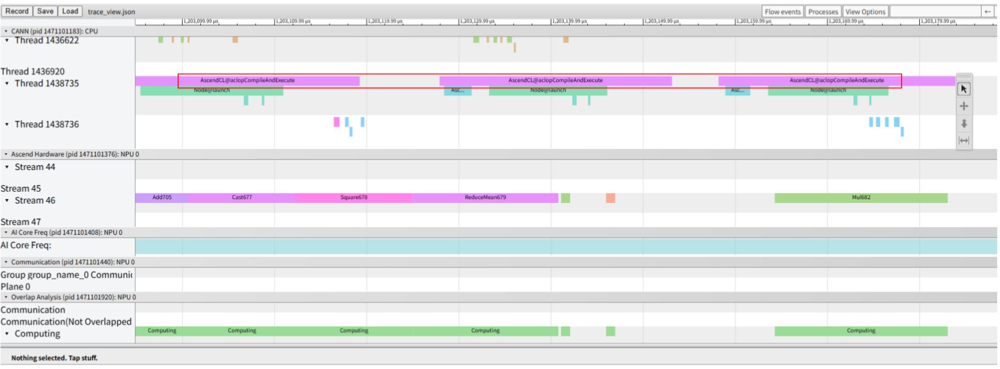
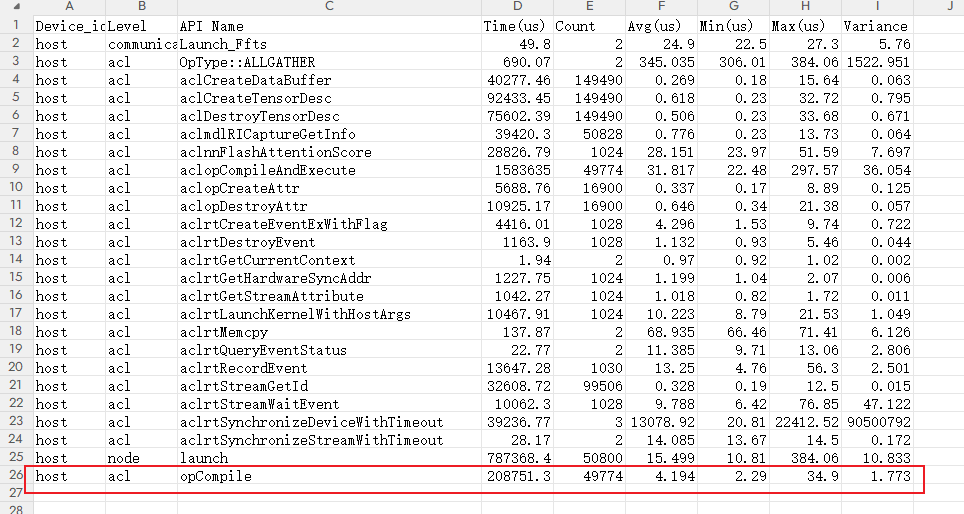
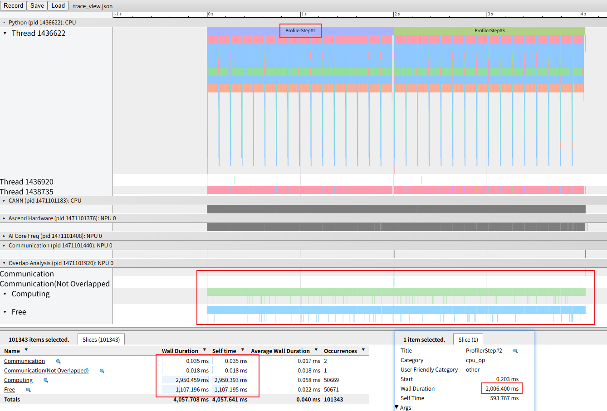
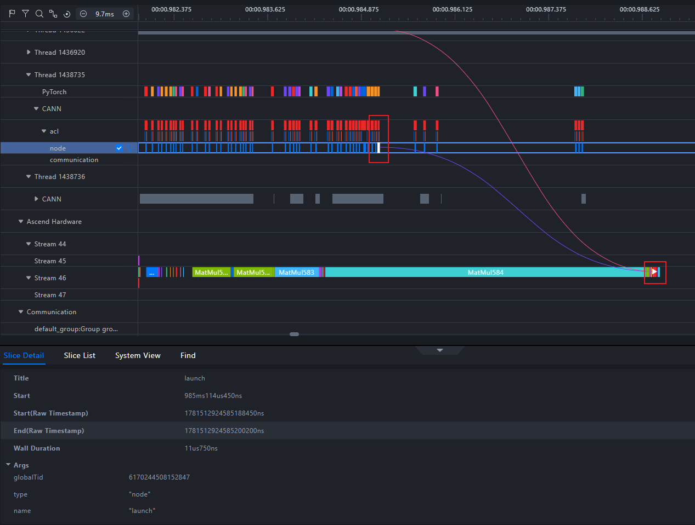
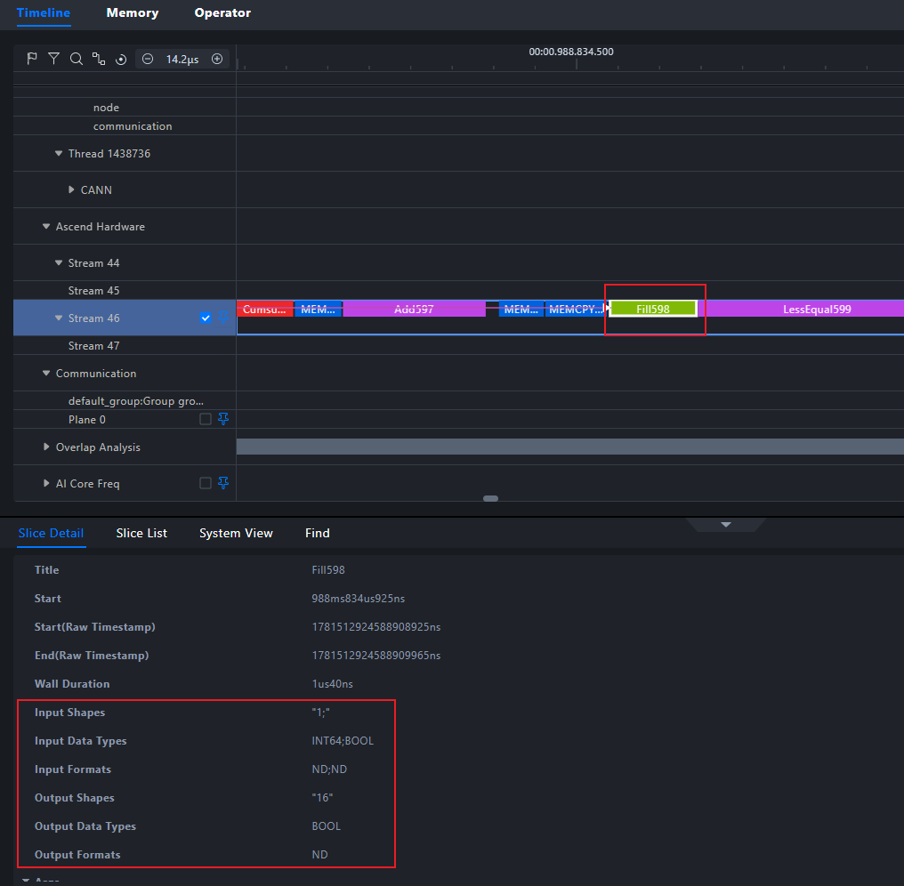
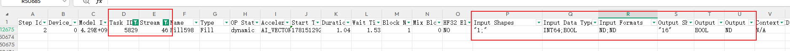

# 1. Background

During NPU workload execution, the workload execution time is longer than expected. Profiling data confirms that a significant number of operators have long compilation durations, requiring prompt troubleshooting and performance optimization.

# 2. Source

Performance tuning.

# 3. Symptoms

As shown in the figure, the typical operator compilation API can be identified by searching for the keyword `aclopCompile`.

For the current test case, the `api_statistic.csv` deliverable can be used to determine the number of relevant compilation API calls made during this collection. An additional operator compilation step is introduced into the overall operator invocation flow. Frequent and extensive operator compilation may increase host dispatch time, which in turn may increase gaps between operator executions on the NPU and reduce overall execution efficiency.

As shown in the figure below, the duration of Step 2 is approximately 2s. Meanwhile, according to the overall overlap statistics, the computation time is 2.95s and the idle time is 1.1s. The idle time accounts for 22% of the total time.

# 4. Root Cause

To address the Host Bound issue introduced by operator compilation, the first step is to clarify the scenarios that trigger operator compilation. This provides a basis for reviewing the overall operator invocation flow and facilitates subsequent troubleshooting.

Operator compilation is essentially a compilation mode provided to enable users to execute AI workloads on the CANN software stack. Because most users have the `ops` package installed, `aclopCompile` essentially serves as a fallback mechanism to ensure that workloads can run successfully under various circumstances.

As part of the overall CANN software stack, the `ops` package provides users with built-in Ascend executable operator binaries. These binaries include precompiled operators that cover most scenarios.

Therefore, under normal circumstances, when an invoked operator meets the expected conditions, the operator is executed using the binaries provided in the `ops` package. Operator compilation is triggered only when those conditions are not met.

However, in exceptional circumstances, such as when using an older version of the CANN package, when the `ops` package is not installed, or when `torch_npu.npu.set_compile_mode(jit_compile=True)` is incorrectly enabled, the binary execution path is bypassed and operator compilation is forcibly triggered by default. This results in a large number of compilation operations.

# 5. Troubleshooting Process

Open `msprof.json` or `trace_view.json` in Insight. Use the linking capability to identify the relationship between the compilation API and the actual operator execution, and locate the corresponding operators.

1. If all operators are found to invoke compilation, this is typically because `torch_npu.npu.set_compile_mode(jit_compile=True)` is configured in the workload, or because the `ops` package is not installed, forcing operator compilation. Check whether the switch has been incorrectly enabled or whether the required dependencies have been installed correctly.

2. If only some operators invoke compilation, check the shapes of the relevant operators to determine whether they use relatively uncommon shapes. Such operators may not be covered by the generalized scenarios supported by the `ops` package, causing the fallback compilation mechanism to be triggered. In this case, a general-purpose, high-performance implementation can be manually developed for the operator and integrated into the current use case. Alternatively, the overall workload logic can be modified to avoid the uncommon shape scenario.

# 6. Summary of the Troubleshooting Methodology

1. Use a visualization tool to identify compilation APIs and their relationships with the corresponding operators in the Timeline.

2. Determine the scope of operators affected by compilation to identify the appropriate troubleshooting direction.

3. If all operators are affected, check the overall configuration and environment. If only some operators are affected, check whether their shapes are uncommon and mitigate the issue by implementing optimized versions of the operators independently or modifying the workload behavior.

4. In addition, use the expert recommendations provided by `msprof-analyze` to perform an overall analysis of the data and identify the issues described above.

# 7. Suggestions for Improving the Tools

None.
