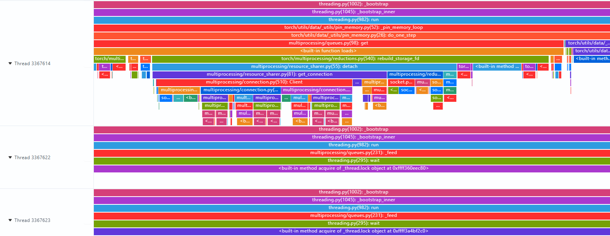

# Pthread Lock Wait

## Background

In distributed training scenarios for large PyTorch models, the [`DataLoader` and `pin_memory`](https://docs.pytorch.org/docs/2.12/data.html#torch.utils.data.DataLoader) modules use a multithreaded producer-consumer model and rely on pthread mutexes (`pthread_mutex_t`) to protect concurrent access to shared queues.

The training runs on a multi-NPU server, with a data loading thread pool configured with 16 worker threads. The main thread retrieves data from the queue and feeds it to the NPU for computation. As the batch size increases and data preprocessing becomes more complex, training performance degrades.

## Source

Training

## Symptoms

The issue can be consistently reproduced.

1. Computation bottleneck:

   - NPU utilization decreases, and device idle time increases while the NPU waits for computation tasks to be dispatched from the host.
   - The time per training step increases, resulting in lower overall training throughput.

2. System-level symptoms:

   - Overall CPU utilization is not high, but clear lock wait characteristics are observed.
   - `pidstat -w` shows a high thread context switch frequency.

3. Application-level symptoms:

   - Logs show that actual data preprocessing accounts for only 40% of thread execution time, with the remaining time spent waiting.
   - Increasing the number of worker threads to 32 does not improve performance and instead causes further degradation.

For details, see the following figure.



## Troubleshooting Process

1. Use the `perf` tool for process-level performance sampling.

   - Run `perf record -g -p <pid> sleep 30` to collect profile data for the training process.
   - The performance flame graph shows that `pthread_mutex_lock` accounts for a high proportion of the sampled CPU time.
   - Lock contention mainly occurs during `push` and `pop` operations on the data queue.

2. Use the `strace` tool to trace system calls.

   - Run `strace -tt -T -e futex -p <pid>` to trace `futex` system calls.
   - A large number of `futex(FUTEX_WAIT)` calls are observed, with individual wait durations exceeding 10 ms.

3. Use MSOSRT to collect the execution time of system library functions.

   OSRT stands for OS Runtime Libraries Trace. Its core capability is to collect and trace calls to various user-space library function APIs based on Linux system runtime libraries.

   MindStudio OSRT (MSOSRT) is an OSRT tool provided by MindStudio. It focuses on performance analysis by specifically collecting typical APIs with long execution time in the Linux C standard library and POSIX thread (`pthread`) library, particularly functions such as `read`, `ioctl`, and `pthread_mutex_lock` that may cause user processes to enter a blocking wait state. By collecting the execution time and distribution of these function calls, MSOSRT helps developers quickly locate and analyze the root causes of process blocking.

   Repository: [MSOSRT](https://gitcode.com/Ascend/mstt/tree/poc/profiler/msprof_analyze/osrt_trace)

   **Usage:**

   1. Build the MSOSRT tool.

      Download the source code repository to the local environment and run `bash build.sh` to generate the `libmsosrt_trace.so` library.

   2. Run `export LD_PRELOAD=./libmsosrt_trace.so:$LD_PRELOAD` to add `libmsosrt_trace.so` to the `LD_PRELOAD` environment variable.

   3. Set the environment variables for the detection threshold and output method. Select either real-time printing or file export.

      ```bash
      # Detection threshold. A positive integer. Only library functions whose duration exceeds the threshold are recorded. Unit: ns. Default: 10000000.
      export MSOSRT_TRACE_THRESHOLD=10000000
      # Real-time printing. A positive integer. Set to 1 to print detection results in real time without writing them to a file. Default: 0.
      export MSOSRT_REALTIME_PRINT=1
      # File export. A string specifying the directory for exporting detection results. Default: current directory.
      export MSOSRT_EXPORT_PATH="./osrt_trace_result"
      ```

   4. Run the training process.

   5. If real-time printing is selected, detection results are printed in real time while the user process is running, as shown below:

      ```text
      Pid: 2328177, Tid: 2328280, Function: pthread_cond_wait, StartTime: 1725398310787080000, Duration: 3088062410
      Pid: 2328177, Tid: 2328282, Function: pthread_cond_wait, StartTime: 1725398310787170000, Duration: 3087994240
      Pid: 2328177, Tid: 2328480, Function: read, StartTime: 1725398318916180000, Duration: 100509970
      Pid: 2328177, Tid: 2328440, Function: ioctl, StartTime: 1725398319218640000, Duration: 512040720
      Pid: 2328177, Tid: 2328177, Function: free, StartTime: 1725398330504550000, Duration: 56386880
      ```

   6. If file export is selected, detection results are generated in the directory specified by `MSOSRT_EXPORT_PATH` after the user process exits. The result file is named `msosrt_trace_{process_id}_{process_name}.csv`, such as `msosrt_trace_2328177_python3.csv`. The file contains information such as the process ID (PID), thread ID (TID), function name, start time, and duration, as shown in the following table.

      | Pid | Tid | Function | StartTime(ns) | Duration(ns) |
      | --- | --- | --- | --- | --- |
      | 2328177 | 2328280 | pthread_cond_wait | 1725398310787080000 | 3088062410 |
      | 2328177 | 2328282 | pthread_cond_wait | 1725398310787170000 | 3087994240 |
      | 2328177 | 2328480 | read | 1725398318916180000 | 100509970 |
      | 2328177 | 2328440 | ioctl | 1725398319218640000 | 512040720 |
      | 2328177 | 2328177 | free | 1725398330504550000 | 56386880 |

   The detection results show that `pthread_cond_wait` accounts for a high proportion of the execution time and is the primary cause of lock waits. Meanwhile, `read`, `ioctl`, and other functions also account for high proportions and are the primary contributors to the time spent on data preprocessing. Based on this information, the performance bottleneck in the data preprocessing logic can be identified.

## Root Cause

1. Incorrect lock granularity:

   - The entire data preprocessing process (decoding, augmentation, and normalization) is executed within the critical section instead of acquiring the lock only for queue operations.
   - The lock is held for too long (8 ms on average), preventing other worker threads from enqueueing data and effectively serializing execution.

2. Improper lock type configuration:

   - The default `PTHREAD_MUTEX_TIMED_NP` type is used, resulting in significant performance degradation under high contention.
   - `PTHREAD_MUTEX_ADAPTIVE_NP` adaptive locking is not enabled, resulting in excessive futex waits in kernel space.

## Summary of the Troubleshooting Methodology

For thread lock wait scenarios, prioritize the following troubleshooting steps:

1. First, use the lock analysis capabilities of `perf`.

   - Run `perf record` to quickly determine whether lock contention exists and identify the lock objects experiencing the most severe contention.
   - Generate a flame graph and examine the CPU proportions of `pthread_mutex_lock` and `pthread_cond_wait`. A high proportion may indicate a thread lock issue.

2. Use the `MSOSRT` tool for detailed analysis.

   - Use the `MSOSRT` detection results to identify `pthread_cond_wait` as the primary cause of lock waits.
   - Analyze functions such as `read` and `ioctl`, which account for high proportions and are the primary contributors to the time spent on data preprocessing.

## Suggestions for Improving the Tools

1. Enhance `msprof` by integrating `perf`.

   - Integrate `perf` into `msprof` so that lock detection can directly output statistics on lock hold time, rather than only wait time.
   - Add call stack tracing for lock contention to directly show which function path holds the lock for the longest time.

2. Add a lock contention visualization tool.

   - Provide real-time monitoring of the lock wait queue length.
   - Provide a dependency graph showing relationships between lock holders and waiters.
