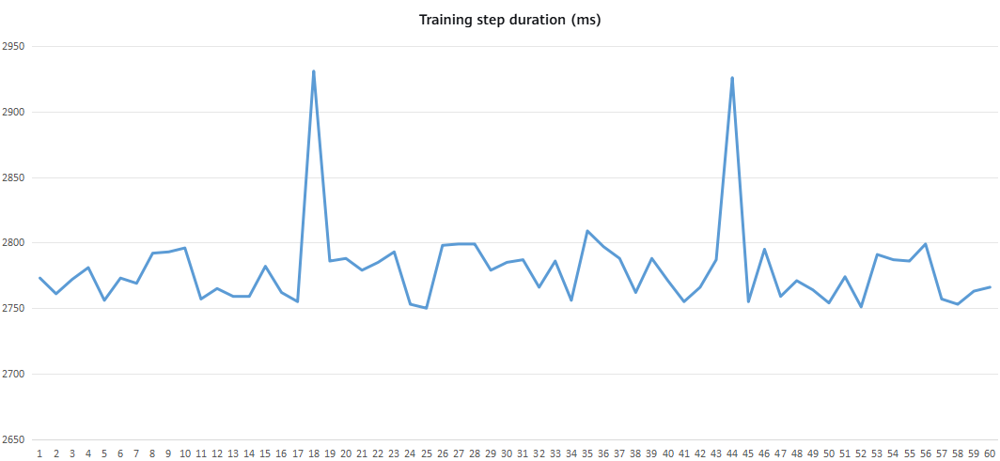
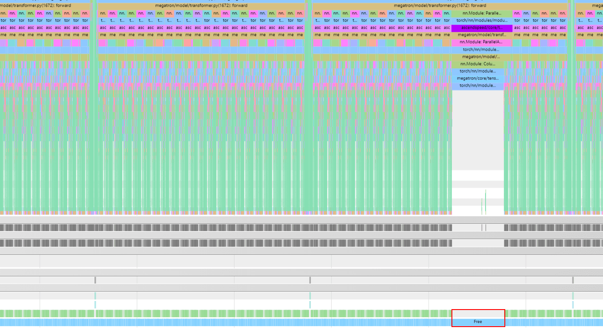
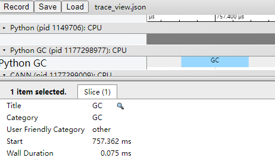
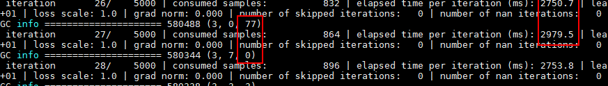

# High Python GC Overhead

## Background

During GPT-like LLM training in a multi-node distributed environment, the customer observed frequent performance jitter.

## Source

Training

## Symptoms

The issue can be reproduced consistently. Long-running analysis shows that the training step duration across nodes exhibits highly consistent fluctuation patterns and frequencies. The duration periodically fluctuates between approximately 2770 ms and 2900 ms, as shown in the following figure.



## Troubleshooting Process

1. Use the Ascend PyTorch Profiler with GC detection enabled to collect and analyze model profile data. The analysis shows that, in the abnormal steps where training duration fluctuates, a significant `free` duration is observed on the timeline. This `free` operation occurs in a Python function call stack on the framework side and is not directly associated with NPU hardware execution or HCCL communication operators. After multiple profiling sessions and cross-validation, the abnormal `free` duration is consistently observed in the execution path of the same `nn.Module`, and a GC event is detected during the same period.

   Use the following configuration:

   ```python
   import torch_npu
   experimental_config = torch_npu.profiler._ExperimentalConfig(
       profiler_level=torch_npu.profiler.ProfilerLevel.Level0,
       aic_metrics=torch_npu.profiler.AiCMetrics.AiCoreNone,
       data_simplification=False,
       gc_detect_threshold=1,    # Enable GC detection and set the GC detection threshold to 1 ms
   )

   # Add the basic profiling configuration parameters. For details, see the parameter descriptions below.
   with torch_npu.profiler.profile(
       activities=[
           torch_npu.profiler.ProfilerActivity.CPU,
           torch_npu.profiler.ProfilerActivity.NPU
       ],
       schedule=torch_npu.profiler.schedule(wait=0, warmup=0, active=1, repeat=1, skip_first=0),    # Used together with prof.step()
       on_trace_ready=torch_npu.profiler.tensorboard_trace_handler("./result"),
       experimental_config=experimental_config) as prof:

       # Start profile data collection.
       for step in range(steps):    # Training iterations
           train_one_step()         # Training function
           prof.step()              # Used together with schedule
   ```

   The profile data is shown in the following figures.

   

   

2. Print the Python GC count.

   Print the Python GC count at each training step. The Python GC count increases significantly in abnormal steps, resulting in fluctuations in training duration.

   ```python
   import gc
   print(gc.get_count())
   ```

   The results are shown in the following figure.

   

3. Manually disable Python GC.

   Disable Python GC before starting model training.

   ```python
   import gc
   gc.disable()
   ```

   Result: The performance jitter is eliminated.

4. Adjust the Python GC thresholds.

   Adjust the Python GC thresholds before starting model training. For details, see the [Python GC thresholds](https://docs.python.org/3/library/gc.html#gc.set_threshold) documentation.

   ```python
   import gc
   gc.set_threshold(700, 10, 1000)
   ```

   Result: The performance jitter persists but occurs less frequently.

## Root Cause

As an interpreted language, Python uses an interpreter implemented in C to parse and execute bytecode instructions. In Python's memory management mechanism, each object maintains a reference count to track whether it is referenced. When an object's reference count reaches 0, indicating that the object is no longer referenced, Python immediately reclaims the memory occupied by the object.

However, when Python objects form circular references, such as when A references B and B references A, the reference counting mechanism alone cannot reduce the reference counts of these objects to 0. As a result, the memory occupied by these objects cannot be automatically reclaimed. To address memory leaks caused by circular references, Python provides an automatic garbage collection (GC) mechanism. When the allocation and deallocation counts for a generation exceed its configured threshold, Python automatically triggers a GC event and uses a mark-and-sweep algorithm to identify and release unreachable objects involved in circular references.

It is important to note that GC is a compute-intensive operation that can incur significant execution overhead, and it can block the Python process during execution due to its Stop-the-World behavior. In foundation-model training scenarios, where performance stability is critical, the most typical external symptom of a GC event is a sudden increase in the duration of an individual training step, resulting in significant periodic performance fluctuations throughout the training process.

## Summary of the Troubleshooting Methodology

For this scenario, first use the Ascend PyTorch Profiler to collect model profile data and check whether GC events occur in the timeline. If a GC event is present, analyze its trigger conditions, impact, and duration, and adjust the Python GC thresholds to reduce the frequency of GC events.

## Suggestions for Improving the Tools

None.
