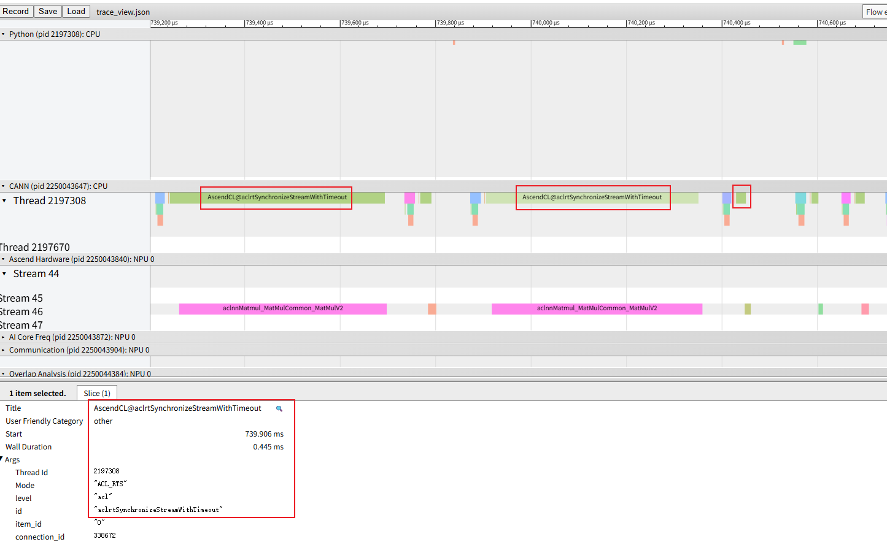
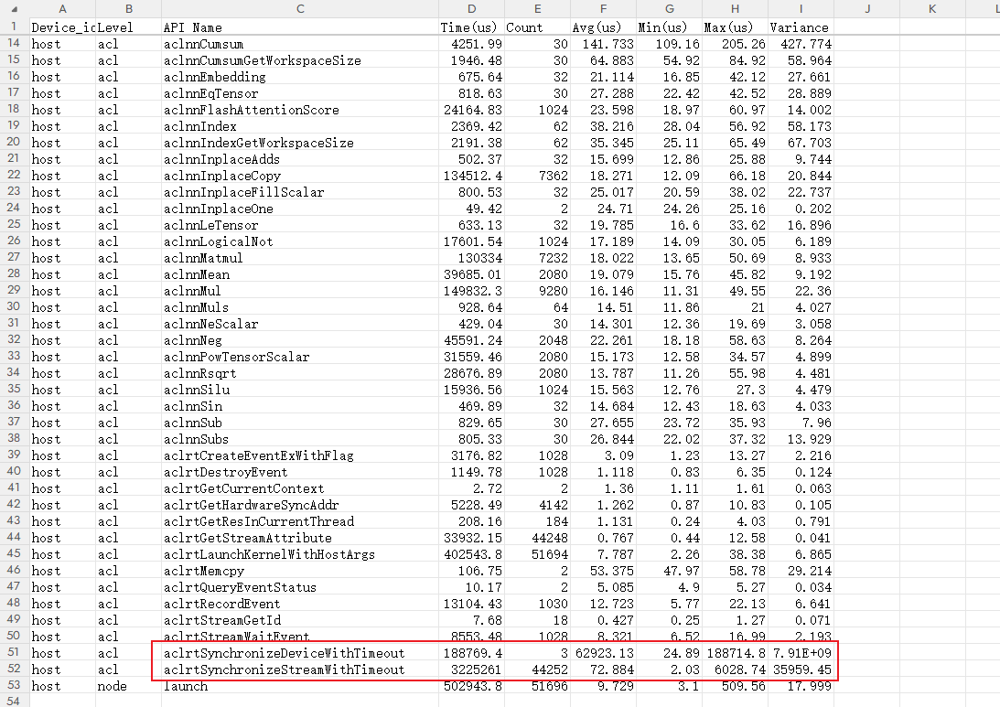

# 1. Background

During NPU workload execution, the execution time does not meet expectations. Profiling data shows a large number of wait operations, such as stream synchronization, requiring further troubleshooting and performance optimization.

# 2. Source

Performance profiling

# 3. Problem Symptoms

Open `msprof.json` or `trace_view.json` using the visualization tool. A large number of operator executions can be observed, often accompanied by synchronization APIs such as `aclrtSynchronizeStreamWithTimeout`.
When a synchronization API is called, no other operators are dispatched. That is, the operator blocks the dispatch of other operators, resulting in low overall NPU utilization and poor performance. For the workload as a whole, asynchronous dispatch allows operators to be continuously dispatched and keeps the workload busy on the device side, thereby making full use of hardware resources. However, a large number of synchronization API calls convert asynchronous operations into synchronous operations, resulting in discontinuous workload execution and lower hardware resource utilization.

# 4. Troubleshooting Process

Open `msprof.json` or `trace_view.json` using MindStudio Insight. A large number of synchronization APIs with names such as "Synchronize" can be observed.

You can also view a large number of API calls in the `api_statistic.csv` output file.

The above information indicates that the workload contains a large number of unexpected stream synchronization operations.

Therefore, use the profiler's stack trace functionality to additionally collect data containing stack information. This allows you to determine, based on the timing information, where the relevant synchronization operations are introduced.

# 5. Root Cause

1. Most stream synchronization operations are introduced manually or by the application logic. Therefore, first check the workload code and evaluate the necessity of the API calls from the perspective of the workload logic. Remove unnecessary synchronization APIs as appropriate.

2. In addition, some stream synchronization operations may be introduced by environment variables. For example, [ASCEND_LAUNCH_BLOCKING](https://gitcode.com/Ascend/pytorch/blob/master/docs/en/api/environment_variable/op_execution/ASCEND_LAUNCH_BLOCKING.md) forces stream synchronization for each operator to facilitate problem troubleshooting.

# 6. Summary of the Troubleshooting Method

1. Open `msprof.json` or `trace_view.json` using MindStudio Insight to identify stream synchronization.

2. Use `api_statistic.csv` to determine the overall number of synchronization API calls and their total execution time, facilitating an assessment of the impact of synchronization APIs on the workload.

3. Use the stack trace functionality to identify the dispatch points of the relevant stream synchronization APIs based on timing information, quickly locate the key code segments, and evaluate the necessity of the synchronization APIs from the perspective of the workload.

4. Finally, use tools such as Advisor to perform a comprehensive check of the data and quickly rule out some less relevant environmental factors.

# 7. Suggestions for Improving the Tools

None
