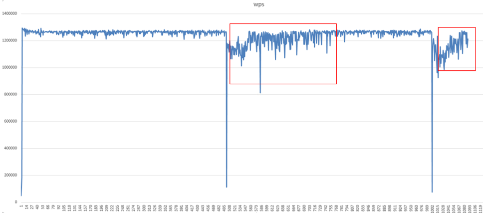
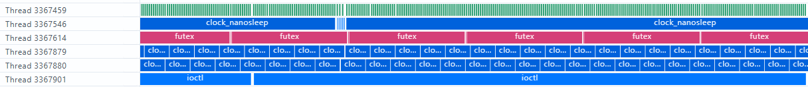

# High-Latency System Calls

## 1. Background

In a foundation-model distributed training scenario, a customer performs multi-node, multi-device model training on a 3,000-NPU cluster. Performance is normal during the initial stage of training. However, when training reaches approximately step 500, saving a checkpoint causes the training step duration to suddenly increase. After 5 to 6 steps, the duration gradually returns to normal. The issue can also be reproduced on other clusters with the same configuration, affecting training efficiency.

## 2. Source

Training

## 3. Symptoms

The issue can be reproduced consistently.

The specific symptoms are as follows:

1. Performance is normal during the first 500 steps after training starts.
2. After step 500, performance decreases by more than 20% when a checkpoint is saved and then gradually recovers.
3. NPU utilization decreases from 95% to 30%, with a large amount of idle time.
4. CPU utilization remains normal, with no obvious bottleneck.
5. Network bandwidth utilization is low, ruling out a communication bottleneck.
6. PyTorch Profiler shows that operator dispatch on the host side becomes significantly slower after the checkpoint is saved, indicating high host-side system-call latency.
7. `strace` tracing shows a large number of `futex`, `ioctl`, `malloc`, and `free` system calls, with the latency of individual calls reaching 10 to 50 ms.

For details, see the following figure.



## 4. Troubleshooting Process

1. Use `strace` to trace system calls.

   - Command: `strace -T -tt -p <pid> -o trace.log`.
   - Statistics show that `futex`, `ioctl`, `malloc`, and `free` system calls account for more than 60% of all system calls.
   - The average latency of a single `futex` call is 15 ms, with a maximum of 52 ms.

2. Use PyTorch Profiler to collect host-side system-call information and perform joint analysis with CANN profiling data.

   Use the following configuration:

   ```python
   import torch_npu

   experimental_config = torch_npu.profiler._ExperimentalConfig(
       profiler_level=torch_npu.profiler.ProfilerLevel.Level0,
       aic_metrics=torch_npu.profiler.AiCMetrics.AiCoreNone,
       data_simplification=False,
       host_sys=[torch_npu.profiler.HostSystem.OSRT],  # Collect process-level system calls
   )

   # Add the basic profiling configuration parameters. For details, see the parameter descriptions below.
   with torch_npu.profiler.profile(
       activities=[
           torch_npu.profiler.ProfilerActivity.CPU,
           torch_npu.profiler.ProfilerActivity.NPU
       ],
       schedule=torch_npu.profiler.schedule(wait=0, warmup=0, active=1, repeat=1, skip_first=0),  # Used with prof.step()
       on_trace_ready=torch_npu.profiler.tensorboard_trace_handler("./result"),
       experimental_config=experimental_config) as prof:
       # Start profile data collection.
       for step in range(steps):  # Training iterations
           train_one_step()       # Training function
           prof.step()            # Used with schedule
   ```

In the `trace_view.json` file generated by Profiler, data in the OS Runtime API track is as shown in the following figure.



Field descriptions

| Field | Description |
| --- | --- |
| Title | The name of the API selected for a component. In this example, `pthread_mutex_unlock` is selected. |
| Start | The timestamp displayed on the timeline. Chrome Trace automatically aligns the timestamps. The unit is ms. |
| Wall Duration | The duration of the current API call. The unit is ms. |

The `os_runtime_statistic_*.csv` file has the following format.

| Device_id | Process ID | Thread ID | Name      | Time(%)     | Time(us)  | Count | Avg(us)   | Max(us) | Min(us) |
| --------- | ---------- | --------- | --------- | ----------- | --------- | ----- | --------- | ------- | ------- |
| host      | 387972     | 3880228   | nanosleep | 0.9852596   | 102468352 | 97090 | 1055.3953 | 1217    | 165     |
| host      | 387972     | 3880215   | ioctl     | 0.0095065   | 989102    | 54    | 18315.074 | 20066   | 388     |
| host      | 387972     | 3880211   | nanosleep | 0.00138659  | 144098    | 2     | 72049.8   | 143954  | 944     |
| host      | 387972     | 3880212   | ioctl     | 0.000701886 | 72995     | 25    | 2919.8    | 8195    | 82      |
| host      | 387972     | 3880213   | malloc    | 0.00069822  | 65990     | 13    | 1919.8    | 6595    | 654     |

Field descriptions

| Field | Description |
| --- | --- |
| Device_id | Device ID. `host` is displayed for host-side data. |
| Process ID | Process ID. |
| Thread ID | Thread ID. |
| Name | API interface name. |
| Time | Proportion of the total time spent in the API. |
| Time(us) | Total time spent in the API. The unit is us. |
| Count | Number of calls to the API. |
| Avg(us), Max(us), Min(us) | Average, maximum, and minimum latency of the API calls. The unit is us. |

As shown above, system calls such as `futex`, `ioctl`, and `pthread_mutex_unlock` have relatively high latency and require further analysis.

## 5. Root Cause

During checkpoint saving, the model performs D2H data transfers totaling approximately 30 GB and occupies a large amount of host memory for an extended period. This triggers kernel memory reclamation and compaction, causing the latency of `malloc` and `free` system calls to increase significantly and slowing down training.

Linux Transparent Huge Pages (THP) automatically combines small memory pages into huge pages to reduce TLB misses and page-table lookup overhead, which can improve memory access efficiency in general scenarios. However, the background page-merging process can trigger memory reclamation and compaction, potentially consuming CPU time from the training workload and affecting training performance.

For foundation-model cluster training with high memory usage, if the system already uses relatively large memory pages by default, the performance benefits of enabling THP may be smaller than the negative impact caused by CPU contention from background threads. Therefore, disabling THP is recommended.

## 6. Summary of the Troubleshooting Methodology

Prioritize using the end-to-end performance analysis capabilities of msProf to collect profile data from the NPU, OS, and CPU levels and perform an end-to-end execution-time breakdown. If a bottleneck is confirmed at the system-call layer, use OS kernel tools such as `strace` and `perf` to trace and sample system calls.

## 7. Suggestions for Improving the Tools

1. Data integration and joint analysis

   In this case, troubleshooting high system-call latency requires comprehensive analysis combining Ascend model profile data with OS kernel data. Currently, the tools operate independently and lack data integration and cross-tool analysis capabilities, making it difficult to efficiently troubleshoot complex issues from an end-to-end perspective. Integrating data from multiple sources and enabling joint analysis is an important direction for future performance diagnostic tools and should be strengthened in subsequent development.
