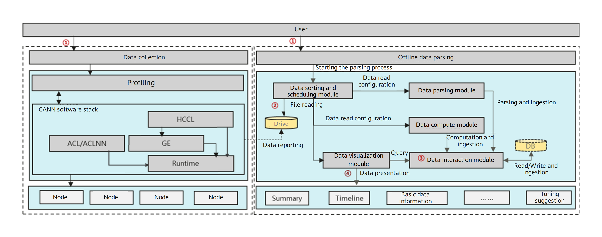
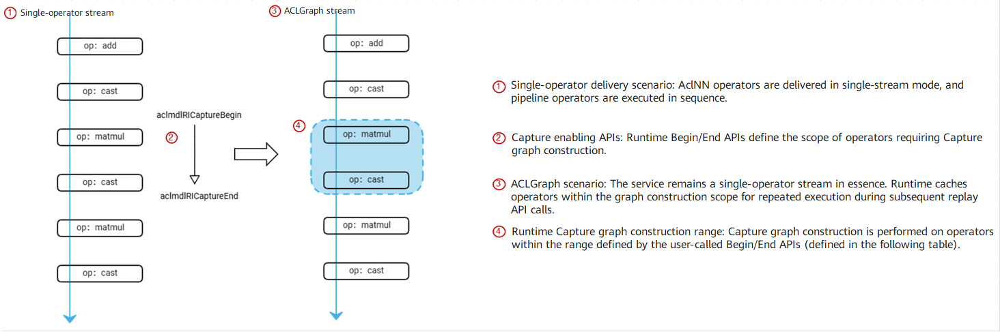

# MindStudio Profiler Feature Analysis and Design Specifications

<table>
    <tr>
        <td>SIG group:</td>
        <td>mstt-sig</td>
    </tr>
    <tr>
        <td>Target Version:</td>
        <td>MindStudio 26.0.0</td>
    </tr>
    <tr>
        <td>Designer:</td>
        <td>Chen Hao</td>
    </tr>
    <tr>
        <td>Date:</td>
        <td>2026.01.21</td>
    </tr>
</table>
**Copyright © 2022 openGauss Community**

Your reproduction, use, modification, and distribution of this document are governed by the Creative Commons Attribution-ShareAlike 4.0 International Public License (CC BY-SA 4.0).
You can visit [https://creativecommons.org/licenses/by-sa/4.0/](https://creativecommons.org/licenses/by-sa/4.0/) to view a summary of (not a substitute for) CC BY-SA 4.0.
For the complete CC BY-SA 4.0, visit [https://creativecommons.org/licenses/by-sa/4.0/legalcode](https://creativecommons.org/licenses/by-sa/4.0/legalcode).

**Change History**

<table>
    <tr>
        <th>Date</th>
        <th>Version</th>
        <th>Description</th>
        <th>Author</th>
        <th>Reviewer</th>
    </tr>
    <tr>
        <td>2026.01.21</td>
        <td>1.0</td>
        <td>Initial draft.</td>
        <td>Chen Hao</td>
        <td>Chen Hao</td>
    </tr>
    <tr>
        <td>2026.01.28</td>
        <td>1.1</td>
        <td>Added the section about performance tuning in the `aclGraph` scenario.</td>
        <td>Chen Hao</td>
        <td>Chen Hao</td>
    </tr>
</table>

<!-- TOC -->
* [1 Overview](#1-overview)
  * [1.1 Scope](#11-scope)
  * [1.2 Feature Requirements](#12-feature-requirements)
* [2 Requirement Scenario Analysis](#2-requirement-scenario-analysis)
  * [2.1 Requirement Origin and Benefits](#21-requirement-origin-and-benefits)
  * [2.2 Feature Scenario Analysis](#22-feature-scenario-analysis)
  * [2.3 Feature Impact Analysis](#23-feature-impact-analysis)
    * [2.3.1 Hardware Restrictions](#231-hardware-restrictions)
    * [2.3.2 Technical Restrictions](#232-technical-restrictions)
    * [2.3.3 Impact on Licenses](#233-impact-on-licenses)
    * [2.3.4 Impact on System Performance Specifications](#234-impact-on-system-performance-specifications)
    * [2.3.5 Impact on System Reliability Specifications](#235-impact-on-system-reliability-specifications)
    * [2.3.6 Impact on System Compatibility](#236-impact-on-system-compatibility)
    * [2.3.7 Impact on Interactivity and Conflicts with Other Major Features](#237-impact-on-interactivity-and-conflicts-with-other-major-features)
  * [2.4 Analysis on Solutions of Similar Community or Commercial Software](#24-analysis-on-solutions-of-similar-community-or-commercial-software)
* [3 Feature/Function Implementation Principles (Decomposable into Multiple Use Cases)](#3-featurefunction-implementation-principles-decomposable-into-multiple-use-cases)
  * [3.1 Objectives](#31-objectives)
  * [3.2 Overall Solution](#32-overall-solution)
* [4 Profile Data Analysis and Presentation in the ACLGraph Scenario](#4-profile-data-analysis-and-presentation-in-the-aclgraph-scenario)
  * [4.1 Design Rationale](#41-design-rationale)
  * [4.2 Constraints](#42-constraints)
  * [4.3 Detailed Implementation (Module- or Process-Level Message Sequence Diagrams from the User Entry)](#43-detailed-implementation-module--or-process-level-message-sequence-diagrams-from-the-user-entry)
  * [4.4 Inter-Subsystem Interfaces (Mainly Module Interface Definitions)](#44-inter-subsystem-interfaces-mainly-module-interface-definitions)
  * [4.5 Detailed Subsystem Design](#45-detailed-subsystem-design)
  * [4.6 DFX Attribute Design](#46-dfx-attribute-design)
    * [4.6.1 Performance Design](#461-performance-design)
    * [4.6.2 Upgrade and Capacity Expansion Design](#462-upgrade-and-capacity-expansion-design)
    * [4.6.3 Exception Handling Design](#463-exception-handling-design)
    * [4.6.4 Resource Management Design](#464-resource-management-design)
    * [4.6.5 Compact Design](#465-compact-design)
    * [4.6.6 Testability Design](#466-testability-design)
    * [4.6.7 Security Design](#467-security-design)
      * [4.6.7.1 Security Design Confirmation](#4671-security-design-confirmation)
      * [4.6.7.2 Sensitive Data Analysis](#4672-sensitive-data-analysis)
        * [1. Sensitive Data List](#1-sensitive-data-list)
        * [2. Sensitive Operation Check](#2-sensitive-operation-check)
      * [4.6.7.3 Design Implementation](#4673-design-implementation)
  * [4.7 External Interfaces](#47-external-interfaces)
  * [4.8 Self-test Case Design](#48-self-test-case-design)
* [5 Reliability and Availability Design](#5-reliability-and-availability-design)
  * [5.1 Redundancy Design](#51-redundancy-design)
  * [5.2 Fault Management](#52-fault-management)
  * [5.3 Overload Control Design](#53-overload-control-design)
  * [5.4 Hitless Upgrade](#54-hitless-upgrade)
  * [5.5 Human Error-Prevention Design](#55-human-error-prevention-design)
  * [5.6 Fault Prediction and Prevention Design](#56-fault-prediction-and-prevention-design)
* [6 Non-functional Quality Attribute Design](#6-non-functional-quality-attribute-design)
  * [6.1 Testability](#61-testability)
  * [6.2 Serviceability](#62-serviceability)
  * [6.3 Evolvability](#63-evolvability)
  * [6.4 Openness](#64-openness)
  * [6.5 Compatibility](#65-compatibility)
  * [6.6 Scalability](#66-scalability)
  * [6.7 Maintainability](#67-maintainability)
  * [6.8 Documentation](#68-documentation)
* [7 (Optional) Data Structure Design](#7-optional-data-structure-design)
<!-- TOC -->

# 1. Overview

_Briefly describe the background of the product/feature, and provide an overview of the solution, its value to customers, and the objectives to be achieved. Also state the main content and applicable scope of this document._

## 1.1 Scope

_Briefly describe the main functions of the feature._

## 1.2 Feature Requirements

Table X List of feature requirements

<table>
    <tr>
        <th>Requirement No.</th>
        <th>Requirement</th>
        <th>Feature Description</th>
        <th>Remarks</th>
    </tr>
    <tr>
        <td>1</td>
        <td>Performance tuning in the ACLGraph scenario</td>
        <td>Collect operator attributes such as shape, format, and dtype.</td>
        <td>In the ACLGraph scenario, data can be collected in both the capture and replay phases.</td>
    </tr>
</table>

# 2. Requirement Scenario Analysis

## 2.1 Requirement Origin and Benefits

In the delivery process of the built-in framework (such as PyTorch) for the `aclGraph` scenario, model performance tuning requires operator profiling. Therefore, support for profiling and visualization within the `aclGraph` scenario is required.

## 2.2 Feature Scenario Analysis

This capability is required in the model performance tuning scenario of the PyTorch framework to support model profiling.

## 2.3 Feature Impact Analysis

N/A

### 2.3.1 Hardware Restrictions

| Product Type| Supported or Not|
|---|---|
| Atlas A3 training products/inference products| Supported|
| Atlas A2 training products/inference products| Supported|

### 2.3.2 Technical Restrictions

OS: Linux

Programming language: C/Python

### 2.3.3 Impact on Licenses

N/A

### 2.3.4 Impact on System Performance Specifications

The memory required to parse profile data must be at least 10 times the size of the collected data.

### 2.3.5 Impact on System Reliability Specifications

N/A

### 2.3.6 Impact on System Compatibility

New data format processing is a newly added feature and has no version compatibility issues.

### 2.3.7 Impact on Interactivity and Conflicts with Other Major Features

N/A

## 2.4 Analysis on Solutions of Similar Community or Commercial Software

N/A

# 3. Feature/Function Implementation Principles (Decomposable into Multiple Use Cases)

## 3.1 Objectives

To support profile data parsing and visualization for model operators, and to enable model performance tuning and optimization analysis.

## 3.2 Overall Solution

MindStudio Profiler primarily consists of three parts: profile data collection and parsing, profile data analysis, and profile data visualization. Profile data collection covers operator development, inference (online and offline), and training scenarios (where methods vary by framework, such as MindSpore, PyTorch, and TensorFlow); parsing includes online and offline modes; and visualization is available through CSV tables, Chrome Trace or Perfetto (JSON), TensorBoard, and MindStudio Insight.

In offline inference scenarios, a trained model undergoes quantization and compression and is converted using the ATC. Then, you can develop applications using MindX SDK or AscendCL APIs. These applications are launched using MindStudio Profiler (msProf) to collect the corresponding profile data.

In PyTorch or MindSpore training scenarios, you can enable the Ascend profiler function by using the profiler APIs of the framework to collect, parse, and present data. The profile data includes data related to the CANN software stack, Ascend hardware, and the framework. These three categories of data are parsed in a unified manner and presented through the MindInsight visualization interface.

In TensorFlow training scenarios, you can enable the Ascend profiler function by setting environment variables or modifying configuration parameters to collect, parse, and present data. The profile data includes only data related to the CANN software stack and Ascend hardware, as profile data for the TensorFlow framework cannot be collected currently. After unified parsing, the profile data is output in two formats: CSV for tabular analysis and JSON for visual presentation using Chrome Trace or Perfetto.

In foundation model training, the method to enable the Ascend profiler function is similar to those for MindSpore, PyTorch, TensorFlow, and PaddlePaddle. The primary difference lies in the use of large-scale clusters. Profiling in cluster scenarios involving multiple ranks and nodes is more complex than in single-rank scenarios. It requires statistical analysis of core profile data for each card in the cluster to help performance tuning personnel quickly identify bottleneck ranks among thousands. Furthermore, communication profiling in cluster scenarios requires multi-rank joint analysis in combination with communication groups. For example, under Pipeline Parallelism (PP) partitioning, communication profile data between stages must be analyzed according to the stage division to verify if the pipeline bubble is reasonable.

The following figure shows the profile data collection and parsing process.

Figure 1: msProf profile data collection and parsing process

(1) Users call the msProf binary program by entering command-line parameters to collect or parse profile data. This involves command parameters such as `parse` and `export`.

(2) The offline parsing module automatically starts processes to classify, sort, and schedule profile data, which is collected and saved to the drive.

(3) Through the data sorting and scheduling module, the offline parsing module starts processes to perform binary data translation and interpretation, as well as the correlation and dependency mapping between profile data. The processed content is managed by the data interaction module for data read/write and database (DB) ingestion operations.

(4) The offline parsing module queries and retrieves the calculated profile data from the database and converts necessary data into results for visual presentation. Currently, this primarily includes data summary tables and timeline trace files.

The visual presentation part of the profile data is not presented separately in this section.

# 4. Profile Data Analysis and Presentation in the ACLGraph Scenario

## 4.1 Design Rationale

In the `aclGraph` scenario, enabling the profiler function is supported during both the model capture and replay phases to facilitate data parsing and presentation, which supports operator profiling.

## 4.2 Constraints

Matching versions of 26.0.0 and later are required (including the Torch package, CANN, and HDK package).

## 4.3 Detailed Implementation (Module- or Process-Level Message Sequence Diagrams from the User Entry)

Figure 2: aclGraph software stack service process

In the actual service process, tasks are still delivered as a single-operator stream. The operators are unaware of whether they are in the Capture phase of `aclGraph` mode. Instead, the Runtime uses the `Capture` API to enable range capture, capturing the corresponding operator tasks for graph construction and subsequently replaying the captured operators.
As shown in Figure 2, the matmul and cast operators are included in the API range and are repeatedly executed in the replay phase after being captured. Once captured, these operators are executed repeatedly during the replay phase.

## 4.4 Inter-Subsystem Interfaces (Mainly Module Interface Definitions)

| Interface Information | Description                                                                                                                          |
|-------|--------------------------------------------------------------------------------------------------------------------------------|
| Prototype | Sets the cache switch control attribute for the stream  `rtError_t aclrtsStreamSetAttribute(rtStream_t stm, rtStreamAttr stmAttrId, rtStreamAttrValue_t *attrValue)`|
| Parameters | `rtStream_t`: stream object `stmAttrId`: attribute ID of the bound stream, which is the key value `rtStreamAttrValue_t`: value of the bound stream                               |
| Return value| Result code                                                                                                                           |

| Interface Information | Description                                                                                                                          |
|-------|--------------------------------------------------------------------------------------------------------------------------------|
| Prototype | Retrieves the cache status attribute for the stream  `rtError_t aclrtsStreamGetAttribute(rtStream_t stm, rtStreamAttr stmAttrId, rtStreamAttrValue_t *attrValue)`|
| Parameters | `rtStream_t`: stream object `stmAttrId`: attribute ID of the bound stream, which is the key value `rtStreamAttrValue_t`: value of the bound stream                               |
| Return value| Result code                                                                                                                           |

| Interface Information | Description                                                                                                           |
|-------|:----------------------------------------------------------------------------------------------------------------|
| Prototype | Allocates memory and copies `info` based on `size` to the last task delivered for caching  `rtError_t aclrtsCacheLastTaskOPInfo(void * infoPtr, uint32_t infoSize)`|
| Parameters | `infoPtr`: task information to be cached  `infoSize`: size of the task information to be cached, in bytes                                                                 |
| Return value| Result code                                                                                                            |

## 4.5 Detailed Subsystem Design

1. The PyTorch framework calls `aclrtsStreamSetAttribute` to enable the stream caching function when `aclmdlRICaptureBegin` is called.

2. After `kernelLaunch`, the operator retrieves the stream caching status by calling `aclrtsStreamGetAttribute`. If caching is enabled, the operator assembles the profile data and delivers it to the Runtime cache through `aclrtsCacheLastTaskOPInfo`. If the switch is disabled, no data is delivered for caching.

3. Runtime uses thread-local variables to record the stream ID and task ID of the last task delivered by the current thread. It then allocates memory based on the data size to create a copy for the cache.

4. The PyTorch framework calls `aclrtsStreamSetAttribute` to disable the caching function before `aclmdlRICaptureEnd` is called.

5. When disabling the cache, the Runtime must disable the state of both streams implicitly accumulated in the cache and streams explicitly added by the user. If the cache is not disabled at the end, only the state of implicitly accumulated streams and explicitly added streams needs to be disabled, while the state of already enabled streams remains unchanged.

6. During subsequent replay, if profiling is enabled, Runtime reports the information to the profiling function along with the original cached data.

7. The cached information is destroyed when the model is destroyed.

## 4.6 DFX Attribute Design

### 4.6.1 Performance Design

The msProf data parsing module only processes data formats and presents the output results. Therefore, the performance impact is controllable.

### 4.6.2 Upgrade and Capacity Expansion Design

N/A

### 4.6.3 Exception Handling Design

N/A

### 4.6.4 Resource Management Design

The current feature requires additional memory. The memory required to parse the profile data should be at least 10 times the size of the collected profile data. Drive usage depends on the amount of data.

### 4.6.5 Compact Design

N/A

### 4.6.6 Testability Design

N/A

### 4.6.7 Security Design

#### 4.6.7.1 Security Design Confirmation

*Confirm the security design by referring to the security design checklist.*

| Security Attribute    | Check Item                                                      | Description                                              | Involved or Not| Satisfied or Not|
| ------------ | ------------------------------------------------------------ | ------------------------------------------------------------ |------|------|
| Access channel control| Whether any listening port is added                                            | If any listening port is added, update the communication matrix.                                  | No   |      |
| Access channel control| Whether any process or inter-component communication method is added                                    | If any process or inter-component communication method is added, update the communication matrix.                            | No   |      |
| Access channel control| Whether any authentication mode is added                                            | If any authentication mode is added, update the communication matrix and product documentation.                        | No   |      |
| Permission control    | Whether any file or directory needs to be created                                      | If any file or directory needs to be created, explicitly specify the access permission of the file or directory.                | No   |      |
| Permission control    | Whether the account permission meets the principle of least privilege                          | Assign the minimum permissions to each account in the system.                                  | No   |      |
| Permission control    | Whether user privilege escalation exists                                        | User privilege escalation is prohibited.                                    | No   |      |
| Undisclosed interface  | Whether any grand unified configuration (GUC) parameter is added                                             | If any GUC parameter is added, update the product documentation.                                   | No   |      |
| Undisclosed interface  | Whether any function, view, or system table is added or modified                            | If any function, view, or system table is added or modified, update the product documentation and consider updating the permission control policy.    | No   |      |
| Undisclosed interface  | Whether any SQL syntax is added                                             | If any SQL syntax is added, update the product documentation and add support for recording audit logs.                 | No   |      |
| Undisclosed interface  | Whether any internal tool is added                                            | If any internal tool is added, update the product documentation.                                  | No   |      |
| Undisclosed interface  | Whether the script contains commented-out code                                      | Commented-out code is prohibited in interpreted languages such as Shell and Python and must be deleted.      | No   |      |
| Undisclosed interface  | Whether there are hidden access methods such as commands, parameters, and ports                      | Access methods such as commands, parameters, and ports (including but not limited to those for product production, commissioning, and maintenance) that are not used during live network maintenance must be deleted (for example, by using compilation macros).| No   |      |
| Undisclosed interface  | Whether the system has hidden backdoors                                        | No undocumented accounts may be reserved in the system. All accounts must be manageable by the system and documented accordingly.| No   |      |
| Undisclosed interface  | Whether any cracking or network sniffing tool is provided in the software (including software packages and patch packages) released to external users| 1. Do not provide any function or tool that can change user passwords, perform exhaustive password search (including malicious cracking of passwords by exploiting system or algorithm vulnerabilities), or decrypt files containing sensitive data (such as configuration files and databases containing keys) in the software (including software packages and patch packages) released to external users. 2. Third-party network sniffing tools (such as tcpdump, gdb, strace, and readelf), debugging tools (such as cpp, gcc, dexdump, and mirror), JDK development or compilation tools, and proprietary debugging tools and scripts (such as encryption/decryption scripts, debugging functions, and privilege escalation commands) used only for commissioning must not be retained in the system. If retention is required for service needs, strict access control must be enforced. The scenarios, risks, and reasons for keeping them must also be explained in the product documentation.| No   |      |
| Sensitive data protection| Whether authentication credentials are encrypted before being stored in the system              | Authentication credentials (such as passwords and private keys) must be encrypted for storage in the system.| No   |      |
| Sensitive data protection| Whether keys for encrypting sensitive data during transmission are hard-coded            | Hard-coded passwords and keys are prohibited.                                      | No   |      |
| Sensitive data protection| Whether sensitive information such as passwords or keys is recorded in plaintext                            | It is prohibited to display sensitive information (including passwords, private keys, and pre-shared keys) in plaintext in logs stored in the system, debugging information, error messages, and ps commands.| No   |      |
| Sensitive data protection| Whether passwords are displayed in plaintext in command output                                            | It is prohibited to display passwords in plaintext in command output.                                          | No   |      |
| Sensitive data protection| Whether the default passwords of third-party and open source software are used                          | It is prohibited to use the default passwords of third-party and open source software. For details, see section 1.5 in the *Security Design Guide*.| No   |      |
| Sensitive data protection| Whether passwords are stored in plaintext in configuration files                              | Passwords must not be written into configuration files in plaintext (except for scenarios where passwords must be specified during the installation, deployment, and use of the CLI tool).| No   |      |
| Sensitive data protection| Whether any insecure encryption algorithm is used                                    | It is prohibited to use proprietary or insecure encryption algorithms known in the industry. For recommended encryption algorithms, see section 6.2 in *Security Design Guide*.| No   |      |
| Sensitive data protection| Whether sensitive information such as passwords is transmitted through secure channels                        | Sensitive information must be transmitted through secure channels or encrypted before transmission on untrusted networks. For details, see chapter 10 in *Security Design Guide*.| No   |      |
| Sensitive data protection| Whether sensitive information such as passwords and keys in the memory is destroyed after use                    | Sensitive information such as passwords and keys in the memory must be cleared immediately after use                 | No   |      |
| Sensitive data protection| Whether random numbers used by cryptographic algorithms are cryptographically secure    | Random numbers used by cryptographic algorithms must be cryptographically secure. For details, see section 6.3 in *Security Design Guide*.| No   |      |
| Sensitive data protection| Whether there are insecure examples in the documentation                                  | Examples in the documentation must be secure and provide correct guidance for users. If there are potential risks in the examples, describe the risks in the documentation.| No   |      |
| Authentication        | Whether an authentication mechanism is provided                                            | An authentication mechanism must be provided and enabled by default for the new system.                          | No   |      |
| Authentication        | Whether authentication is performed on the server                                        | Authentication must be performed on the server.                              | No   |      |
| Authentication        | Whether the server returns valid information upon an authentication failure                            | Upon an authentication failure, the server must return detailed information of the failure to help the user locate the cause of the failure.| No   |      |
| External parameter verification| Whether the validity of external input is verified                                | 1. The use of external input data as parameters such as loop termination conditions, array indices, and memory allocation sizes may lead to system behaviors such as infinite loops, buffer overflows, memory out-of-bounds access, and denial of service. 2. The validity of external input such as file paths must be verified to prevent injection risks.| Yes   | Yes   |
| Third-party component introduction  | Whether any new third-party component is introduced                                          | 1. New third-party components must pass security compilation options, virus and vulnerability scanning, open source snippet detection, license compliance checks, and open source component scanning. For details, see the network security requirements for version releases. 2. Ensure new third-party components originate from trusted sources.|    No |      |

#### 4.6.7.2 Sensitive Data Analysis

##### 1. Sensitive data list

*The specific scope of sensitive data depends on the application scenario of the system. Designers must determine this scope through risk assessment. Typical sensitive data includes authentication credentials (such as passwords) and keys.*

| **Data Field**   | **Description**         | **Data Field Sensitivity**| **Associated Processing Module**| **Mandatory Operations**            | **Prohibited Operations**|
| --------------- | ---------------------- | ------------------ | ---------------- | -------------------------- | -------------- |
| Administrator account and password| System administrator account and password| High                | Login and authentication       | Encrypted transmission, encrypted storage, and anonymization| Command output and logging   |
| ...             | ...                    | ...                | ...              | ...                        | ...            |
|                 |                        |                    |                  |                            |                |

##### 2. Sensitive operation check

*(1) Lifecycle dimension*
*For identified sensitive data, identify its lifecycle, covering the processes of generation, use, transmission, persistence, and destruction, to avoid unintentional omissions in subsequent risk identification.*
*(2) High-risk processes*
*Identify whether high-risk processes exist during the handling of sensitive data. Typical high-risk processes include printing, command output, storage, hard-coding, and the use of insecure algorithms. From an information processing perspective, these high-risk processes are prone to security vulnerabilities when handling sensitive data and require detailed inspection. All identified sensitive data items must be checked. The sensitive data check matrix is as follows:*

For example, in a typical web system, the check results of the identified sensitive data (administrator account and password) in its lifecycle are as follows:

- Generation: The administrator sets the password upon the first login.
- Use: The administrator uses the password for authentication when logging in to the system.
- Transmission: After the administrator enters the login password on the client, the password is transmitted to the server through the network.
- Persistence: After the administrator sets the password for the first time, the server persists the password in the backend database.
- Destruction: After a certain period, the administrator must change the password and the old password is deleted.

|            |                             Generation                            |                  Use                 |                        Transmission                       |       Persistence      |                 Destruction                |
| :--------: | :----------------------------------------------------------: | :------------------------------------: | :------------------------------------------------: | :----------------: | :----------------------------------: |
|    Printing   |                            N/A                           | During the use, the password is not printed in any form.| Encryption is not required for secure transmission channels. Data is encrypted for transmission on insecure transmission channels.|       N/A      | During the destruction, the password is not printed, but the operation log must be recorded.|
|    Command output   |            Passwords are displayed as asterisks (*) in the command output on the client.            |                 N/A                |                       N/A                      |       N/A      |                N/A               |
|    Storage   | After a user enters the password, the password is encrypted using a secure encryption algorithm and saved to the backend database.|               Same as that for [Generation]              |                       N/A                      | Encrypted storage in the backend database|    Delete the corresponding password from the backend database table.    |
|   Hard coding  |                            N/A                           |                 N/A                |                       N/A                      |       N/A      |                N/A               |
| Insecure algorithm|                  Use a secure algorithm (AES256) for encryption.                 |            Employ in-memory decryption during use.           |           Use secure encryption algorithms for non-secure transmission channels.          |     Same as that for [Generation]    |                N/A               |

#### 4.6.7.3 Design Implementation

Security dimensions such as session management, identity authentication, passwords and keys, denial of service (DoS), information leakage, and hardware are not involved.

File permissions:
Minimum permission 640 for files and 750 for directories

Common file verification: soft links, file permissions and owner groups, file read/write operations, file size, and file count.

Injection attack:
There are no command injection or log injection risks, as security string interception is performed during command execution and log printing. For CSV injection, attack characters are verified before file writing.

Sensitive information:
Profile data does not involve sensitive information. Additionally, sensitive words are scanned and protected using automated tools.

DoS attack:
As a local data collection tool, the profiler function does not involve service communication initiation or interaction. Therefore, there is no attack risk.

Undisclosed interfaces are identified and verified using scanning tools. Requirements regarding the exclusion of undisclosed interfaces and public network addresses have been met.

Compilation options are identified using scanning tools and meet all specified requirements.

## 4.7 External Interfaces

The interaction interface for the data parsing module is a file-based interface and does not involve the calling of external interfaces.

## 4.8 Self-test Case Design

Test cases are designed based on the collection and parsing of profile data during the capture and replay phases. These include:

1. Enabling of profiling during the capture and replay phases
2. Field integrity of profile data deliverables in data parsing and presentation

# 5. Reliability and Availability Design

## 5.1 Redundancy Design

The data parsing module primarily utilizes CPU and memory resources. It does not involve policies such as image backup or parameter backup.

## 5.2 Fault Management

The data parsing module is an offline tool used during the development phase. It involves only fault locating and maintains logs for error information recording.

## 5.3 Overload Control Design

The offline data parsing module does not involve overload control design for the online state.

## 5.4 Hitless upgrade

N/A

## 5.5 Human Error-Prevention Design

The offline data parsing module does not involve operation records, status records, or personnel operation permission division for the online state.

## 5.6 Fault Prediction and Prevention Design

The data parsing module supports the following prevention policies:

1. Drive space monitoring: When the available drive space falls below 10% of the total drive capacity, a warning indicating insufficient drive space is displayed and printed.
2. Maximum database record count: A limit is set for the number of records inserted into the database. If this limit is exceeded, a message is displayed to indicate insertion failure and the inability to continue. An alarm is also printed.

# 6. Non-functional Quality Attribute Design

## 6.1 Testability

Test cases are designed based on the collection and parsing of profile data during the capture and replay phases. These include:

- Enabling of profiling during the capture and replay phases
- Field integrity of profile data deliverables in data parsing and presentation

## 6.2 Serviceability

N/A

## 6.3 Evolvability

N/A

## 6.4 Openness

_Focus on the openness of external interfaces for the feature, including adherence to specifications such as the SQL:2011 standard._

## 6.5 Compatibility

Component version numbers are used to identify version compatibility. Separate processing is applied before and after any version number change.

## 6.6 Scalability

N/A

## 6.7 Maintainability

Profile data parsing logs (log files), expected data production deliverables, and their content are correct.

## 6.8 Documentation

_Refer to the following table to evaluate changes to various documentation related to the feature and describe the specific changes._

<table>
    <tr>
        <th>Category</th>
        <th>Document Name</th>
        <th>Involved (Y/N)</th>
        <th>Change or New Content Description</th>
    </tr>
    <tr>
        <td>White Paper</td>
        <td>Technical White Paper</td>
        <td>N</td>
        <td>Added the XX technology to section XX.</td>
    </tr>
    <tr>
        <td rowspan="8">Product Documentation</td>
        <td>Product Description</td>
        <td>Y</td>
        <td>Updated the technical indicators to XX</td>.
    </tr>
    <tr>
        <td>Feature Description</td>
        <td>Y</td>
        <td>Added the XX feature.</td>
    </tr>
    <tr>
        <td>Compilation Guide</td>
        <td>Y</td>
        <td>XXX</td>
    </tr>
    <tr>
        <td>Installation Guide</td>
        <td>Y</td>
        <td>Updated the XX scenario in the cluster installation section.</td>
    </tr>
    <tr>
        <td>Administrator Guide</td>
        <td>N</td>
        <td>XXX</td>
    </tr>
    <tr>
        <td>Developer Guide (including development tutorials, SQL reference, system tables and views, GUC parameters, error codes, and API reference)</td>
        <td>Y</td>
        <td>Added the XXX function to section XX.</td>
    </tr>
    <tr>
        <td>Tool Reference</td>
        <td>Y</td>
        <td>Added the XX tool.</td>
    </tr>
    <tr>
        <td>Glossary</td>
        <td>Y</td>
        <td>Added the term XX</td>.
    </tr>
    <tr>
        <td>Getting Started</td>
        <td>Simple Tutorials</td>
        <td>N</td>
        <td>XXX</td>
    </tr>
</table>

# 7. (Optional) Data Structure Design

N/A
