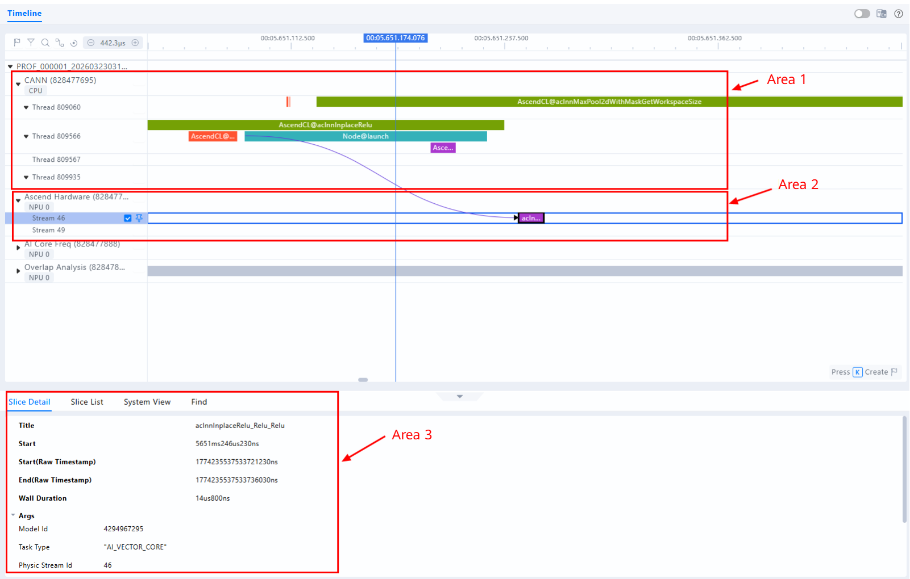
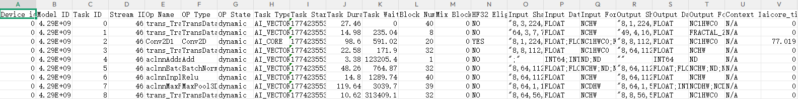

# Quick Start

This tutorial consists of three parts to help you quickly learn the basic usage of msProf for profile data collection and analysis:

1. Environment setup: Install msProf and configure the operating environment.
2. Collection: Use the msProf command-line tool to collect the first set of profile data.
3. Analysis: Perform initial performance analysis and locate bottlenecks based on the generated result files.

## Environment Setup

- Install the CANN Toolkit and ops operator packages. For details, see [CANN Software Installation Guide](https://www.hiascend.com/document/detail/zh/canncommercial/850/softwareinst/instg/instg_0000.html?Mode=PmIns&InstallType=local&OS=openEuler).
- Set the environment variables.

    ```bash
    # ${install_path} indicates the installation directory of the CANN software, such as /usr/local/Ascend/ascend-toolkit.
    source ${install_path}/set_env.sh
    ```  
  
- Run the following command to check whether the installation is successful:

    ```bash
    # Check the installation location of msprof.
    which msprof
    # Check the command-line options of msprof.
    msprof --help
    ```

## Collecting, Parsing, and Exporting Profile Data

1. Run the following command to start the training script and collect profile data by using the msProf tool. For details about the training script, see [ResNet-50 Model Training Sample](#appendix).

   ```bash
   msprof --application="python train.py" --output=/home/prof_output
   ```

    > [!NOTE]NOTE
    > - --`output`: path for storing the collected profile data.
    > - --`application`: user application whose profile data is to be collected.
    > - The preceding command is the basic collection command. For other collection requirements, see [Profile Data Collection](https://www.hiascend.com/document/detail/zh/mindstudio/830/T&ITools/Profiling/atlasprofiling_16_0007.html#ZH-CN_TOPIC_0000002536038281).

   If the following information is displayed, the execution is successful:

    ```bash
    [INFO] Start profiling....
    [INFO] Using device: npu:0
    [Epoch 1/2] Average Loss: 2.4961
    [Epoch 2/2] Average Loss: 2.2166
    [INFO] Start export data in PROF_000001_20260323031749197_00815596RKPKAHRB..
    ...
    [INFO] Export all data in PROF_000001_20260323031749197_00815596RKPKAHRB. done.
    [INFO] Start query data in PROF_000001_20260323031749197_00815596RKPKAHRB..
    Job Info        Device ID       Dir Name        Collection Time                 Model ID   Iteration Number Top Time Iteration      Rank ID
    NA                              host            2026-03-23 03:17:50.944273      N/A        N/A              N/A                     -1     
    NA              0               device_0        2026-03-23 03:17:50.954390      N/A        N/A              N/A                     -1     
    [INFO] Query all data in PROF_000001_20260323031749197_00815596RKPKAHRB. done.
    [INFO] Profiling finished.
    [INFO] Process profiling data complete. Data is saved in /home/prof_output/PROF_000001_20260323031749197_00815596RKPKAHRB.
    ```

2. After the command is executed, the tool generates the `PROF_XXX` directory in the directory specified by `--output`. This directory stores the automatically parsed profile data.

   ```ColdFusion
    PROF_XXX
    ├── host   // Raw profile data on the host. You can ignore it.
    │    └── data
    ├── device_{id}   // Raw profile data on the device. You can ignore it.
    │       └── data
    ├── msprof_{timestamp}.db  // Profile data in DB format.
    ├── mindstudio_profiler_output   // Profile data summary of the host and each device.
        ├── msprof_{timestamp}.json  // Timeline data in JSON format.
        ├── op_summary_{timestamp}.csv // AI Core and AICPU operator data.
        └── ...
   ```

## Performance Profiling

### Timeline Data Visualization

You are advised to use the [MindStudio Insight](https://gitcode.com/Ascend/msinsight) visualization tool to load the `PROF_XXX` folder and perform the following operations:

* Locate time-consuming APIs, operators, and task flows
* Analyze delivery relationships by using HostToDevice connection lines


<div style="text-align: center;">
<strong>Figure 1</strong> Visualization of msprof_*.json
</div>

> Area 1: displays CANN-layer data, including execution duration information for components (such as Runtime) and nodes (operators).
> Area 2: displays underlying NPU data, including the execution duration and iteration trace data for task streams under **Ascend Hardware**, and Ascend AI Processor system data.
> Area 3: displays details about each operator and API call in the timeline. To view the details, click a color block in the timeline.

### Summary Data Analysis

#### op_statistic_*.csv

The `op_statistic_*.csv` file classifies data by operator type (**Op Type**). This file provides the total call duration and total number of calls for each operator type. The tool sorts the data by **Total Time** to identify the operator type with the longest duration. Use this information to analyze whether room for optimization exists for this operator type.


<div style="text-align: center;">
<strong>Figure 2</strong> op_statistic_*.csv file example
</div>

#### op_summary_*.csv

The `op_summary_*.csv` file contains detailed information about operators, such as the input and output shapes and the performance monitoring unit (PMU) data. The **Task Duration** field records the operator durations. You can sort operators by **Task Duration** to locate time-consuming operators. You can also sort them by **Task Type** to view the duration distribution on different cores (AI Core and AICPU) to identify time-consuming operators and analyze their optimization potential.


<div style="text-align: center;">
<strong>Figure 3</strong> op_summary_*.csv file example
</div>

## Appendix

ResNet-50 Model Training Sample

```python
import torch
import torch.nn as nn
import torch.optim as optim
import torchvision.models as models
from torchvision.models import ResNet50_Weights


class ResNet50:
    def __init__(self, num_classes=1000, device=None):
        # Automatically choose the device: NPU > CUDA > CPU
        if device is None:
            if hasattr(torch, 'npu') and torch.npu.is_available():
                self.device = torch.device("npu:0")
            else:
                self.device = torch.device("cuda:0" if torch.cuda.is_available() else "cpu")
        else:
            self.device = torch.device(device)
        print(f"[INFO] Using device: {self.device}")

        # Load ResNet50 (with pretrained weights)
        self.model = models.resnet50(weights=ResNet50_Weights.IMAGENET1K_V1)
        if num_classes != 1000:
            self.model.fc = nn.Linear(self.model.fc.in_features, num_classes)
        self.model = self.model.to(self.device)

    def train(self, data_loader, epochs=1, lr=1e-4, freeze_backbone=False):
        """
        Simple training function.
        :param data_loader: torch.utils.data.DataLoader returning (images, labels)
        :param epochs: Number of epochs to train for
        :param lr: Learning rate
        :param freeze_backbone: Whether to freeze the ResNet backbone, only training the classification head
        """
        # Optionally freeze the backbone (useful for fine-tuning)
        if freeze_backbone:
            for param in self.model.parameters():
                param.requires_grad = False
            for param in self.model.fc.parameters():
                param.requires_grad = True

        # Optimize only parameters that require gradients
        params_to_optimize = [p for p in self.model.parameters() if p.requires_grad]
        optimizer = optim.Adam(params_to_optimize, lr=lr)
        criterion = nn.CrossEntropyLoss().to(self.device)

        self.model.train()
        for epoch in range(epochs):
            total_loss = 0.0
            for inputs, labels in data_loader:
                inputs, labels = inputs.to(self.device), labels.to(self.device)

                optimizer.zero_grad()
                outputs = self.model(inputs)
                loss = criterion(outputs, labels)
                loss.backward()
                optimizer.step()

                total_loss += loss.item()

            avg_loss = total_loss / len(data_loader)
            print(f"[Epoch {epoch + 1}/{epochs}] Average Loss: {avg_loss:.4f}")


def train():
    trainer = ResNet50(num_classes=10)
    fake_images = torch.randn(80, 3, 224, 224)
    fake_labels = torch.randint(0, 10, (80,))
    dataset = torch.utils.data.TensorDataset(fake_images, fake_labels)
    loader = torch.utils.data.DataLoader(dataset, batch_size=8, shuffle=True)
    trainer.train(loader, epochs=2, lr=1e-3, freeze_backbone=True)


if __name__ == "__main__":
    train()
```
