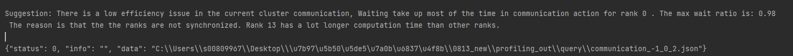
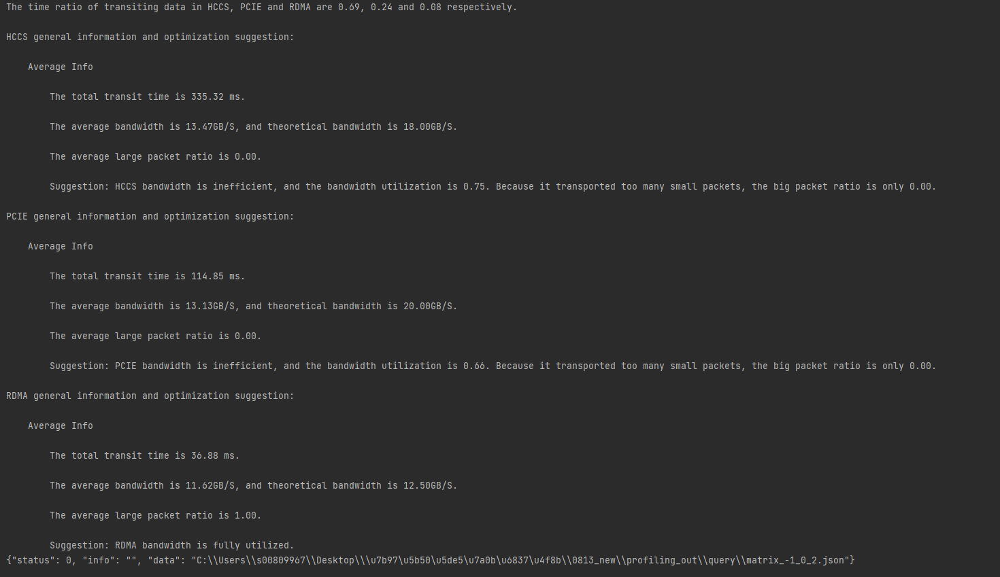

# Extended Functions

## Obtaining Device Information

**Supported Products<a name="en-us_topic_0000001276273570_section1281125681015"></a>**

|Product|Supported|
|--|:-:|
|Ascend 950 Products|√|
|Atlas A3 training products/Atlas A3 inference products|√|
|Atlas A2 training products/Atlas A2 inference products|√|
|Atlas 200I/500 A2 inference products|√|
|Atlas inference products|√|
|Atlas training products|√|

**Function<a name="en-us_topic_0000001276273570_section4362143220451"></a>**

After collecting the profile data, use `get_msprof_info.py` to obtain device information from the `device_{id}` or `host` directory within the `PROF_XXX` directory. The following table describes the function and installation directory of `get_msprof_info.py`.

**Table 1** Script description

|Script|Function|Directory|
|--|--|--|
|get_msprof_info.py|Obtains device information.|`${INSTALL_DIR}/tools/profiler/profiler_tool/analysis/interface`. Replace `${INSTALL_DIR}` with the CANN installation directory. If the Toolkit is installed by the `root` user, the default installation directory is `/usr/local/Ascend/cann`.|

**Syntax<a name="en-us_topic_0000001276273570_section25968322563"></a>**

```bash
python3 get_msprof_info.py -dir <dir> [--help]
```

**Command-line Options<a name="en-us_topic_0000001276273570_section051118235917"></a>**

**Table 2** Command-line options

|Option|Mandatory (Yes/No)|Description|
|--|--|--|
|-dir or --collection-dir|Yes|Specifies the directory of collected profile data. In non-cluster scenarios, set this option to the `host` or `device_{id}` directory within the `PROF_XXX` directory. In cluster scenarios, set it to the parent directory of the `PROF_XXX` directory.|
|-h or --help|No|Displays the help information. This option is used only to obtain usage instructions.|

**Examples**

1. Log in to the environment where the tool is located as the running user.
2. Go to the directory of `get_msprof_info.py`.
3. Run `get_msprof_info.py`. Example commands are as follows:

    - Non-cluster scenarios

        ```bash
        python3 get_msprof_info.py -dir /home/1/PROF_000001_20220129014731273_KEDKPORHMAGPGD/device_0
        ```

    - Cluster scenarios

        ```bash
        python3 get_msprof_info.py -dir /home/1/
        ```

**Output Description<a name="en-us_topic_0000001276273570_section1320820550911"></a>**

In non-cluster scenarios, results are displayed as shown in [Figure 1](#en-us_topic_0000001276273570_fig1935196101). Field descriptions are provided in [Table 3](#en-us_topic_0000001276273570_table293151916103). In cluster scenarios, a `/query/cluster_info.json` file is generated in the directory specified by the `-dir` option to store node information, as shown in [Figure 2](#en-us_topic_0000001276273570_fig095121901016). Field descriptions are provided in [Table 4](#en-us_topic_0000001276273570_table1095119171010).

**Figure 1** Device information (non-cluster scenarios)<a name="en-us_topic_0000001276273570_fig1935196101"></a>  
.png "Device information (non-cluster scenarios)")

**Table 3** Fields (non-cluster scenarios)<a name="en-us_topic_0000001276273570_table293151916103"></a>

|Field|**Description**|
|--|--|
|collection_info|Collection information|
|Collection end time|End time of information collection|
|Collection start time|Start time of information collection|
|Result Size|Result data size (MB)|
|device_info|Device information|
|AI Core Number|Number of AI Cores|
|AI CPU Number|Number of AICPUs|
|Control CPU Number|Number of Control CPUs|
|Control CPU Type|Control CPU type|
|Device Id|Device ID|
|TS CPU Number|Number of TS CPUs|
|host_info|Host information|
|cpu_info|Host CPU information|
|CPU ID|Host CPU ID|
|Name|Host CPU name|
|Type|Host CPU type|
|Frequency|Host CPU frequency|
|Logical_CPU_Count|Number of logical CPUs on the host|
|cpu_num|Number of host CPUs|
|Host Computer Name|Host device name|
|Host Operating System|Host operating system|
|model_info|Model information|
|Device Id|Device ID|
|iterations|Iteration statistics|
|Iteration Number|Number of iterations|
|Model Id|Model ID, which is displayed based on the number of models|
|version_info|Version information|
|analysis_version|Parsing version information|
|collection_version|Collection version information|
|drv_version|Driver version information|

**Figure 2** Device information (cluster scenarios)<a name="en-us_topic_0000001276273570_fig095121901016"></a>  
.png "Device information (cluster scenarios)")

**Table 4** Fields (cluster scenarios)<a name="en-us_topic_0000001276273570_table1095119171010"></a>

|Field|Description|
|--|--|
|Rank Id|Node ID that uniquely identifies a device in cluster scenarios|
|Device Id|Device ID, which is not used as a unique device identifier in cluster scenarios|
|Prof Dir|The `PROF_XXX` directory on the device with the current Rank ID in cluster scenarios|
|Device Dir|The `device_{id}` directory in the `PROF_XXX` directory in cluster scenarios|
|Models|Model information, including all model IDs on the device with the current Rank ID and the number of iterations for each model|

## Profile Data File Slicing

**Supported Products<a name="en-us_topic_0000001265229666_section1281125681015"></a>**

|Product|Supported|
|--|:-:|
|Ascend 950 Products|√|
|Atlas A3 training products/Atlas A3 inference products|√|
|Atlas A2 training products/Atlas A2 inference products|√|
|Atlas 200I/500 A2 inference products|√|
|Atlas inference products|√|
|Atlas training products|√|

**Function<a name="en-us_topic_0000001265229666_section1598625522114"></a>**

For a parsed timeline data file in JSON format, the system identifies the duration for opening it on the Google Chrome browser (`chrome://tracing`) and slices it into a proper number of slice files, so that you can quickly open it. The slicing operation is triggered during profile data export.

**File Format<a name="en-us_topic_0000001265229666_section18515142717224"></a>**

Data file slicing attributes are configured using the `msprof_slice.json` file. The following example shows the content format of the `msprof_slice.json` file:

```json
{
  "slice_switch": "off",
  "slice_file_size(MB)": 0,
  "strategy": 0
}
```

The directory for storing the `msprof_slice.json` file is as follows:

`${INSTALL_DIR}/tools/profiler/profiler_tool/analysis/msconfig`. Replace `${INSTALL_DIR}` with the CANN installation directory. If the Toolkit is installed by the `root` user, the default installation directory is `/usr/local/Ascend/cann`.

**Parameters<a name="en-us_topic_0000001265229666_section112651016202315"></a>**

**Table 1** Parameters

|Parameter|Mandatory (Yes/No)|Description|
|--|--|--|
|slice_switch|No|Specifies whether to enable slicing. Valid values:<br>&#8226; `on`: enables slicing.<br>&#8226; `off`: disables slicing.<br>Default value: `off`.<br>The current maximum slice size is 20 GB. If slicing is enabled and a file exceeds 20 GB, the export will fail. In addition, slicing will not be triggered for files smaller than 200 MB, even if slicing is enabled.<br>Data slicing is disabled by default. To enable it, set this parameter to `on` in the `msprof_slice.json` file. Any other value results in the use of the default setting.<br>By default, the system determines whether to perform data slicing based on the time required to open a timeline data file in the Chrome browser. Slicing is triggered if the file opening time exceeds the upper limit. The size of the slice files is controlled by the `slice_file_size` parameter, and the number of files is controlled by the `strategy` parameter.<br>The format of the sliced file name is `{Module name}_{slice_n}_{timestamp}.json`, where `slice_n` represents the sequence number of the slice.|
|slice_file_size(MB)|No|Specifies the maximum slice file size. The unit is MB. The value is a positive integer greater than or equal to 200. By default, the size of a slice file is not limited.<br>When this parameter is set to a positive integer greater than or equal to 200, the size of each slice file is capped at the specified value. For any other value, file size is unlimited, and only the number of slice files is restricted by the `strategy` parameter.|
|strategy|No|Specifies the slicing policy. Valid values:<br>&#8226; `0`: slices files to minimize the number of slices while keeping the file opening time for each file within an acceptable range.<br>&#8226; `1`: slices files to ensure fast opening time, resulting in more slices.<br>Default value: `0`.<br>As file opening time depends on computer performance, exact durations cannot be provided. Typical reference values for file opening time are as follows:<br>&#8226; Excessive opening time: ≥ 30s<br>&#8226; Acceptable opening time: [10,30) (seconds)<br>&#8226; Fast opening time: (0,10) (seconds)<br>The actual opening time varies depending on the device performance.|

## Parsing, Querying, and Exporting Profile Data Using `msprof.py`

### Overview

The msProf parsing tool is encapsulated using `msprof.py`. You can directly use the [msProf parsing tool](msprof_parsing_instruct.md) to parse and export the profile data.

**Tool Usage Process**

To export profile data using `msprof.py`, perform the following steps:

1. Parse profile data by referring to [Parsing Profile Data](#parsing-profile-data).
2. (Optional) Query profile data file information by referring to [Querying Profile Data File Information](#querying-profile-data-file-information).

    Perform this step if you need to specify the iteration ID or model ID for parsing. Otherwise, skip it.

3. Export profile data by referring to [Exporting Profile Data](#exporting-profile-data).

>[!NOTE]Note
>
>- Direct parsing, querying, and exporting are not supported on the device for the Atlas 200I/500 A2 inference products in the Ascend RC scenario. The generated `PROF_XXX` directory must be copied to an environment with the Toolkit package installed.
>
>- `msprof.py` must be executed by the user created during installation.

### Parsing Profile Data

**Supported Products<a name="en-us_topic_0000001265229758_section17436144114294"></a>**

|Product|Supported|
|--|:-:|
|Ascend 950 Products|√|
|Atlas A3 training products/Atlas A3 inference products|√|
|Atlas A2 training products/Atlas A2 inference products|√|
|Atlas 200I/500 A2 inference products|√|
|Atlas inference products|√|
|Atlas training products|√|

**Function<a name="en-us_topic_0000001265229758_section14143165719292"></a>**

Parses profile data.

**Precautions<a name="en-us_topic_0000001265229758_section3326152464212"></a>**

None

**Syntax<a name="en-us_topic_0000001265229758_section2822141353814"></a>**

```bash
python3 msprof.py import -dir <dir>
```

**Parameters and Command-line Options<a name="en-us_topic_0000001265229758_section144107596381"></a>**

**Table 1** Parsing command parameters and options

|Parameter/Option|**Mandatory (Yes/No)**|Description|
|--|--|--|
|import|Yes|Parses profile data in `import` mode. When the profile data is parsed using the import method, a new .db file will be regenerated even if one already exists in the raw profile data directory.|
|--cluster|Yes (for cluster scenarios)|Parses and aggregates profile data in cluster scenarios. This option is supported only when the `import` parameter is specified.<br>The `-dir` option specifies the parent directory of `PROF_XXX`. The parsing result is stored in the `sqlite` directory generated under `PROF_XXX`.|
|-dir or --collection-dir|Yes|Specifies the directory of the collected profile data. It must be `PROF_XXX` or its parent directory, such as `/home/profiler_data/PROF_XXX`.|
|-h or --help|No|Displays the help information. This option is used only to obtain usage instructions.|

**Example<a name="en-us_topic_0000001265229758_section3337129114313"></a>**

1. Log in to the environment where the Toolkit package is installed.
2. Go to the directory of `msprof.py`.

    `${INSTALL_DIR}/tools/profiler/profiler_tool/analysis/msprof`. Replace `${INSTALL_DIR}` with the CANN installation directory. If the Toolkit is installed by the `root` user, the default installation directory is `/usr/local/Ascend/cann`.

3. Parse the profile data.

    ```bash
    python3 msprof.py import -dir /home/profiler_data/PROF_XXX
    ```

**Output Description<a name="en-us_topic_0000001265229758_section435433185314"></a>**

After the commands are executed and parsing is complete, a `sqlite` directory containing a .db file is generated in the `device_{id}` and `host` subdirectories of `PROF_XXX`. This .db file stores intermediate results and can be ignored.

To export final timeline data or .db files, proceed to [Exporting Profile Data](#exporting-profile-data).

### Querying Profile Data File Information

**Supported Products<a name="en-us_topic_0000001312709849_section17436144114294"></a>**

|Product|Supported|
|--|:-:|
|Ascend 950 Products|√|
|Atlas A3 training products/Atlas A3 inference products|√|
|Atlas A2 training products/Atlas A2 inference products|√|
|Atlas 200I/500 A2 inference products|√|
|Atlas inference products|√|
|Atlas training products|√|

**Function<a name="en-us_topic_0000001312709849_section2149245124116"></a>**

Queries profile data file information, including the iteration ID and model ID.

**Precautions<a name="en-us_topic_0000001312709849_section1977174874311"></a>**

Before you run the query command, run the `import` command to parse the profile data. Otherwise, the query result is meaningless.

**Syntax<a name="en-us_topic_0000001312709849_section1078215339441"></a>**

```bash
python3 msprof.py query -dir <dir> 
```

**Command-line Options<a name="en-us_topic_0000001312709849_section1358435054413"></a>**

**Table 1** Command-line options for querying profile data

|Option|**Mandatory (Yes/No)**|Description|
|--|--|--|
|-dir or --collection-dir|Yes|Specifies the directory of the collected profile data. It must be `PROF_XXX` or its parent directory, such as `/home/profiler_data/PROF_XXX`.|
|--data-type|No|Specifies the data type. This option is used for interconnection with MindStudio and does not need to be specified. Valid values:<br>&#8226; `0`: cluster data. You can query whether the current data is collected in a cluster scenario.<br>&#8226; `1`: iteration trace data, which is detailed data of each iteration, including the FP/BP elapsed time, iteration refresh lag, and iteration interval.<br>&#8226; `2`: compute volume, which is the number of floating-point operations on AI Core.<br>&#8226; `3`: data preparation, including sending training data to the device and reading it on the device.<br>&#8226; `4`: parallelism tuning suggestions.<br>&#8226; `5`: parallelism data, including the pure communication duration and computation duration.<br>&#8226; `6`: slow communication rank and link data and tuning suggestions.<br>&#8226; `7`: communication matrix data and tuning suggestions.<br>&#8226; `8`: CPU and memory performance metrics of the host-side system and processes.<br>&#8226; `9`: communication duration with critical path analysis enabled.<br>&#8226; `10`: communication matrix with critical path analysis enabled.|
|--id|No|Specifies the rank ID of a cluster node in cluster scenarios, and device ID in non-cluster scenarios. This option is used for interconnection with MindStudio and does not need to be specified.|
|--model-id|No|Specifies the model ID.<br>This option is used for interconnection with MindStudio and does not need to be specified.|
|--iteration-id|No|Specifies the iteration ID for graph-based statistics collection. The iteration ID is incremented by 1 each time a graph is executed. When a script is compiled into multiple graphs, the iteration ID is different from the step ID at the script layer. Default value: `1`.<br>This option is used for interconnection with MindStudio and does not need to be specified.|
|-h or --help|No|Displays the help information. This option is used only to obtain usage instructions.|

**Example<a name="en-us_topic_0000001312709849_section13391201510441"></a>**

1. Log in to the environment where the Toolkit package is installed.
2. Go to the directory of `msprof.py`.

    `${INSTALL_DIR}/tools/profiler/profiler_tool/analysis/msprof`. Replace `${INSTALL_DIR}` with the CANN installation directory. If the Toolkit is installed by the `root` user, the default installation directory is `/usr/local/Ascend/cann`.

3. To query the profile data information, run the following command:

    ```bash
    python3 msprof.py query -dir /home/profiler_data/PROF_XXX
    ```

**Output Description<a name="en-us_topic_0000001312709849_section32716634617"></a>**

After the command for querying profile data is executed, the results will be printed and displayed.

[Table 2](#en-us_topic_0000001312709849_table6267151610469) describes the information obtained through the query function of the msProf tool.

**Table 2** Profile data file information<a name="en-us_topic_0000001312709849_table6267151610469"></a>

|Field|Description|
|--|--|
|Job Info|Job name|
|Device ID|Device ID|
|Dir Name|Directory name|
|Collection Time|Data collection time|
|Model ID|Model ID|
|Iteration Number|Total number of iterations|
|Top Time Iteration|Top five iterations with the longest durations|
|Rank ID|Node ID in the cluster scenario|

### Exporting Profile Data

**Supported Products<a name="en-us_topic_0000001265069834_section17436144114294"></a>**

|Product|Supported|
|--|:-:|
|Ascend 950 Products|√|
|Atlas A3 training products/Atlas A3 inference products|√|
|Atlas A2 training products/Atlas A2 inference products|√|
|Atlas 200I/500 A2 inference products|√|
|Atlas inference products|√|
|Atlas training products|√|

**Function<a name="en-us_topic_0000001265069834_section4946111125919"></a>**

Exports profile data.

**Precautions<a name="en-us_topic_0000001265069834_section1316727135913"></a>**

Before exporting profile data, you need to [parse profile data](#parsing-profile-data).

**Syntax<a name="en-us_topic_0000001265069834_section151421417593"></a>**

- Export timeline data and DB files

    ```bash
    python3 msprof.py export timeline -dir <dir> [-reports <reports_sample_config.json>] [--model-id <model-id>] [--iteration-id <iteration_id>] [--iteration-count <iteration_count>] [--clear]
    ```

- Export summary data and DB files

    ```bash
    python3 msprof.py export summary -dir <dir> [--model-id <model-id>] [--iteration-id <iteration_id>] [--iteration-count <iteration_count>] [--format <export_format>] [--clear]
    ```

- Export DB files

    ```bash
    python3 msprof.py export db -dir <dir>
    ```

**Command-line Options<a name="en-us_topic_0000001265069834_section039513131005"></a>**

**Table 1** Command-line options for exporting profile data

|Option|**Mandatory (Yes/No)**|Description|
|--|--|--|
|-dir or --collection-dir|Yes|Specifies the directory of the collected profile data. It must be `PROF_XXX` or its parent directory, such as `/home/HwHiAiUser/profiler_data/PROF_XXX`.|
|-reports|No|Specifies a custom `reports_sample_config.json` configuration file to export the corresponding profile data based on the scope specified in the file. The parameter implementation is the same as that of `msprof --reports`. For details, see [Example (`--reports` Option)](msprof_parsing_instruct.md#en-us_topic_0000001265229686_section1128153151819).|
|--model-id|No|Specifies the model ID. The value must be a positive integer. This option must be specified in combination with `--iteration-id` to export the profile data of a specified compute iteration in the model. If neither `--model-id` nor `--iteration-id` is specified, all profile data is exported by default.<br>&#8226; For Atlas A2 training products/Atlas A2 inference products as well as Atlas A3 training products/Atlas A3 inference products, `--model-id` can be set to `4294967295`, which specifies the step mode. That is, the value of `--iteration-id` specifies parsing by step. Only profile data of the MindSpore framework (version 2.3 or later) can be parsed.<br>&#8226; If `--model-id` is set to other values, this option specifies the iteration ID for graph-based statistics collection. (The iteration ID is incremented by 1 each time a graph is executed. When a script is compiled into multiple graphs, the iteration ID is different from the step ID at the script layer.)|
|--iteration-id|No|Specifies the iteration ID. The value must be a positive integer. This option must be specified in combination with `--model-id` to export the profile data of a specified compute iteration in the model. If neither `--model-id` nor `--iteration-id` is specified, all profile data is exported by default.<br>&#8226; For Atlas A2 training products/Atlas A2 inference products, as well as Atlas A3 training products/Atlas A3 inference products, `--model-id` can be set to `4294967295`, which specifies the iteration ID for step-based statistics collection. The iteration ID is incremented by 1 each time a step is executed. Only profile data of the MindSpore framework (version 2.3 or later) can be parsed.<br>&#8226; If `--model-id` is set to other values, this option specifies the iteration ID for graph-based statistics collection. (The iteration ID is incremented by 1 each time a graph is executed. When a script is compiled into multiple graphs, the iteration ID is different from the step ID at the script layer.)|
|--iteration-count|No|Specifies the number of consecutive iterations for which data will be exported. The value ranges from 1 to 5. The value of `--iteration-id` is used as the starting step. For example, if `--iteration-count` is `3` and `--iteration-id` is `1`, data for steps 1, 2, and 3 will be exported.|
|--format|No|Specifies the format of the exported summary data file. The value can be `csv` (default) or `json`. This option is supported only when the `summary` parameter is configured.<br>This document uses CSV files as examples for all summary file descriptions.|
|--clear|No|Sets the data clearance mode. After this option is enabled, the `sqlite` directory in `PROF_XXX/device_{id}` is deleted (after profile data is exported) to save storage space. When this option is specified, the data clearance mode is enabled. This option is not specified by default.|
|-h or --help|No|Displays the help information. This option is used only to obtain usage instructions.|

**Examples<a name="en-us_topic_0000001265069834_section202865387012"></a>**

1. Log in to the environment where the Toolkit package is installed.
2. Go to the directory of `msprof.py`.

    `${INSTALL_DIR}/tools/profiler/profiler_tool/analysis/msprof`. Replace `${INSTALL_DIR}` with the CANN installation directory. If the Toolkit is installed by the `root` user, the default installation directory is `/usr/local/Ascend/cann`.

3. Export profile data. The timeline, summary, and DB files can be exported. The command formats are as follows:

    - Export timeline data and DB files

        ```bash
        python3 msprof.py export timeline -dir /home/HwHiAiUser/profiler_data/PROF_XXX
        ```

    - Export summary data and DB files

        ```bash
        python3 msprof.py export summary -dir /home/HwHiAiUser/profiler_data/PROF_XXX
        ```

    - Export the DB file to generate a .db file (`msprof_timestamp.db`) that aggregates all profile data.

        ```bash
        python3 msprof.py export db -dir /home/HwHiAiUser/profiler_data/PROF_XXX
        ```

    >[!NOTE]Note
    >
    >- By default, all profile data is exported.
    >- In single-operator scenarios or scenarios where only Ascend AI Processor system data is collected (that is, the `--application` option is not specified in the `msprof` data collection command), the `--iteration-id` and `--model-id` options are not supported.

**Output Description<a name="en-us_topic_0000001265069834_section54271276213"></a>**

After the preceding command is executed, the `mindstudio_profiler_output` directory and `msprof_*.db` file are generated in the `PROF_XXX` directory under the `--collection-dir` directory.

The following examples show the directory structure of the generated profile data:

- Single-process collection

    ```ColdFusion
    └── PROF_XXX
          ├── device_0
          │    └── data
          ├── device_1
          │    └── data
          ├── host
          │    └── data
          ├── msprof_*.db
          └── mindstudio_profiler_output
                ├── msprof_{timestamp}.json
                ├── step_trace_{timestamp}.json
                ├── xx_*.csv
                 ...
                └── README.txt
    ```

- Multi-process collection

    ```ColdFusion
    └── PROF_XXX1
          ├── device_0
          │    └── data
          ├── host
          │    └── data
          ├── msprof_*.db
          └── mindstudio_profiler_output
                ├── msprof_{timestamp}.json
                ├── step_trace_{timestamp}.json
                ├── xx_*.csv
                 ...
                └── README.txt
    └── PROF_XXX2
          ├── device_1
          │    └── data
          ├── host
          │    └── data
          ├── msprof_*.db
          └── mindstudio_profiler_output
                ├── msprof_{timestamp}.json
                ├── step_trace_{timestamp}.json
                ├── xx_*.csv
                 ...
                └── README.txt
    ```

>[!NOTE]Note
>
>- In multi-device scenarios, if a single collection process is started, only one `PROF_XXX` directory is generated. If multiple processes are started, multiple `PROF_XXX` directories are generated. The device directories are created within these `PROF_XXX` directories. The specific number of device directories per `PROF_XXX` depends on the actual user operations and does not affect profile data analysis.
>- For details about profile data, see [Profile Data File References](profile_data_file_references.md).
>- The files in the `mindstudio_profiler_output` directory are generated based on the actual profile data. If specific data files are not collected, the corresponding timeline and summary data will not be exported.
>- You can run the `export` command to directly export summary reports from the profile data parsing result. Even if the profile data has not been parsed, running the `export` command separately will parse the data and export the result files.
>- If the msProf collection process is forcibly interrupted, the tool saves the raw profile data already collected, which can still be parsed and exported using the `export` command.

## Performance Tuning Suggestions

>[!NOTE]Note
>This function provides tuning suggestions after msProf parses the profile data and is no longer being updated. For more advanced profile data analysis and tuning suggestions, see [msprof-analyze](https://gitcode.com/Ascend/mstt/tree/master/profiler/msprof_analyze/).

**Supported Products<a name="en-us_topic_0000002441319698_section5889102116569"></a>**

>[!NOTE]Note
>For details about Ascend product models, see [Ascend Product Models](https://www.hiascend.com/document/detail/zh/AscendFAQ/ProduTech/productform/hardwaredesc_0001.html).

|Product|Supported|
|--|:-:|
|Ascend 950 Products|√|
|Atlas A3 training products/Atlas A3 inference products|√|
|Atlas A2 training products/Atlas A2 inference products|√|
|Atlas 200I/500 A2 inference products|√|
|Atlas inference products|√|
|Atlas training products|√|

In cluster or multi-rank communication scenarios, performance tuning suggestions will be output to the screen after the profile data export command is executed. The details are as follows:

1. Obtain optimization suggestions based on communication duration analysis.

    Since collective communication operators are executed synchronously, any slow nodes in the cluster will drag down the performance of the entire cluster due to the bottleneck effect.

    Optimization principles:

    1. Check whether there is a rank in an iteration with a `Wait Time Ratio` greater than the threshold (`0.2`):
        1. If yes, a communication bottleneck exists in this iteration. For more information, see [1.2](#en-us_topic_0000002441319698_li137377801319).
        2. If no, it can be preliminarily determined that no communication bottleneck exists in this iteration. Proceed to check the overall bandwidth usage.

    2. <a name="en-us_topic_0000002441319698_li137377801319"></a>Identify the rank with the maximum `Wait Time Ratio` and check whether its `Synchronization Time Ratio Before Transit` exceeds the threshold (`0.2`):
        1. If yes, a slow rank exists (the rank with the smallest `Wait Time Ratio`). Check its forward and backward calculation time. If this time is significantly longer than that of other cards, check for load imbalances or processor faults. If the calculation time is consistent with other ranks, check the data preprocessing time.
        2. If no, the links are abnormal. In this case, check for link failures or cases where the communication volume is too low.

    >[!NOTE]Note
    >- **Wait Time Ratio = Wait Time/(Wait Time + Transit Time)**. A higher `Wait Time Ratio` indicates that the wait duration of the rank accounts for a larger portion of the total communication duration, resulting in lower communication efficiency.
    >- **Synchronization Time Ratio Before Transit = Synchronization Time/(Synchronization Time + Transit Time)**. `Synchronization Time` refers to the synchronization duration before the first data transmission. A higher `Synchronization Time Ratio Before Transit` indicates lower communication efficiency and the possible existence of slow ranks.

    **Figure 1** Communication duration-based suggestion<a name="en-us_topic_0000002441319698_fig37451988134"></a>  
    

2. Obtain optimization suggestions based on communication matrix analysis.

    Slow links in cluster scenarios generally involve the following two cases:

    - Some slow links cause increased communication time between a few ranks. Other ranks must wait for the communication to complete, thereby dragging down the performance of the entire cluster.
    - Abnormalities in bandwidth or communication operators prevent network-wide links from reaching normal bandwidth rates. This increases the communication time for all ranks, and in this case, no typical slow ranks or slow links exist.

    Analysis of HCCS, PCIe, and RDMA is performed using the communication matrix. Bottleneck analysis and tuning suggestions are provided based on the average status of each link type. For scenarios involving slow links, full details of the slow links and corresponding tuning suggestions are provided.

    The analysis suggestions are as follows:

    1. Time consumption ratios of the three link types.
    2. Specific status of each link type:
        1. Average link information: Includes total transmission duration, average bandwidth, and average large packet transmission rate. Tuning suggestions are provided based on this information.
        2. Slowest link information: If the link bandwidth is less than 20% of the average bandwidth, the tool outputs information regarding the slowest link, including transmission duration, transmission size, transmission bandwidth, bandwidth usage, and large packet ratio. Tuning suggestions are provided based on this information.

    Optimization principles:

    1. If the bandwidth usage is greater than 0.8, bandwidth usage is normal and no bottleneck exists in the network-wide links. For more information, see [2.2](#en-us_topic_0000002441319698_li78702451587).
    2. <a name="en-us_topic_0000002441319698_li78702451587"></a>If the communication packet ratio is greater than 0.8, the size of communication packets is normal. However, the link configuration may be incorrect or link degradation may exist. For more information, see [2.3](#en-us_topic_0000002441319698_li13870154517585).
    3. <a name="en-us_topic_0000002441319698_li13870154517585"></a>If the communication packet size is too small, the packets transmitted during each communication are undersized, leading to low bandwidth usage and a bandwidth bottleneck.

    **Figure 2** Communication matrix-based suggestion<a name="en-us_topic_0000002441319698_fig1087154512584"></a>  
    
