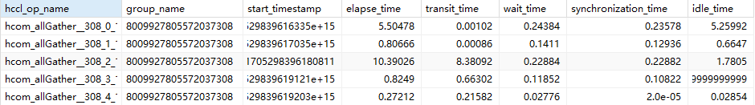
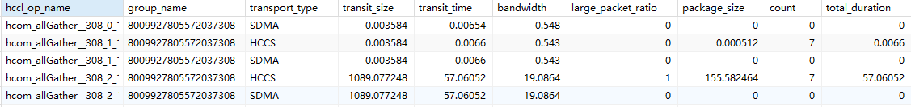
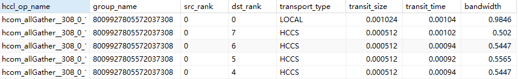
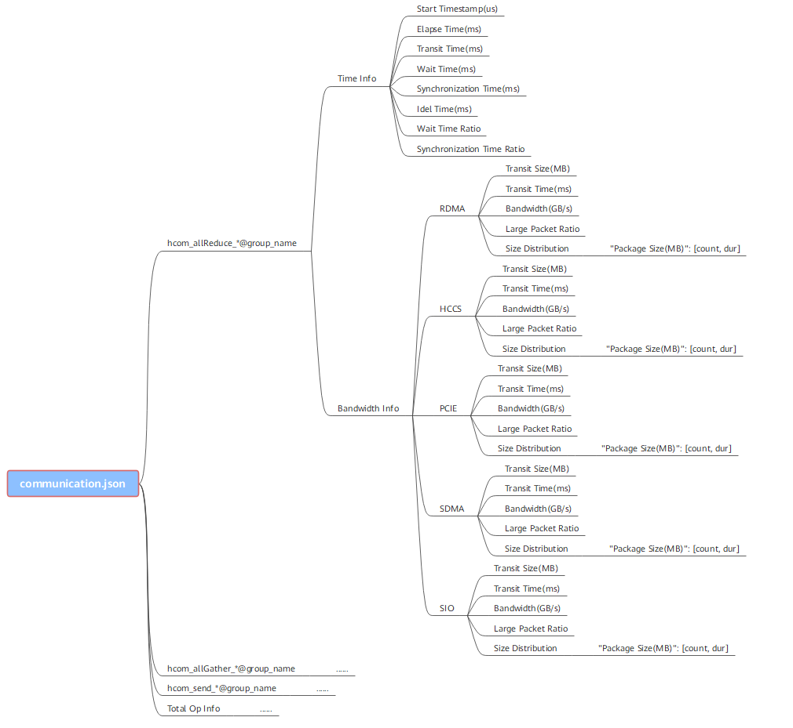
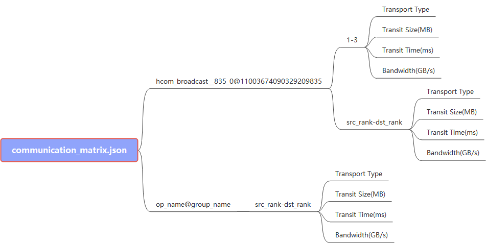

# MindStudio Profiler Parsing Tool

## Overview

The MindStudio Profiler (msProf) command-line tool is encapsulated using `msprof.py` and supports general parsing of profile data.

**Tool Usage Process**

- Automatic parsing: Generally, running the `msprof` command to collect profile data parses and exports profile data files by default.
- Offline parsing:
    - If automatic parsing is not supported or re-parsing is required, proceed to [Parsing and Exporting Profile Data](#parsing-and-exporting-profile-data).
    - (Optional) If a profile data file fails to be parsed, re-parse the file by referring to [Parsing Profile Data](#parsing-profile-data), then proceed to [Parsing and Exporting Profile Data](#parsing-and-exporting-profile-data).
    - (Optional) To specify an iteration ID and model ID for parsing, refer to [Querying Profile Data File Information](#querying-profile-data-file-information) or [Parsing Profile Data](#parsing-profile-data) to query the total iteration count and model ID. Then, select the required iteration ID and model ID to proceed to [Parsing and Exporting Profile Data](#parsing-and-exporting-profile-data).
    - For profile data in communication scenarios, proceed to [Parsing Communication Profile Data](#parsing-communication-profile-data) to parse the exported results after completing [Parsing and Exporting Profile Data](#parsing-and-exporting-profile-data).

## Preparations

**Environment Setup**

1. Install the matching CANN Toolkit and ops operator packages, and configure CANN environment variables. For details, see the *CANN Installation Guide*.

    In Ascend EP scenarios, the msProf tool is located in `${INSTALL_DIR}/tools/profiler/bin`. Replace `${INSTALL_DIR}` with the actual CANN installation directory. If the Toolkit is installed by the `root` user, the default installation directory is `/usr/local/Ascend/cann`.

    In Ascend RC scenarios, the msProf tool is stored in `/var`.

2. Set Python environment variables.

    If multiple Python 3 series versions exist, specify your Python installation path according to your service needs. The following takes Python 3.7.5 as an example.

    ```bash
    export PATH=/usr/local/python3.7.5/bin:$PATH
    ## Set the library path for Python 3.7.5.
    export LD_LIBRARY_PATH=/usr/local/python3.7.5/lib:$LD_LIBRARY_PATH
    ```

>[!NOTE]NOTE
>The preceding environment variables take effect only in the current window. You can write the preceding commands to the `~/.bashrc` file to make them take effect permanently. The operations are as follows:
>
>1. Run the `vi ~/.bashrc` command in any directory as the installation user and append the preceding commands to the file.
>2. Run the `:wq!` command to save the file and exit.
>3. Run the `source ~/.bashrc` command to make the environment variable take effect.

**Constraints**

Before using this tool, understand the following constraints:

- Permission constraints
    - Adhere to the principle of least privilege (for example, prohibit write access for `others` and avoid setting file permissions to `666` or `777`).
    - Before using msProf, ensure the user's `umask` is set to `0027` or a more restrictive value. Otherwise, the generated profile data directories and files will have excessive permissions.
    - To ensure security and adhere to the principle of least privilege, you are advised to run this tool as a common user rather than a high-privilege user (such as `root`).
    - This tool is a development and debugging tool. You are advised not to use it in the production environment.
    - Ensure that the profile data is stored in the current user directory that does not contain soft links. Otherwise, security issues may occur.

- Data flush constraints
  
    During profile data parsing, if the configured drive or user directory space is full, the parsing fails or the file cannot be flushed to the drive. In this case, clear the drive or user directory space.

- Compatibility and scenario constraints
  
    Python 3.7.5 or later is required.

- Other constraints

    Path parameters for this tool must not contain the following special characters:

    ```text
    "\n", "\\n", "\f", "\\f", "\r", "\\r", "\b", "\\b", "\t", "\\t", "\v", "\\v", "\u007F", "\\u007F", "\"", "\\\"", "'", "\'", "\\", "\\\\", "%", "\\%", ">", "\\>", "<", "\\<", "|", "\\|", "&", "\\&", "$", "\\$", ";", "\\;", "`", "\\`"
    ```

## Parsing and Exporting Profile Data

**Supported Products**

|Product|Supported|
|--|:-:|
|Ascend 950 Products|√|
|Atlas A3 training products/Atlas A3 inference products|√|
|Atlas A2 training products/Atlas A2 inference products|√|
|Atlas 200I/500 A2 inference products|√|
|Atlas inference products|√|
|Atlas training products|√|

**Function**

Parses and exports profile data.

**Precautions**

- Complete [preparations](#preparations) first.
- Complete profile data collection first.
- Direct parsing on the device is not supported for the following products. The generated `PROF_XXX` directory must be copied to an environment with the Toolkit package installed.
    - Ascend RC scenario for Atlas 200I/500 A2 inference products

**Syntax**

```bash
msprof --export=on --output=<dir> [--type=<type>] [--reports=<reports_sample_config.json>] [--model-id=<number>] [--iteration-id=<number>] [--summary-format=<csv/json>] [--clear=on]
```

**Command-line Options**

**Table 1** Command-line options

|Option|**Mandatory (Yes/No)**|Description|
|--|--|--|
|--export|Yes|Parses and exports profile data. Valid values: `on` or `off` (default).<br>&#8226; `on`: enables this option.<br>&#8226; `off`: disables this option.<br>To export data of a specific model (model ID) or iteration (iteration ID), run the `msprof --export` command again to configure the `--model-id` and `--iteration-id` options after msProf profile data collection.<br>For unparsed `PROF_XXX` files, this option performs automatic parsing before exporting.<br>Example: `msprof --export=on --output=/home/HwHiAiUser`|
|--output|Yes|Specifies the profile data directory. The value must be a `PROF_XXX` directory or its parent directory, such as `/home/profiler_data/PROF_XXX`.|
|--type|No|Sets the format of profile data parsing result files to be exported. This option determines the format of automatic parsing result files generated after the execution of the `msprof` command. Valid values:<br>&#8226; `text`: parses data into JSON/CSV timeline and summary files plus a DB file (`msprof_timestamp.db`). For details, see [Profile Data File References](profile_data_file_references.md). It supports profile data parsing with CANN 7.0.0 and later.<br>&#8226; `db`: parses data into a single DB file (`msprof_timestamp.db`) for display in MindStudio Insight. Currently, this format differs in information volume from `text`, so `text` is recommended. When the type is set to `db`, only the `--output` option of the `msprof --export` command is supported. Other options of the command are invalid.<br>Default value: `text`.|
|--reports|No|Specifies a custom `reports_sample_config.json` configuration file to export the corresponding profile data based on the scope specified in the file. For details, see [Example (`--reports` Option)](#en-us_topic_0000001265229686_section1128153151819).<br>Currently, the Ascend 950 Products does not support this option.|
|--model-id|No|Specifies the model ID. The value must be a positive integer. This option must be specified in combination with `--iteration-id` to export the profile data of a specified compute iteration in the model. If neither `--model-id` nor `--iteration-id` is specified, all profile data is exported by default.<br>&#8226; For Atlas A2 training products/Atlas A2 inference products as well as Atlas A3 training products/Atlas A3 inference products, `--model-id` can be set to `4294967295`, which specifies the step mode. That is, the value of `--iteration-id` specifies parsing by step. Only profile data of the MindSpore framework (version 2.3 or later) can be parsed.<br>&#8226; If `--model-id` is set to other values, this option specifies the iteration ID for graph-based statistics collection. The iteration ID is incremented by 1 each time a graph is executed. When a script is compiled into multiple graphs, the iteration ID is different from the step ID at the script layer.|
|--iteration-id|No|Specifies the iteration ID. The value must be a positive integer. This option must be specified in combination with `--model-id` to export the profile data of a specified compute iteration in the model. If neither `--model-id` nor `--iteration-id` is specified, all profile data is exported by default.<br>&#8226; For Atlas A2 training products/Atlas A2 inference products, as well as Atlas A3 training products/Atlas A3 inference products, `--model-id` can be set to `4294967295`, which specifies the iteration ID for step-based statistics collection. The iteration ID is incremented by 1 each time a step is executed. Only profile data of the MindSpore framework (version 2.3 or later) can be parsed.<br>&#8226; If `--model-id` is set to other values, this option specifies the iteration ID for graph-based statistics collection. The iteration ID is incremented by 1 each time a graph is executed. When a script is compiled into multiple graphs, the iteration ID is different from the step ID at the script layer.|
|--summary-format|No|Specifies the summary data file export format. Valid values:<br>&#8226; `json`: exports the summary data file is in JSON format.<br>&#8226; `csv` (default): exports the summary data file in CSV format.<br>This option is supported only when `--type` is set to `text`.|
|--python-path|No|Specifies the path to the Python interpreter used for parsing. The Python version must be 3.7.5 or later.|
|--clear|No| Sets the data clearance mode. After this option is enabled, the `sqlite` directory in `PROF_XXX/device_{id}` is deleted (after profile data is exported) to save storage space. Valid values: `on` or `off` (default).|

>[!NOTE]NOTE
>
>- By default, all profile data is exported.
>- In single-operator scenarios or scenarios where only Ascend AI Processor system data is collected (that is, the `--application` option is not specified in the `msprof` data collection command), the `--iteration-id` and `--model-id` options are not supported.

**Example**

Specify the `/home/profiler_data/PROF_XXX` directory as the profile data directory and run the `msprof --export` command:

```bash
msprof --export=on --output=/home/profiler_data/PROF_XXX
```

**Example (`--reports` Option)<a name="en-us_topic_0000001265229686_section1128153151819"></a>**

Specify the `/home/profiler_data/PROF_XXX` directory as the profile data directory, pass the custom `reports_sample_config.json` configuration file, and run the `msprof --export` command:

```bash
msprof --export=on --output=/home/profiler_data/PROF_XXX --reports=${INSTALL_DIR}/tools/profiler/profiler_tool/analysis/msconfig/reports_sample_config.json
```

Replace `${INSTALL_DIR}` with the actual CANN installation directory. If the Toolkit is installed by the `root` user, the default installation directory is `/usr/local/Ascend/cann`.

>[!NOTE]NOTE
>
>- --The `--reports` option specifies the `reports_sample_config.json` file. This option must be used in combination with `--export` and supports only `--type=text`. It controls only the timeline data in JSON files. Summary data in CSV files is always fully exported.
>- Soft links are not supported. The maximum file size is 64 MB, and the maximum length of the file path plus the file name is 1024 characters.

By default, the `reports_sample_config.json` file is stored in the ${INSTALL_DIR}/tools/profiler/profiler_tool/analysis/msconfig/ directory. The file content is as follows:

(You can create a `reports_sample_config.json` file in any directory with read and write permissions.)

```json
{
    "json_process": {
        "ascend": true,
        "acc_pmu": true,
        "cann": true,
        "ddr": true,
        "stars_chip_trans": true,
        "hbm": true,
        "communication": true,
        "hccs": true,
        "os_runtime_api": true,
        "network_usage": true,
        "disk_usage": true,
        "memory_usage": true,
        "cpu_usage": true,
        "msproftx": true,
        "npu_mem": true,
        "overlap_analyse": true,
        "pcie": true,
        "sio": true,
        "stars_soc": true,
        "step_trace": true,
        "freq": true,
        "llc": true,
        "nic": true,
        "roce": true,
        "qos": true,
        "device_tx": true
    }
}
```

The preceding configuration items are switches for controlling specific profile data. You can set them to `true` (to enable the fields) or `false` (to disable or delete the fields). The controlled profile data includes the timeline tracks (including **CANN**, **Ascend Hardware**, **AI Core Freq**, on-chip memory, **Communication**, **Overlap Analysis**, and **NPU_MEM** tracks) in `msprof_*.json`.

>[!NOTE]NOTE
>
>1. Exporting the preceding data requires that the corresponding data already exists in the raw profile data (that is, the data has been collected).
>2. Ensure the `reports_sample_config.json` file is correctly formatted. Otherwise, incorrect content (such as misspellings) may cause the `--reports` option to become invalid and export all profile data. Furthermore, file read failures caused by missing files or permission issues will terminate the export process and return an error.

**Output Description**

Executing the `msprof --export` command generates the `mindstudio_profiler_output` directory within the `PROF_XXX` directory.

The structure of the generated profile data directory is as follows:

- Single-process collection

    ```ColdFusion
    └── PROF_XXX
          ├── device_0
          │    └── data
          ├── device_1
          │    └── data
          ├── host
          │    └── data
          ├── msprof_*.db
          └── mindstudio_profiler_output
                ├── msprof_*.json
                ├── step_trace_*.json
                ├── xx_*.csv
                 ...
                └── README.txt
    ```

- Multi-process collection

    ```ColdFusion
    └── PROF_XXX1
          ├── device_0
          │    └── data
          ├── host
          │    └── data
          ├── msprof_*.db
          └── mindstudio_profiler_output
                ├── msprof_*.json
                ├── step_trace_*.json
                ├── xx_*.csv
                 ...
                └── README.txt
    └── PROF_XXX2
          ├── device_1
          │    └── data
          ├── host
          │    └── data
          ├── msprof_*.db
          └── mindstudio_profiler_output
                ├── msprof_*.json
                ├── step_trace_*.json
                ├── xx_*.csv
                 ...
                └── README.txt
    ```

>[!NOTE]NOTE
>
>- `msprof_*.db` is a database file that aggregates all profile data. The JSON files in the `mindstudio_profiler_output` directory are timeline information files. These files collect the duration of operators and tasks for display as color blocks. The CSV files are summary information files that summarize durations in table format. For details about profile data, see [Profile Data File References](profile_data_file_references.md).
>- In multi-device scenarios, if a single collection process is started, only one `PROF_XXX` directory is generated. If multiple processes are started, multiple `PROF_XXX` directories are generated. The device directories are created within these `PROF_XXX` directories. The specific number of device directories per `PROF_XXX` depends on the actual user operations and does not affect profile data analysis.
>- The files in the `mindstudio_profiler_output` directory are generated based on the actual collected profile data. If specific data files are not collected, the corresponding timeline and summary data will not be exported.
>- For a msprof process that is forcibly interrupted, the tool saves the collected raw profile data. You can run `msprof --parse` to re-parse the data and then run `msprof --export`.

## Querying Profile Data File Information

**Supported Products<a name="en-us_topic_0000001265069802_section026513436147"></a>**

|Product|Supported|
|--|:-:|
|Ascend 950 Products|√|
|Atlas A3 training products/Atlas A3 inference products|√|
|Atlas A2 training products/Atlas A2 inference products|√|
|Atlas 200I/500 A2 inference products|√|
|Atlas inference products|√|
|Atlas training products|√|

**Function<a name="en-us_topic_0000001265069802_section145530158016"></a>**

Queries profile data file information. Ensure that the model ID and iteration ID are specified during export.

During profile data parsing, the profile data file information is automatically displayed on the screen. Therefore, this function is optional in data parsing and is mainly used to query information about profile data files in the historical parsed `PROF_XXX` directories.

**Precautions<a name="en-us_topic_0000001265069802_section1862912104913"></a>**

- Complete [preparations](#preparations) first.
- Complete profile data collection first.
- Direct parsing on the device is not supported for the following products. The generated `PROF_XXX` directory must be copied to an environment with the Toolkit package installed.
    - Ascend RC scenario for Atlas 200I/500 A2 inference products

**Syntax<a name="en-us__topic_0000001265069802_section427441453914"></a>**

```bash
msprof --query=on --output=<dir>
```

**Command-line Options<a name="en-us_topic_0000001265069802_section560313153920"></a>**

**Table 1** Command-line options

|Option|**Mandatory (Yes/No)**|Description|
|--|--|--|
|--query|Yes|Queries profile data file information. Valid values: `on` or `off` (default).<br>&#8226; `on`: enables this option.<br>&#8226; `off`: disables this option.<br>After data parsing, you can use this option to query the basic information about profile data files.|
|--output|Yes|Specifies the directory for storing parsed profile data files. The value must be a `PROF_XXX` directory or its parent directory, such as `/home/profiler_data/PROF_XXX`.|

**Example<a name="en-us_topic_0000001265069802_section1418112291310"></a>**

Set the directory for storing parsed profile data files to `/home/profiler_data/PROF_XXX` and enable the feature of querying profile data files.

```bash
msprof --query=on --output=/home/profiler_data/PROF_XXX
```

**Output Description<a name="en-us_topic_0000001265069802_section168811719132211"></a>**

The following table describes information obtained by the query feature (`msprof --query`) of msProf.

**Table 2** Profile data file fields

|Field|Description|
|--|--|
|Job Info|Job name|
|Device ID|Device ID|
|Dir Name|Directory name|
|Collection Time|Data collection time|
|Model ID|Model ID|
|Iteration Number|Total number of iterations|
|Top Time Iteration|Top five iterations with the longest durations|
|Rank ID|Node ID in the cluster scenario|

## Parsing Profile Data

**Supported Products<a name="en-us_topic_0000001265229730_en-us_topic_0000002111094444_section5889102116569"></a>**

|Product|Supported|
|--|:-:|
|Ascend 950 Products|√|
|Atlas A3 training products/Atlas A3 inference products|√|
|Atlas A2 training products/Atlas A2 inference products|√|
|Atlas 200I/500 A2 inference products|√|
|Atlas inference products|√|
|Atlas training products|√|

**Function<a name="en-us_topic_0000001265229730_section180511375811"></a>**

Performs profile data parsing and does not export profile data files. For details about how to export profile data files, see [Parsing and Exporting Profile Data](#parsing-and-exporting-profile-data).

Generally, the profile data parsing option does not need to be used independently. It is used in the following scenarios:

- If profile data file parsing fails (for example, residual files exist from a failed initial parsing), run `msprof --parse` to re-parse the files before running `msprof --export`.
- If the `--iteration-id` and `--model-id` options need to be added to `msprof --export`, you can run the `msprof --parse` command to parse and print the iteration ID and model ID, and then specify the required iteration ID and model ID for export.

**Precautions<a name="en-us_topic_0000001265229730_section1862912104913"></a>**

- Complete [preparations](#preparations) first.
- Complete profile data collection first.
- Direct parsing on the device is not supported for the following products. The generated `PROF_XXX` directory must be copied to an environment with the Toolkit package installed.
    - Ascend RC scenario for Atlas 200I/500 A2 inference products

**Syntax<a name="en-us_topic_0000001265229730_section242218915115"></a>**

```bash
msprof --parse=on --output=<dir>
```

**Command-line Options<a name="en-us_topic_0000001265229730_section2451143111512"></a>**

**Table 1** Command-line options

|Option|**Mandatory (Yes/No)**|Description|
|--|--|--|
|--parse|Yes|Parses the raw profile data files. Valid values: `on` or `off` (default).<br>&#8226; `on`: enables this option.<br>&#8226; `off`: disables this option.|
|--output|Yes|Specifies the raw profile data file directory. The value must be a `PROF_XXX` directory or its parent directory, such as `/home/profiler_data/PROF_XXX`.|
|--python-path|No|Specifies the path to the Python interpreter used for parsing. The Python version must be 3.7.5 or later.|

**Example<a name="en-us_topic_0000001265229730_section16676746151716"></a>**

Parse raw profile data files by specifying `/home/profiler_data/PROF_XXX` as the raw profile data file directory.

```bash
msprof --parse=on --output=/home/profiler_data/PROF_XXX
```

**Output Description<a name="section1110932215311"></a>**

After running the preceding command, the profile data file information is displayed, and a `sqlite` directory containing `db` files is generated in the `device_{id}` and `host` directories of `PROF_XXX`.

To export the final result timeline data or `db` files, see [Parsing and Exporting Profile Data](#parsing-and-exporting-profile-data).

## Parsing Communication Profile Data

**Supported Products<a name="en-us_topic_0000001631250206_en-us_topic_0000002111094444_section5889102116569"></a>**

|Product|Supported|
|--|:-:|
|Ascend 950 Products|√|
|Atlas A3 training products/Atlas A3 inference products|√|
|Atlas A2 training products/Atlas A2 inference products|√|
|Atlas 200I/500 A2 inference products|x|
|Atlas inference products|√|
|Atlas training products|√|

**Function<a name="en-us_topic_0000001631250206_section38498221045"></a>**

Parses communication profile data into statistics on segment duration, copy operations, and bandwidth for communication data analysis. Communication data exists only in multi-rank, multi-node, or cluster scenarios.

**Precautions<a name="en-us_topic_0000001631250206_section1862912104913"></a>**

- Complete [preparations](#preparations) first.
- Parse the `PROF_XXX` directory and perform the export by using the `msprof` command and disable data clearance mode. The command example is as follows:

    ```bash
    msprof --export=on --output=/home/xxx/profiler_data/PROF_XXX --clear=off
    ```

- Direct parsing on the device is not supported for the following products. The generated `PROF_XXX` directory must be copied to an environment with the Toolkit package installed.
  
    - Ascend RC scenario for Atlas 200I/500 A2 inference products

**Syntax<a name="en-us_topic_0000001631250206_section916018568431"></a>**

`msprof` command-line mode:

```bash
msprof --analyze=on [--type=<type>] [--rule=communication] --output=<dir> [--clear=on]
```

`msprof.py` script mode:

```bash
python3 msprof.py analyze [--type <type>] --rule communication -dir <dir> [--clear]
```

**Command-line Options and Parameters<a name="en-us_topic_0000001631250206_section22131743164518"></a>**

**Table 1** Command-line options (msprof command-line mode)

|Option|**Mandatory (Yes/No)**| Description |
|--|--|--|
|--analyze|Yes| Analyzes profile data files. Valid values: `on` or `off` (default).<br>&#8226; `on`: enables this option.<br>&#8226; `off`: disables this option.  |
|--type|No| Sets the format of profile data parsing result files. This option determines the format of automatic parsing result files generated after the execution of the `msprof` command. Valid values:<br>`text`: parses the profile data into JSON and `communication_analyzer.db` files.<br>`db`: parses the profile data into a `communication_analyzer.db` file.<br>Default value: `text`. |
|--rule|No| Specifies the analysis rule. Valid values:<br>&#8226; `communication`: analyzes communication data.<br>&#8227; If `--type` is set to `text`, the `communication.json` file is generated in the `PROF_XXX/analyze` directory to display details such as the communication duration and bandwidth of all communication operators on a single rank, as shown in [Figure 4](#en-us_topic_0000001631250206_fig176088819116). The `communication_analyzer.db` file is also generated.<br>&#8227; If `--type` is set to `db`, only the `communication_analyzer.db` file is generated in the `PROF_XXX/analyze` directory to store the `CommAnalyzerTime` (communication duration) and `CommAnalyzerBandwidth` (communication bandwidth) tables.<br>&#8226; `communication_matrix`: analyzes communication matrix data.<br>&#8227; If `--type` is set to `text`, the `communication_matrix.json` file is generated in the `PROF_XXX/analyze` directory to display basic information about small communication operators, including the communication size, bandwidth, and rank information used to analyze communication details, as shown in [Figure 5](#en-us_topic_0000001631250206_fig182611711341). The `communication_analyzer.db` file is also generated.<br>&#8227; If `--type` is set to `db`, only the `communication_analyzer.db` file is generated in `PROF_XXX/analyze` to store the `CommAnalyzerMatrix` (communication matrix) table.<br>Both values can be set simultaneously, separated by a comma (,), such as `--rule=communication,communication_matrix`.<br>By default, they are both set.|
|--output|Yes| Specifies the profile data directory. The directory must be a `PROF_XXX` directory, such as `/home/HwHiAiUser/profiler_data/PROF_XXX`. |
|--clear|No| Sets the data clearance mode. After this option is enabled, the `sqlite` directory in `PROF_XXX` is deleted (after profile data is exported) to save storage space. Valid values: `on` or `off` (default). |

**Table 2** Command-line options and parameters (msprof.py script mode)

|Option/Parameter|**Mandatory (Yes/No)**|Description|
|--|--|--|
|analyze|Yes|Analyzes the profile data files.|
|--type|No|Sets the format of profile data parsing result files. This option determines the format of automatic parsing result files generated after the execution of `msprof.py`. Valid values:<br>&#8226; `text`: parses the profile data into JSON and `communication_analyzer.db` files.<br>&#8226; `db`: parses the profile data into the `communication_analyzer.db` file. Default value: `text`.|
|-r or --rule|Yes|Specifies the analysis rule. Valid values:<br>&#8226; `communication`: analyzes communication data.<br>&#8227; If `--type` is set to `text`, the `communication.json` file is generated in the `PROF_XXX/analyze` directory to display details such as the communication duration and bandwidth of all communication operators on a single rank, as shown in [Figure 4](#en-us_topic_0000001631250206_fig176088819116). The `communication_analyzer.db` file is also generated.<br>&#8227; If `--type` is set to `db`, only the `communication_analyzer.db` file is generated in the `PROF_XXX/analyze` directory to store the `CommAnalyzerTime` (communication duration) and `CommAnalyzerBandwidth` (communication bandwidth) tables.<br>&#8226; `communication_matrix`: analyzes communication matrix data.<br>&#8227; If `--type` is set to `text`, the `communication_matrix.json` file is generated in the `PROF_XXX/analyze` directory to display basic information about small communication operators, including the communication size, bandwidth, and rank information used to analyze communication details, as shown in [Figure 5](#en-us_topic_0000001631250206_fig182611711341). The `communication_analyzer.db` file is also generated.<br>&#8227; If `--type` is set to `db`, only the `communication_analyzer.db` file is generated in `PROF_XXX/analyze` to store the `CommAnalyzerMatrix` (communication matrix) table.<br>You can set either or both of these two values. If you set both of them, use a comma (,) to separate them, such as `--rule communication,communication_matrix`.|
|-dir or --collection-dir|Yes|Specifies the profile data directory. The directory must be a `PROF_XXX` directory, such as `/home/profiler_data/PROF_XXX`.|
|--clear|No|Sets the data clearance mode. After this option is enabled, the `sqlite` directory in `PROF_XXX` is deleted (after profile data is exported) to save storage space. Specifying this option enables the data clearance mode, which is disabled if not specified.|

**Example (`msprof` Command-line Mode)<a name="en-us_topic_0000001631250206_section627382494419"></a>**

Specify the `/home/profiler_data/PROF_XXX` directory as the profile data file directory and enable the communication profile data parsing option.

```bash
msprof --analyze=on --output=/home/profiler_data/PROF_XXX
```

**Example (`msprof.py` Script Mode)<a name="en-us_topic_0000001631250206_section1080212562237"></a>**

1. Log in to the development environment as the Toolkit installation user.
2. Go to the directory of `msprof.py`.

    `${INSTALL_DIR}/tools/profiler/profiler_tool/analysis/msprof`. Replace `${INSTALL_DIR}` with the CANN installation directory. If the Toolkit is installed by the `root` user, the default installation directory is `/usr/local/Ascend/cann`.

3. Specify the `/home/profiler_data/PROF_XXX` directory as the profile data file directory and run the parsing command:

    ```bash
    python3 msprof.py analyze --rule communication -dir /home/profiler_data/PROF_XXX
    ```

**Output File Description<a name="en-us_topic_0000001631250206_section023216238448"></a>**

- Scenario: `--type=text` or `--type=db` and `--rule=communication`

**Figure 1** CommAnalyzerTime<a name="en-us_topic_0000001631250206_fig1437311348497"></a>  


**Table 3** CommAnalyzerTime

|Field|Description|
|--|--|
|hccl_op_name|Communication operator name.|
|group_name|Name of the communication operator group.|
|start_timestamp|Communication start timestamp.|
|elapse_time|Total operator communication duration (ms).|
|transit_time|Communication duration (ms). If the communication duration is too long, a link may be faulty.|
|wait_time|Wait duration (ms). Nodes must fully synchronize before communication.|
|synchronization_time|Synchronization duration (ms). It is the duration required for synchronization between nodes.|
|idle_time|Idle duration (ms). Idle duration (`idle_time`) = Total communication duration of the operator (`elapse_time`) – Communication duration (`transit_time`) – Wait duration (`wait_time`)|

**Figure 2** CommAnalyzerBandwidth<a name="en-us_topic_0000001631250206_fig1670544917497"></a>  


**Table 4** CommAnalyzerBandwidth

|Field|Description|
|--|--|
|hccl_op_name|Communication operator name.|
|group_name|Name of the communication operator group.|
|transport_type|Communication transmission type, including `LOCAL`, `SDMA`, `RDMA`, `PCIE`, `HCCS`, and `SIO`.|
|transit_size|Communication data volume (MB).|
|transit_time|Communication duration (ms). If the communication duration is too long, a link may be faulty.|
|bandwidth|Communication bandwidth (GB/s).|
|large_packet_ratio|Percentage of large packets in communication data.|
|package_size|Size of a communication data packet transmitted at a time (MB).|
|count|Number of communication transmissions.|
|total_duration|Total data transmission duration (ms).|

- Scenario: `--type=text` or `--type=db` and `--rule=communication_matrix`

**Figure 3** CommAnalyzerMatrix<a name="en-us_topic_0000001631250206_fig746925911497"></a>  


**Table 5** CommAnalyzerMatrix

|Field|Description|
|--|--|
|hccl_op_name|Communication operator name.|
|group_name|Name of the communication operator group.|
|src_rank|Communication source rank.|
|dst_rank|Communication destination rank.|
|transport_type|Communication transmission type, including `LOCAL`, `SDMA`, `RDMA`, `PCIE`, `HCCS`, and `SIO`.|
|transit_size|Communication data volume (MB).|
|transit_time|Communication duration (ms). If the communication duration is too long, a link may be faulty.|
|bandwidth|Communication bandwidth (GB/s).|

- Scenario: `--type=text` and `--rule=communication`

**Figure 4** communication.json<a name="en-us_topic_0000001631250206_fig176088819116"></a>  


- Scenario: `--type=text` and `--rule=communication_matrix`

**Figure 5** communication\_matrix.json<a name="en-us_topic_0000001631250206_fig182611711341"></a>  

