# Profile Data File Reference

## Overview<a name="EN-US_TOPIC_0000002509383183"></a>

After raw profile data is collected, parsed, and exported into visualized profile data files, the file directory structure and main files are as follows:

**Directory Structure and File Description<a name="en-us_topic_0000001798537961_section469834321910"></a>**

The following example shows the structure of a profile data directory:

   ```ColdFusion
    PROF_XXX
    ├── host   // Raw profile data on the host. You can ignore it.
    │    └── data
    ├── device_{id}   // Raw profile data on the device. You can ignore it.
    │       └── data
    ├── msprof_{timestamp}.db  // Profile data in DB format.
    ├── mindstudio_profiler_output   // Profile data summary of the host and each device.
        ├── msprof_{timestamp}.json  // Timeline data in JSON format.
        ├── op_summary_{timestamp}.csv // AI Core and AICPU operator data.
        └── ...
   ```

After parsing, msProf generates two types of profile data files:

- **DB** format: the `msprof_{timestamp}.db` file, which stores the parsed database-level profile data.
- **Text** format: the `mindstudio_profiler_output` directory, which stores the parsed text-based profile data. This directory contains the following two types of files:
  1. Timeline files (`msprof_{timestamp}.json`):
     - You can use MindStudio Insight to open these files and visualize the calling relationships and execution sequence of operators across all levels during AI task execution.
  2. Summary files (such as `op_summary_{timestamp}.csv` and `api_statistic_{timestamp}.csv`):
     - Multi-dimensional statistical summary.
     - Execution durations aggregated in a tabular format.

## Profile Data in DB Format<a name="EN-US_TOPIC_0000002509383183"></a>

`msprof_*.db` is a database file containing aggregated profile data. For details about the table structure and content, see [Profile Data File Reference (DB)](./profile_data_file_references_db.md).

## Profile Data in Text Format<a name="EN-US_TOPIC_0000002509383183"></a>

### Common Deliverables

#### msprof_*.json (Timeline Report)<a name="EN-US_TOPIC_0000002477303238"></a>

**Supported Products<a name="en-us_topic_0000001751419248_section5889102116569"></a>**

>[!NOTE]NOTE
>For details about Ascend product models, see [Ascend Product Models](https://www.hiascend.com/document/detail/zh/AscendFAQ/ProduTech/productform/hardwaredesc_0001.html).

|Product|Supported|
|--|:-:|
|Atlas 350 accelerator card|√|
|Atlas A3 training products/Atlas A3 inference products|√|
|Atlas A2 training products/Atlas A2 inference products|√|
|Atlas 200I/500 A2 inference products|√|
|Atlas inference products|√|
|Atlas training products|√|

The timeline data table file is `msprof_*.json`.

The following figure shows a sample `msprof*.json` file opened in `chrome://tracing`.

**Figure 1** Timeline summary<a name="en-us_topic_0000001751419248_fig10608132131617"></a>  
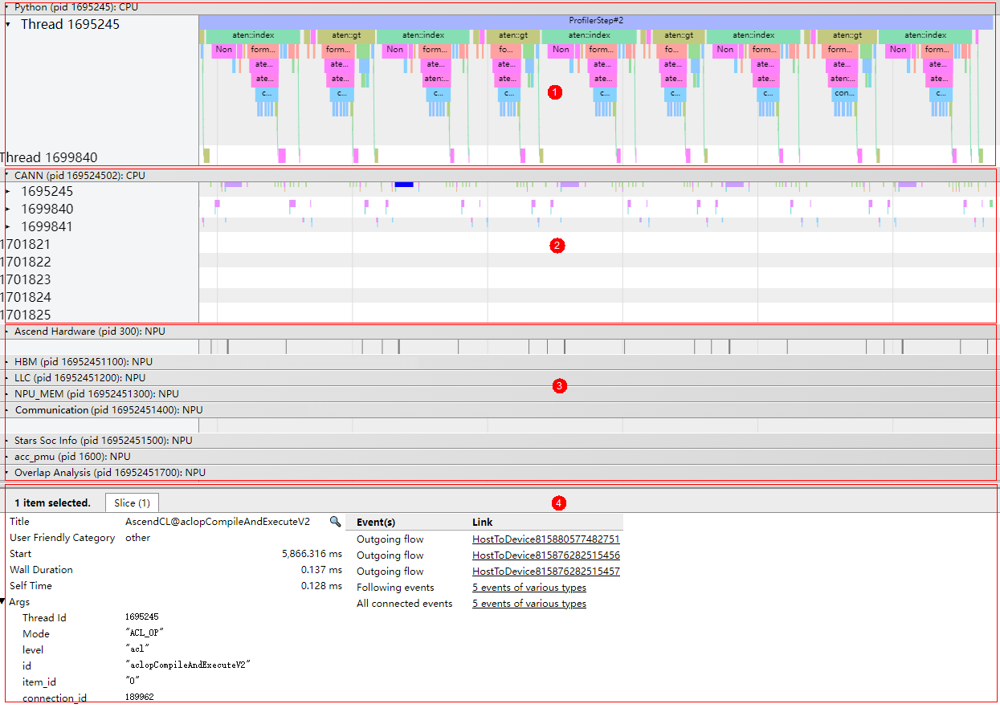

As shown in [Figure 1](#en-us_topic_0000001751419248_fig10608132131617), the timeline summary data is displayed in the following areas.

- Area 1: displays application-layer data, including execution duration information for upper-layer applications. This data is collected using msproftx or in other framework-based environments.
- Area 2: displays CANN-layer data, including execution duration information for components (such as Runtime) and nodes (operators)
- Area 3: displays underlying NPU data, including the execution duration and iteration trace data for task streams under **Ascend Hardware**, **Communication** and **Overlap Analysis** data, and other Ascend AI Processor system data.
- Area 4: displays details about each operator and API in the timeline (displayed when you click the timeline).

>[!NOTE]NOTE
>
>- For details about data in the timeline report, see [Profile Data File Reference](profile_data_file_references.md).
>- Data in each area of the preceding figure depends on the collection environment. For example, Area 1 is generated only during collection in msproftx or other framework-based environments. **Communication** and **Overlap Analysis** data is available only in scenarios involving communication, such as the multi-rank, multi-node, and cluster scenarios. The display of actual data may vary.
>- The `msprof_*.json` file stores data within iterations. Data outside iterations is not displayed.

**Viewing Operator Delivery Directions<a name="en-us_topic_0000001751419248_section174114535213"></a>**

When viewing a .json file in `chrome://tracing`, enable options under **Flow events** to display connection lines between application-layer operators and NPU operators. These lines show the mappings between delivery and execution. For more information, see [Figure 2](#en-us_topic_0000001751419248_fig490591821019).

The mappings include:

- `async_npu`: delivery and execution mappings from application-layer operators to NPU operators on Ascend Hardware.
- `MsTx`: delivery and execution mappings from training or inference process instrumentation tasks to NPU instrumentation operators on Ascend Hardware. These mappings are generated when the `aclprofMarkEx` API is called for instrumentation.
- `async_task_queue`: mappings from enqueue to dequeue at the application layer.
- `HostToDevice`: delivery and execution mappings from CANN-layer nodes (operators) to NPU operators on Ascend Hardware (`host to device`).
- `HostToDevice`: delivery and execution mappings from CANN-layer nodes (operators) to communication operators on Ascend Hardware (`host to device`).
- `fwdbwd`: mappings from forward APIs to backward APIs.

>[!NOTE]NOTE
>
>- Due to the deviation between the Ascend AI Processor frequency measured by software and the actual frequency, as well as the time synchronization error between the host and device, lower-layer operators may fail to be connected by lines due to misplacement.
>- Whether mappings between layers are displayed depends on whether the data is collected in a specific scenario.

**Figure 2** Operator mappings<a name="en-us_topic_0000001751419248_fig490591821019"></a>  
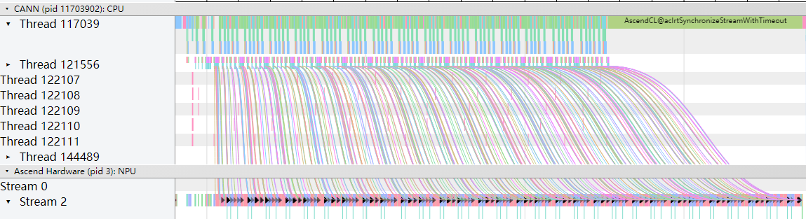

You can click the operator or API at each end of a connection line to view the operator delivery direction. For more information, see [Figure 3](#en-us_topic_0000001751419248_fig11692135416129).

**Figure 3** Operator information<a name="en-us_topic_0000001751419248_fig11692135416129"></a>  
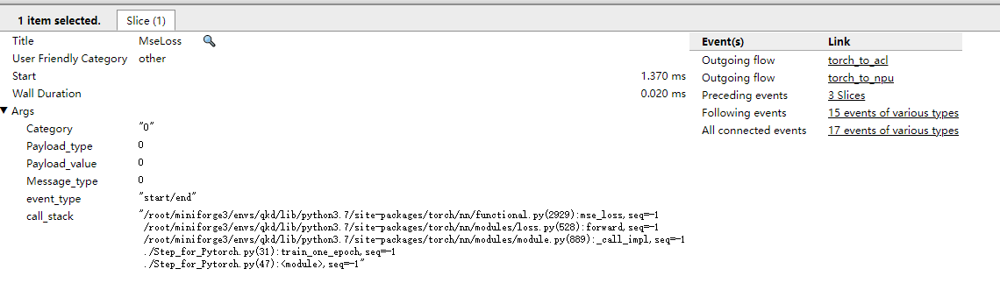

View the inbound and outbound directions of an operator or API in the **Event(s)** column. View the information at both ends of a mapping line in the **Link** column.

**Viewing AI Core Frequency**<a name="en-us_topic_0000001751419248_section9194165318231"></a>

Supported products:

- Atlas 200I/500 A2 inference products
- Atlas A2 training products/Atlas A2 inference products
- Atlas A3 training products/Atlas A3 inference products

The **AI Core Freq** track in `msprof_*.json` displays the frequency changes of the AI Core during AI task execution, as shown in [Figure 4](#en-us_topic_0000001751419248_fig66071155154219).

**Figure 4** Viewing the AI Core frequency<a name="en-us_topic_0000001751419248_fig66071155154219"></a>  
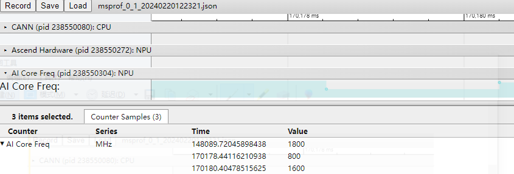

At timestamp 148089.72045898438, the AI Core operated at a high frequency. However, the frequency decreased at 170178.44116210938, which inevitably led to a performance drop for AI tasks during this period. The AI Core frequency may decrease due to rising temperatures triggering protection mechanisms, or when the AI Core enters a low-power state while no AI tasks are being executed.

When frequency changes occur, a 0–1 ms delay exists between the actual change time and the time monitored by the software. This delay may cause the recorded operator execution duration before and after the frequency change to be inconsistent with the actual situation.

**SIO Data Analysis<a name="en-us_topic_0000001751419248_section18441122912161"></a>**

Supported products:

- For Atlas A2 training products/Atlas A2 inference products, this value is always `0` and has no reference value.
- Atlas A3 training products/Atlas A3 inference products

The **SIO** track in `msprof_*.json` displays the transmission bandwidth between channels.

In Atlas A3 training products/Atlas A3 inference products, each SIO data stream uses two virtual channels: **die 0** and **die 1**.

**Figure 5** SIO (Atlas A3 training products/Atlas A3 inference products)<a name="en-us_topic_0000001751419248_fig1090119416103"></a>  
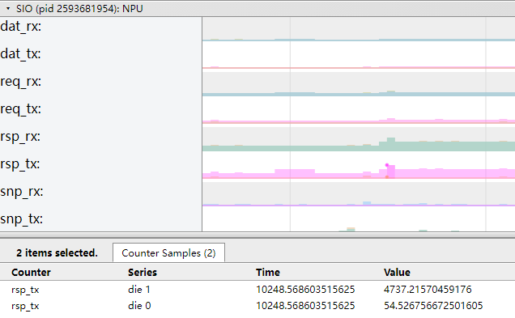

In the figure, the horizontal coordinates of the color blocks correspond to time (ms), and the vertical coordinates correspond to bandwidth values (MB/s).

**Table 1** Field description

|Field|Description|
|--|--|
|dat_rx|Receive bandwidth of the data stream channel|
|dat_tx|Transmit bandwidth of the data stream channel|
|req_rx|Receive bandwidth of the request stream channel|
|req_tx|Transmit bandwidth of the request stream channel|
|rsp_rx|Receive bandwidth of the response stream channel|
|rsp_tx|Transmit bandwidth of the response stream channel|
|snp_rx|Receive bandwidth of the monitor stream channel|
|snp_tx|Transmit bandwidth of the monitor stream channel|

**QoS Data Analysis<a name="en-us_topic_0000001751419248_section7237154131716"></a>**

The **QoS** track in `msprof_*.json` displays the device QoS bandwidth.

Supported products:

- Atlas A2 training products/Atlas A2 inference products
- Atlas A3 training products/Atlas A3 inference products

**Figure 6** QoS OTHERS<a name="en-us_topic_0000001751419248_fig109246157107"></a>  
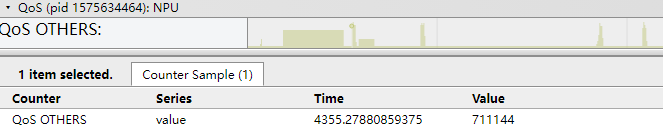

In the figure, the horizontal coordinates of the color blocks correspond to time (ms), and the vertical coordinates correspond to bandwidth values (MB/s).

**MC<sup>2</sup> for Computation and Communication Operator Fusion<a name="en-us_topic_0000001751419248_section10665117313"></a>**

Supported products:

- Atlas inference products
- Atlas A2 training products/Atlas A2 inference products

This section applies to scenarios where computation and communication operators are fused.

MC<sup>2</sup> (Matrix Computation & Communication) is a collective term for a series of fused computation-communication operators in CANN. By fusing traditionally serial communication and compute operators, MC<sup>2</sup> fuses traditionally serial communication and compute operators and uses Tiling to partition operations into multiple rounds. This creates pipeline parallelism across rounds, effectively overlapping communication overhead to enhance overall execution performance.

Specific operators are generally named by concatenating the original computation and communication operator names in their order of dependency. For example, the `AllgatherMatmul` fused operator represents the integration of the communication operator `Allgather` and the compute operator `Matmul`, where `Matmul` depends on the output of `Allgather`.

`commTurn` (communication rounds): The number of tiles partitioned by the fused operator. This value is typically calculated as the total data size divided by the data volume per communication.

In the MC<sup>2</sup> implementation, two operators are loaded onto the computation and communication streams, respectively. These two operators collaborate internally to achieve pipeline parallelism.

- The operator name on the computation stream corresponds to the name of the fused operator, such as `AllgatherMatmul`.
- The operator name on the communication stream follows the format of *fused operator name* + **Aicpu**, such as `AllgatherMatmulAicpu`.

The communication operator executes in multiple rounds according to the tiles partitioned by the fused operator. In each round, the communication operator performs collective communication algorithms based on parameters provided by the compute operator, orchestrates specific tasks, and delivers the tasks to the hardware. Then, it waits for the execution to complete and notifies the computation side of the results.

>[!NOTE]NOTE
>
>- MC<sup>2</sup> fusion is currently not supported for communication API scenarios. These include the low-bit communication operator `MatmulAllReduce` and custom MC<sup>2</sup> operators that utilize communication APIs.
>- The communication part of the timeline displays only level-0 data.

The following example shows the MC<sup>2</sup> profile data results.

**Figure 7** MC<sup>2</sup><a name="en-us_topic_0000001751419248_fig16795116316"></a>  
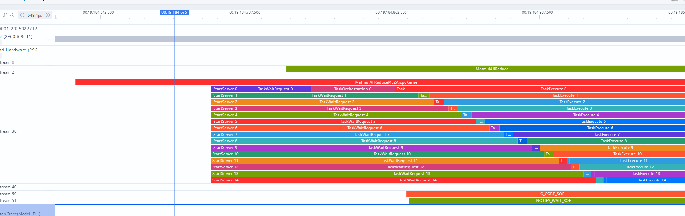

[Figure 7](#en-us_topic_0000001751419248_fig16795116316) shows the timeline information of the fused operator `MatmulAllReduceAddRmsNormAicpu`. [Table 2](#en-us_topic_0000001751419248_table137165193119) describes the meaning of each internal phase.

**Table 2** Field description<a name="en-us_topic_0000001751419248_table137165193119"></a>

|Field|Description|
|--|--|
|StartServer|KFC initialization time|
|TaskWaitRequest|Time spent waiting for the compute operator to deliver communication parameters|
|TaskOrchestration|Time for the communication operator to execute the collective communication algorithm and orchestrate execution tasks|
|TaskLaunch|Time required for task delivery|
|TaskExecute|Time spent waiting for hardware task completion|
|Finalize|KFC finalization process|

**Voltage Data Analysis<a name="en-us_topic_0000001751419248_section5199345010"></a>**

The **Voltage Info** track in `msprof_*.json` displays the device voltage transformation information.

Supported products:

- Atlas A2 training products/Atlas A2 inference products
- Atlas A3 training products/Atlas A3 inference products

The following example shows the voltage transformation characteristic curve.

**Figure 8** Voltage data analysis<a name="en-us_topic_0000001751419248_fig12628420171"></a>  
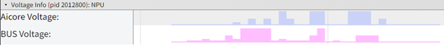

[Figure 8](#en-us_topic_0000001751419248_fig12628420171) shows the voltage transformation characteristic curve. In the figure, the horizontal coordinates of the color blocks correspond to time (ms), and the vertical coordinates correspond to voltage values (mV). [Table 3](#en-us_topic_0000001751419248_table21964325014) describes the fields.

**Table 3** Field description<a name="en-us_topic_0000001751419248_table21964325014"></a>

|Field|Description|
|--|--|
|Aicore Voltage(mV)|AI Core voltage (mV)|
|Bus Voltage(mV)|Interconnect bus voltage (mV)|

#### op\_summary (Operator Details)<a name="EN-US_TOPIC_0000002477303242"></a>

The AI Core, AI Vector Core, and AICPU operator summary data does not contain timeline information. The summary information is aggregated in `op_summary_*.csv` to record statistics on specific details and durations of operators.

**Supported Products<a name="en-us_topic_0000001686107246_section5889102116569"></a>**

|Product|Supported|
|--|:-:|
|Atlas 350 accelerator card|√|
|Atlas A3 training products/Atlas A3 inference products|√|
|Atlas A2 training products/Atlas A2 inference products|√|
|Atlas 200I/500 A2 inference products|√|
|Atlas inference products|√|
|Atlas training products|√|

**op\_summary\_\*.csv File<a name="en-us_topic_0000001686107246_section1214520215155"></a>**

The following example shows the content format of `op_summary_*.csv`.

**Figure 1** op\_summary (example only)<a name="en-us_topic_0000001686107246_fig1265041210717"></a>  
.png "op_summary (example only)")

The **Task Duration** field specifies the operator duration. You can sort operators by **Task Duration** to identify time-consuming operators, or sort them by **Task Type** to view the time-consuming operators executed on the AI Core or AICPU.

>[!NOTE]NOTE
>
>- Supported fields may vary by product. Please refer to the actual result file for the final list of fields.
>- When `task_time` is set to `l0` or `off`, `op_summary_*.csv` does not display PMU data for the AI Core or AI Vector Core.
>- Atlas A2 training products/Atlas A2 inference products: For the `MatMul` operator, if input matrices `a` and `b` meet the criteria (inner axis > 1000, theoretical MAC computation duration > 50 μs, and the inner axis is not 516B-aligned), the `MatMul` operator will be converted into a MIX operator. Consequently, the `MatMul` operator count in `op_summary.csv` will decrease, and the **Task Type** will change from **AI_Core** to **MIX_AIC**.
>- Atlas A3 training products/Atlas A3 inference products: For the `MatMul` operator, if input matrices `a` and `b` meet the following criteria (inner axis > 1000, theoretical MAC computation duration > 50 μs, and the inner axis is not 516B-aligned), the `MatMul` operator will be converted into a MIX operator. Consequently, the `MatMul` operator count in `op_summary.csv` will decrease, and the **Task Type** will change from **AI_Core** to **MIX_AIC**.
>- If the execution duration of an operator is excessively long, the associated metrics may become inaccurate and lose reference value. Such data is uniformly set to `N/A` and is not presented.
>- Operators with the `communication` task type usually consist of a sequence of communication tasks, each with an independent `Task ID` and `Stream ID`. Since these individual identifiers are not displayed here, the `Task ID` and `Stream ID` for this type of operator are marked as `N/A`.
>- If the value of `Input Shapes` is empty (formatted as `; ; ; ;`), it indicates that the input is a scalar. The semicolon (`;`) serves as the delimiter for each dimension. This also applies to output shapes.
>- The tool detects operator overflow. If an overflow is detected, the following alarm is displayed, and the computation result of the operator is unreliable.<br>
**Figure 2** Operator overflow alarm<a name="en-us_topic_0000001686107246_fig144168454163"></a>  
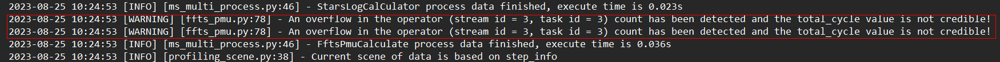

The content of the `op_summary_*.csv` file varies depending on the msProf collection parameters used. The complete fields are as follows.

**Table 1** Common fields

|Field|Description|
|--|--|
|Device_id|Device ID.|
|Model Name|Model name. It may be left empty if the value is not provided in the collected data. (This field is not displayed by default or in single-operator scenarios.)|
|Model ID|Model ID.|
|Task ID|Task ID.|
|Stream ID|Stream ID of the task.|
|Infer ID|Inference iteration ID. (This field is not displayed by default or in single-operator scenarios.)|
|Op Name|Operator name.|
|OP Type|Operator type. If `task_time` is set to `l0`, this field is not collected and `N/A` is displayed.|
|OP State|Dynamic and static information about an operator. The value `dynamic` indicates a dynamic operator, and the value `static` indicates a static operator. Communication operators do not have this state, so `N/A` is displayed. This field is reported only when `--task-time` is `l1`. If `--task-time` is `l0`, `N/A` is displayed.|
|Task Type|Type of the accelerator that executes the task (including `AI_CORE`, `AI_VECTOR_CORE`, and `AI_CPU`). If `task_time` is set to `l0`, this field is not collected and `N/A` is displayed.|
|Task Start Time(us)|Task start time (μs).|
|Task Duration(us)|Task duration, including the time spent scheduling the task to the accelerator, execution time on the accelerator, and the completion response time (μs).|
|Task Wait Time(us)|The time interval between the end of the previous task and the start of the current task (μs).|
|Block Num|Number of task blocks, which corresponds to the number of cores used during task execution. If `task_time` is set to `l0`, this field is not collected and `0` is displayed.|
|HF32 Eligible|Indicates whether the HF32 precision flag is enabled. `YES` indicates enabled, while `NO` indicates disabled. This field is reported only when `--task-time=l1`. It displays as `N/A` when `--task-time=l0`.|
|Mix Block Num|Some operators are executed simultaneously on both the AI Core and Vector Core. The block number for the primary accelerator is specified in the `Block Num` field, and the block number for the secondary accelerator is specified in this field. If `task_time` is set to `l0`, this field is not collected and `N/A` is displayed.|
|Input Shapes|Input shape of the operator. If `task_time` is set to `l0`, this field is not collected and `N/A` is displayed.|
|Input Data Types|Input data type of the operator. If `task_time` is set to `l0`, this field is not collected and `N/A` is displayed.|
|Input Formats|Input format of the operator. If `task_time` is set to `l0`, this field is not collected and `N/A` is displayed.|
|Output Shapes|Output shape of the operator. If `task_time` is set to `l0`, this field is not collected and `N/A` is displayed.|
|Output Data Types|Output data type of the operator. If `task_time` is set to `l0`, this field is not collected and `N/A` is displayed.|
|Output Formats|Output format of the operator. If `task_time` is set to `l0`, this field is not collected and `N/A` is displayed.|
|Context ID|Context ID, which identifies a small operator of a subtask. If no small operator exists, `N/A` is displayed.|
|aiv_time(us)|Theoretical execution duration of a task on the AI Vector Core when all blocks are scheduled simultaneously and each block has an equal execution duration (μs). Typically, the scheduling start time varies slightly across different blocks. Therefore, the value of this field is slightly less than the actual task execution time on the AI Vector Core. The field is populated when `--task-time` is set to `l1` and `--aic-mode` is set to `task-based`.|
|aicore_time(us)|Theoretical execution duration of the task on the AI Core when all blocks are scheduled simultaneously and each block has an equal execution duration (μs). Typically, the scheduling start time varies slightly across different blocks. Therefore, the value of this field is slightly less than the actual task execution time on the AI Core.<br>This data is inaccurate and not recommended for reference if the frequency of the AI Core changes (for example, due to manual frequency regulation, dynamic frequency regulation when power consumption exceeds the threshold, or on Atlas 300V/Atlas 300I Pro products).<br>For details about frequency changes for the Atlas 200I/500 A2 inference products, Atlas A2 training products/Atlas A2 inference products, Atlas A3 training products/Atlas A3 inference products, and the Ascend 350 accelerator card, see [Viewing AI Core Frequency](#en-us_topic_0000001751419248_section9194165318231).<br>The field is populated when `--task-time` is set to `l1` and `--aic-mode` is set to `task-based`.|
|total_cycles|Total number of execution cycles of the task on the AI Core, which is the sum of the execution cycles of all blocks.<br>The field is populated when `--task-time` is set to `l1` and `--aic-mode` is set to `task-based`.<br>For the Atlas 200I/500 A2 inference products, Atlas A2 training products/Atlas A2 inference products, Atlas A3 training products/Atlas A3 inference products, and the Atlas 350 accelerator card, this field is split into `aic_total_cycles` (total cycles executed on the AI Cube Core) and `aiv_total_cycles` (total cycles executed on the AI Vector Core).|
|Register value|Value of the custom register whose data is to be collected. This field is determined by custom registers specified in the `--aic-metrics` option.|

The following fields are generated when `--task-time` is set to `l1` and `--aic-mode` is set to `task-based`. When `--task-time` is set to `l0`, these fields are not collected and `N/A` is displayed. The content of the generated data is determined by the value of the `--aic-metrics` option.

**Table 2** Field description (PipeUtilization)

|Field|Description|
|--|--|
|*_vec_time(us)|Time taken to execute Vector instructions (μs). Atlas 200I/500 A2 inference products do not support this field. Default value: `N/A`.|
|*_vec_ratio|Ratio of cycles taken to execute Vector instructions to the total cycles. Atlas 200I/500 A2 inference products do not support this field. Default value: `N/A`.|
|*_mac_time(us)|Time taken to execute Cube instructions (μs).|
|*_mac_ratio|Ratio of cycles taken to execute Cube instructions to the total cycles.|
|*_scalar_time(us)|Time taken to execute Scalar instructions (μs).|
|*_scalar_ratio|Ratio of cycles taken to execute Scalar instructions to the total cycles.|
|aic_fixpipe_time(us)|Time taken to execute fixpipe instructions (L0C-to-OUT/L1 transfer) (μs).|
|aic_fixpipe_ratio|Ratio of cycles taken to execute fixpipe instructions (L0C-to-OUT/L1 transfer) to the total cycles.|
|*_mte1_time(us)|Time taken to execute MTE1 instructions (L1-to-L0A/L0B transfer) (μs).|
|*_mte1_ratio|Ratio of cycles taken to execute MTE1 instructions (L1-to-L0A/L0B transfer) to the total cycles.|
|*_mte2_time(us)|Time taken to execute MTE2 instructions (DDR-to-AI Core transfer) (μs).|
|*_mte2_ratio|Ratio of cycles taken to execute MTE2 instructions (DDR-to-AI Core transfer) to the total cycles.|
|*_mte3_time(us)|Time taken to execute MTE3 instructions (AI Core-to-DDR transfer) (μs).|
|*_mte3_ratio|Ratio of cycles taken to execute MTE3 instructions (AI Core-to-DDR transfer) to the total cycles.|
|*_icache_miss_rate|iCache is the L2 cache dedicated to instructions. A high `icache_miss_rate` value indicates low instruction-read efficiency for the AI Core.|
|memory_bound|Used to identify memory bottlenecks during AI Core operator execution. It is calculated as: `mte2_ratio/max(mac_ratio, vec_ratio)`. A value less than 1 indicates no memory bottleneck. A value greater than 1 indicates that the AI Core spends most of its task execution time on memory transfers rather than computation. Higher values signify more severe memory bottlenecks.|
|cube_utilization(%)|Cube operator utilization. Check whether the number of operations of the Cube operator in a unit time reaches the theoretical upper limit. A value closer to 100% indicates a value closer to the theoretical upper limit. Formula: `cube_utilization = total_cycles/(freq * core_num * task_duration)`|

Note: For some products, specific fields in this table use an asterisk (`*`) prefix to represent `aic` or `aiv`, indicating that the data reflects execution results on the Cube Core or Vector Core, respectively.

**Table 3** Field description (ArithmeticUtilization)

|Field|Description|
|--|--|
| *_mac_fp16_ratio  | Ratio of cycles taken to execute Cube fp16 instructions to the total cycles. The Atlas 350 accelerator card supports only `aic_mac_fp16_ratio`.|
| *_mac_int8_ratio  | Ratio of cycles taken to execute Cube int8 instructions to the total cycles. The Atlas 350 accelerator card supports only `aic_mac_int8_ratio`.|
| *_vec_fp32_ratio  | Ratio of cycles taken to execute Vector fp32 instructions to the total cycles. Atlas 200I/500 A2 inference products do not support this field. Default value: `N/A`. The Atlas 350 accelerator card does not support this field.|
| *_vec_fp16_ratio  | Ratio of cycles taken to execute Vector fp16 instructions to the total cycles. The Atlas 350 accelerator card does not support this field.|
| *_vec_int32_ratio | Ratio of cycles taken to execute Vector int32 instructions to the total cycles. Atlas 200I/500 A2 inference products do not support this field. Default value: `N/A`. The Atlas 350 accelerator card does not support this field.|
| *_vec_misc_ratio  | Ratio of cycles taken to execute Vector misc instructions to the total cycles. Atlas 200I/500 A2 inference products do not support this field. Default value: `N/A`. The Atlas 350 accelerator card does not support this field.|
| *_cube_fops       | Floating-point operations of the Cube type, indicating the computation volume. This field can be used to measure the complexity of an algorithm or model. The Atlas 350 accelerator card supports only `aic_cube_fops`.|
| *_vector_fops     | Floating-point operations of the Vector type, indicating the computation volume. This field can be used to measure the complexity of an algorithm or model. The Atlas 350 accelerator card does not support this field.|

Note: For some products, specific fields in this table use an asterisk (`*`) prefix to represent `aic` or `aiv`, indicating that the data reflects execution results on the Cube Core or Vector Core, respectively.

**Table 4** Field description (Memory)

|Field|Description|
|--|--|
|*_ub_read_bw(GB/s)|UB read bandwidth (GB/s). Atlas 200I/500 A2 inference products do not support this field. Default value: `N/A`.|
|*_ub_write_bw(GB/s)|UB write bandwidth (GB/s). Atlas 200I/500 A2 inference products do not support this field. Default value: `N/A`.|
|*_l1_read_bw(GB/s)|L1 read bandwidth (GB/s).|
|*_l1_write_bw(GB/s)|L1 write bandwidth (GB/s).|
|*_l2_read_bw|L2 read bandwidth (GB/s). The Atlas 350 accelerator card does not support this field.|
|*_l2_write_bw|L2 write bandwidth (GB/s). Atlas 200I/500 A2 inference products do not support this field. Default value: `N/A`. The Atlas 350 accelerator card does not support this field.|
|*_main_mem_read_bw(GB/s)|Main memory read bandwidth (GB/s).|
|*_main_mem_write_bw(GB/s)|Main memory write bandwidth (GB/s). Atlas 200I/500 A2 inference products do not support this field. Default value: `N/A`.|

Note: For some products, specific fields in this table use an asterisk (`*`) prefix to represent `aic` or `aiv`, indicating that the data reflects execution results on the Cube Core or Vector Core, respectively.

**Table 5** Field description (MemoryL0)

|Field|Description|
|--|--|
|*_l0a_read_bw(GB/s)|l0a read bandwidth (GB/s).|
|*_l0a_write_bw(GB/s)|l0a write bandwidth (GB/s).|
|*_l0b_read_bw(GB/s)|l0b read bandwidth (GB/s).|
|*_l0b_write_bw(GB/s)|l0b write bandwidth (GB/s).|
|*_l0c_read_bw(GB/s)|Bandwidth for Vector to read data from L0C (GB/s).|
|*_l0c_write_bw(GB/s)|Bandwidth for Vector to write data to L0C (GB/s). The Atlas 350 accelerator card does not support this field.|
|*_l0c_read_bw_cube(GB/s)|Bandwidth for Cube to read data from L0C (GB/s).|
|*_l0c_write_bw_cube(GB/s)|Bandwidth for Cube to write data to L0C (GB/s).|

Note: During the collection of `MemoryL0` performance metrics for the AI Vector Core, the collected data will always be `0`. Note: For some products, specific fields in this table use an asterisk (`*`) prefix to represent `aic` or `aiv`, indicating that the data reflects execution results on the Cube Core or Vector Core, respectively.

**Table 6** Field description (MemoryUB)

|Field|Description|
|--|--|
|*_ub_read_bw_vector(GB/s)|Bandwidth for Vector to read data from UB (GB/s).|
|*_ub_write_bw_vector(GB/s)|Bandwidth for Vector to write data to UB (GB/s).|
|*_ub_read_bw_scalar(GB/s)|Bandwidth for Scalar to read data from UB (GB/s).|
|*_ub_write_bw_scalar(GB/s)|Bandwidth for Scalar to write data to UB (GB/s).|
|*_ub_fixp2ub_write_bw(GB/s)|Bandwidth for Vector FixPipe to write data to UB (excluding UB backpressure) (GB/s). Only the Atlas 350 accelerator card supports this field.|

Note: For some products, specific fields in this table use an asterisk (`*`) prefix to represent `aic` or `aiv`, indicating that the data reflects execution results on the Cube Core or Vector Core, respectively.

**Table 7** Field description (ResourceConflictRatio)

|Field|Description|
|--|--|
|*_vec_bankgroup_cflt_ratio|Ratio of cycles taken to execute `vec_bankgroup_stall_cycles` instructions to the total cycles. Improper block stride settings for Vector instructions can lead to bank group conflicts. Atlas 200I/500 A2 inference products do not support this field. Default value: `N/A`. The Atlas 350 accelerator card does not support this field.|
|*_vec_bank_cflt_ratio|Ratio of cycles taken to execute `vec_bank_stall_cycles` instructions to the total cycles. Improper read/write pointer addresses for Vector instruction operands can lead to bank conflicts. Atlas 200I/500 A2 inference products do not support this field. Default value: `N/A`.|
|*_vec_resc_cflt_ratio|Ratio of cycles taken to execute `vec_resc_cflt_ratio` instructions to the total cycles. If an operator involves multiple compute units, ensure that they are concurrently scheduled. If the operator logic keeps delivering instructions to a compute unit that is already busy, the overall computing power is not fully utilized. Atlas 200I/500 A2 inference products do not support this field. Default value: `N/A`.|

Note: For some products, specific fields in this table use an asterisk (`*`) prefix to represent `aic` or `aiv`, indicating that the data reflects execution results on the Cube Core or Vector Core, respectively.

**Table 8** Field description (MemoryAccess)

|Field|Description|
|--|--|
|*_read_main_memory_datas(KB)|Amount of data read from the on-chip memory (KB)|
|*_write_main_memory_datas(KB)|Amount of data written to the on-chip memory (KB)|
|*_GM_to_L1_datas(KB)|Amount of data transferred from GM to L1 (KB)|
|*_L0C_to_L1_datas(KB)|Amount of data transferred from L0C to L1 (KB)|
|*_L0C_to_GM_datas(KB)|Amount of data transferred from L0C to GM (KB)|
|*_GM_to_UB_datas(KB)|Amount of data transferred from GM to UB (KB)|
|*_UB_to_GM_datas(KB)|Amount of data transferred from UB to GM (KB)|

Note: The asterisk (`*`) prefix in the preceding table represents `aic` or `aiv`, indicating that the data reflects execution results on the Cube Core or Vector Core, respectively.

Supported products:

- Atlas A2 training products/Atlas A2 inference products
- Atlas A3 training products/Atlas A3 inference products

**Table 9** Field description (L2Cache)

| Field                         | Description                                                    |
| ------------------------------- | ------------------------------------------------------------ |
| `*_write_cache_hit`             | Number of cache write hits. The Atlas 350 accelerator card does not support this field.  |
| `*_write_cache_miss_allocate`   | Number of cache reallocations after cache write misses. The Atlas 350 accelerator card does not support this field.|
| `*_r*_read_cache_hit`           | Number of cache read hits in the `r*` channel. The Atlas 350 accelerator card does not support this field.|
| `*_r*_read_cache_miss_allocate` | Number of cache re-allocations after read misses in the `r*` channel. The Atlas 350 accelerator card does not support this field.|
| `*_read_local_l2_hit`           | Number of cache read hits. Only the Atlas 350 accelerator card supports this field.  |
| `*_read_local_l2_miss`          | Number of cache read misses. Only the Atlas 350 accelerator card supports this field.    |
| `*_read_local_l2_victim`        | Number of cache read misses that trigger cache victimization. Only the Atlas 350 accelerator card supports this field.|
| `*_write_local_l2_hit`          | Number of cache write hits. Only the Atlas 350 accelerator card supports this field.  |
| `*_write_local_l2_miss`         | Number of cache write misses. Only the Atlas 350 accelerator card supports this field.    |
| `*_write_local_l2_victim`       | Number of cache write misses that trigger cache victimization. Only the Atlas 350 accelerator card supports this field.|

> [!note] Note
>
> - The L2 cache hit rate is calculated as follows: Hits/(Hits + Misses). For example: `*_write_cache_hit / (*_write_cache_hit + *_write_cache_miss_allocate)`. Other hit rates in this table are calculated using the same logic.
> - For some products, specific fields in this table use an asterisk (`*`) prefix to represent `aic` or `aiv`, indicating that the data reflects execution results on the Cube Core or Vector Core, respectively.

Supported products:

- Atlas A2 training products/Atlas A2 inference products
- Atlas A3 training products/Atlas A3 inference products
- Atlas 350 accelerator card
- Atlas 200I/500 A2 inference products

**Table 10** Field description (PipelineExecuteUtilization)

|Field|Description|
|--|--|
|vec_exe_time(us)|Time taken to execute Vector instructions (μs).|
|vec_exe_ratio|Ratio of cycles taken to execute Vector instructions to the total cycles. Atlas 200I/500 A2 inference products do not support this field. Default value: `N/A`.|
|mac_exe_time(us)|Time taken to execute Cube instructions (fp16 and s16) (μs).|
|mac_exe_ratio|Ratio of cycles taken to execute Cube instructions (fp16 and s16) to the total cycles.|
|scalar_exe_time(us)|Time taken to execute Scalar instructions (μs).|
|scalar_exe_ratio|Ratio of cycles taken to execute Scalar instructions to the total cycles.|
|mte1_exe_time(us)|Time taken to execute MTE1 instructions (L1-to-L0A/L0B transfer) (μs).|
|mte1_exe_ratio|Ratio of cycles taken to execute MTE1 instructions (L1-to-L0A/L0B transfer) to the total cycles.|
|mte2_exe_time(us)|Time taken to execute MTE2 instructions (DDR-to-AI Core transfer) (μs).|
|mte2_exe_ratio|Ratio of cycles taken to execute MTE2 instructions (DDR-to-AI Core transfer) to the total cycles.|
|mte3_exe_time(us)|Time taken to execute MTE3 instructions (AI Core-to-DDR transfer) (μs).|
|mte3_exe_ratio|Ratio of cycles taken to execute MTE3 instructions (AI Core-to-DDR transfer) to the total cycles.|
|fixpipe_exe_time(us)|Time taken to execute fixpipe instructions (L0C-to-OUT/L1 transfer) (μs).|
|fixpipe_exe_ratio|Ratio of cycles taken to execute fixpipe instructions (L0C-to-OUT/L1 transfer) to the total cycles.|
|memory_bound|Used to identify memory bottlenecks during AI Core operator execution. It is calculated as: `mte2_ratio/max(mac_ratio, vec_ratio)`. A value less than 1 indicates no memory bottleneck. A value greater than 1 indicates that the AI Core spends most of its task execution time on memory transfers rather than computation. Higher values signify more severe memory bottlenecks.|
|cube_utilization(%)|Cube operator utilization. Check whether the number of operations of the Cube operator in a unit time reaches the theoretical upper limit. A value closer to 100% indicates a value closer to the theoretical upper limit. Formula: `cube_utilization = total_cycles/(freq * core_num * task_duration)`|

Supported products: Atlas 200I/500 A2 inference products

#### op\_statistic (Operator Call Counts and Durations)<a name="EN-US_TOPIC_0000002509383189"></a>

Statistics about the AI Core and AICPU operator call counts and durations do not contain timeline information. The summary information is aggregated in `op_statistic_*.csv`.

**Supported Products<a name="en-us_topic_0000001686266978_section5889102116569"></a>**

|Product|Supported|
|--|:-:|
|Atlas 350 accelerator card|√|
|Atlas A3 training products/Atlas A3 inference products|√|
|Atlas A2 training products/Atlas A2 inference products|√|
|Atlas 200I/500 A2 inference products|√|
|Atlas inference products|√|
|Atlas training products|√|

**Data Description for the op\_statistic\_\*.csv File<a name="en-us_topic_0000001686266978_section142961814104116"></a>**

Analyzes the total durations and call counts for each operator type. This helps identify operators that consume excessive time and assess their potential for optimization.

**Figure 1** op\_statistic\_\*.csv<a name="en-us_topic_0000001686266978_fig1654182131816"></a>  
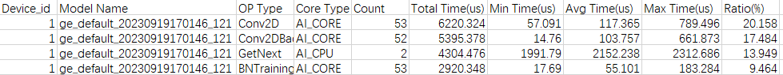

**Table 1** Field description

|Field|Description|
|--|--|
|Device_id|Device ID.|
|Model Name|Model name. It may be left empty if the value is not provided in the collected data. (This field is not displayed by default or in single-operator scenarios.)|
|OP Type|Operator type.|
|Core Type|Core type, including `AI_CORE`, `AI_VECTOR_CORE`, and `AI_CPU`.|
|Count|Number of operator calls.|
|Total Time(us)|Total duration of the operator calls (μs).|
|Avg Time(us), Min Time(us), Max Time(us)|Average, minimum, and maximum durations of the operator calls (μs).|
|Ratio(%)|Percentage of total duration for the operator type in the corresponding model.|

#### api\_statistic (API Duration Statistics)<a name="EN-US_TOPIC_0000002477303240"></a>

Timeline information of API duration statistics is displayed on the **CANN** track in `msprof_*.json`. The summary information is aggregated in `api_statistic_*.csv` to provide execution duration statistics for CANN APIs across layers such as **AscendCL**, **Runtime**, **Node**, **Model**, and **Communication**.

- **AscendCL**: AscendCL APIs (a C-language API library for developing deep neural network applications on the Ascend platform)
- **Runtime**: CANN runtime APIs
- **Node**: CANN operators
- **Model**: model information used for internal analysis (can be ignored)
- **Communication**: collective communication operators

**Supported Products<a name="en-us_topic_0000001656264690_section5889102116569"></a>**

|Product|Supported|
|--|:-:|
|Atlas 350 accelerator card|√|
|Atlas A3 training products/Atlas A3 inference products|√|
|Atlas A2 training products/Atlas A2 inference products|√|
|Atlas 200I/500 A2 inference products|√|
|Atlas inference products|√|
|Atlas training products|√|

**CANN Track in msprof_*.json<a name="en-us_topic_0000001656264690_section344219426541"></a>**

The CANN track in `msprof_*.json` primarily displays the duration of APIs executed in the current thread, as shown in the following figure.

**Figure 1** CANN track<a name="en-us_topic_0000001656264690_fig191420493165"></a>  
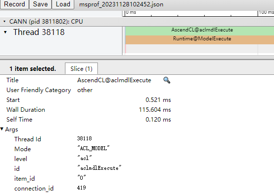

The timeline color blocks in the figure allow you to identify time-consuming APIs. You can click a block to select an API and view its details, as shown in the following table.

**Table 1** Field description

|Field|Description|
|--|--|
|Title|Name of the selected API.|
|Start|Start timestamp on the timeline, which is automatically aligned by `chrome://tracing` (ms).|
|Wall Duration|Duration of the current API call (ms).|
|Self Time|Execution duration of the current API (ms).|
|Mode|AscendCL API type, which can be `ACL_OP` (single-operator model API), `ACL_MODEL` (model API), and `ACL_RTS` (runtime API).|
|level|Layer of the API (current layer: **AscendCL**).|

**api\_statistic\_\*.csv File<a name="en-us_topic_0000001656264690_section11622953115117"></a>**

The following example shows the content format of `api_statistic_*.csv`.

**Figure 2** api\_statistic\_\*.csv<a name="en-us_topic_0000001656264690_fig881322061712"></a>  
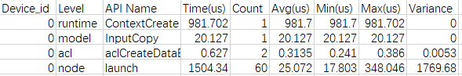

The preceding figure is sorted by the **Time** column in descending order to identify the top N most time-consuming operators. You can also evaluate operator stability or identify calls with long durations by analyzing the maximum, minimum, average, and variance data. For example, a smaller variance indicates more stable operator execution. The closer the maximum and minimum values are to the average (without significant outliers), the more stable the operator performance.

**Table 2** Field description

|Field|Description|
|--|--|
|Device_id|Device ID (displayed as `host` for host-side data)|
|Level|Layer to which the API belongs|
|API Name|API name|
|Time(us)|Total duration (μs)|
|Count|Number of calls|
|Avg(us)|Average duration (μs)|
|Min(us)|Minimum duration (μs)|
|Max(us)|Maximum duration (μs)|
|Variance|Duration variance|

#### msproftx Data Description<a name="EN-US_TOPIC_0000002509383185"></a>

**Supported Products<a name="en-us_topic_0000001798418925_section5889102116569"></a>**

|Product|Supported|
|--|:-:|
|Atlas 350 accelerator card|√|
|Atlas A3 training products/Atlas A3 inference products|√|
|Atlas A2 training products/Atlas A2 inference products|√|
|Atlas 200I/500 A2 inference products|√|
|Atlas inference products|√|
|Atlas training products|√|

**Overview<a name="en-us_topic_0000001798418925_section132087265710"></a>**

msproftx collects profile data output by users and upper-layer framework programs. The data is saved in the `mindstudio_profiler_output` directory.

[Table 1](#en-us_topic_0000001798418925_en-us_topic_0290106133_table972265435020) shows the related data.

**Table 1** Data file description<a name="en-us_topic_0000001798418925_en-us_topic_0290106133_table972265435020"></a>

|File|Description|
|--|--|
|msprof_*.json|Timeline summary data. For details, see [msproftx Timeline Summary Data](#en-us_topic_0000001798418925_section5704032072).|
|msprof_tx_*.json|msproftx timeline data. It is a subset of **msprof_*.json**. For details, see [msproftx Timeline Data](#en-us_topic_0000001798418925_section12121185651210).|
|msprof_tx_*.csv|msproftx summary data. The collected host msproftx summary data is concatenated by thread to provide an associated display of the profile data. For details, see [msprof_tx Summary Data](#en-us_topic_0000001798418925_section15813213018).|

**msproftx Timeline Summary Data<a name="en-us_topic_0000001798418925_section5704032072"></a>**

The timeline summary data of msproftx is displayed on the upper-layer application tracks of `msprof_*.json`, as shown in [Figure 1](#en-us_topic_0000001798418925_fig322453919307). For details about fields at other tracks and their meanings, see [msProf (Timeline Report)](#EN-US_TOPIC_0000002477303238).

**Figure 1** Timeline summary data<a name="en-us_topic_0000001798418925_fig322453919307"></a>  
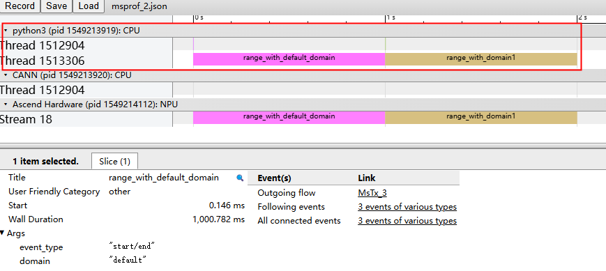

**msproftx Timeline Data<a name="en-us_topic_0000001798418925_section12121185651210"></a>**

The timeline data of msproftx is displayed in `msprof_tx_*.json`, as shown in the following figure.

**Figure 2** msproftx timeline data<a name="en-us_topic_0000001798418925_fig912175631213"></a>  
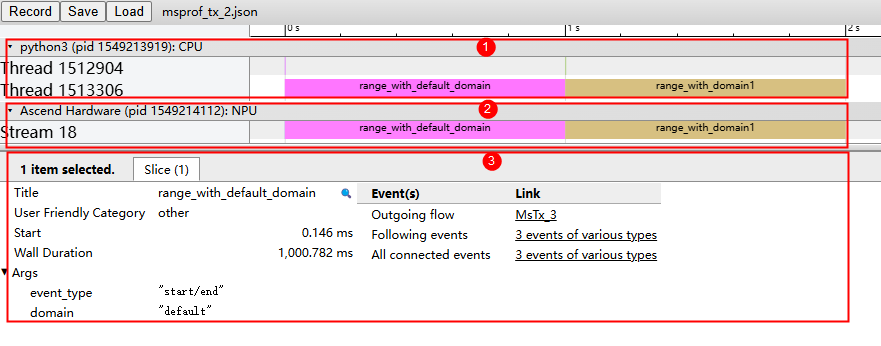

As shown in [Figure 2](#en-us_topic_0000001798418925_fig912175631213), the timeline summary data is displayed in the following areas:

- Area 1: displays msproftx instrumentation data, which records upper-layer application profile data, including the execution durations of the upper-layer applications.
- Area 2: displays underlying NPU data, which contains the duration records of msproftx instrumentation and delivery to the device.
- Area 3: displays details about each operator and API in the timeline (displayed when you click the timeline).

**msprof\_tx Summary Data<a name="en-us_topic_0000001798418925_section15813213018"></a>**

The msprof\_tx summary data file is `msprof_tx_*.csv`.

The following example shows the content format of `msprof_tx_*.csv`.

**Figure 3** msprof\_tx summary data<a name="en-us_topic_0000001798418925_fig52151315519"></a>  
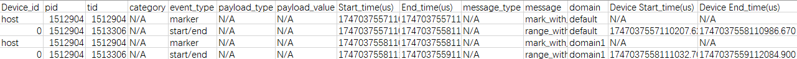

**Table 2** Field description

|Field|Description|
|--|--|
|Device_id|Device ID|
|pid|Process ID|
|tid|Thread ID of the selected AscendCL API|
|category|Type of the msproftx profiling process, which is used to identify the profiling content in the msproftx process (reserved, not used currently)|
|event_type|Event type|
|payload_type|Data type of the additional information payload carried in the msproftx profiling process (reserved, not used currently)|
|payload_value|Pointer to the additional information payload carried in the msproftx profiling process (reserved, not used currently)|
|Start_time(us)|Start time of the msproftx profiling process (μs)|
|End_time(us)|End time of the msproftx profiling process (μs)|
|message_type|Character string type carried in the msproftx profiling process (reserved, not used currently)|
|message|Character string description carried in the msproftx profiling process|
|domain|Domain to which the instrumentation data belongs|
|Device Start_time(us)|Start time of the msproftx profiling process on the device (μs)|
|Device End_time(us)|End time of the msproftx profiling process on the device (μs)|

#### task\_time (Task Scheduling Information)<a name="EN-US_TOPIC_0000002509503207"></a>

Timeline information of the task scheduler profile data is displayed on the **Ascend Hardware** track in `msprof_*.json`. The summary information is aggregated in `task_time_*.csv` to help identify the scheduling duration during AI task execution.

**Supported Products<a name="en-us_topic_0000001679380154_section5889102116569"></a>**

|Product|Supported|
|--|:-:|
|Atlas 350 accelerator card|√|
|Atlas A3 training products/Atlas A3 inference products|√|
|Atlas A2 training products/Atlas A2 inference products|√|
|Atlas 200I/500 A2 inference products|√|
|Atlas inference products|√|
|Atlas training products|√|

**Task Scheduler Data in msprof_*.json<a name="en-us_topic_0000001679380154_section11622953115117"></a>**

The task scheduler data in `msprof_*.json` is displayed across various streams on the **Ascend Hardware** track. By recording the execution time of each task across different accelerators, you can intuitively identify bottlenecks in task scheduling.

The following example shows the task scheduler data in `msprof_*.json`.

**Figure 1** Ascend Hardware<a name="en-us_topic_0000001679380154_fig1264110521453"></a>  
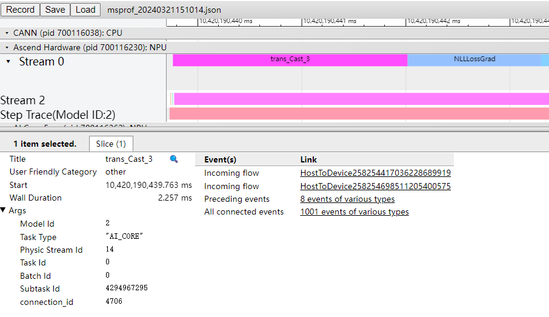

The following table describes the key fields.

**Table 1** Field description

|Field|Description|
|--|--|
|Title|API name of the selected component.|
|Start|Start timestamp on the timeline, which is automatically aligned by `chrome://tracing` (ms).|
|Wall Duration|Duration of the current API call (ms).|
|Task Time(us)|Task execution duration of the AICPU operator (μs).|
|Reduce Duration(us)|Collective communication duration of the ALL REDUCE operator (μs).|
|Model Id|Model ID.|
|Task Type|Type of the accelerator that executes the task (including `AI_CORE`, `AI_VECTOR_CORE`, and `AI_CPU`).|
|Stream Id|Stream ID of the task. The stream ID under **Ascend Hardware** is the complete logic stream ID of the task, and the stream ID attribute of each API in the timeline on the right is the physical stream ID of the API.|
|Task Id|Task ID.|
|Subtask Id|Subtask ID.|
|Aicore Time(ms)|Theoretical execution duration of the task on the AI Core when all blocks are scheduled simultaneously and each block has an equal execution duration (ms). Typically, the scheduling start time varies slightly across different blocks. Therefore, the value of this field is slightly less than the actual task execution duration on the AI Core. This data is inaccurate and not recommended for reference during manual frequency scaling, dynamic frequency scaling (when power consumption exceeds the default), or when using Atlas 300V or Atlas 300I Pro.|
|Total Cycle|Total number of execution cycles of the task on the AI Core, which is the sum of the execution cycles of all blocks.|
|Receive Time|Time when the device receives information about the memory copy task (μs). This field is displayed only for the `MemcopyAsync` API.|
|Start Time|Time when the memory copy task starts (μs). This field is displayed only for the `MemcopyAsync` API.|
|End Time|Time when the memory copy task ends (μs). This field is displayed only for the `MemcopyAsync` API.|
|size(B)|Size of data copied (bytes). This field is displayed only for the `MemcopyAsync` API.|
|bandwidth(GB/s)|Copy bandwidth (GB/s). This field is displayed only for the `MemcopyAsync` API.|
|operation|Copy type, such as `host to device` or `device to host`. This field is displayed only for the `MemcopyAsync` API.|

**task\_time\_\*.csv File<a name="en-us_topic_0000001679380154_section586724384714"></a>**

The following example shows the content format of `task_time_*.csv`.

**Figure 2** task\_time\_\*.csv<a name="en-us_topic_0000001679380154_fig77617419164"></a>  
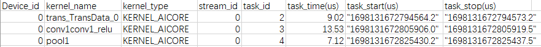

By identifying the top-consuming operators in a task, you can determine if an operator is faulty based on its specific implementation.

**Table 2** Field description

|Field|Description|
|--|--|
|Device_id|Device ID|
|kernel_name|Kernel name (`N/A` indicates a non-compute operator)|
|kernel_type|Kernel type, including `KERNEL_AICORE` and `KERNEL_AICPU`|
|stream_id|Stream ID of the task|
|task_id|Task ID|
|task_time(us)|Task duration, including scheduling time to the accelerator, execution time on the accelerator, and response end time (μs)|
|task_start(us)|Task start time (μs)|
|task_stop(us)|Task end time (μs)|

#### step\_trace (Iteration Trace Information)<a name="EN-US_TOPIC_0000002477463224"></a>

Timeline information of the iteration trace data is displayed in `step_trace_*.json`. The summary information is aggregated in `step_trace_*.csv` to help identify time-consuming iterations.

This profile data file does not exist in single-operator scenarios (such as the PyTorch scenario).

**Supported Products<a name="en-us_topic_0000001706482137_section5889102116569"></a>**

|Product|Supported|
|--|:-:|
|Atlas 350 accelerator card|√|
|Atlas A3 training products/Atlas A3 inference products|√|
|Atlas A2 training products/Atlas A2 inference products|√|
|Atlas 200I/500 A2 inference products|√|
|Atlas inference products|√|
|Atlas training products|√|

**step\_trace\_\*.json File<a name="en-us_topic_0000001706482137_section8123844101012"></a>**

Iteration trace data is stored in `step_trace_*.json`. You can identify the most time-consuming iteration based on the iteration duration.

The following example shows the content format of `step_trace_*.json`.

**Figure 1** step\_trace\_\*.json<a name="en-us_topic_0000001706482137_fig131371629121716"></a>  
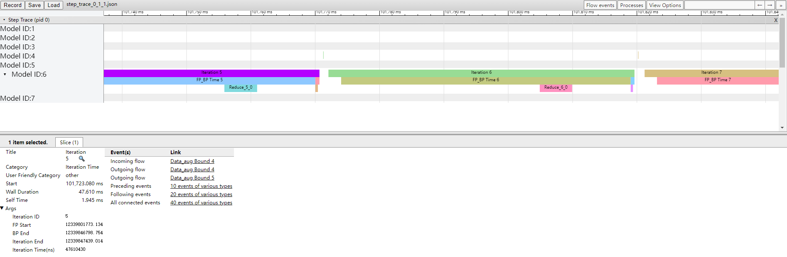

Iteration trace data consists of software information from the training job and the AI software stack, which can be used to analyze the performance of the training job. Taking the default two-segment gradient splitting policy as an example, iteration execution is clarified by printing the timestamps of key nodes, including **fp_start**, **bp_end**, **Reduce Start**, and **Reduce Duration(us)**.

In offline inference scenarios, FP (start of the forward operator in the iteration trace) and BP (end of the backward operator in the iteration trace) are not collected. Consequently, **FP Start** and **BP End** will be displayed as **N/A** in the results, and no timeline will be generated.

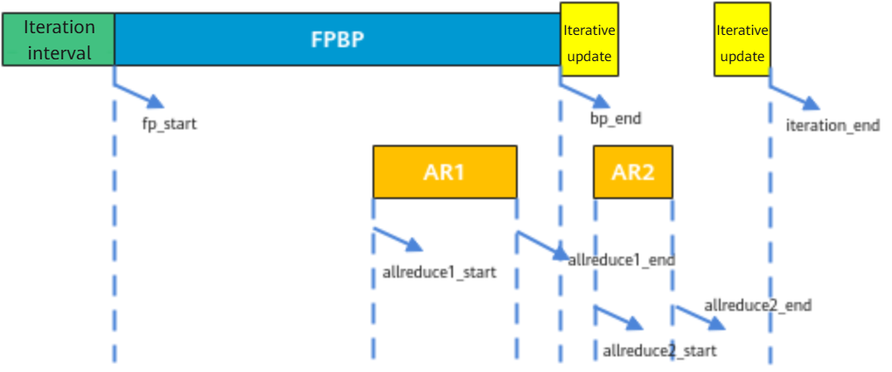

As shown in the preceding figure, to determine the gradient splitting policy, calculate the difference between `bp_end` and `allreduce1_end` as follows: (`BP End` – `Reduce End`)/`freq` (Based on the obtained iteration traces, the **first batch** of collective communication duration is used for calculation.)

**Table 1** Field description

|Field|Description|
|--|--|
|Title|API name of the selected component.|
|Start|Start timestamp on the timeline, which is automatically aligned by `chrome://tracing` (ms).|
|Wall Duration|Duration of the current API call (ms).|
|Iteration ID|Iteration ID for graph-based statistics collection. The iteration ID is incremented by 1 each time a graph is executed. When a script is compiled into multiple graphs, the iteration ID is different from the step ID at the script layer.|
|FP Start|FP start time (ns).|
|Iteration End|End time of each iteration (ns).|
|Iteration Time(ns)|Iteration duration (ns).|
|BP End|BP end time (ns).|
|FP_BP Time|FP/BP elapsed time (= `BP End` – `FP Start`) (ns).|
|Iteration Refresh|Iteration refresh lag (= `Iteration End` – `BP End`) (ns).|
|Data_aug Bound|Data augmentation refresh lag (= Current `FP Start` – Previous `Iteration End`). The elapsed time of iteration 0 is `N/A` because the previous `Iteration End` is absent.|
|Reduce|Collective communication duration (may involve groups of iterations). `ph:B` indicates the start time, and `ph:E` indicates the end time. If there is only one device, no `Reduce` data is output.|

**Data Reading Time Analysis<a name="en-us_topic_0000001706482137_section18193612191110"></a>**

For the interval between the end of a previous iteration and the start of the next, you can use the `GetNext` time slice to determine if an excessive interval is caused by long data reading time, as shown in [Figure 2](#en-us_topic_0000001706482137_fig989215211178).

Only the TensorFlow framework supports this function.

**Figure 2** GetNext<a name="en-us_topic_0000001706482137_fig989215211178"></a>  
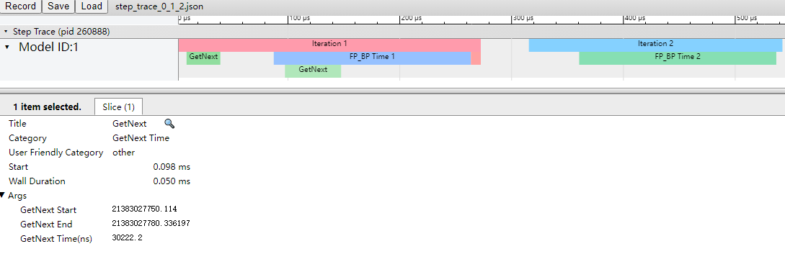

**Table 2** GetNext field description

|Field|Description|
|--|--|
|GetNext Start|Start time of data reading (ns)|
|GetNext End|End time of data reading (ns)|
|GetNext Time(ns)|Time required for data reading (ns)|

**step\_trace\_\*.csv File<a name="en-us_topic_0000001706482137_section20701181816418"></a>**

The following example shows the content format of `step_trace_*.csv`.

**Figure 3** step\_trace\_\*.csv<a name="en-us_topic_0000001706482137_fig1790711444171"></a>  
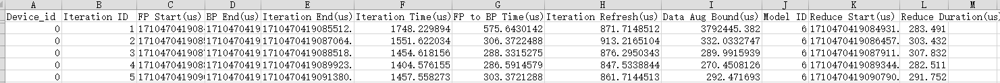

Conclusions drawn from `step_trace_*.json` can be cross-verified using information in `step_trace_*.csv`.

**Table 3** Field description

|Field|Description|
|--|--|
|Device_id|Device ID.|
|Iteration ID|Iteration ID for graph-based statistics collection. The iteration ID is incremented by 1 each time a graph is executed. When a script is compiled into multiple graphs, the iteration ID is different from the step ID at the script layer.|
|FP Start(us)|FP start time (μs).|
|BP End(us)|BP end time (μs).|
|Iteration End(us)|End time of each iteration (μs).|
|Iteration Time(us)|Iteration duration (μs).|
|FP to BP Time(us)|FP/BP elapsed time (= `BP End` – `FP Start`) (μs).|
|Iteration Refresh(us)|Iteration refresh lag (= `Iteration End` – `BP End`) (μs).|
|Data Aug Bound(us)|Data augmentation refresh lag (= Current `FP Start` – Previous `Iteration End`) (μs). The elapsed time of iteration 0 is `N/A` because the previous `Iteration End` is absent.|
|Model ID|Graph ID within the model for a specific iteration.|
|Reduce Start(us)|Start time of collective communication (μs).|
|Reduce Duration(us)|Collective communication duration (may involve groups of iterations). In this example, the duration is divided into two segments according to the default splitting policy. **Reduce Start** indicates the start time, and **Reduce Duration** indicates the duration from the start to the end (μs). If there is only one device, no **Reduce** data is output.|

#### communication\_statistic (Collective Communication Operator Statistics)<a name="EN-US_TOPIC_0000002509503209"></a>

Timeline information for collective communication operators and compute-communication overlap is displayed on the **Communication** track in `msprof_*.json`. Summary data is aggregated in `communication_statistic_*.csv`. Compute-communication overlap analysis statistics are displayed on the **Overlap Analysis** track in `msprof_*.json`.

Collective communication operator data is collected and parsed only in scenarios involving inter-rank communication, such as the multi-rank, multi-server, and cluster scenarios.

**Supported Products<a name="en-us_topic_0000001658339478_section5889102116569"></a>**

|Product|Supported|
|--|:-:|
|Atlas 350 accelerator card|√|
|Atlas A3 training products/Atlas A3 inference products|√|
|Atlas A2 training products/Atlas A2 inference products|√|
|Atlas 200I/500 A2 inference products|√|
|Atlas inference products|√|
|Atlas training products|√|

**Communication Track in msprof_*.json<a name="en-us_topic_0000001658339478_section8123844101012"></a>**

The following figure shows data on the **Communication** track in `msprof_*.json`.

**Figure 1** Large communication operators<a name="en-us_topic_0000001658339478_fig18715851115013"></a>  
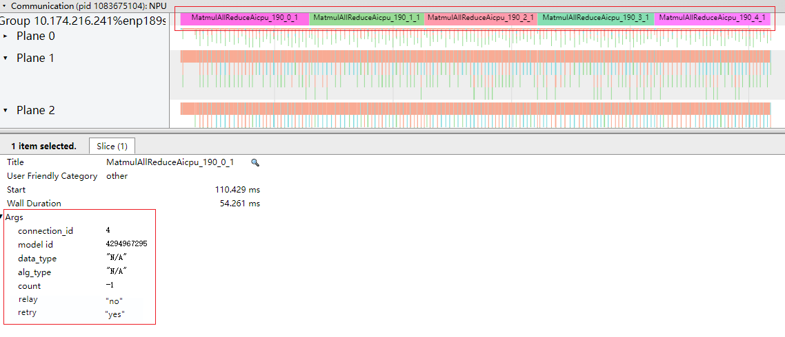

**Figure 2** Small communication operators<a name="en-us_topic_0000001658339478_fig471535125016"></a>  
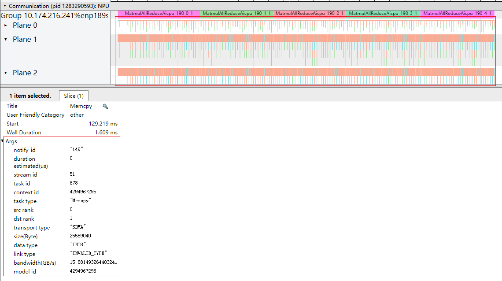

In multi-rank, multi-server, and cluster scenarios, ranks communicating with each other form communication groups. The **Communication** track displays the durations of communication operators based on the arranged communication groups, allowing you to intuitively identify the most time-consuming operators in this file.

**Table 1** Common information

|Field|Description|
|--|--|
|Group * *Communication* (communication group name, determined by the reported name)|Communication operators in a communication group. A rank may exist in different communication groups, and a group identifies the behavior of the current rank in the current communication group.|
|Plane ID|Network plane ID. For the parallel scheduling and execution of multiple transmit (TX)/receive (RX) links, each plane represents a distinct concurrent communication dimension.|
|Title|API name of the selected component.|
|Start|Start timestamp on the timeline, which is automatically aligned by `chrome://tracing` (ms).|
|Wall Duration|Duration of the current API call (ms).|
|Self Time|Execution duration of the current instruction (ms).|

**Table 2** Information about large communication operators

|Field|Description|
|--|--|
|connection_id|ID of the connection between a CANN API and an NPU operator when the former is delivered to the latter.|
|model id|Model ID.|
|data_type|Data type.|
|alg_type|Algorithm type in each phase of communication operators. Supported types include: `MESH`, `RING`, `NB`, `HD`, `NHR`, `PIPELINE`, `PAIRWISE`, and `STAR`.|
|count|Data transmission count.|
|relay|Indicates whether rail borrowing occurred for the communication operator. Valid values: `yes` or `no`. Supported products:<br>Atlas A2 training products/Atlas A2 inference products: Only `no` is displayed, with no specific meaning.<br>Atlas A3 training products/Atlas A3 inference products|
|retry|Indicates whether the communication operator was re-executed: `yes` (re-executed) or `no` (not re-executed). Supported products:<br>Atlas A2 training products/Atlas A2 inference products<br>Atlas A3 training products/Atlas A3 inference products|

**Table 3** Information about small communication operators

|Field|Description|
|--|--|
|notify id|Unique notify ID. The `notify id` is valid only for `notify` tasks and `RDMA send` tasks used to transmit `notify record` signals. For other task types, this field is invalid and is displayed as `18446744073709551615`.|
|duration estimated(us)|Estimated task duration (μs).|
|stream id|Stream ID of the task.|
|task id|Task ID.|
|task type|Task type.|
|src rank|Source rank.|
|dst rank|Destination rank. The value `4294967295` indicates a local on-chip operation.|
|transport type|Transmission type, including `LOCAL`, `SDMA`, and `RDMA`.|
|size(Byte)|Data size (bytes). For `notify` tasks, this field is invalid and is populated with `0`.|
|data type|Data type.|
|link type|Link type, including `HCCS`, `PCIe`, and `RoCE`.|
|bandwidth(GB/s)|Bandwidth (GB/s).|
|model id|Model ID.|

**Computation-Communication Overlap Analysis<a name="en-us_topic_0000001658339478_section18441122912161"></a>**

Overlap analysis statistics for computation and communication are displayed on the **Overlap Analysis** track in `msprof_*.json`, controlled by the `--task-time` and `--hccl` options, as shown in [Figure 3](#en-us_topic_0000001658339478_fig1514136114211).

Since computation and communication occur in parallel, you can assess computation-communication efficiency by analyzing the overlap duration (the period during which both processes run in parallel).

**Figure 3** Computation-communication overlap<a name="en-us_topic_0000001658339478_fig1514136114211"></a>  
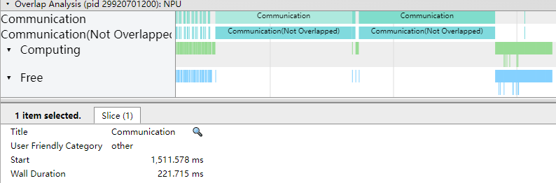

**Table 2** Field description

|Field|Description|
|--|--|
|Communication|Communication duration. This field is not displayed in single-rank scenarios because no communication is involved.|
|Communication(Not Overlapped)|Communication duration that is not overlapped. This field is not displayed in single-rank scenarios because no communication is involved.|
|Computing|Computation duration.|
|Free|Idle duration.|
|Start|Start time of the current API call (ms).|
|Wall Duration|Duration of the current API call (ms).|

**communication\_statistic\_\*.csv File<a name="en-us_topic_0000001658339478_section1214520215155"></a>**

The following example shows the content format of `communication_statistic_*.csv`.

**Figure 4** communication\_statistic\_\*.csv<a name="en-us_topic_0000001658339478_fig172301674189"></a>  
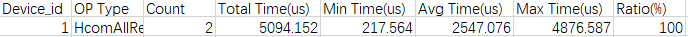

`communication_statistic_*.csv` stores the collective communication operator statistics, through which you can learn the execution duration of an operator type and the duration ratio of each communication operator in collective communication to determine whether the operator can be optimized.

**Table 3** Field description

|Field|Description|
|--|--|
|Device_id|Device ID|
|OP Type|Type of the collective communication operator|
|Count|Number of collective communication operator executions|
|Total Time(us)|Total execution duration of collective communication operators (μs)|
|Min Time(us)|Minimum execution duration of collective communication operators (μs)|
|Avg Time(us)|Average execution duration of collective communication operators (μs)|
|Max Time(us)|Maximum execution duration of collective communication operators (μs)|
|Ratio(%)|Proportion of the execution duration of collective communication operators to the total collective communication duration|

#### memory\_record (Memory Usage of CANN Operators)<a name="EN-US_TOPIC_0000002477303250"></a>

The memory usage records of CANN operators do not contain timeline information. The summary information is aggregated in `memory_record_*.csv`, which records the memory allocated to the GE component on the **CANN** track and the occupation time.

**Supported Products<a name="en-us_topic_000000170451978_section5889102116569"></a>**

|Product|Supported|
|--|:-:|
|Atlas 350 accelerator card|√|
|Atlas A3 training products/Atlas A3 inference products|√|
|Atlas A2 training products/Atlas A2 inference products|√|
|Atlas 200I/500 A2 inference products|√|
|Atlas inference products|√|
|Atlas training products|√|

**Data Description for the memory\_record\_\*.csv File<a name="en-us_topic_000000170451978_section104048511517"></a>**

The following example shows the content format of `memory_record_*.csv`.

**Figure 1** memory\_record\_\*.csv<a name="en-us_topic_000000170451978_fig18726153033320"></a>  
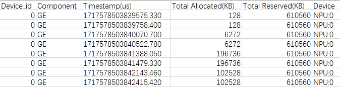

**Table 1** Field description

|Field|Description|
|--|--|
|Device_id|Device ID|
|Component|Component (the CANN profiling tool collects data only for the GE component)|
|Timestamp(us)|Timestamp indicating the start of memory occupancy (μs)|
|Total Allocated(KB)|Total allocated memory (KB)|
|Total Reserved(KB)|Total reserved memory (KB)|
|Device|Device type and device ID (only NPUs are involved)|

#### operator\_memory (Details About Memory Usage of CANN Operators)<a name="EN-US_TOPIC_0000002477463232"></a>

The memory usage details of CANN operators do not contain timeline information. The summary information is aggregated in `operator_memory_*.csv`, which records the memory required for executing a specific CANN operator on the NPU and the occupation time.

**Supported Products<a name="en-us_topic_0000001752279281_section5889102116569"></a>**

|Product|Supported|
|--|:-:|
|Atlas 350 accelerator card|√|
|Atlas A3 training products/Atlas A3 inference products|√|
|Atlas A2 training products/Atlas A2 inference products|√|
|Atlas 200I/500 A2 inference products|√|
|Atlas inference products|√|
|Atlas training products|√|

**Data Description for the operator\_memory\_\*.csv File<a name="en-us_topic_0000001752279281_section104048511517"></a>**

The following example shows the content format of `operator_memory_*.csv`.

**Figure 1** operator\_memory\_\*.csv<a name="en-us_topic_0000001752279281_fig280612153313"></a>  
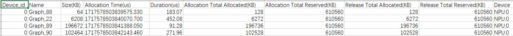

The following table describes the key fields.

**Table 1** Field description

|Field|Description|
|--|--|
|Device_id|Device ID|
|Name|Operator name|
|Size(KB)|Size of memory occupied by the operator (KB)|
|Allocation Time(us)|Memory allocation time (μs)|
|Duration(us)|Memory occupation duration (μs)|
|Allocation Total Allocated(KB)|Total memory allocated from the GE memory pool during operator memory allocation (KB)|
|Allocation Total Reserved(KB)|Total size of the GE memory pool during operator memory allocation (KB)|
|Release Total Allocated(KB)|Total memory allocated from the GE memory pool at the time of operator memory deallocation (KB)|
|Release Total Reserved(KB)|Total size of the GE memory pool during operator memory deallocation (KB)|
|Device|Device type and device ID (only NPUs are involved)|

**Negative and Empty Value Description<a name="en-us_topic_0000001752279281_section73121012154017"></a>**

`operator_memory_*.csv` may contain empty or negative values if certain operator allocation or deallocation events fall outside the profile data collection scope. For details, see the following example.

**Figure 2** Negative and empty value description<a name="en-us_topic_0000001752279281_fig16334112284217"></a>  
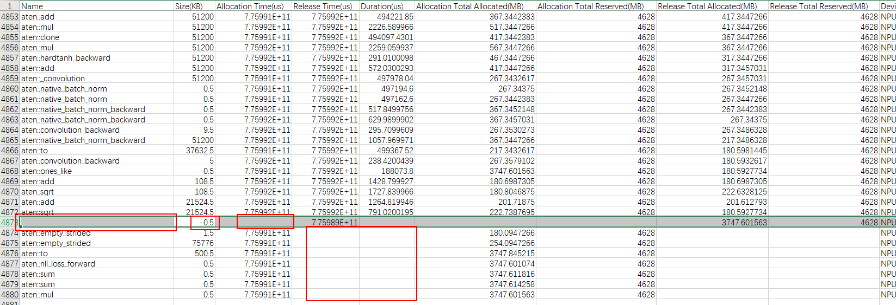

Negative value description: In the preceding figure, row 4873 of the **Size** column shows a negative value. (Memory allocation size is positive, while memory deallocation size is negative. If memory is both allocated and deallocated within the profiling window, the **Size** column displays the allocation value.) However, for this row, the **Name** column cannot identify an operator name, **Allocation** columns are empty, and **Release** columns show valid deallocation values. This indicates that memory allocation for the operator occurred before the profiling process, but memory deallocation occurred within the profiling window. Consequently, only a negative value for memory deallocation was captured. Furthermore, operator name identification occurs only during memory allocation. Consequently, the operator name cannot be identified during memory deallocation. Since the allocation fell outside the profiling window, the **Allocation** columns remain empty.

Empty value description: For operators after row 4874 in the preceding figure, values in the **Release** columns are empty, while other values remain normal. This indicates that memory allocation for these operators occurred within the profiling window, but memory deallocation occurred outside of it. Because memory deallocation was not captured, the **Release** columns remain empty.

#### npu\_mem (NPU memory usage)<a name="EN-US_TOPIC_0000002509383193"></a>

Timeline information of the NPU memory usage is displayed on the **NPU MEM** track in `msprof_*.json`. The summary information is aggregated in `npu_mem_*.csv`.

**Supported Products<a name="en-us_topic_0000001704360086_section91616487538"></a>**

|Product|Supported|
|--|:-:|
|Atlas 350 accelerator card|√|
|Atlas A3 training products/Atlas A3 inference products|√|
|Atlas A2 training products/Atlas A2 inference products|√|
|Atlas 200I/500 A2 inference products|√|
|Atlas inference products|√|
|Atlas training products|√|

**NPU MEM Track in msprof_*.json<a name="en-us_topic_0000001704360086_section11622953115117"></a>**

The following figure shows data on the **NPU MEM** track in `msprof_*.json`. (The following figure is only an example. The actual display depends on the product implementation.)

**Figure 1** NPU MEM track<a name="en-us_topic_0000001704360086_fig186331551142017"></a>  
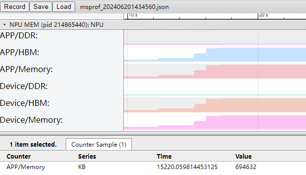

The preceding figure shows the process-level and device-level memory usage. The `Memory` field indicates the total memory usage (KB).

**npu\_mem\_\*.csv File<a name="en-us_topic_0000001704360086_section11791341554"></a>**

The following example shows the content format of `npu_mem_*.csv`.

**Figure 2** npu\_mem\_\*.csv<a name="en-us_topic_0000001704360086_fig137821719212"></a>  
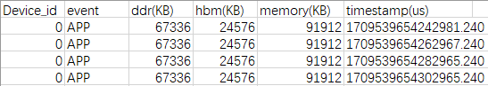

The preceding table shows the memory usage details. The `Memory` field indicates the total memory usage (KB).

#### npu\_module\_mem (Memory Usage of NPU Components)<a name="EN-US_TOPIC_0000002509503215"></a>

The memory usage data of the NPU components does not contain timeline information. The summary information is aggregated in `npu_module_mem_*.csv`.

**Supported Products<a name="en-us_topic_0000001797276317_section165442389381"></a>**

|Product|Supported|
|--|:-:|
|Atlas 350 accelerator card|√|
|Atlas A3 training products/Atlas A3 inference products|√|
|Atlas A2 training products/Atlas A2 inference products|√|
|Atlas 200I/500 A2 inference products|√|
|Atlas inference products|√|
|Atlas training products|√|

**Data Description for the npu\_module\_mem\_\*.csv File<a name="en-us_topic_0000001797276317_section104048511517"></a>**

The following example shows the content format of `npu_module_mem_*.csv`.

**Figure 1** npu\_module\_mem\_\*.csv<a name="en-us_topic_0000001797276317_fig537247162117"></a>  
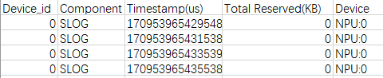

**Table 1** Field description

|Field|Description|
|--|--|
|Device_id|Device ID.|
|Component|Component name.|
|Timestamp(us)|Timestamp (μs). You can view the memory used by the component at the current point in time.|
|Total Reserved(KB)|Memory usage (KB). A value of `–1` may indicate that only the released memory is collected for the component.|
|Device|Device type and device ID (NPUs only).|

### Extended Deliverables

#### dp (Data Augmentation Information)<a name="EN-US_TOPIC_0000002509383187"></a>

Data augmentation information is generated only in training scenarios and only the summary data file `dp_*.csv` is generated.

In TensorFlow training scenarios, `dp_*.csv` can be generated when data preprocessing offload is enabled (`enable_data_pre_proc` is set to `True`). For details, see "Iteration Offload" in the *TensorFlow 1.15 Model Porting Guide*.

**Supported Products<a name="en-us_topic_0000001752181593_section91616487538"></a>**

|Product|Supported|
|--|:-:|
|Atlas A3 training products/Atlas A3 inference products|x|
|Atlas A2 training products/Atlas A2 inference products|x|
|Atlas 200I/500 A2 inference products|x|
|Atlas inference products|x|
|Atlas training products|√|

**dp\_\*.csv File<a name="en-us_topic_0000001752181593_section5874203112014"></a>**

The following example shows the content format of `dp_*.csv`.

**Figure 1** dp\_\*.csv<a name="en-us_topic_0000001752181593_fig5210278292"></a>  
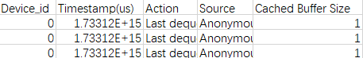

**Table 1** Field description

|Field|Description|
|--|--|
|Device_id|Device ID|
|Timestamp(us)|Timestamp of the event (μs)|
|Action|Action of the event|
|Source|Event source|
|Cached Buffer Size|Cached buffer size occupied by an event|

#### ai\_core\_utilization (Percentage of AI Core Instructions)<a name="EN-US_TOPIC_0000002509503211"></a>

Timeline information about the percentage of AI Core instructions is displayed on the **AI Core Utilization** track in `msprof_*.json`. The summary information is aggregated in `ai_core_utilization_*.csv`.

**Supported Products<a name="en-us_topic_0000001731321225_section5889102116569"></a>**

|Product|Supported|
|--|:-:|
|Atlas 350 accelerator card|√|
|Atlas A3 training products/Atlas A3 inference products|√|
|Atlas A2 training products/Atlas A2 inference products|√|
|Atlas 200I/500 A2 inference products|√|
|Atlas inference products|√|
|Atlas training products|√|

**Percentage of AI Core Instructions in msprof_*.json<a name="en-us_topic_0000001731321225_section432932191111"></a>**

The following example shows the content format of `msprof_*.json`.

**Figure 1** AI Core Utilization track<a name="en-us_topic_0000001731321225_fig8427528151814"></a>  
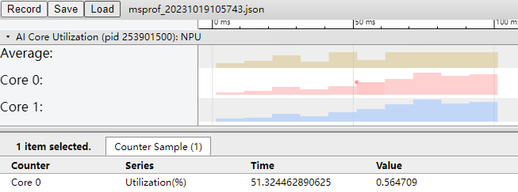

**Table 1** Field description

|Field|Description|
|--|--|
|Average|Mean value.|
|Core {ID}|Core ID.|
|utilization(%)|Percentage of total AI Core cycles spent executing a task within the current sampling period (measured from the first to the last instruction of the operator).|

**ai\_core\_utilization\_\*.csv File<a name="en-us_topic_0000001731321225_section1214520215155"></a>**

The following example shows the content format of `ai_core_utilization_*.csv`.

**Figure 2** ai\_core\_utilization (example only)<a name="en-us_topic_0000001731321225_fig12780124014279"></a>  
.png "ai_core_utilization (example only)")

File results vary depending on the `--aic-metrics` option value. The complete fields are as follows.

>[!NOTE]NOTE
>
>- Supported fields may vary by product. Please refer to the actual result file for the final list of fields.
>- The following fields are generated when `--task-time` is set to `l1` and `--aic-mode` is set to `sample-based`. When `--task-time` is set to `l0`, these fields are not collected and `N/A` is displayed. The content of the generated data is controlled by the value of the `--aic-metrics` option.

**Table 2** Field description (PipeUtilization)

|Field|Description|
|--|--|
|vec_ratio|Ratio of cycles taken to execute Vector instructions to the total cycles. Atlas 200I/500 A2 inference products do not support this field. Default value: `N/A`. This field is not supported by Atlas A2 training and Atlas A2 inference products. This field is not supported by Atlas A3 training and Atlas A3 inference products.|
|mac_ratio|Ratio of cycles taken to execute Cube instructions to the total cycles.|
|scalar_ratio|Ratio of cycles taken to execute Scalar instructions to the total cycles.|
|mte1_ratio|Ratio of cycles taken to execute MTE1 instructions (L1-to-L0A/L0B transfer) to the total cycles.|
|mte2_ratio|Ratio of cycles taken to execute MTE2 instructions (DDR-to-AI Core transfer) to the total cycles.|
|mte3_ratio|Ratio of cycles taken to execute MTE3 instructions (AI Core-to-DDR transfer) to the total cycles. This field is not supported by Atlas A2 training and Atlas A2 inference products. This field is not supported by Atlas A3 training and Atlas A3 inference products.|
|icache_miss_rate|iCache is the L2 cache dedicated to instructions. A high `icache_miss_rate` value indicates low instruction-read efficiency for the AI Core.|
|fixpipe_ratio|Ratio of cycles taken to execute fixpipe instructions (L0C-to-OUT/L1 transfer) to the total cycles.|
|memory_bound|Used to identify memory bottlenecks during AI Core operator execution. It is calculated as: `mte2_ratio/max(mac_ratio, vec_ratio)`. A value less than 1 indicates no memory bottleneck. A value greater than 1 indicates that the AI Core spends most of its task execution time on memory transfers rather than computation. Higher values signify more severe memory bottlenecks. This field is not supported by Atlas A2 training and Atlas A2 inference products. This field is not supported by Atlas A3 training and Atlas A3 inference products.|

**Table 3** Field description (ArithmeticUtilization)

|Field|Description|
|--|--|
|mac_fp16_ratio|Ratio of cycles taken to execute Cube fp16 instructions to the total cycles.|
|mac_int8_ratio|Ratio of cycles taken to execute Cube int8 instructions to the total cycles.|
|vec_fp32_ratio|Ratio of cycles taken to execute Vector fp32 instructions to the total cycles. Atlas 200I/500 A2 inference products do not support this field. Default value: `N/A`. The Atlas 350 accelerator card does not support this field.|
|vec_fp16_ratio|Ratio of cycles taken to execute Vector fp16 instructions to the total cycles. Atlas 200I/500 A2 inference products do not support this field. Default value: `N/A`. The Atlas 350 accelerator card does not support this field.|
|vec_int32_ratio|Ratio of cycles taken to execute Vector int32 instructions to the total cycles. Atlas 200I/500 A2 inference products do not support this field. Default value: `N/A`. The Atlas 350 accelerator card does not support this field.|
|vec_misc_ratio|Ratio of cycles taken to execute Vector misc instructions to the total cycles. Atlas 200I/500 A2 inference products do not support this field. Default value: `N/A`. The Atlas 350 accelerator card does not support this field.|
|cube_fops|Floating-point operations of the Cube type, indicating the computation volume. This field can be used to measure the complexity of an algorithm or model.|
|vector_fops|Floating-point operations of the Vector type, indicating the computation volume. This field can be used to measure the complexity of an algorithm or model. The Atlas 350 accelerator card does not support this field.|

**Table 4** Field description (Memory)

|Field|Description|
|--|--|
|ub_read_bw(GB/s)|UB read bandwidth (GB/s). Atlas 200I/500 A2 inference products do not support this field. Default value: `N/A`.|
|ub_write_bw(GB/s)|UB write bandwidth (GB/s). Atlas 200I/500 A2 inference products do not support this field. Default value: `N/A`.|
|l1_read_bw(GB/s)|L1 read bandwidth (GB/s).|
|l1_write_bw(GB/s)|L1 write bandwidth (GB/s).|
|l2_read_bw|L2 read bandwidth (GB/s). The Atlas 350 accelerator card does not support this field.|
|l2_write_bw|L2 write bandwidth (GB/s). Atlas 200I/500 A2 inference products do not support this field. Default value: `N/A`. The Atlas 350 accelerator card does not support this field.|
|main_mem_read_bw(GB/s)|Main memory read bandwidth (GB/s).|
|main_mem_write_bw(GB/s)|Main memory write bandwidth (GB/s). Atlas 200I/500 A2 inference products do not support this field. Default value: `N/A`.|

**Table 5** Field description (MemoryL0)

|Field|Description|
|--|--|
|l0a_read_bw(GB/s)|l0a read bandwidth (GB/s).|
|l0a_write_bw(GB/s)|l0a write bandwidth (GB/s).|
|l0b_read_bw(GB/s)|l0b read bandwidth (GB/s).|
|l0b_write_bw(GB/s)|l0b write bandwidth (GB/s).|
|l0c_read_bw(GB/s)|Bandwidth for Vector to read data from L0C (GB/s).|
|l0c_write_bw(GB/s)|Bandwidth for Vector to write data to L0C (GB/s). The Atlas 350 accelerator card does not support this field.|
|l0c_read_bw_cube(GB/s)|Bandwidth for Cube to read data from L0C (GB/s).|
|l0c_write_bw_cube(GB/s)|Bandwidth for Cube to write data to L0C (GB/s).|

Note: During the collection of `MemoryL0` performance metrics for the AI Vector Core, the collected data will always be `0`.

**Table 6** Field description (MemoryUB)

|Field|Description|
|--|--|
|ub_read_bw_vector(GB/s)|Bandwidth for Vector to read data from UB (GB/s)|
|ub_write_bw_vector(GB/s)|Bandwidth for Vector to write data to UB (GB/s)|
|ub_read_bw_scalar(GB/s)|Bandwidth for Scalar to read data from UB (GB/s)|
|ub_write_bw_scalar(GB/s)|Bandwidth for Scalar to write data to UB (GB/s)|

**Table 7** Field description (ResourceConflictRatio)

|Field|Description|
|--|--|
|vec_bankgroup_cflt_ratio|Ratio of cycles taken to execute `vec_bankgroup_stall_cycles` instructions to the total cycles. Improper block stride settings for Vector instructions can lead to bank group conflicts. Atlas 200I/500 A2 inference products do not support this field. Default value: `N/A`. The Atlas 350 accelerator card does not support this field.|
|vec_bank_cflt_ratio|Ratio of cycles taken to execute `vec_bank_stall_cycles` instructions to the total cycles. Improper read/write pointer addresses for Vector instruction operands can lead to bank conflicts. Atlas 200I/500 A2 inference products do not support this field. Default value: `N/A`.|
|vec_resc_cflt_ratio|Ratio of cycles taken to execute `vec_resc_cflt_ratio` instructions to the total cycles. If an operator involves multiple compute units, ensure that they are concurrently scheduled. If the operator logic keeps delivering instructions to a compute unit that is already busy, the overall computing power is not fully utilized. Atlas 200I/500 A2 inference products do not support this field. Default value: `N/A`.|

**Table 8** Field description (L2Cache)

|Field|Description|
|--|--|
|write_cache_hit|Number of cache write hits. The Atlas 350 accelerator card does not support this field.|
|write_cache_miss_allocate|Number of cache reallocations after cache write misses. The Atlas 350 accelerator card does not support this field.|
|r*_read_cache_hit|Number of cache read hits in the `r*` channel. The Atlas 350 accelerator card does not support this field.|
|r*_read_cache_miss_allocate|Number of cache re-allocations after read misses in the `r*` channel. The Atlas 350 accelerator card does not support this field.|
|read_local_l2_hit|Number of cache read hits. Only the Atlas 350 accelerator card supports this field.|
|read_local_l2_miss|Number of cache read misses. Only the Atlas 350 accelerator card supports this field.|
|read_local_l2_victim|Number of cache read misses that trigger cache victimization. Only the Atlas 350 accelerator card supports this field.|
|write_local_l2_hit|Number of cache write hits. Only the Atlas 350 accelerator card supports this field.|
|write_local_l2_miss|Number of cache write misses. Only the Atlas 350 accelerator card supports this field.|
|write_local_l2_victim|Number of cache write misses that trigger cache victimization. Only the Atlas 350 accelerator card supports this field.|

Supported products:

- Atlas A2 training products/Atlas A2 inference products
- Atlas A3 training products/Atlas A3 inference products
- Atlas 350 accelerator card
- Atlas 200I/500 A2 inference products

**Table 9** Field description (MemoryAccess)

|Field|Description|
|--|--|
|read_main_memory_datas(KB)|Amount of data read from the on-chip memory (KB)|
|write_main_memory_datas(KB)|Amount of data written to the on-chip memory (KB)|
|gm_to_l1_datas(KB)|Amount of data transferred from GM to L1 (KB)|
|l0c_to_l1_datas(KB)|Amount of data transferred from L0C to L1 (KB)|
|l0c_to_gm_datas(KB)|Amount of data transferred from L0C to GM (KB)|
|gm_to_ub_datas(KB)|Amount of data transferred from GM to UB (KB)|
|ub_to_gm_datas(KB)|Amount of data transferred from UB to GM (KB)|

Supported products:

- Atlas A2 training products/Atlas A2 inference products
- Atlas A3 training products/Atlas A3 inference products

#### ai\_vector\_core\_utilization (Percentage of AI Vector Core Instructions)<a name="EN-US_TOPIC_0000002477463228"></a>

Statistics about the percentage of AI Vector Core instructions do not contain timeline information. The summary information is aggregated in `ai_vector_core_utilization_*.csv`.

**Supported Products<a name="en-us_topic_0000001750641108_section91616487538"></a>**

|Product|Supported|
|--|:-:|
|Atlas 350 accelerator card|√|
|Atlas A3 training products/Atlas A3 inference products|√|
|Atlas A2 training products/Atlas A2 inference products|√|
|Atlas 200I/500 A2 inference products|√|
|Atlas inference products|x|
|Atlas training products|x|

**ai\_vector\_core\_utilization\_\*.csv File<a name="en-us_topic_0000001750641108_section44809124408"></a>**

The following example shows the content format of `ai_vector_core_utilization_*.csv`.

**Figure 1** ai\_vector\_core\_utilization\_\*.csv<a name="en-us_topic_0000001750641108_fig167159472016"></a>  
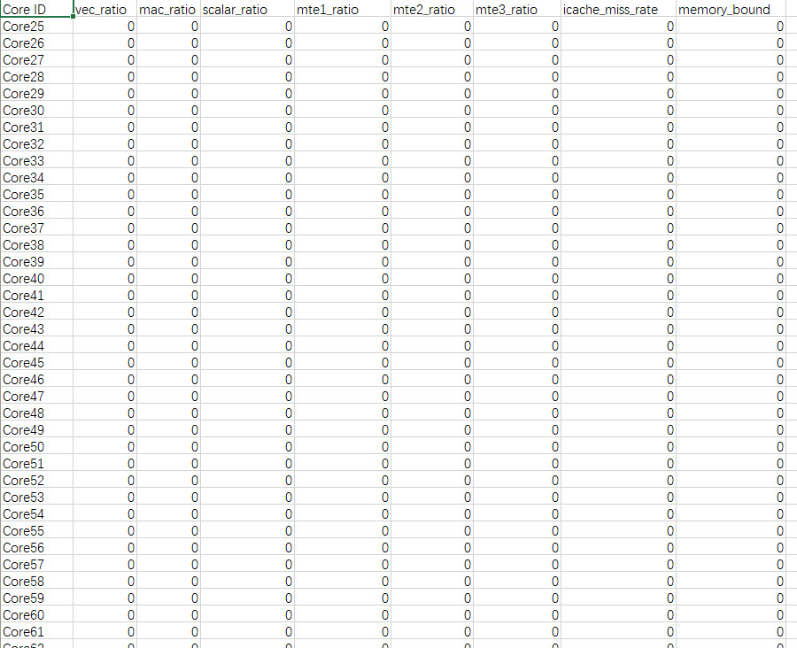

**Table 1** Field description

|Field|Description|
|--|--|
|vec_ratio|Ratio of cycles taken to execute Vector instructions to the total cycles. Atlas 200I/500 A2 inference products do not support this field. Default value: `N/A`.|
|mac_ratio|Ratio of cycles taken to execute Cube instructions (fp16 and s16) to the total cycles.|
|scalar_ratio|Ratio of cycles taken to execute Scalar instructions to the total cycles.|
|mte1_ratio|Ratio of cycles taken to execute MTE1 instructions (L1-to-L0A/L0B transfer) to the total cycles.|
|mte2_ratio|Ratio of cycles taken to execute MTE2 instructions (DDR-to-AI Core transfer) to the total cycles. (Atlas 200I/500 A2 inference products)|
|mte2_ratio|Ratio of cycles taken to execute MTE2 instructions (on-chip memory to AI Core transfer) to the total cycles. (Atlas A2 training products/Atlas A2 inference products) (Atlas A3 training products/Atlas A3 inference products)|
|mte3_ratio|Ratio of cycles taken to execute MTE3 instructions (AI Core-to-DDR transfer) to the total cycles. (Atlas 200I/500 A2 inference products)|
|mte3_ratio|Ratio of cycles taken to execute MTE3 instructions (AI Core to on-chip memory transfer) to total cycles. (Atlas A2 training products/Atlas A2 inference products) (Atlas A3 training products/Atlas A3 inference products)|
|icache_miss_rate|iCache miss rate (L1 instruction cache misses). A smaller value indicates better performance.|
|memory_bound|Used to identify memory bottlenecks during AI Core operator execution. It is calculated as: `mte2_ratio/max(mac_ratio, vec_ratio)`. A value less than 1 indicates no memory bottleneck. A value greater than 1 indicates a memory bottleneck. Higher values signify more severe memory bottlenecks.|

Note: This section uses PipeUtilization in a sample-based scenario as an example of AI Vector Core performance metrics. For more parameter details, see [ai_core_utilization (AI Core Instruction Ratio)](#EN-US_TOPIC_0000002509503211).

#### aicpu (Detailed Duration of AICPU Operators)<a name="EN-US_TOPIC_0000002509383191"></a>

The AICPU operator duration data does not contain timeline information. The summary information is aggregated in `aicpu_*.csv`.

**Supported Products<a name="en-us_topic_0000001752101817_section91616487538"></a>**

|Product|Supported|
|--|:-:|
|Atlas 350 accelerator card|√|
|Atlas A3 training products/Atlas A3 inference products|√|
|Atlas A2 training products/Atlas A2 inference products|√|
|Atlas 200I/500 A2 inference products|√|
|Atlas inference products|√|
|Atlas training products|√|

**aicpu\_\*.csv File<a name="en-us_topic_0000001752101817_section98641131621"></a>**

The following example shows the content format of `aicpu_*.csv`.

**Figure 1** aicpu\_\*.csv<a name="en-us_topic_0000001752101817_fig101583132201"></a>  
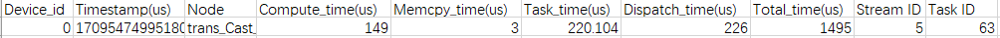

This file records AICPU data reported during data preprocessing. Other AICPU-related files contain full AICPU data.

**Table 1** Field description

|Field|Description|
|--|--|
|Device_id|Device ID|
|Timestamp(us)|Timestamp of the event|
|Node|Node name of the task|
|Compute_time(us)|Computation duration (μs)|
|Memcpy_time(us)|Memory copy duration (μs)|
|Task_time(us)|AICPU operator execution duration, including operator preprocessing, computation, and memory copy (μs)|
|Dispatch_time(us)|Time taken to distribute the task (μs)|
|Total_time(us)|Duration from the start to the end of the task recorded in kernel mode, including `Dispatch_time`, AICPU framework scheduling time, and AICPU operator execution duration (μs)|
|Stream ID|Stream ID of the task.|
|Task ID|Task ID.|

#### aicpu\_mi (Data Preparation Queues)<a name="EN-US_TOPIC_0000002509503213"></a>

Records the sizes of data preparation queues. It is generated when AICPU is enabled in data offloading scenarios.

**Supported Products<a name="en-us_topic_0000002013989984_section91616487538"></a>**

|Product|Supported|
|--|:-:|
|Atlas 350 accelerator card|√|
|Atlas A3 training products/Atlas A3 inference products|√|
|Atlas A2 training products/Atlas A2 inference products|√|
|Atlas 200I/500 A2 inference products|√|
|Atlas inference products|√|
|Atlas training products|√|

**aicpu\_mi\_\*.csv File<a name="en-us_topic_0000002013989984_section98641131621"></a>**

The following example shows the content format of `aicpu_mi_*.csv`.

**Figure 1** aicpu\_mi\_\*.csv<a name="en-us_topic_0000002013989984_fig10248152262010"></a>  
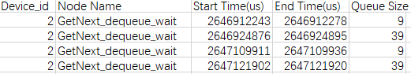

**Table 1** Field description

|Field|Description|
|--|--|
|Device_id|Device ID|
|Node Name|Name of the data preparation queue|
|Start Time(us)|Start time of data reading (μs)|
|End Time(us)|End time of data reading (μs)|
|Queue Size|Queue size|

#### l2\_cache (L2 Cache Hit Ratio)<a name="EN-US_TOPIC_0000002477303246"></a>

The L2 cache data does not contain timeline information. The summary information is aggregated in `l2_cache_*.csv`.

**Supported Products<a name="en-us_topic_0000001704262430_section91616487538"></a>**

|Product|Supported|
|--|:-:|
|Atlas 350 accelerator card|√|
|Atlas A3 training products/Atlas A3 inference products|√|
|Atlas A2 training products/Atlas A2 inference products|√|
|Atlas 200I/500 A2 inference products|√|
|Atlas inference products|√|
|Atlas training products|√|

**l2\_cache\_\*.csv File<a name="en-us_topic_0000001704262430_section98641131621"></a>**

The following example shows the content format of `l2_cache_*.csv`.

**Figure 1** l2\_cache\_\*.csv<a name="en-us_topic_0000001704262430_fig1350115305204"></a>  
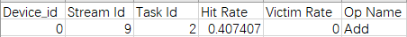

For the following products:

- Atlas inference products
- Atlas training products

The `Hit Rate` and `Victim Rate` for the first operator in this file are not intended for reference.

For the following products:

- Atlas 200I/500 A2 inference products
- Atlas A2 training products/Atlas A2 inference products
- Atlas A3 training products/Atlas A3 inference products

Data of the first operator in the file is missing. This does not affect the overall performance analysis.

**Table 1** Field description

|Field|Description|
|--|--|
|Device_id|Device ID.|
|Stream Id|Stream ID of the task.|
|Task Id|Task ID.|
|Hit Rate|Ratio of L2 cache hits to total memory access requests.<br>For Atlas 200I/500 A2 inference products, Atlas A2 training products/Atlas A2 inference products, and Atlas A3 training products/Atlas A3 inference products, you are advised to use the L2 cache group of `aic_metrics` to collect the `Hit Rate` data. In this collection mode, the `Hit Rate` data is displayed in `op_summary_*.csv`.|
|Victim Rate|Ratio of read cache misses that trigger cache victimization to total memory access requests.<br>For Atlas 200I/500 A2 inference products, Atlas A2 training products/Atlas A2 inference products, and Atlas A3 training products/Atlas A3 inference products, the value of `Victim Rate` may be greater than `1`.|
|Op Name|Operator name.|

#### fusion\_op (Operator Fusion Data)<a name="EN-US_TOPIC_0000002477463230"></a>

The operator fusion data (before and after) does not contain timeline information. The summary information is aggregated in `fusion_op_*.csv`.

This profile data file does not exist in single-operator scenarios (such as the PyTorch scenario).

**Supported Products<a name="en-us_topic_0000001704421886_section5889102116569"></a>**

|Product|Supported|
|--|:-:|
|Atlas 350 accelerator card|√|
|Atlas A3 training products/Atlas A3 inference products|√|
|Atlas A2 training products/Atlas A2 inference products|√|
|Atlas 200I/500 A2 inference products|√|
|Atlas inference products|√|
|Atlas training products|√|

**fusion\_op\_\*.csv File<a name="en-us_topic_0000001704421886_section98641131621"></a>**

The following example shows the content format of `fusion_op_*.csv`.

**Figure 1** fusion\_op\_\*.csv<a name="en-us_topic_0000001704421886_fig686494418203"></a>  
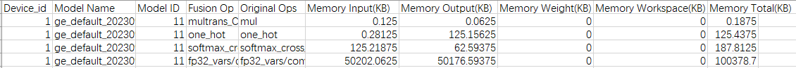

**Table 1** Field description

|Field|Description|
|--|--|
|Device_id|Device ID (displayed as `host` for host-side data)|
|Model Name|Model name|
|Model ID|Model ID|
|Fusion Op|Name of the fused operator|
|Original Ops|Names of base operators|
|Memory Input(KB)|Input tensor memory size (KB)|
|Memory Output(KB)|Output tensor memory size (KB)|
|Memory Weight(KB)|Weight memory size (KB)|
|Memory Workspace(KB)|Workspace  size (KB)|
|Memory Total(KB)|Total memory size calculated as the sum of `Memory Input`, `Memory Output`, `Memory Weight`, and `Memory Workspace` (KB)|

#### static\_op\_mem (Static Graph Operator Memory)<a name="EN-US_TOPIC_0000002509383197"></a>

Memory statistics for static graph operators do not contain timeline information. The summary information is aggregated in `static_op_mem_*.csv`.

**Supported Products<a name="en-us_topic_0000001924444106_section5889102116569"></a>**

|Product|Supported|
|--|:-:|
|Atlas 350 accelerator card|√|
|Atlas A3 training products/Atlas A3 inference products|√|
|Atlas A2 training products/Atlas A2 inference products|√|
|Atlas 200I/500 A2 inference products|√|
|Atlas inference products|√|
|Atlas training products|√|

**Data Description for the static\_op\_mem\_\*.csv File<a name="en-us_topic_0000001924444106_section104048511517"></a>**

The following example shows the content format of `static_op_mem_*.csv`.

**Figure 1** static\_op\_mem\_\*.csv<a name="en-us_topic_0000001924444106_fig788719246226"></a>  
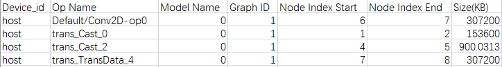

In single-operator scenarios, the `ACL_PROF_TASK_MEMORY` data collection function is enabled by calling the `aclprofCreateConfig` API. The data is reported only during the model compilation phase. This file provides a view of operator memory allocation within each subgraph for static graph scenarios.

In static graph scenarios, different computation graphs are distinguished by their Graph ID. In dynamic subgraph scenarios, subgraphs are distinguished by their Model Name (root node name).

**Table 1** Field description

|Field|Description|
|--|--|
|Device_id|Device ID.|
|Op Name|Operator name. The last row **TOTAL** shows the total allocated memory.|
|Model Name|Name of the root node of a static submap. If the value is `0`, the graph is a static graph and the static subgraph does not exist. If a static submap exists, the root node name is displayed.|
|Graph ID|Graph ID. Each graph ID corresponds to a computation graph.|
|Node Index Start|Logical time of operator memory allocation.|
|Node Index End|Logical time of operator memory release. A value of `4294967295` indicates the maximum timestamp for operator memory allocation. That is, memory release occurs at the end of the life cycle of the computation graph.|
|Size(KB)|Size of the allocated memory (KB).|

#### sys\_mem (System Memory Data)<a name="EN-US_TOPIC_0000002509503219"></a>

The system memory data does not contain timeline information. The summary information is aggregated in `sys_mem_*.csv`.

**Supported Products<a name="en-us_topic_0000001751484586_section5889102116569"></a>**

|Product|Supported|
|--|:-:|
|Atlas 350 accelerator card|√|
|Atlas A3 training products/Atlas A3 inference products|√|
|Atlas A2 training products/Atlas A2 inference products|√|
|Atlas 200I/500 A2 inference products|√|
|Atlas inference products|√|
|Atlas training products|√|

**Data Description for the sys\_mem\_\*.csv File<a name="en-us_topic_0000001751484586_section104048511517"></a>**

The following example shows the content format of `sys_mem_*.csv`.

**Figure 1** sys\_mem\_\*.csv<a name="en-us_topic_0000001751484586_fig1844811313228"></a>  


**Table 1** Field description

|Field|Description|
|--|--|
|Device_id|Device ID|
|Memory Total(kB)|Total system memory (KB)|
|Memory Free(kB)|Available system memory (KB)|
|Buffers(kB)|Memory buffer size (KB)|
|Cached(kB)|Cache size (KB)|
|Share Memory(kB)|Shared memory (KB)|
|Commit Limit(kB)|Virtual memory limit (KB)|
|Committed AS(kB)|Memory committed to the system (KB)|
|Huge Pages Total(pages)|Total number of huge pages in the system|
|Huge Pages Free(pages)|Total number of free huge pages in the system|

#### process_mem (Process Memory Usage Data)<a name="EN-US_TOPIC_0000002477303252"></a>

The process memory usage data does not contain timeline information. The summary information is aggregated in `process_mem_*.csv`.

**Supported Products<a name="en-us_topic_0000001798284369_section5889102116569"></a>**

|Product|Supported|
|--|:-:|
|Atlas 350 accelerator card|√|
|Atlas A3 training products/Atlas A3 inference products|√|
|Atlas A2 training products/Atlas A2 inference products|√|
|Atlas 200I/500 A2 inference products|√|
|Atlas inference products|√|
|Atlas training products|√|

**Data Description for the process\_mem\_\*.csv File<a name="en-us_topic_0000001798284369_section104048511517"></a>**

The following example shows the content format of `process_mem_*.csv`.

**Figure 1** process\_mem\_\*.csv<a name="en-us_topic_0000001798284369_fig13750153752213"></a>  
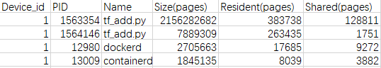

**Table 1** Field description

|Field|Description|
|--|--|
|Device_id|Device ID|
|PID|Process ID|
|Name|Process name|
|Size(pages)|Memory pages used by the process|
|Resident(pages)|Physical memory pages used by the process|
|Shared(pages)|Shared memory pages used by the process|

#### cpu\_usage (AICPU and Ctrl CPU Utilization)<a name="EN-US_TOPIC_0000002477463234"></a>

Utilization data for the AICPU (executing AICPU operators) and Ctrl CPU (executing driver tasks) does not contain timeline information. The summary information is aggregated in `cpu_usage_*.csv`.

**Supported Products<a name="en-us_topic_0000001798325329_section5889102116569"></a>**

|Product|Supported|
|--|:-:|
|Atlas 350 accelerator card|√|
|Atlas A3 training products/Atlas A3 inference products|√|
|Atlas A2 training products/Atlas A2 inference products|√|
|Atlas 200I/500 A2 inference products|√|
|Atlas inference products|√|
|Atlas training products|√|

**Data Description for the cpu\_usage\_\*.csv File<a name="en-us_topic_0000001798325329_section104048511517"></a>**

The following example shows the content format of `cpu_usage_*.csv`.

**Figure 1** cpu\_usage\_\*.csv<a name="en-us_topic_0000001798325329_fig1012454414220"></a>  
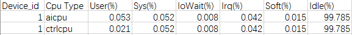

**Table 1** Field description

|Field|Description|
|--|--|
|Device_id|Device ID|
|Cpu Type|CPU type, including `AICPU` and `Ctrl CPU`|
|User(%)|Percentage of the user-mode process execution duration (average duration of multiple AICPUs and Ctrl CPUs)|
|Sys(%)|Percentage of the kernel-mode process execution duration (average duration of multiple AICPUs and Ctrl CPUs)|
|IoWait(%)|Percentage of the I/O wait duration (average duration of multiple AICPUs and Ctrl CPUs)|
|Irq(%)|Percentage of the hardware interrupt duration (average duration of multiple AICPUs and Ctrl CPUs)|
|Soft(%)|Percentage of the software interrupt duration (average duration of multiple AICPUs and Ctrl CPUs)|
|Idle(%)|Percentage of the idle duration (average duration of multiple AICPUs and Ctrl CPUs)|

#### process\_cpu\_usage (Process CPU Utilization)<a name="EN-US_TOPIC_0000002509383199"></a>

The CPU utilization data of processes does not contain timeline information. The summary information is aggregated in `process_cpu_usage_*.csv`.

**Supported Products<a name="en-us_topic_0000001751325670_section5889102116569"></a>**

|Product|Supported|
|--|:-:|
|Atlas 350 accelerator card|√|
|Atlas A3 training products/Atlas A3 inference products|√|
|Atlas A2 training products/Atlas A2 inference products|√|
|Atlas 200I/500 A2 inference products|√|
|Atlas inference products|√|
|Atlas training products|√|

**Data Description for the process\_cpu\_usage\_\*.csv File<a name="en-us_topic_0000001751325670_section104048511517"></a>**

The following example shows the content format of `process_cpu_usage_*.csv`.

**Figure 1** process\_cpu\_usage\_\*.csv<a name="en-us_topic_0000001751325670_fig939675212225"></a>  
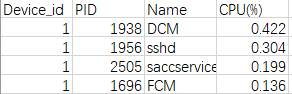

**Table 1** Field description

|Field|Description|
|--|--|
|Device_id|Device ID|
|PID|Process ID|
|Name|Process name|
|CPU(%)|CPU utilization of the process|

#### On-Chip Memory Read/Write Rate<a name="EN-US_TOPIC_0000002509503221"></a>

Timeline information of the on-chip memory read/write speed data is displayed in `msprof_*.json`. The summary information is aggregated in `ddr_*.csv` and `hbm_*.csv`.

**Supported Products<a name="en-us_topic_000000170451974_section91616487538"></a>**

|Product|Supported|
|--|:-:|
|Atlas 350 accelerator card|√|
|Atlas A3 training products/Atlas A3 inference products|√|
|Atlas A2 training products/Atlas A2 inference products|√|
|Atlas 200I/500 A2 inference products|√|
|Atlas inference products|√|
|Atlas training products|√|

**On-chip Memory Data Description for the msprof_*.json File<a name="en-us_topic_000000170451974_section1861610200457"></a>**

The following figure shows the on-chip memory data in `msprof_*.json`.

**Figure 1** On-chip memory 1<a name="en-us_topic_000000170451974_fig766519153238"></a>  
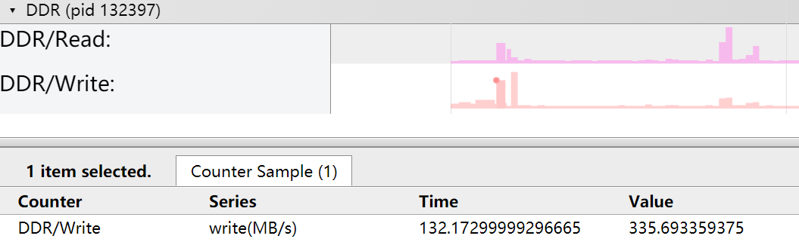

**Figure 2** On-chip memory 2<a name="en-us_topic_000000170451974_fig128671226172320"></a>  
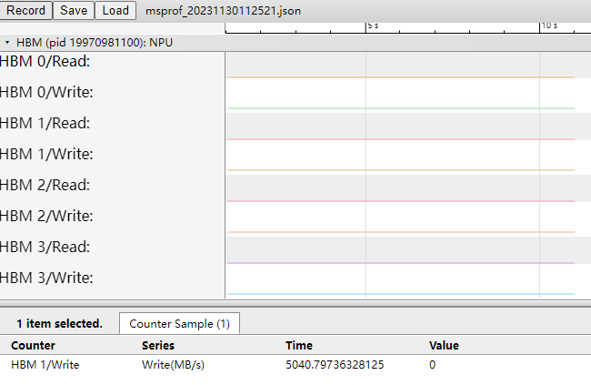

The preceding figure shows the read/write speed of the on-chip memory (MB/s).

**ddr\_\*.csv File<a name="en-us_topic_000000170451974_section11791341554"></a>**

The following example shows the content format of `ddr_*.csv`.

**Figure 3** ddr\_\*.csv<a name="en-us_topic_000000170451974_fig4397103862317"></a>  
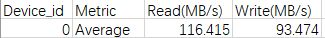

**Table 1** Field description

|Field|Description|
|--|--|
|Device_id|Device ID|
|Metric|Metric|
|Read(MB/s)|Read bandwidth (MB/s)|
|Write(MB/s)|Write bandwidth (MB/s)|

**hbm\_\*.csv File<a name="en-us_topic_000000170451974_section0146822185620"></a>**

The following example shows the content format of `hbm_*.csv`.

**Figure 4** hbm\_\*.csv<a name="en-us_topic_000000170451974_fig13282164482314"></a>  
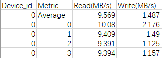

**Table 2** Field description

|Field|Description|
|--|--|
|Device_id|Device ID|
|Metric|Metric whose value is the ID of the memory access unit|
|Read(MB/s)|Read bandwidth (MB/s)|
|Write(MB/s)|Write bandwidth (MB/s)|

#### hccs (Collective Communication Bandwidth)<a name="EN-US_TOPIC_0000002477463236"></a>

Timeline information of the HCCS collective communication bandwidth data is displayed on the **HCCS** track in `msprof_*.json`. The summary information is aggregated in `hccs_*.csv`.

**Supported Products<a name="en-us_topic_0000001752359493_section91616487538"></a>**

|Product|Supported|
|--|:-:|
|Atlas 350 accelerator card|√|
|Atlas A3 training products/Atlas A3 inference products|√|
|Atlas A2 training products/Atlas A2 inference products|√|
|Atlas 200I/500 A2 inference products|x|
|Atlas inference products|x|
|Atlas training products|√|

**HCCS Track in msprof_*.json<a name="en-us_topic_0000001752359493_section279614455011"></a>**

The following figure shows data on the **HCCS** track in `msprof_*.json`.

**Figure 1** HCCS track<a name="en-us_topic_0000001752359493_fig876626102412"></a>  
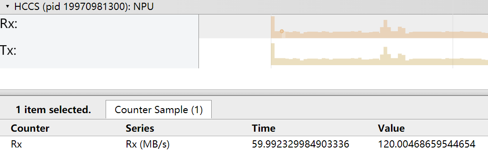

**Table 1** Field description

|Field|Description|
|--|--|
|Rx, Tx|Receive bandwidth and transmit bandwidth (MB/s)|

**hccs\_\*.csv File<a name="en-us_topic_0000001752359493_section12139135285518"></a>**

The following example shows the content format of `hccs_*.csv`.

**Figure 2** hccs\_\*.csv<a name="en-us_topic_0000001752359493_fig597612312247"></a>  
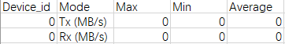

**Table 2** Field description

|Field|Description|
|--|--|
|Device_id|Device ID|
|Mode|TX bandwidth and RX bandwidth (MB/s)|
|Max|Maximum bandwidth (MB/s)|
|Min|Minimum bandwidth (MB/s)|
|Average|Average bandwidth (MB/s)|

#### nic (NIC Summary)<a name="EN-US_TOPIC_0000002509383201"></a>

Timeline information of NIC summary is displayed on the **NIC** track in `msprof_*.json`. The summary information is aggregated in `nic_*.csv`.

**Supported Products<a name="en-us_topic_0000001750414058_section91616487538"></a>**

|Product|Supported|
|--|:-:|
|Atlas 350 accelerator card|x|
|Atlas A3 training products/Atlas A3 inference products|√|
|Atlas A2 training products/Atlas A2 inference products|√|
|Atlas 200I/500 A2 inference products|√|
|Atlas inference products|√|
|Atlas training products|√|

**NIC Track in msprof_*.json<a name="en-us_topic_0000001750414058_section10870339706"></a>**

The following figure shows data on the **NIC** track in `msprof_*.json`.

**Figure 1** NIC track<a name="en-us_topic_0000001750414058_fig1930611382249"></a>  
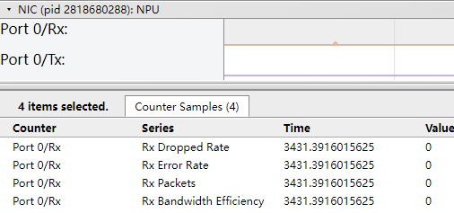

**Table 1** Field description

|Field|Description|
|--|--|
|Tx/Rx Dropped Rate|TX/RX packet loss rate|
|Tx/Rx Error Rate|TX/RX packet error rate|
|Tx/Rx Packets|Packet TX/RX rate|
|Tx/Rx Bandwidth Efficiency|TX/RX bandwidth utilization|

**nic\_\*.csv File<a name="en-us_topic_0000001750414058_section10366164515"></a>**

The following example shows the content format of `nic_*.csv`.

**Figure 2** nic\_\*.csv<a name="en-us_topic_0000001750414058_fig135704512412"></a>  
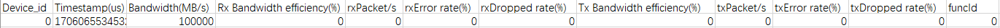

**Table 2** Field description

|Field|Description|
|--|--|
|Device_id|Device ID|
|Timestamp(us)|Timestamp (μs)|
|Bandwidth(MB/s)|Bandwidth (MB/s)|
|Rx Bandwidth efficiency(%)|RX bandwidth utilization|
|rxPacket/s|Packets received per second|
|rxError rate(%)|RX packet error rate|
|rxDropped rate(%)|RX packet loss rate|
|Tx Bandwidth efficiency(%)|TX bandwidth utilization|
|txPacket/s|Packets transmitted per second|
|txError rate(%)|TX packet error rate|
|txDropped rate(%)|TX packet loss rate|
|funcId|Network node|

#### roce (RoCE Bandwidth)<a name="EN-US_TOPIC_0000002509503223"></a>

Timeline information of the RoCE bandwidth data is displayed on the **RoCE** track in `msprof_*.json`. The summary information is aggregated in `roce_*.csv`.

**Supported Products<a name="en-us_topic_0000001750572972_section91616487538"></a>**

|Product|Supported|
|--|:-:|
|Atlas 350 accelerator card|x|
|Atlas A3 training products/Atlas A3 inference products|√|
|Atlas A2 training products/Atlas A2 inference products|√|
|Atlas 200I/500 A2 inference products|x|
|Atlas inference products|x|
|Atlas training products|√|

**RoCE Track in msprof_*.json<a name="en-us_topic_0000001750572972_section11622953115117"></a>**

The following figure shows data on the **RoCE** track in `msprof_*.json`.

**Figure 1** RoCE track<a name="en-us_topic_0000001750572972_fig12169145011241"></a>  


**Table 1** Field description

|Field|Description|
|--|--|
|Tx/Rx_Dropped_Rate|TX/RX packet loss rate|
|Tx/Rx_Error_Rate|TX/RX packet error rate|
|Tx/Rx_Packets|Packets transmitted/received per second|
|Tx/Rx_Bandwidth_Efficiency|TX/RX bandwidth utilization|

**roce\_\*.csv File<a name="en-us_topic_0000001750572972_section11791341554"></a>**

The following example shows the content format of `roce_*.csv`.

**Figure 2** roce\_\*.csv<a name="en-us_topic_0000001750572972_fig8322115682418"></a>  


**Table 2** Field description

|Field|Description|
|--|--|
|Device_id|Device ID|
|Timestamp(us)|Timestamp (μs)|
|Bandwidth(MB/s)|Bandwidth (MB/s)|
|Rx Bandwidth efficiency(%)|RX bandwidth utilization|
|rxPacket/s|Packets received per second|
|rxError rate(%)|RX packet error rate|
|rxDropped rate(%)|RX packet loss rate|
|Tx Bandwidth efficiency(%)|TX bandwidth utilization|
|txPacket/s|Packets transmitted per second|
|txError rate(%)|TX packet error rate|
|txDropped rate(%)|TX packet loss rate|
|funcId|Port ID, which is used to distinguish multiple ports on a device|

#### pcie (PCIe Bandwidth)<a name="EN-US_TOPIC_0000002477303256"></a>

Timeline information of the PCIe bandwidth data is displayed on the **PCIe** track in `msprof_*.json`. The summary information is aggregated in `pcie_*.csv`.

**Supported Products<a name="en-us_topic_0000001797493789_section91616487538"></a>**

|Product|Supported|
|--|:-:|
|Atlas 350 accelerator card|√|
|Atlas A3 training products/Atlas A3 inference products|√|
|Atlas A2 training products/Atlas A2 inference products|√|
|Atlas 200I/500 A2 inference products|x|
|Atlas inference products|√|
|Atlas training products|√|

**PCIe Track in msprof_*.json<a name="en-us_topic_0000001797493789_section11622953115117"></a>**

The following figure shows data on the **PCIe** track in `msprof_*.json`.

**Figure 1** PCIe track<a name="en-us_topic_0000001797493789_fig35584202518"></a>  


**Table 1** Field description

|Field|Description|
|--|--|
|PCIe_cpl|Throughput of completion packets for received write requests (MB/s). `TX` indicates transmit, and `RX` indicates receive.|
|PCIe_nonpost|PCIe non-posted data transmission bandwidth (MB/s). `TX` indicates transmit, and `RX` indicates receive.|
|PCIe_nonpost_latency|Transmission latency in PCIe Non-Posted mode (μs). `TX` indicates transmit, and `RX` indicates receive. `PCIe_nonpost_latency` does not involve `TX`. The value is fixed at `0`.|
|PCIe_post|PCIe posted data transmission bandwidth (MB/s). `TX` indicates transmit, and `RX` indicates receive.|

**pcie\_\*.csv File<a name="en-us_topic_0000001797493789_section12139135285518"></a>**

The following example shows the content format of `pcie_*.csv`.

**Figure 2** pcie\_\*.csv<a name="en-us_topic_0000001797493789_fig97188812514"></a>  


**Table 2** Field description

|Field|Description|
|--|--|
|Device_id|Device ID.|
|Mode|Mode. Valid values:<br>&#8226; `Tx_p_avg(MB/s)`: average PCIe posted data transmission bandwidth at the TX side (MB/s). `TX` indicates transmit, and `RX` indicates receive.<br>&#8226; `Tx_np_avg(MB/s)`: average PCIe non-posted data transmission bandwidth at the TX side (MB/s).<br>&#8226; `Tx_cpl_avg(MB/s)`: average throughput of completion packets for received write requests at the TX side (MB/s).<br>&#8226; `Tx_latency_avg (us)`: average PCIe non-posted transmission latency at the TX side (μs).<br>&#8226; `Rx_p_avg(MB/s)`: average PCIe posted data transmission bandwidth at the RX side (MB/s).<br>&#8226; `Rx_np_avg (MB/s)`: average PCIe non-posted data transmission bandwidth at the RX side (MB/s).<br>&#8226; `Rx_cpl_avg(MB/s)`: average throughput of completion packets for received write requests at the RX side (MB/s).|
|Min, Max, Avg|Minimum, maximum, and average values.|

#### biu\_group/aic\_core\_group/aiv\_core\_group (AI Core and AI Vector Bandwidth and Latency)<a name="EN-US_TOPIC_0000002477463238"></a>

The bandwidth and latency data of AI Core and AI Vector does not contain summary information. The timeline information is displayed on the **biu_group**, **aic_core_group**, and **aiv_core_group** tracks in `msprof_*.json`.

**Supported Products<a name="en-us_topic_0000001797600917_section91616487538"></a>**

|Product|Supported|
|--|:-:|
|Atlas 350 accelerator card|√|
|Atlas A3 training products/Atlas A3 inference products|√|
|Atlas A2 training products/Atlas A2 inference products|√|
|Atlas 200I/500 A2 inference products|x|
|Atlas inference products|x|
|Atlas training products|x|

**biu_group, aic_core_group, and aiv_core_group Tracks in msprof\_\*.json<a name="en-us_topic_0000001797600917_section432932191111"></a>**

**Figure 1** biu\_group<a name="en-us_topic_0000001797600917_fig13198121214588"></a>  


**Figure 2** aic\_core\_group<a name="en-us_topic_0000001797600917_fig14725302476"></a>  


**Figure 3** aiv\_core\_group<a name="en-us_topic_0000001797600917_fig1994919116471"></a>  


**Table 1** biu_group

|Field|Description|
|--|--|
|Bandwidth Read|Bandwidth for the bus interface unit (BIU) to read instructions|
|Bandwidth Write|Bandwidth for the BIU to write instructions|
|Latency Read|Latency for the BIU to read instructions|
|Latency Write|Latency for the BIU to write instructions|

**Table 2** aic_core_group

|Field|Description|
|--|--|
|Cube|Cycle count and ratio of matrix operation instructions in the current sampling period|
|Mte1|Cycle count and ratio of L1-to-L0A/L0B transfer instructions in the current sampling period|
|Mte2|Cycle count and ratio of on-chip memory to AI Core transfer instructions in the current sampling period|
|Mte3|Cycle count and ratio of AI Core to on-chip memory transfer instructions in the current sampling period|

**Table 3** aiv_core_group

|Field|Description|
|--|--|
|Mte1|Cycle count and ratio of L1-to-L0A/L0B transfer instructions in the current sampling period|
|Mte2|Cycle count and ratio of on-chip memory to AI Core transfer instructions in the current sampling period|
|Mte3|Cycle count and ratio of AI Core to on-chip memory transfer instructions in the current sampling period|
|Scalar|Cycle count and ratio of scalar operation instructions in the current sampling period|
|Vector|Cycle count and ratio of vector operation instructions in the current sampling period|

#### Acc PMU (Accelerator Bandwidth and Concurrency Information)<a name="EN-US_TOPIC_0000002509383203"></a>

The accelerator bandwidth and concurrency data does not contain summary information. The timeline information is displayed on the **Acc PMU** track in `msprof_*.json`.

**Supported Products<a name="en-us_topic_0000001750723840_section91616487538"></a>**

|Product|Supported|
|--|:-:|
|Atlas 350 accelerator card|x|
|Atlas A3 training products/Atlas A3 inference products|√|
|Atlas A2 training products/Atlas A2 inference products|√|
|Atlas 200I/500 A2 inference products|√|
|Atlas inference products|x|
|Atlas training products|x|

**Acc PMU Track in msprof_*.json<a name="en-us_topic_0000001750723840_section432932191111"></a>**

The following figure shows data on the **Acc PMU** track in `msprof_*.json`.

**Figure 1** Acc PMU track<a name="en-us_topic_0000001750723840_fig19052202251"></a>  


**Table 1** Field description

|Field|Description|
|--|--|
|read_bandwidth|Read bandwidth of the DVPP and DSA accelerators|
|read_ost|Concurrent read operations of the DVPP and DSA accelerators|
|write_bandwidth|Write bandwidth of the DVPP and DSA accelerators|
|write_ost|Concurrent write operations of the DVPP and DSA accelerators|

#### Stars Soc Info (SoC Transmission Bandwidth Information)<a name="EN-US_TOPIC_0000002509503225"></a>

The SoC transmission bandwidth information does not contain summary information. The timeline information is displayed on the **Stars Soc Info** track in `msprof_*.json`.

**Supported Products<a name="en-us_topic_0000001797682569_section91616487538"></a>**

|Product|Supported|
|--|:-:|
|Atlas 350 accelerator card|x|
|Atlas A3 training products/Atlas A3 inference products|√|
|Atlas A2 training products/Atlas A2 inference products|√|
|Atlas 200I/500 A2 inference products|√|
|Atlas inference products|x|
|Atlas training products|x|

**Stars Soc Info Track in msprof_*.json<a name="en-us_topic_0000001797682569_section432932191111"></a>**

The following figure shows data on the **Stars Soc Info** track in `msprof_*.json`.

**Figure 1** Stars Soc Info track<a name="en-us_topic_0000001797682569_fig125031026102512"></a>  


**Table 1** Field description

|Field|Description|
|--|--|
|L2 Buffer Bw Level|L2 buffer bandwidth level information. When buffer bandwidth information is available, avoid using this field as a reference, as it provides only coarse-grained statistics.|
|Mata Bw Level|Mata bandwidth level information.|

#### Stars Chip Trans (Inter-Chip Transmission Bandwidth Information)<a name="EN-US_TOPIC_0000002477303258"></a>

The inter-chip transmission bandwidth data does not contain summary information. The timeline information is displayed on the **Stars Chip Trans** track in `msprof_*.json`.

**Supported Products<a name="en-us_topic_0000001750882752_section91616487538"></a>**

|Product|Supported|
|--|:-:|
|Atlas 350 accelerator card|√|
|Atlas A3 training products/Atlas A3 inference products|√|
|Atlas A2 training products/Atlas A2 inference products|√|
|Atlas 200I/500 A2 inference products|x|
|Atlas inference products|x|
|Atlas training products|x|

**Stars Chip Trans Track in msprof_*.json<a name="en-us_topic_0000001750882752_section11622953115117"></a>**

The following figure shows data on the **Stars Chip Trans** track in `msprof_*.json`.

**Figure 1** Stars Chip Trans track<a name="en-us_topic_0000001750882752_fig16602113442510"></a>  


**Table 1** Field description

|Field|Description|
|--|--|
|PA Link Rx|RX level of the PA traffic. When collective communication bandwidth is available, avoid using this field as a reference, as it provides only coarse-grained statistics. The Atlas 350 accelerator card does not support this field.|
|PA Link Tx|TX level of the PA traffic. When collective communication bandwidth is available, avoid using this field as a reference, as it provides only coarse-grained statistics. The Atlas 350 accelerator card does not support this field.|
|PCIE Read Bandwidth|PCIe read bandwidth. When PCIe bandwidth is available, avoid using this field as a reference, as it provides only coarse-grained statistics. Only the Atlas 350 accelerator card supports this field.|
|PCIE Write Bandwidth|PCIe write bandwidth. When PCIe bandwidth is available, avoid using this field as a reference, as it provides only coarse-grained statistics. Only the Atlas 350 accelerator card supports this field.|

#### llc_read_write (L3 Cache Read/Write Rate)<a name="EN-US_TOPIC_0000002477463240"></a>

The timeline information of the L3 cache read/write rate data is displayed on the **LLC** track in `msprof_*.json`. The summary information is aggregated in `llc_read_write_*.csv`.

**Supported Products<a name="en-us_topic_0000001750960004_section1413114612162"></a>**

|Product|Supported|
|--|:-:|
|Atlas 350 accelerator card|√|
|Atlas A3 training products/Atlas A3 inference products|√|
|Atlas A2 training products/Atlas A2 inference products|√|
|Atlas 200I/500 A2 inference products|√|
|Atlas inference products|√|
|Atlas training products|√|

**LLC Track in msprof_*.json<a name="en-us_topic_0000001750960004_section12203141812107"></a>**

The following figure shows data on the **LLC** track in `msprof_*.json`.

**Figure 1** LLC track<a name="en-us_topic_0000001750960004_fig197198423259"></a>  


**Table 1** Field description

|Field|Description|
|--|--|
|LLC {ID} Read/Throughput|L3 cache read throughput|
|LLC {ID} Write/Throughput|L3 cache write throughput|
|LLC {ID} Read/Hit Rate|L3 cache read hit rate|
|LLC {ID} Write/Hit Rate|L3 cache write hit rate|

**llc\_read\_write\_\*.csv File<a name="en-us_topic_0000001750960004_section11791341554"></a>**

The following example shows the content format of `llc_read_write_*.csv`.

**Figure 2** llc\_read\_write\_\*.csv<a name="en-us_topic_0000001750960004_fig1718935117257"></a>  


**Table 2** Field description

|Field|Description|
|--|--|
|Device_id|Device ID|
|Mode|Mode|
|Task|Task ID|
|Hit Rate(%)|L3 cache hit rate|
|Throughput(MB/s)|L3 cache throughput (MB/s)|

#### dvpp (DVPP Information)<a name="EN-US_TOPIC_0000002477463244"></a>

The DVPP data does not contain timeline information. The summary information is aggregated in `dvpp_*.csv`.

**Supported Products<a name="en-us_topic_0000001798325341_section91616487538"></a>**

|Product|Supported|
|--|:-:|
|Atlas 350 accelerator card|√|
|Atlas A3 training products/Atlas A3 inference products|√|
|Atlas A2 training products/Atlas A2 inference products|√|
|Atlas 200I/500 A2 inference products|√|
|Atlas inference products|x|
|Atlas training products|√|

**dvpp\_\*.csv File<a name="en-us_topic_0000001798325341_section11791341554"></a>**

The following example shows the content format of `dvpp_*.csv`.

**Figure 1** dvpp\_\*.csv<a name="en-us_topic_0000001798325341_fig123751313132713"></a>  


**Table 1** Field description

|Field|Description|
|--|--|
|Device_id|Device ID.|
|Dvpp Id|Engine group ID. Currently, each engine type has only one group. Therefore, the value of this field is always `0`.|
|Engine Type|Engine type, such as `VDEC`, `JPEGD`, and `PNGD`.|
|Engine ID|ID of each engine instance in an engine group.|
|All Time(us)|Execution duration of the current engine in the sampling period (µs).|
|All Frame|Number of frames processed in the sampling period.|
|All Utilization(%)|Engine utilization in the sampling period, calculated as: Execution duration of the current engine/Sampling period.|

#### ai_cpu_top_function (AICPU Top Functions)<a name="EN-US_TOPIC_0000002509383209"></a>

The AICPU top function data does not contain timeline information. The summary information is aggregated in `ai_cpu_top_function_*.csv`.

**Supported Products<a name="en-us_topic_0000001798284377_section91616487538"></a>**

|Product|Supported|
|--|:-:|
|Atlas 350 accelerator card|√|
|Atlas A3 training products/Atlas A3 inference products|√|
|Atlas A2 training products/Atlas A2 inference products|√|
|Atlas 200I/500 A2 inference products|√|
|Atlas inference products|√|
|Atlas training products|√|

**ai\_cpu\_top\_function\_\*.csv File<a name="en-us_topic_0000001798284377_section11791341554"></a>**

The following example shows the content format of `ai_cpu_top_function_*.csv`.

**Figure 1** ai\_cpu\_top\_function\_\*.csv<a name="en-us_topic_0000001798284377_fig20671163622713"></a>  


**Table 1** Field description

|Field|Description|
|--|--|
|Device_id|Device ID|
|Function|Name of a top function of AICPU|
|Module|Module where the function is located|
|Cycles|Cycles taken to execute the function in the sampling period|
|Cycles(%)|Percentage of cycles taken to execute the function in the sampling period|

#### ai\_cpu\_pmu\_events (AICPU PMU Events)<a name="EN-US_TOPIC_0000002509503231"></a>

The AICPU PMU event data does not contain timeline information. The summary information is aggregated in `ai_cpu_pmu_events_*.csv`.

**Supported Products<a name="en-us_topic_0000001751325686_section91616487538"></a>**

|Product|Supported|
|--|:-:|
|Atlas 350 accelerator card|√|
|Atlas A3 training products/Atlas A3 inference products|√|
|Atlas A2 training products/Atlas A2 inference products|√|
|Atlas 200I/500 A2 inference products|√|
|Atlas inference products|√|
|Atlas training products|√|

**ai\_cpu\_pmu\_events\_\*.csv File<a name="en-us_topic_0000001751325686_section11791341554"></a>**

The following example shows the content format of `ai_cpu_pmu_events_*.csv`.

**Figure 1** ai\_cpu\_pmu\_events\_\*.csv<a name="en-us_topic_0000001751325686_fig9742143132713"></a>  


**Table 1** Field description

|Field|Description|
|--|--|
|Device_id|Device ID|
|Event|Register value|
|Name|Event name|
|Count|Register count value|

#### ctrl\_cpu\_top\_function (Ctrl CPU Top Functions)<a name="EN-US_TOPIC_0000002477303264"></a>

The Ctrl CPU top function data does not contain timeline information. The summary information is aggregated in `ctrl_cpu_top_function_*.csv`.

**Supported Products<a name="en-us_topic_0000001798325349_section91616487538"></a>**

|Product|Supported|
|--|:-:|
|Atlas 350 accelerator card|√|
|Atlas A3 training products/Atlas A3 inference products|√|
|Atlas A2 training products/Atlas A2 inference products|√|
|Atlas 200I/500 A2 inference products|√|
|Atlas inference products|√|
|Atlas training products|√|

**ctrl\_cpu\_top\_function\_\*.csv File<a name="en-us_topic_0000001798325349_section11791341554"></a>**

The following example shows the content format of `ctrl_cpu_top_function_*.csv`.

**Figure 1** ctrl\_cpu\_top\_function\_\*.csv<a name="en-us_topic_0000001798325349_fig116201349122718"></a>  


**Table 1** Field description

|Field|Description|
|--|--|
|Device_id|Device ID|
|Function|Name of a top function of Ctrl CPU|
|Module|Module where the function is located|
|Cycles|Cycles taken to execute the function in the sampling period|
|Cycles(%)|Percentage of cycles taken to execute the function in the sampling period|

#### ctrl\_cpu\_pmu\_events (Ctrl CPU PMU Events)<a name="EN-US_TOPIC_0000002477463246"></a>

The Ctrl CPU PMU event data does not contain timeline information. The summary information is aggregated in `ctrl_cpu_pmu_events_*.csv`.

**Supported Products<a name="en-us_topic_0000001751484602_section91616487538"></a>**

|Product|Supported|
|--|:-:|
|Atlas 350 accelerator card|√|
|Atlas A3 training products/Atlas A3 inference products|√|
|Atlas A2 training products/Atlas A2 inference products|√|
|Atlas 200I/500 A2 inference products|√|
|Atlas inference products|√|
|Atlas training products|√|

**ctrl\_cpu\_pmu\_events\_\*.csv File<a name="en-us_topic_0000001751484602_section11791341554"></a>**

The following example shows the content format of `ctrl_cpu_pmu_events_*.csv`.

**Figure 1** ctrl\_cpu\_pmu\_events\_\*.csv<a name="en-us_topic_0000001751484602_fig01371555142714"></a>  


**Table 1** Field description

|Field|Description|
|--|--|
|Device_id|Device ID|
|Event|Register value|
|Name|Event name|
|Count|Register count value|

#### ts\_cpu\_top\_function (TS CPU Top Functions)<a name="EN-US_TOPIC_0000002509383211"></a>

The TS CPU top function data does not contain timeline information. The summary information is aggregated in `ts_cpu_top_function_*.csv`.

**Supported Products<a name="en-us_topic_0000001798284385_section91616487538"></a>**

|Product|Supported|
|--|:-:|
|Atlas 350 accelerator card|x|
|Atlas A3 training products/Atlas A3 inference products|√|
|Atlas A2 training products/Atlas A2 inference products|√|
|Atlas 200I/500 A2 inference products|√|
|Atlas inference products|√|
|Atlas training products|√|

**ts\_cpu\_top\_function\_\*.csv File<a name="en-us_topic_0000001798284385_section11791341554"></a>**

The following example shows the content format of `ts_cpu_top_function_*.csv`.

**Figure 1** ts\_cpu\_top\_function\_\*.csv<a name="en-us_topic_0000001798284385_fig633819114286"></a>  


**Table 1** Field description

|Field|Description|
|--|--|
|Device_id|Device ID|
|Function|Name of a top function of TS CPU|
|Cycles|Cycles taken to execute the function in the sampling period|
|Cycles(%)|Percentage of cycles taken to execute the function in the sampling period|

#### ts\_cpu\_pmu\_events (TS CPU PMU Events)<a name="EN-US_TOPIC_0000002509503233"></a>

The TS CPU PMU event data does not contain timeline information. The summary information is aggregated in `ts_cpu_pmu_events_*.csv`.

**Supported Products<a name="en-us_topic_0000001751325694_section91616487538"></a>**

|Product|Supported|
|--|:-:|
|Atlas 350 accelerator card|x|
|Atlas A3 training products/Atlas A3 inference products|√|
|Atlas A2 training products/Atlas A2 inference products|√|
|Atlas 200I/500 A2 inference products|√|
|Atlas inference products|√|
|Atlas training products|√|

**ts\_cpu\_pmu\_events\_\*.csv File<a name="en-us_topic_0000001751325694_section11791341554"></a>**

The following example shows the content format of `ts_cpu_pmu_events_*.csv`.

**Figure 1** ts\_cpu\_pmu\_events\_\*.csv<a name="en-us_topic_0000001751325694_fig1666014619286"></a>  


**Table 1** Field description

|Field|Description|
|--|--|
|Device_id|Device ID|
|Event|Register value|
|Name|Event name|
|Count|Register count value|

#### host\_cpu\_usage (Host-side CPU Utilization)<a name="EN-US_TOPIC_0000002477463248"></a>

The host-side CPU utilization data is displayed on the **CPU Usage** track in `msprof_*.json`. The summary information is aggregated in `host_cpu_usage_*.csv`.

**Supported Products<a name="en-us_topic_0000001751778214_section91616487538"></a>**

|Product|Supported|
|--|:-:|
|Atlas 350 accelerator card|√|
|Atlas A3 training products/Atlas A3 inference products|√|
|Atlas A2 training products/Atlas A2 inference products|√|
|Atlas 200I/500 A2 inference products|√|
|Atlas inference products|√|
|Atlas training products|√|

**CPU Usage Track in msprof_*.json<a name="en-us_topic_0000001751778214_section11622953115117"></a>**

The following figure shows data on the **CPU Usage** track in `msprof_*.json`.

**Figure 1** CPU Usage track<a name="en-us_topic_0000001751778214_fig03894179287"></a>  


**Table 1** Field description

|Field|Description|
|--|--|
|CPU {ID}|CPU ID|
|CPU Avg|Average CPU utilization|
|usage|CPU utilization|

**host\_cpu\_usage\_\*.csv File<a name="en-us_topic_0000001751778214_section11791341554"></a>**

The following example shows the content format of `host_cpu_usage_*.csv`.

**Figure 2** host\_cpu\_usage\_\*.csv<a name="en-us_topic_0000001751778214_fig1156013718322"></a>  


**Table 2** Field description

|Field|Description|
|--|--|
|Device_id|Device ID (displayed as `host` for host-side data)|
|Total Cpu Numbers|Total number of CPU cores in the system|
|Occupied Cpu Numbers|Number of CPU cores occupied by processes|
|Recommend Cpu Numbers|Number of CPU cores in use, or the recommended CPU core allocation in virtualization scenarios|

#### host_mem_usage (Host-side Memory Usage)<a name="EN-US_TOPIC_0000002509383213"></a>

Timeline information about host-side memory usage is displayed on the **Memory Usage** track in `msprof_*.json`. The summary information is aggregated in `host_mem_usage_*.csv`.

**Supported Products<a name="en-us_topic_0000001751619310_section91616487538"></a>**

|Product|Supported|
|--|:-:|
|Atlas 350 accelerator card|√|
|Atlas A3 training products/Atlas A3 inference products|√|
|Atlas A2 training products/Atlas A2 inference products|√|
|Atlas 200I/500 A2 inference products|√|
|Atlas inference products|√|
|Atlas training products|√|

**Memory Usage Track in msprof_*.json<a name="en-us_topic_0000001751619310_section11622953115117"></a>**

The following figure shows data on the **Memory Usage** track in `msprof_*.json`.

**Figure 1** Memory Usage track<a name="en-us_topic_0000001751619310_fig142149295285"></a>  


**Table 1** Field description

|Field|Description|
|--|--|
|Memory Usage|Memory usage|

**host\_mem\_usage\_\*.csv File<a name="en-us_topic_0000001751619310_section11791341554"></a>**

The following example shows the content format of `host_mem_usage_*.csv`.

**Figure 2** host\_mem\_usage\_\*.csv<a name="en-us_topic_0000001751619310_fig10818133753117"></a>  


**Table 2** Field description

|Field|Description|
|--|--|
|Device_id|Device ID (displayed as `host` for host-side data)|
|Total Memory(KB)|Total system memory (KB)|
|Peak Used Memory(KB)|Peak memory usage (KB)|
|Recommend Memory(KB)|Recommended memory allocation in virtualization scenarios (KB)|

#### host\_disk\_usage (Host-side Drive I/O Usage)<a name="EN-US_TOPIC_0000002509503235"></a>

Timeline information about host-side drive I/O usage is displayed on the **Disk Usage** track in `msprof_*.json`. The summary information is aggregated in `host_disk_usage_*.csv`.

**Supported Products<a name="en-us_topic_0000001798578961_section91616487538"></a>**

|Product|Supported|
|--|:-:|
|Atlas 350 accelerator card|√|
|Atlas A3 training products/Atlas A3 inference products|√|
|Atlas A2 training products/Atlas A2 inference products|√|
|Atlas 200I/500 A2 inference products|√|
|Atlas inference products|√|
|Atlas training products|√|

**Disk Usage Track in msprof_*.json<a name="en-us_topic_0000001798578961_section11622953115117"></a>**

The following figure shows data on the **Disk Usage** track in `msprof_*.json`.

**Figure 1** Disk Usage track<a name="en-us_topic_0000001798578961_fig2438443142810"></a>  


**Table 1** Field description

|Field|Description|
|--|--|
|Disk Usage|Drive usage|

**host\_disk\_usage\_\*.csv File<a name="en-us_topic_0000001798578961_section11791341554"></a>**

The following example shows the content format of `host_disk_usage_*.csv`.

**Figure 2** host\_disk\_usage\_\*.csv<a name="en-us_topic_0000001798578961_fig169961347312"></a>  


**Table 2** Field description

|Field|Description|
|--|--|
|Device_id|Device ID (displayed as `host` for host-side data)|
|Peak Disk Read(KB/s)|Peak drive read rate (KB/s)|
|Recommend Disk Read(KB/s)|Recommended drive read rate in virtualization scenarios (KB/s)|
|Peak Disk Write(KB/s)|Peak drive write rate (KB/s)|
|Recommend Disk Write(KB/s)|Recommended drive write rate in virtualization scenarios (KB/s)|

#### host\_network\_usage (Host-side Network I/O Usage)<a name="EN-US_TOPIC_0000002477303268"></a>

Timeline information about host-side network I/O usage is displayed on the **Network Usage** track in `msprof_*.json`. The summary information is aggregated in `host_network_usage_*.csv`.

**Supported Products<a name="en-us_topic_0000001798698005_section91616487538"></a>**

|Product|Supported|
|--|:-:|
|Atlas 350 accelerator card|√|
|Atlas A3 training products/Atlas A3 inference products|√|
|Atlas A2 training products/Atlas A2 inference products|√|
|Atlas 200I/500 A2 inference products|√|
|Atlas inference products|√|
|Atlas training products|√|

**Network Usage Track in msprof_*.json<a name="en-us_topic_0000001798698005_section11622953115117"></a>**

The following figure shows data on the **Network Usage** track in `msprof_*.json`.

**Figure 1** Network Usage track<a name="en-us_topic_0000001798698005_fig9276175712815"></a>  


**Table 1** Field description

|Field|Description|
|--|--|
|Network Usage|Network I/O usage|

**host\_network\_usage\_\*.csv File<a name="en-us_topic_0000001798698005_section11791341554"></a>**

The following example shows the content format of `host_network_usage_*.csv`.

**Figure 2** host\_network\_usage\_\*.csv<a name="en-us_topic_0000001798698005_fig16572542193015"></a>  


**Table 2** Field description

|Field|Description|
|--|--|
|Device_id|Device ID (displayed as `host` for host-side data)|
|Netcard Speed(KB/s)|NIC rated rate (KB/s)|
|Peak Used Speed(KB/s)|Maximum network rate (KB/s)|
|Recommend Speed(KB/s)|Recommended network rate in virtualization scenarios (KB/s)|

#### os_runtime_statistic (Host-side syscall and pthreadcall)<a name="EN-US_TOPIC_0000002477463250"></a>

Timeline information of the syscall and pthreadcall data on the host is displayed on the **OS Runtime API** track in `msprof_*.json`. The summary information is aggregated in `os_runtime_statistic_*.csv`.

**Supported Products<a name="en-us_topic_0000001751778218_section91616487538"></a>**

|Product|Supported|
|--|:-:|
|Atlas 350 accelerator card|√|
|Atlas A3 training products/Atlas A3 inference products|√|
|Atlas A2 training products/Atlas A2 inference products|√|
|Atlas 200I/500 A2 inference products|√|
|Atlas inference products|√|
|Atlas training products|√|

**OS Runtime API Track in msprof_*.json<a name="en-us_topic_0000001751778218_section11622953115117"></a>**

The following figure shows data on the **OS Runtime API** track in `msprof_*.json`.

**Figure 1** OS Runtime API track<a name="en-us_topic_0000001751778218_fig144942132296"></a>  


**Table 1** Field description

|Field|Description|
|--|--|
|Title|API name of a component. As shown in the figure, `pthread_mutex_unlock` is selected.|
|Start|Start timestamp on the timeline, which is automatically aligned by `chrome://tracing` (ms).|
|Wall Duration|Duration of the current API call (ms).|

**os\_runtime\_statistic\_\*.csv File<a name="en-us_topic_0000001751778218_section11791341554"></a>**

The following example shows the content format of `os_runtime_statistic_*.csv`.

**Figure 2** os\_runtime\_statistic\_\*.csv<a name="en-us_topic_0000001751778218_fig1425753011116"></a>  


**Table 2** Field description

|Field|Description|
|--|--|
|Device_id|Device ID (displayed as `host` for host-side data)|
|Process ID|Process ID|
|Thread ID|Thread ID|
|Name|API name|
|Time(%)|Percentage of the total execution duration of the API|
|Time(us)|Total execution duration of the API (μs)|
|Count|API call count|
|Avg(us), Max(us), Min(us)|Average, maximum, and minimum durations of the API calls (μs)|

#### cpu\_usage (Host-side System CPU Utilization)<a name="EN-US_TOPIC_0000002509383215"></a>

The host-side system CPU utilization data does not contain timeline information. The summary information is aggregated in `cpu_usage_*.csv`.

**Supported Products<a name="en-us_topic_0000001751619314_section91616487538"></a>**

|Product|Supported|
|--|:-:|
|Atlas 350 accelerator card|√|
|Atlas A3 training products/Atlas A3 inference products|√|
|Atlas A2 training products/Atlas A2 inference products|√|
|Atlas 200I/500 A2 inference products|√|
|Atlas inference products|√|
|Atlas training products|√|

**cpu\_usage\_\*.csv File<a name="en-us_topic_0000001751619314_section11791341554"></a>**

The following example shows the content format of `cpu_usage_*.csv`.

**Figure 1** cpu\_usage\_\*.csv<a name="en-us_topic_0000001751619314_fig514903822911"></a>  


**Table 1** Field description

|Field|Description|
|--|--|
|Device_id|Device ID (displayed as `host` for host-side data)|
|Cpu Type|CPU type|
|User(%)|Percentage of time taken to execute user-mode processes|
|Sys(%)|Percentage of time taken to execute kernel-mode processes|
|IoWait(%)|Percentage of I/O wait duration|
|Irq(%)|Percentage of hardware interrupt duration|
|Soft(%)|Percentage of software interrupt duration|
|Idle(%)|Percentage of idle duration|

#### process\_cpu\_usage (Host-side Process CPU Utilization)<a name="EN-US_TOPIC_0000002509503237"></a>

The CPU utilization data of host-side processes does not contain timeline information. The summary information is aggregated in `process_cpu_usage_*.csv`.

**Supported Products<a name="en-us_topic_0000001798578965_section91616487538"></a>**

|Product|Supported|
|--|:-:|
|Atlas 350 accelerator card|√|
|Atlas A3 training products/Atlas A3 inference products|√|
|Atlas A2 training products/Atlas A2 inference products|√|
|Atlas 200I/500 A2 inference products|√|
|Atlas inference products|√|
|Atlas training products|√|

**process\_cpu\_usage\_\*.csv File<a name="en-us_topic_0000001798578965_section11791341554"></a>**

The following example shows the content format of `process_cpu_usage_*.csv`.

**Figure 1** process\_cpu\_usage\_\*.csv<a name="en-us_topic_0000001798578965_fig18181124942913"></a>  


**Table 1** Field description

|Field|Description|
|--|--|
|Device_id|Device ID (displayed as `host` for host-side data)|
|PID|Process ID|
|Name|Process name|
|CPU(%)|CPU utilization of the process|

#### sys_mem (Host-side System Memory Usage)<a name="EN-US_TOPIC_0000002477303270"></a>

The host-side system memory usage data does not contain timeline information. The summary information is aggregated in `sys_mem_*.csv`.

**Supported Products<a name="en-us_topic_0000001798698009_section91616487538"></a>**

|Product|Supported|
|--|:-:|
|Atlas 350 accelerator card|√|
|Atlas A3 training products/Atlas A3 inference products|√|
|Atlas A2 training products/Atlas A2 inference products|√|
|Atlas 200I/500 A2 inference products|√|
|Atlas inference products|√|
|Atlas training products|√|

**sys\_mem\_\*.csv File<a name="en-us_topic_0000001798698009_section11791341554"></a>**

The following example shows the content format of `sys_mem_*.csv`.

**Figure 1** sys\_mem\_\*.csv<a name="en-us_topic_0000001798698009_fig99825716297"></a>  


**Table 1** Field description

|Field|Description|
|--|--|
|Device_id|Device ID (displayed as `host` for host-side data)|
|Memory Total(kB)|Total system memory (KB)|
|Memory Free(kB)|Available system memory (KB)|
|Buffers(kB)|Memory buffer size (KB)|
|Cached(kB)|Cache size (KB)|
|Share Memory(kB)|Shared memory (KB)|
|Commit Limit(kB)|Virtual memory limit (KB)|
|Committed AS(kB)|Committed memory (KB)|
|Huge Pages Total(pages)|Total number of huge pages in the system|
|Huge Pages Free(pages)|Total number of free huge pages in the system|

#### process\_mem (Host-side Process Memory Usage)<a name="EN-US_TOPIC_0000002477463252"></a>

The memory usage data for processes on the host does not contain timeline information. The summary information is aggregated in `process_mem_*.csv`.

**Supported Products<a name="en-us_topic_0000001800355893_section91616487538"></a>**

|Product|Supported|
|--|:-:|
|Atlas 350 accelerator card|√|
|Atlas A3 training products/Atlas A3 inference products|√|
|Atlas A2 training products/Atlas A2 inference products|√|
|Atlas 200I/500 A2 inference products|√|
|Atlas inference products|√|
|Atlas training products|√|

**process\_mem\_\*.csv File<a name="en-us_topic_0000001800355893_section11791341554"></a>**

The following example shows the content format of `process_mem_*.csv`.

**Figure 1** process\_mem\_\*.csv<a name="en-us_topic_0000001800355893_fig31171443301"></a>  


**Table 1** Field description

|Field|Description|
|--|--|
|Device_id|Device ID (displayed as `host` for host-side data)|
|PID|Process ID|
|Name|Process name|
|Size(pages)|Memory pages used by the process|
|Resident(pages)|Physical memory pages used by the process|
|Shared(pages)|Shared memory pages used by the process|

#### soc\_pmu (TLB Hit Rate)<a name="EN-US_TOPIC_0000002416100682"></a>

`soc_pmu_*.csv` records the translation lookaside buffer (TLB) hit rate data.

**Supported Products<a name="section156885801410"></a>**

| Product                                       | Supported|
| ------------------------------------------- | :------: |
| Atlas 350 accelerator card                  |    √     |
| Atlas A3 training products/Atlas A3 inference products|    √     |
| Atlas A2 training products/Atlas A2 inference products|    √     |
| Atlas 200I/500 A2 inference products                 |    x     |
| Atlas inference products                         |    x     |
| Atlas training products                         |    x     |

**File Description<a name="section13876175514481"></a>**

**Figure 1** soc\_pmu\_\*.csv file<a name="fig1844571018213"></a>  


**Table 1** Field description

| Field       | Description                 |
| ------------- | ------------------------- |
| Device_id     | Device ID                 |
| Stream Id     | Stream ID of the task  |
| Task Id       | Task ID           |
| TLB Miss Rate | TLB miss rate|
| TLB Hit Rate  | TLB hit rate  |
| Op Name       | Operator name               |

> [!NOTE]NOTE
>
> When a large number of operator tasks are delivered, the execution duration of each operator is 2 to 3 μs. In this case, the sum of `TLB Miss Rate` and `TLB Hit Rate` may not be 1.

#### ccu_mission (Collective Communication Instruction Information)<a name="EN-US_TOPIC_0000002344234016"></a>

Timeline information of the collective communication instructions is displayed on the **CCU** track in `msprof_*.json`. The summary information is aggregated in `ccu_mission_*.csv`.

**Supported Products<a name="section156885801410"></a>**

| Product                                       | Supported|
| ------------------------------------------- | :------: |
| Atlas 350 accelerator card                  |    √     |
| Atlas A3 training products/Atlas A3 inference products|    x     |
| Atlas A2 training products/Atlas A2 inference products|    x     |
| Atlas 200I/500 A2 inference products                 |    x     |
| Atlas inference products                         |    x     |
| Atlas training products                         |    x     |

**CCU Track in msprof\_\*.json<a name="section11622953115117"></a>**

The following figure shows data on the **CCU** track in `msprof_*.json`.

**Figure 1** CCU track  


**ccu\_mission\_\*.csv File<a name="section13876175514481"></a>**

**Figure 1** ccu\_mission\_\*.csv<a name="fig1844571018213"></a>  


**Table 1** Field description

| Field                    | Description                              |
| -------------------------- | -------------------------------------- |
| Device_id                  | Device ID                              |
| Stream ID                  | Stream ID of the task               |
| Task Id                    | Task ID                        |
| Instruction ID             | Instruction ID of the collective communication task              |
| Instruction Start Time(us) | Start time of the collective communication task instruction (μs)|
| Instruction Duration(us)   | Duration of the collective communication task instruction (μs)|
| Notify Instruction ID      | ID of the instruction for which the collective communication task waits            |
| Notify Rank ID             | ID of the rank for which the collective communication task waits           |
| Notify Duration(us)        | Wait duration of the collective communication task (μs)    |

#### ccu\_channel (CCU Bandwidth Data)<a name="EN-US_TOPIC_0000002420022685"></a>

The bandwidth data of the collective communication unit (CCU) does not contain timeline information. The summary information is aggregated in `ccu_channel_*.csv`.

**Supported Products<a name="section156885801410"></a>**

| Product                                       | Supported|
| ------------------------------------------- | :------: |
| Atlas 350 accelerator card                  |    √     |
| Atlas A3 training products/Atlas A3 inference products|    x     |
| Atlas A2 training products/Atlas A2 inference products|    x     |
| Atlas 200I/500 A2 inference products                 |    x     |
| Atlas inference products                         |    x     |
| Atlas training products                         |    x     |

**File Description<a name="section13876175514481"></a>**

**Figure 1** ccu\_channel\_\*.csv<a name="fig1844571018213"></a>  


**Table 1** Field description

| Field             | Description                              |
| ------------------- | -------------------------------------- |
| Device_id           | Device ID                              |
| Channel Id          | ID of the channel used for collective communication                |
| Timestamp(us)       | Timestamp (μs)                    |
| Max Bandwidth(MB/s) | Maximum bandwidth of the channel at the current time (MB/s)|
| Min Bandwidth(MB/s) | Minimum bandwidth of the channel at the current time (MB/s)|
| Avg Bandwidth(MB/s) | Average bandwidth of the channel at the current time (MB/s)|

#### ub (UB Bandwidth Data)<a name="EN-US_TOPIC_0000002378351781"></a>

Timeline information of the UB bandwidth data is displayed on the **UB** track in `msprof_*.json`. The summary information is aggregated in `ub_*.csv`.

**Supported Products<a name="section156885801410"></a>**

| Product                                       | Supported|
| ------------------------------------------- | :------: |
| Atlas 350 accelerator card                  |    √     |
| Atlas A3 training products/Atlas A3 inference products|    x     |
| Atlas A2 training products/Atlas A2 inference products|    x     |
| Atlas 200I/500 A2 inference products                 |    x     |
| Atlas inference products                         |    x     |
| Atlas training products                         |    x     |

**UB Track in msprof_*.json**

The following figure shows data on the UB track in `msprof_*.json`.

**Figure 1** UB track  


**Table 1** Field description

| Field  | Description                             |
| -------- | ------------------------------------- |
| UB Port* | RX/TX bandwidth of the corresponding UB port ID. `*` indicates the port ID.|

**ub_*.csv File**

The following example shows the content format of `ub_*.csv`.

**Figure 2** ub_*.csv  


**Table 2** Field description

| Field                 | Description                        |
| ----------------------- | -------------------------------- |
| Device_id               | Device ID                        |
| PortId                  | Port ID                        |
| TimeStamp               | Timestamp (μs)                |
| UBRxPortBandWidth(MB/s) | UB RX bandwidth at the current time (MB/s)|
| UBTxPortBandWidth(MB/s) | UB TX bandwidth at the current time (MB/s)|
