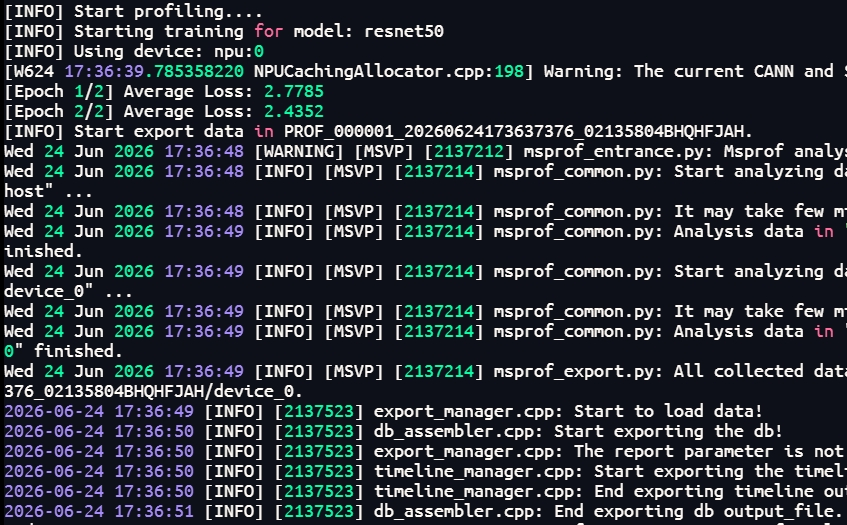
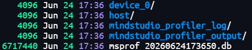

# msProf工具使用案例——ResNet50推理模型性能分析

## 一、案例名称

**使用msProf命令行工具采集并分析ResNet50推理模型在昇腾NPU上的性能数据**

本案例以ResNet50推理模型为例，演示如何使用华为昇腾MindStudio提供的msProf性能分析工具，完成性能数据的采集、解析与瓶颈定位。

### 1.1 前置准备

#### 1.1.1 环境要求

- 已安装**CANN Toolkit开发套件包**和**ops算子包**
- 已安装**MindStudio Insight**可视化分析工具

#### 1.1.2 配置环境变量

执行以下命令配置CANN环境变量(以cann-9.1.0为例)：

```bash
source /usr/local/Ascend/cann/set_env.sh
```

#### 1.1.3 验证工具可用性

执行以下命令确认msProf工具版本正常：

```bash
msprof --version
```

同时验证NPU设备状态，确保设备可正常调用：

```bash
npu-smi info
```

#### 1.1.4 准备ResNet50推理脚本

确保`resnet50_infer.py`推理脚本可在昇腾NPU上正常运行，脚本中需包含模型加载、数据预处理及推理执行逻辑。

### 1.2 使用工具

#### 1.2.1 性能数据采集

**（1）执行性能数据采集命令**

使用msProf命令行工具采集推理模型的性能数据：

```bash
msprof --output="./prof_data" --task-time=l1 python3 resnet50_infer.py
```



**参数说明**：

| 参数 | 说明 |
|------|------|
| `--output` | 性能数据的存放路径，默认为AI任务文件所在目录 |
| `--task-time` | 采集数据级别，默认为l0级别 |

**其他常见命令示例**：

```bash
# 传入Python脚本及参数
msprof --output=/home/projects/output python3 /home/projects/MyApp/out/sample_run.py param1 param2

# 传入二进制可执行程序
msprof --output=/home/projects/output /home/projects/MyApp/out/main

# 传入二进制程序及参数
msprof --output=/home/projects/output /home/projects/MyApp/out/main parameter1 parameter2

# 传入Shell脚本及参数
msprof --output=/home/projects/output /home/projects/MyApp/out/sample_run.sh param1 param2
```

#### 1.2.2 性能数据解析

采集完成后，执行以下命令解析性能数据，生成可分析的报告：

```bash
msprof --export=on --output="./prof_data"
```

解析后会在`--output`指定的目录下生成`PROF_XXX`目录（或`OPPROF`目录，取决于采集模式），存放自动解析后的性能数据。

#### 1.2.3 查看性能数据

**（1）查看生成的文件结构**

```bash
ls -la ./prof_data/PROF_XXX/
```



采集解析数据格式和交付件请参见《[profile_data_file_references](../user_guide/profile_data_file_references.md)》

**（2）使用MindStudio Insight可视化分析**

进入`mindstudio_profiler_output`目录，将性能数据导入MindStudio Insight工具进行可视化分析。MindStudio Insight提供了多种数据呈现形式，包括时间线视图、通信分析、计算耗时等可视化呈现，帮助用户快速定位性能瓶颈。
