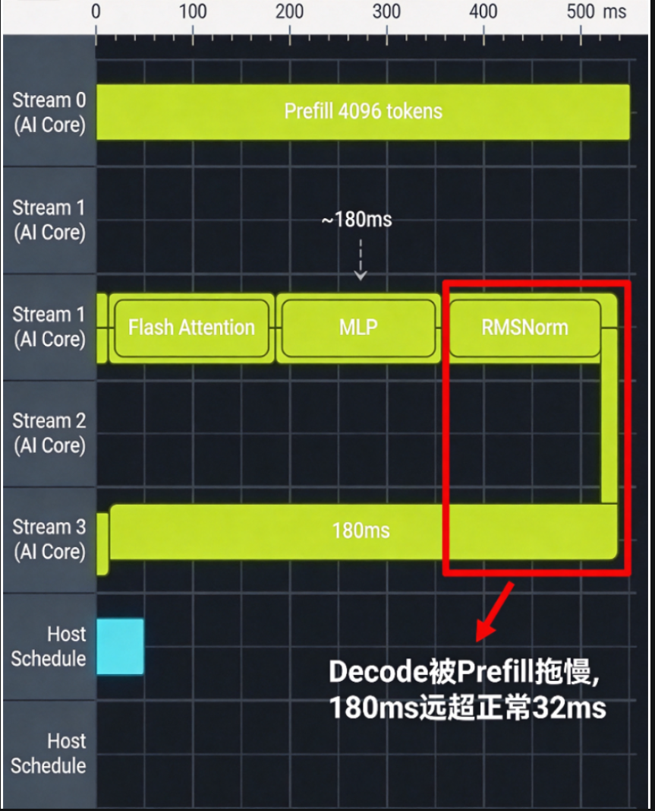

# 同一Batch内请求长度不均问题分析

## 【问题背景】

某客户在昇腾A2集群上部署基于 MindIE-LLM 的 LLaMA2-70B 推理服务，上线后压测发现：在固定并发数（QPS=20）下，服务化吞吐量只有预期值的 **55%** 左右，P99 TTFT 高达 **820ms**（SLA 约束 300ms），P99 TPOT 高达 **85ms**（SLA 约束 30ms）。但通过 `npu-smi info` 观察，NPU 平均利用率（AICore）显示为 **78%**，AIPower 正常，温度未触发限频。表面看"硬件没跑满，业务侧却慢"——这是典型的服务化层调度问题。

进一步压测数据如下：

| 并发数 | 理论吞吐 (tokens/s) | 实测吞吐 (tokens/s) | 吞吐达成率 | P99 TTFT (ms) | P99 TPOT (ms) |
| ------ | ------------------- | ------------------- | ---------- | ------------- | ------------- |
| 10     | 1200                | 980                 | 81.7%      | 210           | 28            |
| 20     | 2400                | 1320                | **55.0%**  | **820**       | **85**        |
| 40     | 4800                | 2280                | 47.5%      | 1850          | 142           |
| 80     | 9600                | 3920                | 40.8%      | OOM/超时      | OOM/超时      |

吞吐达成率随并发数增加反而**显著下降**，与"硬件未跑满"的现象矛盾，初步怀疑**服务化调度层有结构性瓶颈**。

---

## 【问题现象】

服务化调度层在 Continuous Batching 模式下，同一个 Decode batch 内混入了**刚刚完成 Prefill 的超长请求**和**已经在 Decode 阶段的若干短请求**。Decode 步的执行时间不再只取决于当前 batch 的平均长度，而被最长的那个 Prefill 主导，导致：

- **短请求被拖慢**：原本应该在 ~25ms 内出一个 Token 的短请求，因为等长请求 Prefill 完成，实际等到 80-100ms 才出 token（TPOT 退化 3-4 倍）
- **Decode 步时长周期性尖峰**：在 timeline 上，Decode 算子时长呈"短-长-短-长"锯齿状波动
- **AICore 利用率"虚高"**：NPU 一直在算（Prefill 阶段是计算密集型），但算的不是有效业务 token
- **KV Cache 申请抖动**：长请求 Prefill 进来时，框架需要紧急申请大块 KV cache，导致调度器 stall，挤占后续请求的入队

**核心矛盾**：硬件利用率 78% 看上去不低，但**单位时间内的有效 token 产出**（output tokens/s）远低于预期。

---

## 【定位过程】

先用 msServiceProfiler 采集全链路服务化 trace，拿到 request/batch/kv cache 三表原始数据；然后导入 MindStudio Insight，从 Summary 看到关键指标的统计性异常（吞吐/延迟/批长度分布），再到 Timeline 页面选典型"坏 batch"和"好 batch"做对比，**一眼定位"Decode 被 Prefill 拖慢"这一根因**。

### 步骤 1：用 msServiceProfiler 采集全链路服务化数据

**目的**：拿到请求级、Batch 级、KV Cache 级数据，建立端到端时间线，作为后续 Insight 可视化的数据源。

**配置文件**（`/home/user/mindie/ms_service_profiler_config.json`）：

```json
{
  "enable": 1,
  "prof_dir": "/home/user/mindie/prof_data",
  "acl_task_time": 1,
  "l2_cache": 0,
  "data_frame": 1
}
```

**配置环境变量并启动 MindIE Service**：

```bash
export SERVICE_PROF_CONFIG_PATH="/home/user/mindie/ms_service_profiler_config.json"
bash /usr/local/Ascend/mindie/latest/scripts/start.sh \
    --model-path /data/llama2-70b-fp16 \
    --tensor-parallel-size 4 \
    --max-batch-size 64 \
    --max-prefill-tokens 8192
```

**等待 60 秒后关闭采集**（避免数据量爆炸）：

```json
{
  "enable": 0,
  "prof_dir": "/home/user/mindie/prof_data"
}
```

**调用 parse 子命令解析**：

```bash
pip install -U msserviceprofiler
python3 -m ms_service_profiler.parse \
    --input-path=/home/user/mindie/prof_data \
    --output-path=/home/user/mindie/prof_parsed
```

**产物**：

- `prof_parsed/analysis.db`：SQLite 数据库，可直接被 MindStudio Insight 导入
- `prof_parsed/rank*/request_*.csv`：每个 rank 的请求级数据
- `prof_parsed/rank*/batch_*.csv`：Batch 级数据
- `prof_parsed/rank*/kvcache_*.csv`：KV Cache 数据

---

### 步骤 2：用 MindStudio Insight 看 Summary + Timeline 定位根因

启动 Insight 并导入 `analysis.db`：

#### 2.1 Summary 页面：先看宏观指标

进入 **Summary** 页面，重点看三个视图：

1. **端到端性能折线图**：TTFT / TPOT / 吞吐随时间变化，能看到"周期性尖峰"
2. **Batch 数据统计**：每个 batch 的 seq_cnt、max_len、min_len、batch_time 分布
3. **Request 长度分布**：prompt_len 的直方图（确认是真实的长尾分布，不是异常配置导致）

**关键观察**：在 Summary 上能直观看到 **batch 耗时（batch_time）与 batch 内长度比（len_ratio）呈强正相关**——大部分 batch 耗时 < 50ms，少量 batch 耗时飙到 150-180ms，**这些离群点正好对应长度比 > 16 的 batch**。

#### 2.2 Timeline 页面：选典型 batch 对比

进入 **Timeline** 页面，先在 batch 列表里挑两个极端样本：

- **坏 batch：b-15892**（seq_cnt=8，max_len=4096，min_len=64，**len_ratio=64**）
- **好 batch：b-16301**（seq_cnt=6，max_len=512，min_len=256，**len_ratio=2**）

把这两个 batch 的时间区间（各取 ~500ms 窗口）放大对比。

**预期看到**（**图 1：bad batch b-15892 timeline**）：

<div align="center"></div>

- 8 个序列同处一个 decode 步：1 个长请求（prompt=4096）正在做 Prefill（黄绿色长条带，跨度约 140ms），其余 7 个短请求被 stall
- 整批 Decode step 的算子条带**全部被拉成 ~180ms**，所有算子（FlashAttention、MLP、RMSNorm 等）几乎"无边界"地首尾相连
- 没有任何一个 Decode step 落在 30ms 正常区间
- 算子条带之间没有清晰的分隔，呈现"被压平"的形态

**对比看**（**图 2：good batch b-16301 timeline**）：

<div align="center"></div>

- 6 个序列长度相近（256-512 tokens），都在 Decode 阶段，没有 Prefill 干扰
- 每个 Decode step 时长约 **32ms**，算子条带边界清晰
- 算子和算子之间有明显的微小 gap（host 调度开销），呈现"健康"的条带节奏
- Decode step 之间也存在自然间隔（因为 batch 在等下一轮新请求或 KV 分配）

---

## 【问题根因】

**根因类型**：框架适配错误（MindIE-LLM 1.0.RC2 的调度器未对请求长度做充分分桶/排序）

## 【定位方法论总结】

1. **步骤 1：msServiceProfiler 采集 + 解析**
   - 写配置（enable=1, acl_task_time=1, data_frame=1）→ 启动服务 → 60s 业务采样 → 关闭 → `ms_service_profiler.parse` 解析
   - 产物 `analysis.db` 是后续所有分析的数据源

2. **步骤 2：MindStudio Insight 宏观 + 微观对比**
   - **Summary 页面**：先看 batch_time 分布，挑出离群点（> 100ms 的 batch），同时看 len_ratio 分布，找到两者相关性
   - **Timeline 页面**：从离群 batch 中挑典型（坏样本 len_ratio > 16），再挑一个正常 batch（len_ratio < 4）做**直接对比**
   - 坏 batch 的典型特征：1 个超长 Prefill 主导整批、Decode step 全部被拉成 ~180ms、算子条带首尾相连无边界
   - 好 batch 的典型特征：Decode step 节奏稳定（~32ms/拍）、算子条带边界清晰、host 调度有规律
