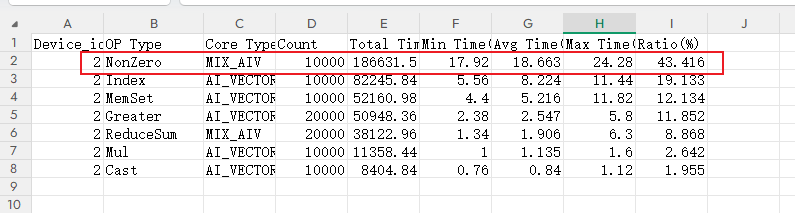
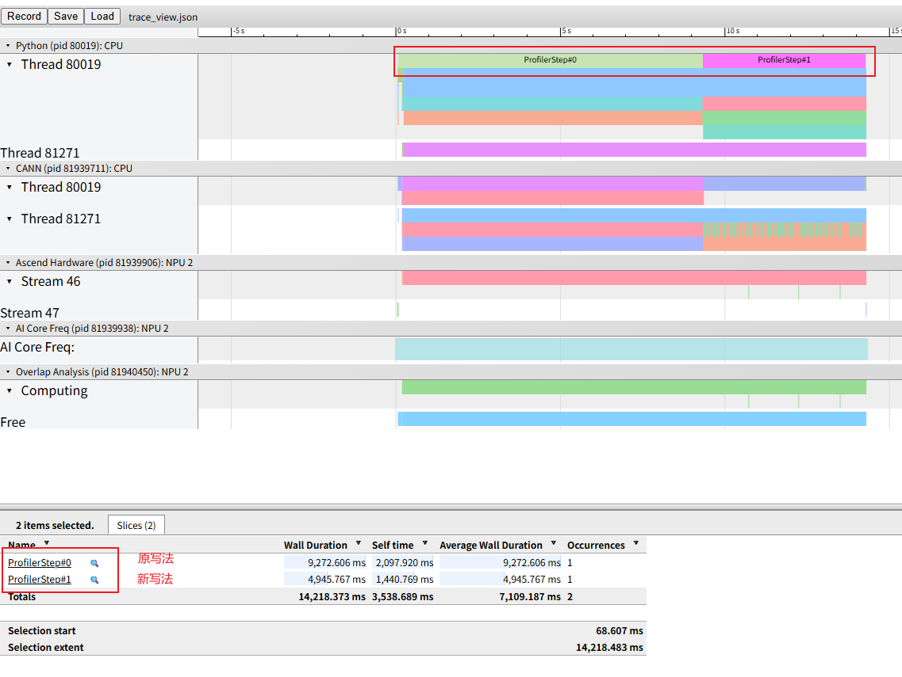

# 一、问题背景

在NPU业务执行过程中，业务执行时间不及预期，通过采集profiling数据确认，部分算子执行较慢，需对算子或操作做相关优化修改。

# 二、问题来源

性能调优

# 三、问题现象

通过insight打开msprof.json或者trace_view.json。可观察到某些算子的执行时间较长。打开op_statistic.csv，检查对应算子，确认算子性能不符合预期，执行时间较长，存在优化收益。

如下图中NonZero算子占比很大。



# 四、定位过程

类似的优化方向可以分两方面

1、算子定点优化，需要针对算子实现做检查，确认是否存在优化空间等。需要自行实现相关算子能力，或联系相关工程师做特定优化。

2、对当前的算子或操作，做同效果算子或操作替换，以更亲和NPU的方式实现相关能力。当前问题我们针对此条做简单介绍。

在[PyTorch训练模型迁移调优指南](https://gitcode.com/Ascend/ModelZoo-PyTorch/blob/master/PyTorch/docs/performance_tuning/performance_tuning_methods/npu_affinity_opt/README.md)中，已经列举了较多的优化方法和思路，可以从类似方案中进行学习了解。

针对当前的问题，已有“Nonzero算子替换”案例。我们参考官网资料，构造相关的用例进行简单试验。

```python
def nonzero_ori():
    shape = (1024, )
    mask= torch.randint(-1, 2, shape).npu()
    gt_inds = torch.randint(-1, 2, shape).npu()
    tensor_a = torch.ones(shape).float().npu()
    mask_inds = torch.nonzero(gt_inds > 0, as_tuple=False).squeeze(1)
    tensor_sum = tensor_a[mask_inds].sum()

def nonzero_new():
    shape = (1024, )
    mask = torch.randint(-1, 2, shape).npu()
    gt_inds = torch.randint(-1, 2, shape).npu()
    tensor_a = torch.ones(shape).float().npu()

    # --- 优化点：完全消除 nonzero ---
    # 直接生成 0/1 掩码（float类型），替代索引提取
    # 这里的 (gt_inds > 0) 会生成 BoolTensor，.float() 将其转为 0.0 和 1.0
    float_mask = (gt_inds > 0).float()

    # 2. 利用算术乘法实现求和
    # tensor_a[mask_inds].sum() 在数学上完全等价于 (tensor_a * float_mask).sum()
    tensor_sum = (tensor_a * float_mask).sum()


def run():
    for _ in range(10000):
        nonzero_ori()
    torch_npu.npu.synchronize()

    for _ in range(10000):
        nonzero_new()
    torch_npu.npu.synchronize()

```

相关的流水图如下所示。可见切换新写法确实有相关的性能收益。



# 五、问题根因

nonzero算子是深度学习框架中常用的索引类算子，核心功能是返回输入张量中非零元素的坐标索引，并按行优先顺序输出结果。是一个典型的访存密集型操作，对昇腾达芬奇架构不友好。因此，核心的替换思路就在于避免大量的访存操作。

# 六、定位方法总结

1、通过可视化工具，从流水图和算子统计表等角度确认需要优化的算子。

2、通过分析该算子的业务行为，并综合昇腾架构，将该操作转变为更合适的亲和操作，以提高性能。

# 七、对工具的改进建议

暂无
