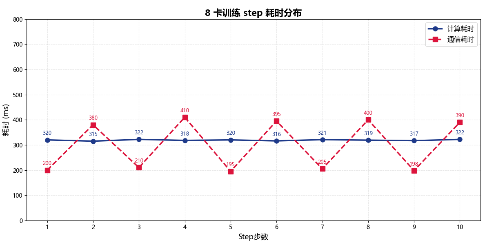
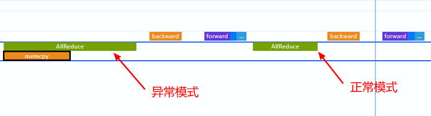
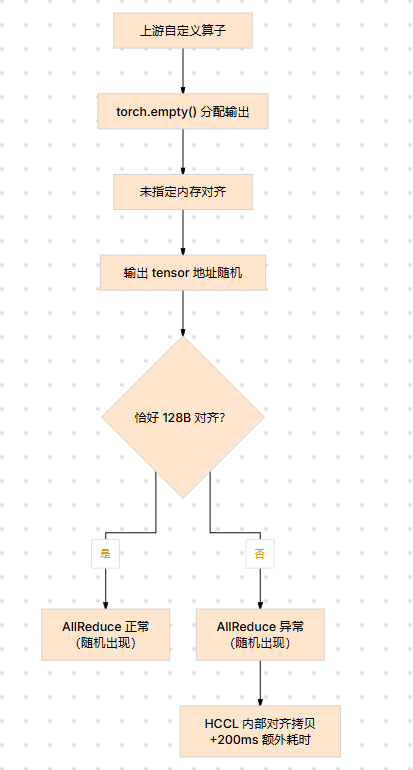

# 通信地址不对齐导致性能下降问题分析

## 问题背景

某大模型训练场景中，使用 8 卡 Ascend 910B 进行分布式训练，模型参数量约 70B。训练过程中发现单 step 耗时远超预期，怀疑存在通信瓶颈，需通过 profiling 工具定位具体原因。

## 问题现象

稳定复现。8 卡训练时，单 step 通信耗时占比超过 40%，且 AllReduce 算子耗时波动较大，部分 step 的通信耗时是其他 step 的 2~3 倍。单卡推理正常，排除计算瓶颈。

<div align="center"></div>
<div align="center"><b>图1：8 卡训练 step 耗时分布（计算 vs 通信）</b></div>

> 计算耗时稳定在 ~320ms，通信耗时在 195ms~410ms 之间剧烈波动，说明通信链路存在异常。

## 定位过程

### 1. 采集 profiling，确认通信瓶颈

使用 `torch_npu.profiler` 采集完整训练 step 的 profiling 数据，确认通信耗时占比及具体算子。

**采集配置**：

```python
with torch_npu.profiler.profile(
    activities=[torch_npu.profiler.ProfilerActivity.CPU, torch_npu.profiler.ProfilerActivity.NPU],
    schedule=torch_npu.profiler.schedule(wait=1, warmup=1, active=5, repeat=1),
    on_trace_ready=torch_npu.profiler.tensorboard_trace_handler(output_dir),
    profile_level=torch_npu.profiler.ProfilerLevel.Level1,
    with_stack=True,
):
    ...
```

各参数说明：

- `profile_level`：指定为 `ProfilerLevel.Level1` 才能采集到 HCCL 通信算子的完整数据，包括通信耗时、通信量及算子内部子任务（如 memcpy）等细粒度信息。默认 `Level0` 仅采集计算算子，不含通信详情。
- `with_stack=True`：记录调用栈，便于回溯未对齐 tensor 的上游来源。
- `schedule`：需保证 `active` 覆盖足够的 step（本案例需覆盖多个 step 以对比正常与异常的 AllReduce 耗时）。

**分析结果**：

从 timeline 可观察到，AllReduce 算子耗时存在两种截然不同的模式：

- 模式 A（正常）：AllReduce 耗时约 200ms，hccl 内部直接发起集合通信
- 模式 B（异常）：AllReduce 耗时约 400ms，hccl 内部多了一段 memcpy 操作

<div align="center"></div>
<div align="center"><b>图2：AllReduce 两种模式 timeline 对比</b></div>

> 模式 B 比模式 A 多了一段 memcpy，耗时约 200ms。初步怀疑是输入 tensor 的地址或大小不符合 HCCL 的对齐要求，导致库内部先做了一次对齐拷贝。

### 2. 确认地址不对齐特征

步骤 1 中 timeline 观察到的额外 memcpy 本身就是地址不对齐的典型特征——HCCL 通信库要求输入数据 128 字节对齐，未对齐时内部自动执行对齐拷贝，该操作在 timeline 中表现为 AllReduce 算子内的额外 memcpy。正常 step 中因内存分配恰好对齐，AllReduce 算子内仅有集合通信，无 memcpy。

### 3. 追溯未对齐 tensor 的来源

确认地址不对齐后，需追溯产生未对齐 tensor 的上游算子。步骤 1 的采集配置中已开启 `with_stack=True`，timeline 中每个算子事件均记录了调用栈。在 chrome://tracing 中点击模式 B 的 AllReduce 算子，可查看其完整调用链：

```text
AllReduce (hccl)
  └─ custom_attention_forward (python)
       └─ custom_attention_cuda (c++)
            └─ torch.empty([batch, heads, seq_len, dim])  ← 未指定对齐参数
```

调用栈显示该 AllReduce 的输入 tensor 由 `custom_attention_forward` 算子内部的 `torch.empty()` 分配。对比代码确认 `torch.empty()` 未指定 `memory_format` 对齐参数，导致分配的内存地址随机，部分不满足 128 字节对齐。

<div align="center"></div>
<div align="center"><b>图3：未对齐 tensor 上游来源追溯</b></div>

> 由于 `torch.empty()` 返回的内存地址是否 128 字节对齐取决于内存分配器的当前状态，因此问题表现为随机波动——每次分配结果不同，AllReduce 耗时也跟随波动。

## 问题根因

自定义算子使用 `torch.empty()` 分配输出 tensor 内存时，未指定 `memory_format` 对齐参数，导致部分 tensor 的起始地址不满足 HCCL 通信库的 128 字节对齐要求。HCCL 内部检测到地址未对齐后，自动进行一次对齐拷贝，额外耗时约 200ms。

该问题属于框架适配问题：用户未注意到 HCCL 通信库对输入数据的对齐约束。

## 问题结论

1. HCCL 通信库要求输入 tensor 地址 128 字节对齐，不满足时内部自动对齐拷贝，额外耗时约 200ms。
2. profiling timeline 中 AllReduce 算子内出现额外 memcpy，是通信地址不对齐的典型特征，可作为排查信号。
3. 对齐问题表现为随机波动——同一算子因内存分配器状态不同而表现不一致，区别于稳定的性能瓶颈。
4. 修复方式：通信前强制 `tensor.contiguous()` 确保地址对齐，或上游分配时指定对齐参数。

```python
# 通信前强制对齐
if tensor.data_ptr() % 128 != 0:
    tensor = tensor.contiguous()
```

## 定位方法论总结

1. 通信占比较高时，先通过 profiling 确认是带宽问题还是算子内部额外开销。
2. 若 AllReduce 耗时波动大且 timeline 中存在额外 memcpy，优先排查 tensor 地址是否对齐。
3. 从调用栈向上追溯到产生 tensor 的上游算子，检查内存分配方式。
4. 对齐问题通常表现为"随机性"——同一段代码因内存分配器状态不同而表现不一致。

## 对工具的改进建议

- profiling timeline 中可在 AllReduce 等通信算子上直接标注 tensor 地址对齐状态，降低识别门槛
- 建议增加 HCCL 通信对齐检查的自动化诊断能力，在采集数据中标注未对齐的通信算子
- 对 AllReduce 算子内部析出的 memcpy 操作增加明确标记，与普通内存拷贝区分
