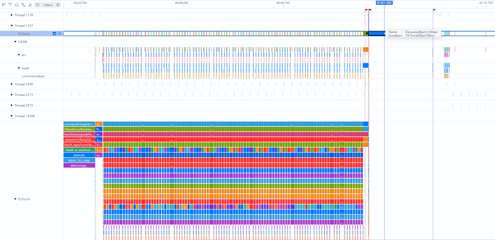
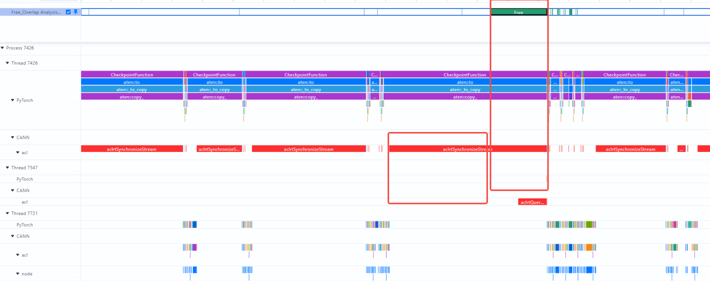
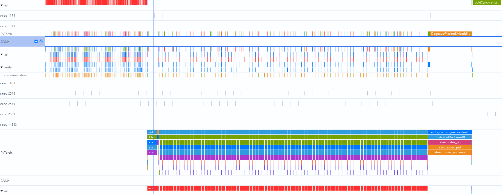
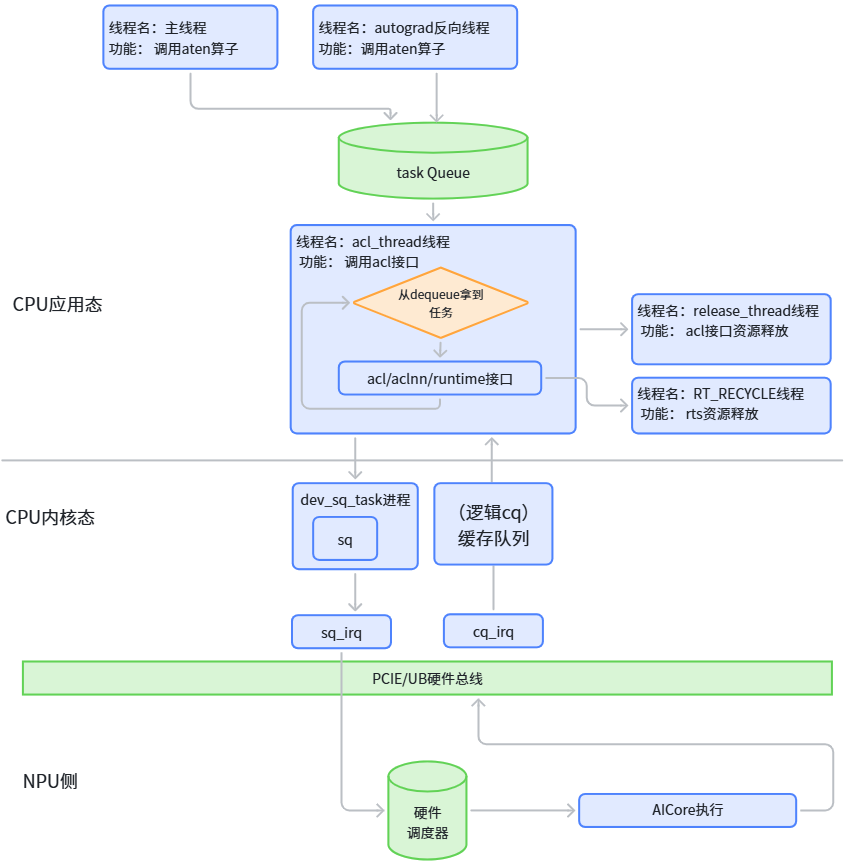
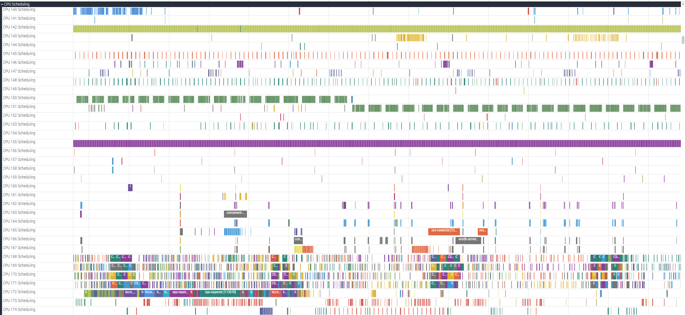
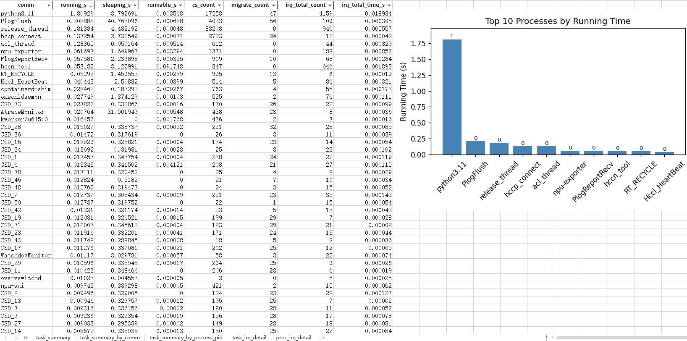

# CPU 线程频繁切换

## 【问题背景】

某大模型分布式训练任务在 8 机 96 卡 NPU 服务器集群上运行，过程中发现一个稳定复现的异常现象：每个训练迭代步中，必然有某一张卡出现 Host 侧算子下发耗时过长的问题，这直接导致了集群内的快慢卡现象，进而造成整体 NPU 算力利用率不足。同时对 NPU 卡间通信链路进行了排查，各卡通信耗时指标均在正常范围内，排除通信层面的性能瓶颈。

从系统资源使用情况来看，整机 CPU 使用率整体偏高，但进一步拆解发现用户态实际用于业务计算的 CPU 占比偏低，内核态开销占比显著偏高，说明存在大量额外的系统调用开销。经过初步的问题排查与方向收敛，已初步判定该异常与 CPU 线程调度机制异常高度相关。

## 【问题来源】

训练。

## 【问题现象】

稳定复现。

1. 在 8 机 96 卡的服务器集群中，我们观测到一个稳定复现的异常现象：每个训练迭代中均有某一张卡出现 PyTorch 框架侧队列取出 (Dequeue) 操作耗时过长的问题，该操作的最长耗时可达 7.9 秒，具体数据如下图所示：

   

2. 与此同时发现，在这段时间内 Device 硬件侧实际上并没有任何算子在执行，但 CPU 侧的synchronize 同步函数却多等待了 92ms 才完成返回，这直接导致 Device 侧产生了 92ms 的无效空闲等待时间，其时序情况如下图所示：

   

3. 通过进一步分析我们发现，Dequeue 操作确实存在严重的高耗时问题，而且这个高耗时现象有明确的阶段特征：主要集中在反向传播完成之后高频出现，单次 Dequeue 操作的最长耗时甚至达到了 5 秒。

   从统计数据来看，每个训练迭代中，都必然会有 1 到 2 张卡出现这种 Dequeue 高耗时的异常情况，具体的耗时统计数据如下图所示：

   

## 【定位过程】

1. 梳理 NPU 场景 PyTorch 模型训练关键业务流程，如下图所示：

   

   - 任务生成：每张计算卡的主线程和 autograd 反向传播线程负责调用 PyTorch 算子，生成需要执行的具体计算任务。
   - 入队等待：生成的算子任务进入 PyTorch 框架层的任务队列中，等待被调度执行。
   - 任务下发：acl_thread 线程从队列中取出待执行的算子任务，调用 acl、aclnn 等底层接口完成任务下发。
   - 跨设备传输：dev_sq_task 进程接收来自 CPU 用户态的任务，通过 PCIE 总线将任务传输到 NPU 设备。
   - 接收确认：NPU 硬件成功接收到下发的任务后，触发 sq_trigger_irq 中断，向 CPU 反馈任务已成功接收。
   - 硬件执行：NPU 设备内部进行硬件级任务调度，最终由 aicore 执行具体的算子计算。
   - 完成通知：单个算子任务执行完成后，NPU 主动触发 cq_update_irq 中断，通知 CPU 该任务已执行完成。

2. 使用perf工具做了 CPU 调度事件与热点函数采集

   执行命令：

   ```bash
   perf record -e sched:sched_switch -g -p <PID> sleep 10
   perf stat -e context-switches,cpu-migrations -p <PID> sleep 10
   ```

   确认线程调度开销占总 CPU 时间的比例较大，超过 20%。

3. 通过 MindStudio 提供的 [ftrace_tools](https://gitcode.com/Ascend/msinsight/tree/master/scripts/ftrace_tools) 工具，完成了 CPU 调度事件的采集工作，采集结果如下

   

   进一步使用 ftrace 分析诊断工具，将数据统计整合成表格：

   

   分析结果显示，线程切换和抢占事件占比偏高，反映出明显的 CPU 线程调度瓶颈。频繁的非自愿上下文切换推高了内核态 CPU 消耗，挤占了原本用于计算的用户态时间；这进一步导致 NPU 等待 CPU 完成数据准备的时延增加，最终形成 "CPU 拖慢 NPU" 的典型性能瓶颈。

## 【问题根因】

系统侧运行着大量与模型训练无关的后台线程，这些线程与模型算子下发线程竞争 CPU 资源，直接导致算子下发线程发生频繁的非自愿上下文切换，可以通过 CPU 绑核来缓解这个问题。

1. 识别高负载线程：按执行时间排序，可定位到运行时间长、CPU 资源消耗大的进程与线程，作为绑核优化的重点对象。

2. 关键线程绑核建议：将 NPU 核心链路线程绑定至独立 CPU 核，减少上下文切换和跨核迁移开销，推荐优先绑核的线程包括：

   - python3.11：每卡主进程
   - release_thread：资源释放线程
   - acl_thread：算子下发线程
   - hccp_connect：节点间通信线程

3. 主进程绑核注意事项：python3.11 作为主进程，其派生的所有子线程默认会继承父进程的 CPU 亲和性。若将主进程仅绑定至单个 CPU 核，将导致其所有子线程都只能在该核上运行，引发严重的资源竞争。因此主进程及其子线程应分配至一组连续的 CPU 核范围内。

4. 隔离干扰进程：观测到大量 CSD 线程存在频繁的上下文切换，经确认属于 dpc（分布式文件共享系统）子线程。使用 MindStudio 提供的[自动化绑核](https://gitcode.com/Ascend/msprof/tree/master/misc/host_analyzer)工具，将 dpc 进程与训练进程分别绑定至不同的 CPU 核区间，实现资源隔离，避免相互抢占干扰。

## 【定位方法论总结】

1. 宏观现象分析（识别瓶颈层级）：

   - 从业务层现象入手（Dequeue 耗时过长），确认问题存在且稳定复现。
   - 进一步拆解 CPU 使用率构成（用户态 vs 内核态），发现内核态占比偏高，将方向收敛至 CPU 调度机制异常。

2. 业务流程梳理（识别关键链路）：

   - 梳理 NPU 训练场景下从算子生成到硬件执行的全链路流程（主线程/autograd 线程 → 任务队列 → acl_thread 下发 → PCIE 传输 → NPU 执行），识别出 Dequeue 是关键路径上的核心操作。

3. 工具定量取证（量化调度开销）：

   - 使用 `perf` 进行 CPU 调度事件采集（`sched:sched_switch`）和上下文切换统计（`context-switches`、`cpu-migrations`），定量确认线程调度开销占比超过 20%。
   - 使用 `ftrace_tools` 采集 CPU 调度事件，结合诊断工具将原始 trace 数据统计成表格，从线程切换和抢占事件占比偏高的事实，锁定 CPU 线程调度瓶颈。

4. 根因验证（提出优化方案）：

   - 定位到根因为后台线程竞争 CPU 资源导致频繁非自愿上下文切换后，提出绑核优化方案，并给出具体的绑核对象清单和注意事项（主进程绑核范围、干扰进程隔离等）。

## 【对工具的改进建议】

1. ftrace_tools 的自动化分析能力增强：

   - 当前 ftrace_tools 主要提供原始调度事件的采集和基础统计功能，但仍需要人工分析 trace 数据来判断瓶颈。建议增加自动化分析引擎，能够自动识别以下模式：
     - 自动检测"高频被切换出去的线程"及其对应的"抢占者线程"，输出 Top-N 抢占关系对。
     - 自动计算每个线程的"自愿切换 vs 非自愿切换"比例，标记异常线程。
     - 提供"调度延迟热点"时间线视图，高亮显示导致关键线程（如 acl_thread）长时间未获得 CPU 的时间段。

2. 绑核优化建议的辅助决策工具：

   - 建议开发一个辅助工具，能够根据采集到的调度数据自动生成绑核建议方案。

3. 框架层与系统层的联动 Trace 能力：

   - 当前 perf 和 ftrace 工具聚焦于系统层（内核调度），PyTorch Profiler 聚焦于框架层（算子耗时），两者之间缺少关联。建议在 MindStudio Profiler 中增加"框架-系统联动 Trace"功能：
     - 在 PyTorch 的 Dequeue / synchronize 等关键操作处自动埋点，当检测到这些操作耗时超过阈值时，自动触发该时间窗口内的系统级调度事件采集。
     - 在 Profiler 时间线视图上，将框架层事件和系统层调度事件叠加展示，让用户直观看到"Dequeue 耗时长"的背后是否是"acl_thread 被调度出去了"。
