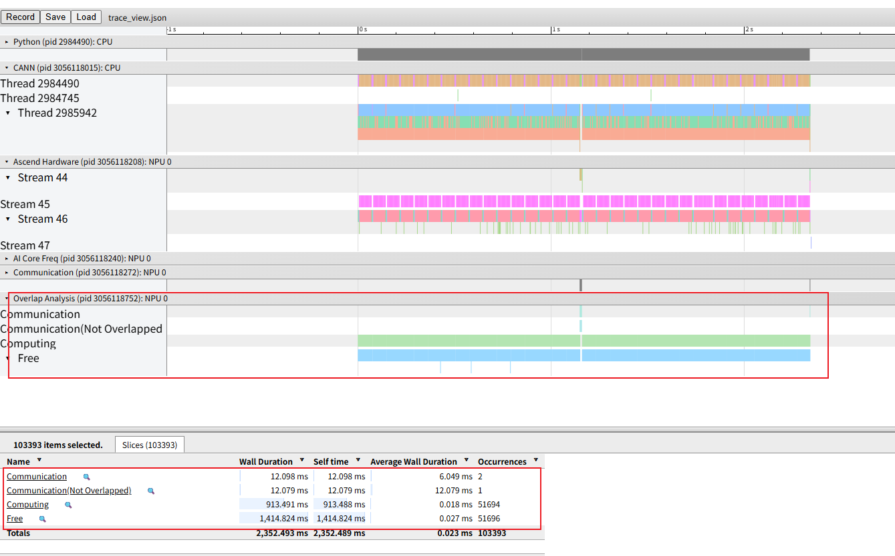
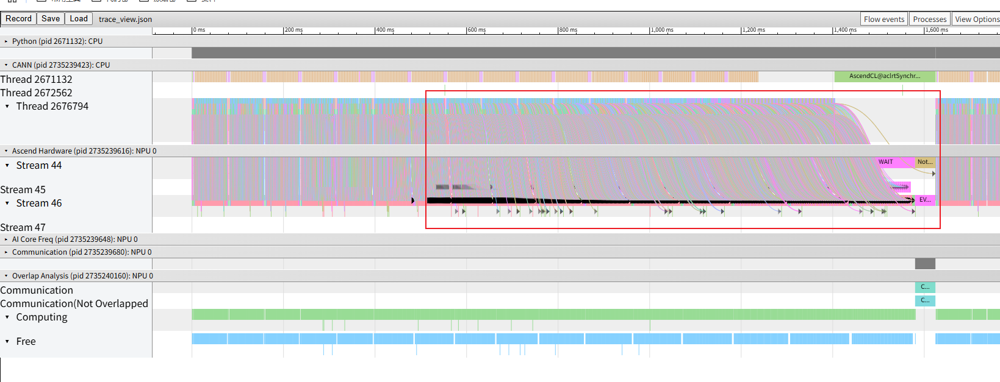
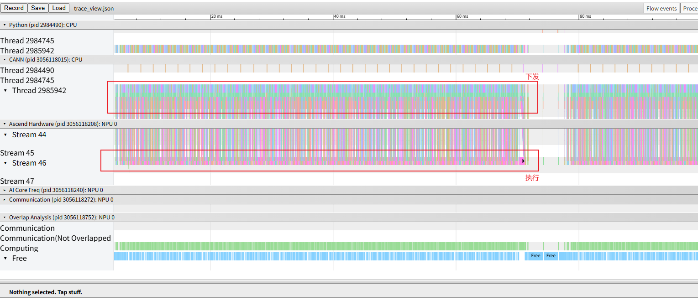
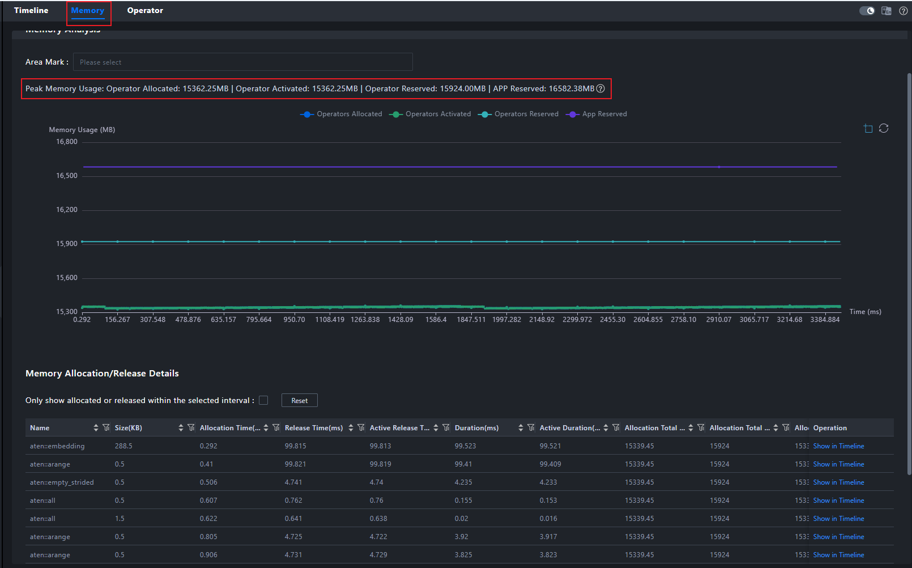

# 一、问题背景

在NPU业务执行过程中，业务执行时间不及预期，通过采集profiling数据确认，下发较慢，硬件整体利用率偏低，急需问题定位和性能优化。

# 二、问题来源

性能调优

# 三、问题现象

通过insight打开msprof.json或者trace_view.json。可观察到业务整体的free时间占比偏高，硬件资源利用率较低。

# 四、定位过程

首先，CANN层级是CANN软件栈的api下发的接口层，AscendHardware层则表示实际的算子执行层。对于整体业务来说，只有api快速下发，硬件长期高密度执行，才是较为合理的下发执行关系。而该关系可通过profiler提供的host_to_device连线进行观察。一个较为优秀的流水图，理应是存在一定倾斜角度，即代表硬件资源的高效利用。类似下图所示

而当前的连线却是直上直下，下发即执行，再等待下一个算子下发。从侧面映证了硬件还存在较大的利用空间。如下图所示

同时我们检查整体业务的内存占用，可发现当前占用并不高，仅15GB，而NPU内存高达64GB，完全可支持更大的batch size，进而提高单个算子计算量。通过增加算子执行时间的方式，提高硬件的资源利用率，以达成更优秀的下发模式，避免资源浪费。

# 五、问题根因

问题本质是未充分利用硬件资源，导致一定程度的资源浪费。通过profiler提供的流水图，host_to_device连线关系，以及内存数据。能直观的呈现当前业务的瓶颈和资源使用情况。并为我们进一步调整业务做出指导，例如以调整batch size等形式，提高业务的整体性能。

# 六、定位方法总结

1、通过可视化工具，从timeline角度发现host和device侧的下发执行关系，并以此为基准锁定是下发层面亦或是执行层面引入的资源利用率低的问题。

2、通过内存等数据，分析当前业务的资源使用情况，进一步确认业务的调整方向。

3、基于“提高算子计算量”这一维度，调整batch size来增加资源使用，进一步达成业务性能调整的目标，并充分利用资源。

# 七、对工具的改进建议

可以考虑在advisor中增加对于内存和下发瓶颈的检测，并给出相关业务参数调整的建议。
