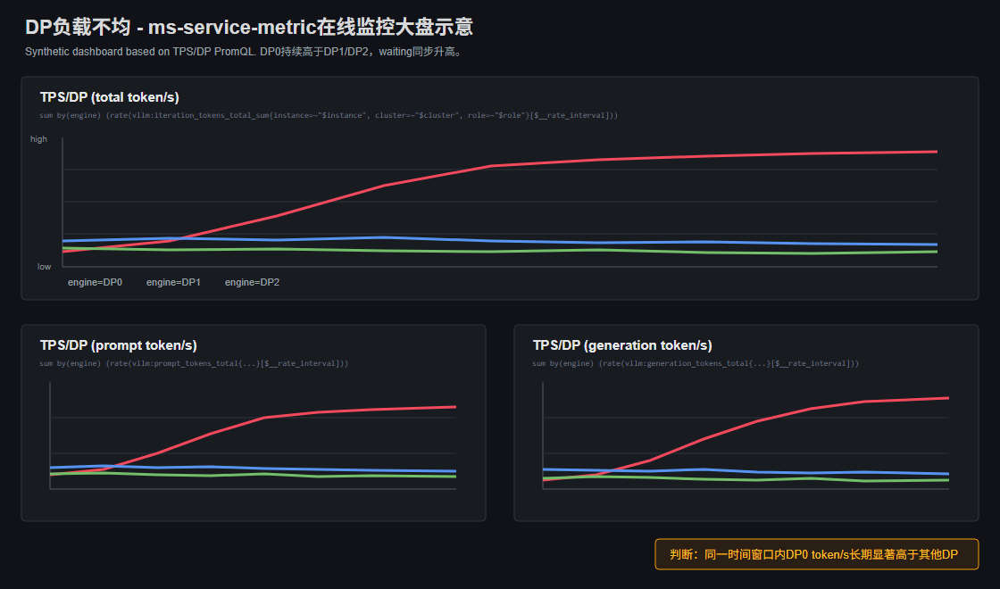

# DP负载不均

## 问题背景

DP并行场景下，一个服务实例内存在多个DP域。正常情况下，请求和token负载应尽量均匀分配到各DP域；如果某个DP域持续承接更多请求或更重请求，它会先出现排队、KVCache高水位或执行耗时变长，最终拖慢整个实例。

## 问题来源

推理

## 问题现象

用户通常先看到实例整体吞吐低于预期，P95/P99时延升高，但单看实例级指标又不一定能解释原因。继续按`dp`维度拆开后，常见现象是：

- 某些DP域running/waiting请求数长期高于其他DP域。
- 某些DP域prompt/generation token吞吐更高，或者batch size更大。
- 热点DP域的KVCache使用率更高，`free_kvcache_blocks`下降更快。
- 非热点DP域仍有空闲，但整体时延已经被热点DP域拉高。

## 定位过程

### 步骤 1：先确认是不是只有部分DP域在忙

在Grafana的DP维度负载面板中，按`dp`或`engine`维度比较同一时间窗口内的请求数、prompt token吞吐、generation token吞吐、batch大小和waiting请求数。

如果只有短时间分叉，且时延没有明显变化，可以先认为是流量抖动；如果某些DP域在多个连续窗口里持续更高，就进入下一步。

### 步骤 2：判断不均来自“请求更多”还是“请求更重”

将Grafana中的请求数、prompt token吞吐和generation token吞吐放在一起看，判断热点DP域的负载来源：

- 请求数更多、token数也更多：通常表示热点DP域承接了更多流量，需要结合调度策略、实例内DP分配策略或请求粘滞情况排查。
- 请求数接近，但prompt/generation token更多：通常表示热点DP域承接了更重请求，需要结合请求日志、压测数据集或请求长度统计确认是否存在长输入或长输出集中。
- 请求数和token数都接近，但某个DP域执行时间更长：需要结合设备监控、进程日志和Profiler排查该DP域对应进程、设备或通信是否异常。

这一步的结论会直接决定后续处理方式：调度偏斜要改分配策略，请求重量偏斜要按token或长度均衡，设备异常要先排查硬件/进程状态。

### 步骤 3：确认DP不均是否已经影响服务

仅DP曲线存在差异不足以判定故障，需要看热点DP域是否同时出现：

- waiting请求增加或队列等待时间升高。
- KVCache使用率高、空闲Block更低。
- batch执行耗时或decode耗时高于其他DP域。
- 实例整体P95/P99时延在同一时间段升高。

如果这些信号同步出现，可初步判断DP负载不均已经形成瓶颈。

### 步骤 4：用离线Profiler定位具体调度差异

采集`Schedule`、`Request`、`KVCache`相关数据后，重点按`dp_rank`聚合：

- 在`batch.csv`中比较各DP域的`batch_size`、`prefill_batch_size`、`decode_batch_size`、`prefill_scheduled_tokens`、`decode_scheduled_tokens`、`total_scheduled_tokens`和`during_time(ms)`。
- 在`request.csv`中按DP域统计请求数量、输入长度、输出长度、`queue_wait_time(ms)`和`first_token_latency(ms)`。
- 在`kvcache.csv`中按DP域比较`used_blocks`、`free_blocks`和`kvcache_usage_rate`。

如果某个DP域连续batch调度token更多、执行时间更长，同时请求等待和KVCache水位更高，可确认热点来自DP调度负载偏斜。

## 问题根因

DP域间承接的请求数量、token数量或执行能力不一致。常见根因包括调度策略未按token量均衡、长请求集中到部分DP域、DP进程或设备状态异常、各DP域配置不一致，或请求粘滞导致流量长期落在少数DP域。

## 解决方法

- 请求数分配不均：调整DP调度策略，避免按固定顺序或固定粘滞方式把请求集中到部分DP域。
- token重量不均：按输入/输出token量做均衡，或将长请求单独调度，避免只按请求个数均衡。
- KVCache压力集中：降低热点DP域进入调度的请求数量，或调整调度策略让不同DP域的KVCache水位更接近。
- 设备或进程异常：结合设备利用率、错误日志和Profiler执行耗时对比热点DP域和其他DP域，先恢复异常DP域能力。
- 配置不一致：检查服务启动参数和部署配置，确认各DP域模型、并行参数、显存配置一致。

处理后需要重新按DP维度观察token吞吐、waiting请求数、KVCache水位和P95/P99时延是否收敛。

## 定位方法论总结

针对DP负载不均场景，需要优先使用ms-service-metric按DP域比较请求数、prompt/generation token、waiting请求数、batch大小和KVCache水位，先判断是否存在持续热点DP域；确认在线指标存在持续分叉后，再使用msServiceProfiler按`dp_rank`聚合`request.csv`、`batch.csv`和`kvcache.csv`，区分请求数量偏斜、token重量偏斜、KVCache压力集中或设备/进程异常。

## 对工具的改进建议

### ms-service-metric

当前在线监控已能按DP域比较请求量、token量、队列和KVCache水位。建议增加DP负载不均提示，在DP间差异持续扩大且实例整体P95/P99时延升高时，自动标记热点DP域。

### msServiceProfiler

当前Profiler已能通过`request.csv`、`batch.csv`、`kvcache.csv`按`dp_rank`聚合分析调度差异。建议在离线报告中直接输出各DP域的请求数、输入输出token、batch调度token、执行耗时和KVCache水位对比。
