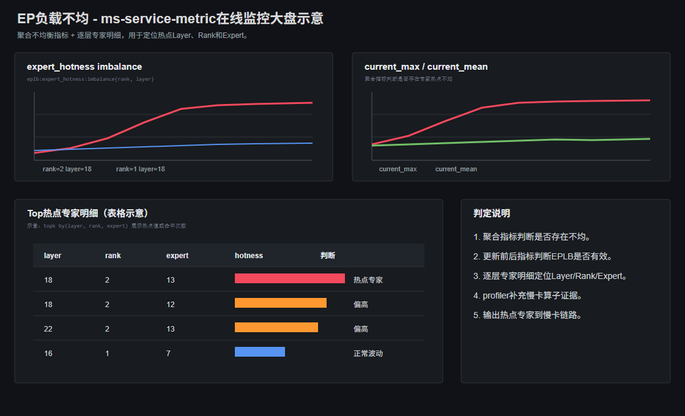

# EP负载不均

## 问题背景

MoE模型推理时，EP并行会把专家分布到不同Rank或Device上。请求经过路由后，如果少数专家被持续命中，对应Rank就会承担更多GroupedMatmul计算和dispatch/combine通信，形成慢卡，进而拉高整个MoE层耗时。

## 问题来源

推理

## 问题现象

用户通常先看到DeepSeek等MoE模型吞吐低于预期，decode耗时或端到端时延升高。进一步观察MoE相关指标时，可能出现：

- 某些Expert热点明显高于同层其他Expert。
- 某些Rank在多个Layer上持续承接更高专家负载。
- EPLB更新后热点没有明显收敛。
- MoE层耗时升高，并伴随某些Rank/Device执行时间更长。

## 定位过程

### 步骤 1：先确认性能问题发生在MoE相关阶段

先确认用户侧吞吐下降或时延升高是否与MoE层执行耗时、decode阶段耗时同步。如果整体性能稳定，仅专家热点短时波动，一般不直接判定为EP故障。

如果decode耗时升高，同时MoE算子或MoE通信阶段变慢，再继续看专家负载。

### 步骤 2：判断是否存在持续专家热点

在Grafana的EPLB或专家热点面板中查看聚合热点指标，确认是不是少数专家长期更热：

- `eplb:expert_hotness:current_max`是否长期明显高于`current_mean`。
- `eplb:expert_hotness:imbalance`是否持续偏高。
- 热点是否只在短时间出现，还是跨多个窗口持续存在。

这里的目标只是回答“有没有持续不均”。如果只有瞬时尖峰，而吞吐和时延没有同步恶化，可以先作为业务输入波动观察。

### 步骤 3：定位具体热点Layer、Rank和Expert

确认存在持续不均后，在逐层专家明细面板中继续定位热点位置：

- 找到哪个Layer下的Expert命中次数或hotness明显更高。
- 看热点Expert是否集中在同一个Rank或少数Rank上。
- 看同一个Rank是否在多个Layer上都承担更高热点。

如果热点分散在多个Rank，影响可能有限；如果热点集中在少数Rank，才更容易形成EP慢卡。

### 步骤 4：判断EPLB是否生效

结合Grafana中的EPLB更新前后热点分布、EPLB配置和服务启动参数判断负载均衡是否生效：

- 如果更新后`update_max / update_mean`下降，`imbalance`下降，通常表示EPLB对热点有缓解。
- 如果更新后热点仍集中在同一批Expert或Rank，需要结合EPLB配置、专家映射配置和请求输入分布继续排查。
- 如果EPLB更新本身耗时过高，还要判断更新开销是否抵消了均衡收益。

这一步决定后续是调EPLB参数，还是排查专家映射配置、业务输入分布或路由策略。

### 步骤 5：用离线Profiler确认热点是否形成慢卡

在线指标能说明“哪个专家热”，但还需要用msServiceProfiler补充采集MoE相关算子和通信数据，确认热点是否已经拖慢执行：

- 对比各Rank/Device的GroupedMatmul耗时，确认热点Rank是否计算更慢。
- 查看MoeDistributeDispatch、MoeDistributeCombine耗时，确认通信是否因热点放大。
- 在trace中看MoE层是否存在少数Rank执行更久、其他Rank等待同步的现象。

如果热点Expert、热点Rank和慢算子/慢通信出现在同一时间窗口，才能把根因收敛为EP负载不均。

## 问题根因

EP专家负载分配不均，少数Expert或Rank持续承接更高请求负载，并进一步造成MoE计算或通信慢卡。常见根因包括业务输入分布集中、EPLB未开启或参数不合理、专家映射不均、热点专家集中放置，以及个别Rank/Device执行能力异常。

## 解决方法

- EPLB未开启或不生效：开启EPLB，调整更新周期、窗口长度、迁移阈值或专家重映射策略。
- 热点专家集中在少数Rank：调整专家放置或映射，让热点Expert分散到更多Rank。
- 输入分布导致路由集中：结合请求日志或压测数据集分析业务请求类型，必要时做流量分组或输入分布隔离。
- 通信放大：检查dispatch/combine通信耗时，优化并行配置或通信路径，避免热点Rank同时承担更高计算和通信。
- 个别Rank异常慢：先排查设备状态、进程负载和算子执行异常，避免把设备问题误判为路由不均。

处理后需要观察热点分布是否收敛，MoE算子/通信耗时是否下降，decode时延和吞吐是否恢复。

## 定位方法论总结

针对EP负载不均场景，需要优先使用ms-service-metric观察MoE相关耗时、专家热点分布和EPLB更新前后是否收敛，先确认是否存在持续热点Expert或热点Rank；确认热点后，再使用msServiceProfiler采集MoE算子和通信数据，对比GroupedMatmul、dispatch/combine等耗时，判断热点是否真实形成慢卡，避免把短时输入波动或单个设备异常误判为EP负载不均。

## 对工具的改进建议

### ms-service-metric

当前在线监控已能查看EPLB更新前后热点分布和专家热点指标。建议增加Layer、Rank、Expert维度的热点Top列表，直接展示热点Expert是否集中在少数Rank上。

### msServiceProfiler

当前Profiler已能通过MoE算子和通信耗时确认热点是否形成慢卡。建议在离线报告中增加“热点Expert -> Rank/Device -> MoE算子耗时”的关联视图。
