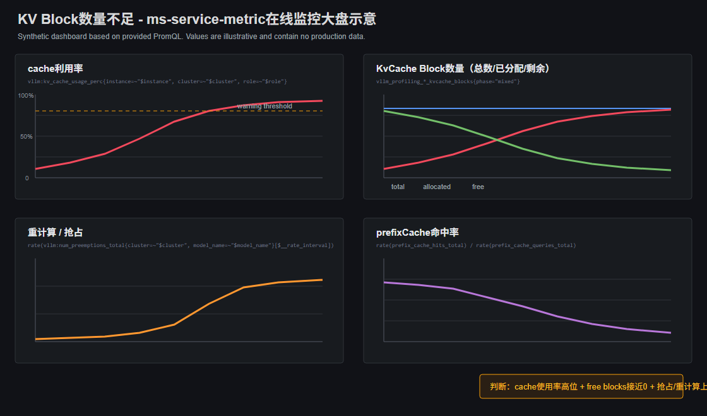

# KV Block数量不足

## 问题背景

KV Block用于承载请求的KVCache。请求进入prefill和decode阶段后，调度器需要持续申请KV Block；如果可用Block不足，请求即使算力还有空闲，也可能因为拿不到KVCache资源而排队、抢占或重算。

## 问题来源

推理

## 问题现象

用户通常先看到的是性能劣化，而不是直接看到“KV Block不足”：

- 压测并发继续增加时，吞吐不再提升，首Token时延和端到端时延明显升高。
- 服务端存在较多waiting/pending请求，部分请求长时间不进入decode。
- NPU利用率不一定持续打满，但请求排队时间持续升高。
- 监控中KVCache使用率长期高位，`free_kvcache_blocks`长期接近0，或出现抢占/分配失败增长。

## 定位过程

### 步骤 1：先确认问题是不是“排队变长”

在Grafana服务总览或请求时延面板中查看时延拆分，先确认时延增长主要发生在哪个阶段：

- 首Token时延是否升高。
- 请求queue/waiting时间是否升高。
- running请求没有明显增加，但waiting/pending请求持续堆积。

如果时延主要涨在模型执行阶段，并且NPU长期满载，应优先排查计算瓶颈；如果时延主要涨在等待阶段，才继续往调度和KVCache方向定位。

### 步骤 2：确认等待是否由KV Block不足导致

在Grafana的KVCache、请求状态和调度状态面板中，重点观察同一个时间窗口内是否同时出现以下现象：

- `free_kvcache_blocks`长期低位，KVCache使用率接近上限。
- waiting/pending请求、队列等待时间或首Token时延同步升高。
- 抢占、重算或分配失败类指标在同一时间段增长。

如果这三类信号对齐，可初步判断请求被KVCache容量卡住，而不是单纯计算慢。

### 步骤 3：确认容量压力来源

KVCache水位只能表明实例已经接近容量上限；具体是并发、请求长度、流量分配还是KVCache配置导致，需要结合压测配置、服务启动参数、请求日志和Grafana监控一起判断：

- 从压测配置、服务启动参数或变更记录确认是否提高了并发、`max_num_seqs`、`max_model_len`、最大输出长度或batch相关配置。
- 从请求日志、压测数据集或请求长度统计确认是否存在长上下文、长输出请求集中进入实例。
- 从Grafana实例维度监控确认是否只有部分实例承接了更多请求或token，其他实例仍有空闲。
- 从服务启动参数、显存配置和Grafana中的total/free KV Block水位确认KVCache可用Block总量是否偏小。

如果压测流量固定，但长输入/长输出比例升高，通常是请求长度占用Block过多；如果请求长度稳定但并发升高，通常是单实例并发超过当前KVCache容量；如果只有部分实例耗尽Block，则还需要排查多实例负载不均。

### 步骤 4：用离线Profiler验证具体卡在哪些请求和batch

当在线监控已经指向KV Block不足后，再使用msServiceProfiler采集`Schedule`、`KVCache`、`Request`相关数据，重点看三个文件：

- `request.csv`：看`queue_wait_time(ms)`、`first_token_latency(ms)`是否主要变长，并找到等待时间最长的请求。
- `batch.csv`：看`used_blocks`、`free_blocks`、`kvcache_usage_rate`是否在连续batch中长期高位，以及`decode_batch_size`是否因为Block不足无法稳定扩大。
- `kvcache.csv`：看`blocks_allocated`和`blocks_freed`。如果多个时间窗口内申请持续大于释放，最后`free_blocks`被打空，就能把根因收敛到KVCache容量不足。

通过Profiler需要回答两个问题：哪些请求占用了最多Block，以及Block耗尽后调度器在哪些batch开始排队或抢占。

## 问题根因

KVCache可用Block数量不足，导致请求无法及时获得KVCache资源。常见根因是单实例并发过高、输入输出长度过长、KVCache预留显存不足、长请求集中到少数实例，或调度参数允许过多请求同时进入。

## 解决方法

根据定位结果选择处理方式：

- 并发过高：降低单实例并发、`max_num_seqs`或入口限流阈值，避免一次放入过多请求。
- 请求太长：限制最大输入长度、最大输出长度，或将长上下文请求单独路由到更大KVCache容量的实例。
- 单实例Block总量不足：调整KVCache相关显存配置或提高可用于KVCache的显存比例；如果单卡显存已无余量，需要增加实例、增加卡数或换更大显存规格。
- 流量分配不均：先处理多实例负载不均，让请求按实例容量和队列状态分配，避免少数实例先耗尽KV Block。
- 抢占/重算明显：降低进入调度器的请求数量，或调整调度策略，避免频繁把已进入decode的请求换出。

处理后需要回看同一组信号：`free_kvcache_blocks`是否恢复到稳定水位，waiting/pending是否下降，首Token时延是否回落，吞吐是否随并发恢复增长。

## 定位方法论总结

针对KV Block数量不足场景，需要优先使用ms-service-metric确认时延是否主要增加在排队和首Token阶段，并观察KVCache水位、`free_kvcache_blocks`和waiting/pending请求是否在同一时间窗口异常；确认在线指标指向KVCache容量压力后，再使用msServiceProfiler采集`request.csv`、`batch.csv`和`kvcache.csv`，定位具体是请求长度、并发、batch调度还是Block分配释放不平衡导致。

## 对工具的改进建议

### ms-service-metric

当前在线监控已能查看KVCache水位、`free_kvcache_blocks`、waiting/pending请求数和首Token时延。建议在现有面板中增加KV Block不足关联诊断提示，把这些指标在同一时间窗口内自动关联展示，辅助判断是否已经由KVCache容量压力导致排队。

### msServiceProfiler

当前Profiler已能通过`request.csv`、`batch.csv`、`kvcache.csv`分析请求等待、batch调度和KVCache分配释放情况。建议在离线报告中增加KV Block不足摘要，自动标记`free_blocks`持续低位、`decode_batch_size`无法扩大、`blocks_allocated`持续大于`blocks_freed`的时间窗口。
