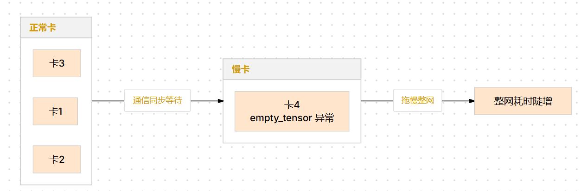
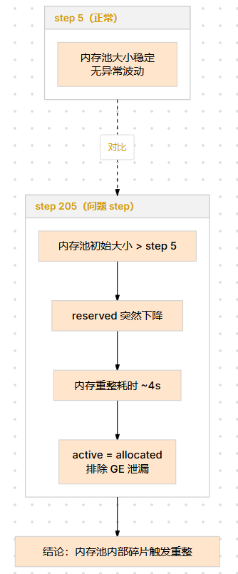
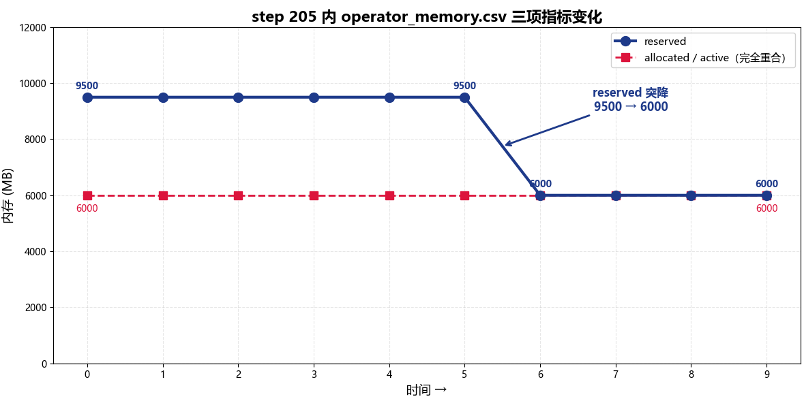
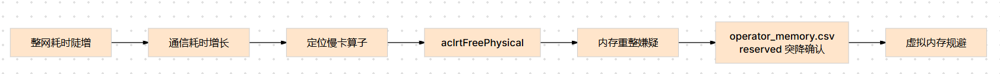

# 显存超过临界值触发内存重整问题分析

## 问题背景

美团 910C 集群在整网跑模型过程中出现整网耗时陡增。初步怀疑单卡存在性能异常拖慢整网，需通过 profiling 定位具体原因。

本案例梳理了从整网耗时到最终确认内存重整（Memory Defragmentation）的完整定位过程，总结如何通过 `operator_memory.csv` 识别内存重整特征及规避方案。

## 问题现象

模型整网运行时，第 5 个 iteration 和第 120 个 iteration 的耗时差异显著。进一步分析发现通信耗时持续增大，定位到其中一张卡的 `empty_tensor` 算子运行时间异常长，造成快慢卡效应，拖慢整网性能。

<div align="center"></div>
<div align="center"><b>图1：快慢卡耗时差异示意</b></div>

不同卡之间表现不一致的原因在于动态 shape，各卡 shape 分布不同，导致碎片累积程度不一。

## 定位过程

### 1. 从整网耗时到通信耗时

先对比不同 iteration 的总耗时，确认第 120 个 iteration 相比第 5 个明显变慢。拆分耗时后发现，通信耗时是主要的增长来源。

### 2. 从通信耗时到单卡算子

分析通信耗时增大的原因，发现一张卡的 `empty_tensor` 算子耗时远超预期，导致该卡在通信同步中成为慢卡，拖慢整体性能。

### 3. 从单卡算子到内存重整嫌疑

进一步分析 `empty_tensor` 算子内部行为，发现其调用了 `aclrtFreePhysical`。结合历史经验，`aclrtFreePhysical` 的长时间调用通常是内存重整触发，因此**高度怀疑**问题卡上发生了内存重整。但此时仍缺少直接证据——需要通过 profiling 的内存数据交叉验证。

### 4. 采集 profiling 内存数据，确认内存重整

**采集配置**

使用 `torch_npu.profiler` 采集内存数据时，需要开启以下关键参数：

```python
with torch_npu.profiler.profile(
    activities=[torch_npu.profiler.ProfilerActivity.CPU, torch_npu.profiler.ProfilerActivity.NPU],
    schedule=torch_npu.profiler.schedule(wait=1, warmup=1, active=10, repeat=1),
    on_trace_ready=torch_npu.profiler.tensorboard_trace_handler(output_dir),
    profile_memory=True,
    with_stack=True,
):
    ...
```

各参数说明：

- `profile_memory=True`：开启内存数据采集。采集完成后会在 `output_dir` 下生成 `operator_memory.csv`，记录每个算子执行时的 `allocated`、`reserved`、`active` 等内存指标。
- `with_stack=True`：记录调用栈，便于回溯内存申请来源。
- `schedule`：需保证 `active` 参数覆盖到目标 step（如本案例中的 step 5 和 step 205），以便对比不同阶段的内存状态。

**数据分析**

获取问题卡的第 5 个 step 和第 205 个 step 的 `operator_memory.csv` 数据，对比分析：

- **step 5**：内存池大小保持稳定，未见明显变化
- **step 205**：内存池大小初始比 step 5 更大，随后突然下降，整个过程耗时约 4 秒用于内存重整

<div align="center"></div>
<div align="center"><b>图2：step 5 vs step 205 operator_memory.csv 对比分析</b></div>

关键判断依据——解读 `operator_memory.csv` 的三项核心指标：

| 指标 | 含义 | 本案例中的表现 |
|------|------|---------------|
| `allocated` | 算子实际持有的内存总量 | 稳定不变，排除算子侧泄漏 |
| `reserved` | 内存池向 device 申请的物理内存总量 | 突然大幅下降，释放碎片空间 |
| `active` | GE 框架侧占用的内存 | 与 `allocated` 一致，无 GE 单独占用 |

<div align="center"></div>
<div align="center"><b>图3：step 205 内 allocated / reserved / active 三项指标变化</b></div>

> 图中上半部 `reserved` 曲线在重整时刻骤降约 3500MB（~9500MB → ~6000MB），耗时约 4 秒；下半部 `allocated` 与 `active` 两条曲线全程重合、保持平坦。三者关系说明：
>
> - `allocated` 不涨 → 算子没有申请更多内存，排除持续泄漏
> - `active` = `allocated` → GE 框架没有额外占用，排除 GE 侧泄漏
> - `reserved` 骤降 → 内存池主动回收碎片空间，非泄漏释放
>
> 以上三点共同构成**内存重整的完整证据链**。

## 问题结论

1. 内存重整由内存池检测到过多碎片后自动触发。重整过程耗时约 4 秒，导致该卡在通信同步中成为慢卡，拖慢整网。
2. `active` 与 `allocated` 保持一致且 `reserved` 突然下降，是内存重整的典型特征。
3. 动态 shape 场景下，各卡 shape 分布不同，碎片累积程度不一，因此问题仅在部分卡上出现。
4. 后续 PTA 会默认启用虚拟内存，从机制上避免内存重整的发生。

## 定位方法论总结

<div align="center"></div>
<div align="center"><b>图4：内存重整定位方法论决策流程</b></div>

1. 整网耗时异常时，先从 iteration 维度对比，确认耗时增长发生在哪个环节（计算或通信）。
2. 通信耗时增大往往是快慢卡导致，进一步定位到具体卡和具体算子。
3. 算子耗时异常时，分析算子内部行为（如是否调用了 `aclrtFreePhysical`），结合历史经验判断是否命中已知问题模式。
4. 对比不同 step 的 `operator_memory.csv`，关注 `reserved` 的突降和 `active`/`allocated` 的关系，识别内存重整特征。
5. 动态 shape 场景下，若问题仅在部分卡上出现，优先排查各卡 shape 分布差异导致的碎片不均。

## 对工具的改进建议

- snapshot 工具与 profiling 工具目前相对独立，建议后续将 snapshot 能力整合到 profiling 工具中，统一数据采集入口
- 在 profiling 工具中增加内存碎片比例的直接指标展示，降低内存重整问题的识别门槛
- 在 `operator_memory.csv` 中增加碎片相关指标列（如碎片率），便于快速判断是否为内存重整
