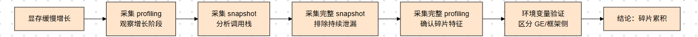
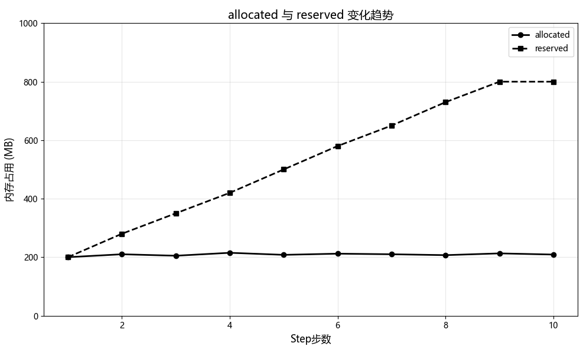
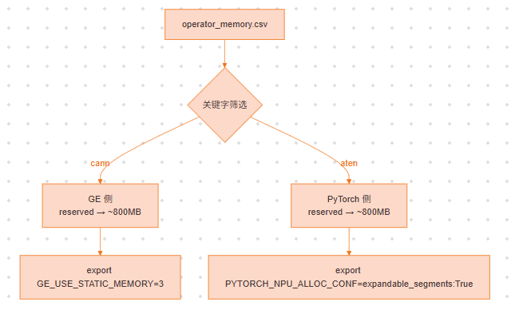
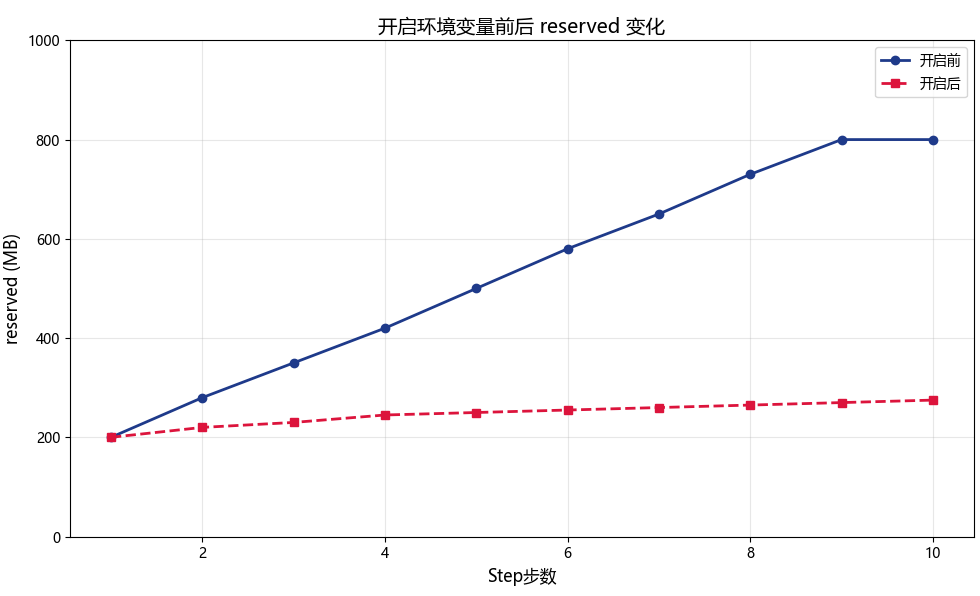
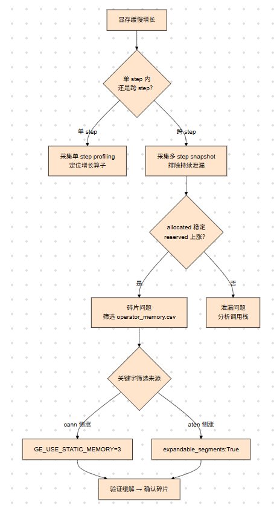

# 内存碎片问题分析

## 问题背景

服务化推理场景中，显存往往不是瞬时暴涨，而是长时间缓慢增长。这类问题既可能是代码层面的内存泄漏，也可能是框架侧或 GE 侧碎片累积导致的显存持续上涨。

本案例基于 `torch_npu.profiler` 数据，总结"显存缓慢增长"问题的定位过程。

<div align="center"></div>
<div align="center"><b>图1：显存缓慢增长定位流程总览</b></div>

## 问题现象

`qwen cosyvoice2` 推理过程中，经过几次图推后显存开始缓慢增长，每次上涨十几 MB，最终约 10 小时后 OOM。该问题在 GPU 上未复现，仅在 NPU 上出现。

从现象看更接近长时间运行后的显存泄漏，但用户反馈即使开启 `empty_cache`，显存仍持续上涨。

## 定位过程

### 1. 采集跨 step profiling，查看 allocated 与 reserved 趋势

首轮 profiling 仅覆盖单个 step 时，无法判断增长是发生在 step 内还是跨 step 累积。因此需要扩大采集范围，覆盖多个连续推理 step，并开启内存统计能力。

**采集配置**：

```python
with torch_npu.profiler.profile(
    activities=[torch_npu.profiler.ProfilerActivity.CPU, torch_npu.profiler.ProfilerActivity.NPU],
    schedule=torch_npu.profiler.schedule(wait=1, warmup=1, active=10, repeat=1),
    on_trace_ready=torch_npu.profiler.tensorboard_trace_handler(output_dir),
    profile_memory=True,
    with_stack=True,
):
    ...
```

各参数说明：

- `profile_memory=True`：开启内存数据采集。采集完成后会在 `output_dir` 下生成 `operator_memory.csv`，记录每个算子执行时的 `allocated`、`reserved`、`active` 等内存指标。
- `with_stack=True`：记录内存申请的调用栈，便于回溯内存申请来源。
- `schedule`：需保证 `active` 覆盖多个连续推理 step，以便观察 `allocated` 和 `reserved` 的跨 step 变化趋势。

采集完成后，重点查看时间线以及 `operator_memory.csv`，判断 `allocated` 和 `reserved` 的变化趋势。

分析多个 step 的 profiling 后发现：

- `operators allocated` 基本没有增长
- `reserved` 持续上涨

<div align="center"></div>
<div align="center"><b>图2：allocated 与 reserved 多 step 变化趋势</b></div>

> `allocated`（算子实际使用）保持平稳，排除算子侧的持续泄漏；`reserved`（内存池持有的物理内存）持续上涨，说明分配器持有越来越多的内存却无法归还——这是**内存碎片的典型特征**。

### 2. 筛选 operator_memory.csv，区分 GE 侧与框架侧来源

确认是碎片问题后，进一步通过 `operator_memory.csv` 定位碎片来自哪一侧：

- 使用 `cann` 关键字筛选 GE 侧内存，`reserved` 逐步上涨至约 800MB
- 使用 `aten` 关键字筛选 PyTorch 侧内存，`reserved` 同样逐步上涨至约 800MB

<div align="center"></div>
<div align="center"><b>图3：operator_memory.csv 关键字筛选 GE 侧与框架侧来源</b></div>

### 3. 环境变量验证碎片特征

针对 GE 侧和框架侧分别开启碎片缓解环境变量验证：

```bash
export GE_USE_STATIC_MEMORY=3
export PYTORCH_NPU_ALLOC_CONF=expandable_segments:True
```

结果表明，短序列场景下显存上涨明显缓解，说明主要问题源于 GE 侧和框架侧的碎片累积，而非典型的持续泄漏。

<div align="center"></div>
<div align="center"><b>图4：开启环境变量前后 reserved 变化对比</b></div>

> 开启两个环境变量后，`reserved` 的增长趋势明显被抑制，涨幅从 ~600MB 降至 ~75MB。

## 问题结论

1. 短序列场景下，问题主要是内存碎片持续累积，而非典型代码泄漏。
2. 当 `operators allocated` 基本不涨但 `reserved` 持续上涨时，应优先怀疑碎片问题。
3. 通过筛选 `operator_memory.csv`，可以快速区分 GE 侧和框架侧的上涨来源。
4. 开启 `GE_USE_STATIC_MEMORY=3` 和 `PYTORCH_NPU_ALLOC_CONF=expandable_segments:True` 后，短序列场景的上涨可明显缓解。

## 定位方法论总结

<div align="center"></div>
<div align="center"><b>图5：碎片问题定位方法论决策流程</b></div>

1. 先采集覆盖多个 step 的 profiling，对比 `allocated` 和 `reserved` 的跨 step 趋势。
2. 当 `allocated` 稳定而 `reserved` 持续上涨时，优先按碎片问题排查。
3. 结合 `operator_memory.csv` 的关键字筛选，区分 GE 侧与框架侧来源。
4. 通过环境变量验证，可快速判断问题是否具备碎片缓解特征。

## 对工具的改进建议

- 增加 GE 侧碎片问题的专项定位能力
- 更直观地区分 `allocated` 上涨和 `reserved` 上涨的原因
- 增强对 `operator_memory.csv` 的自动归因分析
