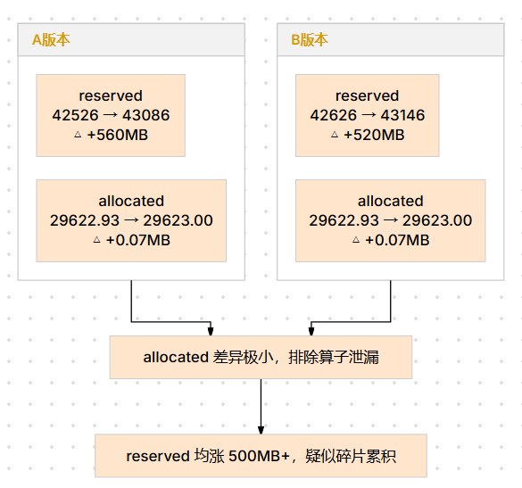
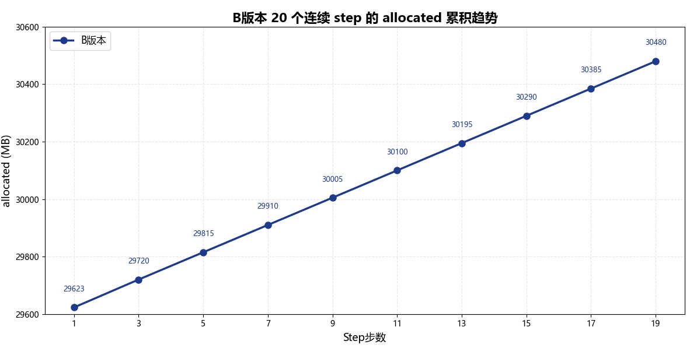
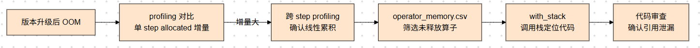

# 内存泄漏问题分析

## 问题背景

【问题来源】
CANN 包版本升级（A版本 → B版本），推理场景。

【问题现象】
稳定复现。B版本运行约 12 小时后，在第 471 个 step 出现 OOM。该问题在 A 版本上未复现，且在 GPU 上同样未出现，仅在 NPU B 版本上复现。已确认开启了虚拟内存。

## 定位过程

### 第一步：对比两个版本单 step 的 profiling 内存数据

**时间**：4.10（耗时约 1 天）

**当前现状和分析**：B版本在第 471 个 step 后 OOM，已获取两个版本 step 2 的 profiling 数据，需要对比分析单 step 的内存行为差异。

**采集配置**

使用 `torch_npu.profiler` 采集内存数据时，需开启以下关键参数：

```python
with torch_npu.profiler.profile(
    activities=[torch_npu.profiler.ProfilerActivity.CPU, torch_npu.profiler.ProfilerActivity.NPU],
    schedule=torch_npu.profiler.schedule(wait=1, warmup=1, active=10, repeat=1),
    on_trace_ready=torch_npu.profiler.tensorboard_trace_handler(output_dir),
    profile_memory=True,
    with_stack=True,
):
    ...
```

各参数说明：

- `profile_memory=True`：开启内存数据采集。采集完成后会在 `output_dir` 下生成 `memory_record.csv`，记录 profiling 起始和结束时 `allocated`、`reserved` 等内存快照指标，以及 `operator_memory.csv` 记录每个算子的内存申请与释放详情。
- `with_stack=True`：记录调用栈，便于回溯未释放内存的申请来源。
- `schedule`：需保证 `active` 覆盖到目标 step（如本案例中对比 A/B 两个版本的 step 2），确保两版本采集范围一致。

**操作动作**：对比两份 profiling 数据的起始内存与结束内存差异。

首先查看两个版本的 `memory_record.csv`，对比起始和结束时间点的内存状态：

| 版本   | profiling 起始内存                        | profiling 结束内存                         | allocated 增量 |
|--------|------------------------------------------|-------------------------------------------|---------------|
| A版本  | allocated: 29622.93MB / reserved: 42526MB | allocated: 29623.02MB / reserved: 43086MB | +0.09MB       |
| B版本 | allocated: 29622.93MB / reserved: 42626MB | allocated: 29670.15MB / reserved: 47890MB | **+47.22MB**  |

<div align="center"></div>
<div align="center"><b>图1：A版本与B版本 profiling 起始/结束内存对比</b></div>

分析结论：

- A版本单 step 的 `allocated` 增量仅 0.09MB，属于正常的微小波动，step 结束后基本完全释放。
- B版本单 step 的 `allocated` 净增约 47MB，说明单个 step 内存在未释放的内存，这是**典型的内存泄漏特征**。
- 若每个 step 泄漏约 47MB，运行 471 个 step 后将累积约 22GB，足以导致 OOM。

### 第二步：采集多个 step 的 profiling，确认泄漏累积趋势

**时间**：4.10（与第一步同步完成）

**当前现状和分析**：单 step 已发现 ~47MB 的泄漏，需要确认泄漏是否跨 step 线性累积。

**操作动作**：扩大 profiling 的 `active` 覆盖范围，连续采集 20 个 step，观察 `allocated` 的跨 step 变化趋势。

<div align="center"></div>
<div align="center"><b>图2：B版本多 step allocated 线性累积趋势</b></div>

> `allocated` 随 step 近乎线性增长，每个 step 净增约 47MB，确认泄漏持续累积，非单 step 异常。

### 第三步：通过调用栈定位泄漏来源

**时间**：4.11（耗时约 1 天）

**当前现状和分析**：确认泄漏持续累积后，需要定位具体是哪个算子或代码路径导致了泄漏。

**操作动作**：分析 `operator_memory.csv` 中各算子的内存申请与释放记录，结合 `with_stack=True` 记录的调用栈，筛选出申请后未释放的算子。

筛选 `operator_memory.csv` 后发现：

- `aten::empty` 算子申请了约 47MB 内存但全程未记录到对应的释放操作
- 调用栈显示该 `aten::empty` 来自 `custom_attention_forward` 算子内部的中间 tensor 分配

进一步代码审查发现，B版本中 `custom_attention_forward` 的 KV-cache 实现存在引用计数问题：中间 tensor 被 cache 内部引用后，Python 侧引用计数未正确递减，导致 step 结束后 tensor 不会被 GC 回收，累积在内存池中。

## 问题根因

B版本 `custom_attention_forward` 算子的 KV-cache 实现存在引用计数错误，导致每 step 产生的中间 tensor（约 47MB）无法被垃圾回收，持续累积在显存中。经过 471 个 step 后，累积泄漏量达到 ~22GB，触发 OOM。

该问题属于算子 bug：KV-cache 内部对中间 tensor 的引用管理不当。该故障模式需补充至故障模式库。

## 定位方法论总结

<div align="center"></div>
<div align="center"><b>图3：内存泄漏问题定位方法论</b></div>

1. 版本升级引入的 OOM，优先对比新旧版本单 step 的 `allocated` 增量。若增量显著（>10MB），直接按泄漏方向排查；若增量微小，再转向碎片分析。
2. 确认单 step 存在泄漏后，扩大 profiling 范围验证跨 step 累积趋势，排除单次异常。
3. 利用 `operator_memory.csv` 筛选申请/释放不匹配的算子，结合 `with_stack` 调用栈定位到具体代码路径。

## 对工具的改进建议

- `operator_memory.csv` 目前需要手动对比申请和释放记录来识别泄漏算子，建议增加"未释放算子"的自动标注能力
- profiling 工具可增加跨 step 的 `allocated` 趋势图自动生成，降低泄漏累积的识别门槛
- 建议在 profiler 中增加算子级内存生命周期跟踪，自动关联申请与释放，直接标记异常
