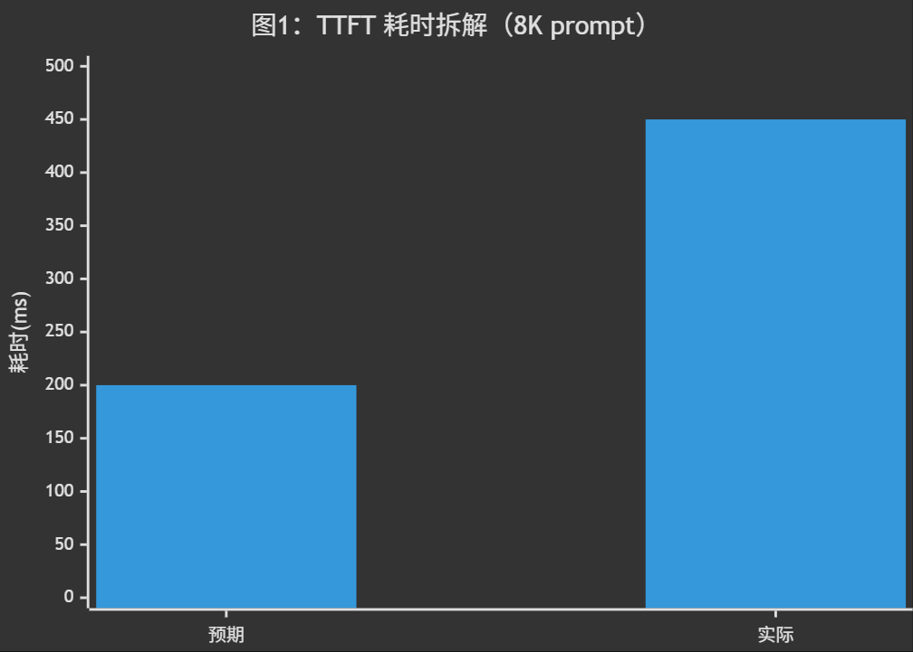
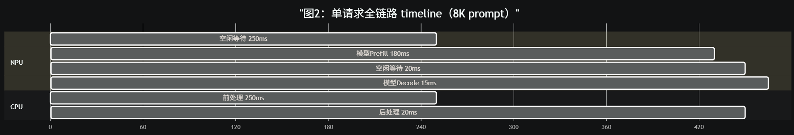
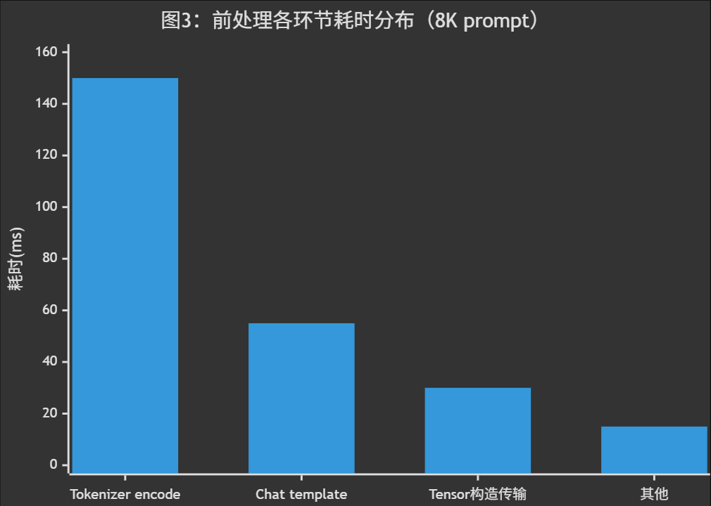
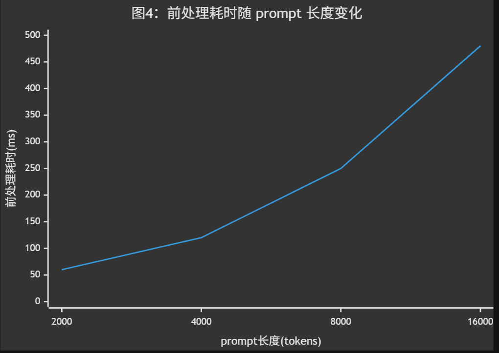

# 模型前后处理耗时过长问题分析

## 问题背景

大模型推理服务的一条请求可拆分为三个阶段：前处理（Tokenizer 编码）、模型推理（Prefill + Decode）、后处理（Detokenizer 解码）。其中前/后处理在 CPU 侧执行，涉及文本编码/解码、特殊 token 处理、chat template 渲染等操作。当输入 prompt 较长（>10K tokens）或服务处于多轮对话场景时，前后处理的 CPU 耗时可能超过模型推理耗时，成为端到端延迟的主要瓶颈。

用户反馈在A2上部署对话模型服务，TTFT（首令牌生成时间）约 450ms，其中模型 Prefill 仅占约 180ms，怀疑前处理耗时过长，需通过服务化 profiling 定位具体环节。

## 问题现象

稳定复现。以单条 8K token 的 prompt 为例：

- TTFT 约 450ms，远超预期的 ~200ms
- NPU 在请求到达后有明显的空闲等待期（约 250ms），期间无任何计算活动
- prompt 越长，TTFT 中的空闲占比越高：2K prompt 时空闲约 60ms，8K prompt 时空闲约 250ms
- 并发请求下，前后处理排队等待现象明显——后续请求的前处理需等待前序请求完成后处理才能开始

> 实际 TTFT 450ms，其中模型 Prefill 仅 180ms，前处理占用约 250ms，后处理占用约 20ms。前后处理合计占 TTFT 的 60%。

## 定位过程

### 1. 全局性能数据采集 —— msServiceProfiler

使用**msServiceProfiler**工具对服务端进行完整的性能数据采集，获取端到端各阶段的耗时分布。

### 2. 可视化分析

使用 `MindStudio Insight` 导入解析后的性能数据。

关键分析步骤：

#### 1. 查看单请求全链路 timeline

以时间线方式呈现从请求到达到首 token 输出的完整过程。可观察到模型 Prefill 之前存在一段 CPU 前处理区间，包含以下操作：

- Chat template 渲染：将原始文本套入对话模板
- Tokenizer encode：将文本转为 token id 序列
- 输入 tensor 构造与传输：将 token ids 拷贝到 Device 侧

Prefill 完成后同样存在一段 CPU 后处理区间：

- Detokenizer decode：将首个 output token id 转为文本

> 前处理耗时 250ms 占据 TTFT 的 55.6%，期间 NPU 完全空闲。后处理 20ms 占比不大，但在流式输出场景下每 token 都需 detokenize，累积开销可观。

#### 2. 分析前处理各环节耗时

从导出 CSV 中筛选前处理相关函数，按耗时排序。

关键发现：

- Tokenizer encode 耗时占比最高（约 60%），8K prompt 需约 150ms 逐字符编码
- Chat template 渲染耗时约 55ms（22%），涉及字符串拼接和特殊 token 插入
- Tensor 构造与 Host→Device 传输耗时约 30ms（12%）
- 其他（参数校验、memory pinning 等）约 15ms（6%）

进一步分析不同 prompt 长度下的前处理耗时变化：

> 前处理耗时与 prompt 长度呈近似线性关系，说明 Tokenizer encode 是主要瓶颈，且未采用并行分词或缓存优化。

## 问题根因

前处理中 Tokenizer encode 对 prompt 全量文本逐字符编码，未启用缓存机制。在多轮对话场景下，固定的 system prompt 每次请求都被重新编码，导致前处理耗时与 prompt 长度线性增长。8K prompt 下前处理耗时约 250ms，占 TTFT 的 55.6%，NPU 在此期间完全空闲。

该问题属于**服务化管线配置问题**：Tokenizer 缓存未启用，且前后处理与模型推理共享 CPU 线程，阻塞 NPU 调度。该故障模式需补充至故障模式库。

## 问题结论

1. 前处理耗时过长的根因是 Tokenizer encode 未启用缓存，每次请求对全量 prompt 重新编码，8K prompt 下耗时约 150ms。
2. 前后处理全流程在 CPU 侧执行，NPU 空闲等待约 270ms（前处理 250ms + 后处理 20ms），占 TTFT 的 60%。
3. 前处理耗时与 prompt 长度呈线性增长，16K prompt 下前处理约 480ms，几乎与 Prefill 耗时持平。
4. 优化方向：启用 Tokenizer 缓存（system prompt 仅编码一次）、使用 Rust/C++ 层 Tokenizer 绕过 Python GIL、将前后处理与模型推理部署到不同线程/进程以避免阻塞 NPU 调度。

## 定位方法论总结

1. TTFT 异常偏高时，先通过 `msServiceProfiler` 采集全链路 timeline，确认 Prefill 前是否存在 CPU 空闲区间。
2. 通过 MindStudio Insight 定位前处理中各环节（Tokenizer encode、chat template、tensor 传输）的耗时占比。
3. 对比不同 prompt 长度下的前处理耗时，判断是否存在线性增长特征。
4. 对比冷热请求的前处理耗时，判断 Tokenizer 缓存是否生效。
