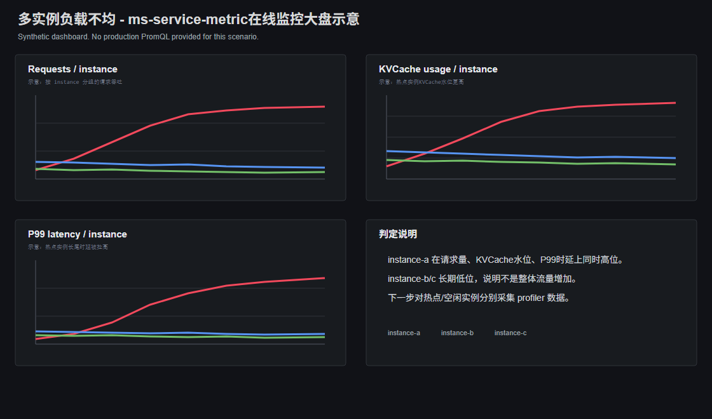

# 多实例负载不均

## 问题背景

推理服务通常由多个实例共同承接流量。理想情况下，请求量、token量、队列长度和KVCache水位应在实例间大致均衡；如果入口路由、实例权重、健康状态或请求长度分布异常，少数实例会成为热点，其他实例仍有空闲，整体吞吐和时延都会被热点实例限制。

## 问题来源

推理

## 问题现象

用户通常先看到整体吞吐低于多实例容量预期，或者P95/P99时延明显高于平均时延。按实例拆开后，常见现象是：

- 少数实例请求数、token吞吐或batch大小持续高于其他实例。
- 热点实例waiting/pending请求更多，首Token时延和队列等待时间更高。
- 热点实例KVCache使用率更高，`free_kvcache_blocks`更低。
- 其他实例仍有空闲，但整体服务已经出现时延长尾。

## 定位过程

### 步骤 1：先确认是否存在热点实例

在Grafana实例维度面板中选择同一压测窗口或同一线上时间窗口，按实例比较：

- 请求QPS、running/waiting请求数。
- prompt token、generation token和总token吞吐。
- 首Token时延、端到端时延和队列等待时间。
- batch大小、KVCache使用率、`free_kvcache_blocks`。

如果只有短时波动，不一定是故障；如果少数实例在多个连续窗口内持续更高，而其他实例持续偏低，可初步判断存在实例间负载偏斜。

### 步骤 2：判断偏斜来自请求数量还是请求重量

把“请求数”和“token数”分开看：

- 请求数更多，token数也更多：结合网关日志、负载均衡配置、服务发现状态和连接复用情况，优先排查入口路由、实例权重或连接粘滞。
- 请求数接近，但token数更多、平均输入输出长度更长：结合请求日志、压测数据集或请求长度统计确认是否存在长请求集中到热点实例的情况。
- 请求数和token数都接近，但热点实例时延更高：结合服务启动参数、设备监控、进程日志和Profiler排查实例配置、设备状态、进程状态或本地资源竞争。

通过这一步先判断不均类型，再选择对应的排查方向。

### 步骤 3：检查入口路由和实例状态

如果判断为请求数量偏斜，需要结合网关、服务发现或负载均衡侧信息检查入口侧：

- 各实例流量权重是否一致。
- 是否有实例健康检查异常，导致没有被分配流量。
- 长连接、连接池或会话粘滞是否让请求固定落到少数实例。
- 灰度、扩缩容或重启后，部分实例是否没有正常加入负载均衡。

如果判断为请求重量偏斜，需要结合请求长度统计和负载均衡策略，确认当前策略是否只按请求数分发，而没有感知输入长度、输出长度、队列状态或KVCache水位。

### 步骤 4：确认热点实例是否已经被资源卡住

继续看热点实例内部状态：

- waiting/pending是否持续增加。
- KVCache使用率是否高位，空闲Block是否接近耗尽。
- NPU是否打满；如果NPU不满但队列变长，更可能是KVCache或调度资源卡住。
- 端到端时延升高是否主要来自排队等待或首Token阶段。

如果热点实例同时出现排队和KVCache高水位，需要结合“KV Block数量不足”场景继续下钻。

### 步骤 5：用Profiler对比热点实例和空闲实例

分别采集热点实例和空闲实例的`Schedule`、`Request`、`KVCache`数据，重点做对比：

- `request.csv`：比较请求数量、输入长度、输出长度、`queue_wait_time(ms)`、`first_token_latency(ms)`。
- `batch.csv`：比较`batch_size`、`prefill_batch_size`、`decode_batch_size`、`total_scheduled_tokens`和`during_time(ms)`。
- `kvcache.csv`：比较`used_blocks`、`free_blocks`和`kvcache_usage_rate`。

如果热点实例请求更多或token更重，并且Profiler中排队、batch规模和KVCache水位都更高，可将问题闭环到实例间负载不均。

## 问题根因

多实例间承接的请求数量、请求长度或实例能力不一致。常见根因包括负载均衡权重错误、健康检查或服务发现异常、长连接/会话粘滞、长请求集中到少数实例、实例配置不一致，以及负载均衡策略未感知token量、队列长度或KVCache水位。

## 解决方法

- 路由权重错误：修正实例权重，确保所有健康实例都进入负载均衡。
- 健康检查异常：恢复异常实例或从负载均衡中移除不可用实例，避免流量只打到部分实例。
- 长连接或会话粘滞：调整连接池、网关策略或负载均衡算法，减少请求固定落点。
- 长请求集中：按输入/输出token量、队列长度或KVCache水位做调度，必要时隔离长短请求。
- 实例能力不一致：统一模型版本、启动参数、并行配置、显存配置和硬件规格。
- 热点实例KVCache耗尽：先限流或迁移流量，再按KV Block不足场景调整并发、长度或KVCache容量。

处理后需要回看实例间请求数、token数、waiting请求数、KVCache水位和P99时延是否收敛。

## 定位方法论总结

针对多实例负载不均场景，需要优先使用ms-service-metric按实例比较请求数、token吞吐、waiting请求数、时延和KVCache水位，先判断是否只有少数实例持续成为热点；确认存在实例间偏斜后，再使用msServiceProfiler分别采集热点实例和空闲实例的`request.csv`、`batch.csv`和`kvcache.csv`进行对比，区分入口路由/实例权重异常、请求长度分布偏斜、实例能力不一致或热点实例内部资源耗尽。

## 对工具的改进建议

### ms-service-metric

当前在线监控已能按实例比较请求量、token量、时延、队列和KVCache水位。建议增加多实例负载偏斜提示，自动区分“请求数偏斜”和“请求长度/token重量偏斜”，并提示检查入口路由、实例权重或请求长度分布。

### msServiceProfiler

当前Profiler已能分别采集热点实例和空闲实例的`request.csv`、`batch.csv`、`kvcache.csv`并进行人工对比。建议支持多实例采集结果合并分析，直接输出热点实例与空闲实例的请求量、token重量、batch规模、排队时间和KVCache水位差异。
