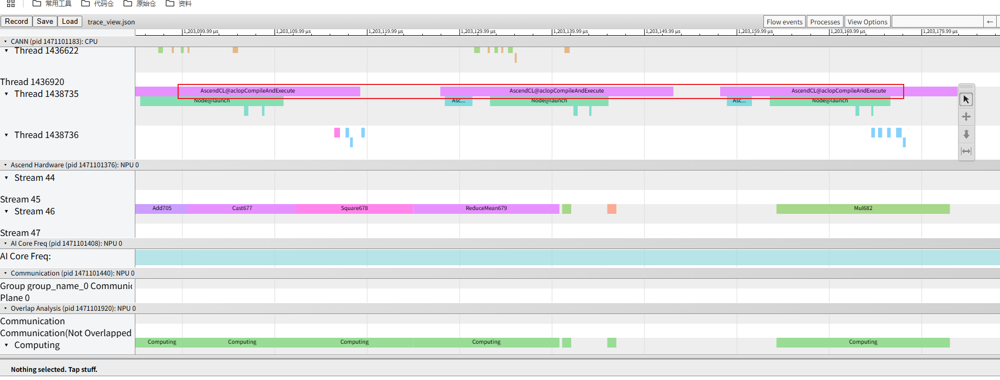
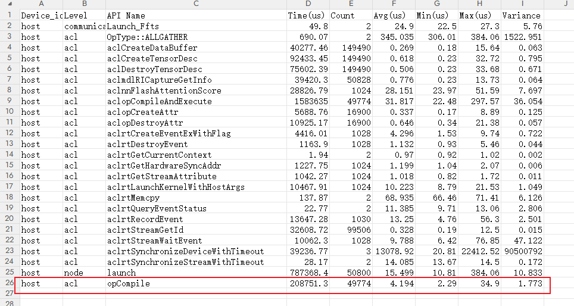
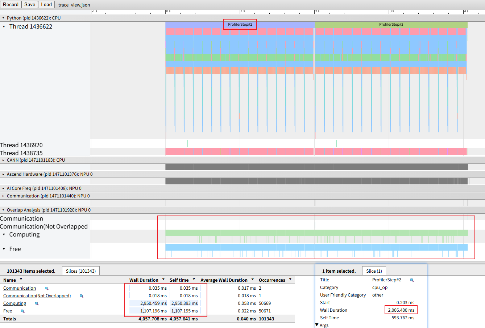
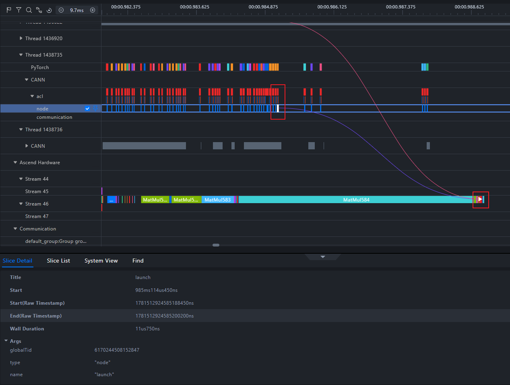
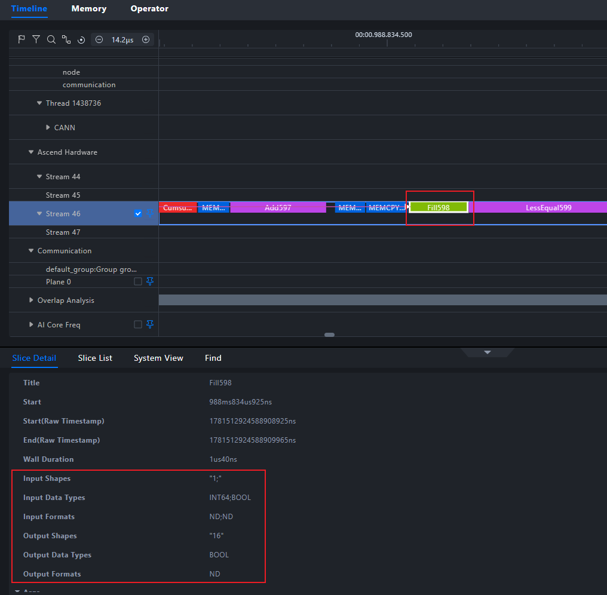
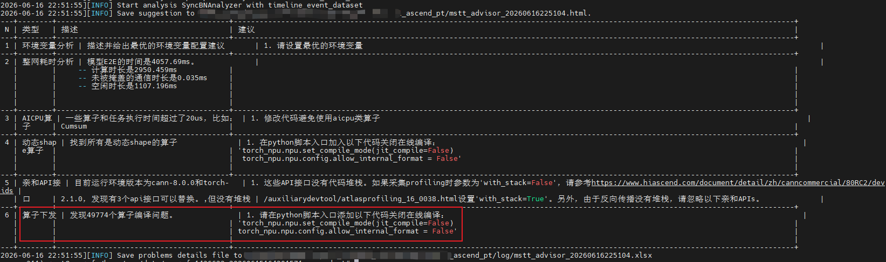

# 一、问题背景

在NPU业务执行过程中，业务执行时间不及预期，通过采集profiling数据确认，存在较多算子编译耗时长问题，急需问题定位和性能优化。

# 二、问题来源

性能调优

# 三、问题现象

如图所示，典型算子编译接口建议锁定关键字“aclopCompile”。

当前用例中可通过api_statistic.csv交付件，确认本次采集中涉及多少次相关编译api动作。对于算子整体调用流程而言，额外增加了一个算子编译的动作。频繁且大量的算子编译，可能导致host下发时间的增加，并进而导致NPU上算子执行空隙增大，整体执行效率降低。

从下图中可看到step2的时间在2s左右，同时从整体的overlap统计来看，computing时间为2.95s，free时间为1.1s。free整体占比22%。

# 四、问题根因

要想解决由于算子编译而引入的Host Bound问题，首先得先明确，在何种场景会触发算子编译行为。以此为依据来审视业务整体的算子调用，以及方便后续定位。

算子编译的本质是为了满足用户在CANN软件栈上执行相关AI任务，以提供的一种算子编译模式。在大部分用户均安装ops包的前提下，aclopCompile本质是一种保底行为，确保各种流程下至少能跑通业务。

对于整个CANN软件栈而言，本身通过ops包为用户提供了昇腾提供的内置的可执行二进制算子包。其中包含了能覆盖多数场景的现成算子。

因此，通常情况下一旦调用的算子符合预期，满足条件，那么算子会通过ops包被调用执行。而如果不满足，才会走编译行为。

而非常情况时，在较为老的CANN包版本上、或未安装ops包时、或处于误用设置torch_npu.npu.set_compile_mode(jit_compile=True)的情况下，由于设置了不走二进制，会导致默认强制走算子编译。导致了大量编译行为。

# 五、定位过程

通过insight打开msprof.json或者trace_view.json。通过连线能力，找到compile api和实际执行算子的关系，找到对应算子。

1、如果发现所有的算子都在执行compile动作，那么通常是业务中设置了torch_npu.npu.set_compile_mode(jit_compile=True)，或者没有安装ops包等导致被迫执行了算子编译行为。请检查是否有误设置开关，或者没有正确安装相关依赖。

2、如果发现只有部分算子在执行compile。可检查通过该算子的shape，确认shape是否为相对不常见的算子，该算子可能并未被ops包的泛化场景包含，导致被迫执行了“编译的保底方案”。那么可以针对该算子手动实现一般高性能算子，接入到当前用例中。或修改整体业务逻辑规避当前的非常见shape场景。

# 六、定位方法总结

1、通过可视化工具，从timeline角度发现compile api，以及对应的算子关系

2、确认compile影响算子范围，以确认排查方向

3、全部算子则通过排查整体配置，或环境问题；部分算子，则检查算子的shape是否非常规，可通过自行实现或修改业务行为进行规避。

4、除此以外，可使用msprof-analyze的专家建议，对数据进行整体检查，可排查出上述内容。

# 七、对工具的改进建议

暂无
