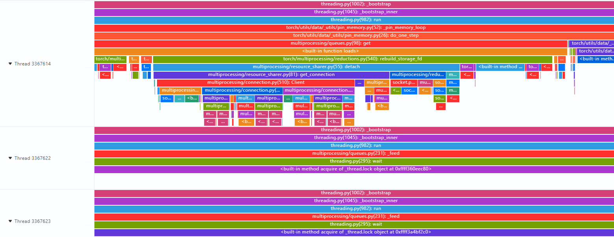

# Pthread线程锁等待

## 【问题背景】

在 Pytorch 大模型分布式训练场景中，[DataLoader、DataPin](https://docs.pytorch.org/docs/2.12/data.html#torch.utils.data.DataLoader) 模块采用多线程生产者 - 消费者模型，使用 pthread 互斥锁（pthread_mutex_t）保护共享队列的并发访问。

训练运行在多卡 NPU 服务器上，数据加载线程池配置为 16 个 worker 线程，主线程负责从队列中取数据喂给 GPU 计算。随着 batch size 增大和数据预处理逻辑复杂化，训练性能出现下降。

## 【问题来源】

训练。

## 【问题现象】

稳定复现。

1. 计算瓶颈表现：

   - NPU 利用率降低，Device 空闲时间增加，等待 Host 下发计算任务
   - 单步训练耗时增加，整体训练吞吐下降

2. 系统层面表现：

   - CPU 利用率整体不高，但存在明显的锁等待特征
   - pidstat -w显示线程上下文切换频率高

3. 应用层面表现：

   - 日志显示数据预处理逻辑实际耗时仅占线程运行时间的 40%，其余为等待时间
   - 增大 worker 线程数至 32 后，性能不仅没有提升反而有恶化

如下图所示：



## 【定位过程】

1. 使用 perf 工具做进程级性能采样

   - 执行 `perf record -g -p <pid> sleep 30` 采集训练进程的性能热点
   - 性能火焰图显示`pthread_mutex_lock`占比较高
   - 锁竞争主要发生在数据队列的 push 和 pop 操作上

2. 使用 strace 工具做了系统调用追踪

   - 执行 `strace -tt -T -e futex -p <pid>` 追踪 `futex` 系统调用
   - 观察到大量 `futex(FUTEX_WAIT)` 调用，单次等待时间超过 10ms

3. MSOSRT 工具采集系统库函数耗时

   OSRT 全称为 OS Runtime Libraries Trace（操作系统运行时库追踪），其核心能力是基于 Linux 系统运行时库，对用户态各类库函数 API 的调用行为进行采集和追踪。

   MSOSRT（MindStudio OSRT）是 MindStudio 推出的 OSRT 工具，它进一步聚焦于性能分析场景：专门采集 Linux C 标准库和 POSIX 线程（pthread）库中的典型高耗时接口，特别是 read、ioctl、pthread_mutex_lock 等可能导致用户进程进入阻塞等待状态的函数，通过统计这些函数的调用耗时与分布情况，帮助开发者快速定位和分析进程阻塞的根本原因。

   仓库地址：[MSOSRT](https://gitcode.com/Ascend/mstt/tree/poc/profiler/msprof_analyze/osrt_trace)

   **使用方法:**

    1. 编译 MSOSRT 工具。

        将代码仓下载到本地，执行``bash build.sh``，生成 `libmsosrt_trace.so` 库文件。

    2. 执行`export LD_PRELOAD=./libmsosrt_trace.so:$LD_PRELOAD`，将libmsosrt_trace.so加入到LD_PRELOAD环境变量中。

    3. 设置检测阈值和导出方式（实时打印或导出文件，二选一）的环境变量：

        ```bash
        # 检测阈值，正整数，只统计超过阈值的库函数，单位：ns，默认为10000000
        export MSOSRT_TRACE_THRESHOLD=10000000
        # 实时打印，正整数，设置为1表示实时打印检测结果，不落盘，默认为0
        export MSOSRT_REALTIME_PRINT=1
        # 导出文件，字符串，设置检测结果导出的目录，默认为当前目录
        export MSOSRT_EXPORT_PATH="./osrt_trace_result"
        ```

    4. 执行训练进程。

    5. 若用户选择实时打印的方式，用户进程执行过程中，会实时打印检测结果，如下所示：

         ```text
         Pid: 2328177, Tid: 2328280, Function: pthread_cond_wait, StartTime: 1725398310787080000, Duration: 3088062410
         Pid: 2328177, Tid: 2328282, Function: pthread_cond_wait, StartTime: 1725398310787170000, Duration: 3087994240
         Pid: 2328177, Tid: 2328480, Function: read, StartTime: 1725398318916180000, Duration: 100509970
         Pid: 2328177, Tid: 2328440, Function: ioctl, StartTime: 1725398319218640000, Duration: 512040720
         Pid: 2328177, Tid: 2328177, Function: free, StartTime: 1725398330504550000, Duration: 56386880
         ```

    6. 若用户选择导出文件的方式，用户进程执行结束后，在`MSOSRT_EXPORT_PATH`路径下会生成检测结果，生成结果文件：`msosrt_trace_{进程号}_{进程名}.csv`，如`msosrt_trace_2328177_python3.csv`，文件内容包含pid、tid、函数名、开始执行时间和耗时等信息，如下所示：

       | Pid | Tid | Function | StartTime(ns) | Duration(ns) |
       | --- | --- | --- | --- | --- |
       | 2328177 | 2328280 | pthread_cond_wait | 1725398310787080000 |3088062410 |
       | 2328177 | 2328282 | pthread_cond_wait | 1725398310787170000 |3087994240 |
       | 2328177 | 2328480 | read | 1725398318916180000 | 100509970 |
       | 2328177 | 2328440 | ioctl | 1725398319218640000 | 512040720 |
       | 2328177 | 2328177 | free | 1725398330504550000 | 56386880 |

   可以从检测结果中观察到，`pthread_cond_wait` 函数占比较高，这是锁等待的主要原因。同时，`read`、`ioctl` 等函数也占比较高，这是数据预处理逻辑耗时的主要原因。根据这些信息，我们可以定位到数据预处理逻辑的性能瓶颈。

## 【问题根因】

1. 锁粒度设计错误：

   - 将整个数据预处理过程（解码、增强、归一化）都放在临界区内执行，而不是仅在队列操作时持有锁。
   - 锁持有时间过长（平均 8ms）导致其他 worker 线程无法入队，形成串行化执行。

2. 锁类型配置不当：

   - 使用默认的 `PTHREAD_MUTEX_TIMED_NP` 类型，在高竞争下性能退化严重。
   - 未启用 `PTHREAD_MUTEX_ADAPTIVE_NP` 自适应锁，导致内核态 futex 等待过多。

## 【定位方法论总结】

针对线程锁等待场景，需要优先执行以下定位步骤：

1. 先使用 `perf` 锁分析能力：

   - 执行 `perf record`，快速确认是否存在锁竞争以及竞争最激烈的锁对象。
   - 生成火焰图观察 `pthread_mutex_lock/pthread_cond_wait` 的 CPU 占比，占比较大时即可判定存在线程锁问题。

2. 使用 `MSOSRT` 工具进行详细分析：

   - 从 `MSOSRT` 检测结果中，定位到 `pthread_cond_wait` 函数占比较高，这是锁等待的主要原因。
   - 分析 `read`、`ioctl` 等函数占比较高，这是数据预处理逻辑耗时的主要原因。

## 【对工具的改进建议】

1. msprof 集成 perf 工具增强：

   - 希望 msprof 集成 perf 工具，使 lock 检测能直接输出锁持有时间统计，而不仅是等待时间。
   - 增加锁竞争的调用栈溯源，直接显示哪个函数路径持有锁时间最长。

2. 新增锁竞争可视化工具：

   - 提供实时的锁等待队列长度监控。
   - 锁持有者与等待者的依赖关系图。
