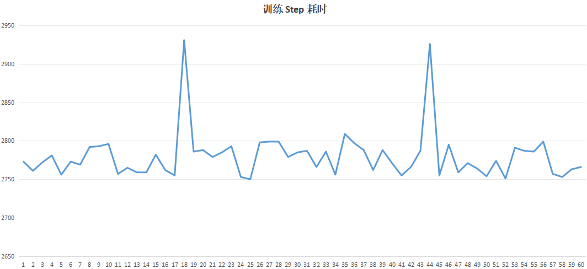
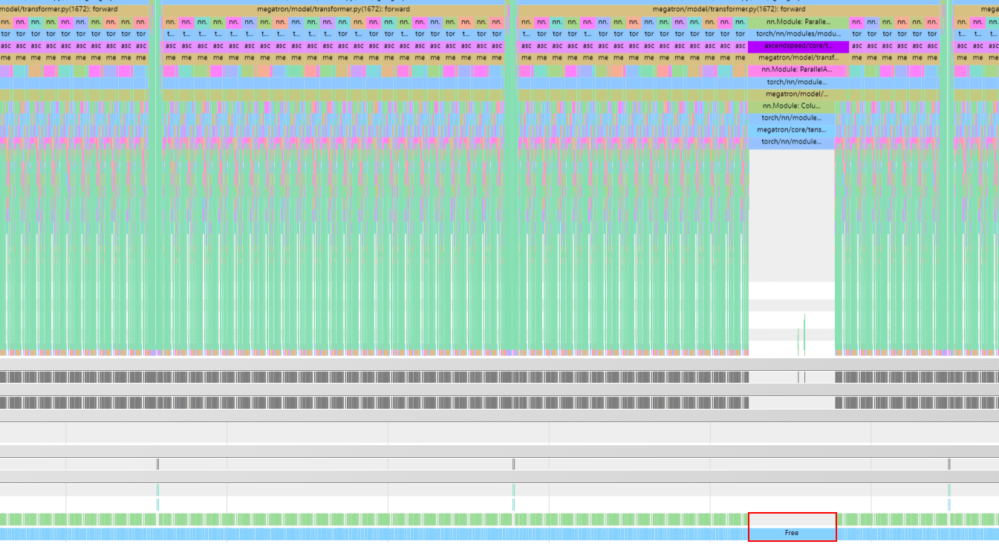
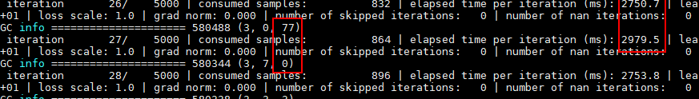

# Python GC回收高耗时

## 【问题背景】

客户在多机分布式环境下进行类 GPT 大模型训练时，观测到训练过程中出现频繁的性能抖动现象。

## 【问题来源】

训练。

## 【问题现象】

稳定复现，通过长跑分析发现，各节点的训练单步（step）耗时在抖动趋势与发生频率上呈现出高度一致性，单步 step 耗时周期性从 2770ms 左右抖动到 2900ms 左右，现象如下：



## 【定位过程】

1. 通过 Torch NPU Profiler 工具，打开 GC 检测选项，对模型性能进行采集与深度分析后发现，在训练耗时出现抖动的异常 step 中，对应的 Timeline 时间线上存在一段显著的 free 耗时。该 free 发生在框架侧的 Python 函数调用栈中，与 NPU 硬件执行及 HCCL 通信算子无直接关联。经过多轮重复采集与交叉验证后可确认，这段耗时异常的 free 均出现在同一个 nn.Module 模块的执行路径中，并在同一时间段内检测到了 GC 事件。

   使用方式如下：

   ```python
   import torch_npu
   experimental_config = torch_npu.profiler._ExperimentalConfig(
       profiler_level=torch_npu.profiler.ProfilerLevel.Level0,
       aic_metrics=torch_npu.profiler.AiCMetrics.AiCoreNone,
       data_simplification=False,
       gc_detect_threshold=1,    # 打开 GC 检测选项, 并设置 GC 检测阈值为 1ms
   )

   # 添加Profiling采集基础配置参数，详细参数介绍可参考下文的参数说明
   with torch_npu.profiler.profile(
       activities=[
           torch_npu.profiler.ProfilerActivity.CPU,
           torch_npu.profiler.ProfilerActivity.NPU
       ],
       schedule=torch_npu.profiler.schedule(wait=0, warmup=0, active=1, repeat=1, skip_first=0),    # 与prof.step()配套使用
       on_trace_ready=torch_npu.profiler.tensorboard_trace_handler("./result"),
       experimental_config=experimental_config) as prof:

       # 启动性能数据采集
       for step in range(steps):    # 训练迭代
           train_one_step()         # 训练函数
           prof.step()              # 与schedule配套使用
   ```

   具体 profiling 性能分析数据如下：

   

   

2. 打印 Python GC 数量

   在模型训练的每个 step 中，打印 Python GC 数量。发现，在异常 step 中，Python GC 数量显著增加，导致训练耗时抖动。

   ```python
   import gc
   print(gc.get_count())
   ```

   实验结果：

   

3. 手动关闭 Python GC

   在模型训练开始前，手动关闭 Python GC。

   ```python
   import gc
   gc.disable()
   ```

   实验结果：抖动现象消失。

4. 调整 Python GC 回收阈值

   在模型训练开始前，调整 Python GC 回收阈值，可参考 [Python GC 回收阈值](https://docs.python.org/3/library/gc.html#gc.set_threshold) 文档。

   ```python
   import gc
   gc.set_threshold(700, 10, 1000)
   ```

   实验结果：抖动仍然存在，但发生频次减少。

## 【问题根因】

Python 作为解释型语言，其底层通过 C 语言实现的解释器逐条解析并执行字节码指令。在 Python 的内存管理机制中，每个对象都维护着一个引用计数器，用于实时追踪对象的被引用状态。当对象的引用计数降至 0 时，表明该对象已不再被任何地方引用，Python 会立即自动回收该对象所占用的内存空间。

然而，当 Python 对象之间形成循环引用（即 A 引用 B、B 又引用 A 的环状依赖关系）时，仅依靠引用计数机制无法将这些对象的计数清零，从而导致这部分内存无法被自动回收。为解决循环引用导致的内存泄漏问题，Python 引入了自动垃圾回收（Garbage Collection, GC）机制。当形成循环引用的对象累积数量超过设定阈值时，Python 会自动触发 GC 回收事件，通过`标记-清除`算法扫描并释放这些存在循环引用关系的无用对象。

需要特别注意的是，GC 垃圾回收操作是一项计算密集型任务，执行耗时较长，且执行过程中会阻塞整个 Python 进程（Stop-The-World 特性）。对于大模型训练这类对性能稳定性要求极高的场景而言，GC 被触发时最典型的外部表现就是：单个训练 Step 耗时突然异常升高，整体训练过程呈现出明显的周期性性能抖动。

## 【定位方法论总结】

针对于该场景需要优先使用 Torch NPU Profiler 工具，获取模型性能数据分析，查看 Timeline 中是否有 GC 事件发生，若存在，需要分析 GC 事件的触发条件、影响范围及耗时，并调整 Python GC 回收阈值，避免 GC 事件频繁触发。

## 【对工具的改进建议】

暂无。
