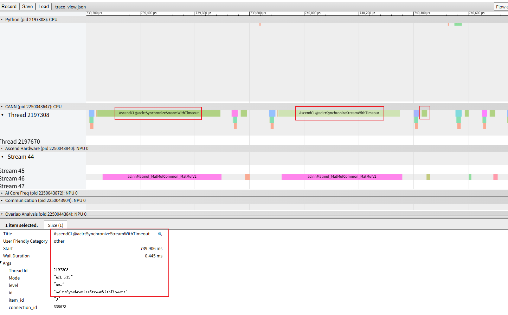
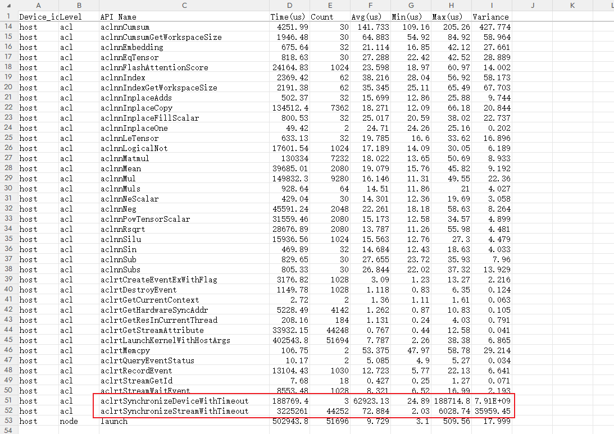
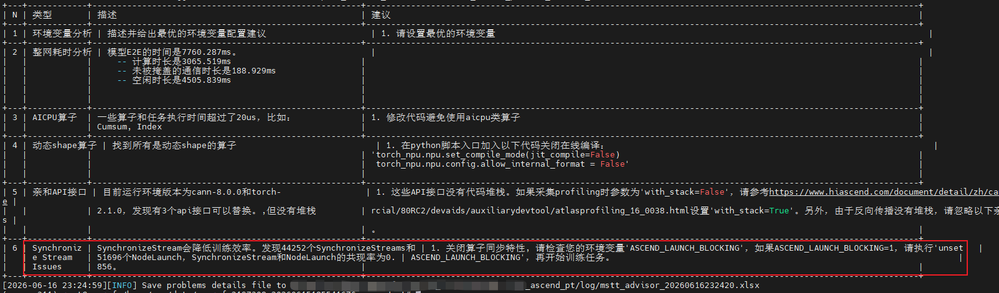

# 一、问题背景

在NPU业务执行过程中，业务执行时间不及预期，通过采集profiling数据确认，发现有较多处的流同步之类的等待行为，急需问题定位和性能优化。

# 二、问题来源

性能调优

# 三、问题现象

通过可视化工具打开msprof.json或trace_view.json文件，发现有较多算子执行，往往伴随aclrtSynchronizeStreamWithTimeout等同步接口。
而在同步接口调用时，则没有任何其他算子下发，即该算子阻塞了其余算子的下发行为，导致NPU整体利用率较低，性能较差。对于整体业务而言，异步下发方式需要长时间下发算子，并使device侧业务处于繁忙执行状态，充分利用硬件资源。但大量的同步接口调用，会将异步行为转变为同步行为，进而导致业务的不连贯性，降低硬件资源利用率。

# 四、定位过程

通过insight打开msprof.json或者trace_view.json。可观察到有大量的类似名为“Synchronize”等同步API。

亦可通过api_statistic.csv交付件看到大量的API调用。

基于上述信息可明确业务中确实存在较多不符合预期的流同步动作。

因此，可基于profiler的stack调用栈功能，额外采集一份带有堆栈信息的数据，从时间角度确认相关同步动作是从哪些位置引入的。

# 五、问题根因

1、大多流同步动作都是人为或业务引入的。因此相关操作优先确认业务代码，从业务逻辑角度对接口调用必要性进行评估和处理。酌情删除不必要的同步接口。

2、除此以外，部分流同步业务可能是环境变量引入，例如

[ASCEND_LAUNCH_BLOCKING](https://gitcode.com/Ascend/pytorch/blob/v2.7.1/docs/zh/environment_variable_reference/ASCEND_LAUNCH_BLOCKING.md)
就会对每个算子进行流同步，用以定位问题。

# 六、定位方法总结

1、通过insight打开msprof.json或者trace_view.json，明确流同步现象。

2、通过api_statistic.csv确认同步接口的整体调用次数和整体耗时，方便评估同步接口对业务的影响情况。

3、利用stack堆栈能力，从时间角度找到对应的流同步接口下发点，快速锁定关键代码段，并从业务角度评估同步接口的合理性。

4、最后可利用advisor等工具对数据进行全面检查，快速排除一些不敏感的环境变量因素。

# 七、对工具的改进建议

暂无
