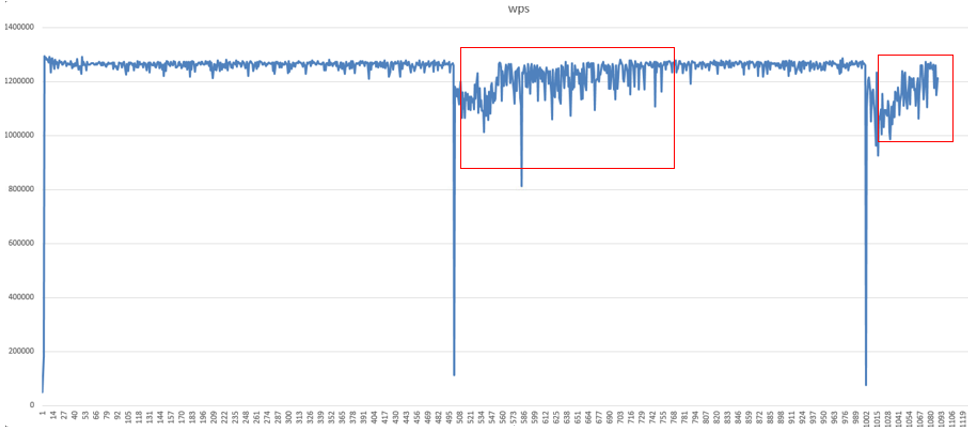
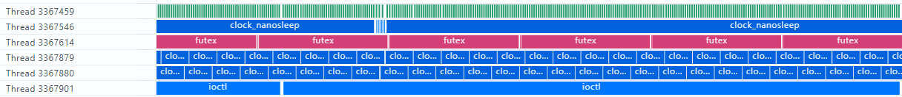

# 系统调用高耗时函数

## 【问题背景】

在大模型分布式训练场景下，某客户 3000 卡 NPU 服务器进行多机多卡模型训练。训练初期性能正常，当迭代到第 500 步左右时，保存 Checkpoint，之后训练 step 耗时突然增加，经过 5-6 个 step 后，耗时逐渐恢复正常。该问题在相同配置的其他集群上也可复现，影响训练效率。

## 【问题来源】

训练。

## 【问题现象】

稳定复现。

具体现象描述：

1. 训练启动后前 500 步性能正常。
2. 第 500 步后，保存 Checkpoint 后，性能下降 20%+，之后缓慢恢复。
3. NPU 利用率从 95% 降至 30%，出现大量 idle 时间。
4. CPU 利用率正常，无明显瓶颈。
5. 网络带宽利用率低，排除通信瓶颈。
6. 通过 PyTorch Profiler 观察到保存 Checkpoint 后，模型算子下发普遍变慢，存在Host 侧的系统调用延迟问题。
7. strace 追踪发现存在大量 futex、ioctl、malloc、free 系统调用，单次调用耗时可达 10-50ms。

如下图所示：



## 【定位过程】

1. 使用 strace 工具做了系统调用追踪。

   - 命令：`strace -T -tt -p <pid> -o trace.log`。
   - 统计发现 futex、ioctl、malloc、free 系统调用占比超过 60%。
   - 单次 futex 调用平均耗时 15ms，最高达 52ms。

2. 使用 PyTorch Profiler 采集 Host 侧的系统调用信息，并与 CANN 层 Profiling 数据进行联合分析。

   使用方式如下：

   ```python
   import torch_npu
   experimental_config = torch_npu.profiler._ExperimentalConfig(
       profiler_level=torch_npu.profiler.ProfilerLevel.Level0,
       aic_metrics=torch_npu.profiler.AiCMetrics.AiCoreNone,
       data_simplification=False,
       host_sys=[torch_npu.profiler.HostSystem.OSRT], # 采集进程级别的系统调用
   )

   # 添加Profiling采集基础配置参数，详细参数介绍可参考下文的参数说明
   with torch_npu.profiler.profile(
       activities=[
           torch_npu.profiler.ProfilerActivity.CPU,
           torch_npu.profiler.ProfilerActivity.NPU
       ],
       schedule=torch_npu.profiler.schedule(wait=0, warmup=0, active=1, repeat=1, skip_first=0),    # 与prof.step()配套使用
       on_trace_ready=torch_npu.profiler.tensorboard_trace_handler("./result"),
       experimental_config=experimental_config) as prof:

       # 启动性能数据采集
       for step in range(steps):    # 训练迭代
           train_one_step()         # 训练函数
           prof.step()              # 与schedule配套使用
   ```

   在 Profiler 交付件 trace_view.json 文件中，OS Runtime API层级数据如下图所示:

   

   字段说明：

   | 字段名 | 字段含义 |
   | --- | --- |
   | Title | 选择某个组件的接口名称，例如本例选择的为pthread_mutex_unlock接口。|
   | Start | 显示界面中时间轴上的时刻点，chrome trace自动对齐，单位ms。|
   | Wall Duration | 表示当前接口调用耗时，单位ms。 |

   os_runtime_statistic_*.csv文件内容格式示例如下：

   | Device_id | Process ID | Thread ID | Name | Time(%) | Time(us) |Count | Avg(us) | Max(us) | Min(us) |
   | --- | --- | --- | --- | --- | --- | --- | --- | --- | --- |
   | host | 387972 | 3880228 | nanosleep |  0.9852596 | 102468352 | 97090 | 1055.3953 | 1217 | 165 |
   | host | 387972 | 3880215 | ioctl | 0.0095065 | 989102 | 54 | 18315.074 | 20066 | 388 |
   | host | 387972 | 3880211 | nanosleep | 0.00138659 | 144098 | 2 | 72049.8 | 143954 | 944 |
   | host | 387972 | 3880212 | ioctl | 0.000701886 | 72995 | 25 | 2919.8 | 8195 | 82 |
   | host | 387972 | 3880213 | malloc | 0.00069822 | 65990 | 13 | 1919.8 | 6595 | 654 |

   字段说明：

    | 字段名 | 字段含义 |
    | --- | --- |
    | Device_id | 设备 ID。Host 侧数据时显示为 host。
    | Process ID | 进程 ID。
    | Thread ID | 线程 ID。
    | Name | API 接口名称。
    | Time | 该接口耗时占比。
    | Time(us) | 该接口总耗时，单位 us。
    | Count | 该接口调用次数。
    | Avg(us) 、Max(us) 、Min(us) | 该接口调用平均耗时、最大耗时、最小耗时，单位us。 |

   可以看到 futex、ioctl、pthread_mutex_unlock 等系统调用耗时较长，需要进行进一步分析。

## 【问题根因】

在 Checkpoint 保存阶段，模型执行 30GB 量级的 D2H 数据拷贝并长期占用 Host 内存，触发内核内存回收与重整机制，导致 malloc、free 系统调用耗时显著增长，最终拖慢训练性能。

Linux 透明大页（THP）通过自动合并小内存页为大页，减少 TLB miss 与页表查找开销，在通用场景下可提升内存访问效率。但其后台合并过程会触发内存回收与重整，可能抢占训练进程 CPU 时间，影响训练性能。

对于大模型集群训练这类大内存使用场景，若系统默认页尺寸已较大，开启透明大页的性能收益将小于后台线程抢占带来的负面影响，建议关闭透明大页功能。

## 【定位方法论总结】

优先使用全链路性能分析工具 msprof 能力，获取 NPU-OS-CPU 三层性能数据，进行端到端耗时分解分析。若确认在系统调用层，使用 OS 内核工具 strace、perf 等进行系统调用追踪和采样分析。

## 【对工具的改进建议】

1. 数据整合与联动分析

   本案例中，系统调用高耗时问题的定位需结合昇腾模型性能数据与 OS 内核数据进行综合分析。当前各工具独立运行，缺乏数据联动与端到端全链路视角，难以支撑复杂问题高效分析。多源数据整合与联动分析是性能诊断工具的未来方向，需在后续建设中重点加强。
