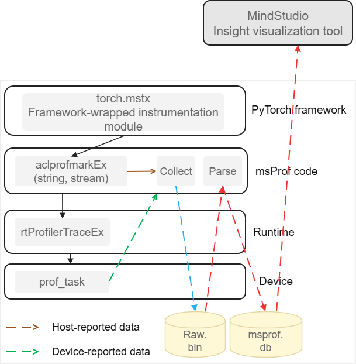

# msPTI Feature Design Specifications

<table>
    <tr>
        <td>SIG:</td>
        <td>mstt-sig</td>
    </tr>
    <tr>
        <td>Target Version:</td>
        <td>MindStudio 26.1.0</td>
    </tr>
    <tr>
        <td>Designer:</td>
        <td>chenhao</td>
    </tr>
    <tr>
        <td>Date:</td>
        <td>2026.01.21</td>
    </tr>
</table>

**Copyright © 2022 openGauss Community**

Your replication, use, modification, and distribution of this document are governed by the Creative Commons (CC) Attribution-ShareAlike 4.0 International Public License (CC BY-SA 4.0).
To help you understand the license, you can visit <https://creativecommons.org/licenses/by-sa/4.0/> for a summary of (not a substitute for) CC BY-SA 4.0.
You can obtain the complete CC BY-SA 4.0 license text at the following URL: <https://creativecommons.org/licenses/by-sa/4.0/legalcode>.

**Change History**

<table>
    <tr>
        <th>Date</th>
        <th>Version</th>
        <th>Description</th>
        <th>Author</th>
        <th>Reviewer</th>
    </tr>
    <tr>
        <td>2026.01.21</td>
        <td>1.0</td>
        <td>Initial draft</td>
        <td>chenhao</td>
        <td></td>
    </tr>
</table>
# 1. Feature Overview

The MindStudio Profiling Tools Interface (msPTI) is a set of profiling APIs provided by MindStudio for Ascend devices. You can use msPTI to build tools for NPU applications to analyze the performance of the applications.
msPTI is a universal API. Profiling tools developed using msPTI APIs can be used in inference and training scenarios of various frameworks.

## 1.1 Scope

msPTI provides the following functions:

- **Tracing**: Collects timestamps and additional information during the execution of CANN applications, including CANN API calls, kernel execution, memory copy, memory allocation/deallocation, communication operations, and user-defined markers. Identify the performance bottlenecks of CANN code by understanding the program running duration. You can use the Activity APIs and Callback APIs to collect tracing information.

- **Profiling**: Collects the NPU performance metrics of one or a group of kernels to support computing and communication analysis.

- **Correlation analysis**: Associates API call dispatch with actual kernel execution through the `correlationId` mechanism, supporting 1:N correlation.

- **External correlation**: Supports cross-layer call chain correlation analysis through the push/pop stack mechanism.

- **Domain-level collection control**: Supports dynamically enabling and disabling marker collection by domain through the Marker Domain mechanism, reducing unnecessary performance overhead.

- **Python Monitor wrappers**: Provides high-level Python interfaces such as `KernelMonitor`, `HcclMonitor`, `CommunicationMonitor`, and `MstxMonitor` for quick integration into Python training/inference scenarios.

## 1.2 Feature Requirement List

Table 1 List of feature requirements

<table>
    <tr>
        <th>Requirement No.</th>
        <th>Requirement</th>
        <th>Feature Description</th>
        <th>Remarks</th>
    </tr>
    <tr>
        <td>1</td>
        <td>Basic Activity API collection capability</td>
        <td>Supports enabling and disabling the collection of multiple Activity Kinds and returns Activity Records to you through the asynchronous buffer mechanism</td>
        <td>Covers Kernel, API, Memory, Memcpy, Memset, Marker, HCCL, and Communication types.</td>
    </tr>
    <tr>
        <td>2</td>
        <td>CANN Runtime API collection capability</td>
        <td>Collects statistics on API calls and time consumption at the runtime level</td>
        <td>Implemented through <code>MSPTI_ACTIVITY_KIND_RUNTIME_API</code>.</td>
    </tr>
    <tr>
        <td>3</td>
        <td>Callback API subscription mechanism</td>
        <td>You can subscribe to callbacks of the Runtime Domain or HCCL Domain and execute custom logic before and after API calls</td>
        <td>Supports subscription at the Domain granularity and Callback ID granularity.</td>
    </tr>
    <tr>
        <td>4</td>
        <td>Correlation analysis capability</td>
        <td>Associates API calls with activity records such as kernel execution and memory operations through the <code>correlationId</code> field</td>
        <td>Supports 1:N correlation.</td>
    </tr>
    <tr>
        <td>5</td>
        <td>External correlation ID mechanism</td>
        <td>Supports cross-layer call chain correlation analysis through push/pop stack semantics</td>
        <td>Supports custom external API types.</td>
    </tr>
    <tr>
        <td>6</td>
        <td>Marker domain-level collection control</td>
        <td>Supports dynamically enabling and disabling the collection of user-defined markers by domain name</td>
        <td>All domains are enabled by default.</td>
    </tr>
    <tr>
        <td>7</td>
        <td>Python Monitor wrapper</td>
        <td>Provides high-level interfaces such as <code>KernelMonitor</code>, <code>HcclMonitor</code>, <code>CommunicationMonitor</code>, and <code>MstxMonitor</code></td>
        <td>Implemented based on C extensions, providing a unified lifecycle such as <code>start</code>/<code>stop</code>/<code>set_buffer_size</code>/<code>flush_all</code>.</td>
    </tr>
    <tr>
        <td>8</td>
        <td>MSTX integration capability</td>
        <td>Supports working with MSTX (MindStudio Tools Extension) to perform custom markers in callbacks</td>
        <td>Supports interfaces such as <code>mstxMarkA</code> and <code>mstxDomainRangeStartA</code>.</td>
    </tr>
    <tr>
        <td>9</td>
        <td>Periodic/manual flush mechanism</td>
        <td>Supports two Activity Buffer flush policies: manual forced flush and periodic flush</td>
        <td><code>msptiActivityFlushAll</code>/<code>msptiActivityFlushPeriod</code>.</td>
    </tr>
    <tr>
        <td>10</td>
        <td>HCCL communication data collection</td>
        <td>Collects HCCL operation records in multi-device communication scenarios, including AllReduce, Broadcast, and AllGather</td>
        <td>Provides information such as bandwidth and communication group names.</td>
    </tr>
</table>

# 2. Requirement Scenario Analysis

## 2.1 Requirement Origin and Benefits

With the widespread application of Ascend NPUs in AI training and inference scenarios, developers need to gain an in-depth understanding of the performance characteristics of NPU applications and locate performance bottlenecks. As a set of profiling APIs provided by MindStudio, msPTI fills the gap left by the lack of unified, open profiling interfaces in the Ascend ecosystem, enabling developers to:

1. **Build custom profiling tools**: Develop performance analysis tools for specific scenarios based on msPTI APIs.
2. **Correlate APIs with kernels**: Establish the association between API calls and actual hardware execution through the `correlationId` mechanism.
3. **Low-overhead collection**: The asynchronous buffer mechanism minimizes the performance impact on service code.
4. **Multi-language support**: Provides both C and Python interfaces to meet the needs of developers at different levels.

## 2.2 Feature Scenario Analysis

### Scenario 1: Training Performance Tuning

**Trigger condition**: When frameworks such as PyTorch and TensorFlow perform distributed training on Ascend NPUs, the execution time of each operator needs to be analyzed.

**Usage**:

- Python scenario: Use `KernelMonitor` and `CommunicationMonitor` to collect computing and communication time consumption.
- C/C++ scenario: Use the Activity APIs to enable the KERNEL and API Kinds, and associate dispatch with execution through `correlationId`.

### Scenario 2: Inference Latency Analysis

**Trigger condition**: When the end-to-end latency of a single request is abnormal in inference services, you need to locate whether the bottleneck occurs in a CANN API call or a kernel execution phase.

**Usage**: Use the Activity APIs to collect Kinds such as RUNTIME_API, API, and KERNEL, and rebuild the call chain by sorting timestamps.

### Scenario 3: Communication Efficiency Analysis

**Trigger condition**: In multi-device distributed training, when communication overhead accounts for an excessively high proportion, you need to analyze the time consumption and bandwidth of communication operations such as AllReduce.

**Usage**: Use the Activity APIs to enable the HCCL Kind, or use the Python `CommunicationMonitor` to collect communication operator data.

### Scenario 4: Custom Marker Monitoring

**Trigger condition**: Developers need to insert custom performance markers on the key paths in the code to precisely measure the time consumption of specific code segments.

**Usage**: Use `MstxMonitor` and `torch_npu.npu.mstx` (Python), or the Callback APIs and `mstxMarkA` (C/C++).

## 2.3 Feature Impact Analysis

### 2.3.1 Hardware Restrictions

| Product Type                                   | Supported |
| ------------------------------------------- | :------: |
| Ascend 950 products                  |    √     |
| Atlas A3 training products/Atlas A3 inference products |    √     |
| Atlas A2 training products/Atlas A2 inference products |    √     |
| Atlas 200I/500 A2 inference products         |    √     |
| Atlas inference products                     |    ×     |
| Atlas training products               |    ×     |

### 2.3.2 Technical Restrictions

| Restriction | Description |
| --- | --- |
| Operating system | Linux (Windows is not supported) |
| Programming language | C/C++/Python |
| Dependencies | CANN >= 8.5.0 |
| Architecture | x86_64 / aarch64 |
| Python version | 3.10 or later is recommended |
| Tool mutual exclusion | msPTI cannot be used together with other performance data collection tools. |

### 2.3.3 Performance Impact

- After the Activity APIs enable a Kind, the collection logic records nanosecond-level timestamps and writes them to the buffer each time an Activity occurs. The performance impact on service code is within 5%.
- The Callback APIs trigger function callbacks on each API call. The impact depends on the complexity of the callback functions.
- The Python Monitor callbacks involve type conversion from the C extension to the Python layer. You are advised to perform only lightweight operations in callbacks.

# 3. Feature/Function Implementation Principles

## 3.1 Objectives

msPTI aims to provide a set of unified, efficient, and easy-to-use profiling APIs, enabling developers to:

1. **Zero-cost integration**: Injects through the `LD_PRELOAD` mechanism to enable collection without modifying service code.
2. **On-demand collection**: Supports fine-grained collection scope control by Activity Kind, Domain, and Callback ID.
3. **Asynchronous low overhead**: Controls the collection overhead at the nanosecond level through the asynchronous Activity Buffer mechanism.
4. **Multi-language coverage**: Provides both C APIs and Python APIs to meet the needs of the system layer and the application layer.

## 3.2 Overall Solution

### Architecture Layers

The overall msPTI architecture is divided into the following three layers:

```text
┌────────────────────────────────────────────────────────┐
│                Python Application Layer                │
│ KernelMonitor / HcclMonitor / MstxMonitor / CommMonitor│
├────────────────────────────────────────────────────────┤
│             Python Extension Binding Layer             │
│       mspti/csrc (C Extension + Adapter + Stub)        │
├────────────────────────────────────────────────────────┤
│                    C/C++ Core Layer                    │
│  ┌──────────┐  ┌──────────┐  ┌───────────────────────┐ │
│  │ Activity │  │ Callback │  │  Common (ThreadPool,  │ │
│  │  Engine  │  │ Manager  │  │  Queue, Logger, ...)  │ │
│  └──────────┘  └──────────┘  └───────────────────────┘ │
│  ┌───────────────────────────────────────────────────┐ │
│  │           CANN / HCCL / MSTX bottom layer         │ │
│  └───────────────────────────────────────────────────┘ │
└────────────────────────────────────────────────────────┘
```

### Core Module Description

| Module | Path | Responsibility |
| --- | --- | --- |
| **Activity Engine** | csrc/activity/ | Collects Activity data, manages buffers, and parses records. Injects into CANN Runtime through `LD_PRELOAD` and instruments collection on key paths. |
| **Callback Manager** | csrc/callback/ | Manages callback subscriptions, distributes Domains, and routes Callback IDs. Maintains the subscriber list and triggers callbacks at the API entry/exit. |
| **Common base library** | csrc/common/ | Provides common infrastructure such as thread pools, queues, logging, and the adapter layer. |
| **C API header files** | csrc/include/ | Exposes C interface declarations, including all enums, structs, and function declarations of the Activity APIs and Callback APIs. |
| **Python extension binding** | mspti/csrc/ | Wraps the C APIs into extension modules callable by Python, handling type conversion and error code mapping. |
| **Python Monitor** | mspti/monitor/ | Provides high-level wrappers such as `KernelMonitor`, `HcclMonitor`, `MstxMonitor`, and `CommunicationMonitor`. |

### Data Flow

```text
User business code
    │
    ├── Calls the CANN API (for example, aclrtLaunchKernel)
    │       │
    │       ├── [Callback API path]
    │       │   ├── msPTI triggers the MSPTI_API_ENTER callback.
    │       │   ├── The user-defined callback function is executed.
    │       │   ├── CANN Runtime performs the actual operation.
    │       │   └── msPTI triggers the MSPTI_API_EXIT callback.
    │       │
    │       └── [Activity API path]
    │           ├── msPTI records the API Activity (correlationId=N).
    │           ├── CANN Runtime dispatches the Kernel to the NPU.
    │           ├── msPTI records the Kernel Activity (correlationId=N).
    │           ├── Data is written to the Activity Buffer.
    │           └── When the buffer is full or Flush is triggered, the CompleteFunc callback is invoked.
    │
    └── Activity Buffer management
        ├── RequestFunc: Requests an empty buffer.
        ├── msPTI fills in data.
        └── CompleteFunc: Returns the full buffer for user consumption.
```



Figure 1: Overall implementation principle of the msPTI solution

# 4. Activity API Detailed Design

## 4.1 Design Rationale

The Activity APIs are the core data collection interfaces of msPTI. The overall design is based on the following principles:

1. **Asynchronous decoupling**: Decouple data collection from consumption through the Activity Buffer mechanism. msPTI is responsible for writing, and you are responsible for consumption.
2. **Typed records**: Each Activity type corresponds to an independent C struct, and runtime type identification is performed through the `kind` field.
3. **Lightweight instrumentation**: Instrument the key paths of CANN Runtime through the `LD_PRELOAD` mechanism to collect timestamps and metadata.
4. **User control**: The buffer is allocated and managed by you. msPTI is only responsible for filling data, and you can control the memory usage.

### Core Working Mechanism

```text
┌──────────┐   RequestFunc   ┌──────────────┐
│User code │ ◄────────────── │    msPTI     │
│(Consumer)│                 │  (Producer)  │
│          │ ──────────────► │              │
│          │   CompleteFunc  │              │
└──────────┘                 └──────────────┘
```

1. When msPTI detects an Activity, it calls the `RequestFunc` registered by you to request an empty buffer.
2. msPTI serializes and writes the Activity Record to the buffer.
3. When the buffer is full or you call `Flush`, msPTI calls `CompleteFunc` to return the full buffer to you.
4. In `CompleteFunc`, you traverse and parse records through `msptiActivityGetNextRecord`.
5. After consumption, you can return the empty buffer to msPTI for reuse through `RequestFunc`.

### Enable/Disable Mechanism

All Activity Kinds are disabled by default. `msptiActivityEnable`/`msptiActivityDisable` control the collection switch by setting internal flag bits. After enabling, msPTI registers instrumentation points on the corresponding paths of CANN Runtime and starts collection.

```text
msptiActivityEnable(KIND_KERNEL)
  → Sets internal flags[MSPTI_ACTIVITY_KIND_KERNEL] to true.
  → Installs collection hooks on the Kernel Launch path.
  → Records msptiActivityKernel each time the Kernel is executed subsequently.
```

## 4.2 Constraints

| Constraint | Description |
| --- | --- |
| Single subscriber | msPTI supports only one Callback subscriber at a time. |
| Buffer lifecycle | After `CompleteFunc` returns, the buffer is released or returned by you. |
| Thread safety | msPTI ensures thread-safe buffer writes internally. You need to ensure the thread safety of the callbacks yourself. |
| Tool mutual exclusion | msPTI cannot be used together with other performance collection tools. |

## 4.3 Detailed Implementation

### 4.3.1 Activity Buffer Lifecycle

```text
┌──────────┐            ┌──────────────┐             ┌──────────┐
│   User   │            │     msPTI    │             │  CANN    │
│   Code   │            │              │             │ Runtime  │
└────┬─────┘            └──────┬───────┘             └────┬─────┘
     │                         │                          │
     │  msptiActivityRegister  │                          │
     │  Callbacks(req, comp)   │                          │
     │ ◄────────────────────── │                          │
     │                         │                          │
     │ Business code execution │                          │
     │ ──────────────────────► │                          │
     │                         │        API call          │
     │                         │ ───────────────────────► │
     │                         │                          │
     │                         │◄─── Kernel dispatch ─────│
     │                         │                          │
     │       RequestFunc       │                          │
     │ ◄────────────────────── │                          │
     │(allocate/return buffers)│                          │
     │ ──────────────────────► │                          │
     │                         │Write the activity record.│
     │                         │                          │
     │      CompleteFunc       │                          │
     │ ◄────────────────────── │                          │
     │  (consume buffer data)  │                          │
     │                         │                          │
     │  msptiActivityGetNext   │                          │
     │Record (traverse records)│                          │
     │                         │                          │
```

### 4.3.2 Record Generation Process

```text
Activity occurs (for example, when Kernel execution completes)
  → msPTI obtains the current timestamp (in ns).
  → Obtains a buffer from the internal buffer pool or requests one through RequestFunc.
  → Constructs an Activity Record of the corresponding type (for example, msptiActivityKernel).
  → Writes the record to the buffer.
  → Checks whether the buffer reaches the threshold.
    ├── Not full: Keeps waiting for subsequent Activity.
    └── Full or Flush triggered: Calls CompleteFunc to return the buffer.
```

### 4.3.3 Correlation Mechanism

Each Activity Record carries the `correlationId` field, which is generated when the API call is dispatched and passed to all Activity Records triggered by the API, such as Kernel and Memcpy records. You can use this field to establish the association between API calls and hardware execution.

```text
API call (correlationId=1001) → Kernel execution (correlationId=1001)
                            → Memcpy execution (correlationId=1001)

API call (correlationId=1002) → Kernel-A (correlationId=1002)
                            → Kernel-B (correlationId=1002)  // 1:N relationship
```

### 4.3.4 External Correlation Mechanism

External correlation IDs implement cross-layer correlation through stack semantics:

```text
Push(INIT, 0x1)   → Enters the initialization phase.
  Push(SUB_INIT, 0x2) → Enters the sub-phase.
  Pop(SUB_INIT)       → Leaves the sub-phase.
Pop(INIT, &id)    → Leaves the initialization phase, id=0x1.
```

Stacks of different `msptiExternalCorrelationKind` values are independent of each other and support nested usage.

## 4.4 Inter-Subsystem Interfaces

### 4.4.1 Activity API Function Interfaces

| Function | Category | Description |
| --- | --- | --- |
| `msptiActivityRegisterCallbacks` | Lifecycle | Registers the buffer Request/Complete callbacks. |
| `msptiActivityEnable` | Collection control | Enables collection of the specified Kind. |
| `msptiActivityDisable` | Collection control | Disables collection of the specified Kind. |
| `msptiActivityIsEnabled` | Collection control | Queries whether the specified Kind is enabled. |
| `msptiActivityGetNextRecord` | Data reading | Traverses the Activity Records in the buffer. |
| `msptiActivityFlushAll` | Buffer flush | Forcefully flushes all buffers. |
| `msptiActivityFlushPeriod` | Buffer flush | Sets the periodic buffer flush interval. |
| `msptiActivityPushExternalCorrelationId` | External correlation | Pushes an external correlation ID. |
| `msptiActivityPopExternalCorrelationId` | External correlation | Pops an external correlation ID. |
| `msptiActivityEnableMarkerDomain` | Domain control | Enables Marker collection of the specified Domain. |
| `msptiActivityDisableMarkerDomain` | Domain control | Disables Marker collection of the specified Domain. |

### 4.4.2 Callback API Function Interfaces

| Function | Category | Description |
| --- | --- | --- |
| `msptiSubscribe` | Lifecycle | Registers a callback subscriber. |
| `msptiUnsubscribe` | Lifecycle | Unregisters a callback subscriber. |
| `msptiEnableCallback` | Collection control | Enables/disables a specific Callback ID. |
| `msptiEnableDomain` | Collection control | Enables/disables an entire Domain. |

### 4.4.3 Python API Interfaces

| Monitor | Method | Description |
| --- | --- | --- |
| `BaseMonitor` | start_monitor() | Starts the underlying collection engine. |
| `BaseMonitor` | stop_monitor() | Stops the underlying collection engine and flushes. |
| `BaseMonitor` | flush_all() | Manually flushes the buffer. |
| `BaseMonitor` | set_buffer_size(size) | Sets the buffer size (MB). |
| `KernelMonitor` | start(cb) | Starts Kernel data collection and registers callbacks. |
| `KernelMonitor` | stop() | Stops Kernel data collection. |
| `HcclMonitor` | start(cb) | Starts HCCL data collection and registers callbacks. |
| `HcclMonitor` | stop() | Stops HCCL data collection. |
| `CommunicationMonitor` | start(cb) | Starts communication operator collection and registers callbacks. |
| `CommunicationMonitor` | stop() | Stops communication operator collection. |
| `MstxMonitor` | start(mark_cb, range_cb) | Starts marker collection and registers instant and range callbacks. |
| `MstxMonitor` | stop() | Stops marker collection. |
| `MstxMonitor` | enable_domain(name) | Enables marker collection of the specified Domain. |
| `MstxMonitor` | disable_domain(name) | Disables marker collection of the specified Domain. |

### 4.4.4 Activity Kind Enumeration

| Kind | Value | Corresponding Data Structure | Description |
| --- | --- | --- | --- |
| `MSPTI_ACTIVITY_KIND_MARKER` | 1 | `msptiActivityMarker` | User-defined markers (instant/range/device markers) |
| `MSPTI_ACTIVITY_KIND_KERNEL` | 2 | `msptiActivityKernel` | NPU Kernel execution records |
| `MSPTI_ACTIVITY_KIND_API` | 3 | `msptiActivityApi` | CANN API call records |
| `MSPTI_ACTIVITY_KIND_HCCL` | 4 | `msptiActivityHccl` | HCCL communication operation records |
| `MSPTI_ACTIVITY_KIND_MEMORY` | 5 | `msptiActivityMemory` | Memory allocation/deallocation records |
| `MSPTI_ACTIVITY_KIND_MEMSET` | 6 | `msptiActivityMemset` | Memory setting records |
| `MSPTI_ACTIVITY_KIND_MEMCPY` | 7 | `msptiActivityMemcpy` | Memory copy records |
| `MSPTI_ACTIVITY_KIND_EXTERNAL_CORRELATION` | 8 | `msptiActivityExternalCorrelation` | External correlation records |
| `MSPTI_ACTIVITY_KIND_COMMUNICATION` | 9 | `msptiActivityCommunication` | Communication operator records |
| `MSPTI_ACTIVITY_KIND_ACL_API` | 10 | — | ACL-level API calls |
| `MSPTI_ACTIVITY_KIND_NODE_API` | 11 | — | Node-level API calls |
| `MSPTI_ACTIVITY_KIND_RUNTIME_API` | 12 | — | Runtime-level API calls |

### 4.4.5 Callback Domain Enumeration

| Domain | Value | Description |
| --- | --- | --- |
| `MSPTI_CB_DOMAIN_RUNTIME` | 1 | Runtime API callback Domain, covering device management, stream management, Kernel Launch, memory operations, and so on |
| `MSPTI_CB_DOMAIN_HCCL` | 2 | HCCL communication callback Domain, covering communication operations such as AllReduce, Broadcast, and AllGather |

## 4.5 Detailed Subsystem Design

### 4.5.1 C/C++ Core Layer

The core modules in the `csrc/` directory are divided by function:

**Activity module (`csrc/activity/`)**:

- Implements the Enable/Disable state management of Activity Kinds.
- Captures Activity events in CANN Runtime through internal instrumentation points.
- Manages the allocation, writing, and flush lifecycle of the Activity Buffer.
- Calls the callback registered by you in `CompleteFunc`.

**Callback module (`csrc/callback/`)**:

- Manages the subscriber list (currently only a single subscriber is supported).
- Maintains the Enable/Disable state of Domains and Callback IDs.
- Calls the user callback function when an enabled Domain or ID is detected at the API entry/exit.
- Passes `msptiCallbackData` containing information such as the function name, parameters, return value, and `correlationId`.

**Common module (`csrc/common/`)**:

- Provides concurrency infrastructure such as thread pools and lock-free queues.
- Provides utility functions such as logging and error code mapping.
- Provides the adapter layer to shield interface differences between different CANN versions.

### 4.5.2 Python Extension Binding Layer

The `mspti/csrc/` directory implements the extension binding from Python to C:

- **Adapter**: The C++ wrapper layer that wraps the C APIs into C++ classes and methods to simplify Python extension calls.
- **Stub**: The dynamic library loader that loads `libmspti.so` through `dlopen` to implement runtime symbol resolution.
- `BufferPool`: The memory pool management of the Activity Buffer to reduce frequent malloc/free calls.

The `mspti/monitor/` directory implements the Monitor classes:

```text
BaseMonitor (abstract base class)
  ├── start_monitor() / stop_monitor() / flush_all() / set_buffer_size()
  │
  ├── KernelMonitor
  │     start(cb) → start_monitor() + register_cb()
  │     stop() → stop_monitor() + unregister_cb()
  │
  ├── HcclMonitor (same pattern as KernelMonitor)
  │
  ├── CommunicationMonitor (same pattern as KernelMonitor)
  │
  └── MstxMonitor
        start(mark_cb, range_cb)
        stop()
        enable_domain(name) / disable_domain(name)
        ├── Maintains the MarkerData dictionary internally.
        └── Automatically assembles Start/End markers into RangeMarkerData.
```

### 4.5.3 MSTX Integration

The integration between msPTI and MSTX (MindStudio Tools Extension) is reflected in the following aspects:

- **Callback + MSTX**: Call `mstxMarkA` in callbacks to perform markers, and enable the Activity APIs to collect MARKER and KERNEL data.
- **Domain control**: Control the collection switch of MSTX Domains through `msptiActivityEnableMarkerDomain`/`msptiActivityDisableMarkerDomain`.

## 4.6 DFX Attribute Design

### 4.6.1 Performance Design

| Operation | Performance Characteristics | Optimization Measures |
| --- | --- | --- |
| Activity Kind enable/disable | O(1), only sets flag bits | Bitmap storage and atomic operations. |
| Activity Record writing | Nanosecond-level memory writing | Pre-allocate buffers to avoid runtime memory allocation. |
| `RequestFunc` callback | Depends on the user implementation | You are advised to use pre-allocated buffers or cache reuse. |
| `CompleteFunc` callback | Depends on the user processing logic | You are advised to only enqueue data and avoid I/O. |
| Callback triggering | Function call overhead | Reduce unnecessary callbacks through two-level Domain/ID filtering. |
| Python Monitor | C-to-Python type conversion overhead | Perform only lightweight operations in callbacks and use consumer threads. |

**Measured conclusion**: In typical training scenarios, when the KERNEL and API Kinds are enabled, the impact on training throughput is within 3% to 5%.

### 4.6.2 Upgrade and Capacity Expansion Design

**Version upgrade**:

- msPTI is released as a run package. During an upgrade, the old version is automatically uninstalled and the new version is installed.
- The version number matches the CANN version. Pay attention to version compatibility (see [Version Notes](https://gitcode.com/Ascend/mspti/releases)).
- The APIs remain backward compatible. New Activity Kinds are added through enumeration extensions without affecting existing interfaces.

**Capacity expansion design**:

- In multi-device scenarios, msPTI runs independently in each process without interfering with each other.
- The Activity Buffer is managed by process, and no cross-process data sharing is involved.
- In multiple processes started by `torchrun`, Python Monitor creates an independent Monitor instance for each process.

### 4.6.3 Exception Handling Design

| Exception Scenario | Handling Method | User Notification |
| --- | --- | --- |
| Insufficient buffer | msPTI requests a new buffer through `RequestFunc`. If you return `NULL`, subsequent records are discarded. | Log warning `buffer request failed`. |
| Device offline | Returns `MSPTI_ERROR_DEVICE_OFFLINE` | You are advised to check the `npu-smi` status |
| `LD_PRELOAD` not set | Returns `MSPTI_ERROR_WITHOUT_LD_PRELOAD` | Prompt `export LD_PRELOAD=...` |
| Duplicate subscription | Returns `MSPTI_ERROR_MULTIPLE_SUBSCRIBERS_NOT_SUPPORTED` | Prompt the single-subscriber limit |
| Invalid parameter | Returns `MSPTI_ERROR_INVALID_PARAMETER` | Print the details of the parameter error |
| Memory allocation failure | Returns `NULL` in the callback, and msPTI discards the record | You are advised to increase the buffer size or reduce concurrency |

### 4.6.4 Resource Management Design

**Memory management**:

- The Activity Buffer is provided and managed by you. msPTI is only responsible for filling data.
- The buffer size is specified by you in `RequestFunc`. 8 to 64 MB is recommended.
- Python Monitor sets the buffer size through `set_buffer_size()`, with an upper limit of 256 MB.

**Thread safety**:

- msPTI ensures the thread safety of buffer writes internally.
- The callback functions registered by you may be called concurrently by multiple threads. You need to ensure the thread safety of the callbacks.
- The Python Monitor callbacks are executed in the C extension thread. Your callbacks should avoid time-consuming operations.

**Resource release**:

- At the end of collection, call `msptiActivityFlushAll` to ensure that all data has been returned.
- The `stop()` method of Python Monitor automatically calls Flush internally.
- The buffer memory is released or reused by you in `CompleteFunc`.

### 4.6.5 Compact Design

**Version trimming**:

- The run package is built separately by architecture (`x86_64`/`aarch64`) and does not contain binaries of irrelevant architectures.
- The Python whl packages are built separately by Python version.
- Third-party dependencies are statically linked to reduce runtime dependencies.

**Function trimming**:

- Activity Kinds are enabled on demand. Disabled Kinds do not incur any collection overhead.
- Callbacks are enabled at the Domain/ID granularity. Disabled APIs do not trigger callbacks.
- Marker Domains can be controlled independently by name. Disabled Domains do not generate marker data.

### 4.6.6 Testability Design

**Unit tests**:

- Based on the Google Test framework, covering all function points of the core modules.
- Simulates CANN Runtime behavior through `MockCpp` to enable testing without a hardware environment.
- Typical test targets: `activity_utest`, `callback_utest`, `mspti_adapter_utest`, and `activity_buffer_pool_utest`.

**System tests**:

- Script-based automated tests that verify the complete process of samples on real NPU hardware.
- Covers scenarios such as single-device training, multi-device communication, and custom markers.

**Coverage**:

- Generates the C++ coverage report through `scripts/generate_coverage_cpp.sh`.
- Supports incremental coverage comparison (`bash scripts/generate_coverage_cpp.sh diff`).

### 4.6.7 Security Design

#### 4.6.7.1 Security Design Confirmation

| Security Attribute | Check Item | Check Item Description | Involved or Not | Satisfied or Not |
| --- | --- | --- | --- | --- |
| Access channel control | Whether any listening port is added | If any listening port is added, update the communication matrix. | No | |
| Access channel control | Whether any process or inter-component communication method is added | If any process or inter-component communication method is added, update the communication matrix. | No | |
| Access channel control | Whether any authentication mode is added | If any authentication mode is added, update the communication matrix and product documentation. | No | |
| Permission control | Whether any file or directory needs to be created | If any file or directory needs to be created, explicitly specify the access permission of the file or directory. | No | |
| Permission control | Whether the account permission meets the principle of least privilege | Assign the minimum permissions to each account in the system. | No | |
| Permission control | Whether user privilege escalation exists | User privilege escalation is prohibited. | No | |
| Undisclosed interface | Whether any GUC parameter is added | If any GUC parameter is added, update the product documentation. | No | |
| Undisclosed interface | Whether any function, view, or system table is added or modified | If any function, view, or system table is added or modified, update the product documentation and consider permission control. | No | |
| Undisclosed interface | Whether any SQL syntax is added | If any SQL syntax is added, update the product documentation and add support for recording audit logs. | No | |
| Undisclosed interface | Whether any internal tool is added | If any internal tool is added, update the product documentation. | No | |
| Undisclosed interface | Whether the script contains commented-out code | Commented-out code is prohibited in interpreted languages such as Shell and Python and must be deleted. | No | |
| Undisclosed interface | Whether there are hidden access methods such as commands, parameters, and ports | Access methods such as commands, parameters, and ports (including but not limited to those for product production, commissioning, and maintenance) that are not used during live network maintenance must be deleted (for example, through compilation macros). | No | |
| Undisclosed interface | Whether the system has hidden backdoors | No undocumented accounts may be reserved in the system. All accounts must be manageable by the system and documented accordingly. | No | |
| Undisclosed interface | Whether any cracking or network sniffing tool is provided | 1. Do not provide any function or tool that can change user passwords or perform exhaustive password search. 2. Debugging tools such as tcpdump, gdb, and strace must not be retained. If retention is required for service needs, strict access control must be enforced. | No | |
| Sensitive data protection | Whether authentication credentials are stored in plaintext | Authentication credentials (such as passwords and private keys) must not be stored in plaintext in the system. | No | |
| Sensitive data protection | Whether keys are hard-coded | Hard-coded passwords and keys are prohibited. | No | |
| Sensitive data protection | Whether sensitive information is printed in plaintext | It is prohibited to print sensitive information (passwords, private keys, and pre-shared keys) in plaintext. | No | |
| Sensitive data protection | Whether passwords are displayed in plaintext in command output | It is prohibited to display passwords in plaintext in command output. | No | |
| Sensitive data protection | Whether default passwords are used | It is prohibited to use the default passwords of third-party and open source software. | No | |
| Sensitive data protection | Whether passwords are stored in plaintext in configuration files | Passwords must not be written into configuration files in plaintext. | No | |
| Sensitive data protection | Whether any insecure encryption algorithm is used | It is prohibited to use proprietary or insecure encryption algorithms known in the industry. | No | |
| Sensitive data protection | Whether sensitive information is transmitted through secure channels | Sensitive information must be transmitted through secure channels on untrusted networks. | No | |
| Sensitive data protection | Whether sensitive information in the memory is destroyed after use | Sensitive information such as passwords and keys in the memory must be cleared immediately after use. | No | |
| Sensitive data protection | Whether random numbers are cryptographically secure | Random numbers used by cryptographic algorithms must be cryptographically secure. | No | |
| Sensitive data protection | Whether there are insecure examples in the documentation | Examples in the documentation must be secure and provide correct guidance for users. | No | |
| Authentication | Whether an authentication mechanism is provided | An authentication mechanism must be provided and enabled by default for the new system. | No | |
| Authentication | Whether authentication is performed on the server | Authentication must be performed on the server. | No | |
| Authentication | Whether the server returns valid information upon an authentication failure | Upon an authentication failure, the server must not return detailed error cause information. | No | |
| External parameter verification | Whether the validity of external input is verified | The use of external input data may lead to behaviors such as infinite loops, buffer overflows, memory out-of-bounds access, and denial of service. | Yes | Yes |
| Third-party component introduction | Whether any new third-party component is introduced | New third-party components must pass security scanning. | No | |

#### 4.6.7.2 Sensitive Data Analysis

##### 1. Sensitive Data List

No sensitive data is involved.

##### 2. Sensitive Operation Check

There are no sensitive operations and no sensitive data is involved.

#### 4.6.7.3 Design Implementation

**Public interface declaration**:

- The official external interfaces of msPTI are the Python APIs. The interfaces exposed by the C APIs are for internal use, and you are advised not to call them directly.
- All external interfaces have been made public in the documentation. Undisclosed source interfaces should not be called externally.

**Permission control**:

- You are advised to install and run with the permissions of a common user. Operations with the root account are prohibited.
- The `umask` value of the execution user should be greater than or equal to 0027.
- Directory permissions of 750 and program file permissions of 550 are recommended.

**External input verification**:

- The validity of the input parameters of all external interfaces is verified.
- When verification fails, `MSPTI_ERROR_INVALID_PARAMETER` is returned for parameters such as buffer pointers, Domain enumerations, and Callback IDs.
- Marker Domain names are string inputs and are checked for `NULL` during verification.

## 4.7 External Interfaces

### 4.7.1 C API Dependencies

- Header files: `${INSTALL_DIR}/include/mspti/` (including `mspti.h`, `mspti_activity.h`, `mspti_callback.h`, `mspti_cbid.h`, and `mspti_result.h`)
- Library file: `${INSTALL_DIR}/lib64/libmspti.so`
- Compilation dependencies: C++14 and CMake 3.14 or later
- Runtime dependencies: CANN >= 8.5.0, libpthread, and libdl

### 4.7.2 Python API Dependencies

- Installation method: `pip install mspti` (integrated into the CANN whl package)
- Runtime dependencies: Python 3.8 or later and the CANN environment
- Optional dependencies: PyTorch and TorchNPU (required by the Python Monitor samples)

### 4.7.3 Integration Methods

**C/C++ integration**:

```bash
# Compile
g++ -std=c++14 -I${ASCEND_HOME_PATH}/include -c your_code.cpp
# Link
g++ -o your_app your_code.o -L${ASCEND_HOME_PATH}/lib64 -lmspti
# Run
export LD_PRELOAD=${ASCEND_HOME_PATH}/lib64/libmspti.so
./your_app
```

**Python integration**:

```bash
export LD_PRELOAD=${ASCEND_HOME_PATH}/lib64/libmspti.so
python your_script.py
```

# 5. Data Structure Design

## 5.1 Activity Record Structures

All Activity Records start with the basic struct `msptiActivity`, which contains the `kind` field to identify the type. You can convert the pointer to the corresponding specific struct based on the `kind` value.

### 5.1.1 Basic Structure

```c
typedef struct {
    msptiActivityKind kind;  // Activity type, used for runtime type identification
} msptiActivity;
```

### 5.1.2 ActivityKernel (Kernel Execution Record)

Records the launch, execution, and completion time of kernels on the NPU.

```c
typedef struct {
    msptiActivityKind kind;                    // Fixed to MSPTI_ACTIVITY_KIND_KERNEL
    uint64_t start;                            // Kernel start timestamp (ns)
    uint64_t end;                              // Kernel end timestamp (ns)
    struct { uint32_t deviceId; uint32_t streamId; } ds;  // Device and stream identifiers
    uint64_t correlationId;                    // Correlation ID, used to correlate API calls
    const char *type;                          // Kernel type (for example, "AI_CORE")
    const char *name;                          // Kernel name (for example, "MatMul_xxxx")
} msptiActivityKernel;
```

**Field description**:

- `start`/`end`: NPU hardware timestamps with nanosecond precision.
- `ds.deviceId`: The NPU device ID on which the kernel is executed.
- `ds.streamId`: The stream ID on which the kernel is executed.
- `correlationId`: Shares the same ID value as the API call that dispatched the kernel, used for correlation analysis.
- `type`: Identifies the computing unit type on which the kernel is executed (such as AI Core and AI CPU).
- `name`: The full name of the kernel, including the operator type and parameter information.

### 5.1.3 ActivityApi (API Call Record)

Records the call time of CANN Runtime APIs.

```c
typedef struct {
    msptiActivityKind kind;                    // Fixed to MSPTI_ACTIVITY_KIND_API
    uint64_t start;                            // API start timestamp (ns)
    uint64_t end;                              // API end timestamp (ns)
    struct { uint32_t processId; uint32_t threadId; } pt;  // Process and thread identifiers
    uint64_t correlationId;                    // Correlation ID
    const char *name;                          // API name (for example, "aclrtLaunchKernel")
} msptiActivityApi;
```

**Field description**:

- `pt.processId`: The ID of the process that calls the API.
- `pt.threadId`: The ID of the thread that calls the API.
- `correlationId`: The correlation ID generated by the API call and passed to the kernels and memory operations triggered by the API.
- `name`: The API function name, which can be directly mapped to the CANN Runtime API.

### 5.1.4 ActivityMemory (Memory Operation Record)

Records memory allocation and deallocation operations.

```c
typedef struct {
    msptiActivityKind kind;                    // Fixed to MSPTI_ACTIVITY_KIND_MEMORY
    msptiActivityMemoryOperationType memoryOperationType;  // Operation type: ALLOCATION / RELEASE
    msptiActivityMemoryKind memoryKind;        // Memory type: DEVICE
    uint64_t correlationId;                    // Correlation ID
    uint64_t start;                            // Operation start timestamp (ns)
    uint64_t end;                              // Operation end timestamp (ns)
    uint64_t address;                          // Memory address
    uint64_t bytes;                            // Memory size (bytes)
    uint32_t processId;                        // Process ID
    uint32_t deviceId;                         // Device ID
    uint32_t streamId;                         // Stream ID
} msptiActivityMemory;
```

### 5.1.5 ActivityMemcpy (Memory Copy Record)

Records memory copy operations between the host and the device.

```c
typedef struct {
    msptiActivityKind kind;                    // Fixed to MSPTI_ACTIVITY_KIND_MEMCPY
    msptiActivityMemcpyKind copyKind;          // Copy direction: HTOD / DTOH / DTOD, and so on
    uint64_t bytes;                            // Number of copied bytes
    uint64_t start;                            // Start timestamp (ns)
    uint64_t end;                              // End timestamp (ns)
    uint32_t deviceId;                         // Device ID
    uint32_t streamId;                         // Stream ID
    uint64_t correlationId;                    // Correlation ID
    uint8_t isAsync;                           // Whether the copy is asynchronous
} msptiActivityMemcpy;
```

**copyKind enumeration**:

- `MSPTI_ACTIVITY_MEMCPY_KIND_HTOH`: Host to host
- `MSPTI_ACTIVITY_MEMCPY_KIND_HTOD`: Host to device
- `MSPTI_ACTIVITY_MEMCPY_KIND_DTOH`: Device to host
- `MSPTI_ACTIVITY_MEMCPY_KIND_DTOD`: Device to device

### 5.1.6 ActivityMemset (Memory Setting Record)

```c
typedef struct {
    msptiActivityKind kind;                    // Fixed to MSPTI_ACTIVITY_KIND_MEMSET
    uint32_t value;                            // Value to set
    uint64_t bytes;                            // Number of bytes to set
    uint64_t start;                            // Start timestamp (ns)
    uint64_t end;                              // End timestamp (ns)
    uint32_t deviceId;                         // Device ID
    uint32_t streamId;                         // Stream ID
    uint64_t correlationId;                    // Correlation ID
    uint8_t isAsync;                           // Whether the operation is asynchronous
} msptiActivityMemset;
```

### 5.1.7 ActivityMarker (User Marker Record)

Records user-defined markers inserted through the MSTX APIs, supporting instant markers and range markers.

```c
typedef struct {
    msptiActivityKind kind;                    // Fixed to MSPTI_ACTIVITY_KIND_MARKER
    msptiActivityFlag flag;                    // Marker type flag
    msptiActivitySourceKind sourceKind;        // Data source (Host/Device)
    uint64_t timestamp;                        // Timestamp (ns)
    uint64_t id;                               // Marker ID
    msptiObjectId objectId;                    // Object identifier (process/thread/device/stream)
    const char *name;                          // Marker name
    const char *domain;                        // Domain name
} msptiActivityMarker;
```

**flag enumeration**:

- `MSPTI_ACTIVITY_FLAG_MARKER_INSTANTANEOUS`: A pure host instant marker
- `MSPTI_ACTIVITY_FLAG_MARKER_START`: A host range start marker
- `MSPTI_ACTIVITY_FLAG_MARKER_END`: A host range end marker
- `MSPTI_ACTIVITY_FLAG_MARKER_INSTANTANEOUS_WITH_DEVICE`: An instant marker with the device
- `MSPTI_ACTIVITY_FLAG_MARKER_START_WITH_DEVICE`: A range start with the device
- `MSPTI_ACTIVITY_FLAG_MARKER_END_WITH_DEVICE`: A range end with the device

### 5.1.8 ActivityHccl (HCCL Communication Record)

Records the execution information of HCCL collective communication operations.

```c
typedef struct {
    msptiActivityKind kind;                    // Fixed to MSPTI_ACTIVITY_KIND_HCCL
    uint64_t start;                            // Start timestamp (ns)
    uint64_t end;                              // End timestamp (ns)
    struct { uint32_t deviceId; uint32_t streamId; } ds;  // Device and stream identifiers
    double bandWidth;                          // Communication bandwidth (GB/s)
    const char *name;                          // Communication operator name (for example, "AllReduce")
    const char *commName;                      // Communication group name
} msptiActivityHccl;
```

### 5.1.9 ActivityCommunication (Communication Operator Record)

Records detailed information of communication operators, including the data type and algorithm type.

```c
typedef struct {
    msptiActivityKind kind;                    // Fixed to MSPTI_ACTIVITY_KIND_COMMUNICATION
    msptiCommunicationDataType dataType;       // Communication data type
    uint64_t count;                            // Data count
    struct { uint32_t deviceId; uint32_t streamId; } ds;
    uint64_t start;                            // Start timestamp (ns)
    uint64_t end;                              // End timestamp (ns)
    const char *algType;                       // Communication algorithm type
    const char *name;                          // Operator name
    const char *commName;                      // Communication group name
    uint64_t correlationId;                    // Correlation ID
} msptiActivityCommunication;
```

### 5.1.10 ActivityExternalCorrelation (External Correlation Record)

Records the mapping between the external correlation ID and the internal `correlationId`.

```c
typedef struct {
    msptiActivityKind kind;                    // Fixed to MSPTI_ACTIVITY_KIND_EXTERNAL_CORRELATION
    msptiExternalCorrelationKind externalKind; // External API type
    uint64_t externalId;                       // External correlation ID (user-defined)
    uint64_t correlationId;                    // Internal correlation ID (generated by msPTI)
} msptiActivityExternalCorrelation;
```

## 5.2 Callback Data Structures

### 5.2.1 `msptiCallbackData`

```c
typedef struct {
    msptiApiCallbackSite callbackSite;         // Callback site (ENTER / EXIT)
    const char *functionName;                  // API function name
    const void *functionParams;                // API function parameter pointer
    const void *functionReturnValue;           // Return value pointer (valid only for EXIT)
    const char *symbolName;                    // Kernel symbol name (valid only for Launch types)
    uint64_t correlationId;                    // Correlation ID
    uint64_t reserved1;                        // Reserved
    uint64_t reserved2;                        // Reserved
    uint64_t *correlationData;                 // Data shared between ENTER and EXIT
} msptiCallbackData;
```

### 5.2.2 `msptiObjectId`

```c
typedef union {
    struct { uint32_t processId; uint32_t threadId; } pt;  // Process/thread identifiers
    struct { uint32_t deviceId; uint32_t streamId; } ds;    // Device/stream identifiers
} msptiObjectId;
```

## 5.3 Summary of Enumeration Definitions

### `msptiResult` (Error Codes)

| Enumeration Value | Value | Description |
| --- | --- | --- |
| MSPTI_SUCCESS | 0 | Success |
| MSPTI_ERROR_INVALID_PARAMETER | 1 | Invalid parameter |
| MSPTI_ERROR_MULTIPLE_SUBSCRIBERS_NOT_SUPPORTED | 2 | Multiple subscribers are not allowed |
| MSPTI_ERROR_MAX_LIMIT_REACHED | 3 | The maximum limit has been reached |
| MSPTI_ERROR_DEVICE_OFFLINE | 4 | The device is offline |
| MSPTI_ERROR_QUEUE_EMPTY | 5 | The queue is empty |
| MSPTI_ERROR_WITHOUT_LD_PRELOAD | 6 | `LD_PRELOAD` is not set |
| MSPTI_ERROR_INNER | 999 | Internal error |

### Callback ID

**Runtime Domain Callback ID**: Defined in the `msptiCallbackIdRuntime` enumeration, with values ranging from 1 to 36, covering device management (1-3), context management (4-6), stream management (7-9), kernel launch (10-14), memory management (15-21), data copy (22-26), and memory setting (27-28).

**HCCL Domain Callback ID**: Defined in the `msptiCallbackIdHccl` enumeration, with values ranging from 1 to 13, covering AllReduce (1), Broadcast (2), AllGather (3), ReduceScatter (4), Reduce (5), AllToAll (6-7), Barrier (8), Scatter (9), and Send/Recv (10-12).

### Activity Flag

The six Marker flag bits are combined through bit fields. The first three are pure host markers, and the last three are markers with the device.

### Communication Data Type

Seventeen communication data types are supported, covering `INT8/16/32/64/128`, `UINT8/16/32/64`, `FP16/32/64`, `BFP16`, `HIF8`, `FP8E4M3/FP8E5M2/FP8E8M0`, and so on.

## 5.4 Python Data Type Mapping

The Python APIs wrap C structs into Python data classes:

| C Struct | Python Class | Field Mapping |
| --- | --- | --- |
| `msptiActivityKernel` | `KernelData` | kind, start, end, device_id, stream_id, correlation_id, type, name |
| `msptiActivityHccl` | `HcclData` | kind, start, end, device_id, stream_id, bandwidth, name, comm_name |
| `msptiActivityCommunication` | `CommunicationData` | kind, data_type, count, device_id, stream_id, start, end, alg_type, name, comm_name, correlation_id |
| `msptiActivityMarker` | `MarkerData` | kind, flag, source_kind, timestamp, id, object_id, name, domain |
| (Combined from Start+End) | `RangeMarkerData` | kind, source_kind, id, object_id, name, domain, start, end |
| `msptiObjectId` | `MsptiObjectId` | process_id, thread_id, device_id, stream_id |
