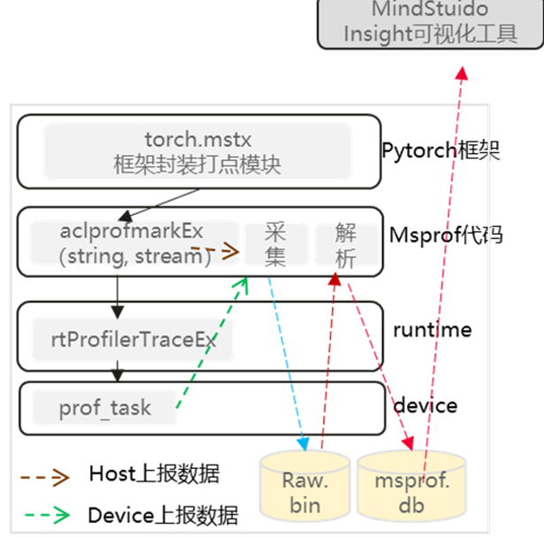

# msPTI特性设计说明书

<table>
    <tr>
        <td>所属SIG组:</td>
        <td>mstt-sig</td>
    </tr>
    <tr>
        <td>落入版本:</td>
        <td>MindStudio 26.0.0</td>
    </tr>
    <tr>
        <td>设计人员:</td>
        <td>chenhao</td>
    </tr>
    <tr>
        <td>日期:</td>
        <td>2026.01.21</td>
    </tr>
</table>

**Copyright © 2022 openGauss Community**

您对&quot;本文档&quot;的复制，使用，修改及分发受知识共享（Creative Commons）署名—相同方式共享4.0国际公共许可协议（以下简称&quot;CC BY-SA 4.0&quot;）的约束。
为了方便用户理解，您可以通过访问<https://creativecommons.org/licenses/by-sa/4.0/>了解CC BY-SA 4.0的概要 （但不是替代）。
CC BY-SA 4.0的完整协议内容您可以访问如下网址获取：<https://creativecommons.org/licenses/by-sa/4.0/legalcode>。

**改版记录**

<table>
    <tr>
        <th>日期</th>
        <th>修订版本</th>
        <th>修订描述</th>
        <th>作者</th>
        <th>审核</th>
    </tr>
    <tr>
        <td>2026.01.21</td>
        <td>1.0</td>
        <td>初稿完成</td>
        <td>chenhao</td>
        <td></td>
    </tr>
</table>

<!-- TOC -->
- [msPTI特性设计说明书](#mspti特性设计说明书)
- [1.特性概述](#1特性概述)
  - [1.1范围](#11范围)
  - [1.2特性需求列表](#12特性需求列表)
- [2.需求场景分析](#2需求场景分析)
  - [2.1特性需求来源与价值概述](#21特性需求来源与价值概述)
  - [2.2特性场景分析](#22特性场景分析)
    - [场景一：训练性能调优](#场景一训练性能调优)
    - [场景二：推理延迟分析](#场景二推理延迟分析)
    - [场景三：通信效率分析](#场景三通信效率分析)
    - [场景四：自定义打点监控](#场景四自定义打点监控)
  - [2.3特性影响分析](#23特性影响分析)
    - [2.3.1硬件限制](#231硬件限制)
    - [2.3.2技术限制](#232技术限制)
    - [2.3.3性能影响](#233性能影响)
- [3.特性/功能实现原理](#3特性功能实现原理)
  - [3.1目标](#31目标)
  - [3.2总体方案](#32总体方案)
    - [架构分层](#架构分层)
    - [核心模块说明](#核心模块说明)
    - [数据流](#数据流)
- [4. Activity API 详细设计](#4-activity-api-详细设计)
  - [4.1设计思路](#41设计思路)
    - [核心工作机制](#核心工作机制)
    - [Enable/Disable机制](#enabledisable机制)
  - [4.2约束条件](#42约束条件)
  - [4.3详细实现](#43详细实现)
    - [4.3.1 Activity Buffer生命周期](#431-activity-buffer生命周期)
    - [4.3.2 记录生成流程](#432-记录生成流程)
    - [4.3.3 Correlation机制](#433-correlation机制)
    - [4.3.4 外部关联机制](#434-外部关联机制)
  - [4.4子系统间接口](#44子系统间接口)
    - [4.4.1 Activity API 函数接口](#441-activity-api-函数接口)
    - [4.4.2 Callback API 函数接口](#442-callback-api-函数接口)
    - [4.4.3 Python API 接口](#443-python-api-接口)
    - [4.4.4 Activity Kind 枚举](#444-activity-kind-枚举)
    - [4.4.5 Callback Domain 枚举](#445-callback-domain-枚举)
  - [4.5子系统详细设计](#45子系统详细设计)
    - [4.5.1 C/C++核心层](#451-cc核心层)
    - [4.5.2 Python扩展绑定层](#452-python扩展绑定层)
    - [4.5.3 MSTX集成](#453-mstx集成)
  - [4.6DFX属性设计](#46dfx属性设计)
    - [4.6.1性能设计](#461性能设计)
    - [4.6.2升级与扩容设计](#462升级与扩容设计)
    - [4.6.3异常处理设计](#463异常处理设计)
    - [4.6.4资源管理相关设计](#464资源管理相关设计)
    - [4.6.5小型化设计](#465小型化设计)
    - [4.6.6 可测试性设计](#466-可测试性设计)
    - [4.6.7 安全设计](#467-安全设计)
      - [4.6.7.1 安全设计确认](#4671-安全设计确认)
      - [4.6.7.2 敏感数据分析](#4672-敏感数据分析)
        - [1. 敏感数据清单](#1-敏感数据清单)
        - [2. 敏感操作检查](#2-敏感操作检查)
      - [4.6.7.3 设计实现](#4673-设计实现)
  - [4.7系统外部接口](#47系统外部接口)
    - [4.7.1 C API依赖](#471-c-api依赖)
    - [4.7.2 Python API依赖](#472-python-api依赖)
    - [4.7.3 集成方式](#473-集成方式)
- [5.数据结构设计](#5数据结构设计)
  - [5.1 Activity Record 结构体](#51-activity-record-结构体)
    - [5.1.1 基础结构](#511-基础结构)
    - [5.1.2 ActivityKernel（Kernel执行记录）](#512-activitykernelkernel执行记录)
    - [5.1.3 ActivityApi（API调用记录）](#513-activityapiapi调用记录)
    - [5.1.4 ActivityMemory（内存操作记录）](#514-activitymemory内存操作记录)
    - [5.1.5 ActivityMemcpy（内存拷贝记录）](#515-activitymemcpy内存拷贝记录)
    - [5.1.6 ActivityMemset（内存设置记录）](#516-activitymemset内存设置记录)
    - [5.1.7 ActivityMarker（用户打点记录）](#517-activitymarker用户打点记录)
    - [5.1.8 ActivityHccl（HCCL通信记录）](#518-activityhcclhccl通信记录)
    - [5.1.9 ActivityCommunication（通信算子记录）](#519-activitycommunication通信算子记录)
    - [5.1.10 ActivityExternalCorrelation（外部关联记录）](#5110-activityexternalcorrelation外部关联记录)
  - [5.2 Callback 数据结构](#52-callback-数据结构)
    - [5.2.1 msptiCallbackData](#521-mspticallbackdata)
    - [5.2.2 msptiObjectId](#522-msptiobjectid)
  - [5.3 枚举定义汇总](#53-枚举定义汇总)
    - [msptiResult（错误码）](#msptiresult错误码)
    - [Callback ID](#callback-id)
    - [Activity Flag](#activity-flag)
    - [Communication Data Type](#communication-data-type)
  - [5.4 Python数据类型映射](#54-python数据类型映射)
<!-- TOC -->

# 1.特性概述

msPTI工具（MindStudio Profiling Tools Interface）是MindStudio针对Ascend设备提出的一套Profiling API，用户可以通过msPTI构建针对NPU应用程序的工具，用于分析应用程序的性能。
msPTI为通用场景接口，使用msPTI API开发的Profiling分析工具可以在各种框架的推理训练场景生效。

## 1.1范围

msPTI主要包括以下功能：

- **Tracing（跟踪）**：采集CANN应用程序执行过程中的时间戳和附加信息，涵盖CANN API调用、Kernel执行、内存拷贝、内存分配/释放、通信操作、用户自定义打点等。通过了解程序运行耗时，识别CANN代码的性能瓶颈。可以使用Activity API和Callback API收集Tracing信息。

- **Profiling（性能分析）**：单独收集一个或一组Kernel的NPU性能指标，支撑计算与通信分析。

- **关联分析**：通过correlationId机制，将API调用下发与Kernel实际执行进行关联，支持1:N的关联关系。

- **外部关联**：通过Push/Pop栈机制，支持跨层级的调用链路关联分析。

- **域级采集控制**：通过Marker Domain机制，支持按域动态启停打点采集，减小不必要的性能开销。

- **Python Monitor封装**：提供KernelMonitor、HcclMonitor、CommunicationMonitor、MstxMonitor等高层Python接口，快速接入Python训练/推理场景。

## 1.2特性需求列表

表1：特性需求列表

<table>
    <tr>
        <th>需求编号</th>
        <th>需求名称</th>
        <th>特性描述</th>
        <th>备注</th>
    </tr>
    <tr>
        <td>1</td>
        <td>Activity API基础采集能力</td>
        <td>支持使能/禁用多种Activity Kind的采集，通过异步缓冲区机制将Activity Record返回给用户</td>
        <td>覆盖Kernel、API、Memory、Memcpy、Memset、Marker、HCCL、Communication等类型</td>
    </tr>
    <tr>
        <td>2</td>
        <td>CANN Runtime API接口采集能力</td>
        <td>统计Runtime层级的接口调用及耗时统计能力</td>
        <td>通过MSPTI_ACTIVITY_KIND_RUNTIME_API实现</td>
    </tr>
    <tr>
        <td>3</td>
        <td>Callback API订阅机制</td>
        <td>用户可订阅Runtime Domain或HCCL Domain的回调，在API调用前后执行自定义逻辑</td>
        <td>支持Domain粒度和Callback ID粒度订阅</td>
    </tr>
    <tr>
        <td>4</td>
        <td>关联分析能力</td>
        <td>通过correlationId字段将API调用与Kernel执行、内存操作等活动记录关联</td>
        <td>支持1:N关联关系</td>
    </tr>
    <tr>
        <td>5</td>
        <td>外部关联ID机制</td>
        <td>通过Push/Pop栈语义，支持跨层级的调用链路关联分析</td>
        <td>支持自定义外部API类型</td>
    </tr>
    <tr>
        <td>6</td>
        <td>Marker域级采集控制</td>
        <td>支持按域名称动态启停用户自定义打点的采集</td>
        <td>默认所有域为开启状态</td>
    </tr>
    <tr>
        <td>7</td>
        <td>Python Monitor封装</td>
        <td>提供KernelMonitor、HcclMonitor、CommunicationMonitor、MstxMonitor等高层接口</td>
        <td>基于C扩展实现，提供start/stop/set_buffer_size/flush_all等统一生命周期</td>
    </tr>
    <tr>
        <td>8</td>
        <td>MSTX集成能力</td>
        <td>支持与MSTX（MindStudio Tools Extension）配合使用，在Callback中进行自定义打点</td>
        <td>支持mstxMarkA、mstxDomainRangeStartA等接口</td>
    </tr>
    <tr>
        <td>9</td>
        <td>周期性/手动Flush机制</td>
        <td>支持手动强制刷新和周期性刷新两种Activity Buffer刷新策略</td>
        <td>msptiActivityFlushAll / msptiActivityFlushPeriod</td>
    </tr>
    <tr>
        <td>10</td>
        <td>HCCL通信数据采集</td>
        <td>采集多卡通信场景下的HCCL操作记录，包括AllReduce、Broadcast、AllGather等</td>
        <td>提供带宽、通信组名等信息</td>
    </tr>
</table>

# 2.需求场景分析

## 2.1特性需求来源与价值概述

随着昇腾NPU在AI训练和推理场景中的广泛应用，开发者需要深入了解NPU应用的性能特征，定位性能瓶颈。msPTI作为MindStudio提供的Profiling API集合，填补了昇腾生态中缺少统一、开放的Profiling接口的空白，使开发者能够：

1. **构建自定义Profiling工具**：基于msPTI API开发针对特定场景的性能分析工具。
2. **关联分析API与Kernel**：通过correlationId机制建立API调用与实际硬件执行之间的关联。
3. **低开销采集**：异步缓冲区机制确保对业务代码的性能影响最小化。
4. **多语言支持**：同时提供C/Python两套接口，满足不同层级开发者的需求。

## 2.2特性场景分析

### 场景一：训练性能调优

**触发条件**：PyTorch/TensorFlow等框架在昇腾NPU上进行分布式训练时，需要分析各算子的执行耗时。

**使用方式**：

- Python场景：使用KernelMonitor + CommunicationMonitor采集计算和通信耗时。
- C/C++场景：使用Activity API使能KERNEL和API Kind，通过correlationId关联下发与执行。

### 场景二：推理延迟分析

**触发条件**：推理业务中单个请求的端到端延迟异常，需要定位瓶颈出现在哪个CANN API调用或Kernel执行阶段。

**使用方式**：使用Activity API采集RUNTIME_API、API、KERNEL等Kind，通过时间戳排序重建调用链。

### 场景三：通信效率分析

**触发条件**：多卡分布式训练中，通信开销占比过高，需要分析AllReduce等通信操作的耗时和带宽。

**使用方式**：使用Activity API使能HCCL Kind，或使用Python CommunicationMonitor采集通信算子数据。

### 场景四：自定义打点监控

**触发条件**：开发者需要在代码中的关键路径上插入自定义性能标记，精确测量特定代码段的耗时。

**使用方式**：使用MstxMonitor + torch_npu.npu.mstx（Python），或Callback API + mstxMarkA（C/C++）。

## 2.3特性影响分析

### 2.3.1硬件限制

| 产品类型                                    | 是否支持 |
| ------------------------------------------- | :------: |
| Ascend 950 系列产品                   |    √     |
| Atlas A3 训练系列产品/Atlas A3 推理系列产品 |    √     |
| Atlas A2 训练系列产品/Atlas A2 推理系列产品 |    √     |
| Atlas 200I/500 A2 推理产品                  |    √     |
| Atlas 推理系列产品                          |    ×     |
| Atlas 训练系列产品                          |    ×     |

### 2.3.2技术限制

| 限制项 | 说明 |
| --- | --- |
| 操作系统 | Linux（不支持Windows） |
| 编程语言 | C / C++ / Python |
| 依赖环境 | CANN >= 8.5.0 |
| 架构 | x86_64 / aarch64 |
| Python版本 | 推荐3.10+ |
| 工具互斥 | msPTI不可与其他性能数据采集工具同时使用 |

### 2.3.3性能影响

- Activity API使能Kind后，采集逻辑在每个Activity发生时进行纳秒级的时间戳记录和缓冲区写入，对业务代码的性能影响在5%以内。
- Callback API在每次API调用时触发函数回调，影响程度取决于回调函数的复杂度。
- Python Monitor的回调涉及C扩展到Python层的类型转换，建议在回调中仅做轻量操作。

# 3.特性/功能实现原理

## 3.1目标

msPTI的目标是提供一套统一、高效、易用的Profiling API，使开发者能够：

1. **零成本集成**：通过`LD_PRELOAD`机制注入，无需修改业务代码即可启用采集。
2. **按需采集**：支持按Activity Kind、按Domain、按Callback ID精细化控制采集范围。
3. **异步低开销**：通过Activity Buffer异步机制，将采集开销控制在纳秒级。
4. **多语言覆盖**：同时提供C API和Python API，满足系统层和应用层的不同需求。

## 3.2总体方案

### 架构分层

msPTI整体架构分为以下三层：

```text
┌────────────────────────────────────────────────────────┐
│                     Python 应用层                        │
│  KernelMonitor / HcclMonitor / MstxMonitor / CommMonitor│
├────────────────────────────────────────────────────────┤
│                 Python 扩展绑定层                        │
│         mspti/csrc (C扩展 + Adapter + Stub)              │
├────────────────────────────────────────────────────────┤
│                  C/C++ 核心层                             │
│  ┌──────────┐  ┌──────────┐  ┌────────────────────────┐ │
│  │  Activity │  │  Callback │  │  Common (ThreadPool,   │ │
│  │   Engine  │  │  Manager  │  │  Queue, Logger, ...)   │ │
│  └──────────┘  └──────────┘  └────────────────────────┘ │
│  ┌─────────────────────────────────────────────────────┐ │
│  │              CANN / HCCL / MSTX 底层                  │ │
│  └─────────────────────────────────────────────────────┘ │
└────────────────────────────────────────────────────────┘
```

### 核心模块说明

| 模块 | 路径 | 职责 |
| --- | --- | --- |
| **Activity Engine** | `csrc/activity/` | Activity数据采集、缓冲区管理、记录解析。通过LD_PRELOAD注入到CANN Runtime中，在关键路径上插桩采集。 |
| **Callback Manager** | `csrc/callback/` | 回调订阅管理、Domain分发、Callback ID路由。维护订阅者列表，在API入口/出口触发回调。 |
| **Common基础库** | `csrc/common/` | 线程池、队列、日志、适配层等公共基础设施。 |
| **C API头文件** | `csrc/include/` | 对外暴露的C接口声明，包括Activity API和Callback API的所有枚举、结构体、函数声明。 |
| **Python扩展绑定** | `mspti/csrc/` | 将C API封装为Python可调用的扩展模块，处理类型转换和错误码映射。 |
| **Python Monitor** | `mspti/monitor/` | KernelMonitor、HcclMonitor、MstxMonitor、CommunicationMonitor等高层封装。 |

### 数据流

```text
用户业务代码
    │
    ├── 调用CANN API (如 aclrtLaunchKernel)
    │       │
    │       ├── [Callback API路径]
    │       │   ├── msPTI触发 MSPTI_API_ENTER 回调
    │       │   ├── 用户自定义回调函数执行
    │       │   ├── CANN Runtime执行实际操作
    │       │   └── msPTI触发 MSPTI_API_EXIT 回调
    │       │
    │       └── [Activity API路径]
    │           ├── msPTI记录API Activity (correlationId=N)
    │           ├── CANN Runtime下发Kernel到NPU
    │           ├── msPTI记录Kernel Activity (correlationId=N)
    │           ├── 数据写入Activity Buffer
    │           └── 缓冲区满或Flush时触发CompleteFunc回调
    │
    └── Activity Buffer管理
        ├── RequestFunc: 申请空缓冲区
        ├── msPTI填充数据
        └── CompleteFunc: 返回满缓冲区供用户消费
```



图1：msPTI方案总体实现原理图

# 4. Activity API 详细设计

## 4.1设计思路

Activity API是msPTI的核心数据采集接口。整体设计围绕以下原则展开：

1. **异步解耦**：通过Activity Buffer机制将数据采集与消费解耦，msPTI负责写入，用户负责消费。
2. **类型化记录**：每种Activity类型对应独立的C结构体，通过`kind`字段进行运行时类型识别。
3. **轻量插桩**：通过`LD_PRELOAD`机制在CANN Runtime关键路径上进行插桩，采集时间戳和元数据。
4. **用户控制**：缓冲区由用户分配和管理，msPTI仅负责填充数据，用户可控制内存使用量。

### 核心工作机制

```text
┌──────────┐   RequestFunc    ┌──────────────┐
│ 用户代码  │ ◄────────────── │    msPTI     │
│ (消费者)  │                 │  (生产者)    │
│          │ ──────────────► │              │
│          │   CompleteFunc  │              │
└──────────┘                 └──────────────┘
```

1. msPTI内部检测到Activity发生时，调用用户注册的`RequestFunc`申请空缓冲区。
2. msPTI将Activity Record序列化写入缓冲区。
3. 缓冲区填满或用户调用`Flush`时，msPTI调用`CompleteFunc`将满缓冲区返回给用户。
4. 用户在`CompleteFunc`中通过`msptiActivityGetNextRecord`遍历解析记录。
5. 用户消费完毕后，可通过`RequestFunc`将空缓冲区归还msPTI复用。

### Enable/Disable机制

所有Activity Kind默认关闭。`msptiActivityEnable`/`msptiActivityDisable`通过设置内部标志位控制采集开关。使能后，msPTI在CANN Runtime的对应路径上注册插桩点，开始采集。

```text
msptiActivityEnable(KIND_KERNEL)
  → 设置内部flags[MSPTI_ACTIVITY_KIND_KERNEL] = true
  → 在Kernel Launch路径上安装采集钩子
  → 后续每次Kernel执行时记录 msptiActivityKernel
```

## 4.2约束条件

| 约束项 | 说明 |
| --- | --- |
| 单订阅者 | msPTI同一时刻仅支持一个Callback订阅者 |
| 缓冲区生命周期 | 缓冲区在CompleteFunc返回后由用户负责释放或归还 |
| 线程安全 | msPTI内部保证线程安全的缓冲区写入，用户需自行保证回调的线程安全 |
| 工具互斥 | msPTI不可与其他性能采集工具同时使用 |

## 4.3详细实现

### 4.3.1 Activity Buffer生命周期

```text
┌──────────┐          ┌──────────────┐          ┌──────────┐
│  User    │          │    msPTI     │          │  CANN    │
│  Code    │          │              │          │ Runtime  │
└────┬─────┘          └──────┬───────┘          └────┬─────┘
     │                       │                       │
     │ msptiActivityRegister │                       │
     │ Callbacks(req, comp)  │                       │
     │◄──────────────────────│                       │
     │                       │                       │
     │       业务代码执行     │                       │
     │──────────────────────►│                       │
     │                       │    API调用             │
     │                       │──────────────────────►│
     │                       │                       │
     │                       │◄─── Kernel下发 ───────│
     │                       │                       │
     │     RequestFunc       │                       │
     │◄──────────────────────│                       │
     │  (分配/归还缓冲区)    │                       │
     │──────────────────────►│                       │
     │                       │  写入Activity Record  │
     │                       │                       │
     │     CompleteFunc      │                       │
     │◄──────────────────────│                       │
     │  (消费缓冲区数据)     │                       │
     │                       │                       │
     │  msptiActivityGetNext │                       │
     │  Record(遍历记录)     │                       │
     │                       │                       │
```

### 4.3.2 记录生成流程

```text
Activity发生（如Kernel执行完成）
  → msPTI获取当前时间戳（纳秒级）
  → 从内部Buffer池获取或通过RequestFunc申请缓冲区
  → 构造对应类型的Activity Record（如msptiActivityKernel）
  → 写入缓冲区
  → 检查缓冲区是否达到阈值
    ├── 未满：继续等待后续Activity
    └── 已满或Flush触发：调用CompleteFunc返回
```

### 4.3.3 Correlation机制

每个Activity Record携带`correlationId`字段，该字段在API调用下发时生成，并传递给由此API触发的所有Kernel、Memcpy等活动记录。用户可通过该字段建立API调用与硬件执行之间的关联。

```text
API调用 (correlationId=1001) → Kernel执行 (correlationId=1001)
                            → Memcpy执行 (correlationId=1001)

API调用 (correlationId=1002) → Kernel-A (correlationId=1002)
                            → Kernel-B (correlationId=1002)  // 1:N关系
```

### 4.3.4 外部关联机制

外部关联ID通过栈语义实现跨层关联：

```text
Push(INIT, 0x1)   → 进入初始化阶段
  Push(SUB_INIT, 0x2) → 进入子阶段
  Pop(SUB_INIT)       → 离开子阶段
Pop(INIT, &id)    → 离开初始化阶段，id=0x1
```

不同`msptiExternalCorrelationKind`的栈相互独立，支持嵌套使用。

## 4.4子系统间接口

### 4.4.1 Activity API 函数接口

| 函数 | 分类 | 说明 |
| --- | --- | --- |
| `msptiActivityRegisterCallbacks` | 生命周期 | 注册缓冲区Request/Complete回调 |
| `msptiActivityEnable` | 采集控制 | 使能指定Kind的采集 |
| `msptiActivityDisable` | 采集控制 | 禁用指定Kind的采集 |
| `msptiActivityIsEnabled` | 采集控制 | 查询指定Kind是否已使能 |
| `msptiActivityGetNextRecord` | 数据读取 | 遍历缓冲区中的Activity Record |
| `msptiActivityFlushAll` | 缓冲刷新 | 强制刷新所有缓冲区 |
| `msptiActivityFlushPeriod` | 缓冲刷新 | 设置周期性缓冲刷新间隔 |
| `msptiActivityPushExternalCorrelationId` | 外部关联 | 推送外部关联ID |
| `msptiActivityPopExternalCorrelationId` | 外部关联 | 弹出外部关联ID |
| `msptiActivityEnableMarkerDomain` | 域控制 | 开启指定域的Marker采集 |
| `msptiActivityDisableMarkerDomain` | 域控制 | 关闭指定域的Marker采集 |

### 4.4.2 Callback API 函数接口

| 函数 | 分类 | 说明 |
| --- | --- | --- |
| `msptiSubscribe` | 生命周期 | 注册回调订阅者 |
| `msptiUnsubscribe` | 生命周期 | 注销回调订阅者 |
| `msptiEnableCallback` | 采集控制 | 使能/禁用特定Callback ID |
| `msptiEnableDomain` | 采集控制 | 使能/禁用整个Domain |

### 4.4.3 Python API 接口

| Monitor | 方法 | 说明 |
| --- | --- | --- |
| BaseMonitor | `start_monitor()` | 启动底层采集引擎 |
| BaseMonitor | `stop_monitor()` | 停止底层采集引擎并Flush |
| BaseMonitor | `flush_all()` | 手动刷新缓冲区 |
| BaseMonitor | `set_buffer_size(size)` | 设置缓冲区大小（MB） |
| KernelMonitor | `start(cb)` | 启动Kernel数据采集，注册回调 |
| KernelMonitor | `stop()` | 停止Kernel数据采集 |
| HcclMonitor | `start(cb)` | 启动HCCL数据采集，注册回调 |
| HcclMonitor | `stop()` | 停止HCCL数据采集 |
| CommunicationMonitor | `start(cb)` | 启动通信算子采集，注册回调 |
| CommunicationMonitor | `stop()` | 停止通信算子采集 |
| MstxMonitor | `start(mark_cb, range_cb)` | 启动打点采集，注册瞬时和范围回调 |
| MstxMonitor | `stop()` | 停止打点采集 |
| MstxMonitor | `enable_domain(name)` | 开启指定域的打点采集 |
| MstxMonitor | `disable_domain(name)` | 关闭指定域的打点采集 |

### 4.4.4 Activity Kind 枚举

| Kind | 值 | 对应数据结构 | 说明 |
| --- | --- | --- | --- |
| `MSPTI_ACTIVITY_KIND_MARKER` | 1 | `msptiActivityMarker` | 用户自定义打点（瞬时/范围/设备标记） |
| `MSPTI_ACTIVITY_KIND_KERNEL` | 2 | `msptiActivityKernel` | NPU Kernel执行记录 |
| `MSPTI_ACTIVITY_KIND_API` | 3 | `msptiActivityApi` | CANN API调用记录 |
| `MSPTI_ACTIVITY_KIND_HCCL` | 4 | `msptiActivityHccl` | HCCL通信操作记录 |
| `MSPTI_ACTIVITY_KIND_MEMORY` | 5 | `msptiActivityMemory` | 内存分配/释放记录 |
| `MSPTI_ACTIVITY_KIND_MEMSET` | 6 | `msptiActivityMemset` | 内存设置记录 |
| `MSPTI_ACTIVITY_KIND_MEMCPY` | 7 | `msptiActivityMemcpy` | 内存拷贝记录 |
| `MSPTI_ACTIVITY_KIND_EXTERNAL_CORRELATION` | 8 | `msptiActivityExternalCorrelation` | 外部关联记录 |
| `MSPTI_ACTIVITY_KIND_COMMUNICATION` | 9 | `msptiActivityCommunication` | 通信算子记录 |
| `MSPTI_ACTIVITY_KIND_ACL_API` | 10 | — | ACL级API调用 |
| `MSPTI_ACTIVITY_KIND_NODE_API` | 11 | — | Node级API调用 |
| `MSPTI_ACTIVITY_KIND_RUNTIME_API` | 12 | — | Runtime级API调用 |

### 4.4.5 Callback Domain 枚举

| Domain | 值 | 说明 |
| --- | --- | --- |
| `MSPTI_CB_DOMAIN_RUNTIME` | 1 | Runtime API回调域，覆盖设备管理、流管理、Kernel Launch、内存操作等 |
| `MSPTI_CB_DOMAIN_HCCL` | 2 | HCCL通信回调域，覆盖AllReduce、Broadcast、AllGather等通信操作 |

## 4.5子系统详细设计

### 4.5.1 C/C++核心层

`csrc/`目录下的核心模块按功能划分：

**Activity模块 (`csrc/activity/`)**：

- 实现Activity Kind的Enable/Disable状态管理。
- 通过内部插桩点捕获CANN Runtime中的Activity事件。
- 管理Activity Buffer的分配、写入、Flush生命周期。
- 在CompleteFunc中调用用户注册的回调。

**Callback模块 (`csrc/callback/`)**：

- 管理订阅者列表（当前仅支持单订阅者）。
- 维护Domain和Callback ID的Enable/Disable状态。
- 在API入口/出口检测到使能的Domain或ID时，调用用户回调函数。
- 传递包含函数名、参数、返回值、correlationId等信息的`msptiCallbackData`。

**Common模块 (`csrc/common/`)**：

- 提供线程池、无锁队列等并发基础设施。
- 提供日志、错误码映射等工具函数。
- 提供适配层，屏蔽不同CANN版本的接口差异。

### 4.5.2 Python扩展绑定层

`mspti/csrc/`目录实现Python到C的扩展绑定：

- **Adapter**：C++封装层，将C API包装为C++类和方法，简化Python扩展的调用。
- **Stub**：动态库加载器，通过`dlopen`加载`libmspti.so`，实现运行时符号解析。
- **BufferPool**：Activity Buffer的内存池管理，减少频繁的malloc/free。

`mspti/monitor/`目录实现各Monitor类：

```text
BaseMonitor (抽象基类)
  ├── start_monitor() / stop_monitor() / flush_all() / set_buffer_size()
  │
  ├── KernelMonitor
  │     start(cb) → start_monitor() + register_cb()
  │     stop() → stop_monitor() + unregister_cb()
  │
  ├── HcclMonitor (同KernelMonitor模式)
  │
  ├── CommunicationMonitor (同KernelMonitor模式)
  │
  └── MstxMonitor
        start(mark_cb, range_cb)
        stop()
        enable_domain(name) / disable_domain(name)
        ├── 内部维护MarkerData字典
        └── 自动组装Start/End标记为RangeMarkerData
```

### 4.5.3 MSTX集成

msPTI与MSTX（MindStudio Tools Extension）的集成体现在：

- **Callback + MSTX**：在Callback中调用`mstxMarkA`打点，同时使能Activity API采集MARKER和KERNEL数据。
- **域控制**：通过`msptiActivityEnableMarkerDomain`/`msptiActivityDisableMarkerDomain`控制MSTX域的采集开关。

## 4.6DFX属性设计

### 4.6.1性能设计

| 操作 | 性能特征 | 优化措施 |
| --- | --- | --- |
| Activity Kind使能/禁用 | O(1)，仅设置标志位 | 位图存储，原子操作 |
| Activity Record写入 | 纳秒级内存写入 | 预分配缓冲区，避免运行时内存分配 |
| RequestFunc回调 | 取决于用户实现 | 建议使用预分配缓冲区或缓存复用 |
| CompleteFunc回调 | 取决于用户处理逻辑 | 建议仅做数据入队，避免I/O |
| Callback触发 | 函数调用开销 | 通过Domain/ID两级过滤减少不必要的回调 |
| Python Monitor | C→Python类型转换开销 | 在回调中仅做轻量操作，使用消费者线程 |

**实测结论**：在典型训练场景下，使能KERNEL + API两个Kind时，对训练吞吐的影响在3%~5%以内。

### 4.6.2升级与扩容设计

**版本升级**：

- msPTI以run包形式发布，升级时自动卸载旧版本并安装新版本。
- 版本号与CANN版本配套，需关注版本兼容性（参见《[版本说明](../release_notes/release_notes.md)》）。
- API保持向后兼容，新增Activity Kind通过枚举扩展实现，不影响已有接口。

**扩容设计**：

- 多卡场景下，msPTI在每个进程中独立运行，互不干扰。
- Activity Buffer按进程管理，不涉及跨进程数据共享。
- Python Monitor通过`torchrun`启动的多进程各自创建独立的Monitor实例。

### 4.6.3异常处理设计

| 异常场景 | 处理方式 | 用户提示 |
| --- | --- | --- |
| 缓冲区不足 | msPTI通过RequestFunc申请新缓冲区，若用户返回NULL则丢弃后续记录 | 日志警告`buffer request failed` |
| 设备离线 | 返回`MSPTI_ERROR_DEVICE_OFFLINE` | 建议检查npu-smi状态 |
| 未设置LD_PRELOAD | 返回`MSPTI_ERROR_WITHOUT_LD_PRELOAD` | 提示`export LD_PRELOAD=...` |
| 重复订阅 | 返回`MSPTI_ERROR_MULTIPLE_SUBSCRIBERS_NOT_SUPPORTED` | 提示单订阅者限制 |
| 无效参数 | 返回`MSPTI_ERROR_INVALID_PARAMETER` | 打印参数错误详情 |
| 内存分配失败 | 回调中返回NULL，msPTI丢弃记录 | 建议增大缓冲区或减少并发 |

### 4.6.4资源管理相关设计

**内存管理**：

- Activity Buffer由用户提供和管理，msPTI仅负责填充数据。
- 缓冲区大小由用户在RequestFunc中指定，建议8~64 MB。
- Python Monitor通过`set_buffer_size()`设置，上限256 MB。

**线程安全**：

- msPTI内部保证缓冲区写入的线程安全性。
- 用户注册的回调函数可能被多个线程并发调用，用户需保证回调的线程安全。
- Python Monitor的回调在C扩展线程中执行，用户回调应避免耗时操作。

**资源释放**：

- 采集结束时调用`msptiActivityFlushAll`确保所有数据已返回。
- Python Monitor的`stop()`内部自动调用Flush。
- 缓冲区内存由用户在CompleteFunc中释放或复用。

### 4.6.5小型化设计

**版本裁剪**：

- run包按架构（x86_64 / aarch64）分别构建，不包含无关架构的二进制。
- Python whl包按Python版本分别构建。
- 静态链接第三方依赖，减少运行时依赖项。

**功能裁剪**：

- Activity Kind按需使能，未使能的Kind不会产生任何采集开销。
- Callback按Domain/ID粒度使能，未使能的API不会触发回调。
- Marker域可按名称独立控制，关闭的域不产生打点数据。

### 4.6.6 可测试性设计

**单元测试**：

- 基于Google Test框架，覆盖核心模块的各个功能点。
- 通过MockCpp模拟CANN Runtime行为，实现无硬件环境下的测试。
- 典型测试目标：`activity_utest`、`callback_utest`、`mspti_adapter_utest`、`activity_buffer_pool_utest`。

**系统测试**：

- 基于脚本的自动化测试，在真实NPU硬件上验证样例的完整流程。
- 覆盖单卡训练、多卡通信、自定义打点等场景。

**覆盖率**：

- 通过`scripts/generate_coverage_cpp.sh`生成C++覆盖率报告。
- 支持增量覆盖率比较（`bash scripts/generate_coverage_cpp.sh diff`）。

### 4.6.7 安全设计

#### 4.6.7.1 安全设计确认

| 安全属性 | 检查项 | 检查项详细说明 | 是否涉及 | 是否满足 |
| --- | --- | --- | --- | --- |
| 访问通道控制 | 是否新增侦听端口 | 新增侦听端口需刷新通信矩阵 | 否 | |
| 访问通道控制 | 是否新增进程或组件间通信 | 新增进程或组件间通信刷新通信矩阵 | 否 | |
| 访问通道控制 | 是否新增认证方式 | 新增认证方式需刷新通信矩阵及产品文档 | 否 | |
| 权限控制 | 是否涉及创建文件或目录 | 创建文件或目录须显式指定文件或目录的访问权限 | 否 | |
| 权限控制 | 账号权限是否满足"权限最小化原则" | 系统中各账号应赋予最小权限 | 否 | |
| 权限控制 | 是否存在用户权限提升 | 禁止出现用户非法权限提升 | 否 | |
| 未公开接口 | 是否新增GUC参数 | 新增GUC参数需刷新产品文档 | 否 | |
| 未公开接口 | 是否新增或修改函数、视图、系统表 | 新增或修改函数、视图、系统表需刷新产品文档，考虑权限控制 | 否 | |
| 未公开接口 | 是否新增SQL语法 | 新增SQL语法需刷新产品文档，支持记录审计日志 | 否 | |
| 未公开接口 | 是否新增内部工具 | 新增内部工具需刷新产品文档 | 否 | |
| 未公开接口 | 脚本中是否存在注释代码 | Shell/Python等解释性语言禁止注释代码，注释代码需要删除 | 否 | |
| 未公开接口 | 是否存在隐藏命令、参数、端口等接入方式 | 对于现网维护期间不会使用的命令/参数、端口等接入方式（包括但不限于产品的生产、调测、维护用途），必须删除（如通过编译宏） | 否 | |
| 未公开接口 | 系统是否存在隐藏后门 | 禁止系统预留任何的未公开账号，所有账号必须可被系统管理，并在资料中予以说明 | 否 | |
| 未公开接口 | 禁止提供破解类、网络嗅探类工具 | 1、禁止提供可修改任意用户口令、具有"口令破解能力"的功能或工具。2、禁止保留tcpdump、gdb、strace等调试工具，由于业务需要必须保留的，需要进行严格的访问控制。 | 否 | |
| 敏感数据保护 | 认证凭据不允许明文存储 | 认证凭据（如口令/私钥等）不允许明文存储在系统中 | 否 | |
| 敏感数据保护 | 密钥不能硬编码 | 禁止口令和密钥硬编码 | 否 | |
| 敏感数据保护 | 是否明文打印敏感信息 | 禁止打印明文敏感信息（口令/私钥/预共享密钥） | 否 | |
| 敏感数据保护 | 是否明文回显口令 | 禁止明文回显口令 | 否 | |
| 敏感数据保护 | 是否使用缺省口令 | 禁止使用第三方和开源软件的缺省口令 | 否 | |
| 敏感数据保护 | 是否将密码明文存储在配置文件中 | 明文密码不允许写入配置文件 | 否 | |
| 敏感数据保护 | 是否使用不安全的加密算法 | 禁止使用私有的或业界已知不安全的加密算法 | 否 | |
| 敏感数据保护 | 敏感信息是否使用安全传输通道 | 在非信任网络之间进行敏感信息传输须采用安全传输通道 | 否 | |
| 敏感数据保护 | 内存中敏感信息使用后是否销毁 | 内存中的口令或密钥等信息使用完毕后立即清0 | 否 | |
| 敏感数据保护 | 随机数是否为安全随机数 | 密码算法中使用到的随机数必须是密码学意义上的安全随机数 | 否 | |
| 敏感数据保护 | 资料中是否存在不安全的示例 | 资料中的示例需要是安全的，对用户进行正确的引导 | 否 | |
| 认证 | 是否提供认证机制 | 新系统需要提供认证机制并缺省开启 | 否 | |
| 认证 | 认证是否在服务端进行 | 认证处理过程需要在服务端进行 | 否 | |
| 认证 | 认证失败后服务端是否返回有效信息 | 认证失败后，服务端返回信息不能提供详细的错误原因提示 | 否 | |
| 外部参数校验 | 是否对外部输入进行合法性校验 | 使用外部输入数据可能导致系统出现死循环、缓冲区溢出、内存越界、拒绝服务等 | 是 | 是 |
| 三方件引入 | 是否新引入三方组件 | 新增三方组件需通过安全扫描 | 否 | |

#### 4.6.7.2 敏感数据分析

##### 1. 敏感数据清单

不涉及敏感数据

##### 2. 敏感操作检查

无敏感操作，不涉及敏感数据

#### 4.6.7.3 设计实现

**公开接口声明**：

- msPTI的正式对外接口为Python API，C API暴露的接口为内部使用，不建议用户直接调用。
- 所有对外接口均已在文档中公开，未公开的源码接口不应被外部调用。

**权限控制**：

- 建议使用普通用户权限安装和执行，禁止root账户操作。
- 执行用户的umask值应大于等于0027。
- 目录权限建议750，程序文件权限建议550。

**外部输入校验**：

- 所有对外接口的输入参数均进行合法性校验。
- Buffer指针、Domain枚举、Callback ID等参数在校验不通过时返回`MSPTI_ERROR_INVALID_PARAMETER`。
- Marker域名称为字符串输入，在校验时检查是否为NULL。

## 4.7系统外部接口

### 4.7.1 C API依赖

- 头文件：`${INSTALL_DIR}/include/mspti/`（含mspti.h、mspti_activity.h、mspti_callback.h、mspti_cbid.h、mspti_result.h）
- 库文件：`${INSTALL_DIR}/lib64/libmspti.so`
- 编译依赖：C++14、CMake 3.14+
- 运行时依赖：CANN >= 8.5.0、libpthread、libdl

### 4.7.2 Python API依赖

- 安装方式：`pip install mspti`（集成于CANN whl包中）
- 运行时依赖：Python 3.8+、CANN环境
- 可选依赖：PyTorch + torch_npu（Python Monitor样例需要）

### 4.7.3 集成方式

**C/C++集成**：

```bash
# 编译
g++ -std=c++14 -I${ASCEND_HOME_PATH}/include -c your_code.cpp
# 链接
g++ -o your_app your_code.o -L${ASCEND_HOME_PATH}/lib64 -lmspti
# 运行
export LD_PRELOAD=${ASCEND_HOME_PATH}/lib64/libmspti.so
./your_app
```

**Python集成**：

```bash
export LD_PRELOAD=${ASCEND_HOME_PATH}/lib64/libmspti.so
python your_script.py
```

# 5.数据结构设计

## 5.1 Activity Record 结构体

所有Activity Record以基础结构体`msptiActivity`开头，包含`kind`字段标识类型，用户可通过`kind`值将指针转换为对应的具体结构体。

### 5.1.1 基础结构

```c
typedef struct {
    msptiActivityKind kind;  // 活动类型，用于运行时类型识别
} msptiActivity;
```

### 5.1.2 ActivityKernel（Kernel执行记录）

记录NPU上Kernel的启动、执行和完成时间。

```c
typedef struct {
    msptiActivityKind kind;                    // 固定为 MSPTI_ACTIVITY_KIND_KERNEL
    uint64_t start;                            // Kernel开始执行时间戳（ns）
    uint64_t end;                              // Kernel结束执行时间戳（ns）
    struct { uint32_t deviceId; uint32_t streamId; } ds;  // 设备和流标识
    uint64_t correlationId;                    // 关联ID，用于关联API调用
    const char *type;                          // Kernel类型（如"AI_CORE"）
    const char *name;                          // Kernel名称（如"MatMul_xxxx"）
} msptiActivityKernel;
```

**字段说明**：

- `start`/`end`：NPU硬件时间戳，精度为纳秒级。
- `ds.deviceId`：执行该Kernel的NPU设备ID。
- `ds.streamId`：执行该Kernel的Stream ID。
- `correlationId`：与下发该Kernel的API调用共享相同的ID值，用于关联分析。
- `type`：标识Kernel执行的计算单元类型（如AI Core、AI CPU等）。
- `name`：Kernel的完整名称，包含算子类型和参数信息。

### 5.1.3 ActivityApi（API调用记录）

记录CANN Runtime API的调用耗时。

```c
typedef struct {
    msptiActivityKind kind;                    // 固定为 MSPTI_ACTIVITY_KIND_API
    uint64_t start;                            // API开始执行时间戳（ns）
    uint64_t end;                              // API执行结束时间戳（ns）
    struct { uint32_t processId; uint32_t threadId; } pt;  // 进程和线程标识
    uint64_t correlationId;                    // 关联ID
    const char *name;                          // API名称（如"aclrtLaunchKernel"）
} msptiActivityApi;
```

**字段说明**：

- `pt.processId`：调用该API的进程ID。
- `pt.threadId`：调用该API的线程ID。
- `correlationId`：该API调用产生的关联ID，下发给由此API触发的Kernel和内存操作。
- `name`：API函数名，可直接映射到CANN Runtime API。

### 5.1.4 ActivityMemory（内存操作记录）

记录内存的分配和释放操作。

```c
typedef struct {
    msptiActivityKind kind;                    // 固定为 MSPTI_ACTIVITY_KIND_MEMORY
    msptiActivityMemoryOperationType memoryOperationType;  // 操作类型：ALLOCATION / RELEASE
    msptiActivityMemoryKind memoryKind;        // 内存类型：DEVICE
    uint64_t correlationId;                    // 关联ID
    uint64_t start;                            // 操作开始时间戳（ns）
    uint64_t end;                              // 操作结束时间戳（ns）
    uint64_t address;                          // 内存地址
    uint64_t bytes;                            // 内存大小（字节）
    uint32_t processId;                        // 进程ID
    uint32_t deviceId;                         // 设备ID
    uint32_t streamId;                         // 流ID
} msptiActivityMemory;
```

### 5.1.5 ActivityMemcpy（内存拷贝记录）

记录Host与Device之间的内存拷贝操作。

```c
typedef struct {
    msptiActivityKind kind;                    // 固定为 MSPTI_ACTIVITY_KIND_MEMCPY
    msptiActivityMemcpyKind copyKind;          // 拷贝方向：HTOD / DTOH / DTOD 等
    uint64_t bytes;                            // 拷贝字节数
    uint64_t start;                            // 开始时间戳（ns）
    uint64_t end;                              // 结束时间戳（ns）
    uint32_t deviceId;                         // 设备ID
    uint32_t streamId;                         // 流ID
    uint64_t correlationId;                    // 关联ID
    uint8_t isAsync;                           // 是否异步拷贝
} msptiActivityMemcpy;
```

**copyKind枚举**：

- `MSPTI_ACTIVITY_MEMCPY_KIND_HTOH`：Host到Host
- `MSPTI_ACTIVITY_MEMCPY_KIND_HTOD`：Host到Device
- `MSPTI_ACTIVITY_MEMCPY_KIND_DTOH`：Device到Host
- `MSPTI_ACTIVITY_MEMCPY_KIND_DTOD`：Device到Device

### 5.1.6 ActivityMemset（内存设置记录）

```c
typedef struct {
    msptiActivityKind kind;                    // 固定为 MSPTI_ACTIVITY_KIND_MEMSET
    uint32_t value;                            // 设置的值
    uint64_t bytes;                            // 设置的字节数
    uint64_t start;                            // 开始时间戳（ns）
    uint64_t end;                              // 结束时间戳（ns）
    uint32_t deviceId;                         // 设备ID
    uint32_t streamId;                         // 流ID
    uint64_t correlationId;                    // 关联ID
    uint8_t isAsync;                           // 是否异步
} msptiActivityMemset;
```

### 5.1.7 ActivityMarker（用户打点记录）

记录通过MSTX API插入的用户自定义标记，支持瞬时标记和范围标记。

```c
typedef struct {
    msptiActivityKind kind;                    // 固定为 MSPTI_ACTIVITY_KIND_MARKER
    msptiActivityFlag flag;                    // 打点类型标志
    msptiActivitySourceKind sourceKind;        // 数据来源（Host/Device）
    uint64_t timestamp;                        // 时间戳（ns）
    uint64_t id;                               // 标记ID
    msptiObjectId objectId;                    // 对象标识（进程/线程/设备/流）
    const char *name;                          // 标记名称
    const char *domain;                        // 所属域名称
} msptiActivityMarker;
```

**flag枚举**：

- `MSPTI_ACTIVITY_FLAG_MARKER_INSTANTANEOUS`：纯Host瞬时标记
- `MSPTI_ACTIVITY_FLAG_MARKER_START`：Host范围开始标记
- `MSPTI_ACTIVITY_FLAG_MARKER_END`：Host范围结束标记
- `MSPTI_ACTIVITY_FLAG_MARKER_INSTANTANEOUS_WITH_DEVICE`：含Device的瞬时标记
- `MSPTI_ACTIVITY_FLAG_MARKER_START_WITH_DEVICE`：含Device的范围开始
- `MSPTI_ACTIVITY_FLAG_MARKER_END_WITH_DEVICE`：含Device的范围结束

### 5.1.8 ActivityHccl（HCCL通信记录）

记录HCCL集合通信操作的执行信息。

```c
typedef struct {
    msptiActivityKind kind;                    // 固定为 MSPTI_ACTIVITY_KIND_HCCL
    uint64_t start;                            // 开始时间戳（ns）
    uint64_t end;                              // 结束时间戳（ns）
    struct { uint32_t deviceId; uint32_t streamId; } ds;  // 设备和流标识
    double bandWidth;                          // 通信带宽（GB/s）
    const char *name;                          // 通信算子名（如"AllReduce"）
    const char *commName;                      // 通信组名
} msptiActivityHccl;
```

### 5.1.9 ActivityCommunication（通信算子记录）

记录通信算子的详细信息，包括数据类型、算法类型等。

```c
typedef struct {
    msptiActivityKind kind;                    // 固定为 MSPTI_ACTIVITY_KIND_COMMUNICATION
    msptiCommunicationDataType dataType;       // 通信数据类型
    uint64_t count;                            // 数据计数
    struct { uint32_t deviceId; uint32_t streamId; } ds;
    uint64_t start;                            // 开始时间戳（ns）
    uint64_t end;                              // 结束时间戳（ns）
    const char *algType;                       // 通信算法类型
    const char *name;                          // 算子名
    const char *commName;                      // 通信组名
    uint64_t correlationId;                    // 关联ID
} msptiActivityCommunication;
```

### 5.1.10 ActivityExternalCorrelation（外部关联记录）

记录外部关联ID与内部correlationId的映射关系。

```c
typedef struct {
    msptiActivityKind kind;                    // 固定为 MSPTI_ACTIVITY_KIND_EXTERNAL_CORRELATION
    msptiExternalCorrelationKind externalKind; // 外部API类型
    uint64_t externalId;                       // 外部关联ID（用户自定义）
    uint64_t correlationId;                    // 内部关联ID（由msPTI生成）
} msptiActivityExternalCorrelation;
```

## 5.2 Callback 数据结构

### 5.2.1 msptiCallbackData

```c
typedef struct {
    msptiApiCallbackSite callbackSite;         // 回调点（ENTER / EXIT）
    const char *functionName;                  // API函数名
    const void *functionParams;                // API函数参数指针
    const void *functionReturnValue;           // 返回值指针（仅EXIT有效）
    const char *symbolName;                    // Kernel符号名（仅Launch类有效）
    uint64_t correlationId;                    // 关联ID
    uint64_t reserved1;                        // 保留
    uint64_t reserved2;                        // 保留
    uint64_t *correlationData;                 // ENTER/EXIT共享数据
} msptiCallbackData;
```

### 5.2.2 msptiObjectId

```c
typedef union {
    struct { uint32_t processId; uint32_t threadId; } pt;  // 进程/线程标识
    struct { uint32_t deviceId; uint32_t streamId; } ds;    // 设备/流标识
} msptiObjectId;
```

## 5.3 枚举定义汇总

### msptiResult（错误码）

| 枚举值 | 数值 | 说明 |
| --- | --- | --- |
| `MSPTI_SUCCESS` | 0 | 成功 |
| `MSPTI_ERROR_INVALID_PARAMETER` | 1 | 无效参数 |
| `MSPTI_ERROR_MULTIPLE_SUBSCRIBERS_NOT_SUPPORTED` | 2 | 不允许多个订阅者 |
| `MSPTI_ERROR_MAX_LIMIT_REACHED` | 3 | 已达到最大限制 |
| `MSPTI_ERROR_DEVICE_OFFLINE` | 4 | 设备离线 |
| `MSPTI_ERROR_QUEUE_EMPTY` | 5 | 队列为空 |
| `MSPTI_ERROR_WITHOUT_LD_PRELOAD` | 6 | 未设置LD_PRELOAD |
| `MSPTI_ERROR_INNER` | 999 | 内部错误 |

### Callback ID

**Runtime Domain Callback ID**：定义在`msptiCallbackIdRuntime`枚举中，值范围1~36，涵盖设备管理（1~3）、上下文管理（4~6）、流管理（7~9）、Kernel启动（10~14）、内存管理（15~21）、数据拷贝（22~26）、内存设置（27~28）等。

**HCCL Domain Callback ID**：定义在`msptiCallbackIdHccl`枚举中，值范围1~13，涵盖AllReduce（1）、Broadcast（2）、AllGather（3）、ReduceScatter（4）、Reduce（5）、AllToAll（6~7）、Barrier（8）、Scatter（9）、Send/Recv（10~12）等。

### Activity Flag

Marker标记的6种标志位，使用位域组合。前3个为纯Host标记，后3个为含Device的标记。

### Communication Data Type

支持17种通信数据类型，覆盖INT8/16/32/64/128、UINT8/16/32/64、FP16/32/64、BFP16、HIF8、FP8E4M3/FP8E5M2/FP8E8M0等。

## 5.4 Python数据类型映射

Python API将C结构体封装为Python数据类：

| C结构体 | Python类 | 字段映射 |
| --- | --- | --- |
| `msptiActivityKernel` | `KernelData` | kind, start, end, device_id, stream_id, correlation_id, type, name |
| `msptiActivityHccl` | `HcclData` | kind, start, end, device_id, stream_id, bandwidth, name, comm_name |
| `msptiActivityCommunication` | `CommunicationData` | kind, data_type, count, device_id, stream_id, start, end, alg_type, name, comm_name, correlation_id |
| `msptiActivityMarker` | `MarkerData` | kind, flag, source_kind, timestamp, id, object_id, name, domain |
| （Start+End合成） | `RangeMarkerData` | kind, source_kind, id, object_id, name, domain, start, end |
| `msptiObjectId` | `MsptiObjectId` | process_id, thread_id, device_id, stream_id |
