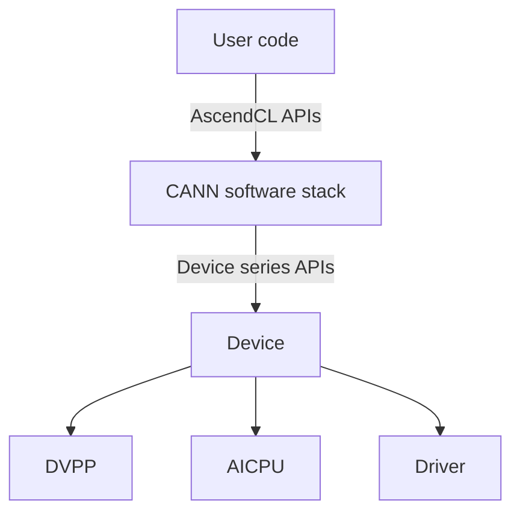

# Basic Cases

<br>

## 1. Checking the Ascend C Operator of the Kernel Launch Symbol

### 1.1 Procedure

1. Prepare for the check by referring to "Preparations" > "Enabling Full Check" > "Kernel Launch Symbol Scenario" in *msSanitizer User Guide*.
2. Set related environment variables by referring to "Preparations" in *msSanitizer User Guide*.
3. Build a single-operator executable file.
  The following is an example of the command for building an Add operator executable file.
    After the one-click script building and running is complete, the NPU-side executable file `_<kernel_name>_npu_` is generated in the project directory.
4. Use msSanitizer to start the executable file of a single-operator (_add_npu_ is used as an example).

  - Run the following command to perform memory check. For details about the option, see "Tool Overview" > "Command Summary " > "Common Options" and "Tool Overview" > "Command Summary" > "Memory Check Options" in *msSanitizer User Guide*. For details about memory check, see the [memory check example](#12-description-of-the-memory-check-example).

    ```shell
    mssanitizer --tool=memcheck ./add_npu   # Specify --tool=memcheck for memory check.
    ```

    - Run the following command for race check. For details about the options, see "Tool Overview" > "Command Summary " > "Common Options" in *msSanitizer User Guide*. For details about race check, see the [race check example](#13-description-of-the-race-check-example).
    The path of the single-operator executable file can be set to either an absolute path or a relative path according to the actual situation.

### 1.2 Description of the Memory Check Example

- Before this [procedure](#11-procedure), construct an invalid read/write scenario in the Add operator and change the length of DataCopy from `TILE_LENGTH` to 2 × `TILE_LENGTH`. In this case, memory overwriting occurs during the last copy.
- According to the report generated by the check tool, 224-byte invalid write operations are performed on the GM in line 65 of the `add_custom.cpp` file, which corresponds to the constructed abnormal scenario.
  
### 1.3 Description of the Race Check Example

- Before this [procedure](#11-procedure), construct an inter-core race scenario in the Add operator and change the length of DataCopy from `TILE_LENGTH` to 2 × `TILE_LENGTH`. In this case, inter-core race exists in the GM.
- According to the report generated by the check tool, in line 65 of `add_kernel.cpp`, inter-core race occurs between cores 0 and 1 of the AIV, corresponding to the constructed exception scenario.

## 2. Checking the API-Called Single-Operator

After the custom operator is developed and deployed, use the single-operator API to call the operator, add check-related compilation options, rebuild and deploy the operator, and use msSanitizer to run the executable file to check exceptions of the operator.

### 2.1 Prerequisites

Click [AclNNInvocation Sample Code](https://gitee.com/ascend/samples/tree/master/operator/ascendc/0_introduction/1_add_frameworklaunch/AclNNInvocation) to obtain the sample project to prepare for operator check.

> [!NOTE]NOTE
>
> - This sample project does not support Atlas A3 training products and Atlas A3 inference products.
> - When downloading the code sample, run the following command to specify the branch version:
>
> ```shell
> git clone https://gitee.com/ascend/samples.git -b v0.2-8.0.0.beta1
> ```

### 2.2 Procedure

1. Run the following command to generate a custom operator project and implement the operator on the host and kernel:

    ```shell
    bash install.sh -v Ascendxxxyy    # xxxyy indicates the type of the chip used by the user.
    ```

2. Compile and deploy the operator by referring to "Operator Compilation and Deployment" in the *msOpGen User Guide*.

    > [!NOTE]NOTE  
    > In the `${git_clone_path}/samples/operator/ascendc/0_introduction/1_add_frameworklaunch/CustomOp` directory of the sample project, modify the `op_kernel/CMakeLists.txt` file and add the `-sanitizer` option to the kernel implementation to support the check function.
    >
    > ```cmake
    > add_ops_compile_options(ALL OPTIONS -sanitizer)
    > ```
    >
3. Click [Prerequisites](#21-prerequisites) to obtain the sample project directory for verifying the code.

    ```text
      ├──input                                                 // Directory for storing the input data generated by the script.
      ├──output                                                // Directory for storing the output data and truth value generated during operator execution
      ├── inc                           // Header file directory
      │   ├── common.h                 // Common method class declaration file, used to read binary files
      │   ├── operator_desc.h         // Operator description declaration file, including the operator input and output, operator type, input description, and output description
      │   ├── op_runner.h             // Operator execution information declaration file, including the numbers and sizes of operator input and output
      ├── src 
      │   ├── CMakeLists.txt    // Build script
      │   ├── common.cpp         // Common function file, used to read binary files
      │   ├── main.cpp    // Entry for single-operator execution
      │   ├── operator_desc.cpp     // File used to construct the input and output description of the operator
      │   ├── op_runner.cpp   // Main process implementation file for single-operator execution
      ├── scripts
      │   ├── verify_result.py    // Truth value comparison file
      │   ├── gen_data.py    // Script file for generating the input data and truth value
      │   ├── acl.json    // ACL configuration file
    ```

4. Use the check tool to start the operator API running script.

    ```shell
      mssanitizer --tool=memcheck bash run.sh  # Specify --tool=memcheck for memory check.
      mssanitizer --tool=racecheck bash run.sh # Specify --tool=racecheck for race check.
    ```

5. Analyze abnormal behavior by referring to "Memory Check" > "Interpreting a Memory Exception Report", "Race Check" > "Interpreting a Race Exception Report", and "Uninitialization Check" > "Interpreting an Uninitialized Memory Exception Report" in the *msSanitizer User Guide*.

## 3. Checking the Operators Called by a PyTorch API

### 3.1 Prerequisites

- Click [AddCustom Sample Code](https://gitee.com/ascend/samples/tree/master/operator/ascendc/0_introduction/1_add_frameworklaunch/AddCustom) to obtain the sample project to prepare for operator check.
  > [!NOTE]NOTE
  >
  > - This sample project supports only Python 3.9. To run this sample project in other Python versions, change the Python version in the `run_op_plugin.sh` file in the `${git_clone_path}/samples/operator/ascendc/0_introduction/1_add_frameworklaunch/PytorchInvocation` directory.
  > - This sample project does not support Atlas A3 training products and Atlas A3 inference products.
  > - When downloading the code sample, run the following command to specify the branch version:
  >
  > ```shell
  > git clone https://gitee.com/ascend/samples.git -b master
  > ```
>
- You have installed the PyTorch framework and torch_npu plugin by referring to *Ascend Extension for PyTorch Software Installation Guide*.

### 3.2 Procedure

1. Run the following command to generate a custom operator project and implement the operator on the host and kernel:

    ```shell
      bash install.sh -v Ascendxxxyy    # xxxyy indicates the type of the chip used by the user.
    ```

2. Compile and deploy the operator by referring to "Operator Compilation and Deployment" in *msOpGen User Guide*.

    > [!NOTE]NOTE
    > Edit the **CMakeLists.txt** file in the sample project directory `${git_clone_path}/samples/operator/ascendc/0_introduction/1_add_frameworklaunch/CustomOp/op_kernel` and add the compilation option `-sanitizer`.
    >
    > ```cmake
    > add_ops_compile_options(ALL OPTIONS -sanitizer)
    > ```
    >
3. Go to the [PyTorch integration project](https://gitee.com/ascend/samples/tree/master/operator/ascendc/0_introduction/1_add_frameworklaunch/PytorchInvocation), call the AddCustom operator project in PyTorch calling mode, and complete the compilation according to the guide.

    ```text
      PytorchInvocation
      ├── op_plugin_patch         
      ├── run_op_plugin.sh      // Required by sample execution
      └── test_ops_custom.py    // Required for tool startup
    ```

4. Execute the sample. During the sample execution, test data is automatically generated. Run the PyTorch sample, and verify the running result.

    ```text
      bash run_op_plugin.sh
      -- CMAKE_CCE_COMPILER: ${INSTALL_DIR}/toolkit/tools/ccec_compiler/bin/ccec
      -- CMAKE_CURRENT_LIST_DIR: ${INSTALL_DIR}/AddKernelInvocation/cmake/Modules
      -- ASCEND_PRODUCT_TYPE:
        Ascendxxxyy
      -- ASCEND_CORE_TYPE:
        VectorCore
      -- ASCEND_INSTALL_PATH:
        /usr/local/Ascend/cann
      -- The CXX compiler identification is GNU 10.3.1
      -- Detecting CXX compiler ABI info
      -- Detecting CXX compiler ABI info - done
      -- Check for working CXX compiler: /usr/bin/c++ - skipped
      -- Detecting CXX compile features
      -- Detecting CXX compile features - done
      -- Configuring done
      -- Generating done
      -- Build files have been written to: ${INSTALL_DIR}/AddKernelInvocation/build
      Scanning dependencies of target add_npu
      [ 33%] Building CCE object cmake/npu/CMakeFiles/add_npu.dir/__/__/add_custom.cpp.o
      [ 66%] Building CCE object cmake/npu/CMakeFiles/add_npu.dir/__/__/main.cpp.o
      [100%] Linking CCE executable ../../../add_npu
      [100%] Built target add_npu
      ${INSTALL_DIR}/AddKernelInvocation
      INFO: compile op on ONBOARD succeed!
      INFO: execute op on ONBOARD succeed!
      test pass
    ```

5. Start the msSanitizer tool to start the Python program for exception check. For details about how to enable the exception check function, see "Tool Overview" > "Principles for Enabling the Exception Check Function" in the *msSanitizer User Guide*.
6. Analyze abnormal behavior by referring to "Memory Check" > "Interpreting a Memory Exception Report", "Race Check" > "Interpreting a Race Exception Report", and "Uninitialization Check" > "Interpreting an Uninitialized Memory Exception Report" in *msSanitizer User Guide*.

## 4. Checking the Triton Operator

### 4.1 Prerequisites

- The Triton and Triton-Ascend plugin have been installed and configured by referring to [triton-ascend repository](https://gitcode.com/Ascend/triton-ascend).
- Enable the following environment variables to prevent un-recompiled operators from causing issues.
- You have prepared the implementation file of the Triton operator.
    If you have not prepared the Triton operator, refer to the following example. This section describes the check process of the Triton operator based on this example.

### 4.2 Procedure

1. Prepare for the check by referring to "Preparations" > "Enabling Full Check" > "Triton Operator Calling Scenario" in *msSanitizer User Guide*.
2. Disable the memory pool.
  In the sample, PyTorch is used to create tensors. In the PyTorch framework, the GM is managed in memory pool mode by default, which interferes with memory check. Therefore, you need to set the following environment variable to disable the memory pool before the check to ensure that the check result is accurate.
3. Construct an illegal read/write scenario within the Triton operator. Shift the first loaded memory rightward by 100 elements, thereby causing an illegal read on GM during the load operation.

    ```python
      def triton_add(in_ptr0, in_ptr1, out_ptr0, XBLOCK: tl.constexpr, XBLOCK_SUB: tl.constexpr):
          offset = tl.program_id(0) * XBLOCK
          base1 = tl.arange(0, XBLOCK_SUB)
          loops1: tl.constexpr = (XBLOCK + XBLOCK_SUB - 1) // XBLOCK_SUB
          for loop1 in range(loops1):
              x0 = offset + (loop1 * XBLOCK_SUB) + base1
              # ERROR: Construct an illegal read exception.
              tmp0 = tl.load(in_ptr0 + (x0) + 100, None)
              tmp1 = tl.load(in_ptr1 + (x0), None)
    ```

4. Use the msSanitizer tool to start the Triton operator. For details about the options, see "Tool Overview" > "Command Summary " > "Common Options" and "Tool Overview" > "Command Summary" > "Memory Check Options" in *msSanitizer User Guide*. For details about memory check, see "Memory Check" in *msSanitizer User Guide*.

  ```shell
    mssanitizer -t memcheck -- python sample.py
  ```

### 4.3 Memory Exception Report Example

According to the report generated by the check tool, an illegal read of 368 bytes is performed on the GM in line 18 of `sample.py`, which is consistent with the constructed exception scenario.

```text
$ mssanitizer -t memcheck -- python sample.py
[mssanitizer] logging to file: ./mindstudio_sanitizer_log/mssanitizer_20250522093805_922880.log
Failed
====== ERROR: illegal read of size 368
======    at 0x12c0c0053190 on GM in triton_add
======    in block aiv(1) on device 0
======    code in pc current 0x1b0 (serialNo:524)
======    #0 sample.py:18:45
```

## 5. Checking the Memory of the CANN Software Stack

For scenarios where memory exceptions may occur when user programs call CANN software stack APIs, the msSanitizer tool provides the memory check capability for device APIs and AscendCL APIs, allowing users to identify memory exceptions.

### 5.1 Principles of Memory Leak Check

When the device memory queried by running the `npu-smi info` command keeps increasing, you can use this tool to identify memory leak. If memory leak occurs on AscendCL APIs, you can identify the code line.

As shown in the following figure, the CANN software stack memory operation APIs consist of two levels: the lower device APIs provided by the driver and the upper AscendCL APIs for user code to call.



To identify a memory leak, perform the following steps:

1. Enable leak check for device APIs to determine whether memory leak occurs on the host. If no, the leak occurs on the device. If yes, go to the next step to check whether AscendCL API call leak occurs.
2. Enable leak check for AscendCL APIs to determine whether leak occurs when user code calls AscendCL APIs. If no, the problem is not caused by AscendCL API calls. If yes, go to the next step to identify the specific code line.
3. Use the new APIs provided by the msSanitizer tool to recompile the header file, and then use the tool to start the check program to identify the file name and code line number corresponding to the allocation function whose allocations are not destroyed. For details about the new APIs, see *msSanitizer APIs*.

### 5.2 Troubleshooting Procedure

1. Set related environment variables by referring to "Preparations" in *msSanitizer User Guide*.
2. Check whether memory leak occurs on the host.

   2.1 Use the msSanitizer tool to start the program to be checked. The following is a command example:

       ```shell
         mssanitizer --check-device-heap=yes --leak-check=yes ./add_npu
       ```

         The path of the program to be checked (for example, *_add_custom_npu_*) can be set to either an absolute path or a relative path according to the actual situation.
   2.2 If no exception information is displayed, the check program is running properly and no memory leak occurs on the host. If the following exception information is displayed, memory leak occurs on the host.
       The following command output indicates that one memory allocation on the host is not destroyed, resulting in a 32800-byte memory leak.
   2.3 Determine whether the memory leak is caused by AscendCL API calls.
3. Use the msSanitizer tool to start the program to be checked. The following is a command example:

    ```shell
      mssanitizer --check-cann-heap=yes --leak-check=yes ./add_npu
    ```

4. If no exception information is displayed, the check program is running successfully and no memory leak occurs during the AscendCL API calls. If the following exception information is displayed, memory leak occurs during the AscendCL API calls.
    The following information indicates that one memory allocation is not destroyed when the AscendCL API is called, resulting in a 32768-byte memory leak.
5. If memory leak occurs, use the msSanitizer API header file `acl.h` and the corresponding dynamic library file provided by the msSanitizer tool to identify the code file and code line where memory leak occurs.
  To identify the code file and code line where memory leak occurs, replace the original header file `acl/acl.h` in the user code with the msSanitizer API header file `acl.h` provided by the tool, link the dynamic library file `libascend_acl_hook.so` to the user's application project, and rebuild the application project. For details, see [Importing the API Header File and Linking the Dynamic Library](#53-importing-the-api-header-file-and-linking-the-dynamic-library).

   5.1 Use the msSanitizer tool to restart the program. The following is a command example:

     ```text
       mssanitizer --check-cann-heap=yes --leak-check=yes ./add_npu
     ```

       The following information indicates that the one memory allocation is not destroyed in line 55 of the `main.cpp` file of the application. Then you can identify the cause of the memory leak.

### 5.3 Importing the API Header File and Linking the Dynamic Library

This example uses the kernel launch symbol scenario of the Atlas A2 training product/Atlas A2 inference product as an example to describe how to import the msSanitizer API header file `acl.h` and link the corresponding dynamic library file. For other types of custom projects, adjust the operations based on the actual build script.

1. Click [AddKernelInvocationNeo Sample Code](https://gitee.com/ascend/samples/tree/master/operator/ascendc/0_introduction/3_add_kernellaunch/AddKernelInvocationNeo) to obtain the sample project for verifying the code.

    > [!NOTE]NOTE
    > When downloading the code sample, run the following command to specify the branch version:
    >
    > ```shell
    > git clone https://gitee.com/ascend/samples.git -b master
    > ```
    >
2. In the `${git_clone_path}/samples/operator/ascendc/0_introduction/3_add_kernellaunch/AddKernelInvocationNeo` directory, replace the `acl/acl.h` header file introduced by the `main.cpp` file with the `acl.h` header file provided by msSanitizer.

    > [!NOTE]NOTE
    > 
    > In the template library scenario, you need to replace `#include <acl/acl.h>` in the `/examples/common/helper.hpp` path of the Ascend C template library with `#include "acl.h"`. The procedure is as follows:
    >
    > 1. Run the following command to download the Ascend C template library from the [Catlass code repository](https://gitcode.com/cann/catlass/tree/catlass-v1-stable):
    >
    >     ```shell
    >     git clone https://gitcode.com/cann/catlass.git -b   catlass-v1-stable
    >     ```
    > 
    > 2. Go to the `/examples/common/helper.hpp` code directory.
    > 
    >     ```shell
    >     cd catlass/examples/common/helper.hpp
    >     ```
    > 
    > 3. Replace `#include <acl/acl.h>` with `#include "acl.h"`.
    > 

3. Edit the `CMakeLists.txt` file in the `${git_clone_path}/samples/operator/ascendc/0_introduction/3_add_kernellaunch/AddKernelInvocationNeo` directory and import the API header file path `${INSTALL_DIR}/tools/mssanitizer/include/acl` and the dynamic library path
  `${INSTALL_DIR}/tools/mssanitizer/lib64/libascend_acl_hook.so`.

    > [!NOTE]NOTE
    >
    > - The template library scenario applies only to Atlas A2 training products/Atlas A2 inference products.
    > - In the template library scenario, run the following commands to add compilation check options:
    >
    > ```cmake
    > -I$ENV{ASCEND_HOME_PATH}/tools/mssanitizer/include/acl 
    > -L$ENV{ASCEND_HOME_PATH}/tools/mssanitizer/lib64 
    > -lascend_acl_hook 
    > ```
    >
4. Import environment variables and recompile the operator.

    > [!NOTE]NOTE
    > Run the `npu-smi info` command on the server where the Ascend AI Processor is installed to obtain the chip name. Note that the actual value is represented by `AscendChip_name`. For example, if the chip name is `xxxyy`, the actual value is `Ascendxxxyy`.
