# msSanitizer Architecture Design Specifications

<br>

## 1 Project Overview

### 1.1 Background and Motivation

The Ascend chip contains multiple cores. Development based on the Ascend chip requires precise management of the memory blocks dedicated to each core. On-chip memory enforces alignment constraints. During development, developers may encounter issues such as memory corruption, alignment errors, uninitialized access, and pipeline race. These issues are difficult to debug, requiring automated check tool for efficient resolution.

msSanitizer is an exception detection tool designed for Ascend AI Processors. It combines compiler instrumentation with runtime hooking to automatically collect behavior information and analyze exceptions during operator execution.

### 1.2 Application Scenarios

- AscendC Single-Operator Scenario
- Common operator access modes, such as direct operator calling, ACLNN single-operator calling, and PyTorch integration
- CANN software stack memory check

### 1.3 Functions

| Type| Function| Description| Supported System Feature|
|-----|------|------|------------|
| Service| Illegal read/write check| Check for out-of-bounds memory reads/writes on host and kernel.| Memory check → Illegal read/write check|
| Service| Alignment check| Check for alignment of memory reads/writes on kernel.| Memory check → Alignment check|
| Service| Multi-core corruption check| Check for overlapped memory writes from multiple blocks on the device.| Memory check → Multi-core corruption check|
| Service| Memory leak check| Check for memory leaks on the host.| Memory check → Memory leak check|
| Service| Illegal release check| Check for illegal memory release on the host.| Memory check → Illegal release check|
| Service| Unused memory check| Collect statistics on the memory that is allocated but not used.| Memory check → Unused memory check|
| Service| CANN software stack memory check| Check the memory behavior of the CANN software stack.| Memory check → CANN software stack check|
| Service| Inter-pipeline race check| Check the race behavior between pipelines.| Race check → Inter-pipeline race check|
| Service| Intra-pipeline race check| Check the race behavior between instructions in a pipeline.| Race check → Intra-pipeline race check|
| Service| Inter-core race check| Check the instruction race behavior between cores.| Race check → Inter-core race check|
| Service| Uninitialization check| Check the read events on uninitialized memory.| Uninitialization check|
| Service| Exception location information| Display the exception location based on the file name, line number, or call stack.| Exception location|
| Service| Kernel check| Specify the kernel to be checked using `--kernel-name`.| Command line → Runtime options|
| Service| Block check| Specify the ID of the block to be checked using `--block-id`.| Command line → Runtime options|
| Runtime configuration| GM cache resource allocation| Specify the GM memory size using `--cache-size`.| Command line → Runtime options|
| Service| Check report output| Control report output using `--log-file`/`--log-level`.| Command line → Exception report settings|
| DFX | Debug log| Set the debug log size using `--max-debuglog-size`.| Tool debugging → Log settings|

---

## 2 Design Objectives and Key Elements

### 2.1 Overall Design Objectives

| Design Objective| Description|
|---------|------|
| **Check accuracy**| Prioritize the control of false negative and false positive by analyzing their respective occurrence scenarios.|
| **Operator integration mode**| Cover the runtime interface differences in different operator integration modes to ensure availability.|
| **Easy extension of check algorithms**| Use a plugin-based architecture for check algorithm management to support more exception types in the future.|
| **Check duration**| Minimize the check duration to ensure availability in large-operator, network-wide, and multi-device check scenarios.|
| **Usability of command-line options**| Design options clearly and intuitively to ensure good human-machine interaction experience.|
| **Multi-instance running of tools**| Enable multiple tool instances to run concurrently and independently on a single host without conflicts.|

### 2.2 Key Element Design

| Key Element| Design Objectives Involved|
|---------|-------------|
| **Implementation model**| Check accuracy: Ensure accuracy in instruction behavior abstraction and algorithm implementation.<br>Algorithm scalability: Algorithm modules need to be properly abstracted.<br>Algorithm parallelism: multi-card parallelism, inter-algorithm parallelism, and intra-algorithm parallelism|
| **Interaction model**| Operator integration mode: Access different memory information through different integration methods.<br>Command line usability: Clear and intuitive option design|
| **Concurrency model**| Multi-instance running: Ensure that functions of different tools are independent and do not conflict with each other.|

---

## 3 Architecture Overview

### 3.1 System Architecture

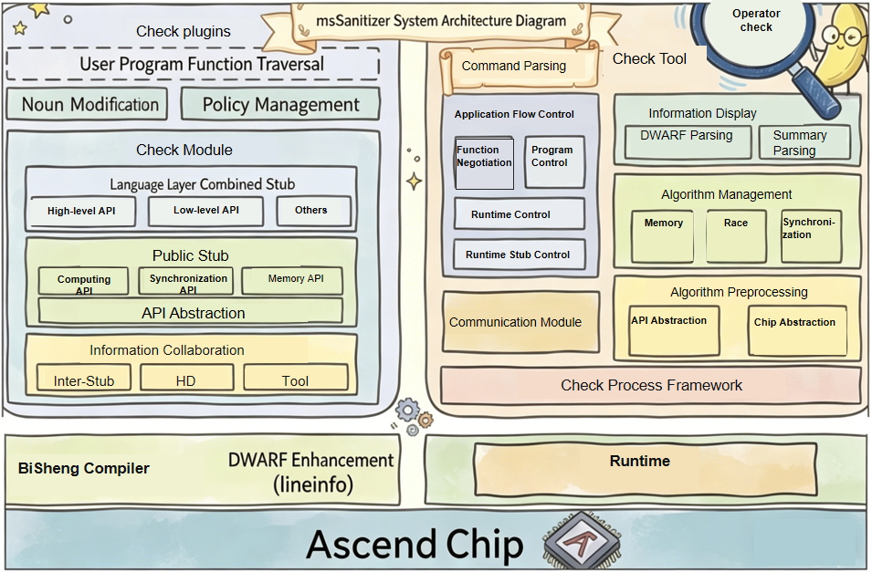

### 3.2 Modules

The system consists of the following four core modules:

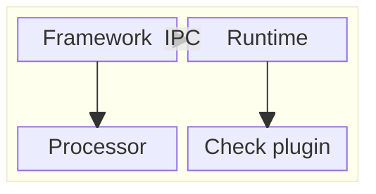
```mermaid
block-beta
    columns 8
    block:msSanitizer:1
        columns 4
        Framework["Framework"]:2
        Runtime["Runtime"]:2
        space:4
        Processor["Processor"]:2
        Plugin["Check plugin"]:2
    end
    Framework <-- "IPC" --> Runtime
    Framework --> Processor
    Runtime --> Plugin
```

Module functions

| Module| Function| Key Input/Output|
|-----|------|-------------|
| **Framework module**| Process control: command line parsing, process startup, and inter-process communication| Input: user command line options; output: check configuration and process control|
| **Runtime module**| Information collection: Hook runtime interfaces to collect user process behavior data.| Input: runtime API calls; output: operation information|
| **Processor module**| Exception analysis: Run the check algorithm to generate a check report.| Input: runtime information; output: exception check result|
| **Check plugin module**| Compilation instrumentation: Collaborate with the compiler to insert check stub functions.| Input: instrumentation policy query; output: stub function implementation|

### 3.3 Software Units

| Software Unit| Description| External Interface| Internal Interface| Relationship|
|---------|------|---------|---------|---------|
| Framework module| Overall tool process control| Tool command line| Communication server| Provide command lines for users to invoke; transfer data between the communication server and the runtime module; use the information input interface of the information processing module.|
| Runtime module| Collect and upload runtime data.| None| Communication client| Transfer data between the communication client and the framework module; use the dynamic instrumentation plugin to complete the dynamic instrumentation process.|
| Processor module| Perform exception check and output the result.| Exception output| Information input interface| Implement the exception output and information input interfaces to receive data transferred by the framework.|
| Check plugin module| Collaborate with the compiler to complete instrumentation.| Instrumentation query interface and instruction stub implementation| Dynamic instrumentation plugin| Implement the instrumentation query interface for the compiler to query, implement the instruction stub to link to static instrumentation, and implement the dynamic instrumentation plugin for the runtime module to invoke.|

---

## 4. System Context

The following figure shows the interaction between msSanitizer and external systems.

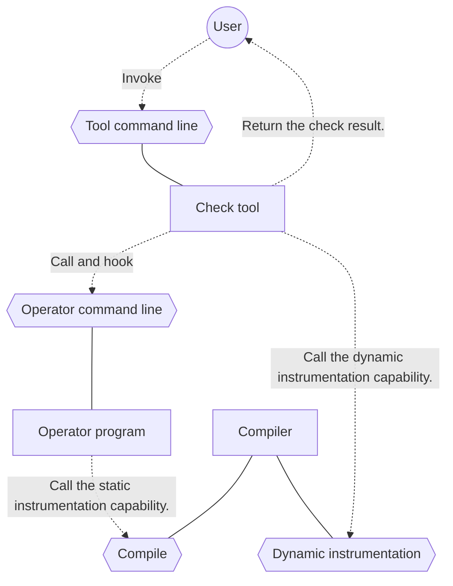
```mermaid
graph TB
    user(("User"))
    sanitizer["Check tool"]
    kernel["Operator program"]
    compiler["Compiler"]
    framework_cli{{"Tool command line"}}
    kernel_cli{{"Operator command line"}}
    compile_cli{{"Compile"}}
    dbi_cli{{"Dynamic instrumentation"}}

    user -.->|Invoke| framework_cli
    framework_cli --- sanitizer
    kernel_cli --- kernel
    compiler --- compile_cli
    compiler --- dbi_cli
    sanitizer -.->|Call and hook| kernel_cli
    sanitizer -.->|Call the dynamic instrumentation capability.| dbi_cli
    kernel -.->|Call the static instrumentation capability.| compile_cli
    sanitizer -.->|Return the check result.| user
```

**Core interaction process**

1. The user calls msSanitizer through the command line and passes the operator program to be checked.
2. msSanitizer starts the operator program and hooks the runtime interface.
3. The compiler inserts static instrumentation (through the check plugin) in the compilation phase.
4. The runtime module collects behavior data and reports it in the execution phase.
5. The information processing module analyzes the data, detects exceptions, and reports the results to the user.

---

## 5. Detailed Design of Modules

### 5.1 Framework

#### 5.1.1 Function Description

The framework module is the entry of the tool and controls the entire process from command line startup to the end of the check. The core functions include:

1. Command line option parsing and verification
2. `LD_PRELOAD` environment variable setting and user program startup
3. Inter-process communication
4. Algorithm module creation and initialization
5. Exception information collection and display

#### 5.1.2 Class Design

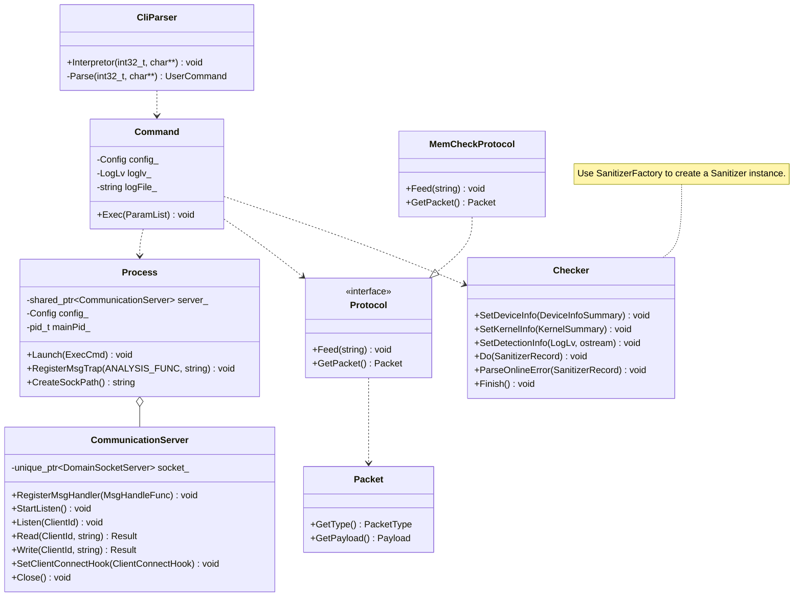
```mermaid
classDiagram
    class CliParser {
        +Interpretor(int32_t, char**) void
        -Parse(int32_t, char**) UserCommand
    }
    class Command {
        +Exec(ParamList) void
        -Config config_
        -LogLv loglv_
        -string logFile_
    }
    class Process {
        +Launch(ExecCmd) void
        +RegisterMsgTrap(ANALYSIS_FUNC, string) void
        +CreateSockPath() string
        -shared_ptr~CommunicationServer~ server_
        -Config config_
        -pid_t mainPid_
    }
    class CommunicationServer {
        -unique_ptr~DomainSocketServer~ socket_
        +RegisterMsgHandler(MsgHandleFunc) void
        +StartListen() void
        +Listen(ClientId) void
        +Read(ClientId, string) Result
        +Write(ClientId, string) Result
        +SetClientConnectHook(ClientConnectHook) void
        +Close() void
    }
    class Packet {
        +GetType() PacketType
        +GetPayload() Payload
    }
    class Protocol {
        <<interface>>
        +Feed(string) void
        +GetPacket() Packet
    }
    class MemCheckProtocol {
        +Feed(string) void
        +GetPacket() Packet
    }
    class Checker {
        +SetDeviceInfo(DeviceInfoSummary) void
        +SetKernelInfo(KernelSummary) void
        +SetDetectionInfo(LogLv, ostream) void
        +Do(SanitizerRecord) void
        +ParseOnlineError(SanitizerRecord) void
        +Finish() void
    }
    note for Checker "Use SanitizerFactory to create a Sanitizer instance."
    CliParser ..> Command
    Command ..> Process
    Process o-- CommunicationServer
    Command ..> Protocol
    Command ..> Checker
    Protocol ..> Packet
    MemCheckProtocol ..|> Protocol
```

#### 5.1.3 Processing Procedure

1. Parse command line options to obtain the check tool enabling mode, user binary path, and startup command.
2. Select the corresponding instrumentation function library based on the enabling mode and configure the `LD_PRELOAD` environment variable.
3. Fork a child process, start the user program through `execvpe`, and use the runtime instrumentation function library configured by `LD_PRELOAD` to replace symbols.
4. Send the enabling mode to the user process.
5. Receive and parse the operation records sent by the runtime module.
6. Distribute the operation records to the enabled check tool.

#### 5.1.4 Exception Report Display

Based on the level of detail in the exception location information, there are three types of location information:

**Exception call stack** (most detailed):

```text
====== ERROR: illegal read of size 224
======    at 0x12c0c0015000 on GM
======    in block aiv(0) on device 0
======    code in pc current 0x77c (serialNo:10)
======    #0 .../kernel_operator_data_copy_impl.h:58:9
======    #1 .../inner_kernel_operator_data_copy_intf.cppm:58:9
======    #2 .../inner_kernel_operator_data_copy_intf.cppm:443:5
======    #3 illegal_read_and_write/illegal_read_and_write_kernel.cpp:18:5
```

**File name and line number**:

```text
====== ERROR: illegal read of size 224
======    at 0x12c0c0015000 on GM
======    in block aiv(0) on device 0
======    code in illegal_read_and_write/illegal_read_and_write_kernel.cpp:18 (serialNo:10)
```

**No location information** (simplest):

```text
====== ERROR: illegal read of size 224
======    at 0x12c0c0015000 on GM
======    in block aiv(0) on device 0 (serialNo:10)
```

### 5.2 Runtime

#### 5.2.1 Function Description

The runtime module runs in the user process, replaces runtime functions to obtain runtime information, and communicates with the check tool process. The deliverables are several dynamic libraries and matching header files. The dynamic libraries implement function hooking through `LD_PRELOAD`.

The following deliverables are provided based on different scenarios:

| Scenario| Deliverable| Usage|
|-----|--------|------|
| CANN software stack - HAL layer| `libascend_hal_hook.so` | HAL-layer memory check|
| CANN software stack - ACL layer| `libascend_acl_hook.so` + `acl.h` | ACL-layer memory check|
| AscendC single-operator| `libmssanitizer_injection.so` | AscendC single-operator check|
| Bisheng operator| `libascend_san_stub.so` | Bisheng operator memory check|

#### 5.2.2 Core Functions

1. Provide inter-process communication capabilities to obtain configurations and report information to the tool.
2. Provide the interface hook capability (implemented by using the function with the same name and `LD_PRELOAD`).
3. Provide the capability of obtaining and reporting device information (such as the card number and chip model).
4. Provide the capability of managing the operator kernel context and reporting information (such as blockDim, operator binary, and kernel name).
5. Provide the management capability for information recording memory.
6. Provide the `kernelLaunch` parameter concatenation capability and enable the instrumentation function on the kernel.
7. Provide the dynamic instrumentation capability.

#### 5.2.3 Class Design

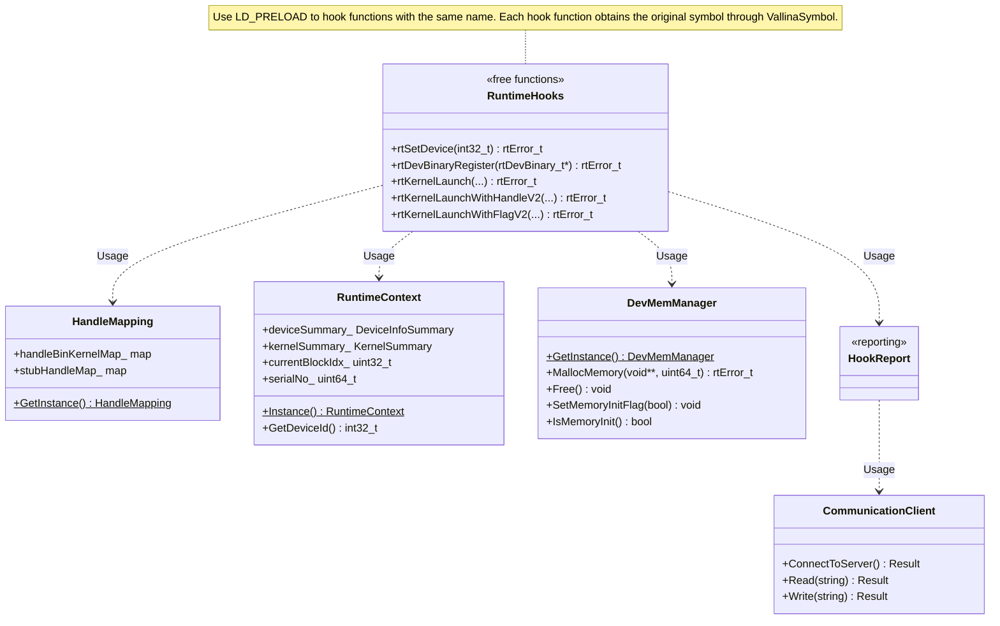
```mermaid
classDiagram
    class RuntimeHooks {
        <<free functions>>
        +rtSetDevice(int32_t) rtError_t
        +rtDevBinaryRegister(rtDevBinary_t*) rtError_t
        +rtKernelLaunch(...) rtError_t
        +rtKernelLaunchWithHandleV2(...) rtError_t
        +rtKernelLaunchWithFlagV2(...) rtError_t
    }
    note for RuntimeHooks "Use LD_PRELOAD to hook functions with the same name. Each hook function obtains the original symbol through VallinaSymbol."
    class HandleMapping {
        +GetInstance()$ HandleMapping
        +handleBinKernelMap_ map
        +stubHandleMap_ map
    }
    class RuntimeContext {
        +Instance()$ RuntimeContext
        +GetDeviceId() int32_t
        +deviceSummary_ DeviceInfoSummary
        +kernelSummary_ KernelSummary
        +currentBlockIdx_ uint32_t
        +serialNo_ uint64_t
    }
    class DevMemManager {
        +GetInstance()$ DevMemManager
        +MallocMemory(void**, uint64_t) rtError_t
        +Free() void
        +SetMemoryInitFlag(bool) void
        +IsMemoryInit() bool
    }
    class HookReport {
        <<reporting>>
    }
    class CommunicationClient {
        +ConnectToServer() Result
        +Read(string) Result
        +Write(string) Result
    }
    RuntimeHooks ..> HandleMapping : Usage
    RuntimeHooks ..> RuntimeContext : Usage
    RuntimeHooks ..> DevMemManager : Usage
    RuntimeHooks ..> HookReport : Usage
    HookReport ..> CommunicationClient : Usage
```

#### 5.2.4 Processing Procedure

**Communication process:**

1. Trigger the communication interface for the first time, initialize the socket channel, and connect to the server to obtain the check mode.
2. Obtain device information and send it back to the server for the check tool to initialize.
3. Transmit the protocol header and body through the socket channel based on the communication protocol.

**Operator instrumentation recording and reporting process:**

1. Intercept the `rtKernelLaunch` series interfaces and call `__sanitizer_init` to pre-allocate GM memory.
2. Transfer the pre-allocated GM memory pointer to the device, and record the operation information by the kernel function runtime.
3. After the kernel function is executed, copy the GM records to the host, parse them one by one, and report them to the check tool.

**mstx interface process:**

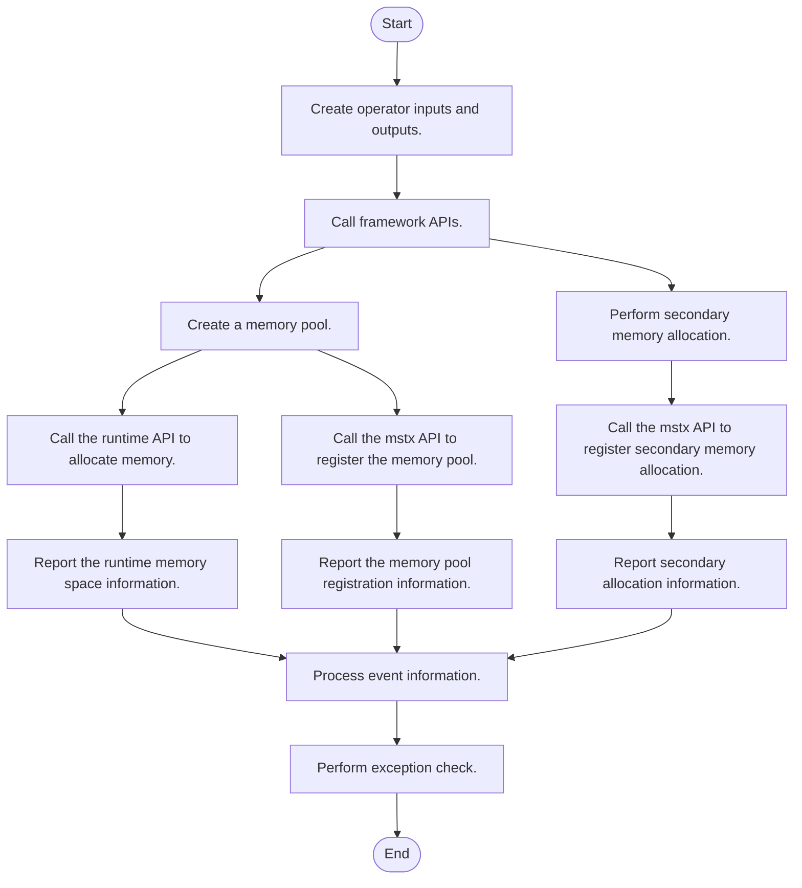
```mermaid
flowchart TD
    A([Start]) --> B[Create operator inputs and outputs.]
    B --> C[Call framework APIs.]
    C --> D[Create a memory pool.]
    C --> H[Perform secondary memory allocation.]
    D --> E[Call the runtime API to allocate memory.]
    D --> F[Call the mstx API to register the memory pool.]
    E --> E1[Report the runtime memory space information.]
    F --> F1[Report the memory pool registration information.]
    H --> I[Call the mstx API to register secondary memory allocation.]
    I --> J[Report secondary allocation information.]
    E1 --> K[Process event information.]
    F1 --> K
    J --> K
    K --> L[Perform exception check.]
    L --> M([End])
```

#### 5.2.5 Dynamic Instrumentation Design

Dynamic instrumentation occurs before operator launch and is implemented in the `Pre` function of `HijackedFuncOfKernelLaunch`.

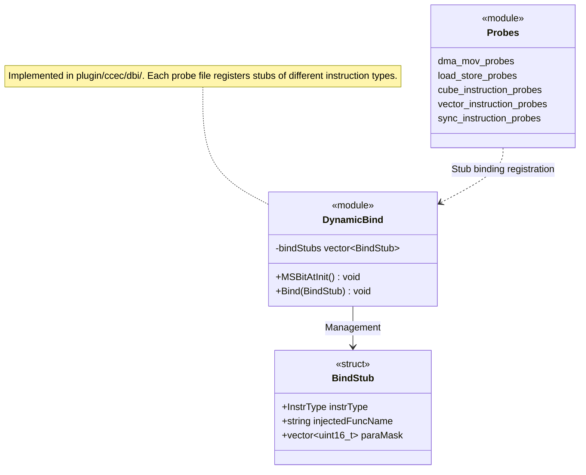
```mermaid
classDiagram
    class BindStub {
        <<struct>>
        +InstrType instrType
        +string injectedFuncName
        +vector~uint16_t~ paraMask
    }
    class DynamicBind {
        <<module>>
        +MSBitAtInit() void
        +Bind(BindStub) void
        -bindStubs vector~BindStub~
    }
    note for DynamicBind "Implemented in plugin/ccec/dbi/. Each probe file registers stubs of different instruction types."
    class Probes {
        <<module>>
        dma_mov_probes
        load_store_probes
        cube_instruction_probes
        vector_instruction_probes
        sync_instruction_probes
    }
    DynamicBind --> BindStub: Management
    Probes ..> DynamicBind : Stub binding registration
```

**Dynamic instrumentation sequence:**

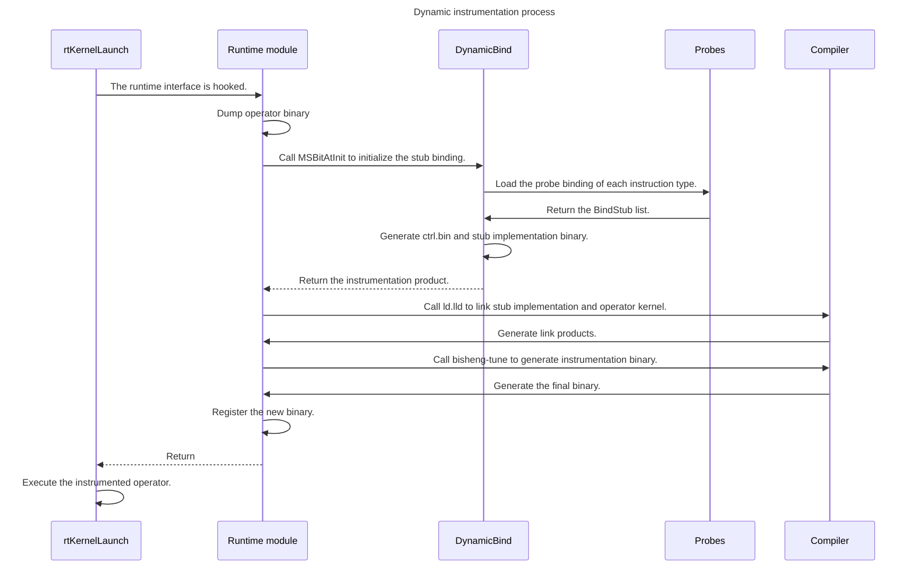
```mermaid
sequenceDiagram
    title Dynamic instrumentation process
    participant KernelLaunch as rtKernelLaunch
    participant Injection as Runtime module
    participant DynamicBind as DynamicBind
    participant Probes as Probes
    participant Compiler as Compiler

    KernelLaunch->>Injection: The runtime interface is hooked.
    Injection->>Injection: Dump operator binary
    Injection->>DynamicBind: Call MSBitAtInit to initialize the stub binding.
    DynamicBind->>Probes: Load the probe binding of each instruction type.
    Probes->>DynamicBind: Return the BindStub list.
    DynamicBind->>DynamicBind: Generate ctrl.bin and stub implementation binary.
    DynamicBind-->>Injection: Return the instrumentation product.
    Injection->>Compiler: Call ld.lld to link stub implementation and operator kernel.
    Compiler->>Injection: Generate link products.
    Injection->>Compiler: Call bisheng-tune to generate instrumentation binary.
    Compiler->>Injection: Generate the final binary.
    Injection->>Injection: Register the new binary.
    Injection-->>KernelLaunch: Return
    KernelLaunch->>KernelLaunch: Execute the instrumented operator.
```

### 5.3 Processor

#### 5.3.1 Function Description

1. Manage check algorithms and implement algorithm registration and creation through `SanitizerFactory`/`RegisteSanitizer`.
2. Distribute check records. `Checker` distributes runtime records to each check tool.
3. Provide parallel processing capabilities between check tools. Each `ToolType` corresponds to an independent consumer thread.
4. Preprocess instrumentation records and convert raw instruction records into unified descriptions..
5. Provide memory check algorithms (for illegal read/write, unaligned access, memory leak, and illegal release).
6. Provide race check algorithms (for inter-core, inter-pipeline, and intra-pipeline races).
7. Provide uninitialization check algorithms.
8. Provide synchronization check algorithms (`set_flag`/`wait_flag` pairing check).
9. Provide default register value check.

#### 5.3.2 Class Design

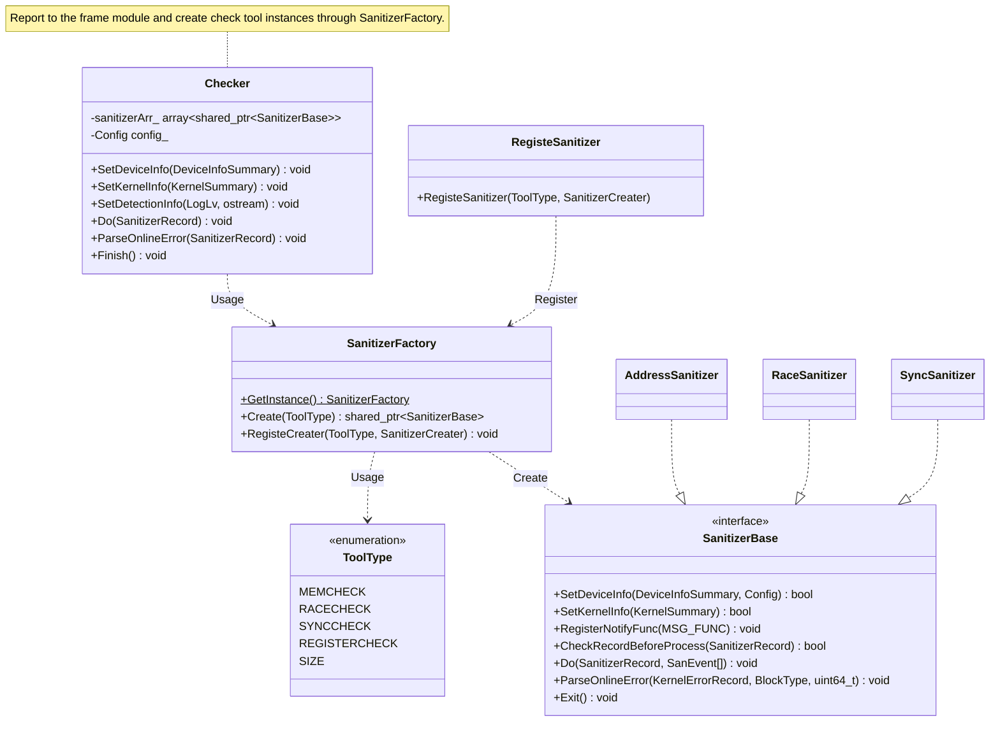
```mermaid
classDiagram
    class Checker {
        +SetDeviceInfo(DeviceInfoSummary) void
        +SetKernelInfo(KernelSummary) void
        +SetDetectionInfo(LogLv, ostream) void
        +Do(SanitizerRecord) void
        +ParseOnlineError(SanitizerRecord) void
        +Finish() void
        -sanitizerArr_ array~shared_ptr~SanitizerBase~~
        -Config config_
    }
    note for Checker "Report to the frame module and create check tool instances through SanitizerFactory."
    class SanitizerBase {
        <<interface>>
        +SetDeviceInfo(DeviceInfoSummary, Config) bool
        +SetKernelInfo(KernelSummary) bool
        +RegisterNotifyFunc(MSG_FUNC) void
        +CheckRecordBeforeProcess(SanitizerRecord) bool
        +Do(SanitizerRecord, SanEvent[]) void
        +ParseOnlineError(KernelErrorRecord, BlockType, uint64_t) void
        +Exit() void
    }
    class AddressSanitizer
    class RaceSanitizer
    class SyncSanitizer
    class ToolType {
        <<enumeration>>
        MEMCHECK
        RACECHECK
        SYNCCHECK
        REGISTERCHECK
        SIZE
    }
    class SanitizerFactory {
        +GetInstance()$ SanitizerFactory
        +Create(ToolType) shared_ptr~SanitizerBase~
        +RegisteCreater(ToolType, SanitizerCreater) void
    }
    class RegisteSanitizer {
        +RegisteSanitizer(ToolType, SanitizerCreater)
    }
    Checker ..> SanitizerFactory : Usage
    SanitizerFactory ..> ToolType : Usage
    SanitizerFactory ..> SanitizerBase : Create
    RegisteSanitizer ..> SanitizerFactory : Register
    AddressSanitizer ..|> SanitizerBase
    RaceSanitizer ..|> SanitizerBase
    SyncSanitizer ..|> SanitizerBase
```

#### 5.3.3 Check Algorithm Management

A check function may correspond to multiple check algorithms, and conversely, a single check algorithm may be mapped to multiple check functions.

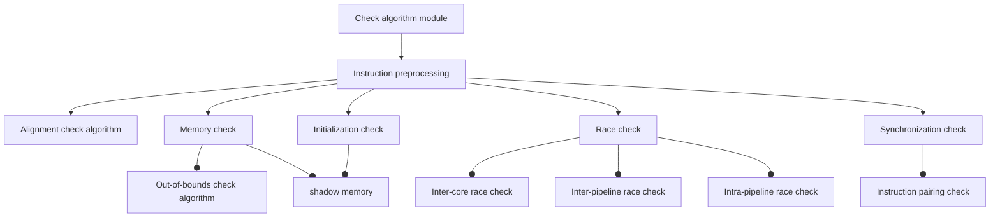
```mermaid
graph TD
    algorithm[Check algorithm module] --> preprocess[Instruction preprocessing]
    preprocess --> aligncheck[Alignment check algorithm]
    preprocess --> memcheck[Memory check]
    preprocess --> initcheck[Initialization check]
    preprocess --> racecheck[Race check]
    preprocess --> synccheck[Synchronization check]
    memcheck --o boundscheck[Out-of-bounds check algorithm]
    memcheck --o shadowmemory[shadow memory]
    initcheck --o shadowmemory
    racecheck --o intercore[Inter-core race check]
    racecheck --o interpipe[Inter-pipeline race check]
    racecheck --o innerpipe[Intra-pipeline race check]
    synccheck --o syncpair[Instruction pairing check]
```

`SanitizerFactory` provides the algorithm registration and creation functions:

- **Algorithm registration**: completed in the global initialization phase using the `RegisteSanitizer` class, providing the check function type `ToolType` and algorithm creation method.
- **Subordinate relationship storage**: represented by the `unordered_map<ToolType, SanitizerCreater>` type.
- **Algorithm creation**: The `Checker` calls `SanitizerFactory::Create(ToolType)` to create the corresponding check algorithm instance.

#### 5.3.4 Check Tool Instantiation and Distribution

During initialization, `Checker` uses `SanitizerFactory` to create a `SanitizerBase` instance for each enabled `ToolType` and stores the instance in the `sanitizerArr_` array. When each runtime record arrives, `Checker` distributes it to all initialized check tool instances.

#### 5.3.5 Check Record Distribution and Parallel Processing

`Checker` uses the producer-consumer model to implement parallelism between check tools. Each `ToolType` corresponds to a consumer thread, which independently processes its own check record queue.

1. During `Checker` initialization, a consumer thread (`ConsumeRecordThread`) is created for each enabled tool.
2. When a runtime record arrives, the `Checker` places the record into the work queue (`workerArgs_`) of the corresponding tool.
3. The consumer thread waits and wakes up using a condition variable (`workerCv_`/`producerCv_`).
4. After all records are processed, the `Checker::Finish()` instructs the consumer thread to exit.

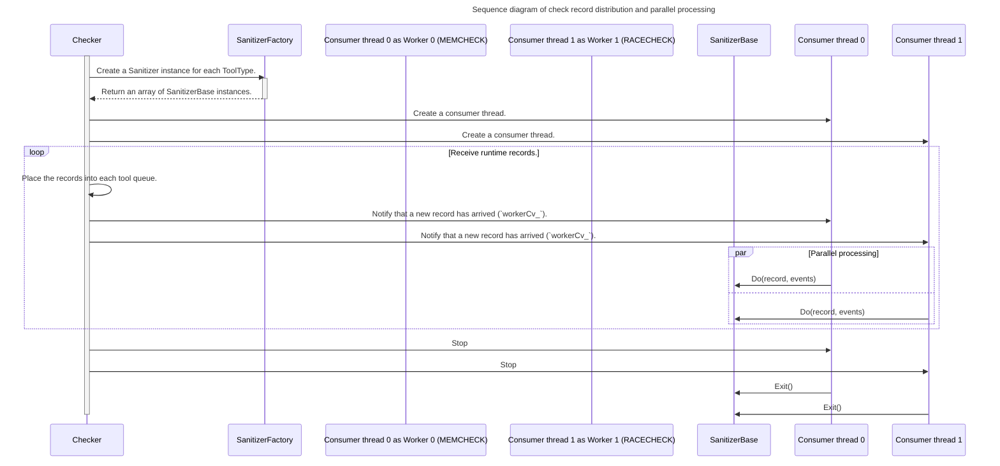
```mermaid
sequenceDiagram
    title Sequence diagram of check record distribution and parallel processing
    participant Checker
    participant SanitizerFactory
    participant Consumer thread 0 as Worker 0 (MEMCHECK)
    participant Consumer thread 1 as Worker 1 (RACECHECK)
    participant SanitizerBase

    activate Checker
    Checker->>SanitizerFactory: Create a Sanitizer instance for each ToolType.
    activate SanitizerFactory
    SanitizerFactory-->>Checker: Return an array of SanitizerBase instances.
    deactivate SanitizerFactory
    Checker->> Consumer thread 0: Create a consumer thread.
    Checker->> Consumer thread 1: Create a consumer thread.
    loop Receive runtime records.
        Checker->>Checker: Place the records into each tool queue.
        Checker->> Consumer thread 0: Notify that a new record has arrived (`workerCv_`).
        Checker->> Consumer thread 1: Notify that a new record has arrived (`workerCv_`).
        par Parallel processing
            Consumer thread 0->>SanitizerBase: Do(record, events)
        and
            Consumer thread 1->>SanitizerBase: Do(record, events)
        end
    end
    Checker->> Consumer thread 0: Stop
    Checker->> Consumer thread 1: Stop
    Consumer thread 0->>SanitizerBase: Exit()
    Consumer thread 1->>SanitizerBase: Exit()
    deactivate Checker
```

#### 5.3.6 Memory Check Algorithm

Memory check supports the following exception types.

| Exception Type| Description| Supported Memory Type|
|---------|------|------------|
| Multi-core corruption| The GM memory written by different cores overlap.| GM |
| Illegal read/write| GM: Accessing an unallocated range. On-chip memory: Accessing a range beyond the physical size.| GM, UB, L1, L0{ABC}|
| Unaligned access| The memory address does not meet the alignment requirements.| GM, UB, L1, L0{ABC}|
| Memory leak| The memory is allocated but not released.| GM |
| Illegal release| Unallocated addresses are released or repeatedly released.| GM |
| Unused memory| The memory is allocated but not used.| GM |
| Uninitialization| Uninitialized memory values are read.| GM, UB, L1, L0{ABC}, Private|

**Core class relationships**

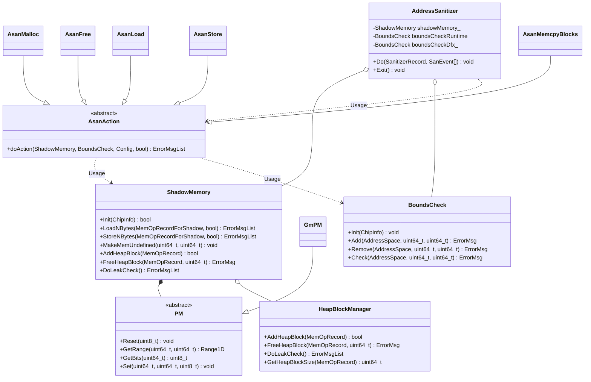
```mermaid
classDiagram
    class AddressSanitizer {
        +Do(SanitizerRecord, SanEvent[]) void
        +Exit() void
        -ShadowMemory shadowMemory_
        -BoundsCheck boundsCheckRuntime_
        -BoundsCheck boundsCheckDfx_
    }
    class ShadowMemory {
        +Init(ChipInfo) bool
        +LoadNBytes(MemOpRecordForShadow, bool) ErrorMsgList
        +StoreNBytes(MemOpRecordForShadow, bool) ErrorMsgList
        +MakeMemUndefined(uint64_t, uint64_t) void
        +AddHeapBlock(MemOpRecord) bool
        +FreeHeapBlock(MemOpRecord, uint64_t) ErrorMsg
        +DoLeakCheck() ErrorMsgList
    }
    class PM {
        <<abstract>>
        +Reset(uint8_t) void
        +GetRange(uint64_t, uint64_t) Range1D
        +GetBits(uint64_t) uint8_t
        +Set(uint64_t, uint64_t, uint8_t) void
    }
    class GmPM
    class HeapBlockManager {
        +AddHeapBlock(MemOpRecord) bool
        +FreeHeapBlock(MemOpRecord, uint64_t) ErrorMsg
        +DoLeakCheck() ErrorMsgList
        +GetHeapBlockSize(MemOpRecord) uint64_t
    }
    class BoundsCheck {
        +Init(ChipInfo) void
        +Add(AddressSpace, uint64_t, uint64_t) ErrorMsg
        +Remove(AddressSpace, uint64_t, uint64_t) ErrorMsg
        +Check(AddressSpace, uint64_t, uint64_t) ErrorMsg
    }
    class AsanAction {
        <<abstract>>
        +doAction(ShadowMemory, BoundsCheck, Config, bool) ErrorMsgList
    }
    class AsanMalloc
    class AsanFree
    class AsanLoad
    class AsanStore
    class AsanMemcpyBlocks
    GmPM --|> PM
    AsanMalloc --|> AsanAction
    AsanFree --|> AsanAction
    AsanLoad --|> AsanAction
    AsanStore --|> AsanAction
    AsanMemcpyBlocks --|> AsanAction
    AddressSanitizer o-- ShadowMemory
    AddressSanitizer o-- BoundsCheck
    ShadowMemory *-- PM
    ShadowMemory o-- HeapBlockManager
    AddressSanitizer ..> AsanAction : Usage
    AsanAction ..> ShadowMemory : Usage
    AsanAction ..> BoundsCheck : Usage
```

**ShadowMemory LoadNBytes process**

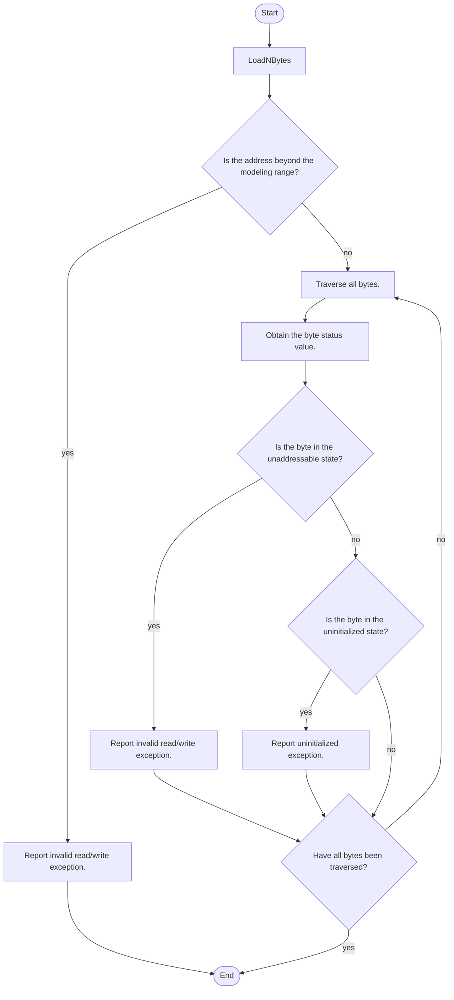
```mermaid
flowchart TD
    A([Start]) --> B[LoadNBytes]
    B --> C{Is the address beyond the modeling range?}
    C --> |yes| D[Report invalid read/write exception.]
    C --> |no| E[Traverse all bytes.]
    E --> F[Obtain the byte status value.]
    F --> G{Is the byte in the unaddressable state?}
    G -->|yes| H[Report invalid read/write exception.]
    G -->|no| I{Is the byte in the uninitialized state?}
    I -->|yes| J[Report uninitialized exception.]
    I -->|no| K{Have all bytes been traversed?}
    H --> K
    J --> K
    K -->|no| E
    K -->|yes| L([End])
    D --> L
```

**Memory check context switching**

In multi-operator calling scenarios, `AddressSanitizer` maintains two `BoundsCheck` instances (`SCOPE_RUNTIME` and `SCOPE_DFX`) and switches the context between runtime instructions and DFX instructions.

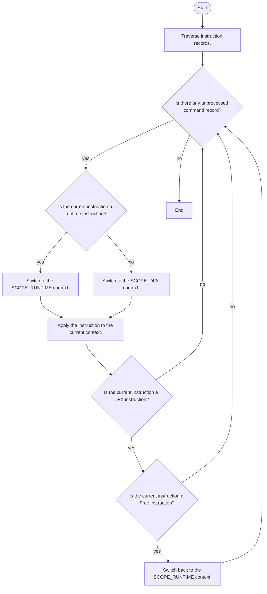
```mermaid
flowchart TD
    A([Start]) --> B[Traverse instruction records.]
    B --> C{Is there any unprocessed command record?}
    C -->|yes| D{Is the current instruction a runtime instruction?}
    D -->|yes| E[Switch to the SCOPE_RUNTIME context.]
    D -->|no| F[Switch to the SCOPE_DFX context.]
    E --> G[Apply the instruction to the current context.]
    F --> G
    G --> H{Is the current instruction a DFX instruction?}
    H -->|yes| I{Is the current instruction a Free instruction?}
    I -->|yes| J[Switch back to the SCOPE_RUNTIME context.]
    I -->|no| C
    J --> C
    H -->|no| C
    C -->|no| K[End]
```

#### 5.3.7 Shared Memory Support

In the single-node multi-device scenario, the CANN software stack implements inter-device memory sharing through the IPC interface. The tool needs to correctly synchronize the ShadowMemory status during shared memory operations.

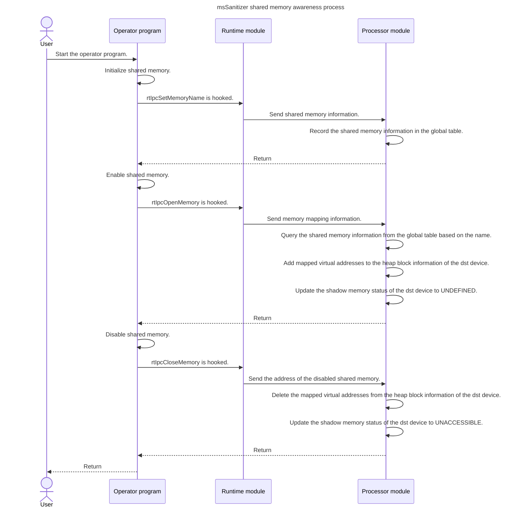
```mermaid
sequenceDiagram
    title msSanitizer shared memory awareness process
    actor user as User
    participant program as Operator program
    participant runtime as Runtime module
    participant process as Processor module

    user->>program: Start the operator program.
    program->>program: Initialize shared memory.
    program->>runtime: rtIpcSetMemoryName is hooked.
    runtime->>process: Send shared memory information.
    process->>process: Record the shared memory information in the global table.
    process-->>program: Return
    program->>program: Enable shared memory.
    program->>runtime: rtIpcOpenMemory is hooked.
    runtime->>process: Send memory mapping information.
    process->>process: Query the shared memory information from the global table based on the name.
    process->>process: Add mapped virtual addresses to the heap block information of the dst device.
    process->>process: Update the shadow memory status of the dst device to UNDEFINED.
    process-->>program: Return
    program->>program: Disable shared memory.
    program->>runtime: rtIpcCloseMemory is hooked.
    runtime->>process: Send the address of the disabled shared memory.
    process->>process: Delete the mapped virtual addresses from the heap block information of the dst device.
    process->>process: Update the shadow memory status of the dst device to UNACCESSIBLE.
    process-->>program: Return
    program-->>user: Return
```

The shared memory information is managed by the static members of the `Command` class.

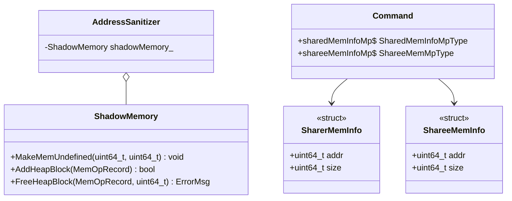
```mermaid
classDiagram
    class AddressSanitizer {
        -ShadowMemory shadowMemory_
    }
    class ShadowMemory {
        +MakeMemUndefined(uint64_t, uint64_t) void
        +AddHeapBlock(MemOpRecord) bool
        +FreeHeapBlock(MemOpRecord, uint64_t) ErrorMsg
    }
    class Command {
        +sharedMemInfoMp$ SharedMemInfoMpType
        +shareeMemInfoMp$ ShareeMemMpType
    }
    class SharerMemInfo {
        <<struct>>
        +uint64_t addr
        +uint64_t size
    }
    class ShareeMemInfo {
        <<struct>>
        +uint64_t addr
        +uint64_t size
    }
    AddressSanitizer o-- ShadowMemory
    Command --> SharerMemInfo
    Command --> ShareeMemInfo
```

#### 5.3.8 Synchronization Check Algorithm

Synchronization check is provided by the `synccheck` sub-tool. Currently, `set_flag`/`wait_flag` pairing check is supported.

```c
void set_flag(pipe_t pipe, pipe_t tpipe, event_t eventID);
void wait_flag(pipe_t pipe, pipe_t tpipe, event_t eventID);
```

The `(src, dst, eventId)` triplet is used as the unique identifier of a synchronization event. The algorithm process is as follows:

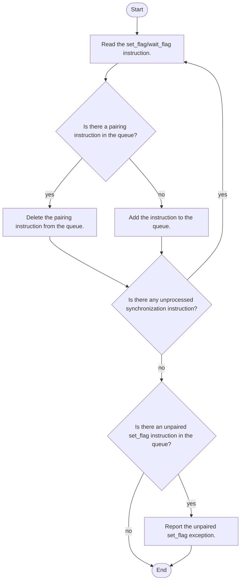
```mermaid
flowchart TD
    A([Start]) --> B[Read the set_flag/wait_flag instruction.]
    B --> C{Is there a pairing instruction in the queue?}
    C -->|yes| D[Delete the pairing instruction from the queue.]
    C -->|no| E[Add the instruction to the queue.]
    D --> F{Is there any unprocessed synchronization instruction?}
    E --> F
    F -->|yes| B
    F -->|no| G{Is there an unpaired set_flag instruction in the queue?}
    G -->|yes| H[Report the unpaired set_flag exception.]
    G -->|no| I([End])
    H --> I
```

Exception report example:

```text
====== WARNING: Unpaired set_flag instructions detected
======    from PIPE_MTE2 to PIPE_MTE3 in hardware_sync_mix_mix_aic
======    in block aiv(0) on device 1
======    code in pc current 0x1b280 (serialNo:8)
======    #0 kernel.cpp:28:5
```

#### 5.3.9 Check Algorithm Parallelism

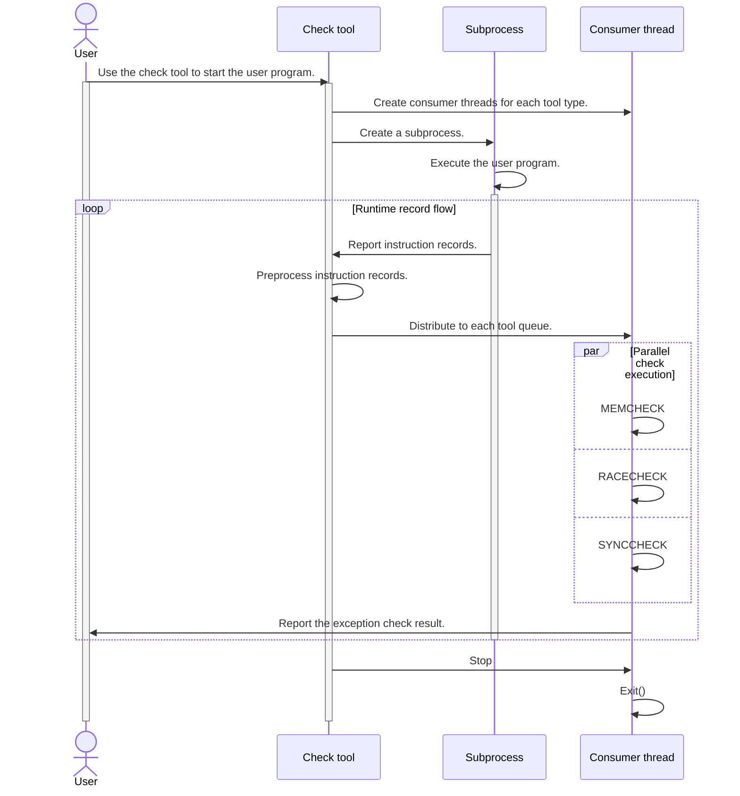
```mermaid
sequenceDiagram
    actor user as User
    participant sanitizer as Check tool
    participant subprocess as Subprocess
    participant workers as Consumer thread

    user->>sanitizer: Use the check tool to start the user program.
    activate user
    activate sanitizer
    sanitizer->>workers: Create consumer threads for each tool type.
    sanitizer->>subprocess: Create a subprocess.
    subprocess->>subprocess: Execute the user program.
    activate subprocess
    loop Runtime record flow
        subprocess->>sanitizer: Report instruction records.
        sanitizer->>sanitizer:Preprocess instruction records.
        sanitizer->>workers: Distribute to each tool queue.
        par Parallel check execution
            workers->>workers: MEMCHECK
        and
            workers->>workers: RACECHECK
        and
            workers->>workers: SYNCCHECK
        end
        workers->>user: Report the exception check result.
    end
    deactivate subprocess
    sanitizer->>workers: Stop
    workers->>workers: Exit()
    deactivate user
    deactivate sanitizer
```

### 5.4 Plugin

#### 5.4.1 Instrumentation Dimension

The check plugin module is classified and combined from two dimensions:

| Dimension| Option| Description|
|------|-----|------|
| **Instrumentation timing**| Static instrumentation| The instrumentation function is inserted during compilation. The call stack is supported, and recompilation is required.|
| | Dynamic instrumentation| The operator binary is replaced at runtime. Recompilation is not required. The call stack is not supported.|
| **Check timing**| Host-side check| The instrumentation function records information and reports it to the tool. The algorithm is more complex.|
| | Device-side check| The instrumentation function directly executes the check algorithm, which is suitable for network-wide/graph mode scenarios.|

Currently, three types of plugins are provided: static/dynamic instrumentation plugins for host-side check and dynamic instrumentation plugins for device-side check.

#### 5.4.2 Static Instrumentation Process

Deliverables: instrumentation query library `libsanitizer_api.so` (host architecture) + stub implementation library `libsanitizer_stub_dav-xxx.a` (device architecture).

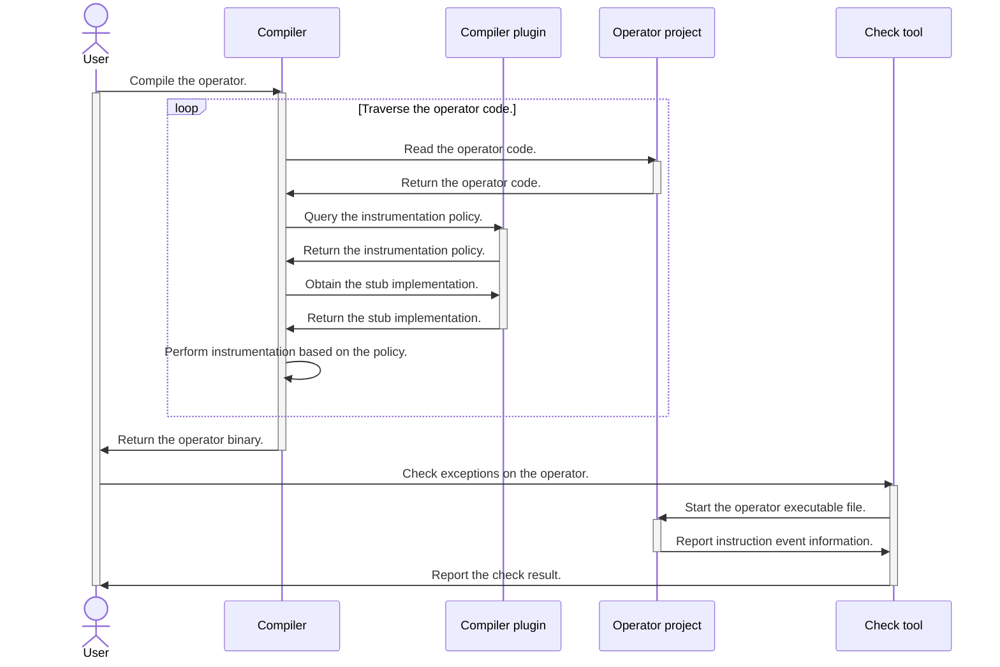
```mermaid
sequenceDiagram
    actor user as User
    participant compiler as Compiler
    participant plugin as Compiler plugin
    participant project as Operator project
    participant sanitizer as Check tool

    user->>compiler: Compile the operator.
    activate user
    activate compiler
    loop Traverse the operator code.
        compiler->>project: Read the operator code.
        activate project
        project->>compiler: Return the operator code.
        deactivate project
        compiler->>plugin: Query the instrumentation policy.
        activate plugin
        plugin->>compiler: Return the instrumentation policy.
        compiler->>plugin: Obtain the stub implementation.
        plugin->>compiler: Return the stub implementation.
        deactivate plugin
        compiler->>compiler: Perform instrumentation based on the policy.
    end
    compiler->>user: Return the operator binary.
    deactivate compiler
    user->>sanitizer: Check exceptions on the operator.
    activate sanitizer
    sanitizer->>project: Start the operator executable file.
    activate project
    project->>sanitizer: Report instruction event information.
    deactivate project
    sanitizer->>user: Report the check result.
    deactivate sanitizer
    deactivate user
```

#### 5.4.3 Dynamic Instrumentation Process

Deliverable: `libsanplugin_boundscheck.so` (dynamic library on the host, containing the stub implementation of the `.dav` segment of each architecture)

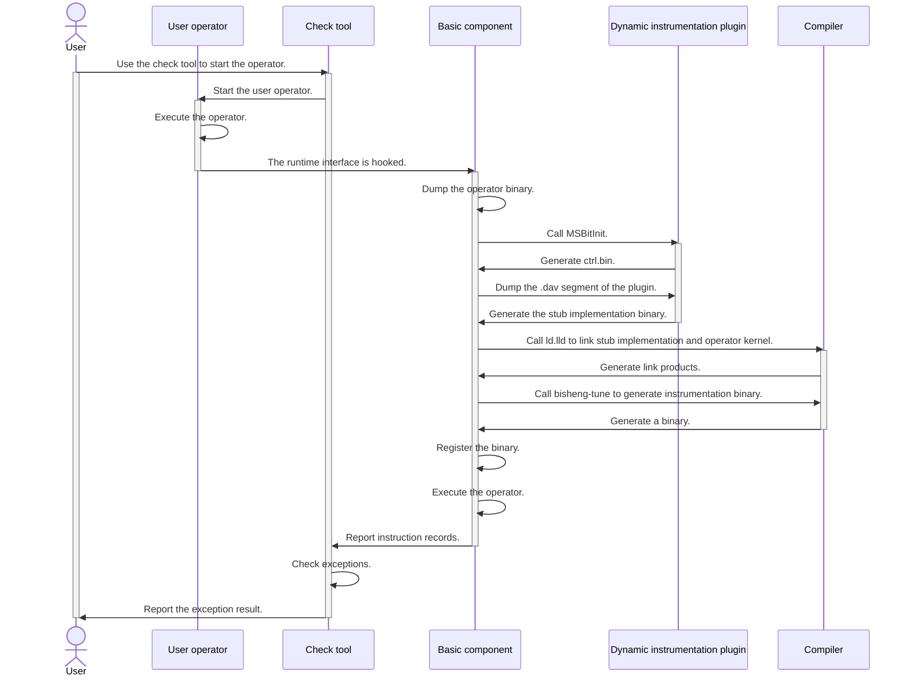
```mermaid
sequenceDiagram
    actor user as User
    participant kernel as User operator
    participant sanitizer as Check tool
    participant injection as Basic component
    participant plugin as Dynamic instrumentation plugin
    participant compiler as Compiler

    user->>sanitizer: Use the check tool to start the operator.
    activate user
    activate sanitizer
    sanitizer->>kernel: Start the user operator.
    activate kernel
    kernel->>kernel: Execute the operator.
    kernel->>injection: The runtime interface is hooked.
    deactivate kernel
    activate injection
    injection->>injection: Dump the operator binary.
    injection->>plugin: Call MSBitInit.
    activate plugin
    plugin->>injection: Generate ctrl.bin.
    injection->>plugin: Dump the .dav segment of the plugin.
    plugin->>injection: Generate the stub implementation binary.
    deactivate plugin
    injection->>compiler: Call ld.lld to link stub implementation and operator kernel.
    activate compiler
    compiler->>injection: Generate link products.
    injection->>compiler: Call bisheng-tune to generate instrumentation binary.
    compiler->>injection: Generate a binary.
    deactivate compiler
    injection->>injection: Register the binary.
    injection->>injection: Execute the operator.
    injection->>sanitizer: Report instruction records.
    deactivate injection
    sanitizer->>sanitizer: Check exceptions.
    sanitizer->>user: Report the exception result.
    deactivate user
    deactivate sanitizer
```

#### 5.4.4 Device-Side Check

The device-side check makes full use of the scalar computing resources and is directly completed during kernel running. The check process consists of three steps:

1. **Tensor information transfer**: Write the addresses and lengths of the input and output tensors of the operator to the specified location of the pre-allocated GM.
2. **Out-of-bounds check**: Perform the check while processing data. Traverse TensorInfo to determine whether the memory access is within the valid range.
3. **Check result report**: Write the result to the GM and report it to the tool after the kernel execution is complete.

Precautions: The scalar provides limited compute capability; performance implications must be considered. The C++ standard library containers are not supported. Intermediate results must be persisted in GM.

---

## 6. Module Interaction

### 6.1 Logical View

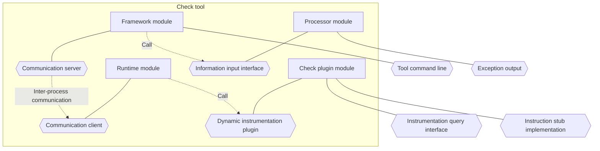
```mermaid
graph TB
    subgraph sanitizer[Check tool]
        framework[Framework module]
        processor[Processor module]
        runtime[Runtime module]
        plugin[Check plugin module]
        record_input{{"Information input interface"}}
        server{{"Communication server"}}
        client{{"Communication client"}}
        dbi_plugin{{"Dynamic instrumentation plugin"}}

        processor --- record_input
        framework --- server
        runtime --- client
        plugin --- dbi_plugin

        framework -.->|Call| record_input
        server -.->|Inter-process communication| client
        runtime -.->|Call| dbi_plugin
    end

    framework_cli{{"Tool command line"}}
    query{{"Instrumentation query interface"}}
    instruction{{"Instruction stub implementation"}}
    output{{"Exception output"}}

    framework --- framework_cli
    processor --- output
    plugin --- query
    plugin --- instruction
```

### 6.2 Data Flow

```mermaid
flowchart TD
    CLI[User command line] --> Framework[Framework module]
    Framework --Configuration options --> Runtime[Runtime module]
    Runtime --Runtime information --> Framework
    Framework --Runtime information --> Processor[Processor module]
    Processor --Exception report --> User[User]
    Plugin[Check plugin module] --Policy query --> Compiler[Compiler]
    Compiler -- Instrumentation function call --> Plugin
```

---

## 7 Interface Design

### 7.1 Command Line Interfaces

<a id="command-line-interface-desc"></a>

**Main command options**

| Command| Description|
|-----|---------|
| `-h, --help` | Displays the help information about the tool.|
| `-v, --version` | Queries the version information|
| `-t, --tool <name>` | Specifies the check tool module: `memcheck`, `racecheck`, `initcheck`, and `synccheck`.|Separate multiple tools with a pipe ( `\` ) to enable them simultaneously (e.g., `memcheck \ racecheck`). By default, all tools are enabled.| |
| `--log-file <file>` | Saves log information to a specified file. If no file is specified, the log information is printed.|
| `--log-level <level>` | Specifies the print level. The default value is `warn`.|
| `--max-debuglog-size <size>` | Specifies the size of a single debug log file.|
| `--kernel-name <string>` | Specifies the name of the kernel to be checked (only in graph offload mode). By default, all kernels are checked.|
| `--block-id <uint>` | Specifies the core to be checked. When this option is enabled, cross-core check is suppressed. By default, all cores are checked.|
| `--cache-size <uint>` | Specifies the amount of cache resources allocated to each core, in MB. The default value is `100`.|
| `--full-backtrace <yes\|no>` | Enables complete call stack printing.|
| `--demangle <mode>` | Specifies the symbol name restoration mode.|

**Memory check sub-options**

| Command| Description|
|-----|---------|
| `--leak-check <yes\|no>` | Checks for memory leak.|
| `--check-unused-memory <yes\|no>` | Checks for unused memory.|
| `--check-device-heap <yes\|no>` | Checks for memory exceptions in the HAL interfaces.|
| `--check-cann-heap <yes\|no>` | Checks for memory exceptions in the ACL Interfaces.|

### 7.2 Inter-process Communication Interfaces

<a id="process-communication-interface-desc"></a>

```c++
class CommunicationServer {
public:
    using ClientId = std::size_t;
    using MsgResponseFunc = std::function<void(const std::string&)>;
    using MsgHandleFunc = std::function<void(std::string, MsgResponseFunc&)>;
    using ClientConnectHook = std::function<void(ClientId)>;

    explicit CommunicationServer(const std::string& socketPath);
    void RegisterMsgHandler(const MsgHandleFunc &func);
    void StartListen();
    void Listen(ClientId clientId);
    Result Read(ClientId clientId, std::string &msg);
    Result Write(ClientId clientId, std::string const& msg);
    void SetClientConnectHook(ClientConnectHook &&hook);
    void Close();
};

class CommunicationClient {
public:
    explicit CommunicationClient(std::string socketPath);
    Result ConnectToServer();
    Result Read(std::string &msg);
    Result Write(std::string const &msg);
};
```

### 7.3 Communication Protocols

<a id="process-communication-protocol-desc"></a>

The communication process between the framework module and the runtime module is as follows.

```mermaid
sequenceDiagram
    title Communication process between the framework module and the runtime module
    participant framework as Framework module
    participant runtime as Runtime module

    framework->>runtime: Send tool configuration (Config).
    loop Runtime information
        alt Send device information.
            runtime->>framework: PacketType::DEVICE_SUMMARY
            runtime->>framework: DeviceInfoSummary
        else Send operator information.
            runtime->>framework: PacketType::KERNEL_SUMMARY
            runtime->>framework: KernelSummary
        else Send the operator binary.
            runtime->>framework: PacketType::KERNEL_BINARY
            runtime->>framework: char[]
        else Send the host memory operation record.
            runtime->>framework: PacketType::HOST_RECORD
            runtime->>framework: HostMemRecord
        else Send the kernel memory operation record.
            runtime->>framework: PacketType::KERNEL_RECORD
            runtime->>framework: char[]
        else Send the IPC operation record.
            runtime->>framework: PacketType::IPC_RECORD
            runtime->>framework: IPCMemRecord
        else: Send SanitizerRecord.
            runtime->>framework: PacketType::SANITIZER_RECORD
            runtime->>framework: SanitizerRecord
        end
    end
```

**Core protocol structure**

```c++
struct Config {
    bool defaultCheck;
    bool memCheck;
    bool raceCheck;
    bool initCheck;
    bool syncCheck;
    bool registerCheck;
    bool checkDeviceHeap;
    bool checkCannHeap;
    bool leakCheck;
    bool checkUnusedMemory;
    bool isPrintFullStack{false};
    int16_t checkBlockId = -1;
    uint32_t cacheSize = 100;
    DemangleMode demangleMode{DemangleMode::FULL_DEMANGLED_NAME};
    char pluginPath[PLUGIN_PATH_MAX];
    char kernelName[KERNEL_NAME_MAX];
    char dumpPath[DUMP_PATH_MAX];
};

enum class PacketType : uint32_t {
    DEVICE_SUMMARY = 0,
    KERNEL_SUMMARY,
    KERNEL_BINARY,
    LOG_STRING,
    HOST_RECORD = 1000,
    KERNEL_RECORD,
    IPC_RECORD,
    SANITIZER_RECORD,
    IPC_RESPONSE = 3000,
    KERNEL_RECORD_RESPONSE,
    INVALID = ~0U,
};

struct DeviceInfoSummary {
    DeviceType device;
    uint32_t blockSize;
    uint32_t blockNum;
    int32_t deviceId;
};

struct KernelSummary {
    uint64_t pcStartAddr;
    uint32_t blockDim;
    KernelType kernelType;
    bool isKernelWithDBI;
    bool hasDebugLine;
    char kernelName[KERNEL_NAME_MAX];
};

struct HostMemRecord {
    MemOpType type;
    MemInfoSrc infoSrc;
    MemInfoDesc infoDesc;
    uint64_t srcAddr;
    uint64_t dstAddr;
    uint64_t memSize;
    uint64_t paramsNo;
    uint64_t rootAddr;
};
```

### 7.4 Runtime Module Interfaces

<a id="runtime-injection-interface-list"></a>

**HAL interfaces**

| Interface| Description|
|-----|------|
| `halMemAlloc(void **, uint64_t, uint64_t)` | Records and reports memory allocation information.|
| `halMemFree(void *)` | Records and reports memory release information.|
| `drvMemsetD8(DVdeviceptr, size_t, uint8_t, size_t)` | Records and reports memory initialization information.|
| `drvMemcpy(DVdeviceptr, size_t, DVdeviceptr, size_t)` | Records and reports memory copy information.|
| `halMemCpyAsync(DVdeviceptr, size_t, DVdeviceptr, size_t, uint64_t *)` | Records and reports asynchronous memory copy information.|

**ACL interfaces**

| Interface| Description|
|-----|------|
| `aclrtMalloc / aclrtMallocCached / acldvppMalloc` | Records and reports memory allocation information.|
| `aclrtFree` | Records and reports memory release information.|
| `aclrtMemset / aclrtMemsetAsync` | Records and reports memory initialization information.|
| `aclrtMemcpy / aclrtMemcpyAsync` | Records and reports memory copy information.|
| `aclrtMemcpy2d / aclrtMemcpy2dAsync` | Records and reports 2D memory copy information.|

### 7.5 Check Plugin Interfaces

<a id="sanitizer-plugin-strategy-query"></a>

**Instrumentation policies**

```c++
#define NO_INSTRUMENTATION 0       // No instrumentation
#define INSTRUMENTATION_BEFORE 1   // Instrumentation before the original function
#define INSTRUMENTATION_AFTER 2    // Instrumentation after the original function
#define FUNC_SUBSTITUTION 3        // In-place replacement by instrumentation
```

**Policy query interface**

```c++
extern "C" uint32_t NeedReport(const char *decoratedName);
```

<a id="sanitizer-plugin-intrinsics-interface-desc"></a>

**Instruction instrumentation interface mode**

```c++
// Original instruction
void someInstruction(instructionParams...);
// Pre-instrumentation
void __sanitizer_report_someInstruction(__gm__ uint8_t *memInfo, locationInfo..., instructionParams...);
// Post-instrumentation
void __sanitizer_report_post_someInstruction(__gm__ uint8_t *memInfo, locationInfo..., instructionParams...);
// In-place instrumentation
void __sanitizer_report_inplace_someInstruction(__gm__ uint8_t *memInfo, locationInfo..., instructionParams...);
```

**Extensible MSTX instruction stub interface**

```c++
void __mstx_dfx_report_stub(uint32_t interfaceId, uint32_t bufferLens, void *buffer);
```

### 7.6 Processor Module Interfaces

<a id="sanitizer-interface-data-desc"></a>

**Check algorithm base class interface**

```c++
class SanitizerBase {
public:
    using MSG_GEN = Generator<DetectionInfo>;
    using MSG_FUNC = std::function<void(const LogLv &lv, MSG_GEN &&gen)>;
    virtual bool SetDeviceInfo(DeviceInfoSummary const &deviceInfo, Config const &config) = 0;
    virtual bool SetKernelInfo(KernelSummary const &kernelInfo) = 0;
    virtual void Do(const SanitizerRecord &record, const std::vector<SanEvent> &events) = 0;
    virtual void ParseOnlineError(const KernelErrorRecord &record, BlockType blockType, uint64_t serialNo) = 0;
    virtual bool CheckRecordBeforeProcess(const SanitizerRecord &record) = 0;
    virtual void RegisterNotifyFunc(const MSG_FUNC &func) = 0;
    virtual void Exit() = 0;
};
```

**Algorithm factory and registration interface**

```c++
class SanitizerFactory {
public:
    using SanitizerCreater = std::function<std::shared_ptr<SanitizerBase>()>;
    static SanitizerFactory& GetInstance() noexcept;
    std::shared_ptr<SanitizerBase> Create(const ToolType tool);
    void RegisteCreater(const ToolType tool, const SanitizerCreater& func);
};

class RegisteSanitizer {
public:
    RegisteSanitizer(ToolType tool, const SanitizerFactory::SanitizerCreater &func);
};
```

---

## 8 Interaction Model and Concurrency Model

### 8.1 Inter-process Communication Model

#### 8.1.1 Technology Selection

| Solution| Advantages| Disadvantages|
|------|-----|------|
| Anonymous pipe| Simple| Unidirectional communication, not suitable for bidirectional interaction|
| Shared memory| High performance| Complex synchronization, difficult to expand|
| **Unix Domain Socket** | **Full-duplex, multi-client, mature, and stable** | **Slightly lower performance than that of shared memory**|

**Decision: Unix domain socket**, which supports asymmetric full-duplex communication and naturally supports multi-client connections.

#### 8.1.2 Communication Model Design

```mermaid
sequenceDiagram
    title Time sequence diagram of the socket connection process
    participant Server
    participant Client

    activate Server
    activate Client
    Server->>Server: create socket
    Client->>Client: create socket
    Server->>Server: bind/listen
    Server->>Server: accept
    Client->>Server: connect
    loop Communication loop
        alt server to client
            Server->>Client: write/read
        else client to server
            Client->>Server: write/read
        end
    end
    Client->>Client: close
    Server->>Server: close
```

### 8.2 Multi-Client Concurrency Model

In the multi-device scenario, the user program initializes multiple devices through multiple threads or processes. Each thread creates an independent communication client to connect to the tool. The server creates a sub-thread for each client connection.

```mermaid
sequenceDiagram
    title Time sequence diagram of multi-client concurrent communication
    participant Client0 as Client 0
    participant Server
    participant Client1 as Client 1
    participant sub0 as subthread 0
    participant sub1 as subthread 1

    Server->>Server: create socket
    Client0->>Client0: create socket
    Client1->>Client1: create socket
    Server->>Server: bind/listen
    loop accepted client num < max client num
        Server->>Server: accept
        par client 0 connected
            Client0->>Server: connect
            Server->>sub0: create
            alt server to client
                sub0->>Client0: write/read
            else client to server
                Client0->>sub0: write/read
            end
            sub0->>Server: reduce message
        and client 1 connected
            Client1->>Server: connect
            Server->>sub1: create
            alt server to client
                sub1->>Client1: write/read
            else client to server
                Client1->>sub1: write/read
            end
            sub1->>Server: reduce message
        end
    end
```

The observer pattern is used to decouple the communication module from the service logic.

```c++
using MsgResponseFunc = std::function<void(const std::string&)>;
using MsgHandleFunc = std::function<void(std::string, MsgResponseFunc&)>;
void RegisterMsgHandler(const MsgHandleFunc &func);
```

**Multi-client read/write management**

- Clients are numbered from 0 based on the connection sequence, and the type is `std::size_t`.
- The server read/write interface must provide a `ClientId` to identify the target client.

**Concurrency security considerations**

The message callback function of the framework module is concurrently called in multiple client sub-threads. The serial and parallel boundaries must be clearly defined. The solutions for main side effects include:

- Lock the access to global/static variables, or generate an independent object instance for each thread.
- Add a thread ID suffix to the file name during file writing to ensure that multiple threads write data independently.

---

## 9 Code Directory Structure

```text
mssanitizer/
├── build.py                    # Build script entry
├── download_dependencies.py    # Dependency management script
├── dependencies.json           # Dependency configuration
├── CMakeLists.txt              # CMake entry for development and building
├── cmake/
│   ├── CMakeLists.txt          # Entry for integrated build (including packaging)
│   ├── options.cmake           # Build options
│   └── module/                 # CMake modules (such as SecureC and LLVM)
├── csrc/                       # Core C++ source code
│   ├── main.cpp                # Program entry
│   ├── core/                   # Framework module
│   │   └── framework/          # CLI parsing, process control, IPC, and record parsing
│   ├── address_sanitizer/      # Memory check module
│   ├── race_sanitizer/         # Race check module
│   ├── sync_sanitizer/         # Synchronization check module
│   ├── register_sanitizer/     # Register check module
│   ├── hooks/                  # Runtime hooks
│   │   ├── hal_hooks/          # HAL hooks
│   │   ├── acl_hooks/          # ACL hooks
│   │   └── ascendc_hooks/      # AscendC hooks
│   ├── plugin/                 # Check plugin
│   │   └── ccec/               # AscendC instruction parsing and DBI
│   ├── stub_def/               # Stub definition (combined by scenario)
│   └── include/                # Public header files
├── msopscommon/                # Common components (sub-repository)
├── thirdparty/                 # Third-party dependencies (sub-repository)
├── test/                       # Unit test
├── package/                    # Packaging configuration and script
├── docs/                       # Project documents
└── README.md
```

**Build products**

| **Product**| Description|
|-----|------|
| `mssanitizer.bin` | Executable file of the main program|
| `libascend_san.so` | Shared library for checks|
| `libascend_san_stub.so` | Shared library for stubs|
| `libascend_hal_hook.so` | HAL hook library|
| `libascend_acl_hook.so` | ACL hook library|
| `libascendc_hook.so` | AscendC hook library|
| `libmssanitizer_injection.so` | AscendC single-operator injection library|
| `libsanitizer_api.so` | Instrumentation query library|
| `libsanplugin_boundscheck.so` | Dynamic instrumentation plugin|

---

## 10 Design Decisions

| Item| Selection| Reason|
|-----|------|------|
| Inter-process communication| Unix Domain Socket | Full-duplex, multi-client support, and asymmetric architecture matching the C/S model|
| Instrumentation mode| Static + Dynamic| Static mode overrides compile-time checkpoints with support for call stack. Dynamic mode supplements runtime information without requiring recompilation.|
| Check algorithm extension| Plugin + SanitizerFactory/RegisteSanitizer registration mechanism| Different check types are implemented independently, and algorithm registration is supported for easy extension.|
| Algorithm execution| Producer-consumer parallel model| Each ToolType has an independent consumer thread. Algorithms do not depend on data from each other. Multi-core CPUs are fully utilized to shorten the total check time.|
| Runtime hooking| LD_PRELOAD + layered hooking| The hooking logic aligns with the CANN software stack layered architecture, and each layer is hooked independently to minimize coupling.|
| Multi-client concurrency| Multiple threads + Observer mode| Each client has an independent sub-thread for processing. The callback mechanism decouples communication from services.|
| Device-side check| Concurrent processing and check| It can be adapted to the limited scalar computing power and workspace constraints of the device.|
| Build system| CMake | As the standard selection for a C++ project, it supports complex dependencies and cross-compilation.|

---

## Appendix

### A. Interface Index

| Interface Document| Section Link|
|---------|---------|
| Tool command line options| [7.1 Command Line Interfaces](#71-command-line-interfaces)|
| Inter-process communication interfaces| [7.2 Inter-process Communication Interfaces](#72-inter-process-communication-interfaces)|
| Communication protocol| [7.3 Communication Protocols](#73-communication-protocols)|
| Runtime module interfaces| [7.4 Runtime Module Interfaces](#74-runtime-module-interfaces)|
| Check plugin interfaces| [7.5 Check Plugin Interfaces](#75-check-plugin-interfaces)|
| Processor module interfaces| [7.6 Processor Module Interfaces](#76-processor-module-interfaces)|
