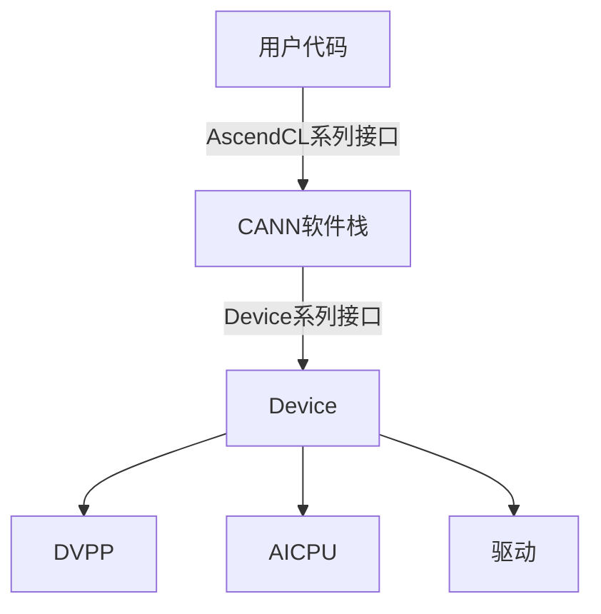

# 基础案例

<br>

## 1. 检测内核调用符方式的Ascend C算子

### 1.1 操作步骤

1. 参考《[MindStudio Sanitizer 安装指南](../install_guide/mssanitizer_install_guide.md)》完成相关环境变量的配置。
2. 请参考《[开启全量检测](../user_guide/compile_option_config.md)》中的“内核调用符场景”，完成使用前准备。
3. 构建单算子可执行文件。

    以Add算子为例，可执行文件的构建命令示例如下：

    ```shell
    bash run.sh -r npu -v <soc_version>
    ```

    一键式编译运行脚本完成后，在工程目录下生成NPU侧可执行文件`_<kernel_name>_npu_`。

    > [!NOTE]
    > 若编译过程中出现 acl/acl.h 头文件找不到的问题，则可以手动在对应的cmake/npu/CMakeLists.txt中增加对应头文件路径：
    >
    > ```cmake
    > target_include_directories(${smoke_testcase}_npu PRIVATE
    >    ${$ASCEND_HOME_PATH}/aarch64-linux/include/
    > )
    > ```
    >
    > 如果是x86环境，请将路径中的"aarch64-linux"换成"x86_64-linux"

4. 使用msSanitizer检测工具拉起单算子可执行文件（以_add_npu_为例）。

    - 内存检测执行以下命令，具体参数说明请参考《[MindStudio Sanitizer 使用指南](../user_guide/mssanitizer_user_guide.md)》中的“命令与参数参考>参数汇总>通用参数说明表”和《[MindStudio Sanitizer 使用指南](../user_guide/mssanitizer_user_guide.md)》中的“命令与参数参考>参数汇总>内存检测参数说明表”，内存检测请参考[内存检测示例说明](#12-内存检测示例说明)。

    ```shell
    mssanitizer --tool=memcheck ./add_npu   # 内存检测需指定 --tool=memcheck
    ```

    - 竞争检测执行以下命令，具体参数说明请参考《[MindStudio Sanitizer 使用指南](../user_guide/mssanitizer_user_guide.md)》中的“命令与参数参考>参数汇总>通用参数说明表”，竞争检测请参考[竞争检测示例说明](#13-竞争检测示例说明)。

    ```shell
    mssanitizer --tool=racecheck ./add_npu   # 竞争检测需指定 --tool=racecheck
    ```

    单算子可执行文件所在路径可配置为绝对路径或相对路径，请根据实际环境配置。

### 1.2 内存检测示例说明

- 在[操作步骤](#11-操作步骤)之前，需要在Add算子中构造一个非法读写的场景，将DataCopy内存拷贝长度从TILE_LENGTH改为2 * TILE_LENGTH，此时最后一次拷贝会发生内存读写越界。
- 根据检测工具输出的报告，可以发现在**add_custom.cpp**的65行对GM存在224字节的非法写操作，与我们构造的异常场景对应。

### 1.3 竞争检测示例说明

- 在[操作步骤](#11-操作步骤)之前，需要在Add算子中构造一个核间竞争的场景，将DataCopy内存拷贝长度从TILE_LENGTH改为2 * TILE_LENGTH，此时会在GM内存上存在核间竞争。
- 根据检测工具输出的报告，可以发现在**add_kernel.cpp**的65行，AIV的0核和1核存在核间竞争，符合我们构造的异常场景。

## 2. 检测API调用的单算子

完成自定义算子的开发部署后，通过单算子API执行的方式调用，添加检测相关编译选项重新编译算子并部署，使用msSanitizer工具运行可执行文件实现算子进行异常检测。

### 2.1 前提条件

单击[AclNNInvocation示例代码](https://gitee.com/ascend/samples/tree/master/operator/ascendc/0_introduction/1_add_frameworklaunch/AclNNInvocation)获取样例工程，为进行算子检测做准备。

> [!NOTE]
>
> - 此样例工程不支持Atlas A3 训练系列产品/Atlas A3 推理系列产品。
> - 下载代码样例时，需执行以下命令指定分支版本。
>
> ```shell
> git clone https://gitee.com/ascend/samples.git -b v0.2-8.0.0.beta1
> ```

### 2.2 操作步骤

1. 执行以下命令，生成自定义算子工程，并进行Host侧和Kernel侧的算子实现。

    ```shell
    bash install.sh -v Ascendxxxyy    # xxxyy为用户实际使用的具体芯片类型
    ```

2. 请参考《[MindStudio Ops Generator工具用户指南](https://gitcode.com/Ascend/msopgen/blob/master/docs/zh/user_guide/msopgen_user_guide.md)》中的“算子编译部署”章节，完成算子的编译部署。

    > [!NOTE]
    > 在样例工程的`${git_clone_path}/samples/operator/ascendc/0_introduction/1_add_frameworklaunch/CustomOp`目录下，修改在op_kernel/CMakeLists.txt文件，在Kernel侧实现中增加检测选项-sanitizer，以支持检测功能
    >
    > ```cmake
    > npu_op_kernel_options(ascendc_kernels ALL OPTIONS -sanitizer)
    > ```
    >

3. 单击[前提条件](#21-前提条件)，获取验证代码的样例工程目录。

    ```text
    ├──input                                                 // 存放脚本生成的输入数据目录
    ├──output                                                // 存放算子运行输出数据和真值数据的目录
    ├── inc                           // 头文件目录
    │   ├── common.h                 // 声明公共方法类，用于读取二进制文件
    │   ├── operator_desc.h          // 算子描述声明文件，包含算子输入/输出，算子类型以及输入描述与输出描述
    │   ├── op_runner.h              // 算子运行相关信息声明文件，包含算子输入/输出个数，输入/输出大小等
    ├── src
    │   ├── CMakeLists.txt    // 编译规则文件
    │   ├── common.cpp         // 公共函数，读取二进制文件函数的实现文件
    │   ├── main.cpp    // 单算子调用应用的入口
    │   ├── operator_desc.cpp     // 构造算子的输入与输出描述
    │   ├── op_runner.cpp   // 单算子调用主体流程实现文件
    ├── scripts
    │   ├── verify_result.py    // 真值对比文件
    │   ├── gen_data.py    // 输入数据和真值数据生成脚本文件
    │   ├── acl.json    // acl配置文件
    ```

4. 使用检测工具拉起算子API运行脚本。

    ```shell
      mssanitizer --tool=memcheck bash run.sh  # 内存检测需指定 --tool=memcheck
      mssanitizer --tool=racecheck bash run.sh # 竞争检测需指定 --tool=racecheck
    ```

5. 参考《[MindStudio Sanitizer 使用指南](../user_guide/mssanitizer_user_guide.md)》中的“内存检测>内存异常报告解析”、“竞争检测>竞争异常报告解析”及“未初始化检测>未初始化异常报告解析”分析异常行为。

## 3. 检测PyTorch接口调用的算子

### 3.1 前提条件

- 单击[AddCustom示例代码](https://gitee.com/ascend/samples/tree/master/operator/ascendc/0_introduction/1_add_frameworklaunch/AddCustom)获取样例工程，为进行算子检测做准备。

> [!NOTE]
>
> - 此样例工程仅支持Python3.9，若要在其他Python版本上运行，需要修改`${git_clone_path}/samples/operator/ascendc/0_introduction/1_add_frameworklaunch/PytorchInvocation`目录下`run_op_plugin.sh`文件中的Python版本。
> - 此样例工程不支持Atlas A3 训练系列产品/Atlas A3 推理系列产品。
> - 下载代码样例时，需执行以下命令指定分支版本。
>
> ```shell
> git clone https://gitee.com/ascend/samples.git -b master
> ```

- 已参考《[Ascend Extension for PyTorch 软件安装指南](https://www.hiascend.com/document/detail/zh/Pytorch/2600/configandinstg/instg/docs/zh/installation_guide/installation_description.md)》，完成PyTorch框架和torch_npu插件的安装。

### 3.2 操作步骤

1. 执行以下命令，生成自定义算子工程，并进行Host侧和Kernel侧的算子实现。

    ```shell
      bash install.sh -v Ascendxxxyy    # xxxyy为用户实际使用的具体芯片类型
    ```

2. 参考《[MindStudio Ops Generator工具用户指南](https://gitcode.com/Ascend/msopgen/blob/master/docs/zh/user_guide/msopgen_user_guide.md)》中的“算子编译部署”章节，完成算子的编译部署。

    > [!NOTE]
    > 编辑样例工程目录`${git_clone_path}/samples/operator/ascendc/0_introduction/1_add_frameworklaunch/CustomOp/op_kernel`下的CMakeLists.txt文件，增加编译选项-sanitizer。
    >
    > ```cmake
    > npu_op_kernel_options(ascendc_kernels ALL OPTIONS -sanitizer)
    > ```

3. 进入[PyTorch接入工程](https://gitee.com/ascend/samples/tree/master/operator/ascendc/0_introduction/1_add_frameworklaunch/PytorchInvocation)，使用PyTorch调用方式调用AddCustom算子工程，并按照指导完成编译。

    ```text
      PytorchInvocation
      ├── op_plugin_patch
      ├── run_op_plugin.sh      //  执行样例时需要使用
      └── test_ops_custom.py    //  启动工具时需要使用
    ```

4. 执行样例，样例执行过程中会自动生成测试数据，然后运行PyTorch样例，最后检验运行结果。

    ```text
      bash run_op_plugin.sh
      -- CMAKE_CCE_COMPILER: ${INSTALL_DIR}/toolkit/tools/ccec_compiler/bin/ccec
      -- CMAKE_CURRENT_LIST_DIR: ${INSTALL_DIR}/AddKernelInvocation/cmake/Modules
      -- ASCEND_PRODUCT_TYPE:
        Ascendxxxyy
      -- ASCEND_CORE_TYPE:
        VectorCore
      -- ASCEND_INSTALL_PATH:
        /usr/local/Ascend/cann
      -- The CXX compiler identification is GNU 10.3.1
      -- Detecting CXX compiler ABI info
      -- Detecting CXX compiler ABI info - done
      -- Check for working CXX compiler: /usr/bin/c++ - skipped
      -- Detecting CXX compile features
      -- Detecting CXX compile features - done
      -- Configuring done
      -- Generating done
      -- Build files have been written to: ${INSTALL_DIR}/AddKernelInvocation/build
      Scanning dependencies of target add_npu
      [ 33%] Building CCE object cmake/npu/CMakeFiles/add_npu.dir/__/__/add_custom.cpp.o
      [ 66%] Building CCE object cmake/npu/CMakeFiles/add_npu.dir/__/__/main.cpp.o
      [100%] Linking CCE executable ../../../add_npu
      [100%] Built target add_npu
      ${INSTALL_DIR}/AddKernelInvocation
      INFO: compile op on ONBOARD succeed!
      INFO: execute op on ONBOARD succeed!
      test pass
    ```

5. 启动msSanitizer工具拉起Python程序，进行异常检测，异常检测功能的开启原则请参见《[MindStudio Sanitizer 使用指南](../user_guide/mssanitizer_user_guide.md)》中的“检测功能组合规则”。
6. 参考《[MindStudio Sanitizer 使用指南](../user_guide/mssanitizer_user_guide.md)》中的“内存检测>内存异常报告解析”、“竞争检测>竞争异常报告解析”及“未初始化检测>未初始化异常报告解析”分析异常行为。

## 4. 检测Triton算子

### 4.1 前提条件

- 参考[triton-ascend仓](https://gitcode.com/Ascend/triton-ascend)，完成Triton及Triton-Ascend插件的安装和配置。
- 为了防止未重新编译的算子造成影响，建议您启用以下环境变量：

    ```sh
    export TRITON_ALWAYS_COMPILE=1
    ```

- 自备Triton算子实现文件。

    若用户尚未准备Triton算子，可参考以下示例。本节将基于此示例来说明Triton算子的检测流程。

    ```py
    # file name: sample.py
    import triton
    import triton.language as tl
    import torch

    def torch_pointwise(x0, x1):
        res = x0 + x1
        return res


    @triton.jit
    def triton_add(in_ptr0, in_ptr1, out_ptr0, XBLOCK: tl.constexpr, XBLOCK_SUB: tl.constexpr):
        offset = tl.program_id(0) * XBLOCK
        base1 = tl.arange(0, XBLOCK_SUB)
        loops1: tl.constexpr = (XBLOCK + XBLOCK_SUB - 1) // XBLOCK_SUB
        for loop1 in range(loops1):
            x0 = offset + (loop1 * XBLOCK_SUB) + base1
            tmp0 = tl.load(in_ptr0 + (x0), None)
            tmp1 = tl.load(in_ptr1 + (x0), None)
            tmp2 = tmp0 + tmp1
            tl.store(out_ptr0 + (x0), tmp2, None)


    def test_case(dtype, shape, ncore, xblock, xblock_sub):
        x0 = torch.randn(shape, dtype=dtype).npu()
        x1 = torch.randn(shape, dtype=dtype).npu()
        y_ref = torch_pointwise(x0, x1)
        y_cal = torch.zeros(shape, dtype=dtype).npu()
        triton_add[ncore, 1, 1](x0, x1, y_cal, xblock, xblock_sub)
        print("Pass" if torch.equal(y_ref, y_cal) else "Failed")


    if __name__ == "__main__":
        test_case(torch.float32, (2, 4096, 8), 2, 32768, 1024)
    ```

### 4.2 操作步骤

1. 请参考《[开启全量检测](../user_guide/compile_option_config.md)》中的“Triton算子调用场景”，完成使用前准备。
2. 关闭内存池。
    样例中使用PyTorch创建Tensor，PyTorch框架内默认使用内存池的方式管理GM内存，会对内存检测产生干扰。因此，在检测前需要额外设置如下环境变量关闭内存池，以保证检测结果准确。

    ```sh
    export PYTORCH_NO_NPU_MEMORY_CACHING=1
    ```

3. 在Triton算子中构造一个非法读写的场景，将第一次load的内存向右偏移100个元素，此时会导致load在GM内存上发生非法读。

    ```python
      def triton_add(in_ptr0, in_ptr1, out_ptr0, XBLOCK: tl.constexpr, XBLOCK_SUB: tl.constexpr):
          offset = tl.program_id(0) * XBLOCK
          base1 = tl.arange(0, XBLOCK_SUB)
          loops1: tl.constexpr = (XBLOCK + XBLOCK_SUB - 1) // XBLOCK_SUB
          for loop1 in range(loops1):
              x0 = offset + (loop1 * XBLOCK_SUB) + base1
              # ERROR: 构造非法读异常
              tmp0 = tl.load(in_ptr0 + (x0) + 100, None)
              tmp1 = tl.load(in_ptr1 + (x0), None)
    ```

4. 使用msSanitizer检测工具拉起Triton算子。具体参数说明请参考《[MindStudio Sanitizer 使用指南](../user_guide/mssanitizer_user_guide.md)》中的“命令与参数参考>参数列表>通用参数说明表”和《[MindStudio Sanitizer 使用指南](../user_guide/mssanitizer_user_guide.md)》中的“命令与参数参考>参数列表>内存检测参数说明表”，内存检测请参考《[MindStudio Sanitizer 使用指南](../user_guide/mssanitizer_user_guide.md)》中的“内存检测”。

    ```shell
      mssanitizer --tool=memcheck --log-level=error -- python sample.py # --log-level=error 只输出 ERROR 级别告警，防止 WARNING 级别刷屏影响使用
    ```

### 4.3 内存异常报告示例

根据检测工具输出的报告，可以发现在sample.py的18行对GM存在368字节的非法读操作，与构造的异常场景一致。

```text
$ mssanitizer -t memcheck -- python sample.py
[mssanitizer] logging to file: ./mindstudio_sanitizer_log/mssanitizer_20250522093805_922880.log
Failed
====== ERROR: illegal read of size 368
======    at 0x12c0c0053190 on GM in triton_add
======    in block aiv(1) on device 0
======    code in pc current 0x1b0 (serialNo:524)
======    #0 sample.py:18:45
```

## 5. 检测CANN软件栈的内存

针对用户程序调用CANN软件栈接口可能出现的内存异常操作场景，msSanitizer检测工具提供了Device相关接口和AscendCL相关接口的内存检测能力，方便用户对程序内存异常操作位置的排查和定位。

### 5.1 内存泄漏检测使用原理

当**npu-smi info**命令查询到的设备内存不断增大时，可使用本工具进行内存泄漏定位定界，若AscendCL系列接口泄漏可支持定位到代码行。

如下图所示，CANN软件栈内存操作接口包含两个层级，向下使用驱动侧提供的Device侧接口，向上提供了AscendCL系列接口供用户代码调用。



内存泄漏定位可分为以下步骤：

1. 使能Device系列接口进行泄漏检测，判断内存泄漏是否发生在Host侧。若没有，则定界到Device侧的应用出现泄漏；若有，则通过下一个步骤判断AscendCL接口调用是否发生泄漏；
2. 使能AscendCL系列接口进行泄漏检测，判断用户代码调用AscendCL接口是否存在泄漏。若没有，则定界为非AscendCL接口调用问题；如果出现泄漏，则通过下一步定位到具体代码行；
3. 使用msSanitizer检测工具中提供的新接口，对头文件重新编译，再用检测工具拉起检测程序，可定位到未释放内存的分配函数所对应的文件名与代码行号。新接口的详细说明请参见《[MindStudio Sanitizer 对外接口使用说明](../api_reference/mssanitizer_api_reference.md)》。

### 5.2 排查步骤

1. 参考《[MindStudio Sanitizer 安装指南](../install_guide/mssanitizer_install_guide.md)》完成相关环境变量的配置。
2. 定界是否为Host侧泄漏。

    1. 使用msSanitizer检测工具拉起待检测程序，命令示例如下：

        ```shell
          mssanitizer --check-device-heap=yes --leak-check=yes ./add_npu
        ```

        待检测程序（以_add_custom_npu_为例）所在路径可配置为绝对路径或相对路径，请根据实际环境配置。

    2. 若无异常输出则说明检测程序运行成功，且Host侧不存在内存泄漏情况；若输出如下错误说明Host侧的应用出现了内存泄漏。

        以下输出结果表明Host侧共有一处分配了内存但未释放，导致内存泄漏32800字节。

        ```text
        ====== ERROR: LeakCheck: detected memory leaks

        ======    Direct leak of 32800 byte(s)
        ======      at 0x124080024000 on GM allocated in <unknown>:0 (serialNo:0)

        ====== SUMMARY: 32800 byte(s) leaked in 1 allocation(s)
        ```

3. 定界是否为AscendCL接口调用导致泄漏。

    1. 使用msSanitizer检测工具拉起待检测程序，命令示例如下：

          ```shell
            mssanitizer --check-cann-heap=yes --leak-check=yes ./add_npu
          ```

    2. 若无异常输出则说明检测程序运行成功，且AscendCL接口调用不存在内存泄漏情况；若输出如下错误说明AscendCL接口调用出现了内存泄漏。

        以下输出结果表明调用AscendCL接口时共有一处分配了内存但未释放，导致内存泄漏32768字节。

          ```text
          ====== ERROR: LeakCheck: detected memory leaks

          ======    Direct leak of 32768 byte(s)
          ======      at 0x124080024000 on GM allocated in <unknown>:0 (serialNo:0)

          ====== SUMMARY: 32768 byte(s) leaked in 1 allocation(s)
          ```
