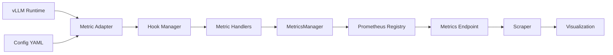
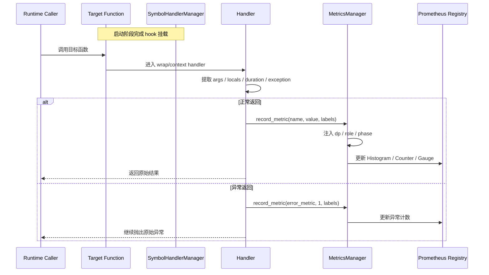
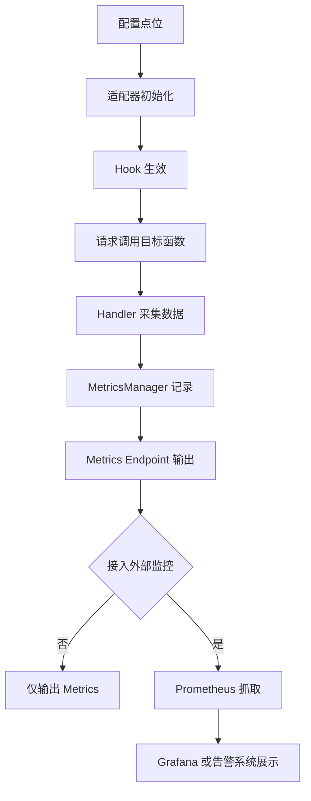
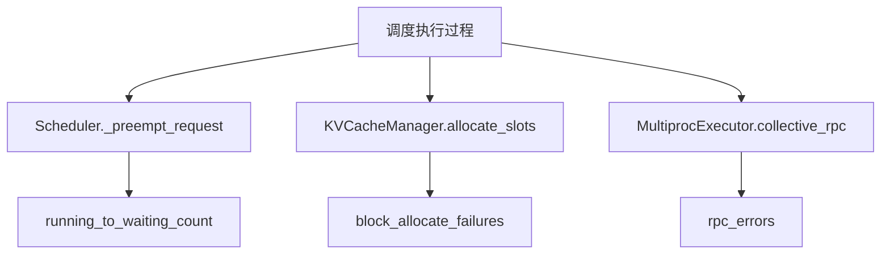
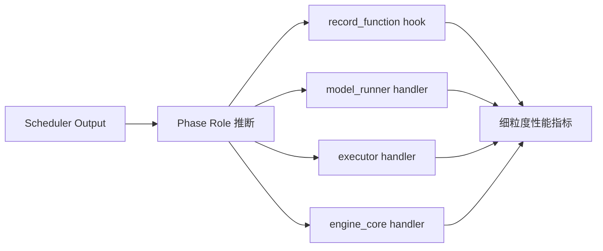

# 【B050】LLM推理监控平台设计文档

状态(Status): Draft
作者(Authors): @ChaseChe77
创建日期(Created): 2026-05-25
更新日期(Updated): 2026-05-25
相关 Issue/PR: !353, !345, !339

---

# 1. 概述

## 1.1 简介

本文档用于支撑需求【B050】LLM推理监控平台，但从当前实现内容看，范围聚焦于 `ms-service-metric` 在 vLLM-Ascend 服务化推理场景下新增的监控指标设计。

目标是在 vLLM 原生 `/metrics` 基础上，利用 `ms-service-metric` 补齐细粒度性能、EPLB 特性、异常状态和多维标签观测能力，并以 Prometheus 格式对外返回指标数据，供 Prometheus、Grafana 等兼容工具进行抓取和可视化。

本设计文档重点覆盖 `ms-service-metric` 相关 PR `!353`、`!345`、`!339` 的新增内容，同时说明 metrics 的工作原理、数据链路、指标分类、验收边界和后续扩展方向。

## 1.2 动机

当前 vLLM-Ascend 原生 metrics 能覆盖基础吞吐、时延、KVCache 等通用指标，但在实际服务化部署和问题定位场景中，还存在以下痛点：

- 缺少对 Worker 内部细粒度执行阶段的在线拆分观测，难以区分算子执行、CPU 抖动、调度等待、sample 阶段等不同耗时来源。
- 缺少对 EPLB 特性收益和代价的统一量化，无法从在线视角判断热度失衡是否改善、专家搬运是否带来额外开销。
- 缺少对异常状态的显式统计，发生 block 分配失败、running 回退 waiting、RPC 异常时，往往只能依赖日志被动排查。
- 现有指标虽然能被抓取，但缺少统一的 `dp/role/phase` 标签维度，导致 prefill/decode、不同 DP 域、不同角色的对比不够直观。

如果不补齐这些能力，线上问题会长期停留在“看得到服务变慢，但看不清慢在哪里、为什么慢、是否和调度/EPLB/异常相关”的状态，影响性能分析、容量评估和版本回归定位效率。

## 1.3 目标

本次设计目标如下：

- 明确【B050】LLM推理监控平台需求中 `ms-service-metric` 这一侧的指标增强方案，以及 `ms-service-metric -> vLLM /metrics` 的指标返回链路。
- 说明指标采集的实现原理，包括 hook、handler、registry、标签注入和多进程聚合机制。
- 纳入 `!339` 新增的异常状态监控能力：`running_to_waiting_count`、`block_allocate_failures`、`rpc_errors`。
- 纳入 `!345` 新增的 EPLB 和细粒度时延能力：EPLB 热度聚合/失衡指标、专家搬运相关时延、`npu:non_forward_duration` 等。
- 纳入 `!353` 对 phase 维度观测的增强，使 Worker/Executor/EngineCore 指标可按 `prefill/decode/mixed` 维度观测。
- 对照验收标准，明确哪些能力是平台已有能力，哪些是本轮补齐能力，哪些仍待后续扩展。

非目标如下：

- 不在本次文档中设计或承诺 Prometheus、Grafana 本身的部署、运维和看板交付。
- 不重复定义 vLLM 原生已经稳定提供的全部基础指标，仅说明与本平台集成关系。
- 不把尚未显式落地的能力包装成“已完成”。对于本文涉及的监控指标，仅描述当前代码分支已经具备或明确规划的能力边界。

# 2. 用例分析

本文档覆盖的 `ms-service-metric` 指标增强方案，主要面向以下几类核心场景：

- 性能看护场景：研发或运维需要持续观察 TPS、TTFT、TPOT、输入输出 token 数、Seqlen、KVCache、NPU 利用率等整体指标，判断服务是否达标。
- 细粒度诊断场景：当服务吞吐下降或时延抖动时，需要进一步拆分 `prepare input`、`forward`、`post process`、`sample_token`、`draft_token`、`sample_tokens`、`non_forward_duration` 等阶段，定位问题更接近 CPU 波动、算子执行、调度还是后处理。
- 特性收益评估场景：当启用 prefix cache、MTP、EPLB、DPLB 等特性后，需要判断特性是否真正带来收益，是否伴随额外代价。
- 异常监控场景：当出现请求回退、KV cache block 分配失败、driver 到 worker RPC 异常等情况时，需要通过 dashboard 和告警快速感知。
- 分角色对比场景：在 PD 分离或混合部署下，需要分别观察 prefill / decode / mixed 的表现，避免平均值掩盖局部问题。

针对以上场景，平台需要满足以下要求：

- 功能性：支持指标自动采集、在线暴露，并以 Prometheus 格式对外提供数据。
- 可观测性：支持 `dp`、`role`、`phase` 标签，便于按域、按角色、按阶段聚合。
- 兼容性：通过 YAML 配置和版本约束适配不同 vLLM / vLLM-Ascend 版本。
- 可维护性：新增指标尽量通过 hook 点位和 handler 解耦，不侵入业务逻辑。
- 可靠性：采集逻辑异常不能影响原始推理逻辑，异常时以降级和日志提示为主。

# 3. 方案设计

## 3.1 总体方案

### 3.1.1 总体架构

`ms-service-metric` 指标增强部分采用“轻量 hook 采集 + Prometheus 格式标准暴露”的方案：

1. `ms-service-metric` 在 vLLM 启动时初始化适配器。
2. 适配器加载 `v1_metrics.yaml`，根据配置找到目标 symbol。
3. `SymbolHandlerManager` 将 handler 挂载到目标函数，采集时延、计数或状态。
4. handler 将采集结果写入 `MetricsManager`。
5. `MetricsManager` 统一注册到 vLLM 的 Prometheus registry，并自动加上 `vllm_profiling_` 前缀。
6. vLLM 服务仍通过自身 `/metrics` 端口对外暴露数据。
7. 平台外部如需可视化，可由 Prometheus 抓取 `/metrics`，再由 Grafana 等兼容工具做聚合和展示。

总体架构如下图所示：



### 3.1.2 Metrics 大致原理

metrics 的核心原理可以概括为“在运行时找到目标函数，在函数执行前后拿到上下文，再把结果写入 Prometheus 指标对象”。

关键机制如下：

- 配置驱动：`ms_service_metric/adapters/vllm/config/v1_metrics.yaml` 描述要 hook 的 symbol、版本边界、handler 或 metric 配置。
- 动态 hook：`SymbolHandlerManager` 和 `HookHelper` 在运行时把 handler 挂到 vLLM / vLLM-Ascend 的目标函数上。
- handler 分类：
  - `wrap handler`：包裹原函数，适合做前后计时、异常捕获。
  - `context handler`：可访问函数局部变量，适合做更复杂的上下文抽取。
- 指标注册：`MetricsManager` 将业务指标映射到 Prometheus 的 `Histogram`、`Counter`、`Gauge` 等类型。
- 标签注入：`MetricsManager` 会自动补齐 `dp`、`role`、`phase` 标签；其中 `dp` 来自进程 rank，`role/phase` 来自 `meta_state` 或调用栈推断。
- 统一前缀：所有平台新增指标都会带 `vllm_profiling_` 前缀，与 vLLM 原生指标并存。
- 多进程聚合：通过 `PROMETHEUS_MULTIPROC_DIR` 和 vLLM 的 Prometheus registry，将多进程指标汇聚到同一 `/metrics` 暴露面。
- 可视化聚合：如接入 Grafana，`mean/max/min/last` 这类统计值主要基于 Prometheus 查询和 panel reducer 得到，不要求每个统计值都单独定义一个 metric。

从一次函数调用到最终指标暴露的时序如下：



### 3.1.3 数据链路

```text
vLLM / vLLM-Ascend Runtime
  -> ms-service-metric adapter initialize
  -> load YAML symbol config
  -> hook target function with handler
  -> record metric into MetricsManager
  -> register into vLLM prometheus registry
  -> expose from /metrics
  -> optional Prometheus scrape
  -> optional visualization / alert tools
```

如果从“配置 -> 采集 -> 暴露 -> 展示”的完整链路看，流程如下：



## 3.2 本轮新增能力设计

### 3.2.1 PR !339：异常状态监控

本轮在异常状态监控方面新增以下指标：

- `vllm_profiling_running_to_waiting_count_total{dp,role,phase}`
- `vllm_profiling_block_allocate_failures_total{dp,role,phase}`
- `vllm_profiling_rpc_errors_total{dp,role,phase,exception_type}`

对应 hook 点位如下：

- `Scheduler._preempt_request`
  - 统计 running 请求回退 waiting 的次数。
  - 该指标可视为 pending 请求回退/积压风险的一类观测信号。
  - 同时累计 `scheduler:recompute_events`，反映重计算触发。
- `KVCacheManager.allocate_slots`
  - 统计 block 分配失败。
  - 既覆盖返回失败对象，也覆盖直接抛异常的场景。
- `MultiprocExecutor.collective_rpc`
  - 统计 driver 到 worker 的 RPC 异常。
  - 仅记录实际 Python 异常类型，不虚构 reason 字段。

设计要点如下：

- Counter 类型适合异常事件累计，便于做速率、趋势和告警。
- `exception_type` 标签有助于按异常类别做聚合，但不会引入不受控的高基数字段。
- 该类指标优先强调“是否发生”和“发生频率”，而非耗时分布。

异常状态监控的关键流程如下：



### 3.2.2 PR !345：EPLB 特性与专家搬运耗时

本轮在 EPLB 方向新增两类能力：

1. EPLB 热度和失衡度量
2. 专家搬运及相关阶段耗时观测

新增指标包括：

- `eplb:expert_hotness:current_mean`
- `eplb:expert_hotness:current_max`
- `eplb:expert_hotness:update_mean`
- `eplb:expert_hotness:update_max`
- `eplb:expert_hotness:imbalance{rank,phase,layer}`
- `eplb:expert_weight_update:duration`
- `eplb:expert_map_update:duration`
- `eplb:log2phy_map_update:duration`
- `eplb:expert_weight_replace:duration`

对应采集点位如下：

- `EplbWorker.do_update`
  - 采集 rank0 暴露的热度聚合结果和 layer 级 imbalance。
- `D2DExpertWeightLoader.update_expert_map_and_weight`
  - 统计专家权重更新耗时。
- `VllmEplbAdaptor.do_update_expert_map`
  - 统计 expert map 更新耗时。
- `VllmEplbAdaptor.do_update_log2phy_map`
  - 统计 log2phy map 更新耗时。
- `VllmEplbAdaptor.do_update_expert_weight`
  - 统计专家权重替换耗时。

此外，本轮还补充了基于时间线的细粒度阶段时延，包括：

- `npu:forward_duration`
- `npu:kernel_launch`
- `npu:non_forward_duration`

其中：

- `forward_duration` 更贴近算子主执行阶段。
- `kernel_launch` 反映从 forward 到 post process 之间的执行跨度。
- `non_forward_duration` 用于观察不属于 forward 本体的额外耗时，更适合暴露 CPU 波动、调度衔接、后处理等影响。

### 3.2.3 PR !353：支持 vLLM 细粒度性能监控

本轮主要补齐 vLLM 细粒度性能监控能力，使 Worker、Executor、EngineCore 侧的阶段型指标能够被更稳定地采集和区分。这里的 `phase` 增强本质上是服务于细粒度性能监控，让不同 DP/角色/阶段下的指标更容易拆分观察。

增强点包括：

- `record_function_or_nullcontext` 相关 Worker 指标带上 `phase` 标签。
- `model_runner`、`executor`、`engine_core` 侧 handler 能继承或推断 phase。
- 在 `meta_state` 的基础上，补充从调用栈和 `scheduler_output` 推断 phase 的能力，降低线程/进程隔离导致的 phase 丢失问题。
- 适配器初始化阶段补齐 `pd_role` 设置，便于 `prefill/decode` 角色识别。

该增强并不单独创造一批全新业务指标，但会显著提升已有细粒度指标的可用性和可解释性，尤其适合以下指标按 `dp/role/phase` 维度拆分观测：

- `prepare input`
- `forward`
- `post process`
- `sample_token`
- `draft_token`
- `executor:execute_model:duration`
- `executor:sample_tokens:duration`

细粒度性能监控的采集路径可以抽象为下图：



其中，`phase` 增强与 `dp/role` 标签结合后，可以把原本混在一起的时延拆成更容易分析的几个维度：

- 按 `dp` 看不同数据并行域是否存在局部瓶颈。
- 按 `role` 看 prefill 和 decode 是否存在角色不均衡。
- 按 `phase` 看 `prepare input`、`forward`、`post process`、`sample` 等阶段哪个更异常。

## 3.3 与验收标准的对应关系

### 3.3.1 已有能力

以下能力主要属于平台已有或历史已具备能力，本轮文档只做归并说明：

- vLLM 整体性能指标监控，如 TPS、TTFT、TPOT、输入/输出 token、Seqlen。
- DP/EP 调度均衡性中的部分基础观测能力。
- prefix cache、MTP 接受率等已有可视化指标。
- 显存状态、KVCache 状态、部分 NPU 相关基础状态指标。

### 3.3.2 本轮重点新增能力

本轮重点新增或显著增强的能力如下：

- 细粒度性能监控
  - `npu:forward_duration`
  - `npu:kernel_launch`
  - `npu:non_forward_duration`
  - `sample_token` / `draft_token` / `sample_tokens` 等阶段指标的 `phase` 维度增强
- 特性性能可视化中的 EPLB 相关能力
  - `eplb` 峰均/失衡相关观测
  - 专家搬运相关阶段耗时
- 异常状态监控
  - block 分配失败
  - running 回退 waiting / 重计算触发
  - RPC error

### 3.3.3 当前仍待补齐项

对照用户给定验收标准，当前仍建议明确为后续扩展项：

- “target 推理时间”若要求显式独立命名指标
  - 目前更接近通过 `forward/post_process/sample_tokens/non_forward` 等组合观测。
  - 若验收要求必须出现独立 target 指标名，需额外补点。
- NPU 利用率
  - 更偏向底层资源采集能力，不完全依赖本轮 `ms-service-metric` PR。

## 3.4 指标组织与看板设计

如接入 Grafana 等可视化工具，建议看板按以下分区组织：

- 总览区
  - TPS、TTFT、TPOT、输入/输出 token、Seqlen、KVCache 使用率
- 阶段时延区
  - `prepare input`、`forward`、`post process`、`sample_token`、`draft_token`
  - `npu:forward_duration`、`npu:kernel_launch`、`npu:non_forward_duration`
- 调度与角色区
  - 按 `dp/role/phase` 维度展示 batch、scheduled tokens、recompute 等
- EPLB 区
  - `current_mean/current_max/update_mean/update_max`
  - layer 级 `imbalance`
  - 专家搬运相关时延
- 异常区
  - `running_to_waiting_count_total`
  - `block_allocate_failures_total`
  - `rpc_errors_total`

如接入 Prometheus + Grafana，对 `mean/max/min/last` 的实现建议如下：

- `last`：直接展示当前时间窗最新值。
- `mean/max/min`：基于 PromQL 或 Grafana reducer 对时间窗内样本聚合。
- 对 Counter 类指标，优先展示 `rate()`、`increase()` 和累计值。
- 对 Histogram/Timer 类指标，优先展示 `avg`、P90/P99、count、sum，以及必要时的 `max/min/last`。

## 3.5 安全隐私与 DFX 设计

- 兼容性
  - 通过 `min_version/max_version` 控制不同版本下的 hook 点位启用条件。
- 可维护性
  - 指标新增主要集中在 YAML 和 handler 层，减少对主流程代码的侵入。
- 可测试性
  - `!339`、`!345` 已通过对应 UT 文件补充看护。
- 可靠性
  - handler 异常不应中断原始推理逻辑，优先做异常吞吐、降级和日志记录。
- 安全性
  - 本方案只暴露指标，不暴露请求内容本身；标签中不引入 prompt、request_id 等高敏或高基数信息。

# 4. 测试设计

建议测试分为三层：

- Unit Test
  - 校验 handler 对正常路径、异常路径、空值路径的记录逻辑。
  - 校验 `phase` 推断和 `exception_type` 标签记录逻辑。
- Integration Test
  - 启动带 `ms-service-metric` 的 vLLM 服务，访问 `/metrics` 检查新增指标是否出现。
  - 验证多进程下 `PROMETHEUS_MULTIPROC_DIR` 聚合是否正常。
- Optional Visualization Test
  - 如项目联调接入 Prometheus / Grafana，可进一步验证面板按 `dp/role/phase` 正常出图。
  - 通过压测或模拟异常流量验证异常计数和 EPLB 相关指标趋势。

推荐重点回归文件如下：

- `test/ut/python/test_ms_service_metric/test_vllm_metric_handlers.py`
- `test/ut/python/test_ms_service_metric/test_vllm_adapter.py`
- `test/ut/python/test_ms_service_metric/test_hook_chain.py`
- `test/ut/python/test_ms_service_metric/test_hook_helper.py`

# 5. 缺点和风险

- 部分指标依赖 vLLM-Ascend 内部实现细节，版本漂移时 hook 点位可能变化。
- `phase` 推断依赖 `meta_state` 和调用栈，极端路径下仍可能出现 `mixed` 回退。
- EPLB 热度与专家搬运指标对上游暴露字段有依赖，上游字段变化会影响采集稳定性。
- `vllm_profiling_running_to_waiting_count_total` 依赖调度回退路径的准确触发；若上游调度语义变化，需要同步校验该指标口径是否仍与 pending 回退场景一致。

# 6. 现有技术

本方案复用了以下现有技术：

- vLLM 原生 Prometheus `/metrics` 暴露机制
- `ms-service-metric` 的动态 hook 基础设施
- Prometheus 多进程聚合机制
- Grafana 等兼容工具对 Histogram/Counter/Gauge 的标准查询与可视化能力

相较于单纯依赖 vLLM 原生 metrics，本方案的差异点在于：

- 可以补充原生未暴露的业务阶段和异常状态指标。
- 可以引入 `dp/role/phase` 这样的服务语义标签。
- 可以在不改动大量主流程代码的前提下快速扩展点位。

# 7. 未解决问题

- 部分异常场景较难在测试环境中稳定构造，例如 RPC 异常、KV Cache block 分配失败等，当前主要依赖 UT 模拟与日志/指标联调验证。

---

附录

- 参考资料链接
  - `ms_service_metric/README.md`
  - `docs/zh/vLLM_metrics_tool_instruct.md`
  - `ms_service_metric/ms_service_metric/adapters/vllm/config/v1_metrics.yaml`
  - `ms_service_metric/ms_service_metric/adapters/vllm/handlers/metric_handlers.py`
- 术语表
  - `dp`：数据并行域编号，用于区分不同 DP 域上的指标。
  - `role`：请求处理角色，通常区分为 `prefill`、`decode` 和 `mixed`。
  - `phase`：执行阶段标签，用于区分当前指标属于哪个细粒度处理阶段。
  - `EPLB`：专家并行负载均衡能力，用于降低专家分布不均带来的性能损失。
  - `TTFT`：首 token 时延，表示请求从进入系统到返回第一个 token 的耗时。
  - `TPOT`：单 token 输出时延，表示生成阶段平均每个输出 token 的耗时。
- 文档更新计划
  - 后续若补充显式 target 推理时间指标或 dashboard JSON，需同步修订本文档
