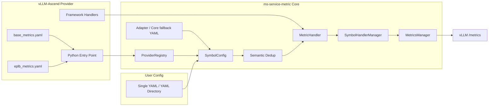
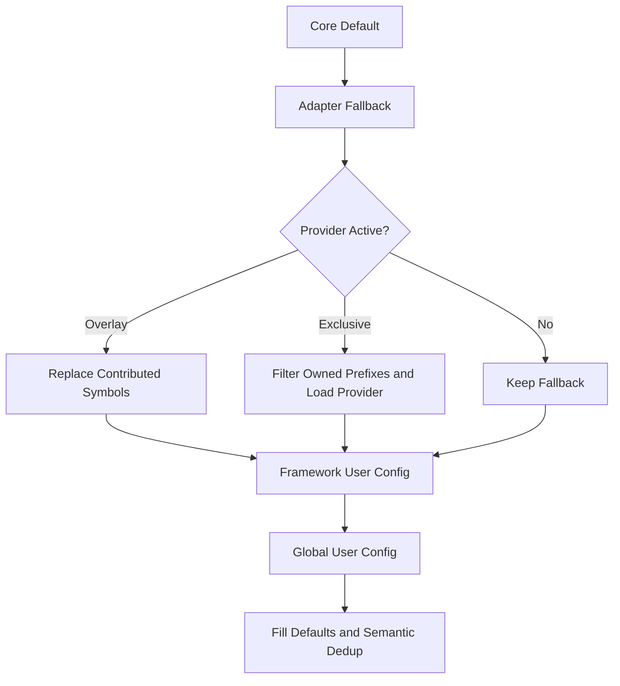
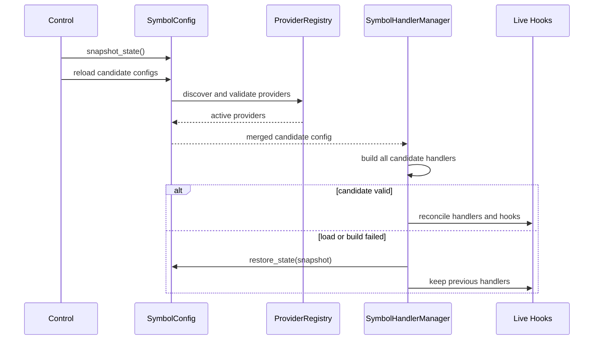
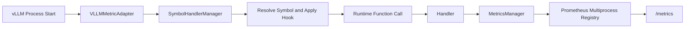

# ms-service-metric 可扩展指标架构重构设计文档

状态(Status): Draft
作者(Authors): @ChaseChe77
创建日期(Created): 2026-08-10
更新日期(Updated): 2026-08-10
相关 Issue/PR: msserviceprofiler PR !433、vLLM-Ascend PR #13783

---

# 1. 概述

## 1.1 简介

本文档描述 `ms-service-metric` 指标采集架构的完整重构方案，覆盖
`msserviceprofiler` 与 `vLLM-Ascend` 两个代码仓的职责调整、配置与 Handler 迁移、
Provider 插件机制、多 YAML 加载、渐进式兼容策略，以及最终用户通过配置目录拆分 YAML
的能力。

重构后，系统被划分为三个扩展层次：

1. `ms-service-metric Core`：提供 Hook、配置合并、Handler 构造、Prometheus 上报、
   Provider 发现和事务式重载等稳定底层能力。
2. `Framework Provider`：由 vLLM-Ascend 等框架仓维护与自身版本强相关的 symbol、YAML 和
   Handler，通过 Python Entry Point 接入 Core。
3. `User Config`：最终用户通过现有环境变量提供单文件或单目录多 YAML，并可在同一配置
   根目录放置以原有 `module:function` 语法引用的独立 Handler 文件。

该设计既解决框架配置跨仓维护问题，也兼容 Core 和 Provider 发版不同步的过渡阶段，并为
后续接入其他框架保留统一扩展入口。

## 1.2 背景与动机

重构前，vLLM 与 vLLM-Ascend 的指标点位、版本范围和部分业务 Handler 主要维护在
`msserviceprofiler` 仓内。该模式可以快速实现指标采集，但长期演进存在以下问题：

- YAML 中的 symbol 与框架源码强绑定。vLLM/vLLM-Ascend 重构、改名或移动函数后，
  `ms-service-metric` 配置容易失效。
- 框架业务 Handler 位于 Core 仓，代码所有权与维护责任不一致，框架改动需要跨仓同步。
- `msserviceprofiler`、vLLM 和 vLLM-Ascend 发版节奏不同，难以保证配置始终匹配运行版本。
- 用户自定义配置只能使用单个 YAML；复杂指标无法按 scheduler、executor、EPLB 等模块拆分。
- 外部 Handler 必须位于可导入 Python 包中，用户需要修改仓库、安装包或调整
  `PYTHONPATH`。
- 如果框架仓一次性接管整个前缀，而业务代码和 YAML 尚未全部迁移，会产生指标静默缺失。
- 如果简单叠加新旧配置，又可能对相同 symbol 和 Handler 重复 Hook，造成指标重复上报。

因此，本次重构不能只解决“读取多个 YAML”，而需要同时建立清晰的代码所有权、渐进迁移、
故障降级和最终用户扩展机制。

## 1.3 设计目标

本次重构目标如下：

- Core 与框架业务解耦，Core 不反向依赖 vLLM-Ascend 私有实现。
- vLLM-Ascend 可以在自身仓库维护框架强相关 YAML 和 Handler，并随框架版本发布。
- 支持 Provider 单目录多 YAML，并保证 YAML 被正确打入 Wheel。
- 支持 Provider 外部 Handler，同时限制其可导入模块范围。
- 迁移期默认使用 Overlay，Core 与 Provider 存在版本 Gap 时仍能使用 Core 兜底指标。
- 迁移完成后允许 Provider 使用 Exclusive 显式完整接管所属 symbol 前缀。
- 使用配置语义指纹去重，不要求在 YAML 中增加过渡性质的 `id` 字段。
- 用户可通过 `MS_SERVICE_METRIC_CONFIG_PATH` 加载单文件或单目录多 YAML。
- 用户可通过现有环境变量加载单文件或单目录多 YAML，不增加新的环境变量。
- 用户无需修改或安装 Python 包，即可从配置根目录加载 YAML 明确引用的外部 Handler。
- 配置和 Handler 重载失败时不提交部分状态，尽量保持原有 Hook 与推理流程。
- 现有单 YAML、内置 Adapter、模块式 Handler 和 Prometheus 暴露方式保持兼容。

## 1.4 非目标

- 不在本次设计中实现 SGLang 适配；后续可复用同一 Provider 架构接入。
- 不修改 Prometheus、Grafana 的部署和持久化机制。
- 不将 Metrics 扩展为算子级 Profiling；Metrics 仍用于持续观测和第一层问题定位。
- 不为 Provider Handler 提供进程级安全沙箱；Handler 本质上仍是可信 Python 代码。
- 不承诺修改 Handler Python 源码后可以在服务进程内无状态热替换。

# 2. 用例分析

## 2.1 Core 单独升级

`ms-service-metric` 已合入重构，而 vLLM-Ascend 尚未合入 Provider。此时 Core 发现不到
`ms_service_metric.providers` Entry Point，继续加载原有 Adapter YAML 和通用 Handler，
指标功能保持可用。

该场景用于支持两个仓分开提交、分开发版，以及 Provider PR 尚未合入的时间窗口。

## 2.2 Provider 渐进迁移

Core 已合入重构，vLLM-Ascend 只迁移了部分 YAML 和 Handler。Provider 使用 Overlay：

- Provider 已配置的 symbol 以 Provider 配置为准。
- Provider 未配置的 symbol 继续使用 Core/Adapter 兜底。
- Provider 失效、YAML 无效或 Handler 导入失败时，Provider 整体跳过，保留 Core 兜底。

该场景允许按 symbol 逐步迁移，不要求两个仓一次性完成全部改造。

## 2.3 Provider 完整接管

当 vLLM-Ascend 已完整维护所属 symbol 后，可以继续使用 Overlay，也可以显式设置
`ownership_mode="exclusive"`。Exclusive 会先过滤 Core 中属于
`owned_symbol_prefixes` 的兜底 symbol，再加载 Provider 配置，从而完成最终所有权收敛。

Exclusive 只适合迁移完成后启用；过早启用会让尚未迁移的指标失去兜底。

## 2.4 Provider 多 YAML 与业务 Handler

vLLM-Ascend 将基础执行、内存和 EPLB 等指标拆分为多个 YAML，并把 EPLB 等强业务逻辑
Handler 放在自身仓库。Provider 自动发现配置目录下的 YAML，将路径列表交给 Core。

## 2.5 最终用户多 YAML

用户不修改 `msserviceprofiler` 或 vLLM-Ascend，也不构建 Provider 包，只需要：

- 一个 YAML 文件，或一个包含多个 YAML 的配置目录。
- `MS_SERVICE_METRIC_CONFIG_PATH` 指向配置文件或配置目录。

该能力适合客户现场、实验性指标以及尚不适合合入框架仓的业务扩展。

## 2.6 异常与回滚

运行时执行 metric on/restart 时，系统先加载并校验完整候选配置，再构造候选 Handler。
任一阶段失败时恢复上一次已提交的配置和 Handler 状态，避免先拆旧 Hook、后发现新配置
不可用所造成的指标整体中断。

# 3. 方案设计

## 3.1 总体架构



## 3.2 Core 与 Provider 职责边界

### 3.2.1 Core 职责

`ms-service-metric Core` 保留以下通用能力：

- Hook 链、Symbol 解析、模块监听和 Hook 生命周期管理。
- YAML 解析、版本过滤、配置合并和语义去重。
- Provider Entry Point 发现、描述符校验、冲突处理和激活。
- Handler 构造、通用 Handler 以及稳定 Provider Handler 门面。
- Prometheus 指标注册、记录、多进程聚合和 `/metrics` 数据链路。
- DP、PD role、phase 等通用运行时元数据。
- metric on/off/restart 控制和事务式重载。

Core 不保存必须跟随 vLLM-Ascend 版本变化的业务实现，也不直接 import
`vllm_ascend.*`。

### 3.2.2 Provider 职责

框架 Provider 负责维护：

- 框架私有 symbol 路径和版本约束。
- 与框架源码强绑定的 YAML。
- 需要访问框架对象、局部状态或业务结构的 Handler。
- Provider 所属 symbol 前缀和迁移模式。
- YAML、Handler 和 Entry Point 的 Wheel 打包。
- 框架源码与 YAML symbol 一致性的 UT。

### 3.2.3 Handler 归属原则

- 纯计时、通用 phase、通用内存解析等稳定逻辑保留在 Core，通过
  `ms_service_metric.provider_handlers` 暴露。
- EPLB 专家热度、框架私有对象解析等强业务逻辑迁移到
  `vllm_ascend.observability.ms_metrics.handlers`。
- Provider 不应引用 `ms_service_metric.adapters.*` 等 Core 内部路径，避免 Core 内部重构
  导致 Provider 静默失效。
- Provider Handler 通过 `ms_service_metric.provider_api` 获取窄化的指标写入接口，不直接
  操作 Core 内部单例实现。

## 3.3 Provider 描述模型

Core 定义稳定描述对象 `MetricProvider`：

```python
@dataclass(frozen=True)
class MetricProvider:
    name: str
    config_paths: Sequence[str]
    priority: int = 100
    framework_package: str | None = None
    owned_symbol_prefixes: Sequence[str] = ()
    handler_module_prefixes: Sequence[str] = ()
    ownership_mode: str = "overlay"
```

字段含义如下：

| 字段 | 含义 |
|---|---|
| `name` | Provider 唯一名称，用于排序、日志和冲突识别 |
| `config_paths` | Provider 提供的一个或多个 YAML 绝对路径 |
| `priority` | Provider 加载顺序，数值越小越先处理 |
| `framework_package` | 需要版本过滤时用于读取框架安装版本 |
| `owned_symbol_prefixes` | Provider 声明可维护的 symbol 模块前缀 |
| `handler_module_prefixes` | Provider 自有 Handler 的允许导入前缀 |
| `ownership_mode` | `overlay` 渐进迁移或 `exclusive` 完整接管 |

本次没有增加 `provider_api_version` 和 `core_version_spec`。当前 Provider 接口很小，且
Python 导入、描述符校验和稳定门面已经能暴露不兼容问题；过早引入版本握手会增加两个仓的
维护成本。未来稳定 API 发生破坏性变化时，再增加显式协议版本。

## 3.4 Provider 发现与注册

vLLM-Ascend 安装时在 `setup.py` 注册 Entry Point：

```python
entry_points={
    "ms_service_metric.providers": [
        "vllm-ascend = "
        "vllm_ascend.observability.ms_metrics:get_metric_provider",
    ],
}
```

Core 使用 `importlib.metadata.entry_points()` 发现
`ms_service_metric.providers` 组。Entry Point 只声明 Provider 工厂，不意味着所有
`vllm_ascend.*` Hook 自动路由到某个 YAML；真正生效的点位仍由 Provider
`config_paths` 中实际声明的 symbol 决定。

vLLM-Ascend 的 `get_metric_provider()` 在函数内部惰性导入
`ms_service_metric.provider_api`。因此 vLLM-Ascend 本身不硬依赖
`ms-service-metric`：未安装 Core 时，没有 Core 去发现和调用该 Entry Point，vLLM-Ascend
原有推理功能不受影响。

## 3.5 vLLM-Ascend 侧目录与打包

vLLM-Ascend 侧目录如下：

```text
vllm_ascend/observability/ms_metrics/
├── __init__.py
├── provider.py
├── handlers.py
└── config/
    ├── base_metrics.yaml
    └── eplb_metrics.yaml
```

`provider.py` 对 `config/*.yaml` 排序后生成 `config_paths`，因此同一目录可以继续增加 YAML，
无需修改 Provider 工厂。`setup.py` 通过下面的 `package_data` 将 YAML 打入源码包和 Wheel：

```python
package_data={
    "vllm_ascend.observability.ms_metrics": ["config/*.yaml"],
}
```

仅源码目录中存在 YAML 不足以证明发布可用，正式验证需要构建或安装 Wheel，并从
`importlib.metadata` 发现 Entry Point，再确认 `provider.config_paths` 中每个路径均存在。

## 3.6 Overlay 与 Exclusive

### 3.6.1 Overlay

Overlay 是默认模式，也是迁移期推荐模式。处理规则为：

1. 先加载 Core 默认和 Adapter 兜底配置。
2. Provider 对自己实际提供的 symbol 执行 symbol 级整体替换。
3. Provider 未提供的 symbol 保持 Core/Adapter 兜底。

同一个 symbol 是迁移原子单元。Provider YAML 必须声明该 symbol 最终需要保留的全部
Handler，避免只迁移其中一条 Handler 后，产生不完整指标集合。

### 3.6.2 Exclusive

Exclusive 用于迁移完成后的最终接管：

1. 根据 `owned_symbol_prefixes` 从 Core/Adapter 中过滤 Provider 所有权范围内的 symbol。
2. 加载 Provider 配置。
3. 所属前缀下未出现在 Provider YAML 的 symbol 不再使用 Core 兜底。

因此 Exclusive 是显式完成状态，不应作为过渡期默认值。

### 3.6.3 Provider 冲突

- 同名 Provider 被视为歧义，同名项全部跳过。
- Overlay Provider 之间允许组合。
- 只要参与方存在 Exclusive，且 owned prefix 相互包含，则冲突双方都跳过。
- Provider 按 `(priority, name)` 稳定排序。

## 3.7 配置加载、覆盖与语义去重

整体处理顺序如下：

1. Core 默认配置。
2. Adapter 内置兼容配置。
3. Active Provider 配置。
4. 框架级用户配置，例如 `MS_SERVICE_METRIC_VLLM_CONFIG`。
5. 全局用户配置 `MS_SERVICE_METRIC_CONFIG_PATH`。



去重不依赖 YAML `id`，而是根据 Handler 的有效运行语义生成内部指纹，主要包含：

- Handler 引用或默认 Handler。
- 显式有效名称。
- 版本范围和 lock patch。
- Metric 名称、类型、表达式、桶和 labels。

省略默认值与显式写出相同默认值会得到相同指纹；同一 Handler 但 metrics 或 labels 不同，
会得到不同指纹并允许同时生效。

## 3.8 Provider 校验与失败降级

Provider 激活前执行以下检查：

- 描述符字段类型、非空值和 ownership mode。
- YAML 路径必须为普通文件，文件不能为空。
- symbol 格式和 owned prefix 归属。
- Handler 必须来自稳定 Core 门面或 `handler_module_prefixes`。
- Metric 类型、名称、labels、buckets 和表达式结构。
- Provider 与已有配置的同名 Metric schema 必须兼容。
- 存在版本上下界时，必须能够读取 `framework_package` 版本。

任一检查失败时，该 Provider 在获得所有权之前整体跳过，Core/Adapter 兜底继续生效。
Provider 失败不应留下“前缀已经接管、配置却没有加载”的半激活状态。

## 3.9 事务式重载

metric on/restart 的配置更新流程如下：



该机制保护的是配置与 Handler 构造阶段。任意自定义 Handler 在实际执行时仍可能产生业务
副作用，Core 无法对第三方 Python 代码提供完全隔离。

## 3.10 用户单目录多 YAML

`MS_SERVICE_METRIC_CONFIG_PATH` 保持原单文件兼容，并扩展为文件或目录：

```bash
export MS_SERVICE_METRIC_CONFIG_PATH=/data/custom_metrics/config
```

目录加载规则：

1. 只读取指定目录第一层普通文件。
2. 扩展名大小写不敏感地匹配 `.yaml` 和 `.yml`。
3. 按文件名稳定排序。
4. 忽略子目录和其他扩展名文件。
5. 逐文件解析并复用现有 `_merge_configs` 与语义去重。
6. 任一 YAML 解析失败时，本轮候选配置整体失败，不提交部分结果。

本次正式需求为“单目录多 YAML”，不递归扫描子目录。非递归规则可以避免误加载备份文件、
不确定加载范围和大目录遍历开销。

### 3.10.1 用户外部 Handler

配置目录同时作为外部 Handler 根目录，不新增环境变量，也不改变 YAML 的
`module.path:function_name` 写法：

```text
/data/custom_metrics/config/
├── scheduler.yaml
├── executor.yaml
├── custom_handler.py
└── helpers/
    └── request_handler.py
```

`custom_handler:record` 映射到 `custom_handler.py`，
`helpers.request_handler:record` 映射到 `helpers/request_handler.py`。当环境变量指向单个
YAML 时，以 YAML 的父目录作为 Handler 根目录。

子目录不要求存在 `__init__.py`。外部 Handler 可以导入运行环境中已经安装的依赖，但
配置根目录不会加入 `sys.path`，所以不支持依赖配置目录内其他 Python 文件的隐式或相对
导入。需要跨文件复用的 Handler 代码应安装为正式 Python 包，并继续走原有允许列表或
Provider 模块前缀机制。用户模块名还应避开 Core 和 Provider 已声明的模块前缀，避免
优先进入标准 Python import 分支。

加载顺序保持兼容：Core 和 Provider 允许列表中的模块继续使用标准 Python import；只有
不在允许列表且用户配置根目录存在时，才使用受控文件加载器。加载器不修改 `sys.path`，
不递归扫描 Python 文件，只加载 YAML 明确引用的目标文件。模块路径每一段必须是合法
Python 标识符；目标文件经过真实路径解析后必须仍位于根目录中，目录穿越和符号链接逃逸
均被拒绝。

外部 Handler 模块以“真实文件路径哈希”作为进程内模块缓存键。同一文件只执行一次，
Handler 根目录也参与外部 Handler 的语义指纹，避免切换配置目录后错误复用旧 Handler。
首版不提供源码热重载：修改 YAML 可执行 metric restart，修改 Handler Python 文件需要
重启 vLLM 服务。

责任边界如下：Core 负责配置发现、受控加载、候选状态构造和失败回滚；Provider 负责与
框架版本绑定的官方 symbol、YAML 和 Handler；用户负责外部 Handler 的代码正确性、依赖、
目录权限和运行时异常保护。外部 Handler 与 Provider Handler 一样属于推理进程内的可信
Python 代码，Core 不提供进程级安全沙箱。

## 3.11 初始化与运行时数据链路

vLLM 启动时通过已有 general plugin 初始化 `VLLMMetricAdapter`：

1. 检测 vLLM 版本。
2. 初始化 Prometheus 多进程环境和指标前缀。
3. 初始化 DP rank、PD role 等元数据。
4. 创建带 `ProviderRegistry` 的 `SymbolHandlerManager`。
5. 加载 Core/Adapter、Provider 和用户配置。
6. 构造 Handler 并应用 Hook。
7. Handler 将值写入 `MetricsManager`。
8. 指标通过 vLLM 原生 `/metrics` 暴露。



# 4. 代码修改设计

## 4.1 msserviceprofiler 修改

| 模块 | 修改目的 |
|---|---|
| `core/config/provider.py` | 定义 Provider 描述、Entry Point 发现、排序和冲突处理 |
| `provider_api.py` | 为框架 Handler 提供稳定、窄化的导入门面 |
| `provider_handlers.py` | 惰性导出可供 Provider 复用的通用 Handler |
| `core/config/symbol_config.py` | Provider 激活、配置覆盖、schema 校验、语义去重、多 YAML 目录加载和用户 Handler 根目录状态 |
| `core/external_handler_loader.py` | 在用户配置根目录内隔离解析并缓存外部 Handler 模块 |
| `core/handler.py` | 保持 Core/Provider 标准导入，并为用户 Handler 接入受控文件加载 |
| `core/symbol_handler_manager.py` | 候选 Handler 预构造和事务式重载回滚 |
| `adapters/vllm/adapter.py` | 在初始化 manager 时注入 `ProviderRegistry` |

## 4.2 vLLM-Ascend 修改

| 模块 | 修改目的 | 是否可以省略 |
|---|---|---|
| `observability/ms_metrics/provider.py` | 描述 YAML、所有权和 Handler 前缀 | Provider 模式下不可省略 |
| `observability/ms_metrics/__init__.py` | 暴露 Entry Point 工厂 | 不可省略 |
| `observability/ms_metrics/config/*.yaml` | 维护框架强相关 symbol | 业务点位需要 |
| `observability/ms_metrics/handlers.py` | 维护框架强相关处理逻辑 | 仅有自定义业务逻辑时需要 |
| `setup.py` Entry Point | 让 Core 自动发现 Provider | Provider 自动发现不可省略 |
| `setup.py` package data | 把 YAML 打入 Wheel | Wheel 发布不可省略 |
| Provider UT | 看护发现、打包、symbol 和 Handler | 正式合入需要 |

最终用户多 YAML 只扩展配置文件组织方式，不替代 Provider。由框架官方长期维护的
版本绑定指标仍推荐放在 Provider 中。

# 5. 兼容性与迁移方案

## 5.1 三种合入状态

| 场景 | ms-service-metric | vLLM-Ascend | 预期行为 |
|---|---|---|---|
| 1 | 重构已合入 | 未合入 Provider | Core/Adapter 兜底正常，发现不到 Provider |
| 2 | 重构已合入 | 部分 YAML/Handler | Overlay 覆盖已迁移 symbol，其余继续兜底 |
| 3 | 重构已合入 | 完整 Provider | Provider 全量生效；完成迁移后可切 Exclusive |

两个 PR 可以分开合入，但建议顺序为先合 Core、后合 Provider。旧 Core 不认识 Provider
Entry Point，vLLM-Ascend 新增文件不会自动生效；新 Core 配旧 vLLM-Ascend 则可以正常走
兜底。

## 5.2 迁移步骤

1. 在 Core 合入 Provider 基础设施和兼容测试。
2. vLLM-Ascend 注册 Overlay Provider。
3. 按 symbol 将 YAML 从 Core/Adapter 迁移到 vLLM-Ascend。
4. 通用 Handler 改为引用稳定 Core 门面。
5. 强业务 Handler 迁移到 vLLM-Ascend。
6. 基础和 EPLB 场景分别验证指标完整性。
7. 所属 prefix 全量迁移并稳定后，评估是否启用 Exclusive。
8. 确认 Exclusive 后，再清理 Core 中已无兜底价值的旧点位。

## 5.3 不增加 YAML `id`

YAML `id` 只能解决迁移期重复识别，但长期业务价值较低，且会成为需要解释和维护的永久
字段。本方案通过标准化有效配置并计算内部语义指纹去重，不把迁移状态泄漏到用户配置格式。

## 5.4 版本 Gap 风险

Overlay 可以避免版本 Gap 直接造成整段指标缺失，但不能保证每个旧 symbol 在新框架版本中
仍然存在。需要结合以下机制控制风险：

- Provider YAML 与框架源码同仓维护。
- UT 静态确认 YAML module、class 和 method 存在。
- 启动日志记录 Hook 成功、not hooked 和 Provider 跳过原因。
- 冒烟或 ST 对声明指标和 `/metrics` 实际指标做集合对比。
- 指标缺失不应影响推理服务，但必须可通过日志和验证工具感知，避免长期静默。

# 6. 安全、可靠性与性能

## 6.1 安全

- Provider Handler 仅允许稳定 Core 门面和 Provider 声明的模块前缀。
- Provider import、YAML 和 schema 在获得所有权前校验。
- Core 和 Provider Handler 继续使用现有模块允许列表和标准 import。
- 用户外部 Handler 仅允许从配置根目录按明确模块路径加载，不修改全局 `sys.path`。
- 外部模块路径拒绝绝对路径、路径分隔符、`..` 和符号链接逃逸，不扫描无关 Python 文件。
- Handler 是可信代码而不是安全沙箱，部署方必须控制 Provider 包和用户配置目录写权限。

## 6.2 可靠性

- vLLM general plugin 入口采用 fail-open：依赖缺失、共享内存初始化、配置或 Handler 初始化
  异常均记录错误并禁用 Metrics，不向上抛出导致 `vllm serve` 启动失败。
- 初始化中途失败时清理已创建的 Manager、Watcher 和 Hook，避免残留半初始化状态。
- Provider 发现异常按 Provider 隔离，不阻断其他 Provider。
- 重复名称和所有权冲突采用拒绝激活，而不是不确定覆盖。
- 配置与 Handler 候选状态完整构造后再更新 Live Hook。
- 失败时恢复已提交配置，保留原有 Handler。
- 业务 Handler 应捕获自身指标处理异常，并优先保持原始推理调用结果。

## 6.3 性能

- Provider 仅在初始化和 metric 重载时发现，不进入每次请求热路径。
- 多 YAML 扫描只读取目录第一层并按确定顺序处理。
- Handler 模块使用进程内缓存。
- 语义指纹只在配置加载阶段计算。
- 实际运行开销仍主要由 Hook 数量、Handler 计算和指标 label 基数决定。

# 7. 测试设计

## 7.1 Core UT

- Provider Entry Point 发现、排序、重复名称和 ownership 冲突。
- Overlay symbol 级替换和未迁移 symbol 兜底。
- Exclusive prefix 过滤。
- Provider YAML、Handler 模块和 Metric schema 校验。
- Provider 失败时保留 Core fallback。
- 多配置文件语义重复去重。
- 配置快照、失败重载回滚和 Handler reconcile。
- 用户单 YAML 兼容、单目录多 YAML 排序和非递归规则。
- 用户外部 Handler 的同目录/子路径加载、路径逃逸防护、失败回滚和模块缓存。

## 7.2 vLLM-Ascend UT

- `get_metric_provider()` 返回 Overlay Provider。
- Provider 自动发现 `base_metrics.yaml` 和 `eplb_metrics.yaml`。
- Entry Point 与 package data 正确注册。
- YAML symbol 对应当前源码中的 module、class 和 method。
- YAML 不包含人工 `id`。
- EPLB Handler 正确记录热度指标、跳过非零 rank。
- 指标系统异常时 EPLB Handler 保持原始推理结果。
- Provider 在没有安装 `ms-service-metric` 时不形成 vLLM-Ascend 硬依赖。

## 7.3 Wheel 安装验证

1. 从目标 vLLM-Ascend commit 构建或安装 Wheel。
2. 确认 `importlib.metadata.entry_points()` 只发现一个 `vllm-ascend` Provider。
3. 确认 Entry Point distribution 为 `vllm_ascend`，不是测试 bootstrap 包。
4. 加载 Provider 并确认 `ownership_mode == "overlay"`。
5. 确认 `config_paths` 对应 Wheel 安装目录中的全部 YAML 且文件存在。
6. 确认 Handler 从 Wheel 安装路径导入。

## 7.4 场景一：Core + 旧 vLLM-Ascend

- 确认没有 vLLM-Ascend Metrics Provider，或没有残留测试 bootstrap Entry Point。
- 清空独立的 Prometheus multiprocess 目录。
- 启动基础模型、发送请求并抓取 `/metrics`。
- 使用 Core YAML 声明集合检查实际指标。
- 检查 Hook warning/error，区分版本已有点位缺失与重构回归。

验收目标：基础推理正常、Core 指标正常、没有因 Provider 缺失导致初始化失败。

## 7.5 场景二：Core + vLLM-Ascend Provider

基础场景：

- 确认 Provider 来源、Overlay 模式和多 YAML 路径。
- 使用基础模型触发 executor 和 memory 点位。
- 对 `base_metrics.yaml` 做声明指标与 `/metrics` 集合检查。
- EPLB YAML 指标在基础模型中未触发属于预期。

EPLB 场景：

- 使用支持 EPLB 的 MoE 模型和对应设备数启动服务。
- 发送足够请求触发热度更新和专家迁移。
- 分别检查 `base_metrics.yaml` 与 `eplb_metrics.yaml`。
- Provider 声明指标应全部出现，缺失数为 0。
- 日志不得存在 Provider 导入、Handler 构造或 Hook 异常。

## 7.6 用户多 YAML ST

1. 创建包含至少两个 YAML 的用户配置目录。
2. 在同一目录创建独立 Handler 文件，YAML 沿用 `module:function` 写法引用。
3. 设置 `MS_SERVICE_METRIC_CONFIG_PATH` 指向该目录。
4. 不修改 `PYTHONPATH`，启动服务并确认两个 YAML 和外部 Handler 均被加载。
5. 发送请求并确认两个 YAML 声明的指标均上报。
6. 配置语义重复项，确认没有重复记录。
7. 增加错误 YAML，确认候选配置被拒绝且不产生部分 Hook。

# 8. 影响面

## 8.1 对 msserviceprofiler 的影响

- 增加 Provider 稳定接口，并扩展用户配置路径的目录加载能力。
- 扩展配置合并与重载逻辑，是本次主要风险区域。
- 原有默认 YAML、Adapter 和模块式 Handler 保持兼容。
- 后续框架接入可以复用 Provider，不需要继续把业务代码放回 Core。

## 8.2 对 vLLM-Ascend 的影响

- 新增观测目录、YAML、Handler、Entry Point 和打包配置。
- 不修改 vLLM-Ascend 推理主流程。
- 未安装 Core 时 Entry Point 不会被消费，不形成强绑定。
- YAML 和 Handler 可随 vLLM-Ascend 版本一同维护和发布。

## 8.3 对用户的影响

- 旧用法不变。
- Provider 对用户透明，安装匹配版本后自动发现。
- 新增可选的单目录多 YAML 用法，Handler 使用方式不变。
- 新增无需安装 Python 包的用户外部 Handler 用法；已有可导入模块式 Handler 保持兼容。
- 用户外部 Handler 按可信代码管理，目录写权限和代码质量由部署方负责。

# 9. 缺点和风险

- 两个仓仍存在发布顺序和版本组合，需要依赖 Overlay、测试矩阵和日志降低风险。
- Overlay 长期保留会造成 Core 与 Provider 双份配置维护，迁移完成后应及时收敛。
- Exclusive 配置错误可能导致所属前缀指标缺失，启用前必须证明迁移完整。
- 静态 symbol UT 无法覆盖运行时动态 patch 和条件定义，仍需真实服务验证。
- Handler Python 代码修改仍建议重启服务；metric restart 主要保证 YAML 重载。
- 外部 Handler 不提供 Python 包语义和源码热重载；其依赖应使用已安装的 Python 包。
- 多 YAML 没有额外优先级字段，文件顺序只保证确定性，冲突语义由既有合并规则决定。

# 10. 后续演进

- 复用 Provider 架构适配 SGLang，避免在 Core 中增加新的框架业务分支。
- 在迁移完整并经过多个版本验证后，评估 vLLM-Ascend 切换 Exclusive。
- 增加独立配置预检 CLI，在服务启动前检查 YAML、symbol 和 Handler。
- 将 Metrics 异常时间窗与 Trace/Profiling 下钻能力关联。
- 根据指标开销增加 L0/L1 分级和按需启用机制。
- 根据真实需求评估递归配置目录或显式 manifest，而不是默认扩大扫描范围。

# 11. 未解决问题

- vLLM-Ascend 完整迁移的 symbol 清单和 Exclusive 切换版本需要由双方共同确认。
- Core fallback 的最终清理节奏需要与 vLLM-Ascend 最低支持版本对齐。
- Provider API 何时需要显式版本握手，取决于稳定门面是否出现破坏性变化。
