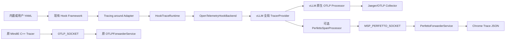

# vLLM Hook Tracing 特性详细设计

## 1. 文档信息

| 项目 | 内容 |
|---|---|
| 特性 | vLLM/vLLM-Ascend Hook Tracing |
| 仓库 | msserviceprofiler |
| 版本 | 26.0.0 |
| 日期 | 2026-08-15 |
| 状态 | 开发验证 |

## 2. 背景与设计结论

Metrics 只能反映聚合结果，无法解释单个推理请求在请求接入、调度、模型执行和输出处理阶段的耗时关系。本特性通过现有 Hook/YAML 机制补充业务 Span，并支持 Jaeger 和 Perfetto 展示。

vLLM 已提供基于 OpenTelemetry 的原生 Tracing。本方案不再实现第二套 Provider、OTLP exporter 或跨进程协议，而是将 vLLM 原生 Tracing 作为必选基础能力：

1. vLLM 必须通过 `--otlp-traces-endpoint` 初始化全局 `TracerProvider`。
2. Hook Span 复用该 Provider、采样策略、上下文和 OTLP exporter。
3. Jaeger 是原生 OTLP 输出；Perfetto 是 Hook Span 的可选附加输出。
4. 不支持“vLLM 未开启原生 Tracing，但 msServiceProfiler 单独创建 Trace”的兼容模式。
5. 工具架构硬约束：当前及后续版本均不得修改 vLLM/vLLM-Ascend 源码或 IPC，也不导入 `vllm.tracing` 私有接口。

## 3. 目标与非目标

### 3.1 目标

- 通过同一份 profiling YAML 的 `trace` 字段配置 request、scheduler、model、output 埋点。
- 复用 vLLM 全局 OpenTelemetry Provider，将 Hook Span 随原生 Span 一起导出到 Jaeger。
- 可选将 msServiceProfiler Hook Span 旁路写成 Perfetto/Chrome Trace JSON。
- tracing 失败必须 fail-open，不能改变推理结果。
- profiling、metrics、MindIE C++ Trace 和原 OTLP Forwarder 保持原行为。
- tracing 与 profiling 可同时开启，同一业务函数只执行一次。

### 3.2 非目标

- 不支持没有原生 Tracing 能力的旧版 vLLM。
- 不在 msServiceProfiler 内创建私有 `TracerProvider`。
- 不将 vLLM 原生 Span 或旧 C++ OTLP 数据转换为 Perfetto。
- 不修改、扩展或要求上游适配 vLLM 的进程间通信协议；该约束适用于当前及后续所有版本。
- 不保证 YAML 中已删除或改名的业务符号仍可 Hook；缺失符号按现有机制跳过。
- 不改变 profiling 的 enable.json、采集、CSV/DB/timeline 和 parse 流程。

## 4. 总体架构



两条 Socket 严格隔离：

- `OTLP_SOCKET`：原 MindIE C++ Trace 的二进制 OTLP 通道，代码和行为不变。
- `MSP_PERFETTO_SOCKET`：仅接收 msServiceProfiler Hook Span 的规范化事件包。

Perfetto 事件包不会进入 OTLP exporter；旧二进制 OTLP 数据也不会进入 Perfetto Forwarder。

## 5. 关键模块

| 模块 | 职责 | 边界 |
|---|---|---|
| `patcher/core/module_hook.py` | 提供一个可选 `around_hook_factory` 扩展点 | 原 context hook 和 profiling handler 逻辑不变 |
| `patcher/core/config_loader.py` | 从同一份 YAML 解析 profiling 与 `trace` | 同一解析后符号只允许一个有效 trace |
| `patcher/core/trace_hook.py` | 参数/返回值语义提取和 Span 包围逻辑 | 不进入原 profiling context hook 生命周期 |
| `tracer/hook_runtime.py` | request context 表、Links 和 Span 公共属性 | 不创建重复 request 根 Span |
| `tracer/otel_hook.py` | 通过 OTel 公共 API复用全局 Provider | 不创建、不替换、不关闭 Provider |
| `tracer/perfetto_socket.py` | 过滤并异步发送 Hook Span | 不发送 vLLM 原生 Span，不编码 OTLP protobuf |
| `tracer/perfetto_forward_service.py` | 独立接收 Hook 包并写 JSON | 不复用或修改原 OTLP Scheduler |
| `tracer/perfetto_exporter.py` | Hook 事件包转 Chrome Trace Event | 拒绝旧二进制 OTLP 数据 |
| `tracer/otlp_forward_service.py` | 原 MindIE Trace 转发 | 保持原实现，不参与 vLLM Hook Tracing |

## 6. Hook 组合方式

### 6.1 最小通用扩展

现有流程先生成 profiling callable，再由可选的 tracing `around_hook_factory` 包在最外层：

```text
调用方 -> tracing around -> profiling handler（可选）-> 原业务函数
```

不再给通用 `FunctionContext` 增加 `args/kwargs/return_value`，也不重写多个 context manager 的进入退出流程。这样可以把共享 Hook 框架改动限制为一个可选扩展点。

### 6.2 异常和重复调用

`TrackableOriginalFunc` 仍负责记录业务函数是否已经执行。若业务函数抛出异常，外层 Hook 必须原样抛出，不作为埋点失败重试；若 tracing 后处理失败，返回已缓存的业务结果，避免第二次执行原函数。

### 6.3 配置约束

profiling 和 tracing 是同一符号上的两个独立能力，不是多个 profiling handler：

```yaml
- symbol: vllm.v1.core.sched.scheduler:Scheduler.schedule
  handler: ms_service_profiler.patcher.vllm.handlers.v1.scheduler_handlers:schedule
  trace:
    name: vllm.scheduler.schedule
    domain: Schedule
    adapter: schedule
```

同一解析后符号只能有一个有效 `trace` 配置。重复项记录告警并忽略后项，避免一层业务调用生成重复 Hook Span。

## 7. Provider 与请求关联

### 7.1 Provider 规则

运行时只接受 `trace.get_tracer_provider()` 返回且支持 `add_span_processor` 的 SDK Provider：

- Provider 存在：创建 Hook Span。
- Provider 不存在：记录一次提示，Hook tracing 变为 no-op，推理继续。
- msServiceProfiler 不读取 OTLP endpoint 自建 Provider，不调用 `set_tracer_provider()`，也不关闭 vLLM Provider。

### 7.2 请求关联

- 优先从 vLLM 请求参数/对象读取 `request_id` 和 `trace_headers`。
- 使用 W3C `traceparent` 提取真实上下文，并按 `request_id` 暂存。
- scheduler/model/output Span 使用 OTel Link 关联已知请求上下文。
- 不根据 request ID 伪造 trace ID。
- 若进程内拿不到真实上下文，只保留 `request.ids` 属性，不伪造 Link。
- 当前及后续版本均不修改 vLLM IPC。跨进程能否获得 `trace_headers` 只取决于当前 vLLM 已公开的数据；获取不到时降级为 `request.ids` 属性，不把修改上游作为补偿方案。
- 若未来 vLLM 通过稳定公共接口提供更多 Trace Context，工具可通过版本适配层选择性读取；不能要求 vLLM 为本工具增加字段、消息或反向依赖。

## 8. 输出模式

### 8.1 Jaeger

```bash
export MS_TRACE_ENABLE=1
export OTEL_SERVICE_NAME=vllm-server
export OTEL_EXPORTER_OTLP_TRACES_PROTOCOL=http/protobuf

vllm serve MODEL \
  --otlp-traces-endpoint http://127.0.0.1:4318/v1/traces
```

vLLM 原生 Span 和 Hook Span 共用 Provider，直接发送到 Jaeger/Collector；不需要运行 `python -m ms_service_profiler.trace`。

### 8.2 Jaeger + Perfetto

```bash
python -m ms_service_profiler.trace \
  --perfetto-output /tmp/hook_tracing.json &

export MS_TRACE_ENABLE=1
export OTEL_SERVICE_NAME=vllm-server
export OTEL_EXPORTER_OTLP_TRACES_PROTOCOL=http/protobuf

vllm serve MODEL \
  --otlp-traces-endpoint http://127.0.0.1:4318/v1/traces
```

`PerfettoSpanProcessor` 只筛选 instrumentation scope 以 `ms_service_profiler.hook` 开头的 Span，因此 JSON 只包含自定义 Hook Span；Jaeger 仍接收 vLLM 原生 Span和 Hook Span。

### 8.3 不支持的模式

`python -m ms_service_profiler.trace --perfetto-output ...` 只启动文件接收端，不能自行创建 Span。若 vLLM 未配置 `--otlp-traces-endpoint`，不存在可复用 Provider，Perfetto 文件将保持空数组。这不是 Perfetto-only 模式。

## 9. 用户接口

| 配置 | 来源 | 是否新增 | 作用 |
|---|---|---:|---|
| `MS_TRACE_ENABLE=1` | msServiceProfiler 既有 Trace 开关 | 否 | 开启 Hook tracing |
| `PROFILING_SYMBOLS_PATH` | 既有环境变量 | 否 | 可选覆盖同一份 Hook YAML |
| `--otlp-traces-endpoint` | vLLM 原生命令参数 | 否 | 必选，初始化 Provider 并配置 OTLP 输出 |
| `OTEL_EXPORTER_OTLP_TRACES_PROTOCOL` | OTel 标准环境变量 | 否 | 配置 vLLM exporter 协议 |
| `--perfetto-output` | 本特性 CLI 参数 | 是 | 可选增加 Chrome Trace JSON 输出 |

没有独立 tracing YAML，也没有新增 backend 选择环境变量。默认 YAML 位于 msServiceProfiler；用户 YAML 仍通过 `PROFILING_SYMBOLS_PATH` 覆盖。

## 10. 兼容性和隔离

| 场景 | 行为 |
|---|---|
| vLLM 支持并开启原生 tracing | 正常创建 Hook Span |
| vLLM 不支持或未开启原生 tracing | Hook tracing no-op，不属于支持场景 |
| vLLM tracing 私有 API 变化 | 不受影响；实现只使用 OTel 公共 API |
| YAML 部分符号不存在 | SymbolWatcher 跳过，其他 Hook 继续 |
| 新 msServiceProfiler + 旧 vLLM-Ascend | 使用包内 default YAML，存在的符号正常 Hook |
| 旧 `libms_service_profiler.so` | 可用；本特性无新增 C/C++ ABI |
| profiling 与 tracing 同时开启 | tracing 包裹 profiling；业务函数执行一次 |
| Jaeger 不可用 | vLLM exporter 按自身策略处理；Hook fail-open |
| Perfetto Forwarder 不可用 | 不注册旁路 Processor；Jaeger不受影响 |

“兼容旧 vLLM-Ascend”只表示 YAML/符号按现有机制兼容，不表示支持没有 vLLM 原生 Tracing 的 vLLM 核心版本。

## 11. 性能、安全与可靠性

- `MS_TRACE_ENABLE` 未开启时不访问 Provider、不创建 Span。
- Perfetto 发送使用有界队列和后台线程，推理线程不执行文件 I/O。
- request context 表、Link 数量、属性数量和长度均有限制。
- 不记录 prompt 正文。
- 输出路径检查普通文件、属主、软链接和 `.json` 扩展名。
- tracing 与 profiling 同开时，Span 包含少量 profiling handler 处理开销，这是已接受的语义。
- 所有 tracing 异常 fail-open；业务异常保持原类型和对象，不触发重复执行。

## 12. 验证设计

### 12.1 单元/回归验证

- 全局 Provider 存在/不存在、Tracing 关闭和 OTel 依赖缺失。
- W3C 上下文、request Links、scheduler 显式时间和完成状态。
- 同一符号重复 trace 配置只生成一个有效 Hook。
- sync/async around Hook 返回值与异常透传。
- profiling + tracing 业务函数只执行一次。
- Perfetto Processor 只接收 Hook scope。
- Perfetto Forwarder 使用独立 Socket；旧 OTLP Forwarder 回归测试不变。
- 规范化 Hook 包生成合法 Chrome Complete/Flow Event，旧二进制 OTLP 被拒绝。

### 12.2 真实 NPU 验证

必须通过 `vllm bench serve` 或 `/v1/completions` 产生真实推理负载；`/health` 只用于就绪检查。验证项包括：

1. Jaeger 中同时出现 vLLM 原生 Span 和预期 Hook Span。
2. 双写时 Perfetto JSON 包含 Hook Span，且 Jaeger 不受影响。
3. tracing-only、profiling-only、两者同时开启三种场景推理均成功。
4. 停止 Jaeger 或 Perfetto Forwarder 后推理继续。
5. 按实际卡号设置 `ASCEND_RT_VISIBLE_DEVICES`，且不得覆盖掉 vLLM-Ascend 平台插件。

## 13. 评审需确认事项

1. 接受 vLLM 原生 Tracing 为前置条件，不支持无 Provider 的旧 vLLM 核心。
2. 接受 Perfetto 只输出 msServiceProfiler Hook Span，不转换 vLLM 原生 Span或旧 C++ OTLP。
3. 接受 tracing + profiling Span 包含少量 profiling handler 开销。
4. YAML 符号适配范围和基于现有公开数据能够达到的跨进程 Link 完整性在 NPU 环境验收；不得通过修改 vLLM IPC提高完整性。

## 14. 回滚

运行时取消 `MS_TRACE_ENABLE` 即可关闭 Hook tracing。代码回滚可先移除 YAML `trace` 字段，再移除 Python OTel Backend 与独立 Perfetto 旁路；原 C++ Tracer、`OTLP_SOCKET`、OTLP Forwarder 和 profiling 能力不参与回滚。
