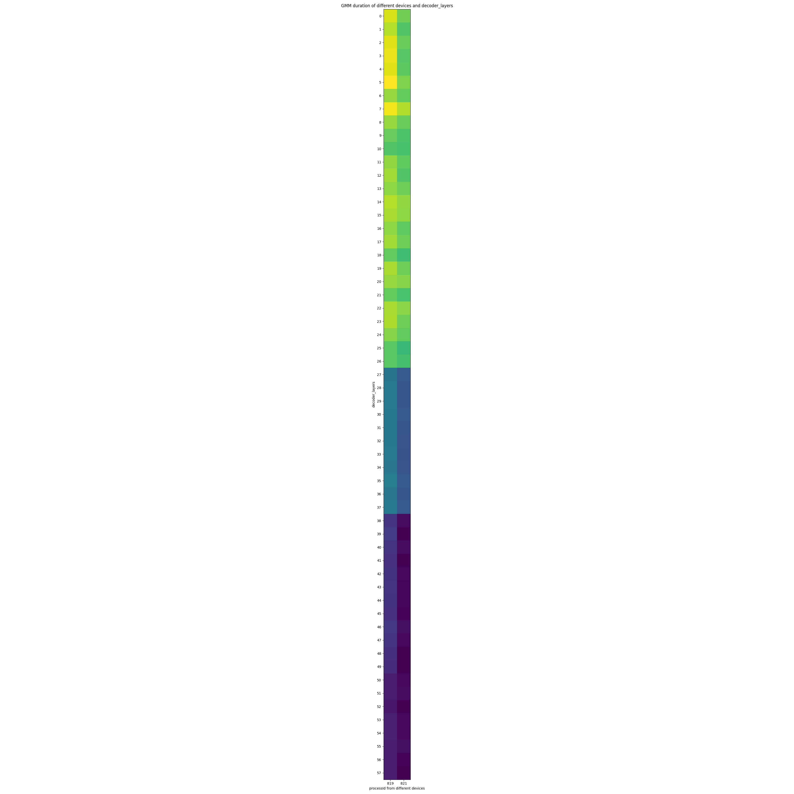
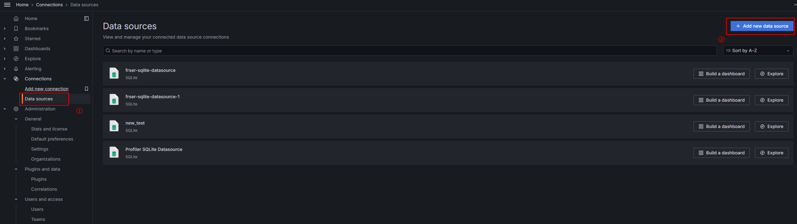
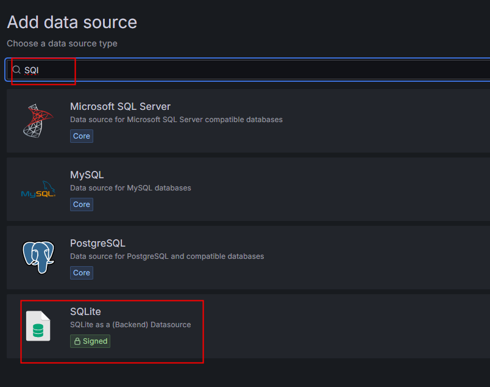
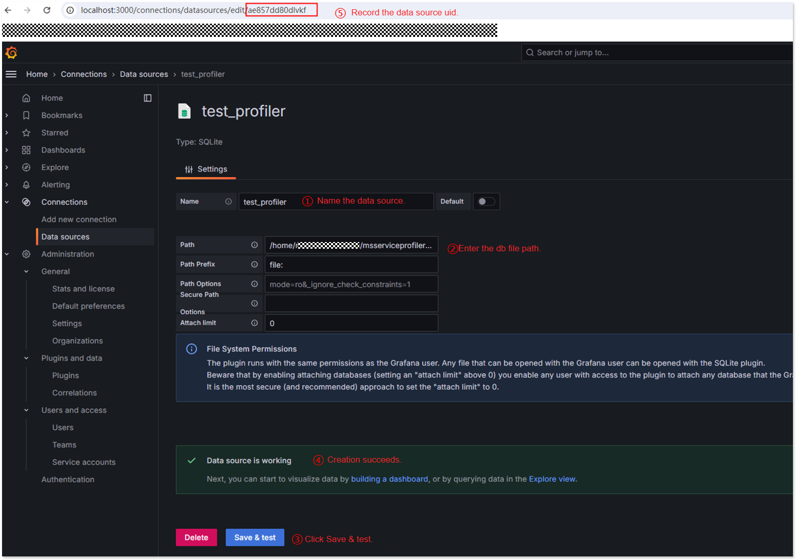
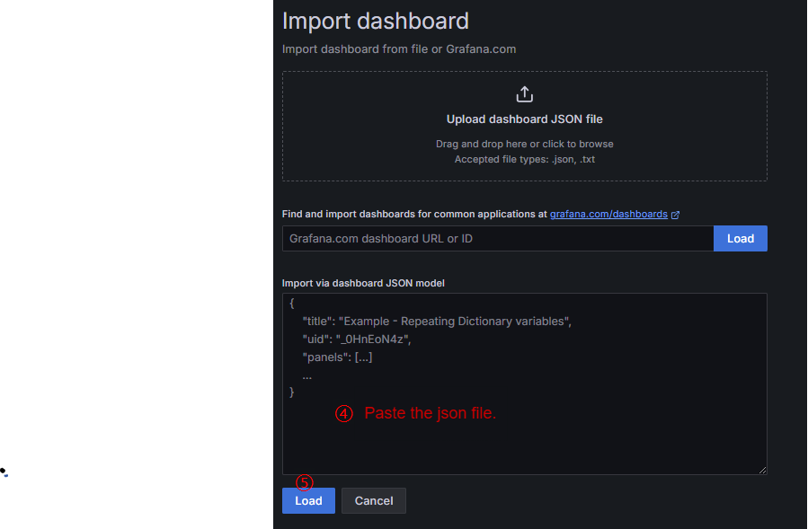
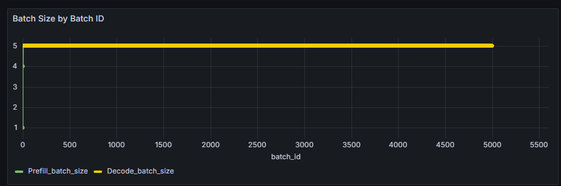
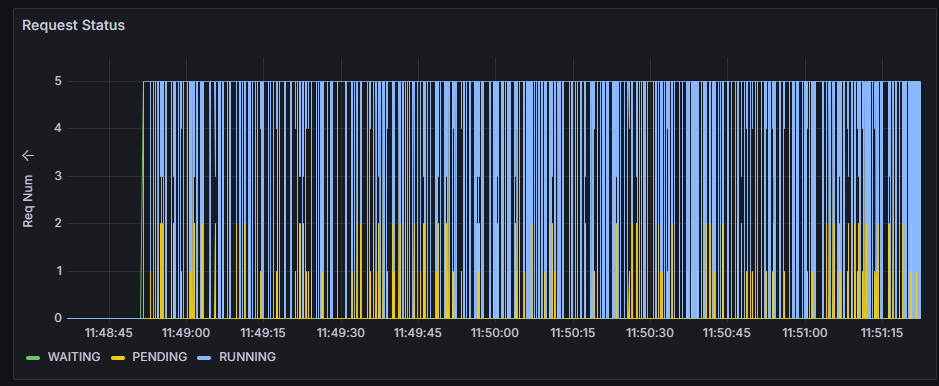
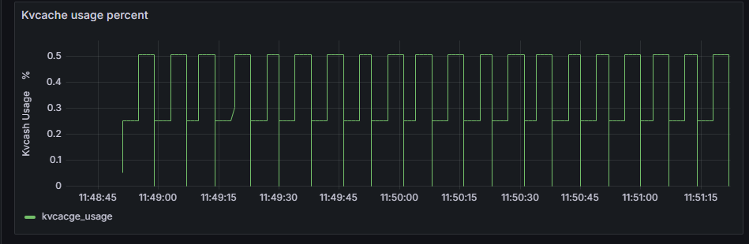
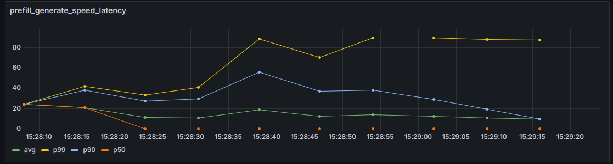

# msServiceProfiler<a name="ZH-CN_TOPIC_0000002518521921"></a>

## Introduction<a name="EN-US_TOPIC_0000002171752224"></a>

This document describes the profiling tool (msServiceProfiler) for inference serving. The msServiceProfiler APIs collect start and end times for key processes, identify main functions or iterations, and record important events during the MindIE Motor inference serving. msServiceProfiler profiles various data and helps pinpoint performance issues quickly.

- msServiceProfiler includes [C++ APIs](./cpp_api/serving_tuning/README.md) and [Python APIs](./python_api/README.md) .
- For details about MindIE Motor, see [MindIE Motor Developer Guide](https://gitcode.com/Ascend/MindIE-Motor/blob/master/docs/en/user_guide/README.md).

The tool usage process is as follows:

1. [Preparations](#preparations)
2. [Data Collection](#data-collection)
3. [Data Parsing](#data-parsing)
4. [Data Visualization](#data-visualization)

## Supported Products<a name="ZH-CN_TOPIC_0000002479925980"></a>

>[!NOTE]
>
>For details about Ascend product models, see [Ascend Product Models](<>).

|Product Type| Supported (Yes/No)|
|--|:----:|
|Atlas A3 training products and Atlas A3 inference products|  Yes  |
|Atlas A2 training products and Atlas A2 inference products|  Yes  |
|Atlas 200I/500 A2 inference products|  No  |
|Atlas inference products|  Yes  |
|Atlas training products|  No  |

>[!NOTE]
>
>For Atlas A2 training products/Atlas A2 inference products, only the Atlas 800I A2 inference server is supported.
>For Atlas inference products, only the Atlas 300I Duo inference card and Atlas 800 inference server (model 3000) are supported.

## Preparations

The hardware environment supported by the tool is the same as that supported by MindIE. For details, see "Installing MindIE" in [MindIE Installation Guide](https://gitcode.com/Ascend/MindIE-Motor/blob/master/docs/en/user_guide/install/installing_mindie.md).

1. Install the matching CANN Toolkit and ops operator packages, and configure CANN environment variables. For details, see [CANN Installation Guide](<>).
2. Install [msServiceProfiler](msserviceprofiler_install_guide.md).
3. Install and configure MindIE and ensure that MindIE Motor can run properly. For details, see [MindIE Installation Guide](https://gitcode.com/Ascend/MindIE-Motor/blob/master/docs/en/user_guide/install/installing_mindie.md).
4. After the preceding environment is prepared, you can use [msprechecker](https://gitcode.com/Ascend/msit/tree/master/msprechecker) to check environment variables and serving configurations.

## Data Collection

**Function description<a name="section92893354593"></a>**

Collects serving profile data.

**Precautions<a name="section7961133411551"></a>**

- Enabling the `acl\_task\_time` feature in msServiceProfiler simultaneously with the msProf dynamic collection feature may cause conflicts. It is advised to use them separately. For details about the msProf dynamic collection feature, see [Profiling Tool User Guide](<>).

**Examples<a name="section1541662513115"></a>**

1. Create a configuration file for profiling. The tool profiles serving data based on settings in a JSON file that defines whether to profile data and where to store it.
   - Automatic creation: The file can be automatically created. After the `SERVICE\_PROF\_CONFIG\_PATH` environment variable is configured in [2](#li177905365245), running MindIE Motor can automatically create a JSON file with the default settings.

   - Manual creation: The JSON configuration file can be created in any path. The following uses the `ms\_service\_profiler\_config.json` file as an example. The configuration file format is as follows:

     ```json
     {
         "enable": 1,
         "prof_dir": "${PATH}",
         "acl_task_time": 0,
         "acl_prof_task_time_level": ""
     }
     ```

     **Table 1** Parameter description

     | Parameter                    | Description                                                                                                                                                                                                                                                                                                                                                                                                                                                                                                                                                                                                                                                                                                                                                                                                                                                                                                                                                                                                                                                                                                                                                                                                                                                                               | **Mandatory (Yes/No)**|
     | ------------------------ |-----------------------------------------------------------------------------------------------------------------------------------------------------------------------------------------------------------------------------------------------------------------------------------------------------------------------------------------------------------------------------------------------------------------------------------------------------------------------------------------------------------------------------------------------------------------------------------------------------------------------------------------------------------------------------------------------------------------------------------------------------------------------------------------------------------------------------------------------------------------------------------------------------------------------------------------------------------------------------------------------------------------------------------------------------------------------------------------------------------------------------------------------------------------------------------------------------------------------------------------------------------------------------------| -------- |
     | enable                  | Whether to enable profiling. The options are as follows:<br>`0`: disabled.<br>`1`: enabled.                                                                                                                                                                                                                                                                                                                                                                                                                                                                                                                                                                                                                                                                                                                                                                                                                                                                                                                                                                                                                                                                                                                                                                                                                                           | Yes      |
     | metric_enable           | Whether to enable metric (Prometheus/metric) collection. The value is independent of `enable`. The options are as follows:<br>`0`: disabled.<br>`1`: enabled.<br>The default value (without this key) is 0 (disabled).                                                                                                                                                                                                                                                                                                                                                                                                                                                                                                                                                                                                                                                                                                                                                                                                                                                                                                                                                                                                                                                                                                                                                                                                                                   | No      |
     | prof_dir                 | Path for storing the collected profile data. The value is of string type and can be customized. The default value is `${HOME}/.ms_server_profiler`.                                                                                                                                                                                                                                                                                                                                                                                                                                                                                                                                                                                                                                                                                                                                                                                                                                                                                                                                                                                                                                                                                                                                                                                                                        | No      |
     | profiler_level           | Profiling level, which defaults to **INFO**.                                                                                                                                                                                                                                                                                                                                                                                                                                                                                                                                                                                                                                                                                                                                                                                                                                                                                                                                                                                                                                                                                                                                                                                                                                                                  | No      |
     | host_system_usage_freq   | Frequency of profiling CPU and memory system metrics. Profiling of these metrics is disabled by default. The value is an integer between 1 Hz and 50 Hz, showing the number of profiling samples per second. If this parameter is set to **-1**, profiling of these metrics is disabled.<br>Enabling this function may occupy a large amount of memory. You are advised not to modify this setting.                                                                                                                                                                                                                                                                                                                                                                                                                                                                                                                                                                                                                                                                                                                                                                                                                                                                                                                                                                                                                                                                                                                                                                                           | No      |
     | npu_memory_usage_freq    | Frequency of profiling NPU memory usage metrics. Profiling of these metrics is disabled by default. The value is an integer between 1 Hz and 50 Hz, showing the number of profiling samples per second. If this parameter is set to **-1**, profiling of these metrics is disabled.<br>Enabling this function may occupy a large amount of memory. You are advised not to modify this setting.                                                                                                                                                                                                                                                                                                                                                                                                                                                                                                                                                                                                                                                                                                                                                                                                                                                                                                                                                                                                                                                                                                                                                                                     | No      |
     | acl_task_time            | Enables or disables profiling for operator dispatch time and execution time. The options are as follows:<br>`0`: disabled. (default). Setting this parameter to `0` or any other invalid value disables this feature.<br>`1`: enabled. When this function is enabled, call the `ACL_PROF_TASK_TIME_L0` parameter of the aclprofCreateConfig API.<br>`2`: enables writing data to disk using the MSPTI. When this function is enabled, the MSPTI is invoked to collect profile data. You need to configure the `export LD_PRELOAD={INSTALL_DIR}/lib64/libmspti.so` environment variable before starting the service.<br>Replace *`${INSTALL_DIR}`* with the file storage path after the CANN software is installed. For example, if the installation is performed by the `root` user, the file storage path is `/usr/local/Ascend/cann`.<br>`3`: enables writing data to disk using the Torch Profiler interface.<br>For details about the aclprofCreateConfig interface and MSPTI, see [Profiling Tool User Guide](<>). Enabling this function introduces performance overhead, which may cause inaccurate profile data. For further detailed analysis, you are advised to enable this function only when model execution is abnormal.                                                                                                                                                                                                                                                                                                                                                                                                                                                                                                                                                                                                                                                                                                                                                                                                        | No      |
     | acl_prof_task_time_level | Level and duration for collecting profile data. The options are as follows:<br>`L0`: (level 0) collects the operator dispatch time and operator execution time. Compared with `L1`, `L0` omits basic operator information collection, reducing performance overhead and enabling more accurate timing statistics. It is equivalent to configuring the `aclDataTypeConfig` parameter with `ACL_PROF_MSPROFTX` and `ACL_PROF_TASK_TIME_L0`.<br>`L1`: (level 1) collects AscendCL API profile data, including synchronous/asynchronous memory copy latency (host-device and device-device), operator dispatch and execution time, and basic operator information. This level provides comprehensive profile data for in-depth analysis. It is equivalent to configuring the `aclDataTypeConfig` parameter with `ACL_PROF_MSPROFTX`, `ACL_PROF_TASK_TIME`, and `ACL_PROF_ACL_API`.<br>{time}: indicates the collection duration. The value is an integer ranging from 1 to 999, in seconds.<br>If not set (default), `L0` data is collected until the program finishes execution. If other invalid values are set, the default value is used. The collection level and duration can be specified together in the same configuration, for example, `"acl_prof_task_time_level":`*`"L1;10"`*.<br>Currently, the collection duration {time} cannot be configured for Torch Profiler.                                                                                                                                                                                                                                                                                                                                                                                                                                                                                                                                                                                                                                                                                                                                                               | No      |
     | aclDataTypeConfig        | The following macros can be combined using logical OR operations. Each macro corresponds to a specific type of profile data:<br>For details about the data collected by the following items, see [Data Collection Description](https://www.hiascend.com/document/detail/en/canncommercial/800/devaids/profiling/atlasprofiling_16_0046.html). Actual results may vary depending on your environment. The `aclDataTypeConfig` parameter accepts one or more of the following macros. For example: `"aclDataTypeConfig": "ACL_PROF_ACL_API"`, or `"aclDataTypeConfig": "ACL_PROF_ACL_API, ACL_PROF_TASK_TIME"`.<br>`ACL_PROF_ACL_API`: collects API profile data, including synchronous/asynchronous memory copy latency (host-device and device-device).<br>`ACL_PROF_TASK_TIME`: collects operator dispatch and execution time, and basic operator information. This level provides comprehensive profile data for in-depth analysis.<br>`ACL_PROF_TASK_TIME_L0`: collects operator dispatch and execution time. Compared with `ACL_PROF_TASK_TIME`, `ACL_PROF_TASK_TIME_L0` omits basic operator information collection, reducing performance overhead and enabling more accurate timing statistics.<br>`ACL_PROF_OP_ATTR`: specifies whether to collect operator attribute information. Currently, only the aclnn operator is supported. `ACL_PROF_AICORE_METRICS`: collects AI Core metrics. This macro must be included in the logical OR combination; otherwise, metrics specified in `aicoreMetrics` will not take effect.<br>`ACL_PROF_TASK_MEMORY`: specifies whether to collect CANN operator memory usage for optimization purposes. Single-operator scenario: Operator memory size and lifecycle information are collected at both the Graph Engine (GE) level and the operator level (in single-operator API execution mode, GE memory is not collected). Static graph and static subgraph scenarios: Operator memory size and lifecycle information are collected at the operator level during the operator compilation phase.<br>`ACL_PROF_AICPU`: collects the start and end data of AICPU tasks.<br>`ACL_PROF_L2CACHE`: collects L2 Cache data.<br>`ACL_PROF_HCCL_TRACE`: specifies whether to collect communication data.<br>`ACL_PROF_TRAINING_TRACE`: specifies whether to collect iteration traces.<br>`ACL_PROF_RUNTIME_API`: specifies whether to collect runtime API profile data.<br>`ACL_PROF_MSPROFTX`: obtains profile data output by the user and upper-layer framework program. Within a profiling session (between `aclprofStart` and `aclprofStop` calls), use MindStudio Tools Extension API (mstx API) or msproftx extension APIs to mark events. These APIs record the duration of specific events during application execution and write the data to a performance file. The `msprof` tool can then parse this file and export the profiling data for analysis.<br>For details about the MindStudio Tools Extension (mstx) API, see [mstx API Reference](https://www.hiascend.com/document/detail/en/canncommercial/800/devaids/profiling/msprof_tx_0001.html). For details about the msproftx extension APIs, see "More Features > Profile Data Collection."<br>By default, this parameter is not set. The `acl_prof_task_time_level` is set to `L0`.| No      |
     | aclprofAicoreMetrics     | AI Core performance metrics. For details about the data collected by the following items, see [op_summary (Operator Details)](https://www.hiascend.com/document/detail/en/canncommercial/800/devaids/profiling/atlasprofiling_16_0067.html). Actual results may vary depending on your environment. The `aclprofAicoreMetrics` parameter can accept only one of the following macros. For example: `"aclprofAicoreMetrics": "ACL_AICORE_PIPE_UTILIZATION"`.<br>`ACL_AICORE_PIPE_UTILIZATION`: percentages of time taken by compute units and MTEs.<br>`ACL_AICORE_MEMORY_BANDWIDTH`: percentage of global memory read/write instructions.<br>`ACL_AICORE_L0B_AND_WIDTH`: percentage of local memory read/write instructions. `ACL_AICORE_RESOURCE_CONFLICT_RATIO`: percentage of pipeline queue instructions.<br>`ACL_AICORE_MEMORY_UB`: percentage of local memory read/write instructions. `ACL_AICORE_L2_CACHE`: read/write cache hit counts and miss reallocation counts.<br>ACL_AICORE_NONE = 0xFF<br>The default value is `ACL_AICORE_PIPE_UTILIZATION`.<br>This parameter only takes effect when `ACL_PROF_AICORE_METRICS` is included in the `aclDataTypeConfig` configuration.                                                                                                                                                                                                                                                                                                                                                                                                                                                                                                                                                                                                                                                                                                                                   | No      |
     | api_filter               | Filters profile data. If this parameter is set, it specifies which API's profile data is to be collected. For example, `matmul` records all API data with names containing `matmul` The value is a case-sensitive string. Multiple filter targets are separated by semicolons (;). The default value is empty (records all data).<br>This parameter is valid only when `acl_task_time` is set to `2`.                                                                                                                                                                                                                                                                                                                                                                                                                                                                                                                                                                                                                                                                                                                                                                                                                                                                                                                                                                                                                                                                                                                               | No      |
     | kernel_filter            | Filters profile data. If this parameter is set, it specifies which Kernel's profile data is to be collected. For example, `matmul` records all Kernel data with names containing `matmul` The value is a case-sensitive string. Multiple filter targets are separated by semicolons (;). The default value is empty (records all data).<br>This parameter is valid only when `acl_task_time` is set to `2`.                                                                                                                                                                                                                                                                                                                                                                                                                                                                                                                                                                                                                                                                                                                                                                                                                                                                                                                                                                                                                                                                                                                         | No      |
     | timelimit                | Duration (seconds) for serving profile collection. If this parameter is set, process stops automatically after the specified time. The value is an integer ranging from 0 to 7200. It defaults to `0` (unlimited collection time).<br>Recommended minimum: 120s. If too short, data may be insufficient for parsing and an alarm is triggered.                                                                                                                                                                                                                                                                                                                                                                                                                                                                                                                                                                                                                                                                                                                                                                                                                                                                                                                                                                                                                                                                                                                                  | No      |
     | domain                   | Collects profile data from specified domains to reduce data volume. The input parameter is a case-sensitive string. Multiple domains are separated by semicolons (;), for example, `"Request;KVCache"`. The default value is empty, indicating that the profile data of all domains is collected. The existing domains are `Request`, `KVCache`, `ModelExecute`, `BatchSchedule`, `Communication` and `eplb_observe`. When `eplb_observe` is specified and APIs `MINDIE_ENABLE_EXPERT_HOTPOT_GATHER` and `MINDIE_EXPERT_HOTPOT_DUMP_PATH` for MindIE expert hotspot information collection are enabled, the collected data includes expert hotspot information that can be visualized as a heatmap. Enable the `eplb_observe` domain only when you need to collect expert hotspot information.<br>If the specified domain is incomplete and the collected data cannot be parsed, the tool prints an alarm message. View the [Mapping Between Domains and Parsed Results](#section269581401015).                                                                                                                                                                                                                                                                                                                                                                                                                                                                                                                                                                                                                                                                                                                                                                                                            | No      |
     | torch_prof_stack         | Collects operator call stack information, including the call information of the framework layer and CPU operator layer. The value can be:<br>`false`: disabled (default).<br>`true`: enabled.<br>Before enabling this function, set `acl_task_time` to `3`. Enabling this configuration will cause extra performance overhead.                                                                                                                                                                                                                                                                                                                                                                                                                                                                                                                                                                                                                                                                                                                                                                                                                                                                                                                                                                                                                                                                                                                                                               | No      |
     | torch_prof_modules       | Collects the Python call stack information at the module level, that is, the call information at the framework layer. The value can be:<br>`false`: disabled (default).<br>`true`: enabled.<br>Before enabling this function, set `acl_task_time` to `3`. Enabling this configuration will cause extra performance overhead.                                                                                                                                                                                                                                                                                                                                                                                                                                                                                                                                                                                                                                                                                                                                                                                                                                                                                                                                                                                                                                                                                                                                                         | No      |
     | torch_prof_step_num      | Number of steps to profile. The value is an integer greater than or equal to 0. The default value is 0, indicating that all steps are profiled.<br>Before enabling this function, set `acl_task_time` to `3`.                                                                                                                                                                                                                                                                                                                                                                                                                                                                                                                                                                                                                                                                                                                                                                                                                                                                                                                                                                                                                                                                                                                                                                                                       | No      |
     | profiler_step_num        | Specifies the number of steps for profiling operator and serving data. The value is an integer larger than 0. If this parameter is set to `0` or other invalid values, the entire serving data collection process is stopped. To confirm the profiling steps:<br> &#8226; MindIE determines whether the parameter setting takes effect based on the number of forward points.<br> &#8226; vllm determines whether the parameter setting takes effect based on the number of modelRunnerExec points.                                                                                                                                                                                                                                                                                                                                                                                                                                                                                                                                                                                                                                                                                                                                                                                                                                                                                                                                                                                                                                                                                                                                                                                                                                                                                 | No       |

2. <a name="li177905365245"></a>Collect data.

    1. Configure environment variables and specify the collection configuration file `ms\_service\_profiler\_config.json`.

        ```bash
        export SERVICE_PROF_CONFIG_PATH="./ms_service_profiler_config.json"
        ```

        - If the JSON file does not exist: A default configuration file is automatically created with `enable` set to `0` (collection disabled). After starting MindIE Motor, follow [2.c](#li58961338154210) to set `enable` to `1` and start collection.
        - If the file already exists: No file is created—the existing configuration is used.

    2. Run MindIE Motor.
    3. <a name="li58961338154210"></a>Start the collection task.

        Open another CLI window. You can modify the `**enable**` field in `ms_service_profiler_config.json` to enable or disable the profiling in real time. Enabling or disabling collection generates corresponding logs. See below for details.

        After the collection is complete, the profile data is saved to the path specified by the `prof\_dir` parameter in `ms\_service\_profiler\_config.json`.

    >[!NOTE]
>
    >You can use the Samba tool to share the configuration file for profiling across multiple nodes and devices. In multi-node multi-device setups, follow the same profiling steps mentioned earlier but launch MindIE Motor on every node. Samba is a third-party tool. Search for its usage guide online or try alternative tools for configuring shared directories.
    >Serving profiling supports dynamic start and stopped at runtime. The dynamic start and stop function allows you to start or stop profiling whenever needed.
    >There are three main scenarios as follows:
    >- <a name="li0321112752816"></a>Enable the function: Before starting MindIE Motor, the `enable` field is set to `0` in the JSON configuration file. After MindIE Motor starts, change `enable` to `1`. The log confirms profiling is enabled.
    > 
    >- Disable the function: Before starting MindIE Motor, the `enable` field is set to `1` in the JSON configuration file. After MindIE Motor starts, change `enable` to `0`. The log confirms profiling is disabled.
    > 
    >- The JSON configuration file is updated but the `enable` field remains unchanged. In this case, the profiling function status remains unchanged and the log prints the following message:
    > 

**Output Description<a name="section3518349616"></a>**

During serving profile data collection, logs are generated to indicate the status of the collection process. You can control logging using the `PROF_LOG_LEVEL` environment variable as described below.  

The `PROF\_LOG\_LEVEL` environment variable configures the log level for data collection. The following is an example:

```bash
export PROF_LOG_LEVEL=INFO
```

Available log levels (default: `INFO`):

- `INFO`: includes information such as whether profiling is enabled and where the data is saved.

    The following is an example:

    ```ColdFusion
    [msservice_profiler] [PID:52856] [INFO] [ReadEnable:306] profile enable_: true
    [msservice_profiler] [PID:52856] [INFO] [ReadAclTaskTime:335] profile enableAclTaskTime_: false
    [msservice_profiler] [PID:52856] [INFO] [StartProfiler:661] prof path: ./log/0423-0852/
    ```

- DEBUG: detailed logs. Adds to INFO-level logs: configuration file path, NPU/CPU collection status, and more.

    The following is an example:

    ```ColdFusion
    [msservice_profiler] [PID:82231] [DEBUG] [ReadConfig:275] SERVICE_PROF_CONFIG_PATH : prof.json
    [msservice_profiler] [PID:82231] [DEBUG] [ReadLevel:386] profiler_level: 20
    [msservice_profiler] [PID:82231] [DEBUG] [ReadHostConfig:510] host_system_usage_freq Disabled
    [msservice_profiler] [PID:82231] [DEBUG] [ReadNpuConfig:541] npu_memory_usage_freq Disabled
    ```

- WARNING: Adds to INFO-level logs: parameter errors, dynamic library load failures, and other warnings.

    ```ColdFusion
    [msservice_profiler] [PID:43982] [WARNING] [ReadEnable:323] enable value is not an integer, will set false.
    [msservice_profiler] [PID:43984] [WARNING] [ReadEnable:323] enable value is not an integer, will set false.
    [msservice_profiler] [PID:43993] [WARNING] [ReadEnable:323] enable value is not an integer, will set false.
    [msservice_profiler] [PID:44002] [WARNING] [ReadEnable:323] enable value is not an integer, will set false.
    ```

- ERROR: Only error logs are printed.

    The following is an example:

    ```ColdFusion
    [msservice_profiler] [PID:87888] [ERROR] [StartProfiler:677] create path(./log/0423-1007/) failed
    ```

## Data Parsing

**Function Description<a name="section21638528484"></a>**

Parses serving profile data.

**Precautions<a name="section20819721134913"></a>**

- During data collection, files that have been written to disk are locked. Parsing can only be started after collection is complete; otherwise, the error "db is lock" will be displayed.
- Do not enable dynamic collection again before data parsing is complete, as this may degrade collection performance.
- The following versions are required for data parsing:
    - python \>= 3.10
    - pandas \>= 2.2
    - numpy \>= 1.24.3
    - psutil \>= 5.9.5
    - matplotlib \>= 3.7.5
    - scipy \>= 1.7.2

**Syntax<a name="section10872103414491"></a>**

```bash
python3 -m ms_service_profiler.parse --input-path <input-path> [options]
```

For details about the options parameter, see [Parameter description](#section379581401015).

**Parameter Description<a name="section379581401015"></a>**

**Table 1** Parameter description

| **Parameter**       | Description                                                                                                                                                                                                                                                                                                                                                                                                                                                            |**Mandatory (Yes/No)**|
|---------------|----------------------------------------------------------------------------------------------------------------------------------------------------------------------------------------------------------------------------------------------------------------------------------------------------------------------------------------------------------------------------------------------------------------------------------------------------------------|--|
| --input-path  | Specifies the path for storing profile data. All databases named `msproftx.db`, `ascend_service_profiler_.db`, and `ms_service_.db` in the path will be traversed and read.                                                                                                                                                                                                                                                                                                                                                                         |Yes|
| --output-path | Specifies the output path for parsed files. It defaults to the `output` directory in the current path.                                                                                                                                                                                                                                                                                                                                                                                                                                |No|
| --log-level   | Sets the log level. The options are as follows:<br>`debug`: debug level. Logs at this level record the debugging information for R&D or maintenance personnel to locate faults.<br>`info`: normal level (default). Logs at this level record normal tool operation information.  <br>`warning`: warning level. Logs at this level record unexpected states that do not affect process execution.<br>`error`: minor error level. `fatal`: major error level. `critical`: critical error level.                                                                                                                                                                                                                                                                         |No|
| --format      | Sets the export format for the profile data output files. The options are as follows:<br>`csv`: Only result files in .csv format are exported. Generally, this format is used for large raw data (>10 GB). Exporting result files in this format reduces parsing time. The .csv file contains request scheduling time, model execution time, KVCache memory usage, and more.<br>`json`: Only result files in .json format are exported. Generally, this format is used when only trace data is used for analysis. Exporting result files in this format reduces parsing time. The .json file contains the timeline diagram of the full serving inference process.<br>`db`: Only result files in .db format are exported. Generally, this format is used only when result data is analyzed exclusively with MindStudio Insight. The .db file contains the complete parsed results, which can be fully visualized directly in MindStudio Insight.<br>If `format` is not specified, all formats are exported by default. You can specify one or more formats, for example, `--format db` and `--format db csv`.<br>If `acl_task_time` is set to `2` during data collection, the file containing parsed results can be exported only in .json or .db format.|No|
| --span        | Exports specified span data to the `output/span_info` directory.<br>1. If `span` is not specified, span data is not exported by default.<br>2. Using `--span` to export the `forward.csv` and `BatchSchedule.csv` files by default.<br>3.`--span` accepts one or more parameters. For example, if `--span sample Execute` is used, the `sample.csv` and `Execute.csv` files are exported in addition to the `forward.csv` and `BatchSchedule.csv` files. For available values, open the profile data output file with MindStudio Insight and check the span information in the Timeline chart.<br>For details, see [span_info Directory Description](#span_info-directory).                                                                                                                                                  |No|

**Examples<a name="section192337387165"></a>**

Run the following command to perform basic parsing on profile data.

```bash
python3 -m ms_service_profiler.parse --input-path ${PATH}/prof_dir/
```

In addition to basic parsing, you can perform [multi-dimensional parsing](./msserviceprofiler_multi_analyze_instruct.md) on profile data by different dimensions (request-level, batch-level, overall service-level). You can also perform fine-grained [performance breakdown] (./service_performance_split_tool_instruct.md) on data of different batches.

**Output Description<a name="section1852614831412"></a>**

After the parsing command is executed, the [parsed results](#parsed-results) are output to the path specified by the `--output-path` parameter.

## Parsed Results

The results of `ms\_service\_profiler.parse` are as follows:

**Table 1** Mapping between collection domains and parsed results<a name="section269581401015"></a>

|Parsed Results|Collection domain|
|--|--|
|profiler.db|"Schedule"|
|chrome_tracing.json|There is no mandatory restriction. To view flow events between requests, you must collect the `Request` domain.|
|batch.csv|"Schedule"|
|kvcache.csv|"KVCache"|
|request.csv|"Request"|
|forward.csv|"Schedule"|
|pd_split_communication.csv|"Communication"|
|pd_split_kvcache.csv|"KVCache"|
|coordinator.csv|"Coordinator"|
|{host_name}_eplb_{i}_summed_hot_map_by_expert.png|"eplb_observe"|
|{host_name}_eplb_{i}_summed_hot_map_by_rank.png|"eplb_observe"|
|{host_name}_eplb_{i}_summed_hot_map_by_model_expert.png|"eplb_observe"|
|{host_name}_balance_ratio.png|"eplb_observe"|

>[!NOTE]
>
>The preceding table does not list the results parsed out from the data collected using the `acl\_prof\_task\_time\_level`, `aclDataTypeConfig`, and `aclprofAicoreMetrics` parameters. For details about the results, see [Data Collection Description](<>) and [op\_summary (Operator Details)](<>). Actual results may vary depending on your environment. The `op\_statistic\_\*.csv` and `op\_summary\_\*.csv` files are saved to the `PROF\_XXX` directory under the path specified by `--output-path`. The profile data files collected using the three parameters are saved in the `PROF\_XXX/mindstudio\_profiler\_output` directory under the path specified by `prof\_dir`.

These files include:

### **profiler.db**

It is an SQLite database file for generating visualized line charts.

It contains the following database tables, with their specific purposes described below:

**Table 2** profiler.db

|Table Name|Description|
|--|--|
|batch|Provides batch data for display in MindStudio Insight.|
|decode_gen_speed|Generates line charts showing average token latency at different time points in the decode phase.|
|first_token_latency|Generates line charts of the time to first token (TTFT) in the serving framework.|
|kvcache|Generates line charts for visualizing KV cache memory usage in the serving framework.|
|prefill_gen_speed|Generates line charts showing average token latency at different time points in the prefill phase.|
|req_latency|Generates line charts showing the end-to-end latency for the serving framework.|
|request_status|Generates line charts showing the request status over time for serving profiling.|
|request|Provides tabular request data for display in MindStudio Insight.|
|batch_exec|Represents the relationship between batches and model execution.|
|batch_req|Represents the relationship between batches and requests.|
|data_table|Provides tabular data for display in MindStudio Insight.|
|counter|Displays counter-type data in trace views.|
|flow|Displays flow events in trace views.|
|process|Displays secondary lane data in trace views.|
|thread|Displays tertiary lane data in trace views.|
|slice|Displays slice data in trace views.|
|pd_split_kvcache|Provides KV cache data for the D-node in Prefill-Decode (PD) disaggregation scenarios for display in MindStudio Insight (applicable only to PD disaggregation).|
|pd_split_communication|Provides communication data for prefill (P) and decode (D) nodes in PD disaggregation scenarios for display in MindStudio Insight (applicable only to PD disaggregation).|
|ep_balance|Records load imbalance analysis results for the GroupedMatmul operator, collected via MSPTI during DeepSeek expert model serving inference.|
|moe_analysis|Records fast/slow rank analysis results for the MoeDistributeCombine and MoeDistributeDispatch operators, collected via MSPTI during DeepSeek expert model serving inference.|
|data_link|When viewing forward traces, supports clicking `rid` to display request input length information.|

For details about PD disaggregation deployment and related concepts, see "Cluster Service Deployment > PD Disaggregation Service Deployment" in [MindIE Motor Developer Guide](https://gitcode.com/Ascend/MindIE-Motor/blob/master/docs/en/user_guide/README.md). The file connects to Grafana for image display during visualization. It does not include detailed descriptions of its entries.

### **chrome\_tracing.json**

Records trace data of inference service requests. You can use different visualization tools to view the data. For details, see [Data Visualization](#data-visualization).

### **batch.csv**

Records detailed batch-level data for inference serving.

Table 3 batch.csv

|Field|Description|
|--|--|
|name|Distinguishes between batching and execution phases. Rows with name `batchFrameworkProcessing` represent the batching phase. Rows with names `modelExec` and `specDecoding` represent the execution phase (speculative inference).|
|res_list|Batch composition information.|
|start_datetime|Start time of the batching or execution phase.|
|end_datetime|End time of the batching or execution phase.|
|during_time(ms)|Execution time, in ms.|
|batch_type|Request status (`prefill` or `decode`) in a batch.|
|prof_id|Identifies a card. This value is the same for the same device.|
|batch_size|Records the total batch size during the batching phase.|
|prefill_batch_size|Records the batch size during the prefill phase in scheduling.|
|decode_batch_size|Records the batch size during the decode phase in scheduling.|
|total_blocks|Records the total number of KV cache memory blocks, obtained from the original `TotalBlocks` field. This is currently supported only in vLLM scenarios.|
|used_blocks|Records the number of memory blocks actually occupied after scheduling, calculated as `total_blocks - free_blocks`. This is currently supported only in vLLM scenarios.|
|free_blocks|Records the number of available memory blocks remaining after scheduling, obtained from the original `FreeBlocksAfter` field. This is currently supported only in vLLM scenarios.|
|blocks_allocated|Records the KV cache resources consumed by this scheduling operation, calculated as `FreeBlocksBefore - FreeBlocksAfter`. This is currently supported only in vLLM scenarios.|
|blocks_freed|Records the KV cache resources released from this scheduling operation, calculated as `FreeBlocksAfter - FreeBlocksBefore`. This is currently supported only in vLLM scenarios.|
|kvcache_usage_rate|Calculates the KV cache memory usage percentage during scheduling, calculated as `used_blocks / total_blocks`. This is currently supported only in vLLM scenarios.|
|prefill_scheduled_tokens|Records the number of tokens occupied by prefill during scheduling|
|decode_scheduled_tokens|Records the number of tokens occupied by decode during scheduling.|
|total_scheduled_tokens|Records the total number of tokens during scheduling.|
|dp_rank|DP information of a batch. This value is the same for the same DP domain. If no DP domain exists, this field is `<NA>`|
|start_time(ms)|Timestamp when the batching or execution phase starts.|
|end_time(ms)|Timestamp when the batching or execution phase ends.|
|accepted_ratio|Speculative inference acceptance ratio for the current batch, calculated as `sum(accepted_tokens) / sum(spec_tokens)`. Valid only for `specDecoding` rows.|
|accepted_ratio_per_pos|Acceptance ratio for each draft position in the current batch, in dictionary format, for example, `{"0": 0.95, "1": 0.88}`. Valid only for `specDecoding` rows.|

>[!NOTE]
>
>Parsed data for speculative inference scenarios is currently supported only with the vLLM framework. For data collection, see the [vLLM Service Profiler User Guide](./vLLM_service_oriented_performance_collection_tool.md).

### **spec_decode.csv**

It is automatically generated in the speculative inference scenario and records the speculative inference data for each request at each time step.

**Table 3-2** spec_decode.csv

|Field|Description|
|--|--|
|rid|Request ID.|
|iter|Decoding iteration sequence number of this step.|
|prof_id|Card/Process ID.|
|start_datetime|Request start time for this Multi-Token Prediction (MTP) step.|
|end_datetime|Request end time for this MTP step.|
|during_time(ms)|Duration of this MTP step.|
|spec_tokens|Number of speculative inference tokens output by this request in this step.|
|accepted_tokens|Number of tokens accepted by this request in this step.|
|accepted_ratio|Token acceptance ratio for this request in this step.|
|draft_model_time_ms|Total draft model time for this step (same for all requests in the same step).|

>[!NOTE]
>
>Parsed data for speculative inference scenarios is currently supported only with the vLLM framework. For data collection, see the [vLLM Service Profiler User Guide](./vLLM_service_oriented_performance_collection_tool.md).

### **kvcache.csv**

Records memory usage during inference.

**Table 4** kvcache.csv

|Field|Description|
|--|--|
|rid|ID of a request associated with a KV cache event. Valid only for the MindIE scenario.|
|name|Method that changes memory usage.|
|start_time|Time when the memory usage changes.|
|total_blocks|Records the total number of KV cache memory blocks, obtained from the original `TotalBlocks` field. This is currently supported only in vLLM scenarios.|
|used_blocks|Records the number of memory blocks actually occupied after scheduling, calculated as `total_blocks - free_blocks`. This is currently supported only in vLLM scenarios.|
|free_blocks|Records the number of available memory blocks remaining after scheduling, obtained from the original `FreeBlocksAfter` field. This is currently supported only in vLLM scenarios.|
|blocks_allocated|Records the KV cache resources consumed by this scheduling operation, calculated as `FreeBlocksBefore - FreeBlocksAfter`. This is currently supported only in vLLM scenarios.|
|blocks_freed|Records the KV cache resources released from this scheduling operation, calculated as `FreeBlocksAfter - FreeBlocksBefore`. This is currently supported only in vLLM scenarios.|
|device_kvcache_left|Calculates the remaining KVCache after this memory operation. Exclusive to the MindIE framework.|
|kvcache_usage_rate|Calculates the KV cache memory usage percentage during scheduling, calculated as `used_blocks / total_blocks`.|

### **request.csv**

Records detailed request-level data for inference serving.

**Table 5** request.csv

|Field|Description|
|--|--|
|http_rid|HTTP request ID.|
|start_datetime|Time when a request arrives.|
|recv_token_size|Input token length of a request.|
|reply_token_size|Output token length of a request.|
|execution_time(ms)|End-to-end request duration, in ms.|
|queue_wait_time(ms)|Total waiting time of a request in the queue throughout the inference process, including both waiting and pending periods, measured in ms.|
|first_token_latency(ms)|Time to first token (TTFT), in ms.|
|cache_hit_rate|Cache hit rate.|
|start_time(ms)|Timestamp when a request arrives.|

### **forward.csv**

Records detailed data during the model forward execution in serving inference.

**Table 6** forward.csv

|Field|Description|
|--|--|
|name|Labels a forward event, indicating the model forward execution process.|
|relative_start_time(ms)|Interval between each forward event and the first forward event on each host.|
|start_datetime|Start time of a forward event.|
|end_datetime|End time of a forward event.|
|during_time(ms)|Execution duration of a forward event, in ms.|
|bubble_time(ms)|Bubble time between forward events, in ms.|
|batch_size|Number of requests processed in a forward event.|
|batch_type|Request status in a forward event.|
|forward_iter|Forward iteration number on each device.|
|dp_rank|DP information of a forward event. This value is the same for the same DP domain. If no DP domain exists, this field is `0`.|
|prof_id|Identifies different devices. This value is the same for the same device.|
|hostname|Identifies different hosts. This value is the same for the same host.|
|start_time(ms)|Start timestamp of a forward event.|
|end_time(ms)|End timestamp of a forward event.|

### **pd\_split\_communication.csv**

Contains communication data for PD disaggregation scenarios. PD disaggregation is a multi-node, multi-device (cluster) deployment that requires a shared configuration file during [data collection](#li177905365245).

For details about PD disaggregation deployment and related concepts, see "Cluster Service Deployment \> PD Disaggregation Service Deployment" in [MindIE Motor Developer Guide](https://gitcode.com/Ascend/MindIE-Motor/blob/master/docs/en/user_guide/README.md).

**Table 7** pd\_split\_communication.csv

|Field|Description|
|--|--|
|rid|Request ID.|
|http_req_time(ms)|Time when a request arrives, in ms.|
|send_request_time(ms)|Time when a P-node starts sending a request to a D-node, in ms.|
|send_request_succ_time(ms)|Time when the request is successfully sent, in ms.|
|prefill_res_time(ms)|Time when prefill completes, in ms.|
|request_end_time(ms)|Time when the request execution completes, in ms.|

### **pd\_split\_kvcache.csv**

Records KV cache transfer between P-nodes and D-nodes during PD disaggregation inference. PD disaggregation is a multi-node, multi-device (cluster) deployment that requires a shared configuration file during [data collection](#li177905365245).

For details about PD disaggregation deployment and related concepts, see "Cluster Service Deployment \> PD Disaggregation Service Deployment" in [MindIE Motor Developer Guide](https://gitcode.com/Ascend/MindIE-Motor/blob/master/docs/en/user_guide/README.md).

**Table 8** pd\_split\_kvcache.csv

|Field|Description|
|--|--|
|domain|Labels a PullKVCache event.|
|rank|Device ID|
|rid|Request ID.|
|block_tables|block_tables information.|
|seq_len|Request length.|
|during_time(ms)|Time taken to transfer KV cache from a P-node to a D-node, in ms.|
|start_datetime(ms)|Start time of KV cache transfer from a P-node to a D-node, formatted as a date string (value stored in ms).|
|end_datetime(ms)|End time of KV cache transfer from a P-node to a D-node, formatted as a date string (value stored in ms).|
|start_time(ms)|Start time of KV cache transfer from a P-node to a D-node, displayed as a timestamp, in ms.|
|end_time(ms)|End time of KV cache transfer from a P-node to a D-node, displayed as a timestamp, in ms.|

### **coordinator.csv**

Records changes in the number of requests distributed to each node during PD disaggregation inference. PD disaggregation is a multi-node, multi-device (cluster) deployment that requires a shared configuration file during [data collection](#li177905365245).

For details about PD disaggregation deployment and related concepts, see "Cluster Service Deployment \> PD Disaggregation Service Deployment" in [MindIE Motor Developer Guide](https://gitcode.com/Ascend/MindIE-Motor/blob/master/docs/en/user_guide/README.md).

**Table 9** coordinator.csv

|Field|Description|
|--|--|
|time|Time when the number of requests changes.|
|address|Address distributed to a node. Format: *`IP address`*:*`port number`*.|
|node_type|Node type (prefill or decode).|
|add_count|Number of requests added to the current node.|
|end_count|Number of ended requests on the current node.|
|running_count|Number of requests completed on the current node.|

### **request\_status.csv**

Records the request status at each moment during serving inference (the number of `waiting`, `running`, or `swapped` requests). This data can be used to generate line charts that visualize request status trends over time.

Table 12 request\_status.csv

|Field|Description|
|--|--|
|hostuid|Node ID.|
|pid|Process ID.|
|start_datetime|Time when a request arrives.|
|relative_timestamp(ms)|Relative timestamp, in ms.|
|waiting|Number of `waiting` requests.|
|running|Number of `running` requests.|
|swapped|Number of `swapped` requests.|
|timestamp(ms)|Timestamp, in ms.|

### span\_info directory

A `span` is the minimum performance monitoring unit in distributed tracing, corresponding to a basic step in the inference process. The `span_info` directory stores profile data for different span types. By default, it contains `forward.csv` for forward inference data and `BatchSchedule.csv` for batch scheduling data. Multiple span types can be customized. Exported data includes fields such as execution duration, host, and process ID. The following uses `BatchSchedule.csv` as an example.

**Table 13** BatchSchedule.csv

|Field| Description                                               |
|--|---------------------------------------------------|
|span_name| Span type.                                          |
|start_datetime| Start time of a span.                                       |
|end_datetime| End time of a span.                                       |
|during_time(ms)| Span execution time, in ms.                                   |
|hostname| Identifies different hosts. This value is the same for the same host.                                    |
|pid| Process ID.|

### **ep\_balance.csv**

Records load imbalance analysis results for the GroupedMatmul operator, collected via MSPTI during DeepSeek expert model serving inference.

If data for `ep\_balance` analysis exists, running the parsing command will generate a heatmap [Figure 1](#fig86411261854) in the output directory by default. In the heatmap, the x-axis represents the process ID of each device, and the y-axis represents the decoder layer of the model. Brighter pixels indicate longer duration. Greater color variation across rows indicates more significant load imbalance.

**Table 10** ep\_balance.csv

|Field|Description|
|--|--|
|{Process ID} (row header)|Indicates the process ID of each device at runtime.|
|{Decoder Layer} (column value)|Indicates the decoder layer index of the model running on each device.|

**Figure 1** ep\_balance.png<a name="fig86411261854"></a> 


### **moe\_analysis.csv**

Records fast/slow rank analysis results for the MoeDistributeCombine and MoeDistributeDispatch operators, collected via MSPTI during DeepSeek expert model serving inference.

If data for `moe_analysis` exists, running the parsing command will generate a box plot [Figure 2](#fig106051734569) in the output directory by default. In the box plot, the x-axis represents the process ID of each device, and the y-axis represents the total duration. The plot displays the mean and the 2.5th/97.5th percentiles of the total duration. Greater disparity between devices (wider percentile intervals) indicates more significant fast/slow rank issues.

**Table 11** moe\_analysis.csv

|Field|Description|
|--|--|
|Dataset|Process ID of the corresponding device.|
|Mean|Mean total duration of the MoeDistributeCombine and MoeDistributeDispatch operators on this device.|
|CI Lower|2.5th percentile of the total duration for the MoeDistributeCombine and MoeDistributeDispatch operators on this device.|
|CI Upper|97.5th percentile of the total duration for the MoeDistributeCombine and MoeDistributeDispatch operators on this device.|

**Figure 2** moe\_analysis.png<a name="fig106051734569"></a> 


### **\{host\_name\}\_eplb\_\{i\}\_summed\_hot\_map\_by\_expert.png**

This is an expert hotspot heatmap. In [Figure 3](#fig732654205612), pixel brightness indicates hotspot intensity (see the colorbar on the right), that is, brighter means higher heat.

- `host\_name` indicates the device name.
- `i` indicates the number of load balancing table updates during the serving profiling period when dynamic load balancing is enabled on MindIE. If disabled, `i = 0`.

**Figure 3** Heatmap<a name="fig732654205612"></a> 
![] (figures/heatmap.png "heatmap")

The x-axis represents expert ID, and the y-axis represents the model's MoE layer.

In the model instance, expert IDs are sorted by `Rank\_id` in ascending order, then numbered sequentially within each rank. For example, with 16 cards each having 17 experts, expert ID 42 corresponds to `expert\_7` (the eighth expert) on `Rank\_2` (the third card).

### **\{host\_name\}\_eplb\_\{i\}\_summed\_hot\_map\_by\_rank.png**

This is an expert hotspot heatmap. In [Figure 4](#fig455912215212), pixel brightness indicates hotspot intensity (see the colorbar on the right), that is, brighter means higher heat.

- `host\_name` indicates the device name.
- `i` indicates the number of load balancing table updates during the serving profiling period when dynamic load balancing is enabled on MindIE. If disabled, `i = 0`.

**Figure 4** Heatmap<a name="fig455912215212"></a> 
![] (figures/heatmap-0.png "heatmap-0")

The x-axis represents `Rank\_ID`, and the y-axis represents the model's MoE layer.

### **\{host\_name\}\_eplb\_\{i\}\_summed\_hot\_map\_by\_model\_expert.png**

This is an expert hotspot heatmap. In [Figure 5](#fig1161912109318), pixel brightness indicates hotspot intensity (see the colorbar on the right), that is, brighter means higher heat.

- `host\_name` indicates the device name.
- `i` indicates the number of load balancing table updates during the serving profiling period when dynamic load balancing is enabled on MindIE. If disabled, `i = 0`.
- This figure is generated only when the dynamic load balancing feature of MindIE is enabled.

**Figure 5** Heatmap<a name="fig1161912109318"></a> 
![] (figures/heatmap-1.png "heatmap-1")

The x-axis represents the model expert IDs, where the shared experts are listed at the end. The y-axis represents the model's MoE layer.

### **\{host\_name\}\_balance\_ratio.png**

This is an expert load imbalance line chart. [Figure 6](#fig3559155015275) shows the degree of expert load imbalance over time.

**Figure 6** Expert load imbalance line chart<a name="fig3559155015275"></a> 
![] (figures/expert load imbalance line chart.png "expert load imbalance line chart")

The horizontal coordinate tokens num indicates the number of model inference rounds, and the vertical coordinate balance ratio indicates the model load imbalance degree, which is calculated based on the standard deviation of expert heat.

The red dotted line indicates a change in the expert load balancing table. The corresponding x-axis value represents the system's local time, which is averaged across devices due to time drift. For accurate results, ensure all devices have synchronized local time before data collection.

## Data Visualization

### MindStudio Insight for Visualization

MindStudio Insight can visualize the profile data ([Parsed Results] (#parsed-results)) collected and analyzed by the service profiler. Currently, it supports visualizing `chrome\_tracing.json` and `profiler.db` files. For detailed operations and visualization results, see the section "Serving Tuning" in [MindStudio Insight User Guide](<>).

### Chrome Tracing Visualization

Chrome tracing can visualize data from t`chrome_tracing.json` file collected and analyzed by the service profiler. To use it:

Enter `chrome://tracing` in the Chrome address bar, drag the .json file to the blank area to open it, and press the shortcut keys (`w`: zoom in; `s`: zoom out; `a`: move left; `d`: move right) to view the file.

>[!NOTE]
>
>If `chrome\_tracing.json` is greater than 500 MB, MindStudio Insight is recommended for visualization.

### Grafana Visualization

**Function Description <a name="section18743945144918"></a>**

Grafana can visualize profile data collected and analyzed by the service profiler.

**Data Preparation <a name="section081361822719"></a>**

[Data parsing](#data-parsing) has been completed, and [parsed results] (#parsed-results) have been generated.

Ensure that the SQLite database file `profiler.db` exists in the path specified by `--output-path`.

**Environment Dependencies<a name="section1280812992719"></a>**

Tool versions: Grafana 11.3.0, and SQLite plugin 11.3.0.

**Installing and Connecting Grafana**

Download the official open-source version from [https://grafana.com/grafana/download?platform=arm&edition=oss](https://grafana.com/grafana/download?platform=arm&edition=oss). Extract and run: Example:

```bash
tar -zxvf grafana-11.3.0.linux-arm64.tar.gz
cd grafana-v11.3.0/bin/
./grafana-server
```

When configuring the Windows proxy, you need to add the Linux device IP prefix (for example, `90.90.*;90.91.*`). Access Grafana at `<http://<Linux-Device-IP>:3000/`. Default username and password are both `admin`.

**Figure 1** Grafana<a name="fig133211037409"></a> 
![] (figures/Grafana.png "Grafana")

**Example<a name="section20198154975911"></a>**

1. Create a data source, as shown in [Figure 2 Data source](#fig119691547124112).

    **Figure 2** Data source<a name="fig119691547124112"></a> 
    

    Set the data source type to `SQLite`, as shown in [Figure 3 Add data source](#fig17555112919480).

    **Figure 3** Add data source<a name="fig17555112919480"></a> 
    

    Connect the generated SQLite database file `profiler.db` to Grafana and record the `datasource uid`, as shown in [Figure 4 Data sources](#fig15266174254917).

    **Figure 4** Data sources<a name="fig15266174254917"></a> 
    

2. Create a dashboard and import the line chart.

    The visualization file `profiler\_visualization.json` is located at /xxx/Ascend/cann-_\{version\}_/tools/msserviceprofiler/python/ms\_service\_profiler/views/. Modify the datasource uid in the JSON file to the uid recorded in the previous step.

    >[!NOTE]
>
    >{version} indicates the CANN software package version. CANN 8.1.RC1 and later versions are supported.

    **Figure 5** uid<a name="fig51134371917"></a> 
    ![] (figures/uid.png "uid")

    >[!NOTE]
>
    >The UID in the JSON file identifies the dashboard uniquely and remain unchanged here. The **title** field names the dashboard, which is defaulted to **Profiler Visualization**.

    **Figure 6**  json<a name="fig761123319212"></a> 
    ![] (figures/json.png "json")

3. Create a new dashboard, paste the modified JSON content, and import it. Find the dashboard under `Dashboards` with the specified name.

    **Figure 7** Dashboards<a name="fig94901561348"></a> 
    

    **Figure 8** Import dashboard<a name="fig944016531767"></a> 
    

    **Figure 9** Setting parameters<a name="fig82151013079"></a> parameter 
    ![] (figures/Setting parameters.png "Setting_parameters")

**Visualization Results<a name="section16851525949"></a>**

The generated Grafana dashboard contains the following visualized charts:

**Table 1** Visualized charts

|Chart Name|Description|
|--|--|
|Batch_Size_curve|Line chart showing request counts per batch during batch scheduling. It distinguishes between prefill and decode batches by time.|
|Batch_Token_curve|Line chart of total tokens during batch scheduling. It distinguishes between prefill and decode.|
|Request_Status_curve|Line chart showing queue sizes in different service states over time.|
|Kvcache_usage_percent_curve|Line chart showing the KV cache usage of all requests over time.|
|First_Token_Latency_curve|Line chart showing TTFT across all requests over time. It includes average TTFT across all requests, along with its 99th, 90th, and 50th percentiles.|
|Prefill_Generate_Speed_Latency_curve|Line chart showing the average per-token latency of tokens being processed during the prefill phase across all requests over time. It includes the average value, along with its 99th, 90th, and 50th percentiles.|
|Decode_Generate_Speed_Latency_curve|Line chart showing the average per-token latency of tokens being processed during the decode phase across all requests over time. It includes the average value, along with its 99th, 90th, and 50th percentiles.|
|Request_Latency_curve|Line chart showing the end-to-end latency across all requests over time. It includes the average value, along with its 99th, 90th, and 50th percentiles.|

- Batch_Size_curve

    Line chart showing request counts per batch during batch scheduling.

    x-axis: shows the batch number in the execution order, beginning with 0

    y-axis: records the batch sizes for both prefill and decode batches separately.

    **Figure 10** Batch_Size_curve<a name="fig11458160171513"></a> 
    

- Request_Status_curve

    Line chart showing sizes of requests in different states over time.

    x-axis: timeline of the inference serving.

    Vertical axis: size of the queue in the current state.

    **Figure 11** Request_Status_curve<a name="fig332101019263"></a> 
    

- Kvcache_usage_percent_curve

    Line chart showing the KV cache usage of all requests over time.

    x-axis: timeline of the inference serving.

    y-axis: KV cache usage of all requests Unit: %

    **Figure 12** Kvcache_usage_percent_curve<a name="fig248583622618"></a> 
    

- First_Token_Latency_curve

    Line chart showing the token latency across all requests over time

    x-axis: timeline of the inference serving.

    y-axis: average TTFT across all requests, along with its 99th, 90th, and 50th percentiles, and the minimum value (min), in μs.

    **Figure 13** First\_Token\_Latency\_curve<a name="fig51649142712"></a> 
    

- Prefill\_Generate\_Speed\_Latency\_curve

    Line chart showing the average per-token latency of tokens being processed during the prefill phase across all requests over time.

    x-axis: timeline of the inference serving.

    y-axis: the average per-token latency during the prefill phase across all requests at each moment, along with its 99th, 90th, and 50th percentiles. Unit: tokens/s

    **Figure 14** Prefill\_Generate\_Speed\_Latency\_curve<a name="fig162756333277"></a> 
    

- Decode\_Generate\_Speed\_Latency\_curve

    Line chart showing the average per-token latency of tokens being processed during the decode phase across all requests over time.

    x-axis: timeline of the inference serving.

    y-axis: the average per-token latency during the decode phase across all requests at each moment, along with its 99th, 90th, and 50th percentiles. Unit: tokens/s

    **Figure 15** Decode\_Generate\_Speed\_Latency\_curve<a name="fig413355815278"></a> 
    

- Request\_Latency\_curve

    Line chart showing the end-to-end latency across all requests over time.

    x-axis: timeline of the inference serving.

    Vertical axis: the average value of end-to-end latency across all requests, along with its 99th, 90th, and 50th percentiles, in μs.

    **Figure 16** Request\_Latency\_curve<a name="fig7181141962810"></a> 
    

## Extended Functions<a name="ZH-CN_TOPIC_0000002254643849"></a>

### Adding Custom Collection Code<a name="ZH-CN_TOPIC_0000002184508129"></a>

The MindIE Motor framework includes built-in profiling code. This operation is optional.

To customize performance data collection, modify the serving framework's collection code following the examples below. For available APIs, see [API Reference (C++)](./cpp_api/serving_tuning/README.md) or [API Reference (Python)](./python_api/README.md).

>[!NOTE]
>
>The following example uses the C++ APIs.

Span data profiling:

```C++
// Record the start and end time of the execution.
auto span = PROF(INFO, SpanStart("exec"));

...
// Execute user code.

PROF(span.SpanEnd());
// The SpanEnd function does not need manual calls. It runs automatically when destructed to end data profiling.
```

Event data profiling:

```C++
// Record the cache exchange event.
PROF(INFO, Event("cacheSwap"));
```

Metric data profiling:

```C++
// Common data profiling: usage 50%
PROF(INFO, Metric("usage", 0.5).Launch());
// Incremental data profiling: number of requests + 1
PROF(INFO, MetricInc("reqSize", 1).Launch());
// Define the profiling range (global by default): The current size of the third queue is 14.
PROF(INFO, Metric("queueSize", 14).MetricScope("queue", 3).Launch());
```

Link data profiling:

```C++
// Link various resources by matching their unique identifiers across different system modules during requests.
// reqID_SYS1 and reqID_SYS2 have different system IDs.
PROF(INFO, Link("reqID_SYS1", "reqID_SYS2"));
```

Attribute data profiling:

```C++
// You can add attributes in sequence even if previous operations are not finished yet.
PROF(INFO, Attr("attr", "attrValue").Attr("numAttr", 66.6).Event("test"));
// Set the profiling level for each attribute as needed.
PROF(INFO, Attr<msServiceProfiler::VERBOSE>("verboseAttr", 1000).Event("test"));
// Other attributes like Domain and Res (usually the request ID) can also be chained together.
PROF(INFO, Domain("http").Res(reqId).Attr("attr", "attrValue").Event("test"));
```

### Serving profile data comparison tool<a name="ZH-CN_TOPIC_0000002219803962"></a>

Different versions and frameworks of the foundation model inference service may perform differently. The serving profile data comparison tool uses the msServiceProfiler tool to analyze profile data and quickly spot potential issues. For details, see [Serving Profile Data Comparison Tool](./ms_service_profiler_compare_tool_instruct.md).

### vLLM Service Profiler<a name="ZH-CN_TOPIC_0000002205822501"></a>

The tool uses Ascend-vLLM for profiling. It combines msServiceProfiler's data parsing and visualization features to help debug and improve vLLM inference and serving. For details, see [vLLM Service Profiler](./vLLM_service_oriented_performance_collection_tool.md).

### Serviceparam Optimizer<a name="ZH-CN_TOPIC_0000002387389717"></a>

Based on the profile data collected by the msServiceProfiler, this tool automatically optimizes serving parameters and test tool parameters. For details, see [Serviceparam Optimizer](./serviceparam_optimizer_instruct.md).
