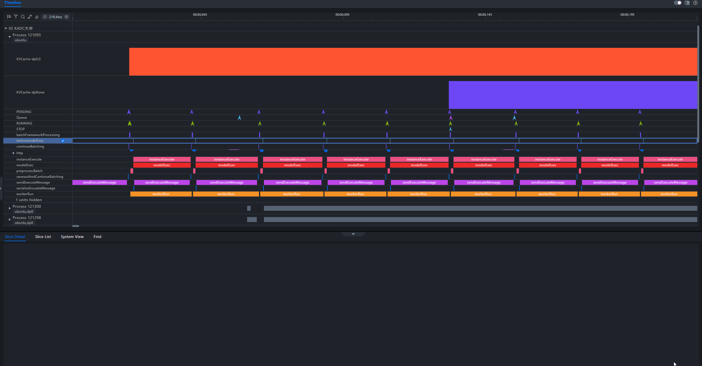

# Quick Start Guide for msServiceProfiler<a name="ZH-CN_TOPIC_0000002475358702"></a>

Performance tuning for serving frameworks often feels like a "black box," making issues difficult to pinpoint (for example, slower responses as requests increase, performance differences in different devices).

msServiceProfiler provides end-to-end performance profiling. It clearly displays the performance of framework scheduling and model inference, helping users quickly locate performance bottlenecks and effectively improve performance.

>[!NOTE]
> 
> The following provides only a quick start guide for msServiceProfiler. For details about the operations, APIs, parameters, and fields, see the msServiceProfiler documentation.

## Prerequisites<a name="section1605203618349"></a>

- Before using msServiceProfiler, read about the restrictions in "[Constraints](msserviceprofiler_install_guide.md#constraints)" in the [msServiceProfiler Installation Guide](msserviceprofiler_install_guide.md).
- Ensure that the corresponding service framework has been installed and its availability has been verified (the service starts successfully, and can process an inference request using official example scripts or APIs).
  - **MindIE Motor**: Install and configure MindIE as described in [MindIE Installation Guide](https://gitcode.com/Ascend/MindIE-Motor/blob/master/docs/zh/README.md) and ensure that the MindIE Motor service can start successfully and complete a sample inference request.
  - **vLLM-ascend**: Set up the environment and verify that the vLLM service can provide inference APIs for external systems. For details, see [vLLM Service Profiler User Guide] (vLLM_service_oriented_performance_collection_tool.md) and official  vLLM-ascend installation document.
  - **SGLang**: Set up the environment and verify that the SGLang service can provide inference APIs for external systems. For details, see [SGLang Service Profiler User Guide] (SGLang_service_oriented_performance_collection_tool.md) and official SGLang installation document.

## Procedure <a name="section166491954201410"></a>

> msServiceProfiler supports multiple serving inference frameworks, including MindIE Motor, vLLM-ascend, and SGLang. 

### 1. Configure Environment Variables<a name="li104932444507"></a>

To enable msServiceProfiler's profiling capability, set the environment variable `SERVICE_PROF_CONFIG_PATH` before service deployment. If the environment variable is misspelled or is not set before service deployment, the profiling capability cannot be enabled.

- **General Note**

  - `SERVICE_PROF_CONFIG_PATH`: specifies the path to the performance profiling configuration file (JSON). This file controls whether profiling is enabled, specifies the data output directory, and confiogures other settings.

- Example (using the configuration file in the current working directory as an example)

  ```bash
  export SERVICE_PROF_CONFIG_PATH="./ms_service_profiler_config.json"
  ```

The value of `SERVICE_PROF_CONFIG_PATH` must include the JSON file name. The JSON file is the configuration file for controlling profile data collection. For example, it specifies the path for storing profile metadata and enables or disables operator collection. For details about the fields, see [3. Collect Data](#3-collect-data). If no configuration file exists at the specified path, the tool automatically generates a default configuration (with the profiling feature disabled by default).

>[!NOTE]
>
> In multi-node deployments, it is advised not to place the configuration file or its specified data storage path in a shared directory (such as a network shared location). Because data writing may involve additional network or buffering steps rather than direct disk writing, such configurations may lead to unexpected system behavior or results in certain situations.

### 2. Start Services

The steps for starting a service vary by framework. However, for msServiceProfiler, the key point is to configure the environment variables before the service process starts. After that, start the service using the standard method for each respective framework.

#### 2.1 MindIE Motor

Start the inference service as described in the *MindIE Installation Guide*. If `SERVICE_PROF_CONFIG_PATH` is correctly configured, logs prefixed with `[msservice_profiler]` will be output before the service deployment completes, indicating that msServiceProfiler has been initialized. Example:

```ColdFusion
[msservice_profiler] [PID:225] [INFO] [ParseEnable:179] profile enable_: false
[msservice_profiler] [PID:225] [INFO] [ParseAclTaskTime:264] profile enableAclTaskTime_: false
[msservice_profiler] [PID:225] [INFO] [ParseAclTaskTime:265] profile msptiEnable_: false
[msservice_profiler] [PID:225] [INFO] [LogDomainInfo:357] profile enableDomainFilter_: false
```

If the configuration file specified by `SERVICE_PROF_CONFIG_PATH` does not exist, the tool automatically creates a configuration file. The log is similar to the following:

```ColdFusion
[msservice_profiler] [PID:225] [INFO] [SaveConfigToJsonFile:588] Successfully saved profiler configuration to: ./ms_service_profiler_config.json
```

#### 2.2 vLLM-ascend

After preparing the vLLM-ascend environment and configuring the necessary variables, start the service using the native vLLM method. Example:

```bash
cd ${path_to_store_profiling_files}
export SERVICE_PROF_CONFIG_PATH=ms_service_profiler_config.json
# Start the vLLM service (example).
vllm serve Qwen/Qwen2.5-0.5B-Instruct &
```

#### 2.3 SGLang 

For first-time integration, you need to integrate msServiceProfiler into the SGLang serving startup entry point. After that, start the service as usual.

```bash
# Open the SGLang server launch file to import the profiling module.
vim /usr/local/python3.11.13/lib/python3.11/site-packages/sglang/launch_server.py # Replace /usr/local/python3.11.13/lib/python3.11/site-packages with the sglang installation path from the pip show sglang command output.
# Insert the following code after all existing import statements:
from ms_service_profiler.patcher.sglang import register_service_profiler
register_service_profiler()

# Start the SGLang service (example).
python -m sglang.launch_server \
    --model-path=/Qwen2.5-0.5B-Instruct \
    --device npu
```

In the preceding command,

- `SERVICE_PROF_CONFIG_PATH`: specifies the path to the profiling configuration file. If the file does not exist, it is automatically generated.

### 3. Collect Data<a name="li10670349115211"></a>

Once the service is successfully deployed, you can precisely control the profiling behavior by modifying the fields in the configuration file specified by `SERVICE_PROF_CONFIG_PATH`. (Only three fields are used as examples here):

```json
{
  "enable": 1,
  "prof_dir": "${PATH}/prof_dir/",
  "acl_task_time": 0
}
```

**Table 1** Parameters

| Parameters         | Description                                                        | Mandatory (Yes/No)|
| ------------- | ------------------------------------------------------------ | -------- |
| enable        | Globally enables or disables profile data collection. Valid values:<br>`0`: disabled.<br>`1`: enabled.<br>If this parameter is set to `0`, no data collection occurs even if other parameters enable their corresponding features. If only this parameter is set to `1`, only serving profile data is collected.| Yes.      |
| prof_dir      | Path for storing the collected profile data. The default value is `${HOME}/.ms_server_profiler`.<br>This path stores the original profile data. Subsequent parsing steps are required to obtain visualizable profile data files for analysis.<br>If `prof_dir` is modified when `enable` is `0`, the change takes effect when `enable` is later changed to `1`. If `prof_dir` is modified when `enable` is `1`, the change does not take effect.| No      |
| acl_task_time | Enables or disables profiling of operator dispatch time and execution time. The options are as follows:<br>`0`: disabled. (default). Setting this parameter to `0` or any other invalid value disables this feature.<br>`1`: enabled.<br>Enabling this function introduces performance overhead, which may cause inaccurate profile data. For further detailed analysis, you are advised to enable this function only when model execution is abnormal.<br>Operator profiling generates large amounts of data. Generally, it is advised to collect data for 3 to 5 seconds. Longer collection time consumes additional disk space and increases parsing time, prolonging troubleshooting.<br>The default operator collection level is `L0`. To enable other operator collection levels, see the complete parameter description of the "msServiceProfiler".| No      |

Generally, if `enable` remains `1`, the tool collects data from the moment the service receives a request until the request ends. The size of the directory under `prof_dir` will continue to grow. Therefore, it is advised to collect data only during critical time periods.

Whenever the `enable` field changes, the tool outputs corresponding logs to indicate the change.

```ColdFusion
[msservice_profiler] [PID:3259] [INFO] [DynamicControl:407] Profiler Enabled Successfully!
```

```ColdFusion
[msservice_profiler] [PID:3057] [INFO] [DynamicControl:411] Profiler Disabled Successfully!
```

When `enable` is changed from `0` to `1`, all fields in the configuration file are dynamically reloaded by the tool.

Similarly, the tool generates the original profile data of the inference service in `prof_dir` (default: `${HOME}/.ms_server_profiler/xxxx-xxxx`).

### 4. Parse Data and Perform Optimization Analysis

1. Install environment dependencies.

   ```bash
   python >= 3.10
   pandas >= 2.2
   numpy >= 1.24.3
   psutil >= 5.9.5
   ```

2. Run the parsing command (general form):

   ```bash
   python3 -m ms_service_profiler.parse --input-path=${PATH}/prof_dir
   ```

   `--input-path` is set to the path specified by `prof_dir` in [3. Collect Data](#3-collect-data). After parsing, parsed profile data files are generated in the directory where the command is executed.

> For vLLM-ascend/SGLang on NPU, `prof_dir` is located in `${HOME}/.ms_server_profiler/xxxx-xxxx` by default. You can run the following command in this directory:
>
> ```bash
> msserviceprofiler parse --input-path=./ --output-path output
> ```
>
> or equivalently:
>
> ```bash
> python -m ms_service_profiler.parse --input-path=$PWD
> ```

#### 4.2 Tuning Analysis

The parsed profile data is available in `.db`, `.csv`, and `.json` formats. You can perform quick analysis from different dimensions (such as requests and scheduling) using the CSV files, or import the `.db` or `.json` files into MindStudio Insight for visualization. For detailed instructions and analysis explanations, see the section "Serving Tuning" in the [MindStudio Insight User Guide](https://www.hiascend.com/document/detail/zh/mindstudio/830/GUI_baseddevelopmenttool/msascendinsightug/Insight_userguide_0002.html).

The following figure shows an example of profile data visualized using MindStudio Insight.

       ```bash
       python >= 3.10
       pandas >= 2.2
       numpy >= 1.24.3
       psutil >= 5.9.5
       ```

   2. Run the parsing command.

       ```bash
       python3 -m ms_service_profiler.parse --input-path=${PATH}/prof_dir
       ```

       --`input-path` is set to the path specified by `prof_dir` in [Collect Data](#li10670349115211).

       After parsing, parsed profile data files are generated in the directory where the command is executed.

5. Tuning Analysis

   The parsed profile data is available in `.db`, `.csv`, and `.json` formats. You can perform quick analysis from different dimensions (such as requests and scheduling) using the CSV files, or import the `.db` or `.json` files into MindStudio Insight for visualization. For detailed instructions and analysis explanations, see the section "Serving Tuning" in the [MindStudio Insight User Guide](https://gitcode.com/Ascend/msinsight/blob/master/docs/en/user_guide/overview.md).

   The following figure shows an example of profile data visualized using MindStudio Insight.

   
