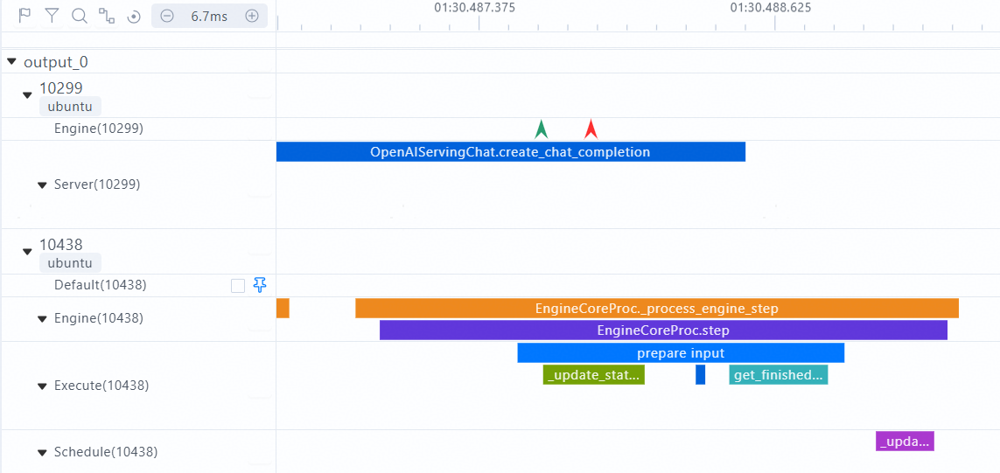

# vLLM Service Profiler User Guide

## Overview

vLLM Service Profiler monitors and collects performance data of the internal execution process of the vLLM-Ascend inference service framework. It helps users quickly identify performance bottlenecks by tracing the execution flow. Specifically, it captures critical timing information (start/end timestamps), identifies key functions or iterations, records critical events, and captures diverse types of information throughout the inference pipeline.

vLLM Service Profiler is used for performance profiling analysis when deploying vLLM-Ascend inference services. It covers the end-to-end workflow, from preparation, data collection, data parsing, to result visualization.

### Basic Concepts

- **Profile data collection**: records critical time points and events in serving scenarios through event tracking to generate profile data.
- **Event tracking/Symbol**: specifies a target for profile data collection. This is defined by an executable function in the vLLM or vLLM-Ascend source code.
- **Domain**: specifies functional categories for profile data collection, such as Request, KVCache, and ModelExecute.
- **Symbol configuration**: configuration file, which defines the functions/methods to be collected and their attributes.

## Supported Products

> [!NOTE] 
>
>For details about Ascend product models, see [Ascend Product Models](<>).

|Product Type| Supported (Yes/No)|
|--|:----:|
|Atlas A3 training products and Atlas A3 inference products|  Yes  |
|Atlas A2 training products and Atlas A2 inference products|  Yes  |
|Atlas 200I/500 A2 inference products|  Yes  |
|Atlas inference products|  Yes  |
|Atlas training products|  No  |

### Before You Start

#### Environment Setup

1. In the Ascend environment, install the matching CANN Toolkit and ops operator packages, and configure CANN environment variables. For details, see [CANN Installation Guide](<>).
2. Install vLLM and vLLM-Ascend. Verify that vLLM-Ascend can run properly. For details, see [vLLM-Ascend installation](https://vllm-ascend.readthedocs.io/en/latest/installation.html).
3. Upgrade msServiceProfiler. Build the `.run` file from the source code and upgrade the tool. For details, see the section *Upgrade* in [msServiceProfiler Installation Guide](./msserviceprofiler_install_guide.md#upgrade).

#### Constraints

- **Version compatibility**: Ensure that vLLM-Ascend, CANN, and profiler versions meet the requirements in the Appendix.
- **Resource usage**: The data collection process may consume significant memory. It is advised to adjust the collection frequency as required.
- **Function restrictions**: Some advanced features may require specific vLLM-Ascend versions.

## Quick Start

**1. Preparing for Data Collection**

Before starting the service, set the following environment variables:

- `SERVICE_PROF_CONFIG_PATH`: specifies the path to the performance analysis configuration file.
- `PROFILING_SYMBOLS_PATH`: specifies the path to the symbol configuration file.

```bash
cd ${path_to_store_profiling_files}
export SERVICE_PROF_CONFIG_PATH=ms_service_profiler_config.json
export PROFILING_SYMBOLS_PATH=service_profiling_symbols.yaml

# Start the vLLM service.
vllm serve Qwen/Qwen2.5-0.5B-Instruct &
```

`ms_service_profiler_config.json` indicates the collection configuration file. If the file does not exist, a default configuration is automatically generated. For custom configurations, see [Collection Configuration User Guide] (#collection-configuration-user-guide).

`service_profiling_symbols.yaml` is the instrumentation configuration file. If you do not set the `PROFILING_SYMBOLS_PATH` environment variable, the default configuration file is used. If the file does not exist at the specified path, the system generates a default configuration file at that location for subsequent modification. For custom configurations, see [Symbol Configuration User Guide] (#Symbol-configuration-user-guide).

**2. Starting Data Collection**

Change the enable field in `ms_service_profiler_config.json` from `0` to `1` to enable performance data collection. You can run the following `sed` command:

```bash
sed -i 's/"enable":\s*0/"enable": 1/' ./ms_service_profiler_config.json
```

**3. Sending Requests**

Select a request sending method based on the actual profiling requirements.

```bash
curl http://localhost:8000/v1/completions \
    -H "Content-Type: application/json"  \
    -d '{
         "model": "Qwen/Qwen2.5-0.5B-Instruct",
        "prompt": "Beijing is a",
        "max_tokens": 5,
        "temperature": 0
}' | python3 -m json.tool
```

**4. Parsing Data**

```bash
# xxxx-xxxx is the directory automatically created by the profiler based on the vLLM launch time.
cd /root/.ms_server_profiler/xxxx-xxxx

# Parse data.
msserviceprofiler parse --input-path=./ --output-path output
```

**5. Viewing Data**

After the parsing is complete, a profile data file is generated in the directory specified by `--output-path`. For details, see [Output File Description](#output-file-description).

## Symbol Configuration User Guide

### Functions

The symbol configuration file defines the functions/methods to be monitored, and supports flexible configuration and custom attribute collection.

### Precautions

#### Built-in/Customized Symbol Configuration File

The symbol configuration file has been built in vLLM-Ascend and the tool.

- Default loading path: `~/.config/vllm_ascend/service_profiling_symbols.MAJOR.MINOR.PATCH.yaml` (applicable to the vLLM-Ascend framework and the file name varies with the installed vllm version)
- Backup loading path: `*tool installation path*/ms_service_profiler/patcher/vllm/config/service_profiling_symbols.yaml`

To customize profiling symbols, you are advised to set the environment variable PROFILING_SYMBOLS_PATH and copy a symbol configuration file to the working directory for modification.

#### Symbol Configuration File Update

If a profiling symbol is updated, restart the vLLM service to load the updated configuration file.

### Configuration Fields

|     Field     | Description               | Example                                                   |
|:-----------:|:------------------|:------------------------------------------------------|
|   symbol    | Python import path + attribute chain| `"vllm.v1.core.kv_cache_manager:KVCacheManager.free"` |
|   handler   | Handler function           | `timer` or `pkg.mod:func` (customized)                |
|   domain    | Domain ID            | `"KVCache"` and `"ModelExecute"`                         |
|    name     | Event name             | `"EngineCoreExecute"`                                 |
| min_version | Earliest compatible version           | `"0.9.1"`                                             |
| max_version | Latest compatible version           | `"0.11.0"`                                            |
| attributes  | Custom attribute collection          | Only the `timer` handler is supported. For details, see the following custom attribute collection mechanism.                  |

#### Configuration Example

- **Example 1: Customizing a handler function**

```yaml
- symbol: vllm.v1.core.kv_cache_manager:KVCacheManager.free
  handler: ms_service_profiler.patcher.config.custom_handler_example.kvcache_manager_free_example_handler
  domain: Example
  name: example_custom
```

- **Example 2: Default timer**

```yaml
- symbol: vllm.v1.engine.core:EngineCore.execute_model
  domain: ModelExecute
  name: EngineCoreExecute
```

- **Example 3: Version constraint**

```yaml
- symbol: vllm.v1.executor.abstract:Executor.execute_model
  min_version: "0.9.1"
  # If no handler is specified, the default timer is used.
```

### Custom property collection mechanism

The `attributes` field supports flexible collection of custom attributes and allows multiple operations and conversions on function parameters and return values.

#### Basic Syntax

- **To access parameters**: Use the parameter name, for example, `request_id`.
- **To access return values**: Use the `return` keyword.
- **To access attributes**: Use the `attr` operator, for example, `obj | attr name`.
- **For method calling**: Call built-in functions such as `len()`, `str()`, `int()`, and `float()`.
- **For pipe operation**: Use `|` to connect multiple operations. Expressions are evaluated from left to right, with the output of each operator serving as the input to the next.

#### Configuration Example

```yaml
- symbol: vllm_ascend.worker.model_runner_v1:NPUModelRunner.execute_model
  name: ModelRunnerExecuteModel
  domain: ModelExecute
  attributes:
  - name: device
    expr: args[0] | attr device | str
  - name: dp
    expr: args[0] | attr dp_rank | str
  - name: batch_size
    expr: args[0] | attr input_batch | attr _req_ids | len
```

#### Expression Description

1. `len(input_ids)`: obtains the length of the `input_ids` parameter.
2. `len(return) | str`: obtains the length of the return value and converts it to a string (equivalent to `str(len(return))`).
3. `return[0] | attr input_ids | len`: obtains the length of the `input_ids` attribute of the first element in the return value.

#### Advanced Examples

```yaml
attributes:
  # Obtains the tensor shape
  - name: tensor_shape
    expr: input_tensor | attr shape | str
  
  # Obtaining a specific value from a dictionary
  - name: batch_size
    expr: kwargs['batch_size']
  
  # Condition expression (custom processing function required)
  - name: is_training_mode
    expr: training | bool
  
  # Complex data processing
  - name: processed_data_len
    expr: data | attr items | len | str
```

### Customize handler functions

When the `handler` field specifies a custom handler function, the function must meet the following signature requirements:

```python
def custom_handler(original_func, this, *args, **kwargs):
    """
    Customize handler functions
    
    Args:
        original_func: original function object
        this: calling object (for method calling)
        *args: position parameter
        **kwargs: keyword arguments
    
    Returns:
        Handling result
    """
    # Custom handling logic
    pass
```

> [!NOTE] 
>
> If the custom handler function fails to be imported, the system automatically rolls back to the default timer mode.

### Output Description

The custom collection function or method can be displayed on the `chrome_tracing.json` timeline. The following is an example:

Symbol configuration file:

```yaml
- symbol: vllm.entrypoints.openai.serving_chat:OpenAIServingChat.create_chat_completion
  name: OpenAIServingChat.create_chat_completion
  domain: Server

- symbol: vllm.entrypoints.openai.serving_chat:EngineCoreProc._process_engine_step
  name: EngineCoreProc._process_engine_step
  domain: Engine

- symbol: vllm.entrypoints.openai.serving_chat:EngineCoreProc.step
  name: EngineCoreProc.step
  domain: Engine
```

The following figure shows the timeline of `chrome_tracing.json`.



## Output File Description

After parsing is complete, the deliverables listed in the following table are generated in the `output` directory.

|          Deliverable         | Description                                                                                                                                        |
|:---------------------:|:-------------------------------------------------------------------------------------------------------------------------------------------|
| `chrome_tracing.json` | Records trace data of inference service requests. You can use different visualization tools to view the data. For details, see [Data Visualization] (./msserviceprofiler_serving_tuning_instruct.md# Data Visualization).                                      |
|     `profiler.db`     | SQLite database file for generating visualized line charts. For details, see [profiler.db] (./msserviceprofiler_serving_tuning_instruct.md#profilerdb).                                |
|     `request.csv`     | Records detailed data of inference requests in a serving scenario. For details, see [request.csv] (./msserviceprofiler_serving_tuning_instruct.md#requestcsv).                                     |
| `request_summary.csv` | Overall request statistics                                                                                                                                  |
| `forward.csv` | Records detailed data of the forward execution process of an inference model in a serving scenario. For details, see [forward.csv](./msserviceprofiler_serving_tuning_instruct.md#forwardcsv).                                   |
|     `kvcache.csv`     | Records memory usage during inference. For details, see [kvcache.csv] (./msserviceprofiler_serving_tuning_instruct.md#kvcachecsv).                                         |
|      `batch.csv`      | Records detailed data of inference batches in a serving scenario. For details, see [batch.csv] (./msserviceprofiler_serving_tuning_instruct.md#batchcsv).                                      |
|   `spec_decode.csv`   | Records detailed data for each request in a speculative inference scenario. For details, see [spec_decode.csv](./msserviceprofiler_serving_tuning_instruct.md#spec_decodecsv).|
|  `batch_summary.csv`  | Overall statistics metrics of batch scheduling                                                                                                                                |
| `service_summary.csv` | Overall statistics metrics in the service dimension                                                                                                                               |
|     `span_info/`      | Includes key span information such as `forward.csv` and `batchFrameworkProcessing.csv`. For details, see [span_info Directory Description](./msserviceprofiler_serving_tuning_instruct.md#span_info-directory).|

> [!NOTE] 
>
> The output file is closely related to the collection of the domain field. For details, see [Mapping between domain fields and the parsing results] (./msserviceprofiler_serving_tuning_instruct.md# parsing result).

## Appendix

### vLLM versions and supported frameworks

| CANN| vLLM-Ascend V0 | vLLM-Ascend V1 |
|:--------:|:--------------:|:--------------:|
| 8.3.RC1  |       /        |  v0.11.0.RC3   |
| 8.3.RC1  |       /        |  v0.11.0.RC2   |
| 8.3.RC1  |       /        |  v0.11.0.RC1   |
| 8.2.RC1  |       /        |  v0.11.0.RC0   |
| 8.2.RC1  |       /        |  v0.10.2.RC1   |
| 8.2.RC1  |       /        |  v0.10.1.RC1   |
| 8.2.RC1  |       /        |  v0.10.0.RC1   |
| 8.2.RC1  |       /        |   v0.9.2.RC1   |
| 8.2.RC1  |     v0.9.1     |     v0.9.1     |
| 8.1.RC1  |   v0.8.5.RC1   |       /        |
| 8.1.RC1  |     v0.8.4     |       /        |
| 8.0.RC3  |     v0.6.3     |       /        |

### Profiling Configuration Usage Guide

For details about the profiling configuration, see the instructions for creating configuration files and the clarifications [Data Collection] (./msserviceprofiler_serving_tuning_instruct.md# Data Collection).

> [!NOTE] 
>
> - When `acl_task_time` is set to `1`, vLLM Service Profiler does not support the configuration of the `VLLM_TORCH_PROFILER_DIR` environment variable of the native vLLM Torch Profiler for profile data collection.
> - When configuring the Torch Profiler, set `enable` to `0` (disabling profiling) first. After the vLLM-Ascend inference service framework starts, set `enable` to `1` (enabling profiling). To avoid collecting too much profile data, you can disable profiling after the corresponding data is collected. If the initial value of `enable` is `1`, a large amount of framework data is collected, which can easily generate trace files of several gigabytes.
