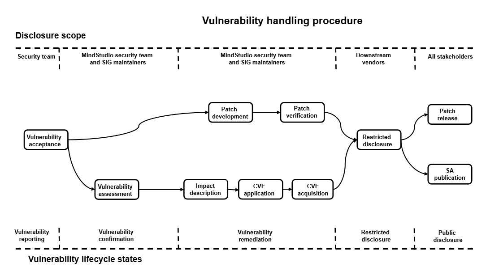

# **MindStudio Vulnerability Handling Mechanism Description**

The MindStudio community places high priority on the security of its community versions. We have designated security vulnerability coordinators to handle vulnerability-related matters. To build a more secure AI full-process toolchain, we also welcome your participation.

## Vulnerability Handling Procedure

For each security vulnerability, the MindStudio community assigns personnel to follow up and handle it. The end-to-end vulnerability handling process is shown in the following figure.

The following sections explain the vulnerability reporting, assessment, and disclosure processes.

## Vulnerability Reporting

You can contact the MindStudio community team by submitting an issue. We will arrange for a security vulnerability specialist to contact you promptly.
Note that to ensure security, do not include specific information about security privacy in the issue.

### Response to Reports

1. The MindStudio community will confirm, analyze, and report security vulnerability issues within three working days, while initiating the security handling process.
2. After confirming a security vulnerability issue, the MindStudio security team will assign and follow up on the issue.
3. Throughout the process, from classification and determination to fixing and release, we will update the report in a timely manner.

## Vulnerability Assessment

The Common Vulnerability Scoring System (CVSS) is widely used in the industry to assess vulnerability severity. MindStudio is using CVSS v3.1 to assess vulnerabilities, and such assessment focuses on the impact caused by the vulnerability in a preset attack scenario. The vulnerability severity assessment covers factors such as the exploit difficulty and the impact of vulnerability exploit on the confidentiality, integrity, and availability of the product. A score will be given after these factors are assessed.

### Vulnerability Evaluation Metrics

MindStudio evaluates the vulnerability severity using the following vectors:

- Attack vector (AV): indicates the remoteness of an attack and how a vulnerability can be exploited.
- Attack complexity (AC): describes the difficulty in executing an attack and what factors are required for a successful attack.
- User interaction (UI): determines whether the attack requires user participation.
- Privileges Required (PR): records the level of privileges an attacker must possess before successfully exploiting the vulnerability.
- Scope (S): determines whether an attack can affect components with different permission levels.
- Confidentiality (C): measures the impact resulting from information disclosure to unauthorized parties.
- Integrity (I): measures the impact resulting from information tampering.
- Availability (A): measures the impact on users' access to data or services when needed.

### Assessment Rules

- The severity of a vulnerability is assessed, not the risk of the vulnerability.
- The assessment must be based on an attack scenario where the system confidentiality, integrity, and availability are affected by a successful attack.
- When a security vulnerability has multiple attack scenarios, the attack scenario with the highest CVSS score (that is, with the greatest impact) shall prevail in the assessment.
- When a library that is embedded or invoked has vulnerabilities, the assessment on its vulnerability severity should be based on an attack scenario, which is determined by the usage of the library in the product.
- When a security defect does not trigger or affect the confidentiality/integrity/availability (CIA), the CVSS score is 0.

### Assessment Procedure

When assessing vulnerability severity, follow these steps:

1. Set a possible attack scenario and score based on this attack scenario.
2. Identify vulnerable components and affected components.

3. Select values for base metrics.

   - For exploitability metrics AV, AC, PR, UI, and S, select values based on a vulnerable component.

   - For impact metrics (Confidentiality, Integrity, and Availability), reflect either the impact on the vulnerable component or the impact on the impact component, whichever is more severe.

### Severity Rating

| **Severity Rating** | **CVSS Score** | **Vulnerability Fix Time**|
| ------------------------------- | --------------------- | ---------------- |
| Critical               | 9.0 to 10.0             | 7 days              |
| High                     | 7.0 to 8.9              | 14 days            |
| Medium                   | 4.0 to 6.9              | 30 days            |
| Low                      | 0.1 to 3.9              | 30 days            |

## Vulnerability Disclosure

After a security vulnerability is fixed, the MindStudio community will release a Security Advisory (SA) and a Security Notice (SN). The SA includes technical details of the vulnerability, type, reporter, CVE ID, affected versions, and fixed versions.
For the security of MindStudio users, the MindStudio community will not publicly disclose, discuss, or confirm security issues until after the vulnerability has been investigated, fixed, and an SA has been released.

## Appendix

### MindStudio SA

Currently maintained versions have no security vulnerabilities.

### MindStudio SN

Vulnerability descriptions for third-party open-source components:

| CVE ID| Third-Party Component Name| Affected MindStudio Tool/Plugin| Status| Description|
|-------|--------|---------------------|----|----|
| None    | None     | None                  | None | None |
