# 服务化调优工具<a name="ZH-CN_TOPIC_0000002518521921"></a>

## 简介<a name="ZH-CN_TOPIC_0000002171752224"></a>

本文介绍推理服务化性能数据采集工具，本工具主要使用msServiceProfiler接口，在MindIE Motor推理服务化进程中，采集关键过程的开始和结束时间点，识别关键函数或迭代等信息，记录关键事件，支持多样的信息采集，对性能问题快速定位。

- msServiceProfiler服务化调优接口包括“ [服务化调优 C++](./cpp_api/serving_tuning/README.md)”和“  [服务化调优 Python](./python_api/README.md)”。
- 有关MindIE Motor相关介绍请参见《[MindIE Motor开发指南](https://gitcode.com/Ascend/MindIE-Motor/blob/master/docs/zh/user_guide/README.md)》。

工具使用流程如下：

1. [使用前准备](#使用前准备)
2. [数据采集](#数据采集)
3. [数据解析](#数据解析)
4. [数据可视化](#数据可视化)

## 产品支持情况<a name="ZH-CN_TOPIC_0000002479925980"></a>

> [!NOTE]
>
>昇腾产品的具体型号，请参见《[昇腾产品形态说明](https://www.hiascend.com/document/detail/zh/AscendFAQ/ProduTech/productform/hardwaredesc_0001.html)》

|产品类型| 是否支持 |
|--|:----:|
|Ascend 950 系列产品|x|
|Atlas A3 训练系列产品/Atlas A3 推理系列产品|√|
|Atlas A2 训练系列产品/Atlas A2 推理系列产品|√|
|Atlas 200I/500 A2 推理产品|x|
|Atlas 推理系列产品|√|
|Atlas 训练系列产品|x|

> [!NOTE]
> 
>针对Atlas A2 训练系列产品/Atlas A2 推理系列产品，当前仅支持该系列产品中的Atlas 800I A2 推理服务器。
>针对Atlas 推理系列产品，当前仅支持该系列产品中的Atlas 300I Duo 推理卡+Atlas 800 推理服务器（型号：3000）。

## 使用前准备

工具支持的硬件环境与MindIE一致，详细支持情况请参见《[MindIE安装指南](https://gitcode.com/Ascend/MindIE-Motor/blob/master/docs/zh/user_guide/install/installing_mindie.md)》的“[安装说明](https://gitcode.com/Ascend/MindIE-Motor/blob/master/docs/zh/user_guide/install/installation_description.md)”。

1. 安装配套版本的CANN Toolkit开发套件包和ops算子包并配置CANN环境变量，具体请参见[CANN快速安装](https://www.hiascend.com/cann/download)。
2. 完成[msServiceProfiler工具](msserviceprofiler_install_guide.md)的安装。
3. 完成MindIE的安装和配置并确认MindIE Motor可以正常运行，具体请参见《[MindIE安装指南](https://gitcode.com/Ascend/MindIE-Motor/blob/master/docs/zh/user_guide/install/installing_mindie.md)》。
4. 完成以上环境准备后，可以进行一次配置预检动作，使用“[msprechecker](https://gitcode.com/Ascend/msit/tree/master/msprechecker)”工具，对环境变量和服务化配置等进行检查。

## 数据采集

**功能说明<a name="section92893354593"></a>**

采集服务化性能数据。

**注意事项<a name="section1725701319"></a>**

- 服务化调优工具的acl\_task\_time开关与msprof工具的动态采集功能存在冲突，建议不要同时使用。msprof工具的动态采集功能相关介绍请参见《[性能调优工具用户指南](https://www.hiascend.com/document/detail/zh/canncommercial/850/devaids/Profiling/atlasprofiling_16_0016.html)》。

**使用示例<a name="section1541662513115"></a>**

1. 创建采集配置文件。服务化性能数据采集通过json配置文件，配置采集数据的开关、保存路径等。
   - 自动创建：该文件支持自动创建，在[2](#li177905365245)过程中配置SERVICE\_PROF\_CONFIG\_PATH环境变量后，运行MindIE Motor服务可自动创建默认配置的json文件。

   - 手动创建：该json配置文件可以在任意路径下新建，此处以ms\_service\_profiler\_config.json文件名为例，配置文件格式如下：

     ```json
     {
         "enable": 1,
         "prof_dir": "${PATH}",
         "acl_task_time": 0,
         "acl_prof_task_time_level": ""
     }
     ```

     **表 1**  参数说明

     | 参数                     | 说明                                                                                                                                                                                                                                                                                                                                                                                                                                                                                                                                                                                                                                                                                                                                                                                                                                                                                                                                                                                                                                                                                                                                                                                                                                                                                | 是否必选 |
     | ------------------------ |-----------------------------------------------------------------------------------------------------------------------------------------------------------------------------------------------------------------------------------------------------------------------------------------------------------------------------------------------------------------------------------------------------------------------------------------------------------------------------------------------------------------------------------------------------------------------------------------------------------------------------------------------------------------------------------------------------------------------------------------------------------------------------------------------------------------------------------------------------------------------------------------------------------------------------------------------------------------------------------------------------------------------------------------------------------------------------------------------------------------------------------------------------------------------------------------------------------------------------------------------------------------------------------| -------- |
     | enable                   | 是否开启性能数据采集的开关，取值为：<br/>0：关闭。<br/>1：开启。                                                                                                                                                                                                                                                                                                                                                                                                                                                                                                                                                                                                                                                                                                                                                                                                                                                                                                                                                                                                                                                                                                                                                                                                                                            | 是       |
     | prof_dir                 | 采集到的性能数据的存放路径，可自定义，str类型，默认值为${HOME}/.ms_server_profiler。                                                                                                                                                                                                                                                                                                                                                                                                                                                                                                                                                                                                                                                                                                                                                                                                                                                                                                                                                                                                                                                                                                                                                                                                                         | 否       |
     | profiler_level           | 数据采集等级，取值为INFO。                                                                                                                                                                                                                                                                                                                                                                                                                                                                                                                                                                                                                                                                                                                                                                                                                                                                                                                                                                                                                                                                                                                                                                                                                                                                   | 否       |
     | host_system_usage_freq   | CPU和内存系统指标采集频率，默认关闭不采集。范围为整数1~50，单位Hz，表示每秒采集的次数。设置为-1时关闭采集该指标。<br/>开启该功能可能占用较大内存，不建议修改。                                                                                                                                                                                                                                                                                                                                                                                                                                                                                                                                                                                                                                                                                                                                                                                                                                                                                                                                                                                                                                                                                                                                                                                           | 否       |
     | npu_memory_usage_freq    | NPU Memory使用率指标的采集频率，默认关闭不采集。范围为整数1~50，单位Hz，表示每秒采集的次数。设置为-1时关闭采集该指标。<br/>开启该功能可能占用较大内存，不建议修改。                                                                                                                                                                                                                                                                                                                                                                                                                                                                                                                                                                                                                                                                                                                                                                                                                                                                                                                                                                                                                                                                                                                                                                                     | 否       |
     | acl_task_time            | 开启采集算子下发耗时、算子执行耗时数据的开关，取值为：<br/>0：关闭。默认值，配置为0或其他非法值均表示关闭。<br/>1：开启。该功能开启时调用aclprofCreateConfig接口的ACL_PROF_TASK_TIME_L0参数。<br/>2：开启基于MSPTI接口的数据落盘。该功能开启时调用MSPTI接口进行性能数据采集，需要在拉起服务前配置如下环境变量：export LD_PRELOAD={INSTALL_DIR}/lib64/libmspti.so<br/>{INSTALL_DIR}请替换为CANN软件安装后文件存储路径。以root安装举例，则安装后文件存储路径为：/usr/local/Ascend/cann。<br/>3：开启基于Torch Profiler接口的数据落盘。<br/>以上aclprofCreateConfig接口及MSPTI接口详细介绍请参见《[性能调优工具用户指南](https://www.hiascend.com/document/detail/zh/canncommercial/850/devaids/Profiling/atlasprofiling_16_0016.html)》。该功能开启时会占用一定的设备性能，导致采集的性能数据不准确，建议在模型执行耗时异常时开启，用于更细致的分析。                                                                                                                                                                                                                                                                                                                                                                                                                                                                                                                                                                                                                                                                                                                                                                                                         | 否       |
     | acl_prof_task_time_level | 设置性能数据采集的Level等级和时长，取值为：<br/>L0：Level0等级，表示采集算子下发耗时、算子执行耗时数据。与L1相比，由于不采集算子基本信息数据，采集时性能开销较小，可更精准统计相关耗时数据。等同于aclDataTypeConfig参数配置ACL_PROF_MSPROFTX、ACL_PROF_TASK_TIME_L0。<br/>L1：Level1等级，采集AscendCL接口的性能数据，包括Host与Device之间、Device间的同步异步内存复制时延；采集算子下发耗时、算子执行耗时数据以及算子基本信息数据，提供更全面的性能分析数据。等同于aclDataTypeConfig参数配置ACL_PROF_MSPROFTX、ACL_PROF_TASK_TIME、ACL_PROF_ACL_API。<br/>{time}：采集时长，取值范围为1~999的正整数，单位s。<br/>默认未配置本参数，表示采集L0数据，且采集到程序执行结束。配置其他非法值时取默认值。采集的Level等级和时长可同时配置，例如"acl_prof_task_time_level": "L1;10"。<br/>目前Torch Profiler不支持采集时长{time}配置。                                                                                                                                                                                                                                                                                                                                                                                                                                                                                                                                                                                                                                                                                                                                                                | 否       |
     | aclDataTypeConfig        | 用户选择如下多个宏进行逻辑或，每个宏表示某一类性能数据，取值为：<br/>以下采集项的结果数据可参见《[采集数据说明](https://www.hiascend.com/document/detail/zh/canncommercial/850/devaids/Profiling/atlasprofiling_16_0046.html)》，但具体采集结果请以实际情况为准。以下采集项一次可以配置一个或多个，例如："aclDataTypeConfig": "ACL_PROF_ACL_API"或"aclDataTypeConfig": "ACL_PROF_ACL_API, ACL_PROF_TASK_TIME"。<br/>ACL_PROF_ACL_API：表示采集接口的性能数据，包括Host与Device之间、Device间的同步异步内存复制时延等。<br/>ACL_PROF_TASK_TIME：采集算子下发耗时、算子执行耗时数据以及算子基本信息数据，提供更全面的性能分析数据。<br/>ACL_PROF_TASK_TIME_L0：采集算子下发耗时、算子执行耗时数据。与ACL_PROF_TASK_TIME相比，由于不采集算子基本信息数据，采集时性能开销较小，可更精准统计相关耗时数据。<br/>ACL_PROF_OP_ATTR：控制采集算子的属性信息，当前仅支持aclnn算子。ACL_PROF_AICORE_METRICS：表示采集AI Core性能指标数据，逻辑或时必须包括该宏，aicoreMetrics入参处配置的性能指标采集项才有效。<br/>ACL_PROF_TASK_MEMORY：控制CANN算子的内存占用情况采集开关，用于优化内存使用。单算子场景下，按照GE组件维度和算子维度采集算子内存大小及生命周期信息（单算子API执行方式不采集GE组件内存）；静态图和静态子图场景下，在算子编译阶段按照算子维度采集算子内存大小及生命周期信息。<br/>ACL_PROF_AICPU：表示采集AI CPU任务的开始、结束数据。<br/>ACL_PROF_L2CACHE：表示采集L2 Cache数据。<br/>ACL_PROF_HCCL_TRACE：控制通信数据采集开关。<br/>ACL_PROF_TRAINING_TRACE：控制迭代轨迹数据采集开关。<br/>ACL_PROF_RUNTIME_API：控制runtime api性能数据采集开关。<br/>ACL_PROF_MSPROFTX：获取用户和上层框架程序输出的性能数据。可在采集进程内（aclprofStart接口、aclprofStop接口之间）调用如下两种接口开启记录应用程序执行期间特定事件发生的时间跨度，并写入性能数据文件，再使用msprof工具解析该文件，并导出展示性能分析数据：<br/>mstx API（MindStudio Tools Extension API）接口详细操作请参见《[mstx API使用示例](https://www.hiascend.com/document/detail/zh/canncommercial/850/devaids/Profiling/atlasprofiling_16_0142.html)》。msproftx扩展接口详细操作请参见“更多特性 > Profiling性能数据采集”。<br/>默认未配置本参数，以acl_prof_task_time_level参数配置为L0为准。 | 否       |
     | aclprofAicoreMetrics     | AI Core性能指标采集项，取值为：以下采集项的结果数据可参见《[op_summary（算子详细信息）](https://www.hiascend.com/document/detail/zh/canncommercial/850/devaids/Profiling/atlasprofiling_16_0067.html)》，但具体采集结果请以实际情况为准。以下采集项一次只能配置一个，例如："aclprofAicoreMetrics": "ACL_AICORE_PIPE_UTILIZATION"。<br/>ACL_AICORE_PIPE_UTILIZATION：计算单元和搬运单元耗时占比。<br/>ACL_AICORE_MEMORY_BANDWIDTH：外部内存读写类指令占比。<br/>ACL_AICORE_L0B_AND_WIDTH：内部内存读写类指令占比。ACL_AICORE_RESOURCE_CONFLICT_RATIO：流水线队列类指令占比。<br/>ACL_AICORE_MEMORY_UB：内部内存读写指令占比。ACL_AICORE_L2_CACHE：读写cache命中次数和缺失后重新分配次数。<br/>ACL_AICORE_NONE = 0xFF<br/>默认值为ACL_AICORE_PIPE_UTILIZATION。<br/>仅当aclDataTypeConfig配置了ACL_PROF_AICORE_METRICS后，本接口的配置才能生效。                                                                                                                                                                                                                                                                                                                                                                                                                                                                                                                                                                                                                                                                                                                                    | 否       |
     | api_filter               | 对性能数据进行过滤，配置该参数可自定义采集配置的API性能数据，例如传入“matmul”会落盘所有API数据中name字段包含matmul的性能数据。str类型，区分大小写，多个不同的筛选目标用“；”隔开，默认为空，表示落盘所有数据。<br/>仅当acl_task_time参数值为2时生效。                                                                                                                                                                                                                                                                                                                                                                                                                                                                                                                                                                                                                                                                                                                                                                                                                                                                                                                                                                                                                                                                                                                                | 否       |
     | kernel_filter            | 对性能数据进行过滤，配置该参数可自定义采集配置的Kernel性能数据，例如传入“matmul”会落盘所有Kernel数据中name字段包含matmul的性能数据。str类型，区分大小写，多个不同的筛选目标用“；”隔开，默认为空，表示落盘所有数据。<br/>仅当acl_task_time参数值为2时生效。                                                                                                                                                                                                                                                                                                                                                                                                                                                                                                                                                                                                                                                                                                                                                                                                                                                                                                                                                                                                                                                                                                                          | 否       |
     | timelimit                | 设置服务化性能数据采集的时长，配置该参数后，采集进程将在运行指定的时间后自动停止，取值范围为0~7200的整数，单位s，默认值0（表示不限制采集时间）。<br/>该采集时长建议最短设置为120s，可以根据实际情况进行增加，若采集时间过短，可能会导致数据不满足解析输出件生成，打印告警提示。                                                                                                                                                                                                                                                                                                                                                                                                                                                                                                                                                                                                                                                                                                                                                                                                                                                                                                                                                                                                                                                                                                                                  | 否       |
     | domain                   | 设置采集指定domain域下的性能数据，减少采集数据量。输入参数为字符串格式，英文分号作为分隔符，区分大小写，例如："Request; KVCache"。默认为空，表示采集当前所有domain域内性能数据。当前已有domain域为：Request、KVCache、ModelExecute、BatchSchedule、Communication、eplb_observe。其中配置eplb_observe域并且使能MindIE专家热点信息采集的接口MINDIE_ENABLE_EXPERT_HOTPOT_GATHER和MINDIE_EXPERT_HOTPOT_DUMP_PATH时，采集到的数据中将包含专家热点信息，解析结果生成专家热点信息热力图。建议用户在需要采集专家热点信息时，单独使能eplb_observe domain域。<br/>若指定domain域不全，采集数据不满足解析输出件生成时，则打印告警提示。查看表[采集domain域与解析结果对照表](#section269581401015)。                                                                                                                                                                                                                                                                                                                                                                                                                                                                                                                                                                                                                                                                                                                                                                                                             | 否       |
     | torch_prof_stack         | 采集算子调用栈信息，包括框架层及CPU算子层的调用信息。取值为：<br/>false：关闭。默认值。<br/>true：开启。<br/>开启该配置前需要配置acl_task_time参数值为3。开启该配置后会引入额外的性能膨胀。                                                                                                                                                                                                                                                                                                                                                                                                                                                                                                                                                                                                                                                                                                                                                                                                                                                                                                                                                                                                                                                                                                                                                                | 否       |
     | torch_prof_modules       | 采集modules层级的Python调用栈信息，即框架层的调用信息。取值为：<br/>false：关闭。默认值。<br/>true：开启。<br/>开启该配置前需要配置acl_task_time参数值为3。开启该配置后会引入额外的性能膨胀。                                                                                                                                                                                                                                                                                                                                                                                                                                                                                                                                                                                                                                                                                                                                                                                                                                                                                                                                                                                                                                                                                                                                                          | 否       |
     | torch_prof_step_num      | 采集的step轮数。取值为大于等于0的整数，默认值为0（表示采集所有step）。<br/>开启该配置前需要配置acl_task_time参数值为3。                                                                                                                                                                                                                                                                                                                                                                                                                                                                                                                                                                                                                                                                                                                                                                                                                                                                                                                                                                                                                                                                                                                                                                                                        | 否       |
     | profiler_step_num        | 控制算子和服务化采集的step步数。取值为大于0的整数。配置为0或者其他非法值均会关闭整个服务化采集进程。采集步数确认：<br> &#8226; MindIE通过确认forward点的个数确定该参数配置是否生效。<br> &#8226; vllm通过modelRunnerExec点的个数确定该参数配置是否生效。                                                                                                                                                                                                                                                                                                                                                                                                                                                                                                                                                                                                                                                                                                                                                                                                                                                                                                                                                                                                                                                                                                                                                                                                                                                                                  | 否        |

2. <a name="li177905365245"></a>执行采集数据。

    1. 配置环境变量，指定采集配置文件ms\_service\_profiler\_config.json。

        ```bash
        export SERVICE_PROF_CONFIG_PATH="./ms_service_profiler_config.json"
        ```

        - 若环境变量配置路径下不存在json配置文件，会在路径下自动创建默认配置的json文件，且enable开关为0关闭状态，需要在运行MindIE Motor服务后，配置enable开关为1，开启采集任务。
        - 若环境变量配置路径下已存在同名的json文件，则不会创建json文件。

    2. 运行MindIE Motor服务。
    3. <a name="li58961338154210"></a>开启采集任务。

        重新开启一个命令行窗口，用户可以通过修改ms\_service\_profiler\_config.json配置中的“**enable**”字段，实时切换数据采集功能的开启和关闭。开启和关闭采集功能时产生相应日志，见如下说明。

        采集完成后，Profiling性能数据落盘在ms\_service\_profiler\_config.json中prof\_dir参数指定的路径下。

    > [!NOTE]
    >
    >多机多卡场景可使用Samba工具实现共享配置文件，以此实现对多机多卡场景的性能数据采集。其中多机多卡场景执行采集步骤与上文一致，但需要每个节点分别启动MindIE Motor服务。Samba为第三方工具，请用户自行查找对应使用指导，或使用其他支持配置共享目录的工具。
    >服务化性能数据采集支持运行时动态启停。动态启停指在启动采集任务后，执行采集操作过程中可以随时启动和暂停采集。
    >动态启停场景主要为以下三种：
    >- <a name="li0321112752816"></a>关闭到开启。启动MindIE Motor服务前，json配置文件中“enable”字段设置为0，运行MindIE Motor服务后修改文件中“enable”字段为1，日志中打印开启采集功能的相关信息：
    > 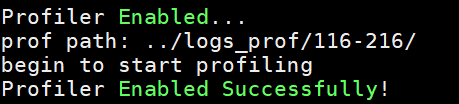
    >- 开启到关闭。启动MindIE Motor服务前，json配置文件中“enable”字段设置为1，运行MindIE Motor服务后修改文件中“enable”字段为0，日志中打印关闭采集功能的相关信息：
    > 
    >- 修改json配置文件内容，但“enable”字段未更改，采集功能运行状态不变，日志中打印相关信息：
    > 

**输出说明<a name="section3518349616"></a>**

进行服务化性能数据采集过程中会有日志打印，提示采集进程的状态，可以通过PROF\_LOG\_LEVEL环境变量控制日志打印。详细操作如下：

PROF\_LOG\_LEVEL环境变量用于配置数据采集打印日志等级，示例如下：

```bash
export PROF_LOG_LEVEL=INFO
```

日志等级可设置为（不设置默认等级为INFO）：

- INFO：包含是否开启Profiling数据采集，数据落盘路径等信息。

    示例如下：

    ```ColdFusion
    [msservice_profiler] [PID:52856] [INFO] [ReadEnable:306] profile enable_: true
    [msservice_profiler] [PID:52856] [INFO] [ReadAclTaskTime:335] profile enableAclTaskTime_: false
    [msservice_profiler] [PID:52856] [INFO] [StartProfiler:661] prof path: ./log/0423-0852/
    ```

- DEBUG：详细日志信息，在INFO日志的基础上包含配置文件路径信息，是否开启NPU、CPU数据采集等。

    示例如下：

    ```ColdFusion
    [msservice_profiler] [PID:82231] [DEBUG] [ReadConfig:275] SERVICE_PROF_CONFIG_PATH : prof.json
    [msservice_profiler] [PID:82231] [DEBUG] [ReadLevel:386] profiler_level: 20
    [msservice_profiler] [PID:82231] [DEBUG] [ReadHostConfig:510] host_system_usage_freq Disabled
    [msservice_profiler] [PID:82231] [DEBUG] [ReadNpuConfig:541] npu_memory_usage_freq Disabled
    ```

- WARNING：除INFO外包含参数配置错误，动态库加载失败等告警信息。

    ```ColdFusion
    [msservice_profiler] [PID:43982] [WARNING] [ReadEnable:323] enable value is not an integer, will set false.
    [msservice_profiler] [PID:43984] [WARNING] [ReadEnable:323] enable value is not an integer, will set false.
    [msservice_profiler] [PID:43993] [WARNING] [ReadEnable:323] enable value is not an integer, will set false.
    [msservice_profiler] [PID:44002] [WARNING] [ReadEnable:323] enable value is not an integer, will set false.
    ```

- ERROR：除报错外无打印日志。

    示例如下：

    ```ColdFusion
    [msservice_profiler] [PID:87888] [ERROR] [StartProfiler:677] create path(./log/0423-1007/) failed
    ```

## 数据解析

**功能说明<a name="section21638528484"></a>**

解析服务化性能数据。

**注意事项<a name="section20819721134913"></a>**

- 数据采集时会锁定落盘文件，需要等待采集结束之后才能启动解析，否则将提示报错“db is lock”。
- 数据解析没有结束前，不可再次开启动态采集，否则可能出现降低采集性能等问题。
- 数据解析功能需要安装如下版本：
    - python \>= 3.10
    - pandas \>= 2.2
    - numpy \>= 1.24.3
    - psutil \>= 5.9.5
    - matplotlib \>= 3.7.5
    - scipy \>= 1.7.2

**命令格式<a name="section10872103414491"></a>**

```bash
python3 -m ms_service_profiler.parse --input-path <input-path> [options]
```

options参数说明请参见[参数说明](#section379581401015)。

**参数说明<a name="section379581401015"></a>**

**表 1**  参数说明

| **参数**        | 说明                                                                                                                                                                                                                                                                                                                                                                                                                                                             |**是否必选**|
|---------------|----------------------------------------------------------------------------------------------------------------------------------------------------------------------------------------------------------------------------------------------------------------------------------------------------------------------------------------------------------------------------------------------------------------------------------------------------------------|--|
| --input-path  | 指定性能数据所在路径，会遍历读取该路径下所有名为msproftx.db、ascend_service_profiler_*.db和ms_service_*.db的数据库。                                                                                                                                                                                                                                                                                                                                                                          |是|
| --output-path | 指定解析后文件生成路径，默认为当前路径下的output目录。                                                                                                                                                                                                                                                                                                                                                                                                                                 |否|
| --log-level   | 设置日志级别，取值为：<br>&#8226; debug：调试级别。该级别的日志记录了调试信息，便于开发人员或维护人员定位问题。<br>&#8226; info：正常级别。记录工具正常运行的信息。默认值。<br>&#8226; warning：警告级别。记录工具和预期的状态不一致，但不影响整个进程运行的信息。<br>&#8226; error：一般错误级别。<br>&#8226; critical：严重错误级别。<br>&#8226; fatal：致命错误级别。                                      |否|
| --format      | 设置性能数据输出文件的导出格式，取值为：<br/>csv：表示只导出csv格式的结果文件。一般用于原始落盘数据量过大（通常为>10G）场景，仅导出该格式文件可减少数据解析耗时，该格式文件包含每轮请求调度耗时、模型执行耗时、KVCache显存占用情况等。<br/>json：表示只导出json格式的结果文件。一般用于仅需使用trace数据进行分析的场景，仅导出该格式文件可减少数据解析耗时，该格式文件包含服务化框架推理全过程Timeline图。<br/>db：表示只导出db格式的结果文件。一般用于仅通过MindStudio Insight工具分析结果数据场景，该格式文件包含全量数据解析结果，可直接在MindStudio Insight中完全展示。<br/>不使用format则默认全部导出，可以配置一个或多个参数，配置示例：--format db，--format db csv。<br/>若数据采集时，配置acl_task_time参数值为2，则解析结果文件仅支持导出json和db格式。 |否|
| --span        | 导出指定span数据至output/span_info目录，使用方法： <br/>1、不使用span则默认不导出span数据；<br/>2、使用--span 默认导出forward.csv、BatchSchedule.csv文件；<br/>3、--span 可以配置一个或多个参数，配置示例：--span sample Execute，则除forward.csv、BatchSchedule.csv文件外，额外导出sample.csv、Execute.csv文件。取值可参考MindStudio Insight工具打开性能数据输出文件中Timeline图的span信息。<br/>详细介绍请参考[span_info 目录说明](#span_info目录)                                                                                                                                                   |否|

**使用示例<a name="section246434914919"></a>**

执行解析命令进行基础数据解析：

```bash
python3 -m ms_service_profiler.parse --input-path ${PATH}/prof_dir/
```

进行基础解析的同时，可对性能数据按照不同维度（request维度、batch维度、总体服务维度）进行[多维度解析](./msserviceprofiler_multi_analyze_instruct.md)，也可对不同batch数据进行细粒度[性能拆解](./service_performance_split_tool_instruct.md)。

**输出说明<a name="section1852614831412"></a>**

解析命令执行完成后将--output-path参数指定的路径下输出[解析结果](#解析结果)。

## 解析结果

ms\_service\_profiler.parse解析生成的结果如下。

**表 1**  采集domain域与解析结果对照表<a name="section269581401015"></a>

|解析结果|采集domain域|
|--|--|
|profiler.db|"Schedule"|
|chrome_tracing.json|无强制限制。若要查看请求间flow event，需采集"Request"。|
|batch.csv|"Schedule"|
|kvcache.csv|"KVCache"|
|request.csv|"Request"|
|forward.csv|"Schedule"|
|pd_split_communication.csv|"Communication"|
|pd_split_kvcache.csv|"KVCache"|
|coordinator.csv|"Coordinator"|
|{host_name}_eplb_{i}_summed_hot_map_by_expert.png|"eplb_observe"|
|{host_name}_eplb_{i}_summed_hot_map_by_rank.png|"eplb_observe"|
|{host_name}_eplb_{i}_summed_hot_map_by_model_expert.png|"eplb_observe"|
|{host_name}_balance_ratio.png|"eplb_observe"|

> [!NOTE]
>
>上表中未列出acl\_prof\_task\_time\_level、aclDataTypeConfig和aclprofAicoreMetrics参数采集数据的解析结果，这三个参数的详细结果介绍请参见《[采集数据说明](https://www.hiascend.com/document/detail/zh/canncommercial/850/devaids/Profiling/atlasprofiling_16_0046.html)》和《[op\_summary（算子详细信息)](https://www.hiascend.com/document/detail/zh/canncommercial/850/devaids/Profiling/atlasprofiling_16_0067.html)》，但具体采集结果请以实际情况为准。其中op\_statistic\_\*.csv和op\_summary\_\*.csv文件会在--output-path参数指定目录下的PROF\_XXX目录落盘；而其他由这三个参数采集的性能数据文件仍保存在prof\_dir参数指定路径的PROF\_XXX/mindstudio\_profiler\_output目录下。

包括如下文件：

### **profiler.db**

用于生成可视化折线图的SQLite数据库文件。

其中含有下述数据库表，具体作用如下：

**表 2**  profiler.db

|Table名称|含义|
|--|--|
|batch|用于在MindStudio Insight展示batch表格数据。|
|decode_gen_speed|用于生成decode阶段，服务化数据不同时刻吞吐的token平均时延折线图。|
|first_token_latency|用于生成服务化框架首token时延折线图。|
|kvcache|用于生成服务化kvcache显存使用情况折线图可视化。|
|prefill_gen_speed|用于生成prefill阶段，服务化数据不同时刻吞吐的token平均时延折线图。|
|req_latency|用于生成服务化框架请求端到端时延使用折线图。|
|request_status|用于生成服务化采集数据不同时刻请求状态折线图。|
|request|用于在MindStudio Insight展示请求表格数据。|
|batch_exec|用于反映batch和模型执行关系对应表。|
|batch_req|用于反映batch和请求对应关系表。|
|data_table|用于在MindStudio Insight展示表格数据。|
|counter|用于在trace图显示counter类数据。|
|flow|用于在trace图显示flow类数据。|
|process|用于在trace图显示二级泳道数据。|
|thread|用于在trace图显示三级泳道数据。|
|slice|用于在trace图显示色块数据。|
|pd_split_kvcache|用于在MindStudio Insight展示PD分离场景下D节点拉取kvcache表格数据（只在PD分离场景下涉及）。|
|pd_split_communication|用于在MindStudio Insight展示PD分离场景下PD节点通信的表格数据（只在PD分离场景下涉及）。|
|ep_balance|记录DeepSeek专家模型服务化推理时，基于MSPTI采集的GroupedMatmul算子负载不均的分析结果。|
|moe_analysis|记录DeepSeek专家模型服务化推理时，基于MSPTI采集的MoeDistributeCombine算子和MoeDistributeDispatch算子快慢卡分析结果。|
|data_link|用于在trace图显示forward的时候支持单击rid显示请求输入长度信息。|

PD分离部署场景及概念详细介绍请参见《[MindIE Motor开发指南](https://gitcode.com/Ascend/MindIE-Motor/blob/master/docs/zh/user_guide/README.md)》中的“集群服务部署 > [PD分离服务部署](https://gitcode.com/Ascend/MindIE-Motor/blob/master/docs/zh/user_guide/service_deployment/pd_separation_service_deployment.md)”章节。此文件主要用于可视化阶段连接Grafana等工具展示图像，不对各表项细节做具体解释说明。Grafana为第三方开源软件，不属于MindStudio产品发布包的组成部分，用户可根据实际环境选择其他兼容的可视化系统。

### **chrome\_tracing.json**

记录推理服务化请求trace数据，可使用不同可视化工具进行查看，详细介绍请参见[数据可视化](#数据可视化)。

### **batch.csv**

记录服务化推理batch为粒度的详细数据。

**表 3**  batch.csv

|字段|说明|
|--|--|
|name|用于区分组batch和执行batch。组batch包含name为batchFrameworkProcessing的数据行；执行batch包含name为modelExec以及specDecoding（投机推理）的数据行。|
|res_list|batch组合情况。|
|start_datetime|组batch或执行batch的开始时间。|
|end_datetime|组batch或执行batch的结束时间。|
|during_time(ms)|执行时间，单位ms。|
|batch_type|batch中的请求状态（prefill和decode）。|
|prof_id|标识不同的卡。对于相同的卡，该字段值相同。|
|batch_size|记录组batch过程中的总batch大小。|
|prefill_batch_size|记录调度过程中prefill阶段的batch大小。|
|decode_batch_size|记录调度过程中decode阶段的batch大小。|
|total_blocks|记录KVCache总内存块的数量，从原始TotalBlocks获取。当前仅支持vllm场景。|
|used_blocks|记录调度后实际占用内存块的数量，计算方式total_blocks - free_blocks。当前仅支持vllm场景。|
|free_blocks|记录调度执行后剩余可用内存块的数量，从原始FreeBlocksAfter字段获取。当前仅支持vllm场景。|
|blocks_allocated|记录本次调度操作消耗的KVCache资源，计算方式FreeBlocksBefore - FreeBlocksAfter。当前仅支持vllm场景。|
|blocks_freed|记录的是本次调度操作释放的KVCache资源，计算方式FreeBlocksAfter - FreeBlocksBefore。当前仅支持vllm场景。|
|kvcache_usage_rate|计算本次调度过程中KVCache的内存使用百分比，计算方式used_blocks / total_blocks。当前仅支持vllm场景。|
|prefill_scheduled_tokens|记录调度过程中prefill占用的token数。|
|decode_scheduled_tokens|记录调度过程中decode占用的token数。|
|total_scheduled_tokens|记录调度过程中的总token数。|
|dp_rank|标识batch的DP信息。对于相同的DP域，该字段值相同。若无DP域，则该字段值为` <NA> `。|
|start_time(ms)|组batch或执行batch的开始时间时间戳。|
|end_time(ms)|组batch或执行batch的结束时间时间戳。|
|accepted_ratio|当前 batch 的投机推理接受率，即 sum(accepted_tokens)/sum(spec_tokens)。仅 specDecoding 行有值。|
|accepted_ratio_per_pos|当前 batch 每个 draft 位置的接受率，字典形式如 {"0": 0.95, "1": 0.88}。仅 specDecoding 行有值。|

> [!NOTE]
>
>投机推理场景下的解析数据目前只支持vLLM框架，可以查看[vLLM 服务化性能采集工具使用指南](./vLLM_service_oriented_performance_collection_tool.md)进行数据采集。

### **spec_decode.csv**

在投机推理场景下时自动生成，记录每条 request 在每个时间步的投机推理数据。

**表 3-2**  spec_decode.csv

|字段|说明|
|--|--|
|rid|请求 ID。|
|iter|该步的 decode 迭代序号。|
|prof_id|卡/进程标识。|
|start_datetime|该 request 参与本步 MTP 的开始时间。|
|end_datetime|该 request 参与本步 MTP 的结束时间。|
|during_time(ms)|本步 MTP 耗时。|
|spec_tokens|本步该 request 的投机推理输出 token 数。|
|accepted_tokens|本步该 request 被接受的 token 数。|
|accepted_ratio|本 request 本步的接受率。|
|draft_model_time_ms|本步草稿模型总耗时（同一步内所有 request 相同）。|

> [!NOTE]
>
>投机推理场景下的解析数据目前只支持vLLM框架，可以查看[vLLM 服务化性能采集工具使用指南](./vLLM_service_oriented_performance_collection_tool.md)进行数据采集。

### **kvcache.csv**

记录推理过程的显存使用情况。

**表 4**  kvcache.csv

|字段|说明|
|--|--|
|rid|标注KVCache事件的请求ID。该字段仅在MindIE场景下有值。|
|name|具体改变显存使用的方法。|
|start_time|发生显存使用情况变更的时间。|
|total_blocks|记录KVCache总内存块的数量，从原始TotalBlocks获取。当前仅支持vllm场景。|
|used_blocks|记录调度后实际占用内存块的数量，计算方式total_blocks - free_blocks。当前仅支持vllm场景。|
|free_blocks|记录调度执行后剩余可用内存块的数量，从原始FreeBlocksAfter字段获取。当前仅支持vllm场景。|
|blocks_allocated|记录本次调度操作消耗的KVCache资源，计算方式FreeBlocksBefore - FreeBlocksAfter。当前仅支持vllm场景。|
|blocks_freed|记录本次调度操作释放的KVCache资源，计算方式FreeBlocksAfter - FreeBlocksBefore。当前仅支持vllm场景。|
|device_kvcache_left|计算本次显存操作后KVCache的剩余量。为MindIE框架独有。|
|kvcache_usage_rate|计算本次调度过程中KVCache的内存使用百分比，计算方式used_blocks / total_blocks。|

### **request.csv**

记录服务化推理请求为粒度的详细数据。

**表 5**  request.csv

|字段|说明|
|--|--|
|http_rid|HTTP请求ID。|
|start_datetime|请求到达的时间。|
|recv_token_size|请求的输入长度。|
|reply_token_size|请求的输出长度。|
|execution_time(ms)|请求端到端耗时，单位ms。|
|queue_wait_time(ms)|请求在整个推理过程中在队列中等待的时间，这里包括waiting状态和pending状态的时间，单位ms。|
|first_token_latency(ms)|首Token时延，单位ms。|
|cache_hit_rate|缓存命中率。|
|start_time(ms)|请求到达时间时间戳。|

### **forward.csv**

记录服务化推理模型前向执行过程的详细数据。

**表 6**  forward.csv

|字段|说明|
|--|--|
|name|标注forward事件，代表模型前向执行过程。|
|relative_start_time(ms)|每台机器上forward与第一个forward之间的时间。|
|start_datetime|forward的开始时间。|
|end_datetime|forward的结束时间。|
|during_time(ms)|forward的执行时间，单位ms。|
|bubble_time(ms)|forward之间的空泡时间，单位ms。|
|batch_size|forward处理的请求数量。|
|batch_type|forward中的请求状态。|
|forward_iter|不同卡上forward的迭代序号。|
|dp_rank|标识forward的DP信息，相同DP域该列的值相同。若无DP域，则该字段值为0。|
|prof_id|标识不同卡，相同的卡该列的值相同。|
|hostname|标识不同机器，相同机器该列的值相同。|
|start_time(ms)|forward的开始时间时间戳。|
|end_time(ms)|forward的结束时间时间戳。|

### **pd\_split\_communication.csv**

PD分离部署场景通信类数据。PD分离部署场景属于多机多卡（集群）场景之一，需要在[采集数据](#li177905365245)时使用共享配置文件。

PD分离部署场景及概念详细介绍请参见《[MindIE Motor开发指南](https://gitcode.com/Ascend/MindIE-Motor/blob/master/docs/zh/user_guide/README.md)》中的“集群服务部署 \> [PD分离服务部署](https://gitcode.com/Ascend/MindIE-Motor/blob/master/docs/zh/user_guide/service_deployment/pd_separation_service_deployment.md)”章节。

**表 7**  pd\_split\_communication.csv

|字段|说明|
|--|--|
|rid|请求ID。|
|http_req_time(ms)|请求到达时间，单位ms。|
|send_request_time(ms)|P节点开始向D节点发送请求时间，单位ms。|
|send_request_succ_time(ms)|请求发送成功时间，单位ms。|
|prefill_res_time(ms)|prefill执行完成时间，单位ms。|
|request_end_time(ms)|请求执行完毕的时间，单位ms。|

### **pd\_split\_kvcache.csv**

记录PD分离推理过程的KVCache在PD节点间的传输情况。PD分离部署场景属于多机多卡（集群）场景之一，需要在[采集数据](#li177905365245)时使用共享配置文件。

PD分离部署场景及概念详细介绍请参见《[MindIE Motor开发指南](https://gitcode.com/Ascend/MindIE-Motor/blob/master/docs/zh/user_guide/README.md)》中的“集群服务部署 \> [PD分离服务部署](https://gitcode.com/Ascend/MindIE-Motor/blob/master/docs/zh/user_guide/service_deployment/pd_separation_service_deployment.md)”章节。

**表 8**  pd\_split\_kvcache.csv

|字段|说明|
|--|--|
|domain|标注PullKVCache事件。|
|rank|设备ID。|
|rid|请求ID。|
|block_tables|block_tables信息。|
|seq_len|请求长度。|
|during_time(ms)|KVCache从P节点传输到D节点的执行时间，单位ms。|
|start_datetime(ms)|KVCache从P节点传输到D节点的开始时间，显示为具体日期，单位ms。|
|end_datetime(ms)|KVCache从P节点传输到D节点的结束时间，显示为具体日期，单位ms。|
|start_time(ms)|KVCache从P节点传输到D节点的开始时间，显示为时间戳，单位ms。|
|end_time(ms)|KVCache从P节点传输到D节点的结束时间，显示为时间戳，单位ms。|

### **coordinator.csv**

记录PD分离推理过程的请求分发到各个节点数量变化情况。PD分离部署场景属于多机多卡（集群）场景之一，需要在[采集数据](#li177905365245)时使用共享配置文件。

PD分离部署场景及概念详细介绍请参见《[MindIE Motor开发指南](https://gitcode.com/Ascend/MindIE-Motor/blob/master/docs/zh/user_guide/README.md)》中的“集群服务部署 \> [PD分离服务部署](https://gitcode.com/Ascend/MindIE-Motor/blob/master/docs/zh/user_guide/service_deployment/pd_separation_service_deployment.md)”章节。

**表 9**  coordinator.csv

|字段|说明|
|--|--|
|time|请求数量变化的时刻。|
|address|分发给节点的地址。格式为：IP地址:端口号。|
|node_type|节点的类型。prefill或decode。|
|add_count|当前节点增加的请求数量。|
|end_count|当前节点结束的请求数量。|
|running_count|当前节点正在运行的请求数量。|

### **request\_status.csv**

统计服务化推理过程中，各个时刻的请求状态（处于waiting、running或swapped状态的请求个数）。可以根据统计的数据，绘制折线图，反映请求状态的变化趋势。

**表 12**  request\_status.csv

|字段|说明|
|--|--|
|hostuid|节点ID。|
|pid|进程ID。|
|start_datetime|请求到达时间。|
|relative_timestamp(ms)|相对时间戳，单位ms。|
|waiting|处于waiting状态的请求个数。|
|running|处于running状态的请求个数。|
|swapped|处于swapped状态的请求个数。|
|timestamp(ms)|时间戳，单位ms。|

### **span\_info目录**

Span 是分布式追踪（Tracing）中的最小性能监测单元，对应推理服务中一个基础流程。 span_info 目录存储不同类型 Span 的性能数据，默认包含前向推理数据 forward.csv、批处理调度数据 BatchSchedule.csv。 支持自定义配置多种 span 类型，导出数据包含执行耗时、机器、进程标识等字段。以BatchSchedule.csv为例。

**表 13**  BatchSchedule.csv

|字段| 说明                                                |
|--|---------------------------------------------------|
|span_name| span类型。                                           |
|start_datetime| span的开始时间。                                        |
|end_datetime| span的结束时间。                                        |
|during_time(ms)| span执行时间，单位ms。                                    |
|hostname| 标识不同机器，相同机器该列的值相同。                                     |
|pid| 进程ID。 |

### **ep\_balance.csv**

记录DeepSeek专家模型服务化推理时，基于MSPTI采集的GroupedMatmul算子负载不均的分析结果。

只要有ep\_balance分析能力对应的数据，执行解析命令，结果目录下默认会生成该分析结果的热力图[图1](#fig86411261854)，图中横轴为各个Device对应的Process ID，纵轴为模型的Decoder Layer层。图中像素点越亮说明耗时越久，各行色差越大说明负载不均现象越明显。

**表 10**  ep\_balance.csv

|字段|说明|
|--|--|
|{Process ID}（行表头）|该文件中的行表头显示的是各个Device运行时的进程ID。|
|{Decoder Layer}（列取值）|该文件中的列取值为各个Device运行的模型Decoder Layer层的序号。|

**图 1**  ep\_balance.png<a name="fig86411261854"></a>  


### **moe\_analysis.csv**

记录DeepSeek专家模型服务化推理时，基于MSPTI采集的MoeDistributeCombine算子和MoeDistributeDispatch算子快慢卡分析结果。

只要有moe\_analysis分析能力对应的数据，执行解析命令，结果目录下默认会生成该分析结果的箱型图[图2](#fig106051734569)，图中横轴为各个Device对应的Process ID，纵轴为耗时之和。图中展示耗时之和的均值和上下2.5%分位点，各个卡之间差距越大，上下分位点间隔越远，说明快慢卡现象越明显。

**表 11**  moe\_analysis.csv

|字段|说明|
|--|--|
|Dataset|对应Device的Process ID。|
|Mean|该Device上MoeDistributeCombine算子和MoeDistributeDispatch算子的耗时之和的平均值。|
|CI Lower|该Device上MoeDistributeCombine算子和MoeDistributeDispatch算子之和的下2.5%分位数。|
|CI Upper|该Device上MoeDistributeCombine算子和MoeDistributeDispatch算子之和的上2.5%分位数。|

**图 2**  moe\_analysis.png<a name="fig106051734569"></a>  
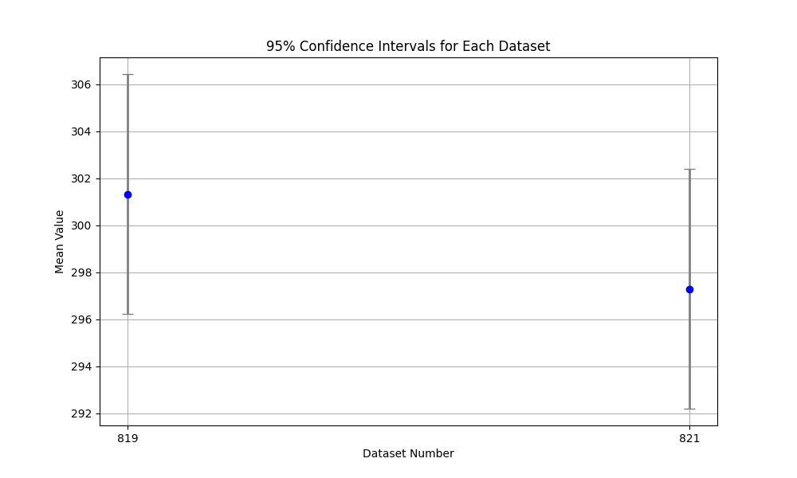

### **\{host\_name\}\_eplb\_\{i\}\_summed\_hot\_map\_by\_expert.png**

专家热点信息热力图，[图3](#fig732654205612)中的像素点可以根据右侧图例的亮度判断，亮度越高代表热度越高。

- host\_name表示所在的设备名称。
- i表示MindIE开启动态负载均衡场景时，服务化profiling采集周期内，负载均衡表更新的次数；不开启动态负载均衡时，i为0。

**图 3**  热力图<a name="fig732654205612"></a>  
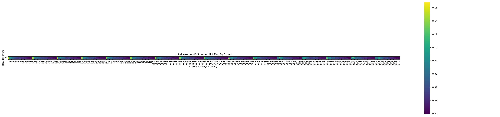

横轴为专家编号，纵轴代表模型的moe层。

专家编号为模型实例中，Rank\_id从小到大排序，每个Rank内按照顺序进行编号，例如16张卡，每张卡17个专家，专家编号为42的专家代表Rank\_2（第三张卡）的expert\_7（第8个专家）。

### **\{host\_name\}\_eplb\_\{i\}\_summed\_hot\_map\_by\_rank.png**

专家热点信息热力图，[图4](#fig455912215212)中的像素点可以根据右侧图例的亮度判断，亮度越高代表热度越高。

- host\_name表示所在的设备名称。
- i表示MindIE开启动态负载均衡场景时，服务化profiling采集周期内，负载均衡表更新的次数；不开启动态负载均衡时，i为0。

**图 4**  热力图<a name="fig455912215212"></a>  
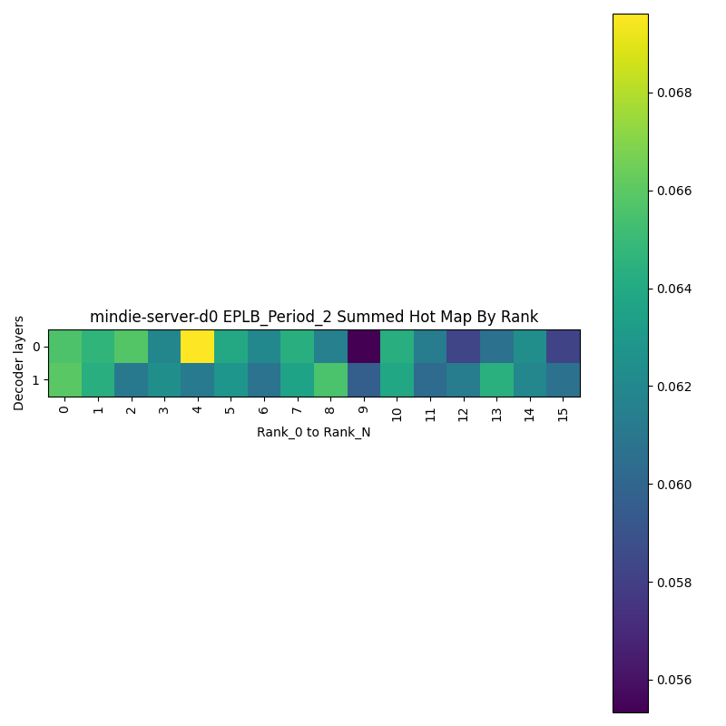

横轴为Rank\_ID，纵轴代表模型的moe层。

### **\{host\_name\}\_eplb\_\{i\}\_summed\_hot\_map\_by\_model\_expert.png**

专家热点信息热力图，[图5](#fig1161912109318)中的像素点可以根据右侧图例的亮度判断，亮度越高代表热度越高。

- host\_name表示所在的设备名称。
- i表示MindIE开启动态负载均衡场景时，服务化profiling采集周期内，负载均衡表更新的次数；不开启动态负载均衡时，i为0。
- 该图需要开启MindIE的动态负载均衡特性才会生成。

**图 5**  热力图<a name="fig1161912109318"></a>  
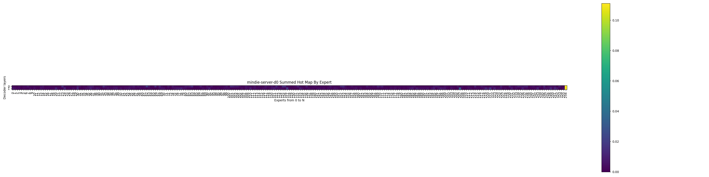

横轴为模型的专家编号，其中共享专家编号排列在最后，纵轴代表模型的MoE层。

### **\{host\_name\}\_balance\_ratio.png**

专家负载不均折线图，[图6](#fig3559155015275)从时间维度上展示模型专家负载不均的程度。

**图 6**  专家负载不均折线图<a name="fig3559155015275"></a>  
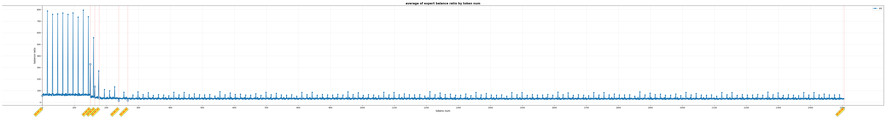

横坐标tokens num表示模型推理的轮数，纵坐标balance ratio表示基于专家热度使用标准差统计得出的模型负载不均的程度。

图中红色虚线表示模型在该时刻发生了专家负载均衡表的变化，对应的横坐标表示系统的本地时间。因为不同设备上的本地时间存在误差，模型运行时各个卡的任务流也会存在不同步的现象，展示的时间是取均值的结果，建议用户在采集前确保所有设备的本地时间保持同步。

## 数据可视化

### MindStudio Insight可视化

MindStudio Insight工具支持对服务化调优工具采集并解析的性能数据（[解析结果](#解析结果)）进行可视化，当前支持chrome\_tracing.json文件及profiler.db文件的可视化，详细操作及可视化结果介绍请参见《[MindStudio Insight工具用户指南](https://gitcode.com/Ascend/msinsight/blob/master/docs/zh/user_guide/overview.md)》中的“[服务化调优](https://gitcode.com/Ascend/msinsight/blob/master/docs/zh/user_guide/service_optimization.md)”章节。

### Chrome tracing可视化

Chrome tracing工具支持对服务化调优工具采集并解析的chrome\_tracing.json文件进行可视化，操作如下：

在Chrome浏览器中输入“chrome://tracing“地址，将.json文件拖到空白处打开，通过键盘上的快捷键（w：放大，s：缩小，a：左移，d：右移）进行查看。

> [!NOTE]
>
>如果chrome\_tracing.json大于500MB，推荐使用MindStudio Insight可视化。

### Grafana可视化

**功能说明<a name="section18743945144918"></a>**

Grafana工具支持对服务化调优工具采集并解析的性能数据进行可视化展示。

> [!NOTE]
>
> Grafana 为第三方开源软件，不属于 MindStudio Service Profiler 或 MindStudio 产品发布包的组成部分，也不是本工具强制要求用户使用的唯一可视化工具。用户可根据自身环境选择 Grafana 或其他兼容的可视化系统。

**数据准备<a name="section081361822719"></a>**

已完成[数据解析](#数据解析)并输出[解析结果](#解析结果)。

确认在--output-path指定的路径下存在SQLite数据库文件profiler.db。

**环境依赖<a name="section1280812992719"></a>**

工具版本：Grafana=11.3.0，SQLite插件=11.3.0。

**安装并连接Grafana**

Grafana安装官方网址[https://grafana.com/grafana/download?platform=arm&edition=oss](https://grafana.com/grafana/download?platform=arm&edition=oss)，下载安装对应开源版本解压运行。例如：

```bash
tar -zxvf grafana-11.3.0.linux-arm64.tar.gz
cd grafana-v11.3.0/bin/
./grafana-server
```

配置 Windows 代理时，需添加 Linux 设备 IP 前缀（例如 `90.90.*;90.91.*`）。在浏览器中访问 `http://<Linux设备IP>:3000/` 即可打开 Grafana 的 Web 端，初始账号与密码均为 `admin`。

**图 1**  Grafana示意图<a name="fig133211037409"></a>  


**使用示例<a name="section20198154975911"></a>**

1. 新建Data sources，如[图2 Data source](#fig119691547124112)所示。

    **图 2**  Data source<a name="fig119691547124112"></a>  
    

    data source类型选择SQLite类型，如[图3 Add data source](#fig17555112919480)所示。

    **图 3**  Add data source<a name="fig17555112919480"></a>  
    

    将解析生成的SQLite数据库文件profiler.db连接到Grafana，并记录datasource uid，如[图4 Data sources](#fig15266174254917)所示。

    **图 4**  Data sources<a name="fig15266174254917"></a>  
    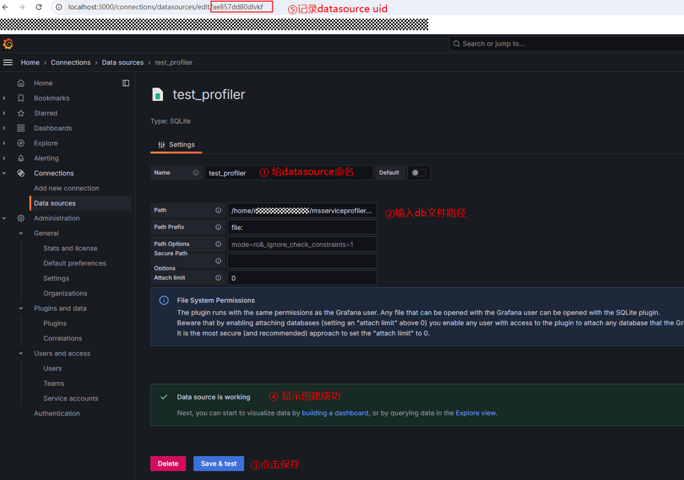

2. 新建dashboard，导入折线图。

    在/xxx/Ascend/cann-_\{version\}_/tools/msserviceprofiler/python/ms\_service\_profiler/views/路径下包含可视化文件profiler\_visualization.json，修改json文件中datasource的uid为上述步骤中记录的uid。

    > [!NOTE]
    >
    >{version}为CANN软件包版本，支持CANN 8.1.RC1及之后的版本。

    **图 5**  uid示意图<a name="fig51134371917"></a>  
    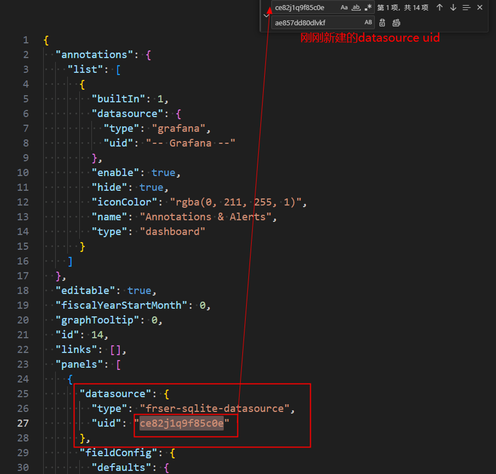
    
    > [!NOTE]
    >
    >json文件末尾的uid用于唯一标记此dashboard，这里不用修改；title用于给此dashboard命名，默认为Profiler Visualization。

    **图 6**  json示意图<a name="fig761123319212"></a>  
    

3. 新建dashboard，将修改后的json文件内容粘贴导入，即可在Dashboards中找到相对应名称的dashboard。

    **图 7**  Dashboards<a name="fig94901561348"></a>  
    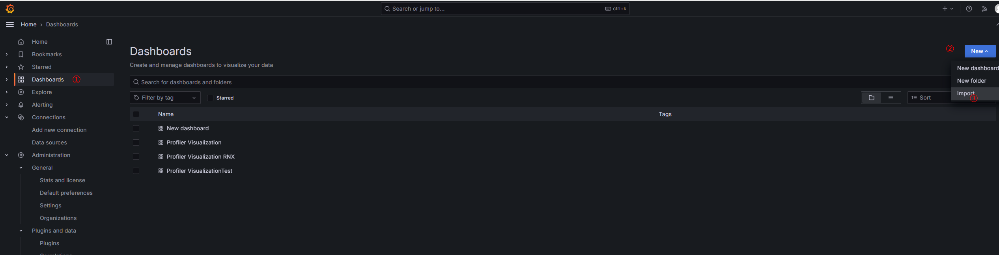

    **图 8**  Import dashboard<a name="fig944016531767"></a>  
    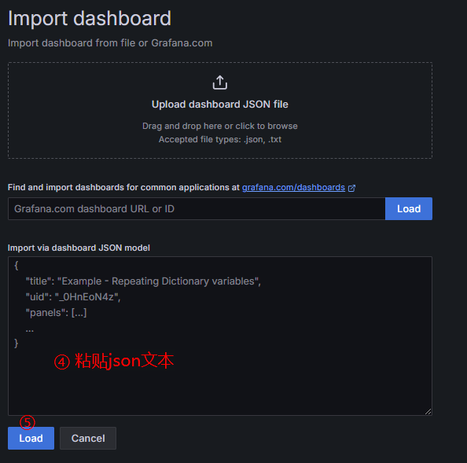

    **图 9**  设置参数<a name="fig82151013079"></a>  
    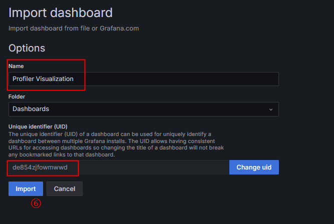

**可视化结果<a name="section16851525949"></a>**

生成的Grafana dashboard中包含以下可视化图像：

**表 1**  可视化图像

|可视化图像名称|描述|
|--|--|
|Batch_Size_curve|BatchSchedule过程中每个batch包含的请求数量折线图。根据时间排序，区分prefill和decode。|
|Batch_Token_curve|BatchSchedule过程中的总Token数折线图。区分prefill和decode。|
|Request_Status_curve|服务中处于不同状态下的队列大小随时间变化的折线图。|
|Kvcache_usage_percent_curve|所有请求Kvcache使用率随时间变换折线图。包含所有请求的Kvcache使用率情况。|
|First_Token_Latency_curve|所有请求首token时延随时间变化折线图。包含所有请求首token时延的平均值avg，分位值p99、p90、p50等。|
|Prefill_Generate_Speed_Latency_curve|所有请求prefill阶段，不同时刻吞吐的token平均时延随时间变化折线图。包含所有请求不同时刻吞吐的token平均时延的平均值avg，分位值p99、p90、p50等。|
|Decode_Generate_Speed_Latency_curve|所有请求decode阶段，不同时刻吞吐的token平均时延随时间变化折线图。包含所有请求不同时刻吞吐的token平均时延的平均值avg，分位值p99、p90、p50等。|
|Request_Latency_curve|所有请求端到端时延随时间变化折线图。包含所有请求端到端时延的平均值avg，分位值p99、p90、p50等。|

- Batch_Size_curve

    记录BatchSchedule过程中每个batch包含的请求数量折线图。

    横轴：按执行时间顺序的第x个batch，从0开始。

    纵轴：记录对应batch的batch size，区分prefill batch和decode batch。

    **图 10**  Batch_Size_curve<a name="fig11458160171513"></a>  
    

- Request_Status_curve

    服务化过程中处于不同状态下的队列大小随时间变化的折线图。

    横轴：服务化推理运行时间轴。

    纵轴：当前时刻处于该状态的队列大小。

    **图 11**  Request_Status_curve<a name="fig332101019263"></a>  
    

- Kvcache_usage_percent_curve

    所有请求Kvcache使用率随时间变化折线图。

    横轴：服务化推理运行时间轴。

    纵轴：所有请求Kvcache使用率的变化情况。单位：百分率%。

    **图 12**  Kvcache_usage_percent_curve<a name="fig248583622618"></a>  
    

- First_Token_Latency_curve

    所有请求token时延随时间变化折线图。

    横轴：服务化推理运行时间轴。

    纵轴：所有请求首token时延的平均值avg，分位值p99、p90、p50，最小值min。单位：us。

    **图 13**  First\_Token\_Latency\_curve<a name="fig51649142712"></a>  
    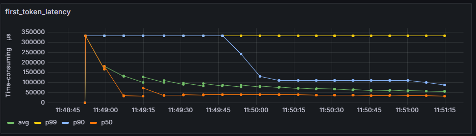

- Prefill\_Generate\_Speed\_Latency\_curve

    所有请求prefill阶段，不同时刻吞吐的token平均时延随时间变化折线图。

    横轴：服务化推理运行时间轴。

    纵轴：所有请求prefill阶段不同时刻吞吐的token平均时延的平均值avg，分位值p99、p90、p50，平均值avg。单位：token个数/s。

    **图 14**  Prefill\_Generate\_Speed\_Latency\_curve<a name="fig162756333277"></a>  
    

- Decode\_Generate\_Speed\_Latency\_curve

    所有请求decode阶段，不同时刻吞吐的token平均时延随时间变化折线图。

    横轴：服务化推理运行时间轴。

    纵轴：所有请求decode阶段不同时刻吞吐的token平均时延的平均值avg，分位值p99、p90、p50，平均值avg。单位：token个数/s。

    **图 15**  Decode\_Generate\_Speed\_Latency\_curve<a name="fig413355815278"></a>  
    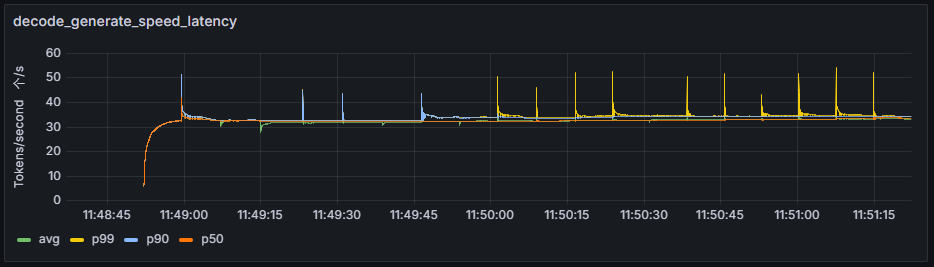

- Request\_Latency\_curve

    所有请求端到端时延随时间变化折线图。

    横轴：服务化推理运行时间轴。

    纵轴：所有请求端到端时延的平均值avg，分位值p99、p90、p50，平均值avg。单位：us。

    **图 16**  Request\_Latency\_curve<a name="fig7181141962810"></a>  
    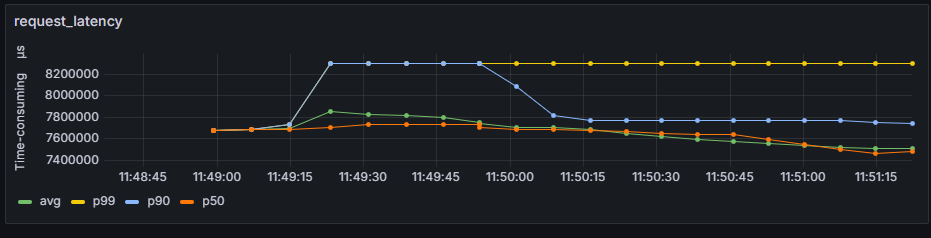

## 扩展功能<a name="ZH-CN_TOPIC_0000002254643849"></a>

### 自定义添加采集代码<a name="ZH-CN_TOPIC_0000002184508129"></a>

MindIE Motor推理服务化框架中默认已添加性能数据采集代码，当前步骤可选。

若需要自定义采集更多性能数据，可以参照如下示例代码对服务化框架中的性能采集代码进行修改，可以使用的接口请参见[API参考（C++）](./cpp_api/serving_tuning/README.md)或[API参考（Python）](./python_api/README.md)。

> [!NOTE]
>
>下列示例使用C++接口。

Span类数据采集：

```C++
// 记录执行开始结束时间
auto span = PROF(INFO, SpanStart("exec"));

...
// 用户执行代码

PROF(span.SpanEnd());
// 也可以不调用SpanEnd函数，在析构时会自动调用SpanEnd结束采集
```

Event类数据采集：

```C++
// 记录缓存交换事件
PROF(INFO, Event("cacheSwap"));
```

Metric类数据采集：

```C++
// 普通数据采集：利用率50%
PROF(INFO, Metric("usage", 0.5).Launch());
// 数据的增量采集：请求数量 + 1
PROF(INFO, MetricInc("reqSize", 1).Launch());
// 定义采集数据的范围（默认是全局）：第3个队列的当前大小是14
PROF(INFO, Metric("queueSize", 14).MetricScope("queue", 3).Launch());
```

Link类数据采集：

```C++
// 关联不同的资源，实际应用时不同模块对同一个请求使用不同的编号，将两个系统的编号关联起来
// reqID_SYS1和reqID_SYS2对应不同的系统编号
PROF(INFO, Link("reqID_SYS1", "reqID_SYS2"));
```

属性数据采集：

```C++
// 以上调用，都可以在结束前，在中间使用链式添加属性
PROF(INFO, Attr("attr", "attrValue").Attr("numAttr", 66.6).Event("test"));
// 属性可以自定义采集级别
PROF(INFO, Attr<msServiceProfiler::VERBOSE>("verboseAttr", 1000).Event("test"));
// 其他属性如：Domain(域)、Res(资源，一般是请求ID)等也可以使用链式进行添加
PROF(INFO, Domain("http").Res(reqId).Attr("attr", "attrValue").Event("test"));
```

### 服务化性能数据比对工具<a name="ZH-CN_TOPIC_0000002219803962"></a>

大模型推理服务化不同版本，不同框架之间可能存在性能差异，服务化性能数据比对工具支持对使用msServiceProfiler工具采集的性能数据进行差异比对，通过比对快速识别可能存在的问题点。详细介绍请参见《[服务化性能数据比对工具](./ms_service_profiler_compare_tool_instruct.md)》。

### vLLM服务化性能采集工具<a name="ZH-CN_TOPIC_0000002205822501"></a>

本工具基于Ascend-vLLM，提供性能数据采集能力，结合msServiceProfiler的数据解析与可视化能力，进行vLLM服务化推理调试调优。详细介绍请参见《[vLLM服务化性能采集工具](./vLLM_service_oriented_performance_collection_tool.md)》。

### 服务化自动寻优工具<a name="ZH-CN_TOPIC_0000002387389717"></a>

本工具基于msServiceProfiler工具采集的性能数据，提供服务化参数自动寻优能力，可以对服务化的参数以及测试工具的参数进行寻优。详细介绍请参见《[服务化自动寻优工具](./serviceparam_optimizer_instruct.md)》。
