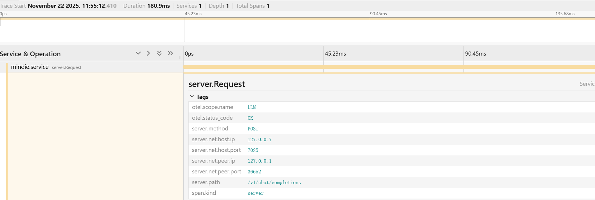

# msServiceProfiler Trace数据监测<a name="ZH-CN_TOPIC_0000002486322046"></a>

## 简介<a name="ZH-CN_TOPIC_0000002518641903"></a>

msServiceProfiler Trace提供基于OpenTelemetry Protocol（OTLP）协议的Trace数据转发服务，该服务用于接收、处理和转发分布式Trace数据，帮助用户监测和分析微服务架构的性能表现。

msServiceProfiler Trace采集MindIE Motor服务中的请求响应时间、响应状态、客户端IP/端口、服务端IP/端口等数据，最后将采集到的数据推送至Jaeger等支持OTLP协议的开源监测平台进行可视化分析。

- 当前版本主要面向MindIE推理框架，支持单机及多机PD竞争部署模式。
- 当前仅支持对MindIE的[/v1/chat/completions](https://www.hiascend.com/document/detail/zh/mindie/22RC1/mindieservice/servicedev/mindie_service0078.html)和[/v1/completions](https://www.hiascend.com/document/detail/zh/mindie/22RC1/mindieservice/servicedev/mindie_service0323.html)两个请求发送的核心接口进行Trace监测。
- msServiceProfiler Trace数据监测接口包括“msServiceProfiler API参考（C++） \>  [Trace数据监测](./cpp_api/trace_data_monitoring/README.md)”。
- 有关MindIE Motor相关介绍请参见《[MindIE Motor开发指南](https://gitcode.com/Ascend/MindIE-Motor/blob/master/docs/zh/user_guide/README.md)》。

## 产品支持情况<a name="ZH-CN_TOPIC_0000002489576470"></a>

> [!NOTE]
>
>昇腾产品的具体型号，请参见《[昇腾产品形态说明](https://www.hiascend.com/document/detail/zh/AscendFAQ/ProduTech/productform/hardwaredesc_0001.html)》

|产品类型| 是否支持 |
|--|:----:|
|Ascend 950 系列产品|x|
|Atlas A3 训练系列产品/Atlas A3 推理系列产品|√|
|Atlas A2 训练系列产品/Atlas A2 推理系列产品|√|
|Atlas 200I/500 A2 推理产品|√|
|Atlas 推理系列产品|√|
|Atlas 训练系列产品|x|

> [!NOTE]
> 
>针对Atlas A2 训练系列产品/Atlas A2 推理系列产品，当前仅支持该系列产品中的Atlas 800I A2 推理服务器。
>针对Atlas 推理系列产品，当前仅支持该系列产品中的Atlas 300I Duo 推理卡+Atlas 800 推理服务器（型号：3000）。

## 使用前准备<a name="ZH-CN_TOPIC_0000002486482024"></a>

**环境准备<a name="section151144214396"></a>**

1. 在昇腾环境安装配套版本的CANN Toolkit开发套件包和ops算子包并配置CANN环境变量，具体请参见[CANN快速安装](https://www.hiascend.com/cann/download)。

2. 完成[msServiceProfiler工具](msserviceprofiler_install_guide.md)的安装。

3. 完成MindIE的安装和配置并确认MindIE Motor可以正常运行，具体请参见《[MindIE 安装指南](https://gitcode.com/Ascend/MindIE-Motor/blob/master/docs/zh/user_guide/install/environment_preparation.md)》。

4. MindIE Motor服务所在的昇腾环境与OTLP采集器（Jaeger等）需建立稳定网络连接。

**约束<a name="section12833144412392"></a>**

msServiceProfiler Trace转发数据最大支持400并发，超过400并发可能出现请求积压，请求积压超过1000000，将出现数据丢失。

相关日志提示（下述日志每小时只上报1次）：

```ColdFusion
# 积压请求数量超过100000出现请求积压告警
2025-11-26 15:45:59,038 - 4059906 - msServiceProfiler - WARNING - Trace data is being stacked: {积压数量}
# 积压请求数量超过1000000出现数据丢失告警
2025-11-26 15:45:59,522 - 4059906 - msServiceProfiler - WARNING - Trace data queue is full, discarding the oldest data.
```

## 数据采集<a name="ZH-CN_TOPIC_0000002518521923"></a>

### 开启采集开关<a name="ZH-CN_TOPIC_0000002486322048"></a>

1. 通过配置环境变量MS\_TRACE\_ENABLE开启Trace采集开关。

    ```bash
    export MS_TRACE_ENABLE=1
    ```

    - 配置为1表示开启。
    - 不配置或其他值为关闭。

2. 通过配置环境变量支持更灵活的采样控制。

    | 环境变量名 | 说明 | 
    |------------|------|
    | `MS_PROFILER_AUTO_TRACE` | 当请求头中没有传递 trace_id 时，是否自动生成 trace_id。设置为 `1` 时开启自动生成；未设置或设置为其他值时不生成。 | 
    | `MS_PROFILER_SAMPLE_RATE` | 设置采样频率，仅对自动生成 `trace_id` 的请求生效。该值为正整数 N，表示每 N 次请求采样 1 次。若未设置或设置为非正整数，则不采样。 | 
    | `MS_PROFILER_SAMPLE_ERROR` | 是否仅上报错误的请求（适用于所有请求）。设置为 `1` 时仅上报错误 Span；未设置或设置为其他值时上报所有请求。 | 

```bash
# 设置环境变量示例

# 开启自动生成 trace_id（当请求头缺失时）
export MS_PROFILER_AUTO_TRACE=1

# 设置采样率为每100次请求采样1次（仅对自动生成的trace生效）
export MS_PROFILER_SAMPLE_RATE=100

# 设置仅上报错误的请求
export MS_PROFILER_SAMPLE_ERROR=1
```

**3.** 运行MindIE Motor服务。

### 配置目标采集服务器<a name="ZH-CN_TOPIC_0000002518641905"></a>

> [!NOTE]
>
>出于安全考虑，推荐用户使用安全模式，建议使用TLS认证。

在[启动Trace转发进程](#启动trace转发进程)前，需要通过环境变量设置目标采集服务器。

当前支持以下四种协议配置。

- HTTP

    ```bash
    export OTEL_EXPORTER_OTLP_PROTOCOL="http/protobuf"
    export OTEL_EXPORTER_OTLP_ENDPOINT=http://xxx:xxx/v1/traces    # 配置数据转发的IP和端口，例如http://localhost:4318/v1/traces
    ```

- HTTP + TLS

    ```bash
    export OTEL_EXPORTER_OTLP_PROTOCOL="http/protobuf"
    export OTEL_EXPORTER_OTLP_ENDPOINT=https://xxx:xxx/v1/traces    # 配置数据转发的IP和端口，例如https://localhost:4318/v1/traces
    export OTEL_EXPORTER_OTLP_CERTIFICATE=/home/certificates/ca/ca.crt    # 设置证书的绝对路径，该目录属主、文件属主和当前用户一致，目录权限700，文件权限600
    ```

- gRPC

    ```bash
    export OTEL_EXPORTER_OTLP_PROTOCOL="grpc"
    export OTEL_EXPORTER_OTLP_ENDPOINT=http://xxx:xxx    # 配置数据转发的IP和端口，例如http://localhost:4317
    ```

- gRPC + TLS

    ```bash
    export OTEL_EXPORTER_OTLP_PROTOCOL="grpc"
    export OTEL_EXPORTER_OTLP_ENDPOINT=https://xxx:xxx    # 配置数据转发的IP和端口，例如https://localhost:4317
    export OTEL_EXPORTER_OTLP_CERTIFICATE=/home/certificates/ca/ca.crt    # 设置证书的绝对路径，该目录属主、文件属主和当前用户一致，目录权限700，文件权限600
    ```

>[!NOTE]
>
>本工具依赖OpenTelemetry三方库实现。本文仅说明此工具使用的必备参数。更多功能接口请开发者深入其官方文档自行探索。
>
>当前只支持单向认证，双向认证相关配置参数不支持，配置会导致功能不可用。不可用配置参数如下：
>
>- OTEL\_EXPORTER\_OTLP\_TRACES\_CLIENT\_KEY
>- OTEL\_EXPORTER\_OTLP\_CLIENT\_KEY
>- OTEL\_EXPORTER\_OTLP\_TRACES\_CLIENT\_CERTIFICATE
>- OTEL\_EXPORTER\_OTLP\_CLIENT\_CERTIFICATE

### 启动Trace转发进程

**功能说明<a name="section21638528484"></a>**

启动Trace转发进程。

**注意事项<a name="section20819721134913"></a>**

重试机制：单条请求发送失败（默认重发6次），Trace转发进程不再接收后续的Trace数据，直到该请求发送成功才恢复数据转发功能。

**命令格式<a name="section10872103414491"></a>**

```bash
python -m ms_service_profiler.trace [--log-level]
```

options参数说明请参见[参数说明](#section379581401015)。

**参数说明<a name="section379581401015"></a>**

|**参数**|说明|**是否必选**|
|--|--|--|
|--log-level|设置日志级别，取值为：<br>&#8226; debug：调试级别。该级别的日志记录了调试信息，便于开发人员或维护人员定位问题。<br>&#8226; info：正常级别。记录工具正常运行的信息。默认值。<br>&#8226; warning：警告级别。记录工具和预期的状态不一致，但不影响整个进程运行的信息。<br>&#8226; error：一般错误级别。<br>&#8226; critical：严重错误级别。<br>&#8226; fatal：致命错误级别。|否|

**使用示例<a name="section246434914919"></a>**

使用默认配置启动Trace转发进程。命令如下：

```bash
python -m ms_service_profiler.trace
```

启动Trace转发进程使用的用户需要和启动MindIE Motor服务的用户一致，且在同网络命名空间中（同docker或同host）。

**输出说明<a name="section738017254237"></a>**

转发进程启动成功时打印示例如下：

```ColdFusion
2025-11-27 18:46:42,737 - 23410 - msServiceProfiler - INFO - Start http/protobuf exporter, endpoint: http://localhost:4318/v1/traces
2025-11-27 18:46:42,737 - 23410 - msServiceProfiler - INFO - Start socket server success, listen addr: OTLP_SOCKET
2025-11-27 18:46:42,737 - 23410 - msServiceProfiler - INFO - Start scheduler task: interval 1s
2025-11-27 18:46:42,738 - 23410 - msServiceProfiler - INFO - Start OTLPForwarderService success, running...
```

### 发送请求

当前建议使用/v1/chat/completions及/v1/completions接口发送请求。且这两个接口的HTTP请求头中需要添加“开启采样”信息。当前支持添加“开启采样”的HTTP请求头格式如下：

- W3C Trace Context \(traceparent\)
- B3 Single Header \(单一头格式\)
- B3 Multiple Headers \(多头格式\)

HTTP请求头需要添加的内容格式详细配置介绍如下：

**W3C Trace Context \(traceparent\)<a name="section3636185692618"></a>**

例如：

```http
traceparent: 00-0af7651916cd43dd8448eb211c80319c-b7ad6b7169203331-01
```

**表 1**  W3C Trace Context \(traceparent\)

|字段|位置|长度|含义|可选/必选|
|--|--|--|--|--|
|version|前2位|2字符|协议版本，目前固定为00|必选|
|trace-id|3~34位|32字符|全局Trace ID（16字节，32个十六进制字符），唯一标识整个分布式调用链|必选|
|parent-id|36~51位|16字符|父Span ID（8字节，16个十六进制字符），标识当前操作的直接上游|必选|
|trace-flags|53~54位|2字符|Trace标志，目前只使用最低位：**01=采样，00=不采样**|必选|

**B3 Single Header（单一头格式）<a name="section10847195822715"></a>**

例如：

```http
b3: 0af7651916cd43dd8448eb211c80319c-b7ad6b7169203331-1-0000000000000001
```

**表 2**  B3 Single Header（单一头格式）

|字段|字符位置|含义|格式|取值说明|可选/必选|
|--|--|--|--|--|--|
|TraceId|1~32位|全局Trace ID|32个十六进制字符|唯一标识整个分布式调用链|必选|
|SpanId|34~49位|当前Span ID|16个十六进制字符|标识当前服务操作的唯一ID|必选|
|Sampled|51位|采样决策|1个字符|**1=采样****0=不采样**|必选|
|ParentSpanId|53~68位|父Span ID|16个十六进制字符|可选字段，标识直接上游Span|可选|

**B3 Multiple Headers（多头格式）<a name="section1410152418280"></a>**

例如：

```http
X-B3-TraceId: 0af7651916cd43dd8448eb211c80319c
X-B3-SpanId: b7ad6b7169203331
X-B3-Sampled: 1
```

**表 3**  B3 Multiple Headers（多头格式）

|字段名称|含义|格式|取值|作用|可选/必选|
|--|--|--|--|--|--|
|X-B3-TraceId|全局Trace ID|32个十六进制字符（16字节）|任意32位十六进制字符串|唯一标识整个分布式调用链，所有相关服务共享同一个TraceId|必选|
|X-B3-SpanId|当前Span ID|16个十六进制字符（8字节）|任意16位十六进制字符串|标识当前服务操作的唯一ID，每个Span都有独立的SpanId|必选|
|X-B3-Sampled|采样决策|字符串|**1 = 采样****0 = 不采样**|控制是否记录Trace数据到后端系统，避免产生过多性能开销|必选|

**执行发送请求<a name="section113815183112"></a>**

发送的HTTP请求头中必须添加上述三种HTTP请求头格式的其中一种，才可以执行发送请求并开启Trace数据监测功能。其中配置的SpanId和TraceId会作为每个请求的索引。

以在HTTP请求头添加W3C Trace Context \(traceparent\)格式为例，执行发送请求命令如下：

```http
curl http://127.0.0.1:1025/v1/chat/completions \
-X POST \
-H "Content-Type: application/json" -H "traceparent: 04-01f92f3577b34da6a3ce929d0e0e4703-00f067aa0ba90203-01" \
-d '{
"model": "qwen",
"messages": [
{"role": "user", "content": "用Python写一个简单的冒泡排序算法："}
],
"max_tokens": 300,
"temperature": 0.5,
"stream": false }'
```

## 输出结果说明<a name="ZH-CN_TOPIC_0000002486322050"></a>

完成[发送请求](#发送请求)后，可以在支持OTLP协议的开源监测平台（例如Jaeger，须先开启Jaeger平台服务）查看可视化结果，示例如下。

**图 1**  可视化结果<a name="fig485163113451"></a>  


字段说明如下：

**表 1**  基础信息

|字段|说明|
|--|--|
|traceID|Trace链路的唯一标识符，string类型，示例值79f92f3577b34da6a3ce929d0e0e4703。|
|spanID|当前Span的唯一标识符，string类型，示例值4736e32cc09f0000。|
|operationName|操作/接口名称，string类型，示例值server.Request。|
|startTime|Span开始时间，int类型，单位us，示例值1763784983019248。|
|duration|Span持续时间，int类型，单位us，示例值328。|

**表 2**  服务信息

|字段|说明|
|--|--|
|tags[key=otel.scope.name]|服务/模块名称，string类型，示例值LLM。|
|tags[key=server.method]|HTTP请求方法，string类型，示例值POST。|
|tags[key=server.path]|请求路径，string类型，示例值/v1/chat/completions。|
|tags[key=span.kind]|Span类型，string类型，示例值server。|

**表 3**  网络信息

|字段|说明|
|--|--|
|tags[key=server.net.host.ip]|服务端IP地址，string类型，示例值127.0.0.7。|
|tags[key=server.net.host.port]|服务端端口，string类型，示例值7025。|
|tags[key=server.net.peer.ip]|客户端IP地址，string类型，示例值127.0.0.1。|
|tags[key=server.net.peer.port]|客户端端口，string类型，示例值36694。|

**表 4**  状态信息

|字段|说明|
|--|--|
|tags[key=error]|是否发生错误（仅当请求返回错误时存在），bool类型。示例值：请求错误时为true。请求正确时不出现该值。|
|tags[key=otel.status_code]|OpenTelemetry状态码，string类型。示例值：请求正确时为OK。请求错误时为ERROR。|
|tags[key=otel.status_description]|错误详细描述（仅当请求返回错误时存在），string类型，示例值{"error":"Request param contains not messages or messages null","error_type":"Input Validation Error"}。|
