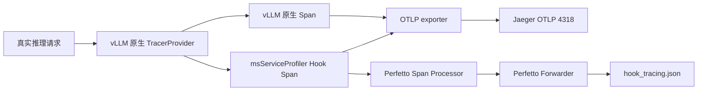

# vLLM Hook Tracing 使用指南

## 1. 功能边界

vLLM Hook Tracing 通过 msServiceProfiler 现有 Hook/YAML 机制，为请求调度、模型执行和输出处理创建 OpenTelemetry Span。

- vLLM 原生 Tracing 是前置条件，必须配置 `--otlp-traces-endpoint`。
- Jaeger：Hook Span 复用 vLLM 的全局 Provider 和 OTLP exporter。
- Perfetto：可选将 msServiceProfiler Hook Span 额外写成 Chrome Trace JSON。
- 不支持 Perfetto-only；启动 Perfetto Forwarder 本身不会创建 Span。
- profiling、metrics、MindIE C++ Trace 和原 OTLP Forwarder 行为不变。
- 本功能没有新增 C/C++ 接口，不需要替换带新增符号的 `.so`。
- 当前及后续版本均不修改 vLLM/vLLM-Ascend 源码或 IPC；只读取上游公开的 `request_id`、`trace_headers` 和业务对象字段。

Tracing 和 profiling 是两套独立交付流程：Tracing 不需要 `enable.json` 和 `parse`；profiling 仍按原流程生成 CSV、DB 和离线 Chrome Trace 等交付件。

### 1.1 版本要求

本功能依赖 vLLM V1 引擎提供原生 OpenTelemetry Tracing，并复用 vLLM 创建的全局 `TracerProvider` 和 OTLP exporter。为减少旧版符号和链路行为的维护成本，Hook Tracing 的支持范围从 vLLM-Ascend `v0.20.0` 开始。低于该版本的组合不再作为问题定位、兼容适配和回归验证范围；profiling、metrics 等其他功能的版本范围以各自资料为准。

| 组件 | 最低支持版本 | 要求 |
|---|---|---|
| vLLM-Ascend | `0.20.0` | 本功能的支持策略下限；实际安装版本必须存在于官方兼容矩阵 |
| vLLM | 与 vLLM-Ascend 配套 | 使用官方兼容矩阵同一行指定的版本，并支持 V1 `--otlp-traces-endpoint` |

`0.20.0` 是支持策略边界，不表示官方一定发布了同名安装包。以官方兼容矩阵为准，首个满足该边界的公开组合是 vLLM-Ascend `v0.20.2rc1` 与 vLLM `v0.20.2`。不得把 `vllm-ascend==0.20.0` 当成固定安装命令，也不得只升级其中一个组件。后续版本同样从[官方版本兼容矩阵](https://docs.vllm.ai/projects/ascend/zh-cn/latest/community/versioning_policy.html#版本兼容性矩阵)选择完整的一行。

安装任何支持版本时，vLLM 和 vLLM-Ascend 必须采用 vLLM-Ascend 官方兼容矩阵中的配套组合，不能只升级其中一个组件。启动前执行：

```bash
python3 - <<'PY'
from importlib.metadata import version
from opentelemetry.exporter.otlp.proto.http.trace_exporter import OTLPSpanExporter
from opentelemetry.sdk.trace import TracerProvider
from packaging.version import Version

print("vLLM:", version("vllm"))
ascend_version = Version(version("vllm-ascend"))
assert ascend_version >= Version("0.20.0"), ascend_version
print("vLLM-Ascend:", ascend_version)
print("OpenTelemetry: ready")
PY

vllm serve --help | grep -- '--otlp-traces-endpoint'
```

版本号和参数检查通过后，仍需以运行结果完成最终确认：启动日志显示使用 V1 引擎，日志中没有 `Falling back to V0`，发送真实推理请求后 Jaeger 同时收到 vLLM 原生请求 Span 和 msServiceProfiler Hook Span。三项全部满足才表示 Tracing 链路可用于本文的请求级分析。

## 2. 快速入门

本章给出开发和验证环境的最短闭环。假设 vLLM-Ascend 已经能正常推理，Jaeger 和 vLLM 分别运行在两个 Docker 容器中。Jaeger all-in-one 使用内存存储，容器重启后数据会丢失，只适合学习和功能验证，不作为生产部署方案。

### 2.1 准备变量和容器网络

在宿主机执行。将 `VLLM_CONTAINER` 改成实际的 vLLM 容器名；变量为空时不可继续执行后续命令。

```bash
export VLLM_CONTAINER=<vLLM容器名>
export TRACE_NETWORK=ms-tracing-net
export JAEGER_CONTAINER=ms-trace-jaeger

test -n "$VLLM_CONTAINER"
docker inspect "$VLLM_CONTAINER" >/dev/null
docker network inspect "$TRACE_NETWORK" >/dev/null 2>&1 || \
  docker network create "$TRACE_NETWORK"
```

### 2.2 启动 Jaeger

以下命令按 [Jaeger 2.20 Getting Started](https://www.jaegertracing.io/docs/2.20/getting-started/) 固定使用 Jaeger `2.20.0`，开放 Web UI 端口 `16686`、OTLP gRPC 端口 `4317` 和本文使用的 OTLP HTTP 端口 `4318`：

```bash
docker run -d \
  --name "$JAEGER_CONTAINER" \
  --network "$TRACE_NETWORK" \
  --restart unless-stopped \
  -p 16686:16686 \
  -p 4317:4317 \
  -p 4318:4318 \
  cr.jaegertracing.io/jaegertracing/jaeger:2.20.0

docker logs "$JAEGER_CONTAINER"
curl -fsS http://127.0.0.1:16686/ >/dev/null && echo "Jaeger UI: ready"
```

若容器名已存在，先使用 `docker start "$JAEGER_CONTAINER"`，不要重复执行 `docker run`。浏览器访问 `http://<宿主机IP>:16686`；宿主机启用了防火墙时，只向可信管理网开放 `16686`，不可将 `4317/4318` 向公网开放。

### 2.3 将 vLLM 容器接入同一网络

```bash
docker network connect "$TRACE_NETWORK" "$VLLM_CONTAINER" 2>/dev/null || true
docker network inspect "$TRACE_NETWORK"
```

`docker network inspect` 的 `Containers` 中必须同时出现 `ms-trace-jaeger` 和 vLLM 容器。然后在 vLLM 容器内检查 DNS 和端口：

```bash
docker exec "$VLLM_CONTAINER" getent hosts ms-trace-jaeger
docker exec "$VLLM_CONTAINER" sh -c \
  'curl -sS -o /dev/null -w "OTLP HTTP status: %{http_code}\n" http://ms-trace-jaeger:4318/v1/traces'
```

第二条命令返回任意 HTTP 状态码都表示 DNS、路由和 TCP 端口已经连通；只有解析失败、`Connection refused` 或超时才表示网络未通。OTLP `/v1/traces` 需要 POST protobuf，使用普通 GET 得到 `404` 或 `405` 不是导出失败。

### 2.4 检查运行环境

进入启动 vLLM 的同一个容器和 Python 环境后执行：

```bash
python3 - <<'PY'
from importlib.metadata import version
from packaging.version import Version

ascend_version = Version(version("vllm-ascend"))
assert ascend_version >= Version("0.20.0"), ascend_version
print("vLLM:", version("vllm"))
print("vLLM-Ascend:", ascend_version)
print("msServiceProfiler:", version("msserviceprofiler"))

from opentelemetry.exporter.otlp.proto.http.trace_exporter import OTLPSpanExporter
from opentelemetry.sdk.trace import TracerProvider
print("OpenTelemetry HTTP exporter: ready")
PY

vllm serve --help | grep -- '--otlp-traces-endpoint'
```

vLLM 和 vLLM-Ascend 的版本必须采用官方兼容矩阵中的配套组合。如果 `msserviceprofiler` 或 OpenTelemetry 导入失败，请先在该 Python 环境中安装 msServiceProfiler，安装方式请参见《[msServiceProfiler 安装指南](./msserviceprofiler_install_guide.md)》；安装时不可使用 `--no-deps` 跳过 Python 依赖。

### 2.5 启动 vLLM 和 Hook Tracing

以下命令必须在最终承载 vLLM 进程的容器内执行。

其中，`MODEL` 变量值 `<container_model_path>` 应配置为容器内模型路径；`MODEL_NAME` 变量值 `<external_service_name>` 应配置为对外服务名称。

```bash
export MODEL=<container_model_path>
export MODEL_NAME=<external_service_name>
export PORT=8000

export MS_TRACE_ENABLE=1
export OTEL_SERVICE_NAME=vllm-server
export OTEL_EXPORTER_OTLP_TRACES_PROTOCOL=http/protobuf
export OTEL_EXPORTER_OTLP_TRACES_ENDPOINT=http://ms-trace-jaeger:4318/v1/traces
unset VLLM_PLUGINS

vllm serve "$MODEL" \
  --host 0.0.0.0 \
  --port "$PORT" \
  --served-model-name "$MODEL_NAME" \
  --otlp-traces-endpoint http://ms-trace-jaeger:4318/v1/traces
```

`MS_TRACE_ENABLE` 和 OTLP 变量必须在启动 vLLM **之前**设置。`OTEL_SERVICE_NAME` 决定 Jaeger Service 下拉框中的名称。启动日志必须显示 V1 引擎，且没有回退到 V0。

### 2.6 发送真实推理请求

在能够访问 vLLM API 的终端执行。先用 `/health` 等待就绪，再发送一次真实推理；只有真实推理才会生成要验证的请求 Trace。

```bash
export VLLM_HOST=127.0.0.1
export PORT=8000
export MODEL_NAME=<对外服务名>

curl -fsS "http://${VLLM_HOST}:${PORT}/health"
curl -sS "http://${VLLM_HOST}:${PORT}/v1/completions" \
  -H 'Content-Type: application/json' \
  -d "{\"model\":\"${MODEL_NAME}\",\"prompt\":\"Hello\",\"max_tokens\":8,\"temperature\":0}"
```

### 2.7 在 Jaeger 验证

完成真实推理请求后，vLLM 的批量 exporter 需要数秒将 Span 数据刷新至 Jaeger。等待数据刷新后，执行以下命令验证 Trace：

```bash
curl -fsS 'http://127.0.0.1:16686/api/services'
curl -fsS 'http://127.0.0.1:16686/api/traces?service=vllm-server&limit=20'
```

Jaeger Trace 链路的验证通过标准如下：

1. `/api/services` 中存在 `vllm-server`。
2. `/api/traces` 的 `data` 数组非空。
3. 在 Jaeger UI 中选择 `vllm-server` 后，界面上同时呈现 vLLM 原生请求 Span，以及 `vllm.scheduler.schedule`、`vllm.model.execute`、`vllm_ascend.model_runner.execute` 或 `vllm.output.process` 中至少一个 Hook Span。
4. 若需将调度、模型执行和输出处理 Span 归属于具体推理请求，还须满足[验收层级](#sectionAcceptanceLevels)中的“请求关联通过”条件；Jaeger 页面存在 Trace 数据仅表示数据出口可用，不足以证明请求关联有效。

如果 `/api/services` 中不存在 `vllm-server`，请按照[网络和数据链路排障](#sectionNetworkDataLinkTroubleshooting)中的顺序，依次检查容器状态、DNS、端口、vLLM 参数、exporter 日志和 Hook 命中情况。排查过程中每次只调整一个变量，以便确认故障原因。

## 3. 数据流和地址选择



Jaeger 和 vLLM 位于不同容器时，地址必须按发起访问的进程位置选择：

| 发起访问的位置 | 使用场景 | 地址 |
|---|---|---|
| 用户浏览器或宿主机命令 | Jaeger UI/API | `http://<宿主机IP>:16686`；本机可用 `127.0.0.1` |
| 与 Jaeger 同一 Docker 自定义网络的 vLLM 容器 | OTLP HTTP 上报 | `http://ms-trace-jaeger:4318/v1/traces` |
| 与 Jaeger 同一主机但不在同一容器网络的进程 | OTLP HTTP 上报 | `http://<宿主机可达IP>:4318/v1/traces` |
| Jaeger 与 vLLM 同一容器 | UI/API 或 OTLP | 分别使用 `http://127.0.0.1:16686` 和 `http://127.0.0.1:4318/v1/traces` |

`127.0.0.1` 始终指向当前进程所在容器或主机，不能跨容器访问另一个服务。

## 4. 埋点配置

Tracing 复用 profiling 的同一份符号 YAML，不存在第二份 Tracing YAML。未设置 `PROFILING_SYMBOLS_PATH` 时使用 msServiceProfiler 包内 default 配置。

```yaml
- symbol: vllm.v1.core.sched.scheduler:Scheduler.schedule
  handler: ms_service_profiler.patcher.vllm.handlers.v1.batch_handlers:schedule
  trace:
    name: vllm.scheduler.schedule
    domain: Schedule
    adapter: schedule
```

同一解析后符号只允许一个有效 `trace` 配置。支持的 Adapter 如下：

| Adapter | 作用 |
|---|---|
| `call` | 普通函数 Span |
| `request` | 注册请求上下文，不创建重复根 Span |
| `request_context` | 从请求对象读取 `trace_headers` |
| `schedule` | 记录批次请求数、Token 数和请求 Links |
| `model` | 记录模型执行并关联批次 request IDs |
| `output` | 记录输出处理并清理已完成请求上下文 |

## 5. 启动原则

### 5.1 Jaeger-only

仅验证 Jaeger 时，不需要运行 `python3 -m ms_service_profiler.trace`。在 vLLM 进程环境中开启 Hook tracing，并为 vLLM 配置原生 OTLP endpoint：

```bash
export MS_TRACE_ENABLE=1
export OTEL_SERVICE_NAME=vllm-server
export OTEL_EXPORTER_OTLP_TRACES_PROTOCOL=http/protobuf
export OTEL_EXPORTER_OTLP_TRACES_ENDPOINT=http://ms-trace-jaeger:4318/v1/traces

vllm serve "$MODEL" \
  --host 0.0.0.0 \
  --port "$PORT" \
  --served-model-name "$MODEL_NAME" \
  --otlp-traces-endpoint http://ms-trace-jaeger:4318/v1/traces
```

### 5.2 同时输出 Jaeger 和 Perfetto 数据

建议先启动 Perfetto Forwarder，便于第一条 Hook Span 就写入文件；这不是硬性顺序要求。当前 Hook backend 会在创建后续 Span 时重新探测 Forwarder，并在探测成功后注册附加 Processor，因此 Forwarder 晚于 vLLM 启动时无需重启 vLLM，但启动前已经结束的 Span 不会补写。

```bash
export TRACE_VERIFY_DIR=/tmp/ms_trace_verify
mkdir -p "$TRACE_VERIFY_DIR"

nohup python3 -m ms_service_profiler.trace \
  --log-level debug \
  --perfetto-output "$TRACE_VERIFY_DIR/hook_tracing.json" \
  >"$TRACE_VERIFY_DIR/perfetto_forwarder.log" 2>&1 &

echo $! >"$TRACE_VERIFY_DIR/perfetto_forwarder.pid"
```

然后按 Jaeger-only 场景启动 vLLM。Jaeger 接收 vLLM 原生 Span 和 Hook Span；Perfetto JSON 只接收 instrumentation scope 为 `ms_service_profiler.hook.*` 的 Hook Span。

`TRACE_VERIFY_DIR` 和 PID 文件只是验证脚本变量，不是产品配置项。

验证时应先确认 Jaeger 与 vLLM 的网络连通性，再按后续章节发送真实推理负载并检查两个数据出口。

## 6. 真实推理负载

`/health` 只用于等待服务就绪，不能用于验证推理 Trace。必须发送 `/v1/completions` 等真实推理请求，例如：

```bash
vllm bench serve \
  --backend vllm \
  --host 127.0.0.1 \
  --port "$PORT" \
  --endpoint /v1/completions \
  --model "$MODEL_NAME" \
  --tokenizer "$MODEL" \
  --dataset-name random \
  --random-input-len 128 \
  --random-output-len 16 \
  --num-prompts 8 \
  --max-concurrency 1 \
  --request-rate 1 \
  --ignore-eos
```

不要把 `VLLM_PLUGINS` 只设置为 `msserviceprofiler`，否则会过滤掉 `ascend` 平台插件并导致 vLLM 无法识别 NPU。验证时执行 `unset VLLM_PLUGINS`，让 vLLM 自动发现全部插件。

### 6.1 分析前检查

以下检查全部通过后，再使用 Trace 做请求级性能归因：

| 检查项 | 操作 | 通过标准 | 未通过时处理 |
|---|---|---|---|
| 版本组合 | 查询 `vllm` 和 `vllm-ascend` 包版本 | 不低于最低支持组合，且符合官方兼容矩阵 | 按兼容矩阵成套升级，不能只升级单个组件 |
| OpenTelemetry 依赖 | 导入 `TracerProvider` 和实际协议对应的 `OTLPSpanExporter` | Python 进程输出 `OpenTelemetry: ready` | 在 vLLM 运行环境中正常安装 msServiceProfiler 及其依赖，禁止使用 `--no-deps` 跳过依赖 |
| V1 引擎 | 检查 vLLM 启动日志 | 使用 V1，且没有 `Falling back to V0` | 检查版本组合和不兼容的启动参数 |
| 真实推理请求 | 发送 `/v1/completions` 请求 | 推理成功并返回结果 | 修复服务或请求参数；`/health` 不能替代 |
| 原生 Tracing | 检查 vLLM 启动命令 | 包含 `--otlp-traces-endpoint` | 补充 OTLP endpoint 后重启服务 |
| Hook Tracing | 检查 vLLM 进程环境 | `MS_TRACE_ENABLE=1` | 设置环境变量后重启服务 |
| 数据出口 | 在 Jaeger 搜索服务 | 目标服务存在，压测窗口内有 Trace | 检查 OTLP 地址、4318 端口和容器网络 |
| Hook Span | 搜索目标操作 | 出现 scheduler、model 或 output 目标 Span | 检查当前版本是否命中 YAML 符号和 Hook 日志 |
| 请求关联 | 查看父子关系、Trace ID、Links 和 `request.ids` | 至少一种关联方式成立 | 停止请求级归因，改用 Metrics、Perfetto 或 Profiling |
| 时间一致 | 对照 Metrics 与 Span 时间 | 时区、异常起止时间一致 | 统一时区并同步节点时钟 |

请求关联未通过时，Hook Span 仍能用于操作级耗时统计，但不能证明某个 scheduler、model 或 output Span 属于目标请求。

## 7. Jaeger 怎么看

### 7.1 搜索页

1. 打开 `http://<宿主机IP>:16686`。
2. Service 选择实际服务名，例如 `vllm-server`。
3. Tags 保持为空，Lookback 选择覆盖压测时间的范围。
4. 将 Limit Results 调大到 200，避免高频 scheduler/model Trace 挤掉 request/output Trace。
5. 点击 **Find Traces**。

散点图横轴是开始时间，纵轴是 Trace 总时长。明显高于正常分布的点通常是性能异常候选。列表中的 Spans 表示该 Trace 包含的 Span 数量，Duration 表示端到端或当前 Trace 的总时长。

### 7.2 Trace 详情页

点击一条 Trace 后重点观察：

| 观察项 | 分析价值 |
|---|---|
| 父子 Span 时间线 | 判断耗时发生在调度、模型执行还是输出处理 |
| Span 自身耗时 | 区分模型计算慢与框架处理慢 |
| 同级 Span 的空白间隔 | 识别排队、同步、IPC 或等待资源的时间 |
| Tags/Attributes | 查看 `request.id(s)`、batch、token、状态和进程/线程信息 |
| References/Links | 查看跨请求批处理或跨进程关联；Link 不等同于父子关系 |
| Error/Status | 定位异常请求和失败阶段 |

典型埋点含义：

| Span | 主要定位方向 |
|---|---|
| `vllm.scheduler.schedule` | 调度频率、调度耗时、请求排队、batch 组织 |
| `vllm.model.execute` | Executor 层模型执行耗时 |
| `vllm_ascend.model_runner.execute` | Ascend ModelRunner 实际执行耗时 |
| `vllm.output.process` | 输出处理、请求完成和后处理耗时 |

### 7.3 常见性能判断

- scheduler Span 持续升高、model Span 稳定：重点检查排队、KV Cache 压力、batch 组织和调度策略。
- model Span 占绝大多数且随 batch 增大明显升高：重点检查模型计算、通信、算子和 NPU 利用率，并与 profiling 结果结合。
- `vllm.model.execute` 明显大于其内部 `vllm_ascend.model_runner.execute`：差值位于 Executor 外围，继续检查 IPC、同步和数据准备。
- output Span 异常升高：重点检查输出处理、token 后处理、网络回传和请求完成逻辑。
- 少数 Trace 是长尾：在散点图选中长尾 Trace，与正常 Trace 使用 Compare 对比 Span 时长和属性差异。
- 大量 Trace 只有 1～2 个 Span：只能证明埋点已导出，不能单独证明完整请求父子链；需要继续检查 Trace 详情中的 Links、`request.ids` 和原生 vLLM 根 Span。

Tracing 用于缩小问题所在阶段；若需要分析算子、kernel、HCCL、显存或 NPU 时间线，继续使用原 profiling 采集和解析能力。

### 7.4 标准分析步骤

Tracing 不依赖 Metrics 才能开始分析。根据已有信息选择入口：

- 已知 Trace ID 或 request ID：直接搜索目标请求。
- 已知故障时间或服务日志：按服务、时间、操作名和最小时长筛选 Trace。
- 没有明确目标：在 Jaeger 散点图中选择长尾或 Error Trace。
- 已有 Metrics 异常窗口：使用实例、DP 域、请求阶段和时间范围缩小 Trace 搜索范围。

找到目标后按以下顺序分析：

1. 确认 Trace 对应真实推理请求，并记录请求类型、输入/输出 Token、Batch 和时间。
2. 使用父子关系、Trace ID、Links 和 `request.ids` 判断关联形态。
3. 同一 Trace ID 场景检查父子 Span；Span Links 场景沿 Link 找到关联 Span，并分别记录时间戳、耗时和属性。
4. 按根 Trace、scheduler、model、model runner、output 的顺序检查关键路径；只有同一 Trace ID 或统一 Perfetto Timeline 才计算 Span 间空白。
5. 检查 Error/Status 和异常属性，将问题定位到调度、等待资源、模型执行、Executor 外围、输出处理或错误路径。
6. 存在正常基线时，选择输入 Token、输出 Token、Batch 和阶段一致的正常观测组，确认差异稳定存在。
7. 需要判断影响范围时，再使用 Metrics 验证该现象是否覆盖连续采集点、多个请求或多个实例。

对比结果按下表记录：

| 项目 | 正常观测组 | 异常观测组 | 分析结论 |
|---|---:|---:|---|
| Trace 总时长 |  |  |  |
| `vllm.scheduler.schedule` |  |  |  |
| `vllm.model.execute` |  |  |  |
| `vllm_ascend.model_runner.execute` |  |  |  |
| `vllm.output.process` |  |  |  |
| 最大空白区间（仅同一时间线） |  |  |  |
| request/batch 属性 |  |  |  |

同一 Trace ID 场景中，异常阶段的差值需要解释 Trace 总时长的主要变化。Span Links 场景分别比较关联 Span 的时间戳和耗时，不把不同 Trace 的界面空白解释为等待。无法解释时，检查未插桩区间；问题已经进入模型执行内部时，继续使用 Profiling 下钻。

### 7.5 Metrics 与 Span 联合对照

本节用于 Metrics 和 Tracing 数据同时可用的场景，不是 Tracing 独立分析的前置步骤。

| Metrics 现象 | Trace 证据 | 定位结论 |
|---|---|---|
| `scheduler:duration` 升高，模型执行耗时稳定 | scheduler Span 变长，model Span 保持基线 | 调度器自身执行变慢 |
| waiting 与 TTFT 升高，scheduler Span 本身稳定 | 同一 Trace 或 Perfetto Timeline 中调度到 model 的间隔变长 | 请求正在排队、同步或等待资源 |
| execute model 与 forward 同步升高 | model 和 model runner Span 同步变长 | ModelRunner 执行阶段变慢 |
| execute model 升高，model runner 稳定 | model Span 的外围时间增加 | Executor 外围 IPC、同步或数据准备变慢 |
| output processor 升高，模型执行稳定 | output Span 变长 | 输出处理阶段变慢 |

Tracing 独立分析可以定位目标请求的关键路径和异常阶段，但结论范围仅覆盖已分析的请求或观测组。Metrics 独立分析可以确认异常趋势、容量和影响范围，但不描述单请求调用链。两类数据联合使用时，要求 SLO 现象、Metrics 定界和 Trace 定位相互对应。完整流程参见[《vLLM-Ascend 可观测性性能诊断指南》](./vllm_ascend_observability_analysis_guide.md)。

### 7.6 请求关联方式与数量边界

| 关联方式 | 识别方法 | 能够执行的分析 |
|---|---|---|
| 父子 Span | 同一 Trace ID，Jaeger 展示父子层级 | 分析父子耗时、关键路径和空白区间 |
| Span Links | Trace ID 不同，References/Links 或 `request.ids` 明确关联 | 沿 Link 查找关联 Span，比较各 Span 的时间戳、耗时和属性 |
| 无请求关联 | 无父子关系、无 Links、无有效 `request.ids` | 仅按操作名、时间窗口、实例和 DP 做阶段级统计 |

单个 Hook Span 最多记录 128 个 `request.ids` 和 Span Links。Batch 请求数超过 128 时，后续请求不会进入该 Span 的请求关联集合。此时使用 `batch.request_count`、`batch.scheduled_tokens`、Metrics 的实例/DP/phase 聚合以及 Perfetto 或 Profiling 数据完成 Batch 级分析，不能宣称该 Span 覆盖了 Batch 内全部请求。

## 8. 验收层级<a name="sectionAcceptanceLevels"></a>

| 层级 | 判定依据 |
|---|---|
| 数据出口通过 | Jaeger API有 Trace，Perfetto JSON 有合法 Complete Event |
| 埋点展示通过 | Jaeger/Perfetto 能看到预期 Hook Span 名称和耗时 |
| 请求关联通过 | request、schedule、model、output 可通过父子关系、同一 trace ID 或明确 Span Links 关联 |
| 性能分析有效 | 能用 Span 时长和属性区分调度、模型、输出或等待瓶颈，并可下钻 profiling |

不能用“Jaeger 页面有数据”替代“完整请求链路关联通过”的结论。

## 9. Profiling 共存验证

Profiling 仍必须按原流程配置 `enable.json`、指定采集目录并执行 `parse`。Tracing 不替代该流程。

按以下顺序分别验证：

1. 只开 profiling：交付件和历史版本一致。
2. 只开 tracing：Jaeger 中出现原生 Span 和 Hook Span；若启动 Perfetto Forwarder，JSON 非空。
3. profiling + tracing：推理成功，两类交付件均生成；Tracing Span 会包含少量 profiling handler 开销。

## 10. 网络和数据链路排障<a name="sectionNetworkDataLinkTroubleshooting"></a>

请按照下表顺序逐层排查，上层检查通过后才可继续下一层检查，请勿在 Jaeger UI 中反复刷新：

| 层级 | 检查命令 | 通过标准 | 失败说明 |
|---|---|---|---|
| Jaeger 进程 | `docker ps --filter name=ms-trace-jaeger`；`docker logs ms-trace-jaeger` | 容器为 `Up`，日志无持续启动失败 | 镜像、配置或容器本身未就绪 |
| 宿主机 UI | `curl -fsS http://127.0.0.1:16686/ >/dev/null` | 返回码为 0 | 端口未映射、进程未监听或本机防火墙拦截 |
| 容器网络 | `docker network inspect ms-tracing-net` | Jaeger 和 vLLM 容器均在 `Containers` 中 | 两个容器没有共同的 Docker 网络 |
| 容器 DNS | `getent hosts ms-trace-jaeger` | 返回容器 IP | endpoint 名称错误或容器未加入同一网络 |
| OTLP TCP | `curl -sS -o /dev/null -w '%{http_code}\n' http://ms-trace-jaeger:4318/v1/traces` | 返回一个 HTTP 状态码 | `refused` 表示未监听；超时通常是路由或防火墙；普通 GET 的 `404/405` 可忽略 |
| vLLM 配置 | 查看实际启动命令和进程环境 | 含 `--otlp-traces-endpoint`，进程环境中有 `MS_TRACE_ENABLE=1` | 修改 shell 变量但未重启进程不会生效 |
| 推理负载 | 调用 `/v1/completions` | 返回有效推理结果 | `/health` 成功不能证明产生了请求 Trace |
| 原生数据 | `curl -fsS 'http://127.0.0.1:16686/api/services'` | 出现 `OTEL_SERVICE_NAME` 的值 | 先查 endpoint、协议和 vLLM exporter 日志，不要先查 Hook |
| Hook 数据 | 在目标服务中搜索 `vllm.scheduler.schedule` 等操作 | 至少一个预期 Hook Span | 查 msServiceProfiler 是否加载、版本是否受支持、YAML 符号是否命中 |
| 请求关联 | 查 Trace ID、父子关系、Links、`request.ids` | 至少一种关联成立 | 只能做阶段统计，不能做单请求关键路径归因 |

容器里没有 `curl` 时，可用 Python 只检查 DNS 和 TCP，不会发送 Trace 数据：

```bash
python3 - <<'PY'
import socket

host, port = "ms-trace-jaeger", 4318
print("resolved:", socket.gethostbyname(host))
with socket.create_connection((host, port), timeout=3):
    print("OTLP TCP: reachable")
PY
```

常见现象与处理如下：

| 现象 | 原因与处理 |
|---|---|
| `ms-trace-jaeger` 无法解析 | 命令在宿主机执行，或两个容器不在同一 Docker 自定义网络；宿主机改用 `127.0.0.1` |
| `Connection refused` | 名称已解析但目标端口没有监听；检查 Jaeger 容器状态、日志和 `4318` 端口，而不是修改 DNS |
| 连接超时 | 检查 Docker 网络、跨主机路由、安全组和防火墙；不要把超时当作 OTLP 数据格式错误 |
| 浏览器打不开 `16686`，容器内 OTLP 正常 | Jaeger 收集链路可用，但宿主机端口映射、防火墙或浏览器到宿主机的路由有问题 |
| `/api/services` 没有 `vllm-server` | 尚未收到任何该服务的 Span；确认发送了真实推理、`OTEL_SERVICE_NAME` 与查询名称一致，并检查 exporter 日志 |
| `docker exec ... python3 - <<'PY'` 无输出 | heredoc 需要 `docker exec -i` 才会把标准输入传入容器 |
| 路径展开成 `/vllm_tracing.log` | 当前 shell 没有设置 `TRACE_VERIFY_DIR`；先检查变量非空 |
| 容器内看不到另一个容器的 `/tmp` 文件 | 进入了错误容器；始终使用唯一的 `VLLM_CONTAINER` 变量 |
| Python 加载 `/usr/local/Ascend/.../site-packages` | 验证的是已安装包；验证工作区代码时显式设置 `PYTHONPATH=<仓库根目录>` |
| `pkill -9 386` 无法停止 PID 386 | `pkill` 参数是名称模式；按 PID 使用 `kill -TERM 386` |
| Perfetto JSON 是空数组 | Forwarder 未运行、尚未在其启动后产生新 Hook Span，或 vLLM 未开启原生 OTLP tracing；启动 Forwarder 后再发一次真实推理 |
| Jaeger 可用但 Perfetto 文件不存在 | 两个出口独立；检查 vLLM 容器内 Forwarder 进程和日志 |
| vLLM 无法识别 NPU | 不要将 `VLLM_PLUGINS` 限制为单个 msserviceprofiler 插件；同时检查 `ASCEND_RT_VISIBLE_DEVICES` |
| Jaeger Trace 只有 1～2 个 Span | 检查上下文传播、Span Links 和 `request.ids`；不要直接宣称完整请求链通过 |

## 11. 异常行为

| 场景 | 行为 |
|---|---|
| vLLM 未配置 `--otlp-traces-endpoint` | 无可复用全局 Provider，Hook tracing no-op，并提示开启 vLLM 原生 Tracing |
| OpenTelemetry 依赖缺失 | Hook tracing no-op，推理继续 |
| Jaeger 不可用 | vLLM exporter 按自身策略处理，推理和 Hook 调用继续 |
| Perfetto Forwarder 未启动 | 不注册 Perfetto Processor，Jaeger 不受影响 |
| 部分 YAML 符号不存在 | 跳过该 Hook，其他 Hook 继续 |
| profiling 同时开启 | tracing 包在 profiling 外层，原业务函数只执行一次 |
