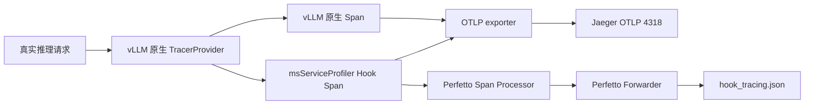

# vLLM Hook Tracing 使用指南

## 1. 功能边界

vLLM Hook Tracing 通过 msServiceProfiler 现有 Hook/YAML 机制，为请求调度、模型执行和输出处理创建 OpenTelemetry Span。

- vLLM 原生 Tracing 是前置条件，必须配置 `--otlp-traces-endpoint`。
- Jaeger：Hook Span 复用 vLLM 的全局 Provider 和 OTLP exporter。
- Perfetto：可选将 msServiceProfiler Hook Span 额外写成 Chrome Trace JSON。
- 不支持 Perfetto-only；启动 Perfetto Forwarder 本身不会创建 Span。
- profiling、metrics、MindIE C++ Trace 和原 OTLP Forwarder 行为不变。
- 本功能没有新增 C/C++ 接口，不需要替换带新增符号的 `.so`。
- 当前及后续版本均不修改 vLLM/vLLM-Ascend 源码或 IPC；只读取上游公开的 `request_id`、`trace_headers` 和业务对象字段。

Tracing 和 profiling 是两套独立交付流程：Tracing 不需要 `enable.json` 和 `parse`；profiling 仍按原流程生成 CSV、DB 和离线 Chrome Trace 等交付件。

## 2. 数据流和地址选择



Jaeger 和 vLLM 位于不同容器时，地址必须按执行位置选择：

| 执行位置 | Jaeger查询地址 | OTLP 地址 |
|---|---|---|
| 宿主机 | `http://127.0.0.1:16686` | `http://127.0.0.1:4318/v1/traces` |
| 与 Jaeger 同一 Docker 自定义网络的 vLLM 容器 | `http://ms-trace-jaeger:16686` | `http://ms-trace-jaeger:4318/v1/traces` |
| Jaeger 与 vLLM 同一容器 | `http://127.0.0.1:16686` | `http://127.0.0.1:4318/v1/traces` |

`127.0.0.1` 始终指向当前进程所在容器或主机，不能跨容器访问另一个服务。

## 3. 埋点配置

Tracing 复用 profiling 的同一份符号 YAML，不存在第二份 Tracing YAML。未设置 `PROFILING_SYMBOLS_PATH` 时使用 msServiceProfiler 包内 default 配置。

```yaml
- symbol: vllm.v1.core.sched.scheduler:Scheduler.schedule
  handler: ms_service_profiler.patcher.vllm.handlers.v1.batch_handlers:schedule
  trace:
    name: vllm.scheduler.schedule
    domain: Schedule
    adapter: schedule
```

同一解析后符号只允许一个有效 `trace` 配置。支持的 Adapter 如下：

| Adapter | 作用 |
|---|---|
| `call` | 普通函数 Span |
| `request` | 注册请求上下文，不创建重复根 Span |
| `request_context` | 从请求对象读取 `trace_headers` |
| `schedule` | 记录批次请求数、Token 数和请求 Links |
| `model` | 记录模型执行并关联批次 request IDs |
| `output` | 记录输出处理并清理已完成请求上下文 |

## 4. 启动原则

### 4.1 Jaeger-only

仅验证 Jaeger 时，不需要运行 `python3 -m ms_service_profiler.trace`。在 vLLM 进程环境中开启 Hook tracing，并为 vLLM 配置原生 OTLP endpoint：

```bash
export MS_TRACE_ENABLE=1
export OTEL_SERVICE_NAME=vllm-server
export OTEL_EXPORTER_OTLP_TRACES_PROTOCOL=http/protobuf
export OTEL_EXPORTER_OTLP_TRACES_ENDPOINT=http://ms-trace-jaeger:4318/v1/traces

vllm serve "$MODEL" \
  --host 0.0.0.0 \
  --port "$PORT" \
  --served-model-name "$MODEL_NAME" \
  --otlp-traces-endpoint http://ms-trace-jaeger:4318/v1/traces
```

### 4.2 Jaeger + Perfetto 双写

Perfetto Forwarder 必须先于 vLLM 启动，确保 Hook backend 初始化时能够注册附加 Processor：

```bash
export TRACE_VERIFY_DIR=/tmp/ms_trace_verify
mkdir -p "$TRACE_VERIFY_DIR"

nohup python3 -m ms_service_profiler.trace \
  --log-level debug \
  --perfetto-output "$TRACE_VERIFY_DIR/hook_tracing.json" \
  >"$TRACE_VERIFY_DIR/perfetto_forwarder.log" 2>&1 &

echo $! >"$TRACE_VERIFY_DIR/perfetto_forwarder.pid"
```

然后按 Jaeger-only 场景启动 vLLM。Jaeger 接收 vLLM 原生 Span 和 Hook Span；Perfetto JSON 只接收 instrumentation scope 为 `ms_service_profiler.hook.*` 的 Hook Span。

`TRACE_VERIFY_DIR` 和 PID 文件只是验证脚本变量，不是产品配置项。

验证时应先确认 Jaeger 与 vLLM 的网络连通性，再按后续章节发送真实推理负载并检查两个数据出口。

## 5. 真实推理负载

`/health` 只用于等待服务就绪，不能用于验证推理 Trace。必须发送 `/v1/completions` 等真实推理请求，例如：

```bash
vllm bench serve \
  --backend vllm \
  --host 127.0.0.1 \
  --port "$PORT" \
  --endpoint /v1/completions \
  --model "$MODEL_NAME" \
  --tokenizer "$MODEL" \
  --dataset-name random \
  --random-input-len 128 \
  --random-output-len 16 \
  --num-prompts 8 \
  --max-concurrency 1 \
  --request-rate 1 \
  --ignore-eos
```

不要把 `VLLM_PLUGINS` 只设置为 `msserviceprofiler`，否则可能过滤掉 `ascend` 平台插件并导致 vLLM 无法识别 NPU。验证时可 `unset VLLM_PLUGINS`，让 vLLM 自动发现全部插件。

## 6. Jaeger 怎么看

### 6.1 搜索页

1. 打开 `http://<宿主机IP>:16686`。
2. Service 选择实际服务名，例如 `vllm-server`。
3. Tags 保持为空，Lookback 选择覆盖压测时间的范围。
4. 将 Limit Results 调大到 200，避免高频 scheduler/model Trace 挤掉 request/output Trace。
5. 点击 **Find Traces**。

散点图横轴是开始时间，纵轴是 Trace 总时长。明显高于正常分布的点通常是性能异常候选。列表中的 Spans 表示该 Trace 包含的 Span 数量，Duration 表示端到端或当前 Trace 的总时长。

### 6.2 Trace 详情页

点击一条 Trace 后重点观察：

| 观察项 | 分析价值 |
|---|---|
| 父子 Span 时间线 | 判断耗时发生在调度、模型执行还是输出处理 |
| Span 自身耗时 | 区分模型计算慢与框架处理慢 |
| 同级 Span 的空白间隔 | 识别排队、同步、IPC 或等待资源的时间 |
| Tags/Attributes | 查看 `request.id(s)`、batch、token、状态和进程/线程信息 |
| References/Links | 查看跨请求批处理或跨进程关联；Link 不等同于父子关系 |
| Error/Status | 定位异常请求和失败阶段 |

典型埋点含义：

| Span | 主要定位方向 |
|---|---|
| `vllm.scheduler.schedule` | 调度频率、调度耗时、请求排队、batch 组织 |
| `vllm.model.execute` | Executor 层模型执行耗时 |
| `vllm_ascend.model_runner.execute` | Ascend ModelRunner 实际执行耗时 |
| `vllm.output.process` | 输出处理、请求完成和后处理耗时 |

### 6.3 常见性能判断

- scheduler Span 持续升高、model Span 稳定：重点检查排队、KV Cache 压力、batch 组织和调度策略。
- model Span 占绝大多数且随 batch 增大明显升高：重点检查模型计算、通信、算子和 NPU 利用率，并与 profiling 结果结合。
- `vllm.model.execute` 明显大于其内部 `vllm_ascend.model_runner.execute`：Executor 外围可能存在 IPC、同步或数据准备开销。
- output Span 异常升高：重点检查输出处理、token 后处理、网络回传和请求完成逻辑。
- 少数 Trace 是长尾：在散点图选中长尾 Trace，与正常 Trace 使用 Compare 对比 Span 时长和属性差异。
- 大量 Trace 只有 1～2 个 Span：只能证明埋点已导出，不能单独证明完整请求父子链；需要继续检查 Trace 详情中的 Links、`request.ids` 和原生 vLLM 根 Span。

Tracing 用于缩小问题所在阶段；若需要分析算子、kernel、HCCL、显存或 NPU 时间线，继续使用原 profiling 采集和解析能力。

## 7. 验收层级

| 层级 | 判定依据 |
|---|---|
| 数据出口通过 | Jaeger API有 Trace，Perfetto JSON 有合法 Complete Event |
| 埋点展示通过 | Jaeger/Perfetto 能看到预期 Hook Span 名称和耗时 |
| 请求关联通过 | request、schedule、model、output 可通过父子关系、同一 trace ID 或明确 Span Links 关联 |
| 性能分析有效 | 能用 Span 时长和属性区分调度、模型、输出或等待瓶颈，并可下钻 profiling |

不能用“Jaeger 页面有数据”替代“完整请求链路关联通过”的结论。

## 8. Profiling 共存验证

Profiling 仍必须按原流程配置 `enable.json`、指定采集目录并执行 `parse`。Tracing 不替代该流程。

建议分别验证：

1. 只开 profiling：交付件和历史版本一致。
2. 只开 tracing：Jaeger 中出现原生 Span 和 Hook Span；若启动 Perfetto Forwarder，JSON 非空。
3. profiling + tracing：推理成功，两类交付件均生成；Tracing Span 会包含少量 profiling handler 开销。

## 9. 常见问题

| 现象 | 原因与处理 |
|---|---|
| `ms-trace-jaeger` 无法解析 | 命令在宿主机执行，或两个容器不在同一 Docker 自定义网络；宿主机改用 `127.0.0.1` |
| `docker exec ... python3 - <<'PY'` 无输出 | heredoc 需要 `docker exec -i` 才会把标准输入传入容器 |
| 路径展开成 `/vllm_tracing.log` | 当前 shell 没有设置 `TRACE_VERIFY_DIR`；先检查变量非空 |
| 容器内看不到另一个容器的 `/tmp` 文件 | 进入了错误容器；始终使用唯一的 `VLLM_CONTAINER` 变量 |
| Python 加载 `/usr/local/Ascend/.../site-packages` | 验证的是已安装包；验证工作区代码时显式设置 `PYTHONPATH=<仓库根目录>` |
| `pkill -9 386` 无法停止 PID 386 | `pkill` 参数是名称模式；按 PID 使用 `kill -TERM 386` |
| Perfetto JSON 是空数组 | Forwarder 启动过晚、未运行，或 vLLM 未开启原生 OTLP tracing |
| Jaeger 可用但 Perfetto 文件不存在 | 两个出口独立；检查 vLLM 容器内 Forwarder 进程和日志 |
| vLLM 无法识别 NPU | 不要将 `VLLM_PLUGINS` 限制为单个 msserviceprofiler 插件；同时检查 `ASCEND_RT_VISIBLE_DEVICES` |
| Jaeger Trace 只有 1～2 个 Span | 检查上下文传播、Span Links 和 `request.ids`；不要直接宣称完整请求链通过 |

## 10. 异常行为

| 场景 | 行为 |
|---|---|
| vLLM 未配置 `--otlp-traces-endpoint` | 无可复用全局 Provider，Hook tracing no-op，并提示开启 vLLM 原生 Tracing |
| OpenTelemetry 依赖缺失 | Hook tracing no-op，推理继续 |
| Jaeger 不可用 | vLLM exporter 按自身策略处理，推理和 Hook 调用继续 |
| Perfetto Forwarder 未启动 | 不注册 Perfetto Processor，Jaeger 不受影响 |
| 部分 YAML 符号不存在 | 跳过该 Hook，其他 Hook 继续 |
| profiling 同时开启 | tracing 包在 profiling 外层，原业务函数只执行一次 |
