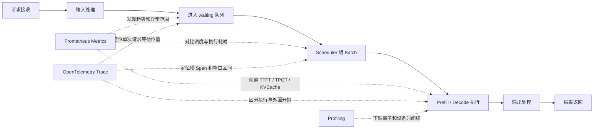

# vLLM-Ascend 可观测性性能诊断指南

## 1. 文档目标

本文给出一套基于 Metrics 和 Tracing 的性能问题诊断流程。完成本文操作后，开发者能够独立完成以下工作：

1. 使用 Metrics 确认性能问题的影响范围和异常阶段。
2. 从异常时间窗口中选择需要分析的 Trace。
3. 使用 Span 时长、父子关系、空白区间和属性定位瓶颈阶段。
4. 使用相同负载完成优化前后的对比验证。

本文适用于 vLLM-Ascend 在线推理服务。算子、Kernel、HCCL 和设备时间线不属于 Metrics 与 Tracing 的定位范围；问题收敛到模型执行或通信阶段后，继续使用 msServiceProfiler 的 Profiling 能力下钻。

## 2. 诊断对象

### 2.1 请求生命周期

一次推理请求依次经过请求接收、输入处理、调度、模型执行、输出处理和结果返回。各阶段与观测数据的关系如下。



### 2.2 Metrics 与 Tracing 的分工

| 数据 | 解决的问题 | 适合的分析范围 | 不能单独证明的结论 |
|---|---|---|---|
| Metrics | 何时变慢、哪些实例变慢、影响多少请求 | 分钟级趋势、分位数、容量、错误和实例差异 | 单个请求在哪个函数等待 |
| Tracing | 某个请求慢在哪个阶段、阶段之间如何关联 | 单请求、单 Batch、跨进程 Span 关系 | 问题在全部请求中的占比 |
| Profiling | 模型执行内部哪个算子、通信或 Kernel 慢 | Host、Device、算子和通信时间线 | 在线问题的持续范围 |

Metrics 和 Tracing 是两条可以独立执行的分析路径，也可以在数据齐全时联合使用：

| 分析路径 | 入口 | 可以形成的结论 |
|---|---|---|
| Metrics 独立分析 | SLO 告警、压测结果或 Grafana 异常 | 异常时间、影响范围、容量或阶段级瓶颈；不能说明某个请求的具体调用链 |
| Tracing 独立分析 | Trace ID、request ID、服务日志或 Jaeger 长尾 Trace | 目标请求的关键路径、慢 Span、等待位置和错误传播；不能说明该问题在全部请求中的占比 |
| Metrics + Tracing 联合分析 | Metrics 异常窗口与关联 Trace | 同时确认问题范围和请求级路径，证据覆盖面最完整 |

选择哪条路径由当前问题和现有数据决定，不把 Metrics 设为 Tracing 的前置条件，也不把 Tracing 设为 Metrics 根因判断的必选条件。

## 3. 开始分析前的准备

### 3.1 固定对比条件

优化前后必须保持以下条件一致：

- 模型、vLLM、vLLM-Ascend、CANN 和 msServiceProfiler 版本。
- NPU 型号、卡数、并行配置和实例数。
- 输入长度、输出长度、并发、请求到达方式和压测时长。
- 服务启动参数、环境变量和采样配置。
- 预热请求数量以及统计窗口。

版本、负载或资源发生变化时，数据不能直接作为同一基线比较。

### 3.2 记录诊断上下文

每次分析先记录以下信息：

| 项目 | 记录内容 |
|---|---|
| 问题时间 | 起止时间和时区 |
| 影响范围 | 实例、DP 域、Rank、请求类型 |
| SLO | TTFT、TPOT、端到端时延、吞吐中的异常项 |
| 负载 | 并发、QPS、输入/输出 Token 分布 |
| 版本 | vLLM、vLLM-Ascend、CANN、msServiceProfiler |
| 配置变更 | 服务参数、路由、并行、显存和调度配置 |
| 对照窗口 | 同负载下的正常时间窗口 |

没有正常窗口时，先在固定负载下采集一轮基线，再开始故障分析。

### 3.3 检查观测链路

Tracing 依赖 vLLM V1 引擎的原生 OpenTelemetry 能力。为减少旧版本维护成本，本资料中 Hook Tracing 的支持策略下限为 vLLM-Ascend `v0.20.0`；实际安装时必须从官方兼容矩阵选择完整组合，首个满足该边界的公开组合为 vLLM-Ascend `v0.20.2rc1` 与 vLLM `v0.20.2`。版本依据、Jaeger 部署、启动参数、网络调试和验证方法参见[《vLLM Hook Tracing 使用指南》](./vLLM_hook_tracing_instruct.md)。Metrics 独立分析不以该 Tracing 版本条件为前置要求。

| 检查项 | 通过标准 | 失败后的处理 |
|---|---|---|
| Metrics 数据出口 | `/metrics` 中存在本次分析所需指标 | 检查指标采集状态、Prometheus 多进程目录和版本符号 |
| Tracing 数据出口 | Jaeger 中存在目标服务和真实推理 Trace | 检查 `--otlp-traces-endpoint`、`MS_TRACE_ENABLE=1` 和网络 |
| Hook Span | Jaeger 中存在目标 scheduler、model 或 output Span | 检查 YAML 符号是否命中当前版本 |
| 请求关联 | 父子关系、同一 Trace ID、Links、`request.ids` 至少一项成立 | 只做阶段级分析，切换到 Perfetto 或 Profiling 完成时序归因 |
| 节点时间 | Metrics、Jaeger 和服务日志使用同一时区 | 统一时区并同步节点时钟 |

Metrics 数据出口未通过时，停止 Metrics 路径，Tracing 仍可独立分析。Tracing 数据出口未通过时，停止 Tracing 路径，Metrics 仍可独立分析。请求关联未通过时，Tracing 只做操作级或阶段级统计，不能输出请求级链路结论。

## 4. 联合诊断流程

本章描述 Metrics 和 Tracing 数据同时可用时的联合流程。只使用 Metrics 时执行步骤 1～3，并按第 5 章形成指标证据；只使用 Tracing 时从步骤 4 进入，并按第 6 章完成请求级定位。两条独立路径都需要执行步骤 7 的单变量复测。

### 步骤 1：确定异常 SLO

先判断异常发生在首 Token、后续 Token、端到端时延还是吞吐：

| 现象 | 首查方向 |
|---|---|
| TTFT 升高，TPOT 稳定 | 输入处理、waiting、Scheduler、Prefill、KVCache |
| TTFT 稳定，TPOT 升高 | Decode、模型执行、采样、通信 |
| TTFT 和 TPOT 同时升高 | 全局负载、模型执行、资源竞争、实例偏斜 |
| P99 升高，P50 稳定 | 少量长请求、热点实例、抢占、重计算、异常依赖 |
| 吞吐下降且 NPU 利用率低 | Scheduler、Host 下发、IPC、同步等待 |
| 吞吐下降且 NPU 持续满载 | 模型计算、通信、Batch 或 Token 规模 |

### 步骤 2：检查负载是否变化

对比异常窗口与正常窗口的请求数、输入 Token、输出 Token、Batch 大小和请求阶段。负载发生变化时，先按相同输入/输出长度、并发和阶段分组，再比较时延。

当负载保持一致而耗时指标上升时，性能变化来自服务执行路径或运行环境；当耗时随 Token 数或 Batch 增长时，继续判断增长是否符合基线关系。

### 步骤 3：使用 Metrics 完成一级定界

本步骤使用的 TTFT、TPOT 是 ms-service-metric 当前 vLLM 适配器注册的指标。文档中的逻辑名与 Prometheus 暴露序列对应如下：

| 逻辑名 | 类型 | Prometheus 暴露序列 | 数据来源 |
|---|---|---|---|
| `fine_grained_ttft` | Histogram | `vllm_profiling_fine_grained_ttft_bucket/_sum/_count` | vLLM `IterationStats.time_to_first_tokens_iter` |
| `fine_grained_tpot` | Histogram | `vllm_profiling_fine_grained_tpot_bucket/_sum/_count` | vLLM 已完成请求的 `mean_time_per_output_token` |
| `engine:generate:duration` | Histogram | `vllm_profiling_engine:generate:duration_bucket/_sum/_count` | `AsyncLLM.generate` 的引擎侧生成耗时 |

`engine:generate:duration` 是服务端引擎侧耗时，不等同于压测客户端观测到的请求端到端耗时。客户端端到端 SLO 使用压测工具结果，两者不得混用。

一级定界按以下顺序执行：

1. 查看 `fine_grained_ttft`、`fine_grained_tpot`、`engine:generate:duration` 和压测客户端端到端时延，确认受影响的 SLO，并区分服务端引擎耗时与客户端总时延。
2. 查看 `waiting_batch_size`、`batch_size` 和 `scheduler:duration`，判断排队和调度是否异常。
3. 查看 `free_kvcache_blocks`、`allocated_kvcache_blocks`、`block_allocate_failures` 和重计算/回退计数，判断 KVCache 是否限制调度。
4. 查看 `executor:execute_model:duration`、`executor:model_runner_execute_model:duration` 和 `npu:forward_duration`，判断模型执行是否变慢。
5. 按 `instance`、`dp`、`phase`、`rank` 等标签拆分，确认问题是全局问题还是局部热点。

Metrics 证据完整时，输出请求入口、调度、KVCache、模型执行、输出处理、异常状态或实例负载不均中的明确分类；证据不足时记录已经排除和仍待检查的阶段。

### 步骤 4：选择 Trace 分析对象

Tracing 独立分析时，使用 Trace ID、request ID、服务日志时间或 Jaeger 中的长尾点找到目标 Trace。联合分析时，使用 Metrics 给出的异常时间、实例、DP 域和请求阶段缩小 Jaeger 查询范围。

具备正常基线时，选择同一服务下的两组观测数据：

- 异常组：异常窗口内的目标请求根 Trace，或通过 Links/`request.ids` 关联的 Hook Span 集合。
- 对照组：相同请求类型、Token 规模、Batch 和阶段下的正常观测组。

用于回归对比的请求规模必须一致。没有正常基线时，仍可根据单条 Trace 的父子关系、关键路径、Error/Status 和 Span 属性定位该请求内部的耗时位置，但不能输出“相对基线变慢”的结论。

### 步骤 5：使用 Tracing 定位请求路径

先判断 Span 关联形态，再按固定顺序检查：

1. 检查根 Span 总时长，确认它覆盖目标请求。
2. 检查 `request.id`、`request.ids`、Trace ID 和 Span Links，确认跨请求、跨 Batch 或跨进程关联。
3. 同一 Trace ID 场景直接检查父子 Span；Span Links 场景沿 Link 分别打开关联 Span。
4. 检查 `vllm.scheduler.schedule`，确认调度耗时和调度频率。
5. 检查 `vllm.model.execute` 与 `vllm_ascend.model_runner.execute`，区分 Executor 外围开销和 ModelRunner 执行耗时。
6. 检查 `vllm.output.process`，确认输出处理是否形成长尾。
7. 只有同一 Trace ID 或统一 Perfetto Timeline 才分析 Span 间空白，定位排队、同步和 IPC 等待区间。
8. 检查 Error/Status，确认异常请求是否与性能问题重合。

父 Span 的总时长包含子 Span。判断父阶段自身开销时，要结合子 Span 时长和空白区间，不能把父 Span 总时长全部计为父函数自身耗时。

单个 Hook Span 最多记录 128 个 `request.ids` 和 Span Links。Batch 请求数超过 128 时，使用 `batch.request_count`、`batch.scheduled_tokens`、Metrics 聚合和 Perfetto/Profiling 数据完成 Batch 级分析。

### 步骤 6：形成证据链

按实际使用的分析路径形成证据链：

| 分析路径 | 结论所需证据 | 结论边界 |
|---|---|---|
| Metrics 独立分析 | SLO 变化、至少两类同步变化的阶段/容量指标、相邻阶段排除证据 | 可输出总体或实例级阶段结论，不输出单请求调用链结论 |
| Tracing 独立分析 | 目标请求身份、完整关联关系、关键 Span/错误/同一时间线等待证据 | 可输出目标请求的路径结论，不外推到全部请求 |
| 联合分析 | SLO 现象、Metrics 定界、Trace 定位三类证据相互对应 | 可同时输出影响范围和请求级根因 |

联合分析示例：`waiting_batch_size` 和 `scheduler:duration` 同步升高，模型执行指标保持基线；异常观测组的 scheduler Span 变长，model Span 与对照组一致。该证据链将瓶颈定位在调度阶段。

### 步骤 7：单变量优化并复测

一次只修改一类参数或一个实现点。使用与基线完全相同的负载复测，并检查当前路径能够观测的数据：

- 目标 SLO 是否恢复。
- 使用 Metrics 时，目标阶段指标是否恢复。
- 使用 Tracing 时，对应 Span 或同一时间线空白区间是否缩短。
- 吞吐、错误率、显存和其他 SLO 是否出现回退。

目标现象恢复、当前分析路径的直接证据恢复且没有引入其他回退后，诊断闭环结束。Metrics 和 Tracing 同时可用时，两类证据都需要复测。

## 5. Metrics 分析方法

### 5.1 正确读取指标类型

| 类型 | 读取方式 | 典型错误 |
|---|---|---|
| Gauge | 直接查看当前值、最小值、最大值和实例差异 | 对 Gauge 使用 `rate()` |
| Counter | 使用 `rate()` 查看速率，使用 `increase()` 查看窗口增量 | 直接把累计值当作当前故障次数 |
| Histogram | 使用 `_bucket` 计算分位数，使用 `_sum/_count` 计算平均值 | 直接比较 `_sum` 或 `_count` |

### 5.2 常用 PromQL

以下查询使用工具实际导出的 `vllm_profiling_` 前缀。`instance`、`dp`、`phase` 等筛选条件按部署环境补充。

#### 调度耗时 P99

```promql
histogram_quantile(
  0.99,
  sum by (le, instance, dp) (
    rate(vllm_profiling_scheduler:duration_bucket[5m])
  )
)
```

#### 模型执行平均耗时

```promql
sum by (instance, dp, phase) (
  rate(vllm_profiling_executor:execute_model:duration_sum[5m])
)
/
sum by (instance, dp, phase) (
  rate(vllm_profiling_executor:execute_model:duration_count[5m])
)
```

#### KVCache 使用率

```promql
100 * (
  1 -
  vllm_profiling_free_kvcache_blocks
  /
  vllm_profiling_total_kvcache_blocks
)
```

#### KVCache 分配失败增量

```promql
sum by (instance, dp) (
  increase(vllm_profiling_block_allocate_failures_total[5m])
)
```

#### 请求从 running 回退到 waiting 的增量

```promql
sum by (instance, dp) (
  increase(vllm_profiling_running_to_waiting_count_total[5m])
)
```

#### 调度重计算增量

```promql
sum by (instance, dp) (
  increase(vllm_profiling_scheduler:recompute_events_total[5m])
)
```

Histogram 的分位数按目标标签聚合时必须保留 `le`。平均耗时查询的 `_sum` 和 `_count` 必须使用相同的窗口和标签集合。

### 5.3 组合判断规则

单个指标只能说明状态，根因依靠指标组合确认。

| 指标组合 | 定界结论 | 下一步 |
|---|---|---|
| TTFT 升高；waiting 升高；模型执行稳定 | 请求耗时增加在模型执行之前 | 查 scheduler、KVCache 和同一 Trace/Perfetto 时间线空白区间 |
| waiting 升高；scheduler P99 升高；NPU 利用率低；model 耗时稳定 | 调度或 Host 路径是瓶颈 | 对比 scheduler Span 和 model Span |
| free blocks 持续低位；分配失败增加；waiting 与 TTFT 同步升高 | KVCache 容量限制请求进入执行阶段 | 查长请求、并发、显存配置和实例偏斜 |
| TPOT 升高；execute model 与 forward 同步升高；scheduler 稳定 | 模型执行阶段变慢 | 对比 model Span，继续下钻 Profiling |
| execute model 升高；model runner 稳定 | Executor 外围存在额外耗时 | 查 IPC、同步和数据准备 |
| output processor 升高；model 稳定 | 输出处理阶段变慢 | 查输出处理 Span、token 后处理和返回链路 |
| 只有部分 dp/rank 异常 | 局部负载或资源不均 | 对比异常与正常 dp/rank 的请求和 Token 规模 |

“持续低位”和“升高”均以同负载正常窗口为基线，并要求异常覆盖连续采集点。单个采集点不作为根因证据。

## 6. Tracing 分析方法

### 6.1 Span 与定位方向

| Span | 实际埋点位置 | 定位方向 |
|---|---|---|
| vLLM 原生请求根 Span | vLLM 原生 Tracing | 请求入口和端到端上下文 |
| `vllm.scheduler.schedule` | `Scheduler.schedule` | 调度耗时、Batch 组织和请求关联 |
| `vllm.model.execute` | Executor `execute_model` | Executor 层总执行耗时 |
| `vllm_ascend.model_runner.execute` | `NPUModelRunner.execute_model` | Ascend ModelRunner 执行耗时 |
| `vllm.output.process` | `OutputProcessor.process_outputs` | 输出处理和请求完成 |

Hook Span 名称来自默认 `service_profiling_symbols.yaml`，符号受版本约束。`AsyncLLM.add_request` 上的 `request` 适配器只注册 vLLM 原生请求上下文，不创建重复的 `vllm.request` 根 Span。缺少某个 Span 时，先检查当前版本是否命中对应符号，再检查 Hook 日志和上下文传播。

### 6.2 正常观测组与异常观测组的比较方法

正常观测组与异常观测组分别记录 Trace 总时长、scheduler/model/model runner/output Span、同一时间线的最大空白区间和 request/batch 属性，并计算差值、填写结论。记录格式使用第 8 章模板。

同一 Trace ID 场景中，差值必须能够解释 Trace 总时长的主要变化。Span Links 场景分别比较关联 Span 的时间戳和耗时，不把不同 Trace 在 Jaeger 页面上的间隔解释为等待。无法解释时，继续检查未插桩区间或进入 Profiling 分析。

### 6.3 常见链路形态

- scheduler Span 变长、model Span 不变：调度器自身执行变慢。
- scheduler Span 不长，但同一 Trace 或 Perfetto Timeline 中请求到 model 的空白变长：请求在排队、同步或等待资源。
- `vllm.model.execute` 变长，`vllm_ascend.model_runner.execute` 同步变长：耗时进入 ModelRunner 执行阶段。
- `vllm.model.execute` 变长，ModelRunner Span 不变：耗时位于 Executor 外围，检查 IPC、同步和数据准备。
- output Span 变长、model Span 不变：输出处理形成长尾。
- Trace 只有少量 Span 且缺少请求关联：链路不完整，不能用于阶段耗时归因。

### 6.4 从 Metrics 跳转到 Trace

Metrics 和 Trace 的关联使用同一异常时间窗口，并优先使用 `request.id`、`request.ids` 和业务侧传入的 Trace 上下文。没有请求级指标时，按以下条件缩小范围：

1. 使用 Metrics 确定异常开始和结束时间。
2. 使用实例、DP、阶段和错误状态确定异常分组。
3. 在 Jaeger 中限定服务、时间和最小时长。
4. 从根 Trace 或 Hook Span 中选择与异常分组一致的观测组。
5. 先确认父子关系或 Span Links，再选择同窗口、同分组的正常观测组作为对照。

## 7. 典型案例

### 7.1 新测评数据集触发 KVCache 容量瓶颈

完整案例参见[新测评数据集触发 KVCache 容量瓶颈](./best_practices/kv_block_shortage.md)。这是一个真实 Metrics 定界案例，历史原始数据没有保留，文档不补写数值、截图或 Trace 结论。可复用证据链如下：

1. 更换测评数据集后，TTFT 和 TPOT 同时劣化。
2. waiting 队列在同一窗口增长。
3. `free_kvcache_blocks` 持续接近 0。
4. `scheduler:recompute_events` 持续增加，调度器频繁触发重计算。
5. 新数据集在原并发下的 KVCache 需求超过单实例稳定容量。
6. 单变量降低并发，并使用同一新数据集复测水位、重计算、TTFT、TPOT 和吞吐。

### 7.2 动态 EPLB 开启后投机推理接受率下降

完整案例参见[动态 EPLB 开启后投机推理接受率下降](./best_practices/speculative_acceptance_rate_with_dynamic_eplb.md)。标准证据链如下：

1. 未开启动态 EPLB 时，各实例投机推理接受率曲线集中且稳定。
2. 开启动态 EPLB 后，接受率曲线分散、整体下移，部分实例降至接近 0。
3. `num_spec_tokens`、数据集、请求顺序、并发、采样参数、版本和并行配置保持一致。
4. 接受率下降与 TPOT 或输出 Token 吞吐劣化在同一窗口对齐。
5. waiting、KVCache、模型执行和服务错误没有形成对应异常，排除相邻阶段。
6. 关闭动态 EPLB，复测接受率、性能和输出正确性。

该案例的现有证据支持配置级结论：动态 EPLB 是当前组合的回退触发条件。代码级原因需要逐步 accepted Token、专家映射更新和 Rank 间一致性数据，文档不作无证据推断。

### 7.3 Scheduler 耗时过长导致吞吐下降

完整案例参见[scheduler耗时过长](./best_practices/scheduler_high_latency.md)。标准证据链如下：

1. waiting 持续增长，running 未达到配置上限，NPU 利用率低。
2. `scheduler:duration` P99 升高，模型执行相关指标保持基线。
3. 异常观测组的 `vllm.scheduler.schedule` 明显长于同负载正常观测组。
4. `vllm.model.execute` 和 `vllm_ascend.model_runner.execute` 与正常观测组接近。
5. 统一 Timeline 或 Profiler 数据显示调度阶段存在稳定空白区间。
6. 优化调度逻辑、CPU 资源或下发模式后，scheduler P99、waiting、吞吐和 NPU 利用率同时恢复。

## 8. 诊断记录模板

复制以下模板记录一次完整分析：

```text
问题：
分析路径：Metrics / Tracing / 联合分析
异常时间窗口：
正常对照窗口：
环境与版本：
负载条件：

1. SLO 现象
- 异常指标：
- 异常范围：
- 与基线的差异：

2. Metrics 定界
- 本路径是否使用 Metrics：
- 使用的指标：
- 同步变化关系：
- 定界阶段：
- 排除的阶段及证据：

3. Tracing 定位
- 本路径是否使用 Tracing：
- 异常观测组（Trace ID、Links 或 request.ids）：
- 对照观测组（Trace ID、Links 或 request.ids）：
- 主要 Span 差异：
- 同一 Trace/Perfetto 时间线空白区间或属性差异：

4. 根因
- 根因：
- 结论覆盖范围：总体/实例/观测请求
- 现象证据：
- 定界证据：
- 定位证据：

5. 处理与复测
- 单变量修改：
- SLO 复测结果：
- Metrics 复测结果：
- Trace 复测结果：
- 副作用检查：
```

未使用的数据项填写“不适用”。Metrics 独立分析不补写 Trace 证据，Tracing 独立分析不补写指标趋势。

## 9. 数据可信度检查

出现以下情况时，先修复观测链路，再进行性能归因：

| 情况 | 处理 |
|---|---|
| Metrics 在目标窗口无采样点 | 检查抓取目标、抓取间隔、服务重启和多进程目录 |
| Counter 在进程重启后归零 | 使用 `rate()` 或 `increase()`，并按实例和进程拆分 |
| Histogram 缺少 `_bucket` | 不能计算分位数，改用 `_sum/_count` 计算平均值 |
| Trace 只有 1～2 个 Span | 检查上下文传播、Span Links、OTLP 配置和 Hook 命中情况 |
| Span 时间顺序异常 | 统一节点时钟并检查时区，跨节点空白区间不直接用于归因 |
| Metrics 与 Trace 时间不一致 | 统一使用同一时区和绝对时间记录异常窗口 |
| 异常 Trace 与正常 Trace 请求规模不同 | 重新选择相同 Token 规模、Batch 和阶段的对照数据 |

## 10. 性能、安全与兼容性

### 10.1 采集开销

- Metrics 标签只使用有限集合。不得把 request ID、完整 URL、prompt 或任意用户输入作为 Metrics 标签。
- Tracing 采样率按诊断目标设置。全量采样只用于受控压测窗口，完成诊断后恢复生产采样策略。
- 同时开启 Profiling 和 Tracing 时，先用固定负载测量采集开销，再解释业务性能数据。

### 10.2 数据安全

- Trace 属性只记录定位需要的 request ID、Batch、Token 数、状态和阶段信息。
- 不记录 prompt、生成内容、鉴权头、Cookie、Token 和用户隐私数据。
- Prometheus、Jaeger 和 OTLP 端口只对管理网络或授权客户端开放。
- 分享 Trace、截图和诊断记录前，对 request ID、IP、主机名和业务标识进行脱敏。

### 10.3 版本兼容

- 指标名称以当前版本 `/metrics` 实际输出为准，默认指标均带 `vllm_profiling_` 前缀。
- Span 是否存在由当前版本命中的 Hook 符号决定。升级 vLLM 或 vLLM-Ascend 后，分别验证计划使用的 Metrics 或 Tracing 数据出口；使用 Tracing 请求级分析时额外验证请求关联。
- 文档中的组合判断不依赖固定硬件阈值，继续适用于后续版本；新增或重命名指标时，需要同步更新指标表、PromQL、案例和导航。

## 11. 新开发者验收

验收分成两个独立任务，不要求两类数据来自同一次故障：

1. Metrics 任务：提供正常、异常指标窗口。新开发者指出受影响的 SLO，使用至少三项同步变化的指标完成阶段定界，排除至少一个相邻阶段，并给出单变量处理方案和复测指标。
2. Tracing 任务：提供一个目标 Trace ID 或 request ID 以及对应 Trace 数据。新开发者确认请求关联，定位关键路径或错误阶段，说明结论覆盖范围，并给出处理后的 Trace 复测项。

两个任务的结论都与数据一致，即通过验收。数据同时包含 Metrics 和 Trace 时，可以增加联合分析任务，检查异常范围与请求路径是否相互印证。验收记录使用第 8 章模板，未使用的数据项填写“不适用”，不得为了填满模板补写证据。

## 12. 相关文档

- [vLLM 服务化 Prometheus 数据监测工具使用指南](./vLLM_metrics_tool_instruct.md)
- [vLLM Hook Tracing 使用指南](./vLLM_hook_tracing_instruct.md)
- [vLLM 服务化性能采集工具使用指南](./vLLM_service_oriented_performance_collection_tool.md)
- [msServiceProfiler 典型案例](./best_practices/README.md)
